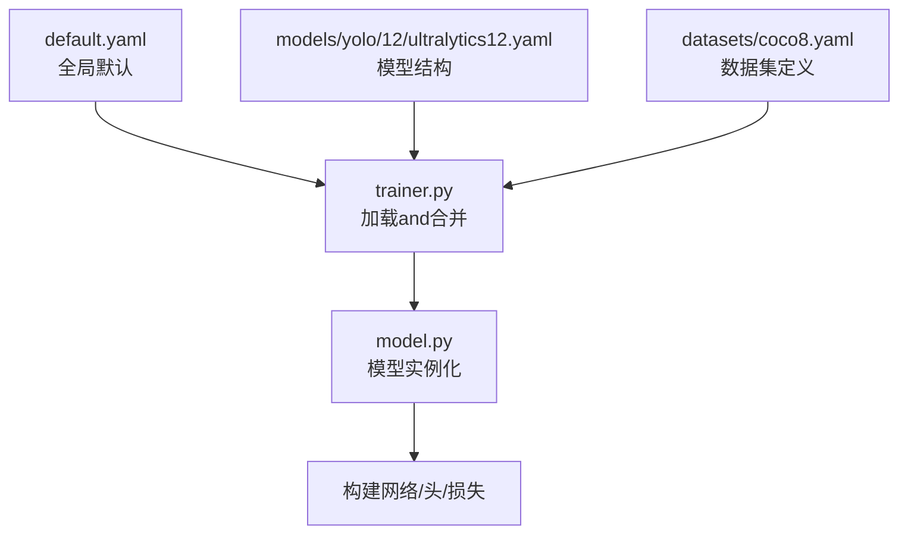
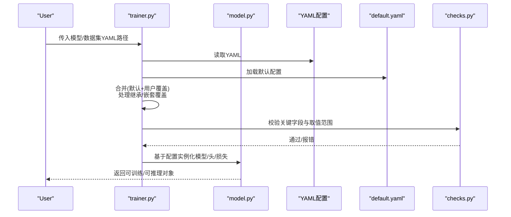
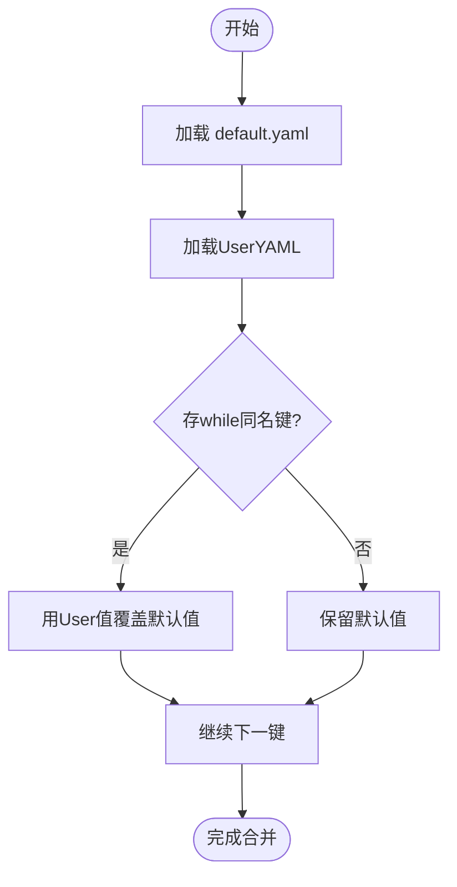
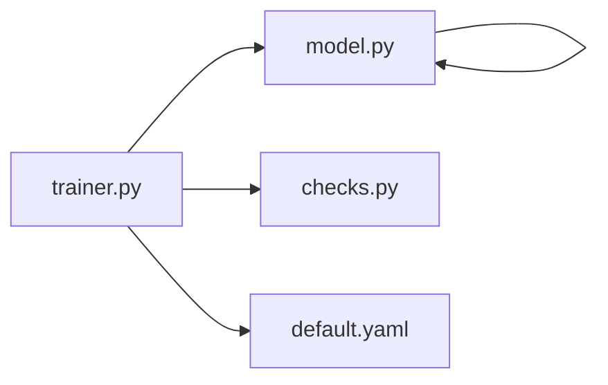

# 模型配置系统

<cite>
**Files Referenced in This Document**
- [ultralytics/cfg/default.yaml](file://ultralytics/cfg/default.yaml)
- [ultralytics/cfg/__init__.py](file://ultralytics/cfg/__init__.py)
- [ultralytics/cfg/models/yolo/12/ultralytics12.yaml](file://ultralytics/cfg/models/yolo/12/ultralytics12.yaml)
- [ultralytics/cfg/datasets/coco8.yaml](file://ultralytics/cfg/datasets/coco8.yaml)
- [ultralytics/engine/trainer.py](file://ultralytics/engine/trainer.py)
- [ultralytics/engine/model.py](file://ultralytics/engine/model.py)
- [ultralytics/utils/checks.py](file://ultralytics/utils/checks.py)
- [examples/lora_examples/yolo_master_lora.yaml](file://examples/lora_examples/yolo_master_lora.yaml)
- [scripts/coco2017.yaml](file://scripts/coco2017.yaml)
</cite>

## Table of Contents
1. [Introduction](#Introduction)
2. [Project Structure](#Project Structure)
3. [Core Components](#Core Components)
4. [Architecture Overview](#Architecture Overview)
5. [Detailed Component Analysis](#Detailed Component Analysis)
6. [Dependency Analysis](#Dependency Analysis)
7. [Performance Considerations](#Performance Considerations)
8. [Troubleshooting Guide](#Troubleshooting Guide)
9. [Conclusion](#Conclusion)
10. [Appendix](#Appendix)

## Introduction
本文件targeting“模型配置系统”，聚焦于YAML配置文件的语法and层次结构、参数语义（模型结构、Training超参、Data Augmentationetc.）、继承and覆盖机制、Validationand默认值管理、自定义模板and扩展、调试方法and常见问题，Centered onand不同Tasks类型的标准配置Examplesand调优建议。DocumentationCentered on仓库中实际存while的配置文件and加载逻辑for依据，帮助读者快速上手并安全地定制TrainingandInference流程。

## Project Structure
配置系统围绕Centered on下关键位置组织：
- 全局默认配置：位于 ultralytics/cfg/default.yaml，provides通用默认值and常用开关。
- 模型配置：位于 ultralytics/cfg/models/<task>/<name>.yaml，描述网络结构andTasks相关参数。
- 数据集配置：位于 ultralytics/cfg/datasets/*.yaml，定义路径、类别数、标签格式etc.。
- 运行时加载入口：由Engine Layerwhile启动时读取并解析配置，合并默认值andUser覆盖。

Figure Source
- [ultralytics/cfg/default.yaml](file://ultralytics/cfg/default.yaml)
- [ultralytics/cfg/models/yolo/12/ultralytics12.yaml](file://ultralytics/cfg/models/yolo/12/ultralytics12.yaml)
- [ultralytics/cfg/datasets/coco8.yaml](file://ultralytics/cfg/datasets/coco8.yaml)
- [ultralytics/engine/trainer.py](file://ultralytics/engine/trainer.py)
- [ultralytics/engine/model.py](file://ultralytics/engine/model.py)

Section Source
- [ultralytics/cfg/default.yaml](file://ultralytics/cfg/default.yaml)
- [ultralytics/cfg/models/yolo/12/ultralytics12.yaml](file://ultralytics/cfg/models/yolo/12/ultralytics12.yaml)
- [ultralytics/cfg/datasets/coco8.yaml](file://ultralytics/cfg/datasets/coco8.yaml)
- [ultralytics/engine/trainer.py](file://ultralytics/engine/trainer.py)
- [ultralytics/engine/model.py](file://ultralytics/engine/model.py)

## Core Components
- 全局默认配置（default.yaml）
  - 作用：forTraining、Export、Visualization、Loggingetc.provides统一默认值；作for所有配置的基线。
  - 典型字段类别：Training循环、Optimizer、Learning Rate调度、EMA、Mixture精度、保存策略、Visualization、Export选项etc.。
  - Refer to路径：[ultralytics/cfg/default.yaml](file://ultralytics/cfg/default.yaml)

- 模型配置（models/yolo/.../*.yaml）
  - 作用：声明网络深度/宽度、通道数、Modules组合、Tasks头数量and类别数etc.。
  - 典型字段类别：输入尺寸、类别数、骨干/颈部/头部结构、锚点或无锚设置、损失权重etc.。
  - Refer to路径：[ultralytics/cfg/models/yolo/12/ultralytics12.yaml](file://ultralytics/cfg/models/yolo/12/ultralytics12.yaml)

- 数据集配置（datasets/*.yaml）
  - 作用：指定Training/Validation/测试集路径、类别映射、标注格式、Data Augmentation参数etc.。
  - 典型字段类别：train/val/test路径、nc类别数、names类别名列表、augment增强开关and强度etc.。
  - Refer to路径：[ultralytics/cfg/datasets/coco8.yaml](file://ultralytics/cfg/datasets/coco8.yaml)

- 运行时加载and合并（trainer.py / model.py）
  - 作用：从YAML加载配置，应用默认值，处理继承and覆盖，校验关键字段，构造模型andTrainer。
  - Refer to路径：
    - [ultralytics/engine/trainer.py](file://ultralytics/engine/trainer.py)
    - [ultralytics/engine/model.py](file://ultralytics/engine/model.py)

Section Source
- [ultralytics/cfg/default.yaml](file://ultralytics/cfg/default.yaml)
- [ultralytics/cfg/models/yolo/12/ultralytics12.yaml](file://ultralytics/cfg/models/yolo/12/ultralytics12.yaml)
- [ultralytics/cfg/datasets/coco8.yaml](file://ultralytics/cfg/datasets/coco8.yaml)
- [ultralytics/engine/trainer.py](file://ultralytics/engine/trainer.py)
- [ultralytics/engine/model.py](file://ultralytics/engine/model.py)

## Architecture Overview
下图展示了从YAMLto可运行模型的端to端流程，包括默认值注入、继承覆盖、校验and实例化。

Figure Source
- [ultralytics/engine/trainer.py](file://ultralytics/engine/trainer.py)
- [ultralytics/engine/model.py](file://ultralytics/engine/model.py)
- [ultralytics/cfg/default.yaml](file://ultralytics/cfg/default.yaml)
- [ultralytics/utils/checks.py](file://ultralytics/utils/checks.py)

## Detailed Component Analysis

### YAML 语法and层次结构规范
- 基本语法
  - Uses键值对表示参数，Supporting字符串、数字、布尔、列表、字典etc.类型。
  - 缩进表示层级关系，Recommended to use空格而非制表符。
- 常见层次
  - 顶层：Tasks级开关（such as模式、设备、输出Table of Contents）。
  - 模型层：网络结构、通道/深度/宽度、头配置。
  - Training层：Optimizer、Learning Rate、Batch Size、轮次、EMA、Mixture精度、保存策略。
  - 数据层：数据集路径、类别信息、增强开关and强度。
  - Export/Visualization层：Export格式、Visualization开关、Logging后端。
- Refer toExamples
  - 模型结构Examples：[ultralytics/cfg/models/yolo/12/ultralytics12.yaml](file://ultralytics/cfg/models/yolo/12/ultralytics12.yaml)
  - 数据集Examples：[ultralytics/cfg/datasets/coco8.yaml](file://ultralytics/cfg/datasets/coco8.yaml)
  - 全局默认Examples：[ultralytics/cfg/default.yaml](file://ultralytics/cfg/default.yaml)

Section Source
- [ultralytics/cfg/models/yolo/12/ultralytics12.yaml](file://ultralytics/cfg/models/yolo/12/ultralytics12.yaml)
- [ultralytics/cfg/datasets/coco8.yaml](file://ultralytics/cfg/datasets/coco8.yaml)
- [ultralytics/cfg/default.yaml](file://ultralytics/cfg/default.yaml)

### 配置参数的含义and作用
- 模型结构参数
  - 输入尺寸、类别数、骨干/颈部/头部Modules、通道and深度缩放系数、是否Uses特定头（检测/分割/姿态etc.）。
  - Refer to：[ultralytics/cfg/models/yolo/12/ultralytics12.yaml](file://ultralytics/cfg/models/yolo/12/ultralytics12.yaml)
- Training超参数
  - Optimizer类型and权重衰减、Learning Rateand调度策略、Batch Size、Training轮次、EMA、Mixture精度、早停、保存间隔etc.。
  - Refer to：[ultralytics/cfg/default.yaml](file://ultralytics/cfg/default.yaml)
- Data Augmentation配置
  - 随机翻转、仿射变换、MixUp/CutMix、马赛克、色彩抖动、尺度变化etc.开关and强度。
  - Refer to：[ultralytics/cfg/datasets/coco8.yaml](file://ultralytics/cfg/datasets/coco8.yaml)
- ExportandVisualization
  - Export目标格式（ONNX/TensorRTetc.）、Visualization开关、Logging器选择。
  - Refer to：[ultralytics/cfg/default.yaml](file://ultralytics/cfg/default.yaml)

Section Source
- [ultralytics/cfg/models/yolo/12/ultralytics12.yaml](file://ultralytics/cfg/models/yolo/12/ultralytics12.yaml)
- [ultralytics/cfg/default.yaml](file://ultralytics/cfg/default.yaml)
- [ultralytics/cfg/datasets/coco8.yaml](file://ultralytics/cfg/datasets/coco8.yaml)

### 继承and覆盖机制
- 默认值优先注入
  - 系统先加载 default.yaml 的默认配置，再合并Userprovides的YAML。
- 覆盖规则
  - 同名键会被User配置覆盖；嵌套字典按层级合并，未指定的子键保留默认值。
- 多源合并
  - 可同时引入多个YAML（例such as模型配置+数据集配置），最终合并for一个完整配置供TrainerUses。
- Refer toimplementing
  - 加载and合并逻辑位于 trainer.py；校验逻辑位于 checks.py。
  - Refer to路径：
    - [ultralytics/engine/trainer.py](file://ultralytics/engine/trainer.py)
    - [ultralytics/utils/checks.py](file://ultralytics/utils/checks.py)

Figure Source
- [ultralytics/engine/trainer.py](file://ultralytics/engine/trainer.py)
- [ultralytics/cfg/default.yaml](file://ultralytics/cfg/default.yaml)

Section Source
- [ultralytics/engine/trainer.py](file://ultralytics/engine/trainer.py)
- [ultralytics/cfg/default.yaml](file://ultralytics/cfg/default.yaml)

### 配置Validation系统and默认值管理
- Validation要点
  - 必填字段检查（such as数据集路径、类别数、输入尺寸etc.）。
  - 取值范围and类型校验（such asLearning Rate正数、批大小整型且大于0etc.）。
  - 一致性检查（such as类别数and类别名列表长度一致）。
- 默认值管理
  - 未显式设置的字段自动回退至 default.yaml 中的默认值。
  - 某些字段存while条件默认（根据Tasks类型或硬件环境动态调整）。
- Refer to路径
  - [ultralytics/utils/checks.py](file://ultralytics/utils/checks.py)
  - [ultralytics/cfg/default.yaml](file://ultralytics/cfg/default.yaml)

Section Source
- [ultralytics/utils/checks.py](file://ultralytics/utils/checks.py)
- [ultralytics/cfg/default.yaml](file://ultralytics/cfg/default.yaml)

### 编写指南and最佳实践
- 最小可用配置
  - 至少包含：模型YAML（或引用）、数据集YAML（或引用）、必要Training参数（such asepochs、batch size）。
  - Refer to：
    - [ultralytics/cfg/models/yolo/12/ultralytics12.yaml](file://ultralytics/cfg/models/yolo/12/ultralytics12.yaml)
    - [ultralytics/cfg/datasets/coco8.yaml](file://ultralytics/cfg/datasets/coco8.yaml)
- 命名and可读性
  - Uses清晰的分层键名；将相关参数分组（such asoptimizer、lr_scheduler、augment）。
- 版本and可复现
  - 固定随机种子、记录配置哈希；避免硬编码绝对路径，尽量Uses相对路径或环境变量。
- 渐进式变更
  - 先Uses默认配置，再逐步覆盖少量关键参数，便于定位问题。
- Refer toExamples
  - LoRA微调配置Examples：[examples/lora_examples/yolo_master_lora.yaml](file://examples/lora_examples/yolo_master_lora.yaml)
  - COCO2017数据集配置Examples：[scripts/coco2017.yaml](file://scripts/coco2017.yaml)

Section Source
- [ultralytics/cfg/models/yolo/12/ultralytics12.yaml](file://ultralytics/cfg/models/yolo/12/ultralytics12.yaml)
- [ultralytics/cfg/datasets/coco8.yaml](file://ultralytics/cfg/datasets/coco8.yaml)
- [examples/lora_examples/yolo_master_lora.yaml](file://examples/lora_examples/yolo_master_lora.yaml)
- [scripts/coco2017.yaml](file://scripts/coco2017.yaml)

### 创建自定义配置模板and扩展配置选项
- 模板设计
  - 基于现有模型/数据集YAML复制for新模板，仅修改差异部分。
  - 将通用参数下沉todefault.yaml，减少重复。
- 扩展选项
  - 新增键需同步更新校验逻辑（checks.py）and默认值（default.yaml）。
  - 若影响模型构建，需whilemodel.py中增加对应分支处理。
- Refer to路径
  - [ultralytics/cfg/default.yaml](file://ultralytics/cfg/default.yaml)
  - [ultralytics/utils/checks.py](file://ultralytics/utils/checks.py)
  - [ultralytics/engine/model.py](file://ultralytics/engine/model.py)

Section Source
- [ultralytics/cfg/default.yaml](file://ultralytics/cfg/default.yaml)
- [ultralytics/utils/checks.py](file://ultralytics/utils/checks.py)
- [ultralytics/engine/model.py](file://ultralytics/engine/model.py)

### 调试方法and常见问题
- 打印最终配置
  - whileTraining前输出合并后的配置，确认覆盖是否符合预期。
- 分段Validation
  - 先跑最小数据集（such ascoco8.yaml）Validation配置正确性，再Migrationto大数据集。
- 常见错误
  - 类别数and类别名不一致：检查数据集YAML的ncandnames。
  - 路径不存while：确保train/val路径有效且权限正确。
  - 数值越界：Learning Rate、权重衰减、批大小etc.需for正数且合理。
- Refer to路径
  - [ultralytics/utils/checks.py](file://ultralytics/utils/checks.py)
  - [ultralytics/cfg/datasets/coco8.yaml](file://ultralytics/cfg/datasets/coco8.yaml)

Section Source
- [ultralytics/utils/checks.py](file://ultralytics/utils/checks.py)
- [ultralytics/cfg/datasets/coco8.yaml](file://ultralytics/cfg/datasets/coco8.yaml)

### 不同Tasks类型的标准配置Examplesand调优建议
- Object Detection（YOLO）
  - Uses models/yolo/* 下的标准配置；Combining datasets/coco*.yaml 进行Training。
  - 调优建议：先调Learning RateandBatch Size，再调增强强度and损失权重。
  - Refer to：
    - [ultralytics/cfg/models/yolo/12/ultralytics12.yaml](file://ultralytics/cfg/models/yolo/12/ultralytics12.yaml)
    - [scripts/coco2017.yaml](file://scripts/coco2017.yaml)
- Instance Segmentation/Pose Estimation/旋转框
  - 选择对应Tasks的模型YAML，调整头and损失相关参数。
  - Refer to：同Table of Contents下其他TasksYAML（结构and检测类似，头and损失不同）。
- 微调andPEFT（LoRA）
  - Uses examples/lora_examples/*.yaml 作for起点，冻结主干，仅TrainingAdapter。
  - Refer to：[examples/lora_examples/yolo_master_lora.yaml](file://examples/lora_examples/yolo_master_lora.yaml)

Section Source
- [ultralytics/cfg/models/yolo/12/ultralytics12.yaml](file://ultralytics/cfg/models/yolo/12/ultralytics12.yaml)
- [scripts/coco2017.yaml](file://scripts/coco2017.yaml)
- [examples/lora_examples/yolo_master_lora.yaml](file://examples/lora_examples/yolo_master_lora.yaml)

## Dependency Analysis
- 组件耦合
  - trainer.py 负责加载and合并配置，并drivers are installed model.py 构建模型。
  - checks.py provides校验capabilities，default.yaml provides默认值。
- External Dependencies
  - YAML解析库（标准库或第三方）；路径andIO操作；Optional的分布式/设备探测工具。
- 潜while风险
  - 循环依赖：应避免while配置加载阶段触发模型构建。
  - 配置漂移：新增字段需同步更新校验and默认值，防止隐式行for。

Figure Source
- [ultralytics/engine/trainer.py](file://ultralytics/engine/trainer.py)
- [ultralytics/engine/model.py](file://ultralytics/engine/model.py)
- [ultralytics/utils/checks.py](file://ultralytics/utils/checks.py)
- [ultralytics/cfg/default.yaml](file://ultralytics/cfg/default.yaml)

Section Source
- [ultralytics/engine/trainer.py](file://ultralytics/engine/trainer.py)
- [ultralytics/engine/model.py](file://ultralytics/engine/model.py)
- [ultralytics/utils/checks.py](file://ultralytics/utils/checks.py)
- [ultralytics/cfg/default.yaml](file://ultralytics/cfg/default.yaml)

## Performance Considerations
- 批大小and内存
  - 增大批大小可提升吞吐但占用更多显存；CombiningGradient累积andMixture精度平衡。
- Data Augmentation
  - 强增强可能降低收敛速度，可while预热后启用或采用渐进增强。
- Learning Rateand调度
  - Uses余弦退火或线性warmup；根据批大小按比例缩放Learning Rate。
- 保存andLogging
  - Set appropriately保存间隔and最大保留数，避免磁盘压力。

## Troubleshooting Guide
- 无法加载YAML
  - 检查路径and权限；确认YAML语法无误（缩进、引号、特殊字符）。
- 校验失败
  - 查看报错Tips，核对必填字段and取值范围；必要时whilechecks.py中补充更明确的错误信息。
- Training崩溃
  - 缩小数据集and模型规模复现；逐步关闭增强and高级特性定位问题。
- Refer to路径
  - [ultralytics/utils/checks.py](file://ultralytics/utils/checks.py)
  - [ultralytics/cfg/datasets/coco8.yaml](file://ultralytics/cfg/datasets/coco8.yaml)

Section Source
- [ultralytics/utils/checks.py](file://ultralytics/utils/checks.py)
- [ultralytics/cfg/datasets/coco8.yaml](file://ultralytics/cfg/datasets/coco8.yaml)

## Conclusion
本配置系统Centered ondefault.yamlfor基线，Via分层合并and严格校验，implementing了灵活而稳健的配置管理。遵循本Documentation的编写指南and最佳实践，可Centered on快速搭建稳定可复现的Training流程，并while需要时安全地扩展新选项and模板。

## Appendix
- 常用Refer to配置
  - 模型结构：[ultralytics/cfg/models/yolo/12/ultralytics12.yaml](file://ultralytics/cfg/models/yolo/12/ultralytics12.yaml)
  - 数据集：[ultralytics/cfg/datasets/coco8.yaml](file://ultralytics/cfg/datasets/coco8.yaml)、[scripts/coco2017.yaml](file://scripts/coco2017.yaml)
  - 全局默认：[ultralytics/cfg/default.yaml](file://ultralytics/cfg/default.yaml)
  - LoRAExamples：[examples/lora_examples/yolo_master_lora.yaml](file://examples/lora_examples/yolo_master_lora.yaml)