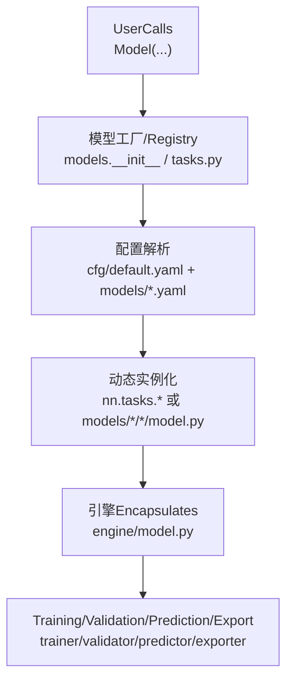
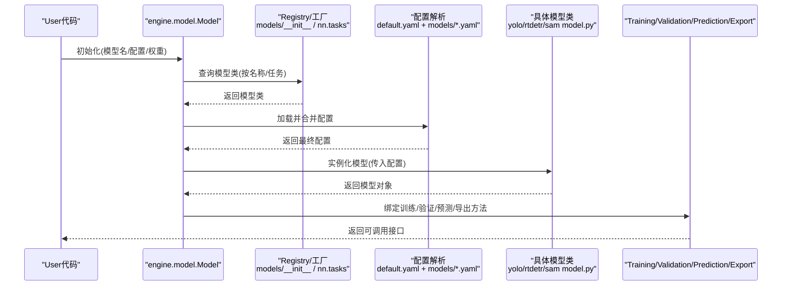
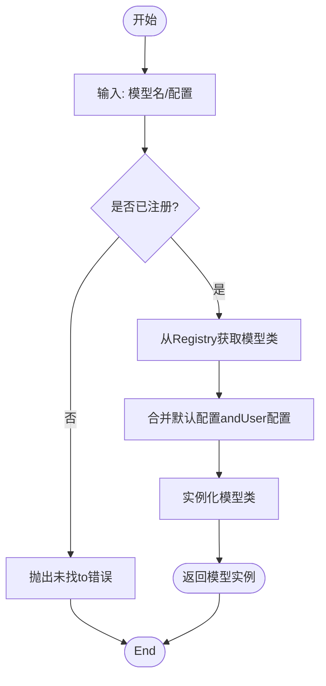
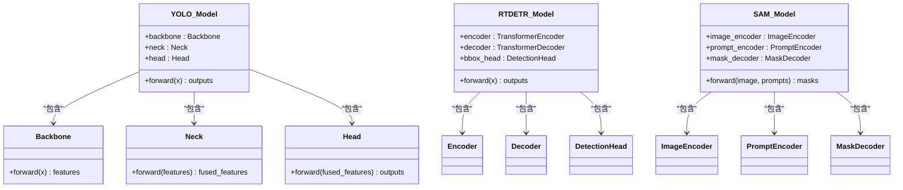
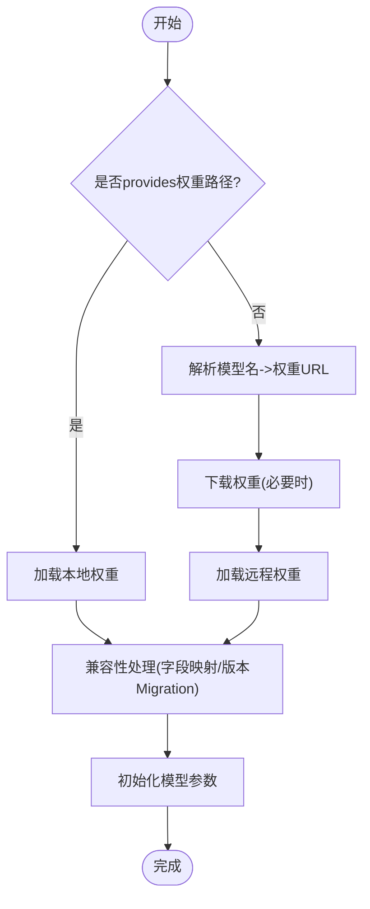
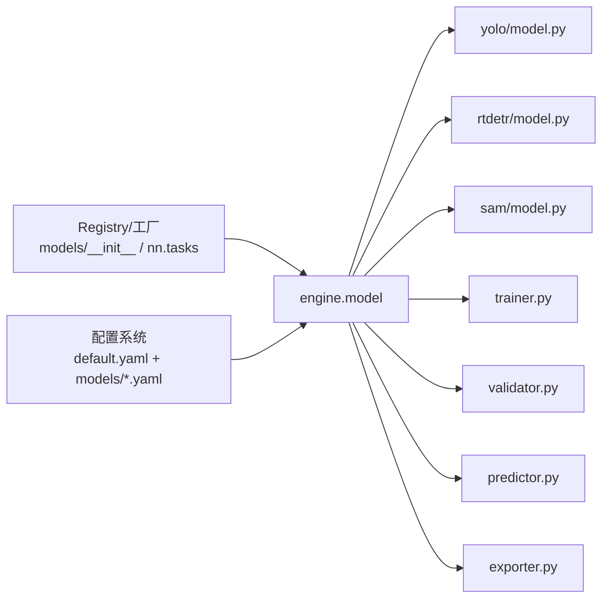

# Model System

<cite>
**Files Referenced in This Document**
- [ultralytics/models/__init__.py](file://ultralytics/models/__init__.py)
- [ultralytics/nn/tasks.py](file://ultralytics/nn/tasks.py)
- [ultralytics/nn/mixture_registry.py](file://ultralytics/nn/mixture_registry.py)
- [ultralytics/engine/model.py](file://ultralytics/engine/model.py)
- [ultralytics/engine/trainer.py](file://ultralytics/engine/trainer.py)
- [ultralytics/engine/validator.py](file://ultralytics/engine/validator.py)
- [ultralytics/engine/predictor.py](file://ultralytics/engine/predictor.py)
- [ultralytics/engine/exporter.py](file://ultralytics/engine/exporter.py)
- [ultralytics/utils/checkpoint_compat.py](file://ultralytics/utils/checkpoint_compat.py)
- [ultralytics/utils/downloads.py](file://ultralytics/utils/downloads.py)
- [ultralytics/cfg/default.yaml](file://ultralytics/cfg/default.yaml)
- [ultralytics/cfg/models/yolo/v8.yaml](file://ultralytics/cfg/models/yolo/v8.yaml)
- [ultralytics/cfg/models/yolo/v10.yaml](file://ultralytics/cfg/models/yolo/v10.yaml)
- [ultralytics/cfg/models/yolo/v11.yaml](file://ultralytics/cfg/models/yolo/v11.yaml)
- [ultralytics/cfg/models/yolo/v12.yaml](file://ultralytics/cfg/models/yolo/v12.yaml)
- [ultralytics/cfg/models/rtdetr/rtdetr.yaml](file://ultralytics/cfg/models/rtdetr/rtdetr.yaml)
- [ultralytics/cfg/models/sam/sam.yaml](file://ultralytics/cfg/models/sam/sam.yaml)
- [ultralytics/models/yolo/model.py](file://ultralytics/models/yolo/model.py)
- [ultralytics/models/rtdetr/model.py](file://ultralytics/models/rtdetr/model.py)
- [ultralytics/models/sam/model.py](file://ultralytics/models/sam/model.py)
- [tests/test_model_registry.py](file://tests/test_model_registry.py)
- [tests/test_mixture_config_registry.py](file://tests/test_mixture_config_registry.py)
</cite>

## Table of Contents
1. [Introduction](#Introduction)
2. [Project Structure](#Project Structure)
3. [Core Components](#Core Components)
4. [Architecture Overview](#Architecture Overview)
5. [Detailed Component Analysis](#Detailed Component Analysis)
6. [Dependency Analysis](#Dependency Analysis)
7. [性能考量](#性能考量)
8. [Troubleshooting Guide](#Troubleshooting Guide)
9. [Conclusion](#Conclusion)
10. [Appendix](#Appendix)

## Introduction
本文件targetingYOLO-Master模型的“Model System”，系统性阐述：
- Supporting的模型家族andTasks类型（检测、分割、Pose Estimation、分类、RT-DETR、SAMetc.）
- 模型注册机制and动态加载原理
- 配置文件结构and语法规范
- Core Architecture组件（Backbone Network、Neck Network、Detection Head）
- 权重管理andPre-trained Weights加载机制
- 自定义模型开发指南and最佳实践
- 模型选择建议and性能对比分析方法

## Project Structure
Model System围绕“配置drivers are installed + 工厂注册 + 运行时动态实例化”的架构unfold，关键路径包括：
- 模型RegistryandTasks映射：负责将模型名称/Tasks类型映射to具体implementing类
- 配置解析and默认值合并：从YAML配置中解析模型定义并合并默认参数
- 模型工厂and动态加载：根据配置或名称动态构建模型实例
- 引擎集成：Training、Validation、Prediction、Export统一ViaEngine接口访问模型

Figure Source
- [ultralytics/models/__init__.py](file://ultralytics/models/__init__.py)
- [ultralytics/nn/tasks.py](file://ultralytics/nn/tasks.py)
- [ultralytics/cfg/default.yaml](file://ultralytics/cfg/default.yaml)
- [ultralytics/engine/model.py](file://ultralytics/engine/model.py)

Section Source
- [ultralytics/models/__init__.py](file://ultralytics/models/__init__.py)
- [ultralytics/nn/tasks.py](file://ultralytics/nn/tasks.py)
- [ultralytics/cfg/default.yaml](file://ultralytics/cfg/default.yaml)
- [ultralytics/engine/model.py](file://ultralytics/engine/model.py)

## Core Components
- 模型RegistryandTasks映射
  - provides统一的模型/Tasks注册入口，Supporting按名称或Tasks类型动态获取模型类
  - 维护模型家族（YOLOv8/v10/v11/v12、RT-DETR、SAMetc.）and其Taskscapabilities矩阵
- 配置系统and默认值
  - Centered onYAMLfor配置载体，分层合并：全局默认配置 + 模型族配置 + User覆盖
  - provides校验and缺省补全，确保Training/Inference/Export流程一致性
- 动态加载and工厂模式
  - 基于Registrywhile运行时按需导入并实例化具体模型类
  - Supporting多后端and多Tasks变体（检测、分割、姿态、分类etc.）
- 引擎Encapsulates
  - Exposing a consistentAPI：train/val/predict/export
  - 内部协调数据流、设备管理、Mixture精度、分布式etc.

Section Source
- [ultralytics/nn/tasks.py](file://ultralytics/nn/tasks.py)
- [ultralytics/cfg/default.yaml](file://ultralytics/cfg/default.yaml)
- [ultralytics/engine/model.py](file://ultralytics/engine/model.py)

## Architecture Overview
下图展示从UserCallsto模型实例化的端to端流程，Centered onand各Modules的职责边界。

Figure Source
- [ultralytics/engine/model.py](file://ultralytics/engine/model.py)
- [ultralytics/models/__init__.py](file://ultralytics/models/__init__.py)
- [ultralytics/nn/tasks.py](file://ultralytics/nn/tasks.py)
- [ultralytics/cfg/default.yaml](file://ultralytics/cfg/default.yaml)
- [ultralytics/models/yolo/model.py](file://ultralytics/models/yolo/model.py)
- [ultralytics/models/rtdetr/model.py](file://ultralytics/models/rtdetr/model.py)
- [ultralytics/models/sam/model.py](file://ultralytics/models/sam/model.py)

## Detailed Component Analysis

### 模型家族andTasksSupporting
- YOLO系列（v8、v10、v11、v12）
  - Tasks：检测、分割、Pose Estimation、分类、旋转框（视具体变体）
  - 典型配置：对应 models/yolo/v8.yaml、v10.yaml、v11.yaml、v12.yaml
- RT-DETR
  - Tasks：Object Detection（端to端Transformer架构）
  - 配置：rtdetr/rtdetr.yaml
- SAM分割系列
  - Tasks：图像分割（Tips式/自动标注）
  - 配置：sam/sam.yaml

说明
- 不同版本/尺寸（n/s/m/l/x）Via同一配置模板中的规模参数控制
- Taskscapabilities由模型类and输出头决定，配置中通常包含Tasks相关超参（such as类别数、锚点策略、解码器etc.）

Section Source
- [ultralytics/cfg/models/yolo/v8.yaml](file://ultralytics/cfg/models/yolo/v8.yaml)
- [ultralytics/cfg/models/yolo/v10.yaml](file://ultralytics/cfg/models/yolo/v10.yaml)
- [ultralytics/cfg/models/yolo/v11.yaml](file://ultralytics/cfg/models/yolo/v11.yaml)
- [ultralytics/cfg/models/yolo/v12.yaml](file://ultralytics/cfg/models/yolo/v12.yaml)
- [ultralytics/cfg/models/rtdetr/rtdetr.yaml](file://ultralytics/cfg/models/rtdetr/rtdetr.yaml)
- [ultralytics/cfg/models/sam/sam.yaml](file://ultralytics/cfg/models/sam/sam.yaml)

### 模型注册机制and动态加载
- Registry职责
  - 维护“模型名称/Tasks类型 -> 模型类”的映射
  - provides按名称或Tasks查找模型类的API
- 动态加载流程
  - User传入模型名或配置后，工厂根据Registry定位具体模型类
  - Combining配置实例化模型，完成前向图构建and参数初始化
- 测试保障
  - 单元测试覆盖Registry可用性、配置解析and实例化正确性

Figure Source
- [ultralytics/models/__init__.py](file://ultralytics/models/__init__.py)
- [ultralytics/nn/tasks.py](file://ultralytics/nn/tasks.py)
- [tests/test_model_registry.py](file://tests/test_model_registry.py)

Section Source
- [ultralytics/models/__init__.py](file://ultralytics/models/__init__.py)
- [ultralytics/nn/tasks.py](file://ultralytics/nn/tasks.py)
- [tests/test_model_registry.py](file://tests/test_model_registry.py)

### 配置系统and语法规范
- 配置层级
  - 全局默认：default.yaml
  - 模型族：models/yolo/*.yaml、models/rtdetr/*.yaml、models/sam/*.yaml
  - User覆盖：命令行参数或外部YAML
- 关键字段（Examples维度，具体Centered on实际YAMLfor准）
  - 模型规模and通道数（影响骨干/颈部宽度）
  - Tasks相关参数（类别数、损失权重、解码器设置）
  - Training/Validation/Export通用参数（Learning Rate、Batch Size、Optimizer、Export格式）
- 合并and校验
  - 先加载默认，再叠加模型族配置，最后应用User覆盖
  - 缺失字段Uses默认值；非法值触发校验错误

Section Source
- [ultralytics/cfg/default.yaml](file://ultralytics/cfg/default.yaml)
- [ultralytics/cfg/models/yolo/v8.yaml](file://ultralytics/cfg/models/yolo/v8.yaml)
- [ultralytics/cfg/models/yolo/v10.yaml](file://ultralytics/cfg/models/yolo/v10.yaml)
- [ultralytics/cfg/models/yolo/v11.yaml](file://ultralytics/cfg/models/yolo/v11.yaml)
- [ultralytics/cfg/models/yolo/v12.yaml](file://ultralytics/cfg/models/yolo/v12.yaml)
- [ultralytics/cfg/models/rtdetr/rtdetr.yaml](file://ultralytics/cfg/models/rtdetr/rtdetr.yaml)
- [ultralytics/cfg/models/sam/sam.yaml](file://ultralytics/cfg/models/sam/sam.yaml)

### Core Architecture组件（骨干/颈部/Detection Head）
- Backbone Network（Backbone）
  - 负责Feature Extraction，常见for卷积/Transformer主干
  - 多尺度特征输出供颈部融合
- Neck Network（Neck）
  - 进行跨层特征融合（such asFPN/PAN），提升小目标and上下文建模
- Detection Head（Head）
  - 针对不同Tasks的输出头：检测框回归+分类、分割掩码、关键点坐标、类别概率etc.
- 模型类组织
  - yolo/rtdetr/sam各自providesmodel.py作for入口，组合上述Modules并按Tasks输出

Figure Source
- [ultralytics/models/yolo/model.py](file://ultralytics/models/yolo/model.py)
- [ultralytics/models/rtdetr/model.py](file://ultralytics/models/rtdetr/model.py)
- [ultralytics/models/sam/model.py](file://ultralytics/models/sam/model.py)

Section Source
- [ultralytics/models/yolo/model.py](file://ultralytics/models/yolo/model.py)
- [ultralytics/models/rtdetr/model.py](file://ultralytics/models/rtdetr/model.py)
- [ultralytics/models/sam/model.py](file://ultralytics/models/sam/model.py)

### 权重管理andPre-trained Weights加载
- 权重来源
  - 本地路径或远程URL（Supporting自动下载）
- 加载流程
  - 若指定权重路径则直接加载；否则尝试按模型名匹配官方权重并下载
  - 兼容旧版权重格式（CheckpointMigration/字段重映射）
- 断点续训andExport
  - Training保存checkpoint，恢复时仅加载必要字段
  - Export前校验权重完整性and设备一致性

Figure Source
- [ultralytics/engine/model.py](file://ultralytics/engine/model.py)
- [ultralytics/utils/downloads.py](file://ultralytics/utils/downloads.py)
- [ultralytics/utils/checkpoint_compat.py](file://ultralytics/utils/checkpoint_compat.py)

Section Source
- [ultralytics/engine/model.py](file://ultralytics/engine/model.py)
- [ultralytics/utils/downloads.py](file://ultralytics/utils/downloads.py)
- [ultralytics/utils/checkpoint_compat.py](file://ultralytics/utils/checkpoint_compat.py)

### 自定义模型开发指南
- 步骤概览
  1) 新建模型类：继承基础模型基类，implementingforwardand必要的属性（such asTasks类型、输出形状）
  2) 注册模型：whileRegistry中添加“名称 -> 模型类”的映射
  3) 编写配置：whilemodelsTable of Contents下新增YAML，描述骨干/颈部/头部andTasks参数
  4) 集成引擎：确保Training/Validation/Prediction/Export流程能识别新模型
  5) 编写测试：覆盖注册、配置解析、实例化and基本Inference
- 最佳实践
  - 保持配置键名稳定，避免破坏向后兼容
  - 对权重字段命名保持一致，便于Migration工具处理
  - 明确Taskscapabilities矩阵，避免while不Supporting的Tasks上误用
  - provides最小可用Examplesand基准脚本

Section Source
- [ultralytics/models/__init__.py](file://ultralytics/models/__init__.py)
- [ultralytics/nn/tasks.py](file://ultralytics/nn/tasks.py)
- [ultralytics/cfg/default.yaml](file://ultralytics/cfg/default.yaml)
- [tests/test_model_registry.py](file://tests/test_model_registry.py)

### 模型选择建议and性能对比
- 选择建议
  - 实时性and精度权衡：小尺寸（n/s）适合Edge Deployment，大尺寸（l/x）追求更高精度
  - Tasks适配：检测优先YOLO/RT-DETR；分割优先SAM；Pose Estimation选YOLO Pose变体
  - 部署生态：考虑ONNX/TensorRT/OpenVINOetc.Export链路的成熟度
- 对比方法
  - Uses统一数据集and评测协议，记录mAP/速度/显存占用
  - 关注不同分辨率下的吞吐and延迟
  - Combining业务场景（小目标、遮挡、密集场景）做专项Evaluation

[This section provides general guidance and does not directly analyze specific files]

## Dependency Analysis
- 组件耦合
  - engine.model依赖Registryand配置解析，解耦了具体模型implementing
  - 各模型族（yolo/rtdetr/sam）ViaUnified Interface接入引擎
- External Dependencies
  - 权重下载、Checkpoint兼容、Export链路etc.由utilsandengine.exporterprovides

Figure Source
- [ultralytics/models/__init__.py](file://ultralytics/models/__init__.py)
- [ultralytics/nn/tasks.py](file://ultralytics/nn/tasks.py)
- [ultralytics/engine/model.py](file://ultralytics/engine/model.py)
- [ultralytics/engine/trainer.py](file://ultralytics/engine/trainer.py)
- [ultralytics/engine/validator.py](file://ultralytics/engine/validator.py)
- [ultralytics/engine/predictor.py](file://ultralytics/engine/predictor.py)
- [ultralytics/engine/exporter.py](file://ultralytics/engine/exporter.py)
- [ultralytics/models/yolo/model.py](file://ultralytics/models/yolo/model.py)
- [ultralytics/models/rtdetr/model.py](file://ultralytics/models/rtdetr/model.py)
- [ultralytics/models/sam/model.py](file://ultralytics/models/sam/model.py)

Section Source
- [ultralytics/engine/model.py](file://ultralytics/engine/model.py)
- [ultralytics/engine/trainer.py](file://ultralytics/engine/trainer.py)
- [ultralytics/engine/validator.py](file://ultralytics/engine/validator.py)
- [ultralytics/engine/predictor.py](file://ultralytics/engine/predictor.py)
- [ultralytics/engine/exporter.py](file://ultralytics/engine/exporter.py)

## 性能考量
- 计算and内存
  - 增大模型规模会线性增加FLOPsand显存；合理选择尺寸and输入分辨率
  - UsesMixture精度and算子Optimization（such asTensorRT/OpenVINO）降低延迟
- 数据and批处理
  - 自适应批大小andData Pipeline并行度，避免I/Obottlenecks
- Exportand部署
  - 针对目标平台选择最优Export格式，并进行端to端压测
- 监控and诊断
  - 记录Training曲线、Gradient范数、激活分布，定位不稳定因素

[This section provides general guidance and does not directly analyze specific files]

## Troubleshooting Guide
- 常见问题
  - 模型名未注册：检查Registry映射是否正确
  - 配置缺失字段：确认默认配置and模型族配置是否完整
  - 权重加载失败：核对路径/URL、网络连通性and权重格式兼容性
- 定位手段
  - 启用详细Logging，观察实例化and加载阶段报错堆栈
  - Uses最小复现脚本隔离问题（单卡、小batch、简化配置）
  - 借助单元测试用例对照行for差异

Section Source
- [tests/test_model_registry.py](file://tests/test_model_registry.py)
- [tests/test_mixture_config_registry.py](file://tests/test_mixture_config_registry.py)

## Conclusion
YOLO-Master的Model SystemCentered on“配置drivers are installed + Registry + 动态加载”for核心，implementing了多模型家族and多Tasks的统一接入。Via清晰的层次化配置、稳定的注册契约and完善的权重管理，既保证了易用性，也for扩展新模型provides了良好基础。建议while引入新模型时遵循既定规范，完善测试andDocumentation，确保and现有Training/Inference/Export链路的无缝集成。

## Appendix
- 术语
  - Registry：维护模型名称/Taskstoimplementing类的映射
  - 工厂：根据名称/配置动态创建模型实例
  - 引擎：EncapsulatesTraining/Validation/Prediction/Export的Unified Interface
- Refer to路径
  - 模型入口：ultralytics/models/{yolo,rtdetr,sam}/model.py
  - 注册andTasks：ultralytics/models/__init__.py、ultralytics/nn/tasks.py
  - 配置：ultralytics/cfg/default.yaml and ultralytics/cfg/models/*
  - 引擎：ultralytics/engine/{model,trainer,validator,predictor,exporter}.py
  - 权重and下载：ultralytics/utils/{downloads,checkpoint_compat}.py