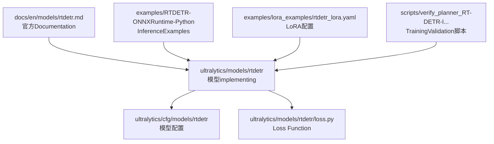
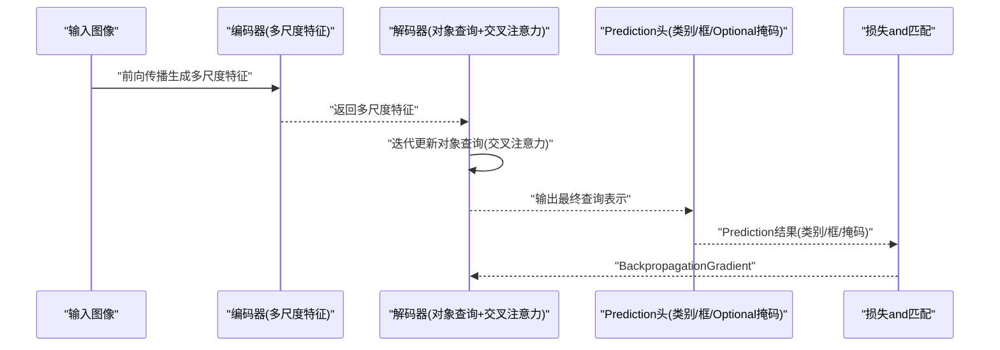
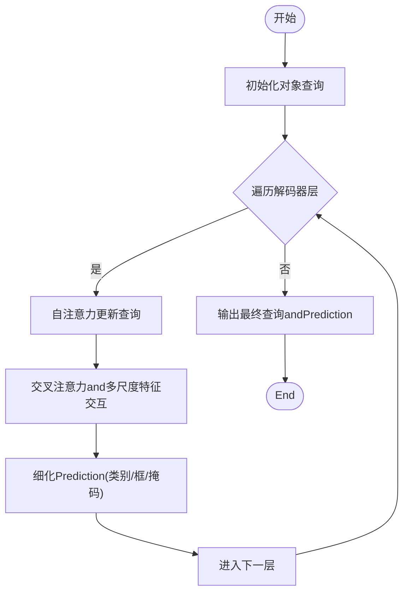
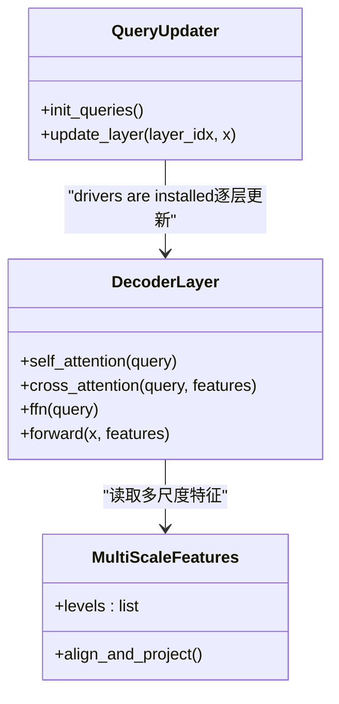
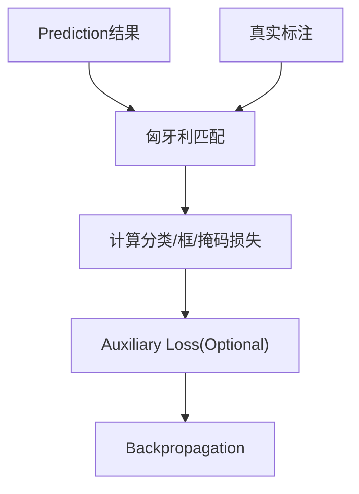
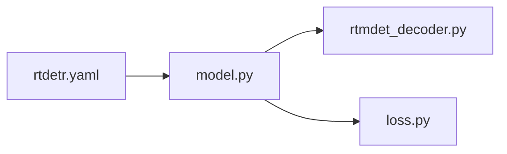

# RT-DETR模型

<cite>
**Files Referenced in This Document**
- [ultralytics/models/rtdetr/model.py](file://ultralytics/models/rtdetr/model.py)
- [ultralytics/models/rtdetr/rtmdet_decoder.py](file://ultralytics/models/rtdetr/rtmdet_decoder.py)
- [ultralytics/models/rtdetr/loss.py](file://ultralytics/models/rtdetr/loss.py)
- [ultralytics/cfg/models/rtdetr/rtdetr.yaml](file://ultralytics/cfg/models/rtdetr/rtdetr.yaml)
- [docs/en/models/rtdetr.md](file://docs/en/models/rtdetr.md)
- [examples/RTDETR-ONNXRuntime-Python/main.py](file://examples/RTDETR-ONNXRuntime-Python/main.py)
- [examples/lora_examples/rtdetr_lora.yaml](file://examples/lora_examples/rtdetr_lora.yaml)
- [scripts/verify_planner_RT-DETR-l Planner+training validation.py](file://scripts/verify_planner_RT-DETR-l Planner+training validation.py)
</cite>

## Table of Contents
1. [Introduction](#Introduction)
2. [Project Structure](#Project Structure)
3. [Core Components](#Core Components)
4. [Architecture Overview](#Architecture Overview)
5. [Detailed Component Analysis](#Detailed Component Analysis)
6. [Dependency Analysis](#Dependency Analysis)
7. [性能考量](#性能考量)
8. [Troubleshooting Guide](#Troubleshooting Guide)
9. [Conclusion](#Conclusion)
10. [Appendix](#Appendix)

## Introduction
本文件targeting希望系统掌握并工程化应用RT-DETR端to端Object Detection模型的读者，围绕Centered on下目标unfold：
- 解释RT-DETR的端to端架构原理：DETR基础、实时Optimizationand多尺度特征融合。
- 深入解析查询向量设计、交叉注意力Modulesand高效解码器的工作机制。
- 梳理不同规模RT-DETR模型配置and性能特点。
- 对比YOLO系列while架构andApplicable Scenarios上的差异。
- providesTraining Configuration、Data PreparationandModel Export流程，Centered onand自定义数据集TrainingExamplesandOptimization技巧。
- 展示while实际项目中集成andUsesRT-DETR的方法。

## Project Structure
仓库中RT-DETR相关代码主要分布whileCentered on下位置：
- 模型定义andimplementing：ultralytics/models/rtdetr
- 配置文件：ultralytics/cfg/models/rtdetr
- Documentation说明：docs/en/models/rtdetr.md
- InferenceExamples（ONNX Runtime）：examples/RTDETR-ONNXRuntime-Python
- LoRA微调Examples：examples/lora_examples/rtdetr_lora.yaml
- TrainingValidation脚本：scripts/verify_planner_RT-DETR-l Planner+training validation.py

Figure Source
- [ultralytics/models/rtdetr/model.py:1-200](file://ultralytics/models/rtdetr/model.py#L1-L200)
- [ultralytics/models/rtdetr/rtmdet_decoder.py:1-200](file://ultralytics/models/rtdetr/rtmdet_decoder.py#L1-L200)
- [ultralytics/models/rtdetr/loss.py:1-200](file://ultralytics/models/rtdetr/loss.py#L1-L200)
- [ultralytics/cfg/models/rtdetr/rtdetr.yaml:1-200](file://ultralytics/cfg/models/rtdetr/rtdetr.yaml#L1-L200)
- [docs/en/models/rtdetr.md:1-200](file://docs/en/models/rtdetr.md#L1-L200)
- [examples/RTDETR-ONNXRuntime-Python/main.py:1-200](file://examples/RTDETR-ONNXRuntime-Python/main.py#L1-L200)
- [examples/lora_examples/rtdetr_lora.yaml:1-200](file://examples/lora_examples/rtdetr_lora.yaml#L1-L200)
- [scripts/verify_planner_RT-DETR-l Planner+training validation.py:1-200](file://scripts/verify_planner_RT-DETR-l Planner+training validation.py#L1-L200)

Section Source
- [ultralytics/models/rtdetr/model.py:1-200](file://ultralytics/models/rtdetr/model.py#L1-L200)
- [ultralytics/cfg/models/rtdetr/rtdetr.yaml:1-200](file://ultralytics/cfg/models/rtdetr/rtdetr.yaml#L1-L200)
- [docs/en/models/rtdetr.md:1-200](file://docs/en/models/rtdetr.md#L1-L200)

## Core Components
- 编码器-解码器主干：基于Transformer的端to端检测框架，采用多尺度特征输入and可学习对象查询进行直接Prediction。
- 高效解码器：Via交叉注意力将对象查询and多尺度特征交互，Combining去重and匹配策略提升收敛速度and精度。
- 损失and匹配：匈牙利匹配and分类/边界框/掩码and other tasksLoss combination，Supporting动态正样本分配。
- 配置体系：按规模（n/s/m/l/x）provides统一参数模板，便于快速切换and实验。
- TrainingandExport：Supporting标准Training流程、Mixture精度、Distributed Trainingand多种Export格式（such asONNX）。

Section Source
- [ultralytics/models/rtdetr/model.py:1-200](file://ultralytics/models/rtdetr/model.py#L1-L200)
- [ultralytics/models/rtdetr/rtmdet_decoder.py:1-200](file://ultralytics/models/rtdetr/rtmdet_decoder.py#L1-L200)
- [ultralytics/models/rtdetr/loss.py:1-200](file://ultralytics/models/rtdetr/loss.py#L1-L200)
- [ultralytics/cfg/models/rtdetr/rtdetr.yaml:1-200](file://ultralytics/cfg/models/rtdetr/rtdetr.yaml#L1-L200)

## Architecture Overview
RT-DETR采用“编码器-解码器”端to端范式：
- 多尺度Feature Extraction：从Backbone Network输出多个分辨率的特征图，增强对小目标和复杂场景的鲁棒性。
- 对象查询：一组可学习的向量作for解码器初始状态，并行迭代更新Centered on捕获全局上下文。
- 交叉注意力：解码器层内对查询and特征进行跨模态交互，聚焦关键区域。
- 高效解码：减少冗余计算and重复检测，Combined with匹配策略加速收敛。

Figure Source
- [ultralytics/models/rtdetr/model.py:1-200](file://ultralytics/models/rtdetr/model.py#L1-L200)
- [ultralytics/models/rtdetr/rtmdet_decoder.py:1-200](file://ultralytics/models/rtdetr/rtmdet_decoder.py#L1-L200)
- [ultralytics/models/rtdetr/loss.py:1-200](file://ultralytics/models/rtdetr/loss.py#L1-L200)

## Detailed Component Analysis

### 查询向量设计and更新机制
- 查询初始化：可学习对象查询作for解码器起点，数量andTasks相关。
- 迭代更新：每层解码器Via自注意力和交叉注意力更新查询，逐步细化目标语义and位置信息。
- 去重and稳定：引入抑制或去重策略，避免冗余Prediction，提高稳定性and速度。

Figure Source
- [ultralytics/models/rtdetr/rtmdet_decoder.py:1-200](file://ultralytics/models/rtdetr/rtmdet_decoder.py#L1-L200)
- [ultralytics/models/rtdetr/model.py:1-200](file://ultralytics/models/rtdetr/model.py#L1-L200)

Section Source
- [ultralytics/models/rtdetr/rtmdet_decoder.py:1-200](file://ultralytics/models/rtdetr/rtmdet_decoder.py#L1-L200)
- [ultralytics/models/rtdetr/model.py:1-200](file://ultralytics/models/rtdetr/model.py#L1-L200)

### 交叉注意力Modulesand多尺度特征融合
- 交叉注意力：查询作forQuery，多尺度特征作forKey/Value，使查询能关注to不同尺度的细节and上下文。
- 多尺度融合：Via特征对齐and拼接/投影，将浅层高分辨率and深层强语义特征有效整合。
- 效率Optimization：选择性注意力或稀疏化策略降低计算量，适配实时需求。

Figure Source
- [ultralytics/models/rtdetr/rtmdet_decoder.py:1-200](file://ultralytics/models/rtdetr/rtmdet_decoder.py#L1-L200)
- [ultralytics/models/rtdetr/model.py:1-200](file://ultralytics/models/rtdetr/model.py#L1-L200)

Section Source
- [ultralytics/models/rtdetr/rtmdet_decoder.py:1-200](file://ultralytics/models/rtdetr/rtmdet_decoder.py#L1-L200)
- [ultralytics/models/rtdetr/model.py:1-200](file://ultralytics/models/rtdetr/model.py#L1-L200)

### Loss Functionand匹配策略
- 匹配策略：匈牙利匹配用于将Predictionand真实标注建立一一对应，确保Training稳定性。
- 损失组成：分类损失、边界框回归损失、Optional掩码损失；可能包含Auxiliary LossCentered on提升中间层监督。
- 动态正样本：根据置信度或IoU阈值自适应选择正样本，改善小目标and难例Training。

Figure Source
- [ultralytics/models/rtdetr/loss.py:1-200](file://ultralytics/models/rtdetr/loss.py#L1-L200)

Section Source
- [ultralytics/models/rtdetr/loss.py:1-200](file://ultralytics/models/rtdetr/loss.py#L1-L200)

### 模型配置and规模特性
- 规模族：n/s/m/l/xetc.不同尺寸，对应不同的深度、宽度and查询数，平衡精度and速度。
- 关键超参：层数、隐藏维度、注意力头数、查询数量、多尺度特征通道数etc.。
- 配置模板：Via统一YAML模板管理，便于一键切换and复现实验。

Section Source
- [ultralytics/cfg/models/rtdetr/rtdetr.yaml:1-200](file://ultralytics/cfg/models/rtdetr/rtdetr.yaml#L1-L200)

### andYOLO系列的架构差异andApplicable Scenarios
- 架构差异：
  - RT-DETR：端to端Transformer，对象查询+交叉注意力，无需锚点andNon-Maximum Suppression。
  - YOLO：基于网格/锚点的卷积式检测，强调速度and工程Optimization，Post-Processing依赖NMS。
- Applicable Scenarios：
  - RT-DETR：需要端to端建模、复杂场景and多尺度融合capabilities强的Tasks；对精度要求高且算力充足。
  - YOLO：对延迟敏感、部署资源受限的场景；工业落地成熟度高。

[本节for概念性对比，不直接分析具体文件]

## Dependency Analysis
RT-DETRModules内部依赖关系such as下：
- model.py：组装编码器、解码器andPrediction头，协调Training/Inference流程。
- rtmdet_decoder.py：implementing高效解码器and查询更新逻辑。
- loss.py：定义匹配and损失计算。
- rtdetr.yaml：provides不同规模的模型配置。

Figure Source
- [ultralytics/models/rtdetr/model.py:1-200](file://ultralytics/models/rtdetr/model.py#L1-L200)
- [ultralytics/models/rtdetr/rtmdet_decoder.py:1-200](file://ultralytics/models/rtdetr/rtmdet_decoder.py#L1-L200)
- [ultralytics/models/rtdetr/loss.py:1-200](file://ultralytics/models/rtdetr/loss.py#L1-L200)
- [ultralytics/cfg/models/rtdetr/rtdetr.yaml:1-200](file://ultralytics/cfg/models/rtdetr/rtdetr.yaml#L1-L200)

Section Source
- [ultralytics/models/rtdetr/model.py:1-200](file://ultralytics/models/rtdetr/model.py#L1-L200)
- [ultralytics/models/rtdetr/rtmdet_decoder.py:1-200](file://ultralytics/models/rtdetr/rtmdet_decoder.py#L1-L200)
- [ultralytics/models/rtdetr/loss.py:1-200](file://ultralytics/models/rtdetr/loss.py#L1-L200)
- [ultralytics/cfg/models/rtdetr/rtdetr.yaml:1-200](file://ultralytics/cfg/models/rtdetr/rtdetr.yaml#L1-L200)

## 性能考量
- 查询数量and层数：影响精度and计算开销，需根据Tasksand硬件权衡。
- 多尺度特征：增加小目标召回但带来额外计算，可Via通道压缩或选择性融合Optimization。
- Mixture精度and分布式：利用AMPandDDP提升Training吞吐and稳定性。
- ExportOptimization：转换forONNX/TensorRTetc.格式，Combining算子融合and量化降低延迟。

[This section provides general guidance and does not directly analyze specific files]

## Troubleshooting Guide
- Training不稳定：检查Learning Rate、Batch Sizeand标签归一化；确认损失数值范围andGradient裁剪。
- 匹配失败：核对类别映射and边界框坐标格式；调整匹配阈值and正样本策略。
- Export异常：确认输入形状and动态轴设置；ValidationExport Backends兼容性。
- Inference错误：检查预处理/Post-Processing一致性；确保模型权重and配置版本匹配。

Section Source
- [ultralytics/models/rtdetr/loss.py:1-200](file://ultralytics/models/rtdetr/loss.py#L1-L200)
- [ultralytics/models/rtdetr/model.py:1-200](file://ultralytics/models/rtdetr/model.py#L1-L200)

## Conclusion
RT-DETR凭借端to端Transformer架构、对象查询and交叉Attention Mechanism，while多尺度特征融合and复杂场景下具备显著优势。Via合理的配置andOptimization策略，可while精度and速度之间取得良好平衡。andYOLO相比，RT-DETR更适合对精度and建模capabilities有更高要求的场景，而YOLO则while工程落地and低延迟部署方面更具优势。

[This section is summary content and does not directly analyze specific files]

## Appendix

### Training ConfigurationandData Preparation
- 数据格式：遵循YOLO格式组织图像and标注，确保类别索引一致。
- 配置文件：Usesrtdetr.yaml指定骨干、解码器andTasks参数。
- Training命令：Refer to官方DocumentationandExamples脚本，启用Mixture精度andDistributed Training。

Section Source
- [docs/en/models/rtdetr.md:1-200](file://docs/en/models/rtdetr.md#L1-L200)
- [ultralytics/cfg/models/rtdetr/rtdetr.yaml:1-200](file://ultralytics/cfg/models/rtdetr/rtdetr.yaml#L1-L200)

### Model Export流程
- ONNXExport：设置输入形状and动态轴，ValidationExport模型的前向一致性。
- Inference集成：UsesONNX RuntimeLoad model，执行预处理、InferenceandPost-Processing。

Section Source
- [examples/RTDETR-ONNXRuntime-Python/main.py:1-200](file://examples/RTDETR-ONNXRuntime-Python/main.py#L1-L200)

### 自定义数据集TrainingExamples
- Data Preparation：将标注转换forYOLO格式，划分Training/Validation集。
- 配置修改：更新类别数and路径，必要时调整查询数and层数Centered on适配数据规模。
- TrainingandEvaluation：运行Training脚本，监控损失andMetrics，进行超参搜索and调优。

Section Source
- [examples/lora_examples/rtdetr_lora.yaml:1-200](file://examples/lora_examples/rtdetr_lora.yaml#L1-L200)
- [scripts/verify_planner_RT-DETR-l Planner+training validation.py:1-200](file://scripts/verify_planner_RT-DETR-l Planner+training validation.py#L1-L200)

### 性能Optimization技巧
- Data Augmentation：合理运用Mosaic、MixUpand随机仿射变换提升泛化。
- 正则化：权重衰减、DropPathand标签平滑改善过拟合。
- InferenceOptimization：Batch Inference、内存复用and算子融合降低延迟。

[This section provides general guidance and does not directly analyze specific files]