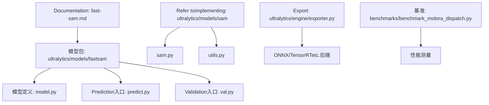
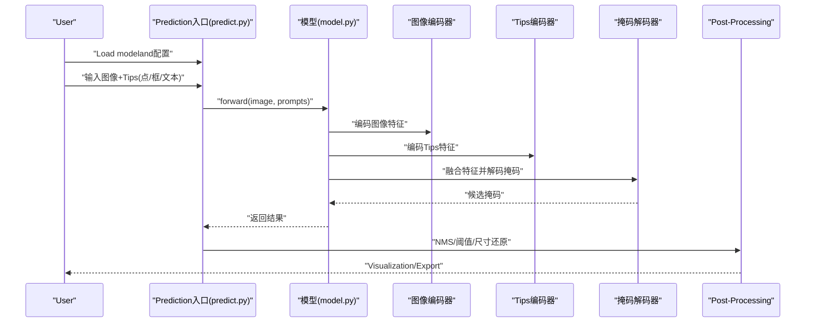
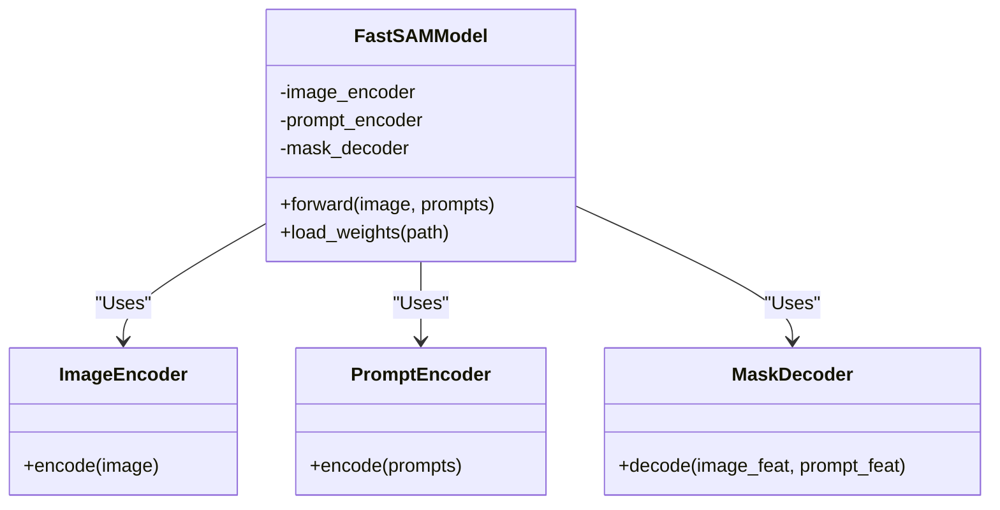
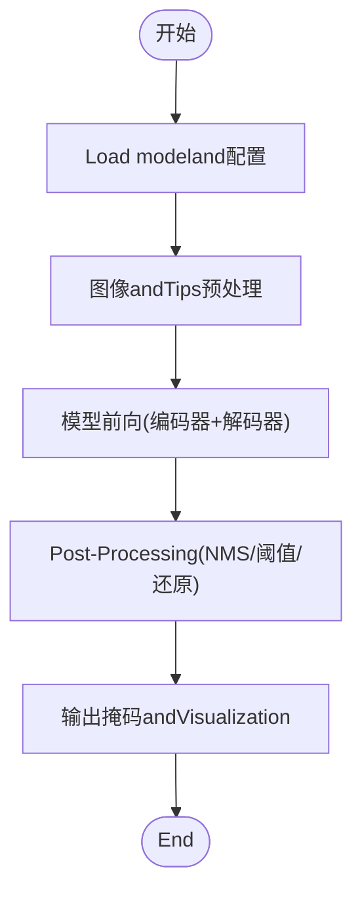
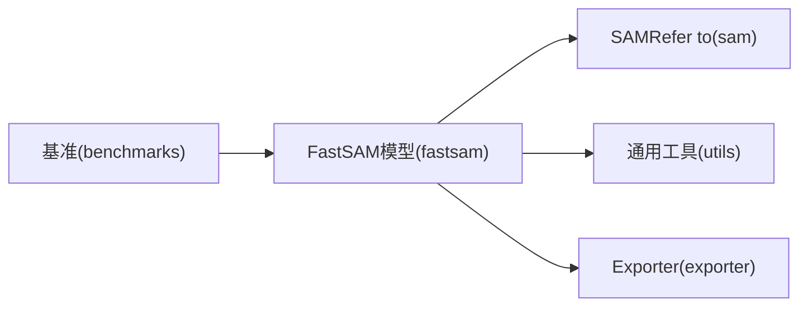

# FastSAM快速implementing

<cite>
**Files Referenced in This Document**
- [fast-sam.md](file://docs/en/models/fast-sam.md)
- [__init__.py](file://ultralytics/models/fastsam/__init__.py)
- [model.py](file://ultralytics/models/fastsam/model.py)
- [predict.py](file://ultralytics/models/fastsam/predict.py)
- [val.py](file://ultralytics/models/fastsam/val.py)
- [sam.py](file://ultralytics/models/sam/sam.py)
- [utils.py](file://ultralytics/models/sam/utils.py)
- [exporter.py](file://ultralytics/engine/exporter.py)
- [benchmark_molora_dispatch.py](file://benchmarks/benchmark_molora_dispatch.py)
</cite>

## Table of Contents
1. [Introduction](#Introduction)
2. [Project Structure](#Project Structure)
3. [Core Components](#Core Components)
4. [Architecture Overview](#Architecture Overview)
5. [Detailed Component Analysis](#Detailed Component Analysis)
6. [Dependency Analysis](#Dependency Analysis)
7. [性能考量](#性能考量)
8. [Troubleshooting Guide](#Troubleshooting Guide)
9. [Conclusion](#Conclusion)
10. [Appendix](#Appendix)

## Introduction
本文件targeting希望while资源受限环境中部署“快速分割”模型usersandEngineers，聚焦于FastSAM的快速Inferenceimplementing。Documentation从系统架构、关键Modules、数据流and处理逻辑出发，解释FastSAMsuch as何While maintainingSAM质量大幅提升Inference速度，涵盖轻量级图像编码器、高效Tips处理机制andOptimization的掩码解码器设计；并讨论模型蒸馏and量化Optimization策略。同时providesand原始SAM的性能对比维度（Inference速度、内存占用、精度损失），Centered onand部署to边缘设备时的最佳实践and代码Examples路径。

## Project Structure
FastSAMwhile仓库中的组织遵循“按Tasks/模型分Table of Contents”的约定：
- Documentation说明位于 docs/en/models/fast-sam.md
- 模型定义andInference入口位于 ultralytics/models/fastsam/
- SAMRefer toimplementing位于 ultralytics/models/sam/
- Exportand基准工具位于 ultralytics/engine/exporter.py and benchmarks/

Figure Source
- [fast-sam.md](file://docs/en/models/fast-sam.md)
- [model.py](file://ultralytics/models/fastsam/model.py)
- [predict.py](file://ultralytics/models/fastsam/predict.py)
- [val.py](file://ultralytics/models/fastsam/val.py)
- [sam.py](file://ultralytics/models/sam/sam.py)
- [utils.py](file://ultralytics/models/sam/utils.py)
- [exporter.py](file://ultralytics/engine/exporter.py)
- [benchmark_molora_dispatch.py](file://benchmarks/benchmark_molora_dispatch.py)

Section Source
- [fast-sam.md](file://docs/en/models/fast-sam.md)
- [model.py](file://ultralytics/models/fastsam/model.py)
- [predict.py](file://ultralytics/models/fastsam/predict.py)
- [val.py](file://ultralytics/models/fastsam/val.py)
- [sam.py](file://ultralytics/models/sam/sam.py)
- [utils.py](file://ultralytics/models/sam/utils.py)
- [exporter.py](file://ultralytics/engine/exporter.py)
- [benchmark_molora_dispatch.py](file://benchmarks/benchmark_molora_dispatch.py)

## Core Components
- 轻量级图像编码器：采用更小的Backbone Network或更高效的Feature Extraction路径，降低计算量and显存占用，同时保留足够的语义信息Centered on支撑高质量分割。
- 高效Tips处理机制：对点、框、文本etc.MultimodalTips进行统一编码and融合，减少冗余计算，提升Tips-图像对齐效率。
- Optimization的掩码解码器：简化解码分支、减少上采样次数and通道数，Combining注意力压缩and并行化策略，提高掩码生成速度。
- 模型蒸馏and量化：ViaKnowledge Distillation将大模型capabilitiesMigration至小模型，并CombiningINT8/Mixture精度量化进一步压缩体积and加速Inference。

Section Source
- [fast-sam.md](file://docs/en/models/fast-sam.md)
- [model.py](file://ultralytics/models/fastsam/model.py)
- [predict.py](file://ultralytics/models/fastsam/predict.py)
- [sam.py](file://ultralytics/models/sam/sam.py)
- [utils.py](file://ultralytics/models/sam/utils.py)

## Architecture Overview
下图展示FastSAM端to端Inference流程：输入图像经轻量编码器得to特征图；Tips经过Tips编码器并and图像特征融合；解码器输出候选掩码并进行Post-Processing（such asNMS、阈值筛选）得to最终结果。

Figure Source
- [predict.py](file://ultralytics/models/fastsam/predict.py)
- [model.py](file://ultralytics/models/fastsam/model.py)
- [sam.py](file://ultralytics/models/sam/sam.py)
- [utils.py](file://ultralytics/models/sam/utils.py)

## Detailed Component Analysis

### 模型定义and注册
- 模型类负责组合图像编码器、Tips编码器and掩码解码器，并provides统一的forward接口。
- 模型注册and权重加载由包初始化完成，便于外部Via标准APICalls。

Figure Source
- [model.py](file://ultralytics/models/fastsam/model.py)
- [__init__.py](file://ultralytics/models/fastsam/__init__.py)

Section Source
- [model.py](file://ultralytics/models/fastsam/model.py)
- [__init__.py](file://ultralytics/models/fastsam/__init__.py)

### Prediction入口andInference管线
- Prediction入口负责解析输入、预处理图像andTips、Calls模型前向、执行Post-Processing（such asNMS、阈值过滤、坐标还原）。
- SupportingBatch Inferenceand多Tips类型（点、框、文本）的统一处理。

Figure Source
- [predict.py](file://ultralytics/models/fastsam/predict.py)
- [utils.py](file://ultralytics/models/sam/utils.py)

Section Source
- [predict.py](file://ultralytics/models/fastsam/predict.py)
- [utils.py](file://ultralytics/models/sam/utils.py)

### ValidationandEvaluation
- Validation入口用于while数据集上Evaluation分割Metrics（such asIoU、mAPetc.），并可对比不同配置下的性能差异。
- SupportingExport中间结果Centered on便离线分析andVisualization。

Section Source
- [val.py](file://ultralytics/models/fastsam/val.py)

### and原始SAM的关系
- FastSAM复用SAM的Tips编码and解码范式，但替换for更轻量的图像编码器and简化的解码路径，从而while保证质量的前提下显著提速。
- Refer toimplementing位于 sam.py and utils.py，可作for理解Tips融合and掩码生成的基线。

Section Source
- [sam.py](file://ultralytics/models/sam/sam.py)
- [utils.py](file://ultralytics/models/sam/utils.py)

## Dependency Analysis
FastSAM的依赖主要包含：
- 内部依赖：模型定义、PredictionandValidation入口、SAMRefer toimplementingand通用工具。
- External Dependencies：Exporter（ONNX/TensorRTetc.）、基准测试脚本。

Figure Source
- [model.py](file://ultralytics/models/fastsam/model.py)
- [predict.py](file://ultralytics/models/fastsam/predict.py)
- [sam.py](file://ultralytics/models/sam/sam.py)
- [utils.py](file://ultralytics/models/sam/utils.py)
- [exporter.py](file://ultralytics/engine/exporter.py)
- [benchmark_molora_dispatch.py](file://benchmarks/benchmark_molora_dispatch.py)

Section Source
- [model.py](file://ultralytics/models/fastsam/model.py)
- [predict.py](file://ultralytics/models/fastsam/predict.py)
- [sam.py](file://ultralytics/models/sam/sam.py)
- [utils.py](file://ultralytics/models/sam/utils.py)
- [exporter.py](file://ultralytics/engine/exporter.py)
- [benchmark_molora_dispatch.py](file://benchmarks/benchmark_molora_dispatch.py)

## 性能考量
- Inference速度：Via轻量编码器and简化解码器，显著降低FLOPsand显存带宽压力；建议CombiningExporter转换forONNX/TensorRTCentered on获得更高吞吐。
- 内存占用：减小通道数and层深，Combined with半精度/整型量化可进一步压缩权重and激活占用。
- 精度损失：while蒸馏阶段引入大模型作for教师，约束小模型的输出分布and中间特征，尽量缩小and原始SAM的精度差距。
- 基准方法：can use基准脚本while不同硬件上进行延迟and吞吐测量，并记录GPU/CPU利用率and峰值显存。

Section Source
- [exporter.py](file://ultralytics/engine/exporter.py)
- [benchmark_molora_dispatch.py](file://benchmarks/benchmark_molora_dispatch.py)

## Troubleshooting Guide
- 导入错误：确认模型包已正确安装且 __init__.py 中已注册FastSAM模型类。
- 形状不匹配：检查输入图像尺寸andTips格式是否符合模型期望，必要时while预处理阶段进行归一化and缩放。
- Export Failure：确保Export目标后端所需依赖已安装，并核对输入签名and动态轴设置。
- 性能不达预期：尝试启用半精度/整型量化、批大小调整、算子融合and缓存策略。

Section Source
- [__init__.py](file://ultralytics/models/fastsam/__init__.py)
- [predict.py](file://ultralytics/models/fastsam/predict.py)
- [exporter.py](file://ultralytics/engine/exporter.py)

## Conclusion
FastSAMVia轻量编码器、高效Tips处理andOptimization解码器，While maintaining接近SAM质量显著提升Inference速度。Combining蒸馏and量化技术，可while资源受限设备上implementing高吞吐、低延迟的Instance Segmentation。建议while部署前进行Exportand基准测试，并根据目标平台选择合适的后端and量化策略。

## Appendix

### 部署and最佳实践
- Export格式：优先Exporting toONNX，再根据目标平台转换forTensorRT、OpenVINO或TFLite。
- 量化策略：PreferMixture精度，若需极致压缩再考虑INT8量化，注意校准集的代表性。
- 批处理：whileGPU上合理增大batch sizeCentered on提升吞吐；CPU场景下避免过大批次导致抖动。
- Tips工程：对复杂场景Uses框TipsCentered on提高稳定性；文本Tips需andTraining时保持一致的词汇表and编码方式。
- 监控and回滚：while生产环境记录延迟and精度Metrics，出现退化时and时回滚to上一稳定版本。

Section Source
- [exporter.py](file://ultralytics/engine/exporter.py)
- [predict.py](file://ultralytics/models/fastsam/predict.py)

### 代码Examples路径
- 模型加载andInference：[predict.py](file://ultralytics/models/fastsam/predict.py)
- 模型定义and注册：[model.py](file://ultralytics/models/fastsam/model.py)、[__init__.py](file://ultralytics/models/fastsam/__init__.py)
- ValidationandEvaluation：[val.py](file://ultralytics/models/fastsam/val.py)
- Exportand后端集成：[exporter.py](file://ultralytics/engine/exporter.py)
- 基准测试and性能测量：[benchmark_molora_dispatch.py](file://benchmarks/benchmark_molora_dispatch.py)