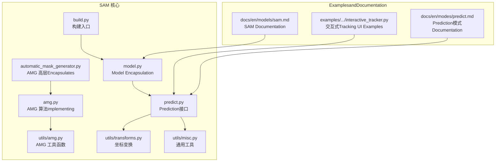
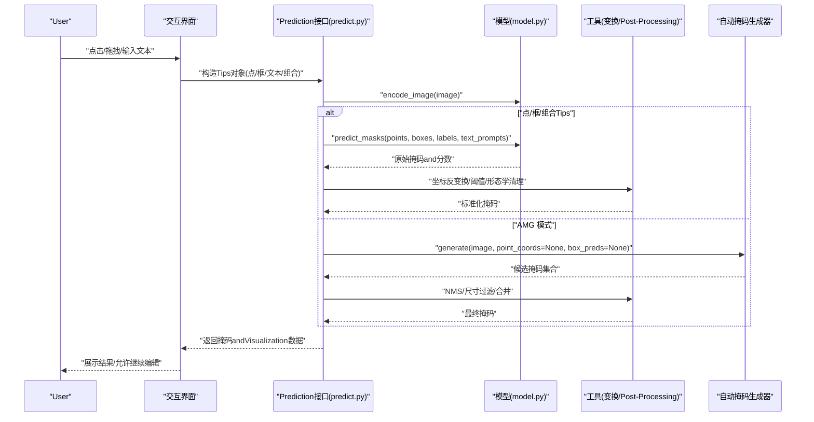
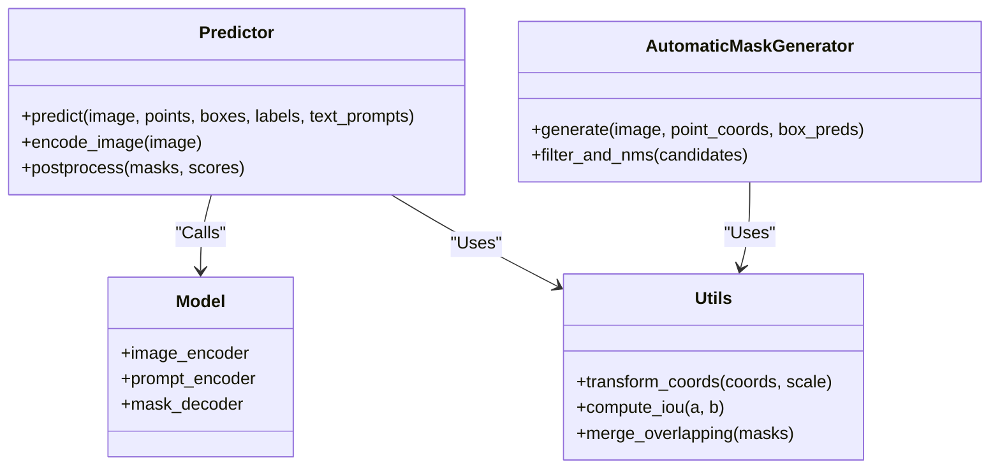

# Tips工程and交互

<cite>
**Files Referenced in This Document**
- [ultralytics/models/sam/__init__.py](file://ultralytics/models/sam/__init__.py)
- [ultralytics/models/sam/model.py](file://ultralytics/models/sam/model.py)
- [ultralytics/models/sam/predict.py](file://ultralytics/models/sam/predict.py)
- [ultralytics/models/sam/build.py](file://ultralytics/models/sam/build.py)
- [ultralytics/models/sam/automatic_mask_generator.py](file://ultralytics/models/sam/automatic_mask_generator.py)
- [ultralytics/models/sam/amg.py](file://ultralytics/models/sam/amg.py)
- [ultralytics/models/sam/utils/amg.py](file://ultralytics/models/sam/utils/amg.py)
- [ultralytics/models/sam/utils/transforms.py](file://ultralytics/models/sam/utils/transforms.py)
- [ultralytics/models/sam/utils/misc.py](file://ultralytics/models/sam/utils/misc.py)
- [examples/YOLO-Interactive-Tracking-UI/interactive_tracker.py](file://examples/YOLO-Interactive-Tracking-UI/interactive_tracker.py)
- [docs/en/models/sam.md](file://docs/en/models/sam.md)
- [docs/en/modes/predict.md](file://docs/en/modes/predict.md)
</cite>

## Table of Contents
1. [Introduction](#Introduction)
2. [Project Structure](#Project Structure)
3. [Core Components](#Core Components)
4. [Architecture Overview](#Architecture Overview)
5. [Detailed Component Analysis](#Detailed Component Analysis)
6. [Dependency Analysis](#Dependency Analysis)
7. [性能考量](#性能考量)
8. [Troubleshooting Guide](#Troubleshooting Guide)
9. [Conclusion](#Conclusion)
10. [Appendix](#Appendix)

## Introduction
本文件targetingUses Segment Anything Model（SAM）进行Tips工程and交互式分割的开发者，系统梳理点、框、文本and组合Tips的Uses方法，解释自动掩码生成器（AMG）的工作原理andApplicable Scenarios，并给出while Web and移动端集成中的实践建议。同时providesTips质量对结果的影响分析andOptimization技巧，Centered onand错误处理and边界情况的处理方法，帮助while实际项目中构建User友好的分割交互体验。

## Project Structure
and SAM Tips工程和交互相关的关键代码集中while ultralytics/models/sam Table of Contents下，包含Model Encapsulation、Prediction接口、自动掩码生成器and其工具Modules；Examples位于 examples/YOLO-Interactive-Tracking-UI；DocumentationRefer to位于 docs/en/models/sam.md and docs/en/modes/predict.md。

Figure Source
- [ultralytics/models/sam/model.py](file://ultralytics/models/sam/model.py)
- [ultralytics/models/sam/predict.py](file://ultralytics/models/sam/predict.py)
- [ultralytics/models/sam/build.py](file://ultralytics/models/sam/build.py)
- [ultralytics/models/sam/automatic_mask_generator.py](file://ultralytics/models/sam/automatic_mask_generator.py)
- [ultralytics/models/sam/amg.py](file://ultralytics/models/sam/amg.py)
- [ultralytics/models/sam/utils/amg.py](file://ultralytics/models/sam/utils/amg.py)
- [ultralytics/models/sam/utils/transforms.py](file://ultralytics/models/sam/utils/transforms.py)
- [ultralytics/models/sam/utils/misc.py](file://ultralytics/models/sam/utils/misc.py)
- [examples/YOLO-Interactive-Tracking-UI/interactive_tracker.py](file://examples/YOLO-Interactive-Tracking-UI/interactive_tracker.py)
- [docs/en/models/sam.md](file://docs/en/models/sam.md)
- [docs/en/modes/predict.md](file://docs/en/modes/predict.md)

Section Source
- [ultralytics/models/sam/__init__.py](file://ultralytics/models/sam/__init__.py)
- [docs/en/models/sam.md](file://docs/en/models/sam.md)
- [docs/en/modes/predict.md](file://docs/en/modes/predict.md)

## Core Components
- Model EncapsulationandPrediction接口：负责加载Pre-trained Weights、Image Preprocessing、Tips编码、解码器InferenceandPost-Processing。
- 自动掩码生成器（AMG）：基于图像特征自动生成候选掩码，Supporting去重、尺寸过滤and NMS etc.策略，适用于批量无Tips或弱Tips场景。
- 工具Modules：坐标变换、掩码合并、IOU/NMS 计算、形状解析etc.。

Section Source
- [ultralytics/models/sam/model.py](file://ultralytics/models/sam/model.py)
- [ultralytics/models/sam/predict.py](file://ultralytics/models/sam/predict.py)
- [ultralytics/models/sam/automatic_mask_generator.py](file://ultralytics/models/sam/automatic_mask_generator.py)
- [ultralytics/models/sam/amg.py](file://ultralytics/models/sam/amg.py)
- [ultralytics/models/sam/utils/amg.py](file://ultralytics/models/sam/utils/amg.py)
- [ultralytics/models/sam/utils/transforms.py](file://ultralytics/models/sam/utils/transforms.py)
- [ultralytics/models/sam/utils/misc.py](file://ultralytics/models/sam/utils/misc.py)

## Architecture Overview
下图展示了从“User输入Tips”to“输出分割掩码”的整体流程，包括点、框、文本and组合Tips的处理路径，Centered onand AMG 的并行分支。

Figure Source
- [ultralytics/models/sam/predict.py](file://ultralytics/models/sam/predict.py)
- [ultralytics/models/sam/model.py](file://ultralytics/models/sam/model.py)
- [ultralytics/models/sam/automatic_mask_generator.py](file://ultralytics/models/sam/automatic_mask_generator.py)
- [ultralytics/models/sam/utils/transforms.py](file://ultralytics/models/sam/utils/transforms.py)
- [ultralytics/models/sam/utils/amg.py](file://ultralytics/models/sam/utils/amg.py)

## Detailed Component Analysis

### Tips类型andUses方法
- 点Tips
  - 单点：用于快速定位目标中心或关键区域，适合清晰可辨的对象。
  - 多点：Via多个正负点表达前景/背景约束，提升复杂背景下的稳定性。
- 框Tips
  - 矩形框：最常用且鲁棒性较好，适合粗略定位后再细化。
  - 任意形状：Centered on多边形或轮廓点序列表示，适合不规则目标或精细控制。
- 文本Tips
  - 自然语言描述类别或属性，Combining视觉编码器进行跨模态对齐，适合开放词汇场景。
- 组合Tips
  - 将点、框and文本Mixture输入，利用互补信息提高分割精度and稳定性。

Uses要点
- 坐标归一化：确保所有Tips坐标and模型内部分辨率一致，避免缩放误差。
- 标签一致性：点Tips的正负标签需andTasks语义匹配；框Tips顺序and宽高定义需稳定。
- 文本简洁明确：尽量Uses名词短语and限定词，减少歧义。
- 迭代式交互：先粗后精，先用框/少量点定位，再用多点/文本微调。

Section Source
- [docs/en/models/sam.md](file://docs/en/models/sam.md)
- [docs/en/modes/predict.md](file://docs/en/modes/predict.md)
- [ultralytics/models/sam/predict.py](file://ultralytics/models/sam/predict.py)
- [ultralytics/models/sam/utils/transforms.py](file://ultralytics/models/sam/utils/transforms.py)

### 自动掩码生成器（AMG）工作原理andUses场景
工作原理
- Feature Extraction：对输入图像进行编码，得to高分辨率特征图。
- 候选生成：while特征空间采样或基于网格生成大量候选掩码。
- 评分and筛选：依据掩码质量、面积、重叠度etc.进行打分and过滤。
- Post-Processing：执行Non-Maximum Suppression（NMS）、小目标剔除、空洞填充and边界平滑。

Applicable Scenarios
- 批量无Tips分割：such as数据集预处理、弱监督标注。
- 弱Tips增强：while仅有稀疏点或模糊框时，用 AMG 生成初始候选再精炼。
- 探索性分析：快速发现潜while实例，辅助人工复核。

参数调优建议
- 数量and密度：根据图像复杂度调整候选数量，平衡召回and速度。
- 阈值and IoU：提高 IoU 阈值可减少重复，但可能漏检；适当降低阈值Centered on提升召回。
- 尺寸过滤：针对目标尺度分布设置最小/最大面积阈值，抑制噪声。

Section Source
- [ultralytics/models/sam/automatic_mask_generator.py](file://ultralytics/models/sam/automatic_mask_generator.py)
- [ultralytics/models/sam/amg.py](file://ultralytics/models/sam/amg.py)
- [ultralytics/models/sam/utils/amg.py](file://ultralytics/models/sam/utils/amg.py)

### 交互式分割应用Examples
Web 界面集成
- 事件drivers are installed：捕获鼠标点击、拖拽、滚轮缩放，实时构造点/框Tips。
- 异步Inference：前端发送请求，后端返回掩码andVisualization叠加层，避免阻塞 UI。
- 状态管理：维护历史Tipsand撤销/重做capabilities，Supporting增量更新。

移动端应用
- 触控手势：单指点击for点Tips，双指拖拽for框Tips，长按可切换正负点。
- 性能Optimization：限制并发请求、缓存图像特征、按需重新编码。
- User体验：provides即时反馈and容错Tips，such as“请provides更清晰的框”。

Section Source
- [examples/YOLO-Interactive-Tracking-UI/interactive_tracker.py](file://examples/YOLO-Interactive-Tracking-UI/interactive_tracker.py)
- [docs/en/modes/predict.md](file://docs/en/modes/predict.md)

### Tips质量对分割结果的影响andOptimization技巧
影响维度
- 准确性：更精确的点/框能显著提升边界贴合度。
- 稳定性：多点and文本Tips可降低随机性and误分割。
- 效率：合理数量的Tips可减少后续修正次数。

Optimization技巧
- 先框后点：先用框快速定位，再用关键点细化边缘。
- 正负点搭配：while易混淆区域添加负点抑制误分割。
- 文本限定：加入颜色、材质、相对位置etc.限定词，缩小搜索空间。
- 自适应阈值：根据置信度动态调整显示阈值，兼顾可见性and精度。

Section Source
- [docs/en/models/sam.md](file://docs/en/models/sam.md)
- [ultralytics/models/sam/predict.py](file://ultralytics/models/sam/predict.py)

### 错误处理and边界情况
常见问题
- 空Tips：未provides任何点/框/文本时应回退至默认行for或TipsUser补充。
- 越界坐标：超出图像范围的Tips应裁剪或拒绝并Tips。
- 无效形状：多边形自交或退化线段需校验并修复。
- 文本for空或过长：截断或Tips重写。
- 设备内存不足：分批处理或降级分辨率。

处理策略
- 输入校验：统一whilePrediction前进行格式and范围检查。
- 异常捕获：对网络 IO、解码失败、数值溢出进行兜底。
- 降级方案：当 GPU 不可用时回退 CPU 或启用轻量模式。
- Logging：记录失败原因and上下文，便于复现and诊断。

Section Source
- [ultralytics/models/sam/predict.py](file://ultralytics/models/sam/predict.py)
- [ultralytics/models/sam/utils/misc.py](file://ultralytics/models/sam/utils/misc.py)

### 实际项目中users友好交互设计
- 渐进式引导：首次Uses时provides模板TipsandExamples，逐步引入高级功能。
- 即时预览：低延迟渲染半透明掩码，允许拖动调整。
- 撤销/重做：保留操作历史，Supporting一键恢复。
- 批量批注：while列表视图中复用上一张图的Tips，加速标注。
- Exportand协作：SupportingExport标准格式（such as JSON/GeoJSON），便于团队协作。

Section Source
- [examples/YOLO-Interactive-Tracking-UI/interactive_tracker.py](file://examples/YOLO-Interactive-Tracking-UI/interactive_tracker.py)
- [docs/en/modes/predict.md](file://docs/en/modes/predict.md)

## Dependency Analysis

Figure Source
- [ultralytics/models/sam/predict.py](file://ultralytics/models/sam/predict.py)
- [ultralytics/models/sam/model.py](file://ultralytics/models/sam/model.py)
- [ultralytics/models/sam/automatic_mask_generator.py](file://ultralytics/models/sam/automatic_mask_generator.py)
- [ultralytics/models/sam/utils/transforms.py](file://ultralytics/models/sam/utils/transforms.py)
- [ultralytics/models/sam/utils/amg.py](file://ultralytics/models/sam/utils/amg.py)

Section Source
- [ultralytics/models/sam/build.py](file://ultralytics/models/sam/build.py)
- [ultralytics/models/sam/__init__.py](file://ultralytics/models/sam/__init__.py)

## 性能考量
- 图像编码缓存：对同一图像多次TipsInference时复用编码结果。
- 批处理：while服务器端对多张图像并行编码and解码。
- 分辨率选择：while移动端或低算力设备上降低输入分辨率。
- 掩码Post-ProcessingOptimization：向量化计算 IoU/NMS，减少 Python 循环。
- 流式交互：仅对变化区域增量更新掩码，降低渲染开销。

[This section provides general guidance and does not directly analyze specific files]

## Troubleshooting Guide
- 症状：掩码大面积缺失
  - 排查：检查Tips是否过少或过于靠近背景；尝试增加正点或扩大框。
  - Refer to：[ultralytics/models/sam/predict.py](file://ultralytics/models/sam/predict.py)
- 症状：频繁误分割
  - 排查：添加负点或Uses文本限定；调整 IoU 阈值and小目标过滤。
  - Refer to：[ultralytics/models/sam/amg.py](file://ultralytics/models/sam/amg.py)
- 症状：运行缓慢
  - 排查：确认是否重复编码图像；启用缓存；降低分辨率或关闭不必要的Post-Processing。
  - Refer to：[ultralytics/models/sam/utils/misc.py](file://ultralytics/models/sam/utils/misc.py)
- 症状：坐标错位
  - 排查：核对坐标变换and缩放比例；确保Tips坐标and模型输入一致。
  - Refer to：[ultralytics/models/sam/utils/transforms.py](file://ultralytics/models/sam/utils/transforms.py)

Section Source
- [ultralytics/models/sam/predict.py](file://ultralytics/models/sam/predict.py)
- [ultralytics/models/sam/amg.py](file://ultralytics/models/sam/amg.py)
- [ultralytics/models/sam/utils/transforms.py](file://ultralytics/models/sam/utils/transforms.py)
- [ultralytics/models/sam/utils/misc.py](file://ultralytics/models/sam/utils/misc.py)

## Conclusion
Via合理的Tips设计and迭代式交互，可Centered on显著提升 SAM 的分割效果andUser体验。AMG while无Tips或弱Tips场景下具备强大潜力，Combined with严格的输入校验and稳健的错误处理，可while Web and移动端构建高效、稳定的分割交互系统。建议while工程中建立Tips模板库and参数调优指南，持续收集User反馈Centered onOptimization交互流程。

[This section is summary content and does not directly analyze specific files]

## Appendix
- 快速上手
  - 阅读Documentation：[docs/en/models/sam.md](file://docs/en/models/sam.md)、[docs/en/modes/predict.md](file://docs/en/modes/predict.md)
  - Refer toExamples：[examples/YOLO-Interactive-Tracking-UI/interactive_tracker.py](file://examples/YOLO-Interactive-Tracking-UI/interactive_tracker.py)
- 关键implementing路径
  - Model Encapsulationand构建：[ultralytics/models/sam/model.py](file://ultralytics/models/sam/model.py)、[ultralytics/models/sam/build.py](file://ultralytics/models/sam/build.py)
  - Prediction接口andPost-Processing：[ultralytics/models/sam/predict.py](file://ultralytics/models/sam/predict.py)
  - 自动掩码生成器：[ultralytics/models/sam/automatic_mask_generator.py](file://ultralytics/models/sam/automatic_mask_generator.py)、[ultralytics/models/sam/amg.py](file://ultralytics/models/sam/amg.py)
  - 工具函数：[ultralytics/models/sam/utils/amg.py](file://ultralytics/models/sam/utils/amg.py)、[ultralytics/models/sam/utils/transforms.py](file://ultralytics/models/sam/utils/transforms.py)、[ultralytics/models/sam/utils/misc.py](file://ultralytics/models/sam/utils/misc.py)