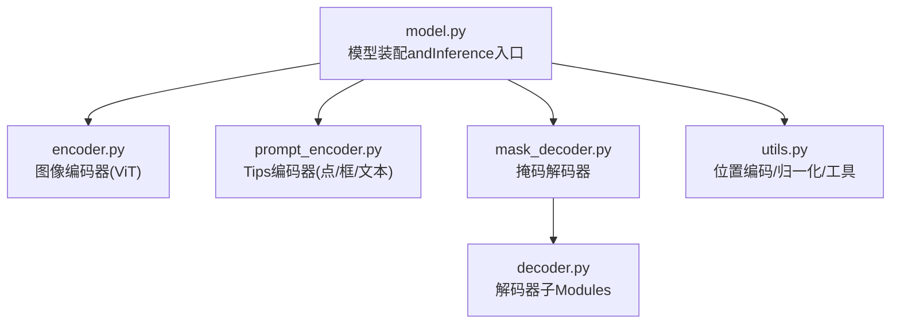
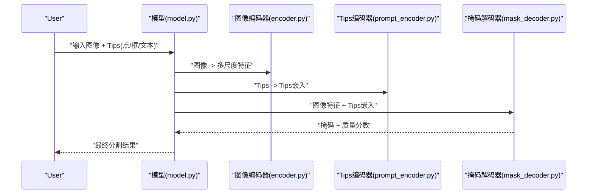
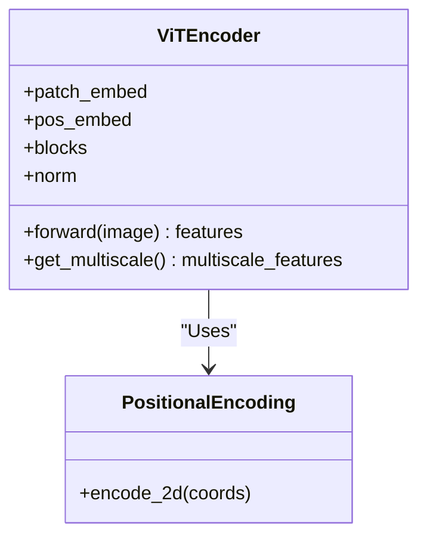
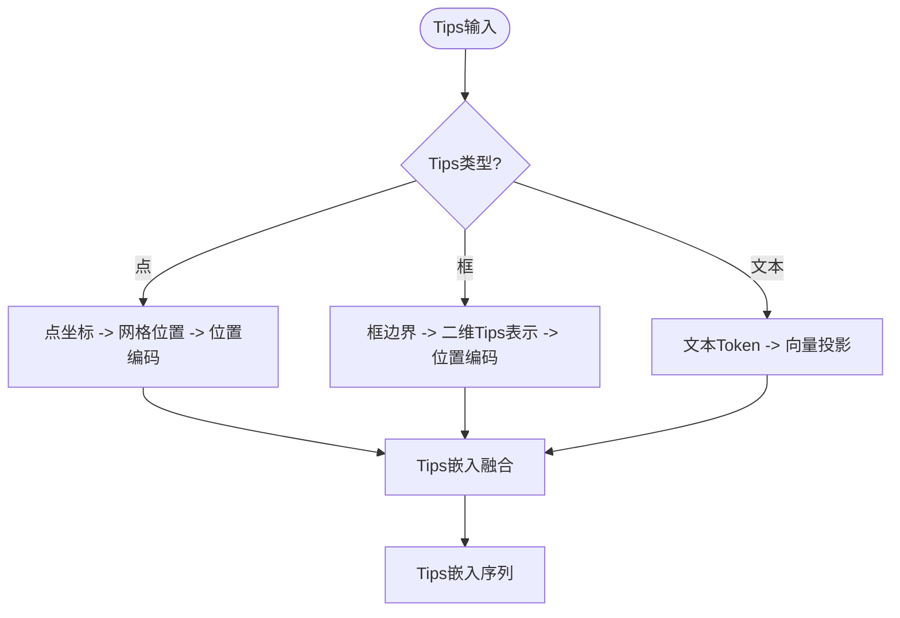
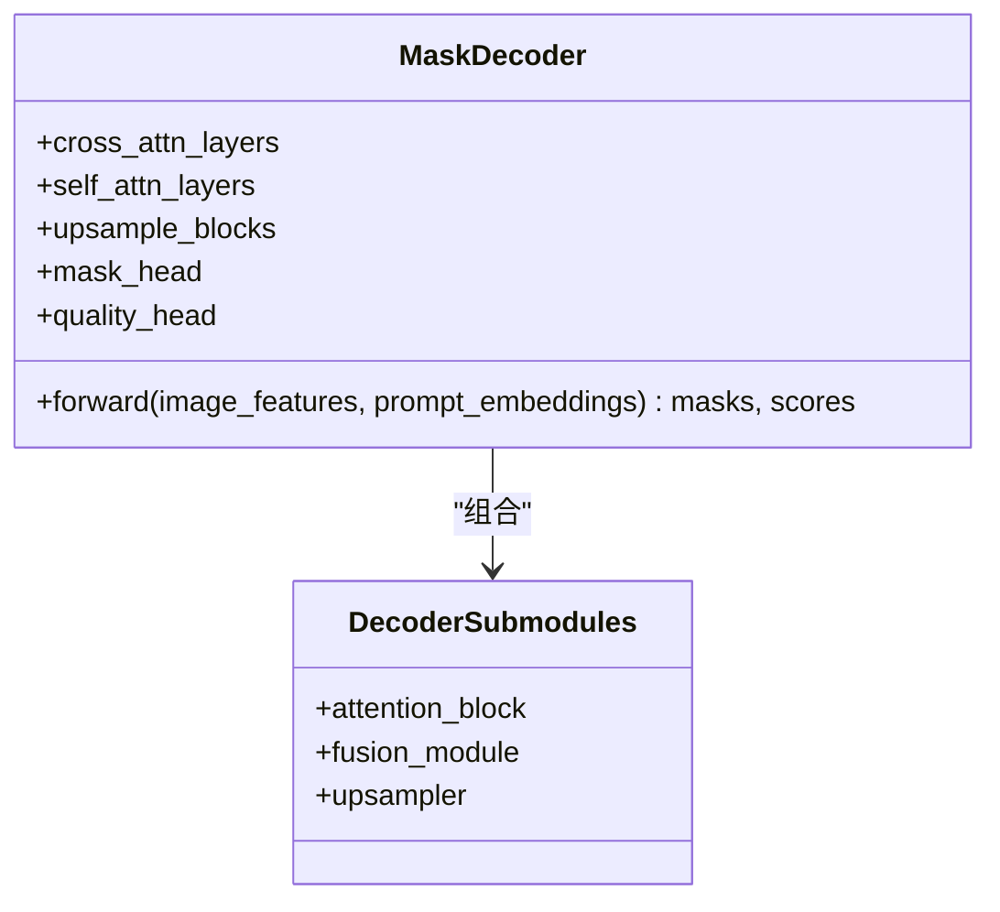
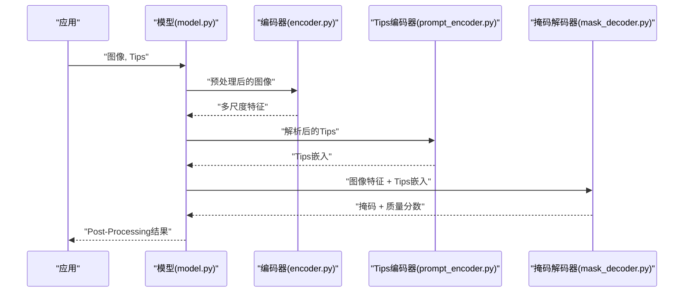
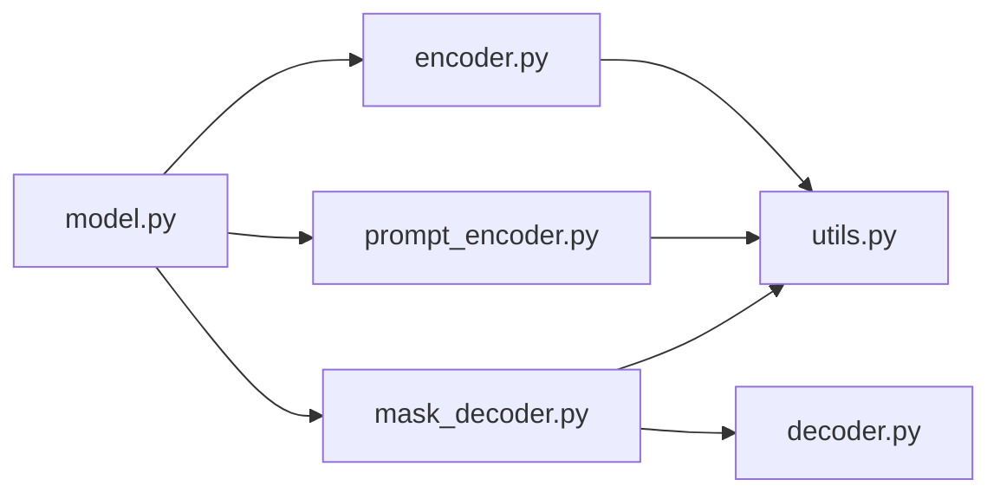

# SAMCore Architecture

<cite>
**Files Referenced in This Document**
- [ultralytics/models/sam/model.py](file://ultralytics/models/sam/model.py)
- [ultralytics/models/sam/encoder.py](file://ultralytics/models/sam/encoder.py)
- [ultralytics/models/sam/decoder.py](file://ultralytics/models/sam/decoder.py)
- [ultralytics/models/sam/prompt_encoder.py](file://ultralytics/models/sam/prompt_encoder.py)
- [ultralytics/models/sam/utils.py](file://ultralytics/models/sam/utils.py)
- [ultralytics/models/sam/__init__.py](file://ultralytics/models/sam/__init__.py)
- [ultralytics/models/sam/mask_decoder.py](file://ultralytics/models/sam/mask_decoder.py)
</cite>

## Table of Contents
1. [Introduction](#Introduction)
2. [Project Structure](#Project Structure)
3. [Core Components](#Core Components)
4. [Architecture Overview](#Architecture Overview)
5. [Detailed Component Analysis](#Detailed Component Analysis)
6. [Dependency Analysis](#Dependency Analysis)
7. [性能andOptimization](#性能andOptimization)
8. [Troubleshooting Guide](#Troubleshooting Guide)
9. [Conclusion](#Conclusion)
10. [Appendix](#Appendix)

## Introduction
本技术Documentation聚焦于Segment Anything Model（SAM）while该仓库中的核心implementing，围绕三组件架构unfold：图像编码器（基于ViT-B/L/H）、Tips编码器、掩码解码器。Documentation深入解释图像Feature Extraction、多尺度特征融合、位置编码etc.关键技术；阐述Tips编码器such as何统一处理点、框、文本etc.MultimodalUser输入；解析掩码解码器such as何生成高质量分割掩码。同时覆盖模型权重初始化、Training策略andInferenceOptimization要点，并provides架构图and数据流图帮助理解各组件交互关系。

## Project Structure
SAM相关代码位于 ultralytics/models/sam Table of Contents下，采用“按功能Modules拆分”的组织方式：
- model.py：对外暴露的Model EncapsulationandInference入口，负责组装编码器、Tips编码器and解码器，管理输入输出andPost-Processing。
- encoder.py：图像编码器，包含ViT主干andOptional的多尺度特征融合Modules。
- prompt_encoder.py：Tips编码器，Supporting点、框、文本etc.多种Tips类型并融合forTips嵌入。
- mask_decoder.py / decoder.py：掩码解码器，将图像特征andTips嵌入融合，迭代细化生成掩码。
- utils.py：General Utility Functions（such as位置编码、归一化、激活、Auxiliary Lossetc.）。
- __init__.py：包级Exportand注册。

Figure Source
- [ultralytics/models/sam/model.py](file://ultralytics/models/sam/model.py)
- [ultralytics/models/sam/encoder.py](file://ultralytics/models/sam/encoder.py)
- [ultralytics/models/sam/prompt_encoder.py](file://ultralytics/models/sam/prompt_encoder.py)
- [ultralytics/models/sam/mask_decoder.py](file://ultralytics/models/sam/mask_decoder.py)
- [ultralytics/models/sam/decoder.py](file://ultralytics/models/sam/decoder.py)
- [ultralytics/models/sam/utils.py](file://ultralytics/models/sam/utils.py)

Section Source
- [ultralytics/models/sam/model.py](file://ultralytics/models/sam/model.py)
- [ultralytics/models/sam/encoder.py](file://ultralytics/models/sam/encoder.py)
- [ultralytics/models/sam/prompt_encoder.py](file://ultralytics/models/sam/prompt_encoder.py)
- [ultralytics/models/sam/mask_decoder.py](file://ultralytics/models/sam/mask_decoder.py)
- [ultralytics/models/sam/decoder.py](file://ultralytics/models/sam/decoder.py)
- [ultralytics/models/sam/utils.py](file://ultralytics/models/sam/utils.py)
- [ultralytics/models/sam/__init__.py](file://ultralytics/models/sam/__init__.py)

## Core Components
- 图像编码器（ViT-B/L/H）
  - 作用：将输入图像转换for深层语义特征图，provides高分辨率and多尺度特征用于后续融合。
  - 关键点：Patch Embedding、多层Transformer Block、层归一化、残差连接、Optional多尺度特征输出。
- Tips编码器
  - 作用：将点、框、文本etc.UserTips编码for统一的Tips嵌入序列，并and图像特征对齐。
  - 关键点：点坐标to网格位置的映射、框边界to二维Tips表示、文本Tokento向量投影、Tips位置编码and融合。
- 掩码解码器
  - 作用：Centered on图像特征andTips嵌入for条件，Via交叉注意力and自注意力迭代细化，输出高质量分割掩码。
  - 关键点：跨模态注意力、掩码头、掩码质量评分、多尺度融合and上采样。

Section Source
- [ultralytics/models/sam/encoder.py](file://ultralytics/models/sam/encoder.py)
- [ultralytics/models/sam/prompt_encoder.py](file://ultralytics/models/sam/prompt_encoder.py)
- [ultralytics/models/sam/mask_decoder.py](file://ultralytics/models/sam/mask_decoder.py)
- [ultralytics/models/sam/decoder.py](file://ultralytics/models/sam/decoder.py)
- [ultralytics/models/sam/utils.py](file://ultralytics/models/sam/utils.py)

## Architecture Overview
下图展示端to端数据流：图像经编码器得to多尺度特征；Tips经Tips编码器得toTips嵌入；两者while解码器中融合，迭代生成掩码and质量分数。

Figure Source
- [ultralytics/models/sam/model.py](file://ultralytics/models/sam/model.py)
- [ultralytics/models/sam/encoder.py](file://ultralytics/models/sam/encoder.py)
- [ultralytics/models/sam/prompt_encoder.py](file://ultralytics/models/sam/prompt_encoder.py)
- [ultralytics/models/sam/mask_decoder.py](file://ultralytics/models/sam/mask_decoder.py)

## Detailed Component Analysis

### 图像编码器（ViT-B/L/H）
- 设计原理
  - UsesVision Transformer作for主干，将图像切分forPatch并Via线性投影进入Transformer堆叠。
  - 引入层归一化and残差连接提升稳定性and收敛性。
  - Optional多尺度特征输出，便于下游融合and高分辨率细节保留。
- 关键implementing要点
  - Patch Embeddingand位置编码注入。
  - 多层Transformer Block（多头注意力+前馈网络）。
  - 多尺度特征聚合（例such as从不同深度层抽取特征并进行上采样或拼接）。
- 复杂度and内存
  - 时间复杂度随层数and通道数增长；多尺度特征会增加显存占用。
  - 可Via减少层级或通道数进行权衡。
- Optimization建议
  - UsesMixture精度TrainingandInference。
  - 对多尺度特征做选择性融合Centered on降低计算量。
  - 缓存中间特征避免重复计算。

Figure Source
- [ultralytics/models/sam/encoder.py](file://ultralytics/models/sam/encoder.py)
- [ultralytics/models/sam/utils.py](file://ultralytics/models/sam/utils.py)

Section Source
- [ultralytics/models/sam/encoder.py](file://ultralytics/models/sam/encoder.py)
- [ultralytics/models/sam/utils.py](file://ultralytics/models/sam/utils.py)

### Tips编码器（点、框、文本）
- 设计原理
  - 将多种Tips类型统一编码for可融合的Tips嵌入序列，Centered on便and图像特征进行跨模态交互。
  - 点Tips：将二维坐标映射to特征网格位置，并添加位置编码。
  - 框Tips：将左上角and右下角坐标转化for二维Tips表示，并加入相对位置信息。
  - 文本Tips：Via文本Token编码器（或投影层）将词元映射toand视觉相同的维度空间。
- 关键implementing要点
  - Tips类型判别and分支处理。
  - Tips位置编码andTips嵌入融合（拼接/相加）。
  - 输出固定长度的Tips嵌入序列供解码器Uses。
- 数据流
  - 输入：点集、框集、文本Token序列。
  - 处理：分别编码后对齐维度and长度，再融合。
  - 输出：Tips嵌入序列。

Figure Source
- [ultralytics/models/sam/prompt_encoder.py](file://ultralytics/models/sam/prompt_encoder.py)
- [ultralytics/models/sam/utils.py](file://ultralytics/models/sam/utils.py)

Section Source
- [ultralytics/models/sam/prompt_encoder.py](file://ultralytics/models/sam/prompt_encoder.py)
- [ultralytics/models/sam/utils.py](file://ultralytics/models/sam/utils.py)

### 掩码解码器（高质量分割掩码生成）
- 设计原理
  - Centered on图像特征andTips嵌入for条件，Via自注意力and交叉注意力迭代细化掩码表示。
  - 引入掩码头and质量评分头，分别Prediction像素级掩码and掩码可信度。
  - 多尺度融合and上采样策略保证细节and全局一致性。
- 关键implementing要点
  - 跨模态注意力：图像特征作forKV，Tips嵌入作forQ，或反之。
  - 掩码迭代细化：逐步更新掩码表示并上采样至目标分辨率。
  - 质量分数：Evaluation每个候选掩码的可信度，用于筛选或加权。
- 复杂度and内存
  - 注意力计算随特征尺寸andTips数量增长；多尺度融合增加显存。
  - 可Via限制Tips数量and选择关键尺度进行Optimization。

Figure Source
- [ultralytics/models/sam/mask_decoder.py](file://ultralytics/models/sam/mask_decoder.py)
- [ultralytics/models/sam/decoder.py](file://ultralytics/models/sam/decoder.py)

Section Source
- [ultralytics/models/sam/mask_decoder.py](file://ultralytics/models/sam/mask_decoder.py)
- [ultralytics/models/sam/decoder.py](file://ultralytics/models/sam/decoder.py)

### 模型装配andInference流程（model.py）
- 角色and职责
  - 负责实例化并串联图像编码器、Tips编码器and掩码解码器。
  - 管理输入预处理（尺寸归一化、格式转换）、Tips解析andPost-Processing（阈值化、NMS、Visualization）。
- Inference步骤
  - Image Preprocessing -> 编码器 -> 多尺度特征。
  - Tips解析 -> Tips编码器 -> Tips嵌入。
  - 解码器融合 -> 掩码and质量分数 -> Post-Processing输出。
- 错误处理
  - 输入形状校验、设备一致性检查、空Tips处理。

Figure Source
- [ultralytics/models/sam/model.py](file://ultralytics/models/sam/model.py)
- [ultralytics/models/sam/encoder.py](file://ultralytics/models/sam/encoder.py)
- [ultralytics/models/sam/prompt_encoder.py](file://ultralytics/models/sam/prompt_encoder.py)
- [ultralytics/models/sam/mask_decoder.py](file://ultralytics/models/sam/mask_decoder.py)

Section Source
- [ultralytics/models/sam/model.py](file://ultralytics/models/sam/model.py)

## Dependency Analysis
- Modules耦合
  - model.py 强耦合 encoder.py、prompt_encoder.py、mask_decoder.py。
  - mask_decoder.py 依赖 decoder.py 的子Modules（注意力块、融合Modules、上采样器）。
  - 各Modules共享 utils.py 的工具函数（位置编码、归一化、激活etc.）。
- External Dependencies
  - PyTorch张量操作and自动微分。
  - 可能的ONNX/TensorRTExport工具链（由上层引擎Calls）。
- Potential Cycles依赖
  - 当前结构无直接循环导入；若新增跨Modules回调需小心。

Figure Source
- [ultralytics/models/sam/model.py](file://ultralytics/models/sam/model.py)
- [ultralytics/models/sam/encoder.py](file://ultralytics/models/sam/encoder.py)
- [ultralytics/models/sam/prompt_encoder.py](file://ultralytics/models/sam/prompt_encoder.py)
- [ultralytics/models/sam/mask_decoder.py](file://ultralytics/models/sam/mask_decoder.py)
- [ultralytics/models/sam/decoder.py](file://ultralytics/models/sam/decoder.py)
- [ultralytics/models/sam/utils.py](file://ultralytics/models/sam/utils.py)

Section Source
- [ultralytics/models/sam/model.py](file://ultralytics/models/sam/model.py)
- [ultralytics/models/sam/encoder.py](file://ultralytics/models/sam/encoder.py)
- [ultralytics/models/sam/prompt_encoder.py](file://ultralytics/models/sam/prompt_encoder.py)
- [ultralytics/models/sam/mask_decoder.py](file://ultralytics/models/sam/mask_decoder.py)
- [ultralytics/models/sam/decoder.py](file://ultralytics/models/sam/decoder.py)
- [ultralytics/models/sam/utils.py](file://ultralytics/models/sam/utils.py)

## 性能andOptimization
- Training策略
  - Mixture精度Training（AMP）降低显存and加速计算。
  - 多尺度特征选择性融合，平衡精度and速度。
  - Tips数量上限and批内Tips分布控制，稳定Gradient。
- InferenceOptimization
  - 静态形状and算子融合（ONNX/TensorRT）。
  - 特征缓存and复用（同一图像多次Tips时）。
  - 动态Tips裁剪（仅保留高置信度Tips）。
- 内存and速度权衡
  - 调整ViT层数and通道数Centered on适配资源。
  - 减少上采样阶段分辨率或Uses渐进式上采样。
  - 量化（INT8/FP16）and编译Optimization（torch.compile）。

[This section provides general guidance and does not directly analyze specific files]

## Troubleshooting Guide
- 常见错误
  - 输入形状不一致：确保图像尺寸and编码器期望一致，Tips坐标范围正确。
  - 设备不一致：所有子Modulesand张量应while同一设备上。
  - 空Tips或无效Tips：whileTips编码器中加入空Tips检测and默认行for。
- 调试建议
  - 打印中间特征形状and统计量（均值、方差、NaN检查）。
  - 逐Modules断点Validation数据流（编码器输出、Tips嵌入、解码器中间表示）。
  - Uses最小复现Examples隔离问题。

Section Source
- [ultralytics/models/sam/model.py](file://ultralytics/models/sam/model.py)
- [ultralytics/models/sam/utils.py](file://ultralytics/models/sam/utils.py)

## Conclusion
该仓库中的SAMimplementing遵循经典的三组件架构：ViT图像编码器provides多尺度特征，Tips编码器统一处理点、框、文本，掩码解码器Via跨模态注意力and迭代细化生成高质量掩码。Via合理的权重初始化、Training策略andInferenceOptimization，可while精度and效率之间取得良好平衡。建议while工程实践中Combining具体Tasks需求调整多尺度融合策略andTips数量，Centered on获得最佳性能。

[This section is summary content and does not directly analyze specific files]

## Appendix
- 术语表
  - 多尺度特征：来自不同深度的特征图，兼顾全局语义and局部细节。
  - Tips嵌入：将User输入（点、框、文本）编码forand图像特征同维度的向量序列。
  - 掩码质量分数：对每个候选掩码的可信度评分，用于筛选and加权。
- Refer to路径
  - 模型装配andInference入口：[ultralytics/models/sam/model.py](file://ultralytics/models/sam/model.py)
  - 图像编码器implementing：[ultralytics/models/sam/encoder.py](file://ultralytics/models/sam/encoder.py)
  - Tips编码器implementing：[ultralytics/models/sam/prompt_encoder.py](file://ultralytics/models/sam/prompt_encoder.py)
  - 掩码解码器implementing：[ultralytics/models/sam/mask_decoder.py](file://ultralytics/models/sam/mask_decoder.py)
  - 解码器子Modules：[ultralytics/models/sam/decoder.py](file://ultralytics/models/sam/decoder.py)
  - 工具函数and位置编码：[ultralytics/models/sam/utils.py](file://ultralytics/models/sam/utils.py)
  - 包级Export：[ultralytics/models/sam/__init__.py](file://ultralytics/models/sam/__init__.py)