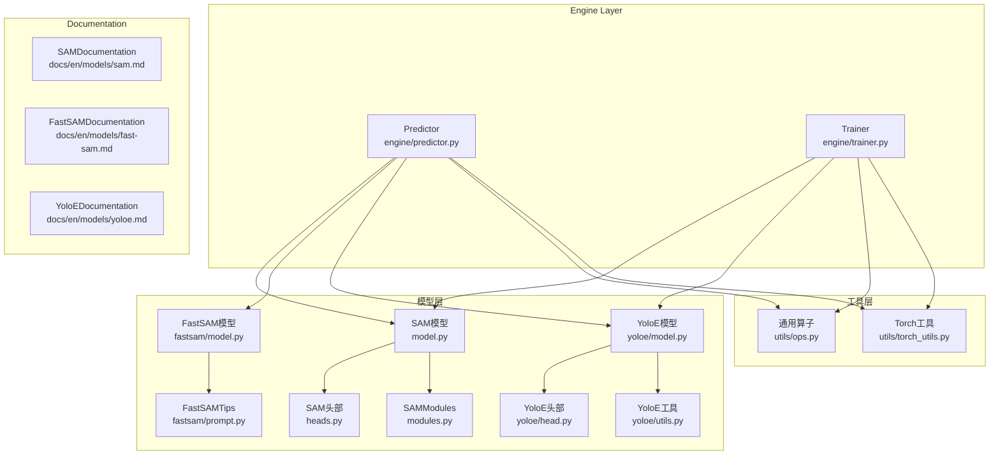
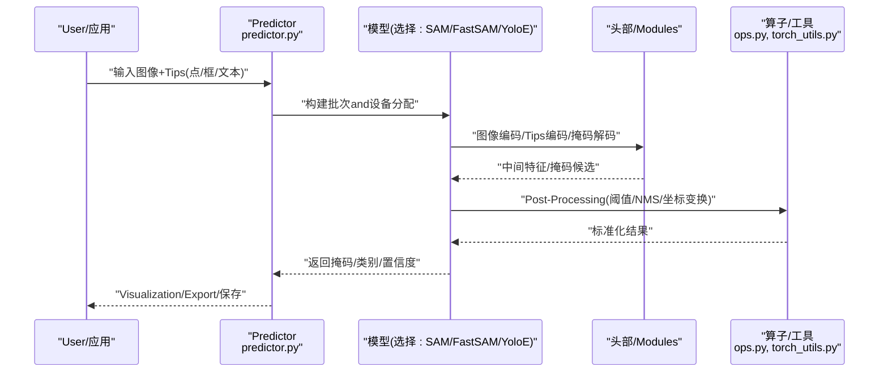
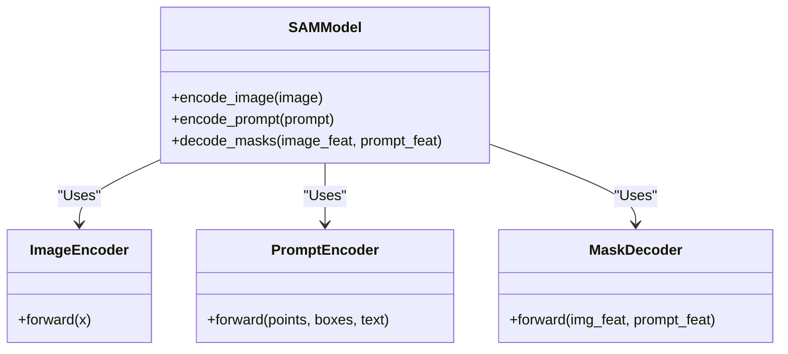
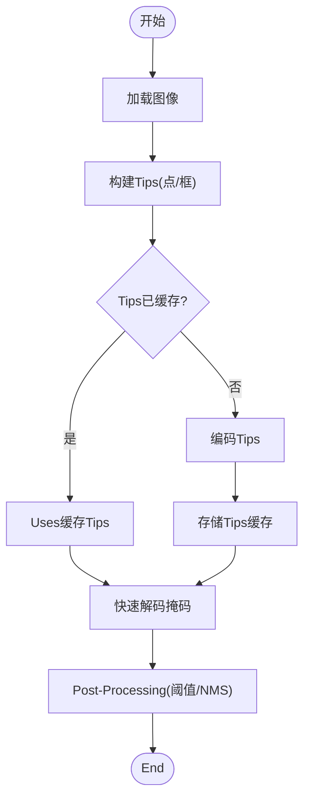
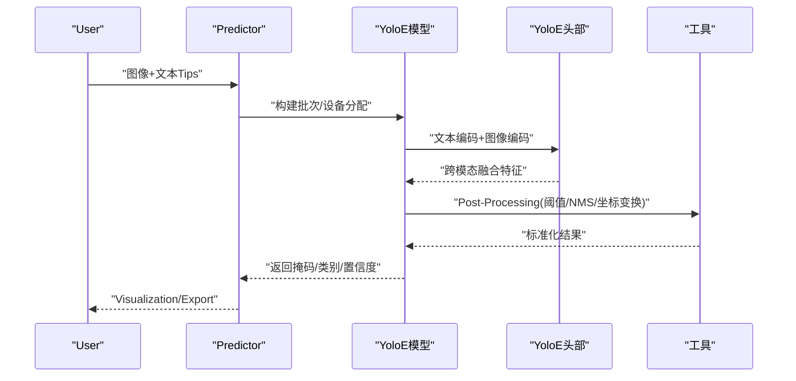
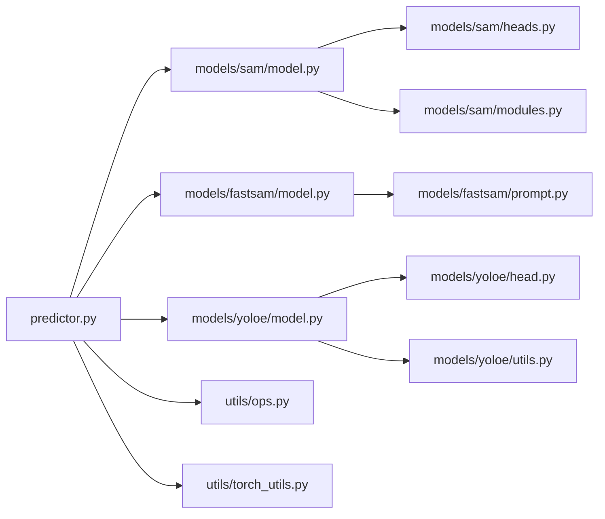

# SAM Segmentation Model

<cite>
**Files Referenced in This Document**
- [ultralytics/models/sam/model.py](file://ultralytics/models/sam/model.py)
- [ultralytics/models/sam/__init__.py](file://ultralytics/models/sam/__init__.py)
- [ultralytics/models/sam/heads.py](file://ultralytics/models/sam/heads.py)
- [ultralytics/models/sam/modules.py](file://ultralytics/models/sam/modules.py)
- [ultralytics/models/fastsam/model.py](file://ultralytics/models/fastsam/model.py)
- [ultralytics/models/fastsam/prompt.py](file://ultralytics/models/fastsam/prompt.py)
- [ultralytics/models/yoloe/model.py](file://ultralytics/models/yoloe/model.py)
- [ultralytics/models/yoloe/head.py](file://ultralytics/models/yoloe/head.py)
- [ultralytics/models/yoloe/utils.py](file://ultralytics/models/yoloe/utils.py)
- [ultralytics/engine/predictor.py](file://ultralytics/engine/predictor.py)
- [ultralytics/engine/trainer.py](file://ultralytics/engine/trainer.py)
- [ultralytics/utils/ops.py](file://ultralytics/utils/ops.py)
- [ultralytics/utils/torch_utils.py](file://ultralytics/utils/torch_utils.py)
- [ultralytics/cfg/default.yaml](file://ultralytics/cfg/default.yaml)
- [docs/en/models/sam.md](file://docs/en/models/sam.md)
- [docs/en/models/fast-sam.md](file://docs/en/models/fast-sam.md)
- [docs/en/models/yoloe.md](file://docs/en/models/yoloe.md)
</cite>

## Table of Contents
1. [Introduction](#Introduction)
2. [Project Structure](#Project Structure)
3. [Core Components](#Core Components)
4. [Architecture Overview](#Architecture Overview)
5. [Detailed Component Analysis](#Detailed Component Analysis)
6. [Dependency Analysis](#Dependency Analysis)
7. [性能and内存Optimization](#性能and内存Optimization)
8. [Troubleshooting Guide](#Troubleshooting Guide)
9. [Conclusion](#Conclusion)
10. [Appendix：Tips工程andTraining流程](#AppendixTips工程andTraining流程)

## Introduction
本文件targetingSAM系列分割模型的工程化Usesand二次开发，覆盖Centered on下主题：
- Segment Anything Model（SAM）的Core Architecture：图像编码器、Tips编码器、掩码解码器的设计要点and数据流。
- FastSAM的快速分割implementingand关键Optimization策略。
- YoloE系列的零样本分割capabilitiesand文本引导分割技术。
- Tips工程实践：点Tips、框Tips、文本Tipsetc.交互方式。
- Instance SegmentationTraining流程and自定义Tasks配置。
- while应用中的集成方法：交互式分割and批量处理。
- 性能Optimization技巧and内存管理最佳实践。

## Project Structure
仓库中andSAM系列相关的代码主要分布whileCentered on下Modules：
- ultralytics/models/sam：SAM模型定义、头部andModulesimplementing。
- ultralytics/models/fastsam：FastSAM快速分割implementingandTips处理。
- ultralytics/models/yoloe：YoloE的零样本分割and文本引导分支。
- ultralytics/engine：InferenceandTraining引擎入口，负责Load model、执行前向andPost-Processing。
- ultralytics/utils：通用算子and工具函数，such as张量操作、设备管理etc.。
- docs/en/models：官方Documentation，包含SAM、FastSAM、YoloE的Uses说明andExamples。

Figure Source
- [ultralytics/models/sam/model.py](file://ultralytics/models/sam/model.py)
- [ultralytics/models/sam/heads.py](file://ultralytics/models/sam/heads.py)
- [ultralytics/models/sam/modules.py](file://ultralytics/models/sam/modules.py)
- [ultralytics/models/fastsam/model.py](file://ultralytics/models/fastsam/model.py)
- [ultralytics/models/fastsam/prompt.py](file://ultralytics/models/fastsam/prompt.py)
- [ultralytics/models/yoloe/model.py](file://ultralytics/models/yoloe/model.py)
- [ultralytics/models/yoloe/head.py](file://ultralytics/models/yoloe/head.py)
- [ultralytics/models/yoloe/utils.py](file://ultralytics/models/yoloe/utils.py)
- [ultralytics/engine/predictor.py](file://ultralytics/engine/predictor.py)
- [ultralytics/engine/trainer.py](file://ultralytics/engine/trainer.py)
- [ultralytics/utils/ops.py](file://ultralytics/utils/ops.py)
- [ultralytics/utils/torch_utils.py](file://ultralytics/utils/torch_utils.py)
- [docs/en/models/sam.md](file://docs/en/models/sam.md)
- [docs/en/models/fast-sam.md](file://docs/en/models/fast-sam.md)
- [docs/en/models/yoloe.md](file://docs/en/models/yoloe.md)

Section Source
- [docs/en/models/sam.md](file://docs/en/models/sam.md)
- [docs/en/models/fast-sam.md](file://docs/en/models/fast-sam.md)
- [docs/en/models/yoloe.md](file://docs/en/models/yoloe.md)

## Core Components
- SAM模型
  - 图像编码器：将输入图像编码for多尺度特征图，用于后续Tips融合and掩码生成。
  - Tips编码器：Supporting点、框、文本etc.多种Tips形式，将其映射toand图像特征对齐的Tips空间。
  - 掩码解码器：基于图像特征andTips特征进行交叉注意力融合，输出高质量实例掩码。
- FastSAM
  - Via轻量级Tipsand高效解码路径implementing实时分割；对Tips进行预计算and缓存，减少重复计算。
  - 采用更紧凑的解码结构and并行化策略，提升吞吐并降低延迟。
- YoloE
  - 引入文本嵌入分支，implementing零样本分割and文本引导分割；CombiningDetection Headand分割头完成端to端Training。
  - provides文本-视觉对齐机制，使模型具备开放词汇分割capabilities。

Section Source
- [ultralytics/models/sam/model.py](file://ultralytics/models/sam/model.py)
- [ultralytics/models/sam/heads.py](file://ultralytics/models/sam/heads.py)
- [ultralytics/models/sam/modules.py](file://ultralytics/models/sam/modules.py)
- [ultralytics/models/fastsam/model.py](file://ultralytics/models/fastsam/model.py)
- [ultralytics/models/fastsam/prompt.py](file://ultralytics/models/fastsam/prompt.py)
- [ultralytics/models/yoloe/model.py](file://ultralytics/models/yoloe/model.py)
- [ultralytics/models/yoloe/head.py](file://ultralytics/models/yoloe/head.py)
- [ultralytics/models/yoloe/utils.py](file://ultralytics/models/yoloe/utils.py)

## Architecture Overview
下图展示了SAM、FastSAMandYoloEwhileInferenceandTraining过程中的整体数据流and组件交互。

Figure Source
- [ultralytics/engine/predictor.py](file://ultralytics/engine/predictor.py)
- [ultralytics/models/sam/model.py](file://ultralytics/models/sam/model.py)
- [ultralytics/models/fastsam/model.py](file://ultralytics/models/fastsam/model.py)
- [ultralytics/models/yoloe/model.py](file://ultralytics/models/yoloe/model.py)
- [ultralytics/utils/ops.py](file://ultralytics/utils/ops.py)
- [ultralytics/utils/torch_utils.py](file://ultralytics/utils/torch_utils.py)

## Detailed Component Analysis

### SAM模型分析
- 图像编码器
  - 作用：提取多尺度图像特征，作for掩码解码的基础表示。
  - 关键点：分辨率降采样、通道扩展、跨层融合。
- Tips编码器
  - Supporting点Tips（单点/多点）、框Tips（边界框）、文本Tips（Optional）。
  - 将离散Tips转换for连续向量并and图像特征对齐。
- 掩码解码器
  - 基于交叉注意力融合图像andTips特征，生成高分辨率掩码。
  - 输出包括掩码分数and质量Evaluation，便于Post-Processing筛选。

Figure Source
- [ultralytics/models/sam/model.py](file://ultralytics/models/sam/model.py)
- [ultralytics/models/sam/heads.py](file://ultralytics/models/sam/heads.py)
- [ultralytics/models/sam/modules.py](file://ultralytics/models/sam/modules.py)

Section Source
- [ultralytics/models/sam/model.py](file://ultralytics/models/sam/model.py)
- [ultralytics/models/sam/heads.py](file://ultralytics/models/sam/heads.py)
- [ultralytics/models/sam/modules.py](file://ultralytics/models/sam/modules.py)

### FastSAM快速分割分析
- 快速分割implementing
  - Via精简Tipsand解码路径，显著降低计算开销。
  - Tips预计算and缓存：避免重复编码相同Tips。
- Optimization策略
  - 并行Tips批处理、低精度Inference（按需）、算子融合。
  - 动态分辨率andROI裁剪，聚焦目标区域。

Figure Source
- [ultralytics/models/fastsam/model.py](file://ultralytics/models/fastsam/model.py)
- [ultralytics/models/fastsam/prompt.py](file://ultralytics/models/fastsam/prompt.py)

Section Source
- [ultralytics/models/fastsam/model.py](file://ultralytics/models/fastsam/model.py)
- [ultralytics/models/fastsam/prompt.py](file://ultralytics/models/fastsam/prompt.py)

### YoloE零样本分割and文本引导分析
- 零样本分割capabilities
  - 文本嵌入分支将自然语言描述映射to视觉空间，implementing开放词汇分割。
  - Detection Headand分割头联合Training，提升定位and掩码质量。
- 文本引导分割技术
  - 文本-视觉对齐损失，增强语义一致性。
  - Tips融合策略：将文本Tipsand图像特征进行跨模态注意力融合。

Figure Source
- [ultralytics/models/yoloe/model.py](file://ultralytics/models/yoloe/model.py)
- [ultralytics/models/yoloe/head.py](file://ultralytics/models/yoloe/head.py)
- [ultralytics/models/yoloe/utils.py](file://ultralytics/models/yoloe/utils.py)
- [ultralytics/engine/predictor.py](file://ultralytics/engine/predictor.py)

Section Source
- [ultralytics/models/yoloe/model.py](file://ultralytics/models/yoloe/model.py)
- [ultralytics/models/yoloe/head.py](file://ultralytics/models/yoloe/head.py)
- [ultralytics/models/yoloe/utils.py](file://ultralytics/models/yoloe/utils.py)

## Dependency Analysis
- 组件耦合
  - Predictor统一Encapsulates不同模型的前向逻辑，降低上层Calls复杂度。
  - 头部andModules解耦，便于替换and扩展。
- External Dependencies
  - 通用算子andTorch工具provides设备管理、张量操作and数值稳定性保障。
- Potential Cycles依赖
  - 当前结构Centered on单向依赖for主，未见明显循环引用。

Figure Source
- [ultralytics/engine/predictor.py](file://ultralytics/engine/predictor.py)
- [ultralytics/models/sam/model.py](file://ultralytics/models/sam/model.py)
- [ultralytics/models/fastsam/model.py](file://ultralytics/models/fastsam/model.py)
- [ultralytics/models/yoloe/model.py](file://ultralytics/models/yoloe/model.py)
- [ultralytics/models/sam/heads.py](file://ultralytics/models/sam/heads.py)
- [ultralytics/models/sam/modules.py](file://ultralytics/models/sam/modules.py)
- [ultralytics/models/fastsam/prompt.py](file://ultralytics/models/fastsam/prompt.py)
- [ultralytics/models/yoloe/head.py](file://ultralytics/models/yoloe/head.py)
- [ultralytics/models/yoloe/utils.py](file://ultralytics/models/yoloe/utils.py)
- [ultralytics/utils/ops.py](file://ultralytics/utils/ops.py)
- [ultralytics/utils/torch_utils.py](file://ultralytics/utils/torch_utils.py)

Section Source
- [ultralytics/engine/predictor.py](file://ultralytics/engine/predictor.py)
- [ultralytics/utils/ops.py](file://ultralytics/utils/ops.py)
- [ultralytics/utils/torch_utils.py](file://ultralytics/utils/torch_utils.py)

## 性能and内存Optimization
- Inference加速
  - 启用Mixture精度and算子融合（按平台Supporting情况）。
  - UsesFastSAM的Tips缓存andROI裁剪策略。
  - 批量Tips合并and并行解码，提高吞吐。
- 内存管理
  - and时释放中间张量，避免显存泄漏。
  - 控制Batch Sizeand图像分辨率，平衡速度and质量。
  - whileCPU/GPU间合理Migration权重and中间结果。
- 部署建议
  - Exporting toONNX/TensorRTetc.格式，Combining后端Optimization。
  - 针对边缘设备调整模型尺寸and量化策略。

[This section provides general guidance and does not directly analyze specific files]

## Troubleshooting Guide
- 常见问题
  - Tips格式错误：Checkpoint/框/文本Tips的维度and范围。
  - 显存不足：减小批次或分辨率，启用GradientCheckpoint（Training时）。
  - Post-Processing异常：调整阈值andNMS参数，Validation坐标归一化。
- 调试建议
  - 打印中间特征形状and统计信息，定位数值不稳定。
  - UsesLoggingand回调记录关键阶段耗时and资源占用。

Section Source
- [ultralytics/engine/predictor.py](file://ultralytics/engine/predictor.py)
- [ultralytics/utils/ops.py](file://ultralytics/utils/ops.py)
- [ultralytics/utils/torch_utils.py](file://ultralytics/utils/torch_utils.py)

## Conclusion
本文件系统梳理了SAM、FastSAMandYoloEwhile仓库中的implementingandUses要点，涵盖架构设计、Tips工程、Training流程and应用集成。Via合理的Optimizationand内存管理，可while多种场景下获得稳定高效的分割效果。

[This section is summary content and does not directly analyze specific files]

## Appendix：Tips工程andTraining流程

### Tips工程Uses方法
- 点Tips
  - 输入单点或多点坐标，适用于细粒度对象定位。
- 框Tips
  - 输入边界框，适合粗定位and快速分割。
- 文本Tips
  - 输入自然语言描述，用于零样本and开放词汇分割。
- 组合Tips
  - 同时Uses点and框，或whileYoloE中Combining文本Tips，提升鲁棒性。

Section Source
- [docs/en/models/sam.md](file://docs/en/models/sam.md)
- [docs/en/models/fast-sam.md](file://docs/en/models/fast-sam.md)
- [docs/en/models/yoloe.md](file://docs/en/models/yoloe.md)

### Instance SegmentationTraining流程and自定义Tasks配置
- Training入口
  - UsesTrainer加载数据集and模型，执行迭代Optimization。
- 配置文件
  - Refer to默认配置andTasks特定配置，设置数据路径、模型参数andOptimizer。
- 自定义Tasks
  - 修改Data Loadingand标注格式，适配新领域。
  - 调整Loss FunctionandEvaluationMetrics，满足业务需求。

Section Source
- [ultralytics/engine/trainer.py](file://ultralytics/engine/trainer.py)
- [ultralytics/cfg/default.yaml](file://ultralytics/cfg/default.yaml)