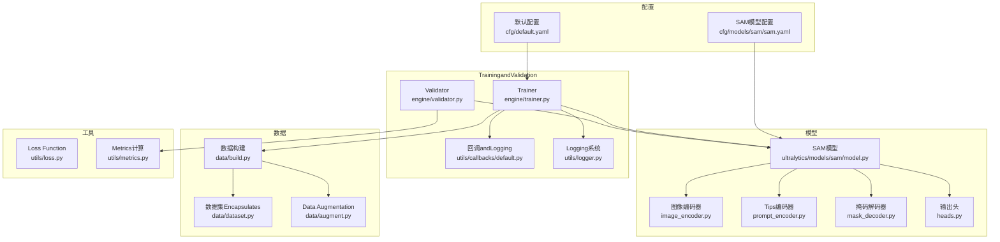
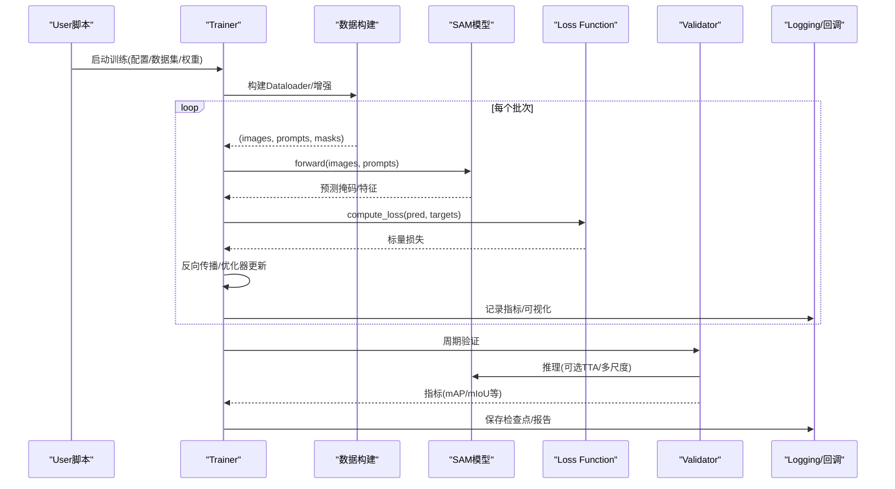
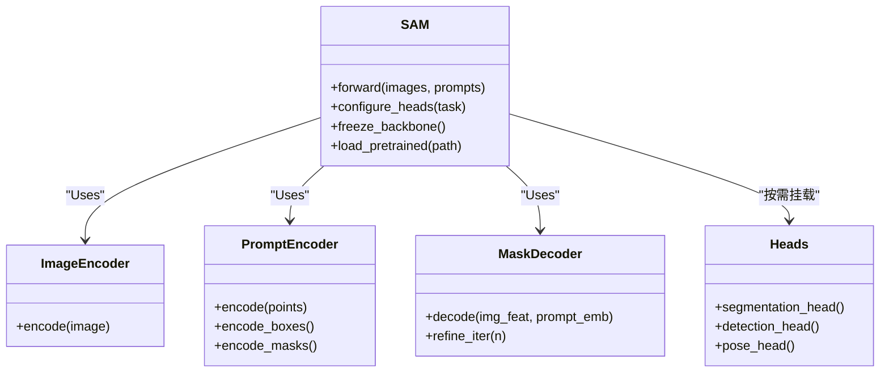
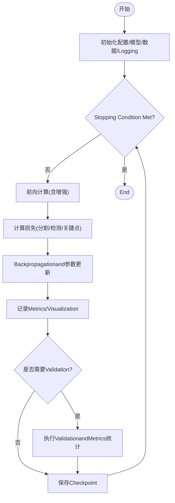
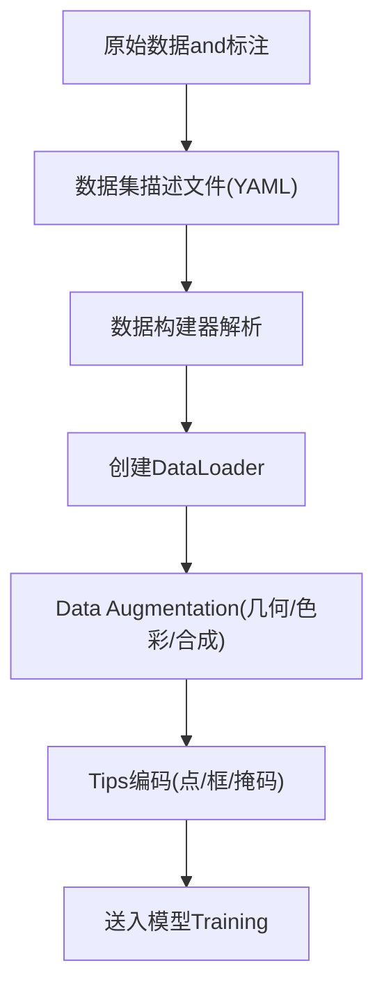
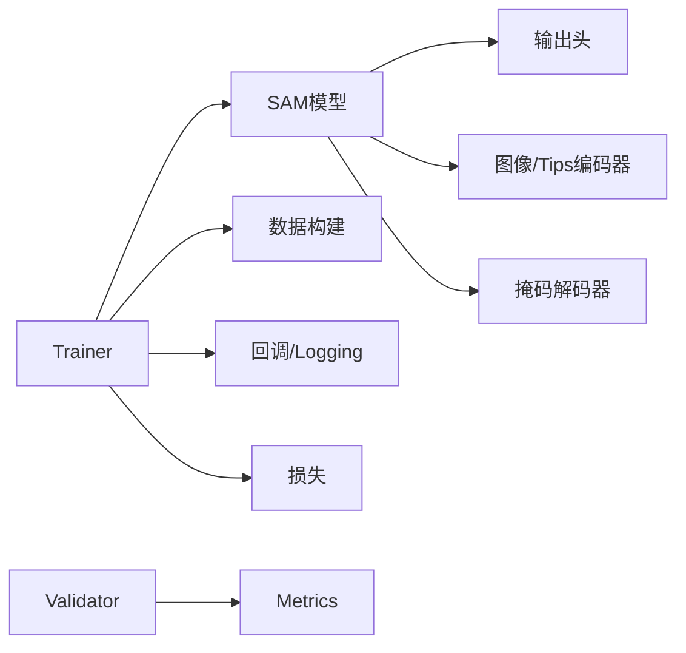

# Trainingand微调

<cite>
**Files Referenced in This Document**
- [ultralytics/models/sam/__init__.py](file://ultralytics/models/sam/__init__.py)
- [ultralytics/models/sam/model.py](file://ultralytics/models/sam/model.py)
- [ultralytics/models/sam/heads.py](file://ultralytics/models/sam/heads.py)
- [ultralytics/models/sam/prompt_encoder.py](file://ultralytics/models/sam/prompt_encoder.py)
- [ultralytics/models/sam/image_encoder.py](file://ultralytics/models/sam/image_encoder.py)
- [ultralytics/models/sam/mask_decoder.py](file://ultralytics/models/sam/mask_decoder.py)
- [ultralytics/engine/trainer.py](file://ultralytics/engine/trainer.py)
- [ultralytics/engine/validator.py](file://ultralytics/engine/validator.py)
- [ultralytics/utils/callbacks/default.py](file://ultralytics/utils/callbacks/default.py)
- [ultralytics/utils/logger.py](file://ultralytics/utils/logger.py)
- [ultralytics/cfg/default.yaml](file://ultralytics/cfg/default.yaml)
- [ultralytics/cfg/models/sam/sam.yaml](file://ultralytics/cfg/models/sam/sam.yaml)
- [ultralytics/data/build.py](file://ultralytics/data/build.py)
- [ultralytics/data/dataset.py](file://ultralytics/data/dataset.py)
- [ultralytics/data/augment.py](file://ultralytics/data/augment.py)
- [ultralytics/utils/loss.py](file://ultralytics/utils/loss.py)
- [ultralytics/utils/metrics.py](file://ultralytics/utils/metrics.py)
- [examples/lora_examples/yolo_master_lora_README.md](file://examples/lora_examples/yolo_master_lora_README.md)
- [examples/lora_examples/yolo12_lora.yaml](file://examples/lora_examples/yolo12_lora.yaml)
- [scripts/quick_train_verify.py](file://scripts/quick_train_verify.py)
</cite>

## Table of Contents
1. [Introduction](#Introduction)
2. [Project Structure](#Project Structure)
3. [Core Components](#Core Components)
4. [Architecture Overview](#Architecture Overview)
5. [Detailed Component Analysis](#Detailed Component Analysis)
6. [Dependency Analysis](#Dependency Analysis)
7. [Performance Considerations](#Performance Considerations)
8. [Troubleshooting Guide](#Troubleshooting Guide)
9. [Conclusion](#Conclusion)
10. [Appendix](#Appendix)

## Introduction
本指南targeting希望whileYOLO-Master框架中从零开始Training并微调SAM（Segment Anything Model）的EngineersandResearchers。内容涵盖：
- Data Preparation、模型配置andTraining参数设置
- while特定数据集上的微调策略，Centered on提升分割精度
- 不同Tasks（检测、分割、关键点）的Training策略差异
- Migration学习and增量学习的最佳实践
- Training监控、Loggingand结果Evaluation方法
- 常见问题and性能bottlenecks的解决方案
- 配置文件Examplesand命令行参数说明

## Project Structure
本项目将SAM相关implementing集中whilemodels/samModules下，TrainingandValidation流程由engine层统一编排，Data Loadingand增强位于data子包，损失andMetrics定义于utils，默认配置and模型定义位于cfgTable of Contents。

Figure Source
- [ultralytics/models/sam/model.py](file://ultralytics/models/sam/model.py)
- [ultralytics/models/sam/image_encoder.py](file://ultralytics/models/sam/image_encoder.py)
- [ultralytics/models/sam/prompt_encoder.py](file://ultralytics/models/sam/prompt_encoder.py)
- [ultralytics/models/sam/mask_decoder.py](file://ultralytics/models/sam/mask_decoder.py)
- [ultralytics/models/sam/heads.py](file://ultralytics/models/sam/heads.py)
- [ultralytics/engine/trainer.py](file://ultralytics/engine/trainer.py)
- [ultralytics/engine/validator.py](file://ultralytics/engine/validator.py)
- [ultralytics/utils/callbacks/default.py](file://ultralytics/utils/callbacks/default.py)
- [ultralytics/utils/logger.py](file://ultralytics/utils/logger.py)
- [ultralytics/data/build.py](file://ultralytics/data/build.py)
- [ultralytics/data/dataset.py](file://ultralytics/data/dataset.py)
- [ultralytics/data/augment.py](file://ultralytics/data/augment.py)
- [ultralytics/cfg/default.yaml](file://ultralytics/cfg/default.yaml)
- [ultralytics/cfg/models/sam/sam.yaml](file://ultralytics/cfg/models/sam/sam.yaml)
- [ultralytics/utils/loss.py](file://ultralytics/utils/loss.py)
- [ultralytics/utils/metrics.py](file://ultralytics/utils/metrics.py)

Section Source
- [ultralytics/models/sam/__init__.py](file://ultralytics/models/sam/__init__.py)
- [ultralytics/models/sam/model.py](file://ultralytics/models/sam/model.py)
- [ultralytics/engine/trainer.py](file://ultralytics/engine/trainer.py)
- [ultralytics/engine/validator.py](file://ultralytics/engine/validator.py)
- [ultralytics/cfg/default.yaml](file://ultralytics/cfg/default.yaml)
- [ultralytics/cfg/models/sam/sam.yaml](file://ultralytics/cfg/models/sam/sam.yaml)

## Core Components
- SAM模型入口and装配：负责组合图像编码器、Tips编码器、掩码解码器and输出头，provides统一的forward接口andTasks适配。
- Trainer：管理Optimizer、Learning Rate调度、AMP、EMA、分布式、断点续训、回调andLogging。
- Validator：Executing InferenceandMetrics统计，Supporting多尺度、TTAetc.策略。
- 数据管线：构建DataLoader、处理标注格式、应用增强and批处理。
- 配置系统：默认Training参数and模型超参分离，便于快速切换and复用。
- 损失andMetrics：针对分割Tasks的Loss combinationandmAP/mIoUetc.Metrics计算。

Section Source
- [ultralytics/models/sam/model.py](file://ultralytics/models/sam/model.py)
- [ultralytics/engine/trainer.py](file://ultralytics/engine/trainer.py)
- [ultralytics/engine/validator.py](file://ultralytics/engine/validator.py)
- [ultralytics/data/build.py](file://ultralytics/data/build.py)
- [ultralytics/cfg/default.yaml](file://ultralytics/cfg/default.yaml)
- [ultralytics/utils/loss.py](file://ultralytics/utils/loss.py)
- [ultralytics/utils/metrics.py](file://ultralytics/utils/metrics.py)

## Architecture Overview
下图展示从数据to模型前向、损失计算、BackpropagationandValidationEvaluation的端to端流程。

Figure Source
- [ultralytics/engine/trainer.py](file://ultralytics/engine/trainer.py)
- [ultralytics/models/sam/model.py](file://ultralytics/models/sam/model.py)
- [ultralytics/utils/loss.py](file://ultralytics/utils/loss.py)
- [ultralytics/engine/validator.py](file://ultralytics/engine/validator.py)
- [ultralytics/utils/callbacks/default.py](file://ultralytics/utils/callbacks/default.py)
- [ultralytics/utils/logger.py](file://ultralytics/utils/logger.py)

## Detailed Component Analysis

### SAM模型组件
- 图像编码器：提取高分辨率视觉特征，作for后续Tips融合的基础。
- Tips编码器：处理点、框、文本或掩码etc.Tips信号，生成条件嵌入。
- 掩码解码器：基于图像特征andTips嵌入，迭代细化得to高质量掩码。
- 输出头：根据Tasks需求输出分类、边界框、关键点或掩码etc.。

Figure Source
- [ultralytics/models/sam/model.py](file://ultralytics/models/sam/model.py)
- [ultralytics/models/sam/image_encoder.py](file://ultralytics/models/sam/image_encoder.py)
- [ultralytics/models/sam/prompt_encoder.py](file://ultralytics/models/sam/prompt_encoder.py)
- [ultralytics/models/sam/mask_decoder.py](file://ultralytics/models/sam/mask_decoder.py)
- [ultralytics/models/sam/heads.py](file://ultralytics/models/sam/heads.py)

Section Source
- [ultralytics/models/sam/model.py](file://ultralytics/models/sam/model.py)
- [ultralytics/models/sam/image_encoder.py](file://ultralytics/models/sam/image_encoder.py)
- [ultralytics/models/sam/prompt_encoder.py](file://ultralytics/models/sam/prompt_encoder.py)
- [ultralytics/models/sam/mask_decoder.py](file://ultralytics/models/sam/mask_decoder.py)
- [ultralytics/models/sam/heads.py](file://ultralytics/models/sam/heads.py)

### Training流程and控制流
Trainer负责组装Optimizer、Learning Rate策略、Mixture精度、EMA、分布式通信、断点恢复and回调。关键步骤包括：
- 初始化：加载配置、模型权重、Data Pipeline、Loggingand回调
- Training循环：按batch前向、计算损失、Backpropagation、Updating Parameters、记录Metrics
- Validationand保存：周期性Validation、保存最佳and最新权重、Export中间产物
- 异常and恢复：捕获异常、回滚状态、继续Training

Figure Source
- [ultralytics/engine/trainer.py](file://ultralytics/engine/trainer.py)
- [ultralytics/utils/callbacks/default.py](file://ultralytics/utils/callbacks/default.py)
- [ultralytics/utils/logger.py](file://ultralytics/utils/logger.py)

Section Source
- [ultralytics/engine/trainer.py](file://ultralytics/engine/trainer.py)
- [ultralytics/utils/callbacks/default.py](file://ultralytics/utils/callbacks/default.py)
- [ultralytics/utils/logger.py](file://ultralytics/utils/logger.py)

### Data Preparationand增强
- 数据格式：Supporting常见标注格式（such asCOCO/YOLO），需确保类别映射and路径正确。
- 构建流程：Via数据构建器解析数据集描述、划分Training/Validation集、创建DataLoader。
- 增强策略：几何变换、颜色抖动、MixUp/CutMix、随机裁剪/缩放etc.，对分割Tasks建议保留像素级一致性。
- Tips工程：forSAMprovides点/框/掩码Tips时，需保证坐标归一化and有效性校验。

Figure Source
- [ultralytics/data/build.py](file://ultralytics/data/build.py)
- [ultralytics/data/dataset.py](file://ultralytics/data/dataset.py)
- [ultralytics/data/augment.py](file://ultralytics/data/augment.py)

Section Source
- [ultralytics/data/build.py](file://ultralytics/data/build.py)
- [ultralytics/data/dataset.py](file://ultralytics/data/dataset.py)
- [ultralytics/data/augment.py](file://ultralytics/data/augment.py)

### 损失andMetrics
- Loss Function：针对分割Tasks通常包含交叉熵/Dice/边界对齐etc.组合；检测and关键点Tasks有各自损失项。
- Metrics计算：mAP、mIoU、Precision/Recall、F1etc.，Supporting逐类统计and汇总。
- 动态权重：可根据Tasks难度或样本数量调整损失权重，提升稳定性。

Section Source
- [ultralytics/utils/loss.py](file://ultralytics/utils/loss.py)
- [ultralytics/utils/metrics.py](file://ultralytics/utils/metrics.py)

### 配置系统and命令行
- 默认配置：包含通用Training超参（Learning Rate、批量大小、Optimizer、调度器etc.）。
- 模型配置：定义SAM各子Modules尺寸、深度、注意力头数etc.。
- 命令行参数：可ViaCLI覆盖配置项，指定数据集、权重、设备、Logging路径etc.。

Section Source
- [ultralytics/cfg/default.yaml](file://ultralytics/cfg/default.yaml)
- [ultralytics/cfg/models/sam/sam.yaml](file://ultralytics/cfg/models/sam/sam.yaml)
- [scripts/quick_train_verify.py](file://scripts/quick_train_verify.py)

## Dependency Analysis
- 低耦合高内聚：模型、Training、数据、配置分层清晰，便于替换and扩展。
- External Dependencies：PyTorch生态、Visualization工具（TensorBoard/W&B）、分布式后端（DDP）。
- 潜while环依赖：避免while模型中直接引用Trainer，保持单向依赖。

Figure Source
- [ultralytics/engine/trainer.py](file://ultralytics/engine/trainer.py)
- [ultralytics/models/sam/model.py](file://ultralytics/models/sam/model.py)
- [ultralytics/utils/loss.py](file://ultralytics/utils/loss.py)
- [ultralytics/utils/metrics.py](file://ultralytics/utils/metrics.py)

Section Source
- [ultralytics/engine/trainer.py](file://ultralytics/engine/trainer.py)
- [ultralytics/models/sam/model.py](file://ultralytics/models/sam/model.py)
- [ultralytics/utils/loss.py](file://ultralytics/utils/loss.py)
- [ultralytics/utils/metrics.py](file://ultralytics/utils/metrics.py)

## Performance Considerations
- Mixture精度Training：启用AMP减少显存占用并加速Training，注意数值稳定性。
- Gradient累积：while小显存设备上模拟大batch，提高收敛稳定性。
- 数据I/OOptimization：Uses多线程/内存映射、预取and缓存，减少GPUetc.待。
- 模型并行：DDP或多卡Training，Set appropriatelyworld_sizeandNCCL后端。
- 早停andEMA：CombiningValidationMetrics早停，EMA平滑权重提升泛化。
- Tips采样策略：while微调阶段动态选择难样本Tips，提升收敛效率。

[本节for通用指导，无需具体文件引用]

## Troubleshooting Guide
- Training不收敛/损失震荡
  - 检查Learning Rateandwarmup策略，适当降低初始Learning Rate或增加warmup步数
  - 确认Data Augmentation强度，过强可能破坏像素级标注一致性
  - 启用AMP后若出现NaN，可关闭或降低精度
- 显存不足
  - 减小输入分辨率或batch size，启用Gradient累积
  - 冻结部分编码器层，仅微调解码器andTips分支
- ValidationMetrics停滞
  - 检查类别不平衡，调整损失权重或采用重采样
  - 引入更多难样本Tips或进行课程学习
- 分布式问题
  - 确认端口andNCCL环境，检查节点间通信
  - 打印rank信息定位死锁或广播不一致

Section Source
- [ultralytics/engine/trainer.py](file://ultralytics/engine/trainer.py)
- [ultralytics/utils/logger.py](file://ultralytics/utils/logger.py)
- [ultralytics/utils/callbacks/default.py](file://ultralytics/utils/callbacks/default.py)

## Conclusion
ViawhileYOLO-Master框架中集成SAM，可implementing灵活的Tipsdrivers are installed分割Trainingand微调。遵循本指南的Data Preparation、配置管理andTraining策略，可while特定数据集上显著提升分割精度。CombiningMigration学习and增量学习实践，Centered onand完善的监控andEvaluation体系，能够高效推进从原型to落地的全流程。

[本节for总结性内容，无需具体文件引用]

## Appendix

### 从零开始TrainingSAM的完整流程
- Data Preparation
  - 整理图像and标注，确保类别映射一致
  - 编写数据集YAML，指定train/val路径and类别列表
- 模型配置
  - 选择SAM基础配置，必要时调整编码器/解码器深度and通道
  - such as需LoRA/PEFT，Refer toExamples配置
- Training参数
  - 设置Learning Rate、批量大小、Optimizerand调度器
  - 开启AMP、EMA、早停andLogging
- 启动Training
  - UsesCLI或Python API传入数据集and配置
  - 监控Training曲线andValidationMetrics，适时调整超参

Section Source
- [ultralytics/cfg/default.yaml](file://ultralytics/cfg/default.yaml)
- [ultralytics/cfg/models/sam/sam.yaml](file://ultralytics/cfg/models/sam/sam.yaml)
- [scripts/quick_train_verify.py](file://scripts/quick_train_verify.py)

### while特定数据集上微调Centered on提高分割精度
- 冻结主干，仅微调Tips编码器and掩码解码器
- Uses难样本Tips采样and课程学习
- 引入领域特定的Data Augmentation（such as透视校正、光照变化）
- 调整损失权重Centered on平衡前景/背景and边界区域

Section Source
- [ultralytics/models/sam/model.py](file://ultralytics/models/sam/model.py)
- [ultralytics/data/augment.py](file://ultralytics/data/augment.py)
- [ultralytics/utils/loss.py](file://ultralytics/utils/loss.py)

### 不同Tasks的Training策略差异
- 检测：侧重边界框回归and分类，Combined withNMSand正负样本均衡
- 分割：强调像素级准确性，UsesDice/CE组合损失and边界对齐
- 关键点：关注关键点定位误差and可见性标签，采用加权损失

Section Source
- [ultralytics/models/sam/heads.py](file://ultralytics/models/sam/heads.py)
- [ultralytics/utils/loss.py](file://ultralytics/utils/loss.py)
- [ultralytics/utils/metrics.py](file://ultralytics/utils/metrics.py)

### Migration学习and增量学习最佳实践
- Migration学习
  - 加载Pre-trained Weights，冻结高层，微调浅层andTasks头
  - 小Learning Rate+长warmup，逐步解冻层级
- 增量学习
  - 灾难性遗忘缓解：回放旧数据、正则化（EWC/LwF）
  - Adapter/LoRA：新增轻量Modules，合并权重时保持兼容性

Section Source
- [examples/lora_examples/yolo_master_lora_README.md](file://examples/lora_examples/yolo_master_lora_README.md)
- [examples/lora_examples/yolo12_lora.yaml](file://examples/lora_examples/yolo12_lora.yaml)

### Training监控、Loggingand结果Evaluation
- 监控
  - 实时绘制损失andMetrics曲线，观察收敛趋势
- Logging
  - 结构化记录超参and运行环境，便于复现
- Evaluation
  - 多尺度Validation、TTA提升鲁棒性
  - 输出混淆矩阵and错误样例，辅助改进

Section Source
- [ultralytics/utils/callbacks/default.py](file://ultralytics/utils/callbacks/default.py)
- [ultralytics/utils/logger.py](file://ultralytics/utils/logger.py)
- [ultralytics/engine/validator.py](file://ultralytics/engine/validator.py)

### 配置文件Examplesand命令行参数说明
- 配置文件
  - 默认Training参数位于默认配置文件中
  - SAM模型超参位于模型配置文件中
- 命令行参数
  - 常用参数包括数据集路径、模型权重、设备、批量大小、Learning Rate、LoggingTable of Contentsetc.
  - 可ViaCLI覆盖配置项，快速实验不同策略

Section Source
- [ultralytics/cfg/default.yaml](file://ultralytics/cfg/default.yaml)
- [ultralytics/cfg/models/sam/sam.yaml](file://ultralytics/cfg/models/sam/sam.yaml)
- [scripts/quick_train_verify.py](file://scripts/quick_train_verify.py)