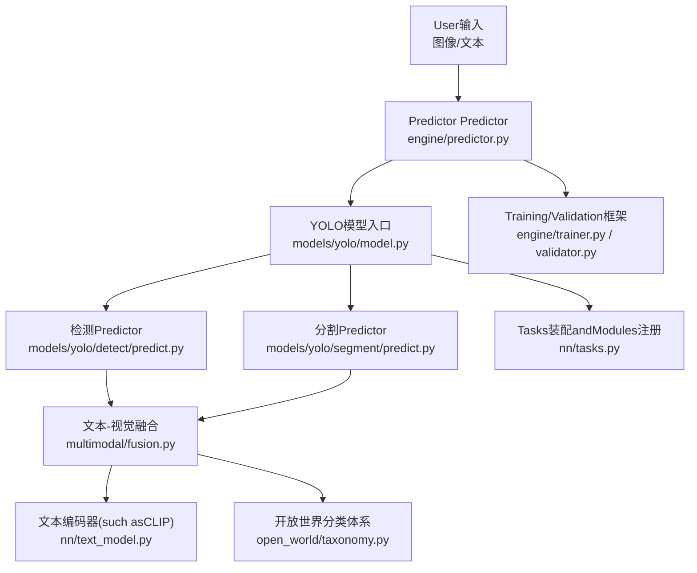
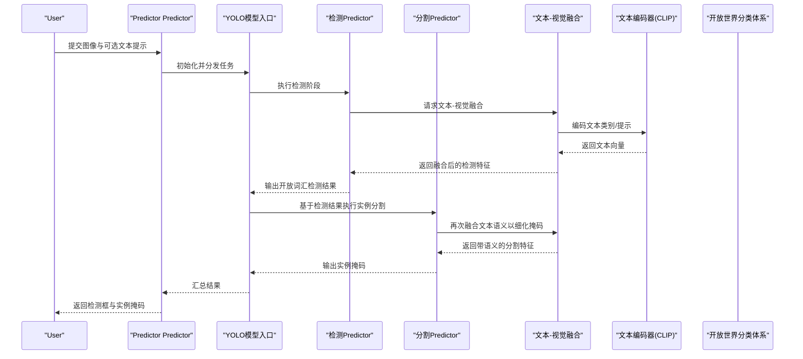
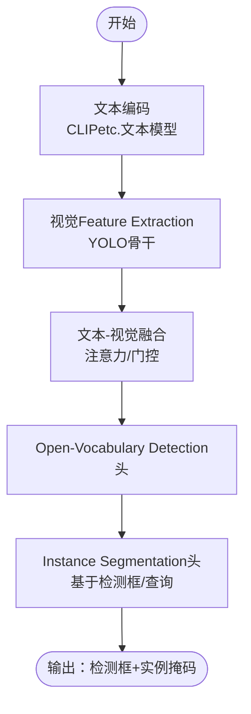
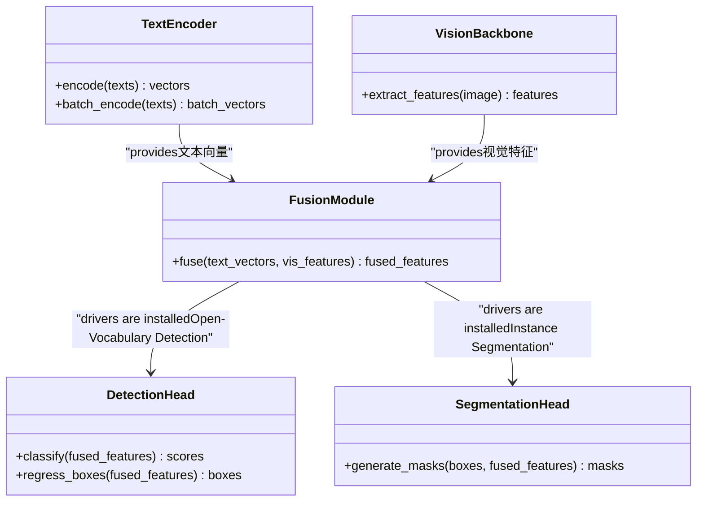
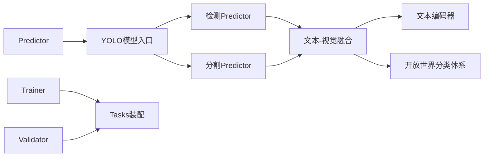

# YoloE零样本分割

<cite>
**Files Referenced in This Document**
- [yoloe.md](file://docs/en/models/yoloe.md)
- [yolo.py](file://ultralytics/models/yolo/model.py)
- [detect.py](file://ultralytics/models/yolo/detect/predict.py)
- [segment.py](file://ultralytics/models/yolo/segment/predict.py)
- [model.py](file://ultralytics/engine/model.py)
- [predictor.py](file://ultralytics/engine/predictor.py)
- [trainer.py](file://ultralytics/engine/trainer.py)
- [validator.py](file://ultralytics/engine/validator.py)
- [tasks.py](file://ultralytics/nn/tasks.py)
- [text_model.py](file://ultralytics/nn/text_model.py)
- [fusion.py](file://agent/runtime/multimodal/fusion.py)
- [runtime.py](file://agent/runtime/multimodal/runtime.py)
- [multimodal_handlers.py](file://agent/runtime/cli/multimodal_handlers.py)
- [open_world_taxonomy.py](file://agent/runtime/open_world/taxonomy.py)
- [yoloworld_lora.yaml](file://examples/lora_examples/yoloworld_lora.yaml)
- [yoloe.yaml](file://ultralytics/cfg/models/yolo/yoloe.yaml)
</cite>

## Table of Contents
1. [Introduction](#Introduction)
2. [Project Structure](#Project Structure)
3. [Core Components](#Core Components)
4. [Architecture Overview](#Architecture Overview)
5. [Detailed Component Analysis](#Detailed Component Analysis)
6. [Dependency Analysis](#Dependency Analysis)
7. [性能考量](#性能考量)
8. [Troubleshooting Guide](#Troubleshooting Guide)
9. [Conclusion](#Conclusion)
10. [Appendix](#Appendix)

## Introduction
本文件targetingYoloE系列的“零样本分割”capabilities，系统性阐述其such as何将YOLO的高效检测andSAM的精细Instance Segmentation相Combining，并Via文本引导implementing开放词汇的Object DetectionandInstance Segmentation。Documentation覆盖Centered on下要点：
- 文本引导的零样本分割机制：CLIP文本编码器and视觉特征的融合路径
- 开放词汇Object DetectionandInstance Segmentation的implementing思路
- 自定义类别定义andTraining ConfigurationExamples
- while未知类别上的分割效果andEvaluation方法
- 微调策略and领域适应技术

## Project Structure
围绕YoloE零样本分割的关键代码andDocumentation分布whilesuch as下位置：
- 模型说明andUses指引：docs/en/models/yoloe.md
- YOLOTasks模型入口andInference流程：ultralytics/models/yolo/model.py、ultralytics/engine/model.py、ultralytics/engine/predictor.py
- 检测and分割Predictor：ultralytics/models/yolo/detect/predict.py、ultralytics/models/yolo/segment/predict.py
- Multimodal文本-视觉融合and运行时：agent/runtime/multimodal/fusion.py、agent/runtime/multimodal/runtime.py、agent/runtime/cli/multimodal_handlers.py
- 开放世界分类体系：agent/runtime/open_world/taxonomy.py
- 文本模型接口：ultralytics/nn/text_model.py
- Task GraphandModules装配：ultralytics/nn/tasks.py
- Training/Validation框架：ultralytics/engine/trainer.py、ultralytics/engine/validator.py
- ExamplesLoRA配置（含YOLOWorld）：examples/lora_examples/yoloworld_lora.yaml
- YoloE模型配置（Refer to）：ultralytics/cfg/models/yolo/yoloe.yaml

Figure Source
- [predictor.py](file://ultralytics/engine/predictor.py)
- [model.py](file://ultralytics/models/yolo/model.py)
- [detect.py](file://ultralytics/models/yolo/detect/predict.py)
- [segment.py](file://ultralytics/models/yolo/segment/predict.py)
- [fusion.py](file://agent/runtime/multimodal/fusion.py)
- [text_model.py](file://ultralytics/nn/text_model.py)
- [open_world_taxonomy.py](file://agent/runtime/open_world/taxonomy.py)
- [trainer.py](file://ultralytics/engine/trainer.py)
- [validator.py](file://ultralytics/engine/validator.py)
- [tasks.py](file://ultralytics/nn/tasks.py)

Section Source
- [yoloe.md](file://docs/en/models/yoloe.md)
- [model.py](file://ultralytics/models/yolo/model.py)
- [predictor.py](file://ultralytics/engine/predictor.py)
- [detect.py](file://ultralytics/models/yolo/detect/predict.py)
- [segment.py](file://ultralytics/models/yolo/segment/predict.py)
- [fusion.py](file://agent/runtime/multimodal/fusion.py)
- [text_model.py](file://ultralytics/nn/text_model.py)
- [open_world_taxonomy.py](file://agent/runtime/open_world/taxonomy.py)
- [trainer.py](file://ultralytics/engine/trainer.py)
- [validator.py](file://ultralytics/engine/validator.py)
- [tasks.py](file://ultralytics/nn/tasks.py)

## Core Components
- 文本编码器and特征对齐
  - Via文本模型接口加载预Training文本编码器（例such asCLIP），将自然语言类别描述编码for文本向量。
  - 文本向量and视觉特征进行跨模态对齐，形成开放词汇的语义空间。
- 文本-视觉融合Modules
  - while检测分支中，将文本嵌入and视觉特征融合，drivers are installed开放词汇的Detection Head输出类别置信度。
  - while分割分支中，基于检测框或查询生成掩码，Combining文本语义指导实例级分割。
- 开放世界分类体系
  - provides类别词表and别名映射，Supporting动态扩展and领域定制。
- Inference流水线
  - Predictor协调检测and分割子流程，Calls融合Modules完成文本引导的Inference。
- TrainingandValidation框架
  - Trainer负责参数更新and损失计算；Validator负责Metrics统计and报告。

Section Source
- [text_model.py](file://ultralytics/nn/text_model.py)
- [fusion.py](file://agent/runtime/multimodal/fusion.py)
- [open_world_taxonomy.py](file://agent/runtime/open_world/taxonomy.py)
- [predictor.py](file://ultralytics/engine/predictor.py)
- [detect.py](file://ultralytics/models/yolo/detect/predict.py)
- [segment.py](file://ultralytics/models/yolo/segment/predict.py)
- [trainer.py](file://ultralytics/engine/trainer.py)
- [validator.py](file://ultralytics/engine/validator.py)

## Architecture Overview
下图展示了从输入to输出的端to端流程，包括文本引导的融合and检测-分割协同。

Figure Source
- [predictor.py](file://ultralytics/engine/predictor.py)
- [model.py](file://ultralytics/models/yolo/model.py)
- [detect.py](file://ultralytics/models/yolo/detect/predict.py)
- [segment.py](file://ultralytics/models/yolo/segment/predict.py)
- [fusion.py](file://agent/runtime/multimodal/fusion.py)
- [text_model.py](file://ultralytics/nn/text_model.py)
- [open_world_taxonomy.py](file://agent/runtime/open_world/taxonomy.py)

## Detailed Component Analysis

### 文本引导的零样本分割机制
- 文本编码
  - Uses文本模型接口加载预Training编码器，将类别名或自由文本Tips转换for固定维度的文本向量。
  - Supporting批量编码and缓存，Centered on提升Inference效率。
- 视觉Feature Extraction
  - YOLOBackbone Network提取多层视觉特征，保留空间分辨率and语义信息。
- 跨模态融合
  - while检测分支中，将文本向量and视觉特征进行注意力或门控融合，使Detection Head具备开放词汇判别capabilities。
  - while分割分支中，利用检测框作forROI，将文本语义注入掩码解码器，提升对未见类别的分割质量。
- 开放词汇匹配
  - Via相似度度量（such as余弦相似度）将文本向量and视觉特征对齐，implementing无需重新Training的类别泛化。

Figure Source
- [text_model.py](file://ultralytics/nn/text_model.py)
- [fusion.py](file://agent/runtime/multimodal/fusion.py)
- [detect.py](file://ultralytics/models/yolo/detect/predict.py)
- [segment.py](file://ultralytics/models/yolo/segment/predict.py)

Section Source
- [text_model.py](file://ultralytics/nn/text_model.py)
- [fusion.py](file://agent/runtime/multimodal/fusion.py)
- [detect.py](file://ultralytics/models/yolo/detect/predict.py)
- [segment.py](file://ultralytics/models/yolo/segment/predict.py)

### 开放词汇Object DetectionandInstance Segmentation
- 检测阶段
  - 文本嵌入参andDetection Head的类别评分，implementing对任意文本描述的物体定位。
  - Non-Maximum Suppression（NMS）用于去重and阈值筛选。
- 分割阶段
  - 基于检测框或可学习查询，生成实例级掩码。
  - 文本语义进一步约束掩码形状and边界，提高细粒度分割精度。
- 结果Post-Processing
  - 合并重复Prediction、过滤低置信度结果、Visualization渲染。

Figure Source
- [text_model.py](file://ultralytics/nn/text_model.py)
- [fusion.py](file://agent/runtime/multimodal/fusion.py)
- [detect.py](file://ultralytics/models/yolo/detect/predict.py)
- [segment.py](file://ultralytics/models/yolo/segment/predict.py)

Section Source
- [detect.py](file://ultralytics/models/yolo/detect/predict.py)
- [segment.py](file://ultralytics/models/yolo/segment/predict.py)
- [fusion.py](file://agent/runtime/multimodal/fusion.py)
- [text_model.py](file://ultralytics/nn/text_model.py)

### 自定义类别定义andTraining Configuration
- 自定义类别
  - Via开放世界分类体系维护类别词表and别名映射，Supporting新增领域术语。
  - 可whileInference时传入自定义文本Tips，implementing即插即用的Open-Vocabulary Detectionand分割。
- Training Configuration
  - UsesExamplesLoRA配置文件（包含YOLOWorld相关设置）作forRefer to，调整rank、target_modules、learning_rateetc.超参。
  - 针对YoloE，可Refer to模型配置文件（yoloe.yaml）中的TasksandModules装配选项。
- Data Preparation
  - 标注格式遵循YOLO标准；对于开放词汇场景，建议provides多样化文本描述Centered on增强鲁棒性。

Section Source
- [open_world_taxonomy.py](file://agent/runtime/open_world/taxonomy.py)
- [yoloworld_lora.yaml](file://examples/lora_examples/yoloworld_lora.yaml)
- [yoloe.yaml](file://ultralytics/cfg/models/yolo/yoloe.yaml)

### while未知类别上的分割效果and性能Evaluation
- EvaluationMetrics
  - 检测：mAP@IoU=0.50:0.95、Precision、Recall
  - 分割：mAP@Mask、mIoU、Instance mAP
- Evaluation流程
  - Validator加载数据集and模型，Executing Inference并统计Metrics。
  - Supporting按类别分组统计，便于观察未知类别表现。
- 结果解读
  - 关注开放词汇类别的mAP下降幅度and误检率。
  - Combining混淆矩阵andVisualization结果，定位困难样本。

Section Source
- [validator.py](file://ultralytics/engine/validator.py)
- [yoloe.md](file://docs/en/models/yoloe.md)

### 微调策略and领域适应技术
- LoRA微调
  - 选择关键Modules（such as文本-视觉融合层、检测/分割头）插入Low-Rank Adaptation器，降低显存占用andTraining成本。
  - Viarankandtarget_modules控制适配范围and表达capabilities。
- 渐进式Training
  - 先冻结主干网络，仅Training融合and头部；再逐步解冻部分层级进行联合Optimization。
- 领域适应
  - 引入领域特定文本描述andData Augmentation，提升域内泛化。
  - Uses对比学习或一致性正则，稳定跨模态对齐。

Section Source
- [yoloworld_lora.yaml](file://examples/lora_examples/yoloworld_lora.yaml)
- [trainer.py](file://ultralytics/engine/trainer.py)
- [fusion.py](file://agent/runtime/multimodal/fusion.py)

## Dependency Analysis
- Modules耦合
  - Predictor依赖模型入口andTasks装配；检测and分割Predictor共享文本-视觉融合Modules。
  - 文本编码器and开放世界分类体系for融合Modulesprovides外部知识源。
- 直接依赖
  - 检测/分割Predictor直接Calls融合Modulesand文本编码器。
  - Training/Validation框架依赖Task Graphand模型装配。
- Potential Cycles依赖
  - Via分层设计避免循环：Predictor不直接依赖Trainer，Tasks装配集中管理Modules注册。

Figure Source
- [predictor.py](file://ultralytics/engine/predictor.py)
- [model.py](file://ultralytics/models/yolo/model.py)
- [detect.py](file://ultralytics/models/yolo/detect/predict.py)
- [segment.py](file://ultralytics/models/yolo/segment/predict.py)
- [fusion.py](file://agent/runtime/multimodal/fusion.py)
- [text_model.py](file://ultralytics/nn/text_model.py)
- [open_world_taxonomy.py](file://agent/runtime/open_world/taxonomy.py)
- [trainer.py](file://ultralytics/engine/trainer.py)
- [validator.py](file://ultralytics/engine/validator.py)
- [tasks.py](file://ultralytics/nn/tasks.py)

Section Source
- [predictor.py](file://ultralytics/engine/predictor.py)
- [model.py](file://ultralytics/models/yolo/model.py)
- [detect.py](file://ultralytics/models/yolo/detect/predict.py)
- [segment.py](file://ultralytics/models/yolo/segment/predict.py)
- [fusion.py](file://agent/runtime/multimodal/fusion.py)
- [text_model.py](file://ultralytics/nn/text_model.py)
- [open_world_taxonomy.py](file://agent/runtime/open_world/taxonomy.py)
- [trainer.py](file://ultralytics/engine/trainer.py)
- [validator.py](file://ultralytics/engine/validator.py)
- [tasks.py](file://ultralytics/nn/tasks.py)

## 性能考量
- Inference加速
  - 文本编码批量化and缓存；视觉特征复用；NMSandPost-ProcessingOptimization。
- 内存and显存
  - 采用LoRA减少可Training参数；Mixture精度TrainingandInference；按需加载文本编码器。
- 吞吐and时延
  - 分块Inference（SAHIetc.）and大图切片；流水线并行and异步I/O。
- 稳定性
  - 数值稳定性检查；Gradient裁剪；早停and回滚策略。

[本节for通用指导，不涉and具体文件分析]

## Troubleshooting Guide
- 常见问题
  - 文本编码失败：检查文本预处理and编码器权重加载。
  - 融合Modules维度不匹配：核对文本向量and视觉特征通道数。
  - 检测框过密或漏检：调整NMS阈值andConfidence Threshold。
  - 分割掩码质量差：检查ROI对齐and掩码解码器输入。
- 调试工具
  - 启用中间特征Visualization；记录文本-视觉相似度分布；Export中间结果进行分析。
- Loggingand事件
  - Uses事件记录器收集Training/Validation关键Metrics；定位异常点。

Section Source
- [multimodal_handlers.py](file://agent/runtime/cli/multimodal_handlers.py)
- [runtime.py](file://agent/runtime/multimodal/runtime.py)
- [trainer.py](file://ultralytics/engine/trainer.py)
- [validator.py](file://ultralytics/engine/validator.py)

## Conclusion
YoloEVia将YOLO的高效检测andSAM的精细分割capabilitiesCombining，并Centered onCLIPetc.文本编码器for桥梁，implementing了强大的零样本分割and开放词汇Object Detection。借助文本-视觉融合、开放世界分类体系andLoRA微调策略，系统能够while未知类别上保持良好性能，同时具备良好的可Extensibilityand领域适应capabilities。实际部署中，应重点关注文本编码and融合Modules的稳定性、Inference加速and内存Optimization，Centered onandEvaluationMetrics的全面性and可解释性。

[本节for总结性内容，不涉and具体文件分析]

## Appendix
- 快速上手
  - Refer to模型DocumentationandExamples配置，准备数据and文本Tips，启动TrainingandInference。
- 扩unfold发
  - while开放世界分类体系中新增类别；while融合Modules中尝试新的跨模态对齐策略；whileTrainer中集成新的Loss Function。

[本节for补充信息，不涉and具体文件分析]