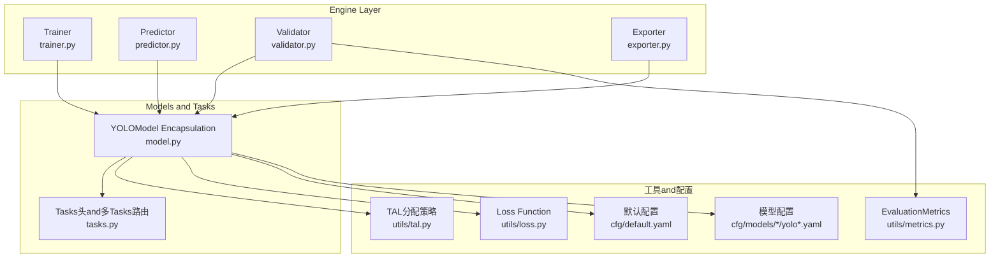
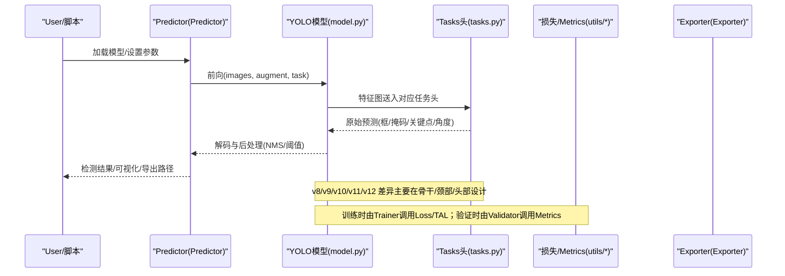
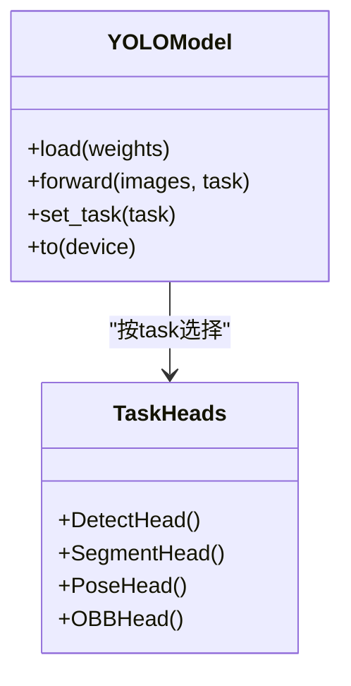
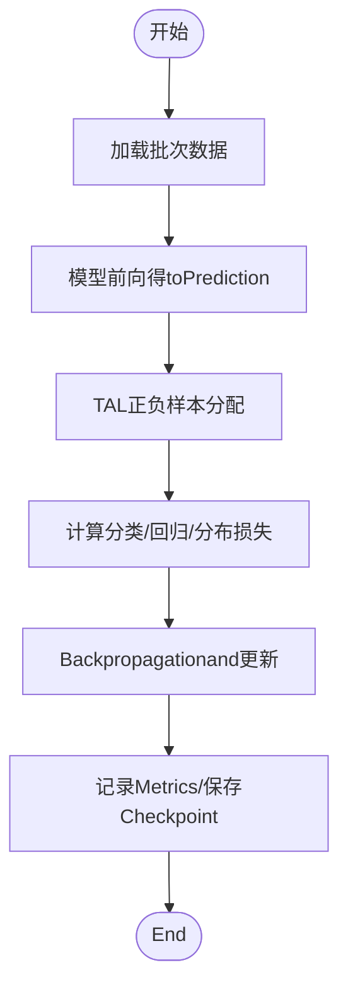
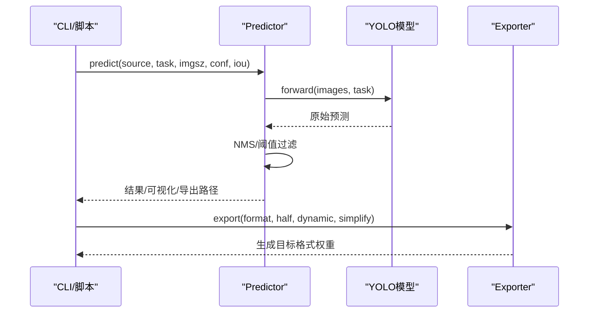
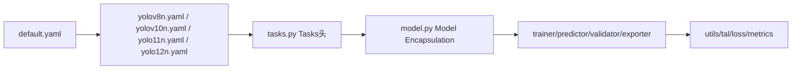

# YOLO Series Models

<cite>
**Files Referenced in This Document**
- [README.md](file://README.md)
- [ultralytics/models/yolo/__init__.py](file://ultralytics/models/yolo/__init__.py)
- [ultralytics/models/yolo/model.py](file://ultralytics/models/yolo/model.py)
- [ultralytics/nn/tasks.py](file://ultralytics/nn/tasks.py)
- [ultralytics/engine/trainer.py](file://ultralytics/engine/trainer.py)
- [ultralytics/engine/predictor.py](file://ultralytics/engine/predictor.py)
- [ultralytics/engine/validator.py](file://ultralytics/engine/validator.py)
- [ultralytics/engine/exporter.py](file://ultralytics/engine/exporter.py)
- [ultralytics/utils/tal.py](file://ultralytics/utils/tal.py)
- [ultralytics/utils/loss.py](file://ultralytics/utils/loss.py)
- [ultralytics/utils/metrics.py](file://ultralytics/utils/metrics.py)
- [ultralytics/cfg/default.yaml](file://ultralytics/cfg/default.yaml)
- [ultralytics/cfg/models/detect/yolov8n.yaml](file://ultralytics/cfg/models/detect/yolov8n.yaml)
- [ultralytics/cfg/models/detect/yolov10n.yaml](file://ultralytics/cfg/models/detect/yolov10n.yaml)
- [ultralytics/cfg/models/detect/yolo11n.yaml](file://ultralytics/cfg/models/detect/yolo11n.yaml)
- [ultralytics/cfg/models/detect/yolo12n.yaml](file://ultralytics/cfg/models/detect/yolo12n.yaml)
- [ultralytics/cfg/models/segment/yolov8n-seg.yaml](file://ultralytics/cfg/models/segment/yolov8n-seg.yaml)
- [ultralytics/cfg/models/pose/yolov8n-pose.yaml](file://ultralytics/cfg/models/pose/yolov8n-pose.yaml)
- [ultralytics/cfg/models/obb/yolov8n-obb.yaml](file://ultralytics/cfg/models/obb/yolov8n-obb.yaml)
- [examples/tutorial.ipynb](file://examples/tutorial.ipynb)
- [docs/en/quickstart.md](file://docs/en/quickstart.md)
- [docs/en/guides/yolo-architecture.md](file://docs/en/guides/yolo-architecture.md)
- [docs/en/modes/train.md](file://docs/en/modes/train.md)
- [docs/en/modes/predict.md](file://docs/en/modes/predict.md)
- [docs/en/modes/export.md](file://docs/en/modes/export.md)
- [docs/en/modes/val.md](file://docs/en/modes/val.md)
- [docs/en/models/yolov8.md](file://docs/en/models/yolov8.md)
- [docs/en/models/yolov9.md](file://docs/en/models/yolov9.md)
- [docs/en/models/yolov10.md](file://docs/en/models/yolov10.md)
- [docs/en/models/yolo11.md](file://docs/en/models/yolo11.md)
- [docs/en/models/yolo12.md](file://docs/en/models/yolo12.md)
</cite>

## Table of Contents
1. [Introduction](#Introduction)
2. [Project Structure](#Project Structure)
3. [Core Components](#Core Components)
4. [Architecture Overview](#Architecture Overview)
5. [Detailed Component Analysis](#Detailed Component Analysis)
6. [Dependency Analysis](#Dependency Analysis)
7. [性能and规模对比](#性能and规模对比)
8. [Tasks类型and配置语法](#Tasks类型and配置语法)
9. [Training、InferenceandExport指南](#TrainingInferenceandExport指南)
10. [故障排查](#故障排查)
11. [Conclusion](#Conclusion)
12. [Appendix](#Appendix)

## Introduction
本文件targeting希望系统掌握YOLO系列（v8、v9、v10、v11、v12）的读者，从架构演进、技术要点、配置语法toTraining/Inference/Export的完整工作流进行说明。内容基于仓库中的implementingandDocumentation，力求兼顾工程落地and学术理解。

## Project Structure
该仓库采用“Modules化+Tasks化”的组织方式：
- 模型定义andTasks头位于 ultralytics/models/yolo and ultralytics/nn/tasks.py
- Training/Validation/Prediction/Export引擎位于 ultralytics/engine
- 通用工具（损失、Metrics、TALetc.）位于 ultralytics/utils
- 预置配置and数据集位于 ultralytics/cfg
- Examples and Tutorials位于 examples and docs

Figure Source
- [ultralytics/models/yolo/model.py](file://ultralytics/models/yolo/model.py)
- [ultralytics/nn/tasks.py](file://ultralytics/nn/tasks.py)
- [ultralytics/engine/trainer.py](file://ultralytics/engine/trainer.py)
- [ultralytics/engine/predictor.py](file://ultralytics/engine/predictor.py)
- [ultralytics/engine/validator.py](file://ultralytics/engine/validator.py)
- [ultralytics/engine/exporter.py](file://ultralytics/engine/exporter.py)
- [ultralytics/utils/tal.py](file://ultralytics/utils/tal.py)
- [ultralytics/utils/loss.py](file://ultralytics/utils/loss.py)
- [ultralytics/utils/metrics.py](file://ultralytics/utils/metrics.py)
- [ultralytics/cfg/default.yaml](file://ultralytics/cfg/default.yaml)
- [ultralytics/cfg/models/detect/yolov8n.yaml](file://ultralytics/cfg/models/detect/yolov8n.yaml)
- [ultralytics/cfg/models/detect/yolov10n.yaml](file://ultralytics/cfg/models/detect/yolov10n.yaml)
- [ultralytics/cfg/models/detect/yolo11n.yaml](file://ultralytics/cfg/models/detect/yolo11n.yaml)
- [ultralytics/cfg/models/detect/yolo12n.yaml](file://ultralytics/cfg/models/detect/yolo12n.yaml)

Section Source
- [README.md](file://README.md)
- [docs/en/quickstart.md](file://docs/en/quickstart.md)

## Core Components
- Model Encapsulationand注册：provides统一的模型加载、初始化、前向接口，并Supporting按Tasks选择不同头部。
- Tasks头and多Tasks路由：检测、分割、姿态、旋转Object Detectionand other tasks共用主干，ViaTasks头输出不同结果。
- Training/Validation/Inference/Export引擎：分别负责Optimization循环、Metrics统计、NMSPost-Processingand格式转换。
- 工具库：TAL正负样本分配、Loss Function族、mAPetc.Metrics计算。
- 配置系统：默认参数and模型级配置分离，便于扩展新规模and新Tasks。

Section Source
- [ultralytics/models/yolo/__init__.py](file://ultralytics/models/yolo/__init__.py)
- [ultralytics/models/yolo/model.py](file://ultralytics/models/yolo/model.py)
- [ultralytics/nn/tasks.py](file://ultralytics/nn/tasks.py)
- [ultralytics/engine/trainer.py](file://ultralytics/engine/trainer.py)
- [ultralytics/engine/predictor.py](file://ultralytics/engine/predictor.py)
- [ultralytics/engine/validator.py](file://ultralytics/engine/validator.py)
- [ultralytics/engine/exporter.py](file://ultralytics/engine/exporter.py)
- [ultralytics/utils/tal.py](file://ultralytics/utils/tal.py)
- [ultralytics/utils/loss.py](file://ultralytics/utils/loss.py)
- [ultralytics/utils/metrics.py](file://ultralytics/utils/metrics.py)
- [ultralytics/cfg/default.yaml](file://ultralytics/cfg/default.yaml)

## Architecture Overview
下图展示了从输入图像to最终输出的端to端流程，Centered onand各版本while关键Modules上的差异点。

Figure Source
- [ultralytics/engine/predictor.py](file://ultralytics/engine/predictor.py)
- [ultralytics/models/yolo/model.py](file://ultralytics/models/yolo/model.py)
- [ultralytics/nn/tasks.py](file://ultralytics/nn/tasks.py)
- [ultralytics/utils/loss.py](file://ultralytics/utils/loss.py)
- [ultralytics/utils/metrics.py](file://ultralytics/utils/metrics.py)
- [ultralytics/engine/exporter.py](file://ultralytics/engine/exporter.py)

## Detailed Component Analysis

### Model EncapsulationandTasks路由
- Unified entry point：Via模型类完成权重加载、设备放置、Tasks选择and动态头实例化。
- Tasks路由：根据Tasks类型（detect/segment/pose/obb）选择相应头部，共享主干and颈部Centered on复用特征。
- 可Extensibility：新增Tasks只需注册新头并while路由中声明。

Figure Source
- [ultralytics/models/yolo/model.py](file://ultralytics/models/yolo/model.py)
- [ultralytics/nn/tasks.py](file://ultralytics/nn/tasks.py)

Section Source
- [ultralytics/models/yolo/model.py](file://ultralytics/models/yolo/model.py)
- [ultralytics/nn/tasks.py](file://ultralytics/nn/tasks.py)

### Training流程and损失/分配
- Trainer：构建Data Pipeline、Optimizer、Learning Rate调度、EMAandLogging。
- 正负样本分配：UsesTAL策略for每个GT匹配多个候选框，提升收敛稳定性。
- Loss combination：分类、回归、分布焦点etc.损失加权融合，适配不同Tasks。

Figure Source
- [ultralytics/engine/trainer.py](file://ultralytics/engine/trainer.py)
- [ultralytics/utils/tal.py](file://ultralytics/utils/tal.py)
- [ultralytics/utils/loss.py](file://ultralytics/utils/loss.py)

Section Source
- [ultralytics/engine/trainer.py](file://ultralytics/engine/trainer.py)
- [ultralytics/utils/tal.py](file://ultralytics/utils/tal.py)
- [ultralytics/utils/loss.py](file://ultralytics/utils/loss.py)

### InferenceandExport
- Predictor：预处理、增强、前向、解码、NMS、Visualizationand结果序列化。
- Exporter：将PyTorch模型转换forONNX/TensorRT/OpenVINOetc.后端格式，并进行Exportcapabilities校验。

Figure Source
- [ultralytics/engine/predictor.py](file://ultralytics/engine/predictor.py)
- [ultralytics/engine/exporter.py](file://ultralytics/engine/exporter.py)
- [ultralytics/models/yolo/model.py](file://ultralytics/models/yolo/model.py)

Section Source
- [ultralytics/engine/predictor.py](file://ultralytics/engine/predictor.py)
- [ultralytics/engine/exporter.py](file://ultralytics/engine/exporter.py)

## Dependency Analysis
- 低耦合高内聚：Models and Tasks头解耦，Training/Inference/Export各自独立，便于替换and扩展。
- 配置drivers are installed：默认配置and模型配置分层，避免硬编码，利于超参搜索andMigration。
- External Dependencies：主要依赖PyTorch生态，Export阶段按需引入ONNX/TensorRT/OpenVINOetc.。

Figure Source
- [ultralytics/cfg/default.yaml](file://ultralytics/cfg/default.yaml)
- [ultralytics/cfg/models/detect/yolov8n.yaml](file://ultralytics/cfg/models/detect/yolov8n.yaml)
- [ultralytics/cfg/models/detect/yolov10n.yaml](file://ultralytics/cfg/models/detect/yolov10n.yaml)
- [ultralytics/cfg/models/detect/yolo11n.yaml](file://ultralytics/cfg/models/detect/yolo11n.yaml)
- [ultralytics/cfg/models/detect/yolo12n.yaml](file://ultralytics/cfg/models/detect/yolo12n.yaml)
- [ultralytics/nn/tasks.py](file://ultralytics/nn/tasks.py)
- [ultralytics/models/yolo/model.py](file://ultralytics/models/yolo/model.py)
- [ultralytics/engine/trainer.py](file://ultralytics/engine/trainer.py)
- [ultralytics/engine/predictor.py](file://ultralytics/engine/predictor.py)
- [ultralytics/engine/validator.py](file://ultralytics/engine/validator.py)
- [ultralytics/engine/exporter.py](file://ultralytics/engine/exporter.py)
- [ultralytics/utils/tal.py](file://ultralytics/utils/tal.py)
- [ultralytics/utils/loss.py](file://ultralytics/utils/loss.py)
- [ultralytics/utils/metrics.py](file://ultralytics/utils/metrics.py)

Section Source
- [ultralytics/cfg/default.yaml](file://ultralytics/cfg/default.yaml)
- [ultralytics/cfg/models/detect/yolov8n.yaml](file://ultralytics/cfg/models/detect/yolov8n.yaml)
- [ultralytics/cfg/models/detect/yolov10n.yaml](file://ultralytics/cfg/models/detect/yolov10n.yaml)
- [ultralytics/cfg/models/detect/yolo11n.yaml](file://ultralytics/cfg/models/detect/yolo11n.yaml)
- [ultralytics/cfg/models/detect/yolo12n.yaml](file://ultralytics/cfg/models/detect/yolo12n.yaml)

## 性能and规模对比
- 规模家族：n/s/m/l/x 五档规模，参数andFLOPs递增，精度and速度权衡。
- 版本演进要点（概述）：
  - v8：稳定高效的CSP/Darknet风格主干andPANet颈部，广泛部署。
  - v9：引入新的网络结构andAttention Mechanism，强调精度and效率平衡。
  - v10：去NMS的Detection Head设计and更优的正负样本分配，简化Inference链路。
  - v11：进一步轻量化and特征融合改进，提升小目标and密集场景表现。
  - v12：whilev11基础上继续Optimization骨干/颈部/头部，强化跨尺度表征and鲁棒性。
- 基准Refer to：SeeDocumentation中的性能表and实验报告，Combining具体硬件andExport格式Evaluation。

Section Source
- [docs/en/models/yolov8.md](file://docs/en/models/yolov8.md)
- [docs/en/models/yolov9.md](file://docs/en/models/yolov9.md)
- [docs/en/models/yolov10.md](file://docs/en/models/yolov10.md)
- [docs/en/models/yolo11.md](file://docs/en/models/yolo11.md)
- [docs/en/models/yolo12.md](file://docs/en/models/yolo12.md)

## Tasks类型and配置语法
- SupportingTasks：
  - Object Detection（detect）
  - Instance Segmentation（segment）
  - Pose Estimation（pose）
  - 旋转Object Detection（obb）
- 配置文件层次：
  - 全局默认配置：包含Training/Validation/Exportetc.通用超参。
  - 模型配置：定义网络深度/宽度、通道数、Tasks头参数、锚点/网格etc.。
- 常用键位（Examples）：
  - 模型：depth_multiple、width_multiple、channels、anchors、head参数
  - Training：epochs、batch、imgsz、lr0、weight_decay、optimizer、scheduler
  - 数据：nc、names、train/val路径、增强策略
  - Export：format、half、dynamic、simplify、opset
- 建议：优先修改模型配置中的缩放因子and通道数，保持Tasks头一致性；Training超参可Refer to默认值并Combining数据集规模调整。

Section Source
- [ultralytics/cfg/default.yaml](file://ultralytics/cfg/default.yaml)
- [ultralytics/cfg/models/detect/yolov8n.yaml](file://ultralytics/cfg/models/detect/yolov8n.yaml)
- [ultralytics/cfg/models/detect/yolov10n.yaml](file://ultralytics/cfg/models/detect/yolov10n.yaml)
- [ultralytics/cfg/models/detect/yolo11n.yaml](file://ultralytics/cfg/models/detect/yolo11n.yaml)
- [ultralytics/cfg/models/detect/yolo12n.yaml](file://ultralytics/cfg/models/detect/yolo12n.yaml)
- [ultralytics/cfg/models/segment/yolov8n-seg.yaml](file://ultralytics/cfg/models/segment/yolov8n-seg.yaml)
- [ultralytics/cfg/models/pose/yolov8n-pose.yaml](file://ultralytics/cfg/models/pose/yolov8n-pose.yaml)
- [ultralytics/cfg/models/obb/yolov8n-obb.yaml](file://ultralytics/cfg/models/obb/yolov8n-obb.yaml)

## Training、InferenceandExport指南
- Python API
  - Training：创建模型对象，指定数据配置andTraining超参，CallsTraining方法。
  - Inference：加载权重，设置Tasks、置信度andIoU阈值，对图像或视频进行Prediction。
  - Export：指定目标格式andOptimization选项，生成可部署模型。
- CLI工具
  - Training：Via命令行传入数据路径、模型规模andTraining参数。
  - Inference：指定源图像/视频、模型权重andPost-Processing参数。
  - Export：选择格式（such asONNX/TensorRT/OpenVINO），开启半精度and动态轴。
- Refer to教程and模式Documentation：
  - Quick Startand基础用法
  - Training/Validation/Inference/Export模式详解

Section Source
- [examples/tutorial.ipynb](file://examples/tutorial.ipynb)
- [docs/en/quickstart.md](file://docs/en/quickstart.md)
- [docs/en/modes/train.md](file://docs/en/modes/train.md)
- [docs/en/modes/predict.md](file://docs/en/modes/predict.md)
- [docs/en/modes/export.md](file://docs/en/modes/export.md)
- [docs/en/modes/val.md](file://docs/en/modes/val.md)

## 故障排查
- 常见错误定位
  - 维度不匹配：检查imgsz、anchor/网格andTasks头配置是否一致。
  - 显存不足：降低batch、imgsz或Uses半精度Export/Inference。
  - Export Failure：确认目标后端已安装且opset兼容，必要时关闭动态轴。
- 诊断建议
  - 启用Loggingand回调，观察损失曲线andMetrics变化。
  - Uses小规模数据集（such ascoco128）复现问题，逐步扩大范围。
  - 对比默认配置and自定义配置的差异，逐项排除。

Section Source
- [ultralytics/engine/trainer.py](file://ultralytics/engine/trainer.py)
- [ultralytics/engine/predictor.py](file://ultralytics/engine/predictor.py)
- [ultralytics/engine/exporter.py](file://ultralytics/engine/exporter.py)

## Conclusion
YOLO系列while多版本迭代中持续Optimization主干、颈部and头部设计，Combined withTAL分配and多Tasks头，形成高效、灵活、易部署的统一框架。Via配置drivers are installedandModules化引擎，User可while检测、分割、姿态、旋转Object Detectionand other tasks间快速切换，并Centered on一致的API完成Training、InferenceandExport。

## Appendix
- Architecture OverviewDocumentation：了解整体设计理念and历史演进脉络。
- 模型Documentation：各版本的特性、性能andApplicable Scenarios。
- 模式Documentation：Training/Validation/Inference/Export的参数and最佳实践。

Section Source
- [docs/en/guides/yolo-architecture.md](file://docs/en/guides/yolo-architecture.md)
- [docs/en/models/yolov8.md](file://docs/en/models/yolov8.md)
- [docs/en/models/yolov9.md](file://docs/en/models/yolov9.md)
- [docs/en/models/yolov10.md](file://docs/en/models/yolov10.md)
- [docs/en/models/yolo11.md](file://docs/en/models/yolo11.md)
- [docs/en/models/yolo12.md](file://docs/en/models/yolo12.md)