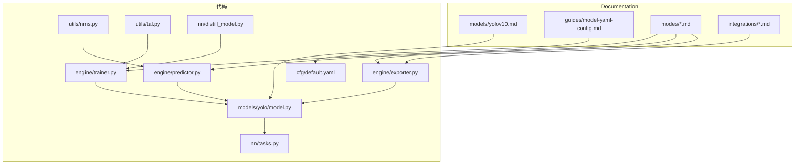
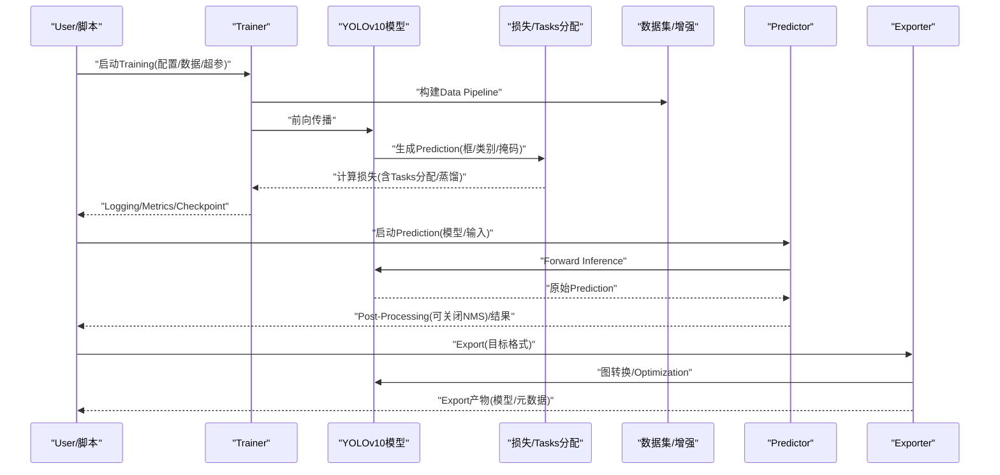
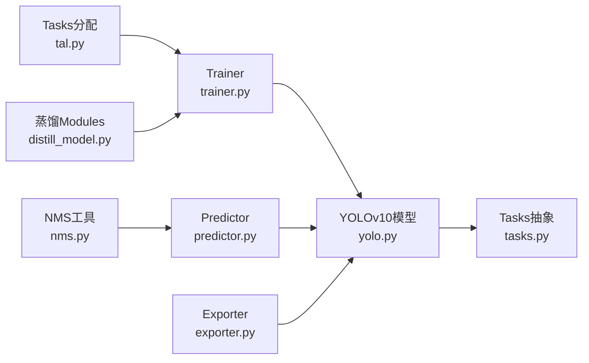

# YOLOv10模型

<cite>
**Files Referenced in This Document**
- [yolov10.md](file://docs/en/models/yolov10.md)
- [yolo.py](file://ultralytics/models/yolo/model.py)
- [train.py](file://ultralytics/engine/trainer.py)
- [predict.py](file://ultralytics/engine/predictor.py)
- [exporter.py](file://ultralytics/engine/exporter.py)
- [nms.py](file://ultralytics/utils/nms.py)
- [tal.py](file://ultralytics/utils/tal.py)
- [distill_model.py](file://ultralytics/nn/distill_model.py)
- [tasks.py](file://ultralytics/nn/tasks.py)
- [default.yaml](file://ultralytics/cfg/default.yaml)
- [model-yaml-config.md](file://docs/en/guides/model-yaml-config.md)
- [yolo26-mixture-compatibility.md](file://docs/en/guides/yolo26-mixture-compatibility.md)
- [yolo-performance-metrics.md](file://docs/en/guides/yolo-performance-metrics.md)
- [yolo-thread-safe-inference.md](file://docs/en/guides/yolo-thread-safe-inference.md)
- [edge-deployment-guide.md](file://docs/en/guides/deepstream-nvidia-jetson.md)
- [openvino-integration.md](file://docs/en/integrations/openvino.md)
- [tensorrt-integration.md](file://docs/en/integrations/tensorrt.md)
- [tflite-integration.md](file://docs/en/integrations/tflite.md)
- [ncnn-integration.md](file://docs/en/integrations/ncnn.md)
- [mnn-integration.md](file://docs/en/integrations/mnn.md)
- [onnx-export.md](file://docs/en/modes/export.md)
- [benchmark-mode.md](file://docs/en/modes/benchmark.md)
- [predict-mode.md](file://docs/en/modes/predict.md)
- [train-mode.md](file://docs/en/modes/train.md)
- [val-mode.md](file://docs/en/modes/val.md)
</cite>

## Table of Contents
1. [Introduction](#Introduction)
2. [Project Structure](#Project Structure)
3. [Core Components](#Core Components)
4. [Architecture Overview](#Architecture Overview)
5. [Detailed Component Analysis](#Detailed Component Analysis)
6. [Dependency Analysis](#Dependency Analysis)
7. [性能考量](#性能考量)
8. [Troubleshooting Guide](#Troubleshooting Guide)
9. [Conclusion](#Conclusion)
10. [Appendix](#Appendix)

## Introduction
本文件targeting希望深入理解andUsesYOLOv10的工程and研究读者，聚焦Centered on下主题：
- 双重Tasks分配策略and一致性蒸馏技术的设计动机、implementing要点andTraining流程
- 无NMS（Non-Maximum Suppression）Detection Head的设计原理、Inference优势and部署影响
- 精度and速度的平衡Optimization策略（Data Augmentation、损失权重、Post-Processing简化etc.）
- 完整配置文件结构and关键参数说明
- 新的API接口whileTraining、Validation、PredictionandExport中的Uses方法
- and前代版本while实时检测性能上的改进对比思路andMetrics口径
- Edge Device DeploymentOptimization建议and实际案例路径
- Model Compressionand量化技术的应用效果and注意事项

## Project Structure
The repository adopts a modular organization，YOLO Series Models统一由模型RegistryandTasks抽象drivers are installed，YOLOv10作for检测Tasks的一个具体implementing被集成to通用Training/Validation/Prediction/Export pipeline中。Documentation侧provides模型说明、模式Uses指南and多平台集成Documentation。

Figure Source
- [yolov10.md](file://docs/en/models/yolov10.md)
- [yolo.py](file://ultralytics/models/yolo/model.py)
- [train.py](file://ultralytics/engine/trainer.py)
- [predict.py](file://ultralytics/engine/predictor.py)
- [exporter.py](file://ultralytics/engine/exporter.py)
- [nms.py](file://ultralytics/utils/nms.py)
- [tal.py](file://ultralytics/utils/tal.py)
- [distill_model.py](file://ultralytics/nn/distill_model.py)
- [tasks.py](file://ultralytics/nn/tasks.py)
- [default.yaml](file://ultralytics/cfg/default.yaml)
- [model-yaml-config.md](file://docs/en/guides/model-yaml-config.md)
- [onnx-export.md](file://docs/en/modes/export.md)
- [benchmark-mode.md](file://docs/en/modes/benchmark.md)
- [predict-mode.md](file://docs/en/modes/predict.md)
- [train-mode.md](file://docs/en/modes/train.md)
- [val-mode.md](file://docs/en/modes/val.md)

Section Source
- [yolov10.md](file://docs/en/models/yolov10.md)
- [model-yaml-config.md](file://docs/en/guides/model-yaml-config.md)
- [train-mode.md](file://docs/en/modes/train.md)
- [predict-mode.md](file://docs/en/modes/predict.md)
- [export-mode.md](file://docs/en/modes/export.md)

## Core Components
- 模型定义andTasks适配：through a unified模型类EncapsulatesYOLOv10的Detection Headand特征网络，并andTasks抽象对接，便于复用Training/Validation/Prediction/Export逻辑。
- Trainer：负责加载配置、构建数据集、构造损失、执行前向/反向、记录Metricsand保存Checkpoint；Supporting一致性蒸馏andTasks分配策略的联合Optimization。
- Predictor：负责Image Preprocessing、模型Inference、OptionalPost-Processing（such asNMS）、结果Visualizationand序列化输出。
- Exporter：将PyTorchModel ExportforONNX/TensorRT/OpenVINO/TFLite/NCNN/MNNetc.格式，并附带必要的算子andPost-Processing脚本。
- 工具Modules：包含Tasks分配算法（such asTop-Aware Label Assignment）、NMSimplementing、蒸馏辅助Modulesetc.。

Section Source
- [yolo.py](file://ultralytics/models/yolo/model.py)
- [train.py](file://ultralytics/engine/trainer.py)
- [predict.py](file://ultralytics/engine/predictor.py)
- [exporter.py](file://ultralytics/engine/exporter.py)
- [tal.py](file://ultralytics/utils/tal.py)
- [nms.py](file://ultralytics/utils/nms.py)
- [distill_model.py](file://ultralytics/nn/distill_model.py)
- [tasks.py](file://ultralytics/nn/tasks.py)

## Architecture Overview
下图展示了YOLOv10whileTrainingandInference阶段的整体数据and控制流，Centered onand各Modules之间的交互关系。

Figure Source
- [train.py](file://ultralytics/engine/trainer.py)
- [yolo.py](file://ultralytics/models/yolo/model.py)
- [predict.py](file://ultralytics/engine/predictor.py)
- [exporter.py](file://ultralytics/engine/exporter.py)
- [tal.py](file://ultralytics/utils/tal.py)
- [distill_model.py](file://ultralytics/nn/distill_model.py)

## Detailed Component Analysis

### 双重Tasks分配策略
- 设计动机：传统单Tasks标签分配易产生正负样本不均衡and边界模糊问题。双重Tasks分配Via并行或级联的两套分配机制，分别关注“定位质量”和“分类置信度”，从而提升小目标and密集场景下的稳定性。
- implementing要点：
  - 两套候选匹配过程：一套基于IoU/距离度量，另一套基于类别分数或分布相似度。
  - 动态阈值and自适应权重：根据批次内难度分布调整正样本比例and损失权重。
  - andLoss Function协同：对回归分支and分类分支施加差异化正则and平滑项。
- Training流程：
  - 前向得to多尺度Prediction
  - 并行执行两种分配策略，生成软/硬标签
  - 组合损失并进行Backpropagation
- Evaluation收益：whileCOCOetc.基准上通常体现forAP/AP50/AP75的综合提升，尤其while密集and小目标场景更明显。

Section Source
- [tal.py](file://ultralytics/utils/tal.py)
- [train.py](file://ultralytics/engine/trainer.py)
- [yolo.py](file://ultralytics/models/yolo/model.py)

### 一致性蒸馏技术
- 设计动机：While maintaining轻量化，利用更大或更强模型的表征capabilities指导学生模型学习，提高泛化and鲁棒性。
- implementing要点：
  - 教师-学生双路前向：教师冻结或半冻结，学生端to端更新。
  - 一致性约束：while特征层或Prediction层引入KL散度、余弦相似度或对比损失，强调语义一致性and分布对齐。
  - 课程式蒸馏：随Training进程逐步加大蒸馏权重，避免早期不稳定。
- Training流程：
  - 初始化教师and学生模型
  - 每步计算Tasks损失and蒸馏损失，加权求和
  - 定期Evaluation并保存最佳学生模型
- 部署影响：仅部署学生模型，Inference速度and轻量化不变，但精度更高。

Section Source
- [distill_model.py](file://ultralytics/nn/distill_model.py)
- [train.py](file://ultralytics/engine/trainer.py)
- [yolo.py](file://ultralytics/models/yolo/model.py)

### 无NMS设计的implementing原理and优势
- 背景：传统检测器依赖NMS进行重复框过滤，带来额外CPU/GPU开销且难Centered on端to端Optimization。
- 无NMS方案：
  - Prediction头直接输出稀疏且高质量的目标表示（例such asAnchor-Free+TopK筛选+去重策略）。
  - Via更强的Tasks分配and损失设计，减少冗余Prediction，降低Post-Processing需求。
  - Inference阶段可直接返回最终检测结果，省去NMS步骤。
- 优势：
  - Inference延迟更低，尤其适合移动端and嵌入式设备。
  - 更易and后端Optimizer（TensorRT/OpenVINO/TFLite）融合，减少自定义算子依赖。
  - 端to端可微Training，有利于联合Optimization。
- 风险and对策：
  - 需确保Training时足够强的去重and正则，防止漏检and误检上升。
  - while极端密集场景下可Combining轻量Post-Processing（such asSoft-NMS或区域竞争）Centered on弥补。

Section Source
- [nms.py](file://ultralytics/utils/nms.py)
- [predict.py](file://ultralytics/engine/predictor.py)
- [yolo.py](file://ultralytics/models/yolo/model.py)

### 精度and速度的平衡Optimization策略
- 数据层面：
  - 合理的Data Augmentation强度andMixture策略，兼顾多样性and噪声控制。
  - 多尺度Trainingand测试，提升对小目标的召回。
- 模型层面：
  - 选择合适的主干and颈部深度/宽度，Combined with通道剪枝andKnowledge Distillation。
  - Uses无NMSDetection Head减少Post-Processing开销。
- Training层面：
  - 动态Learning RateandWarmup策略，稳定收敛。
  - Tasks分配and损失权重的调优，平衡定位and分类。
- 部署层面：
  - Exporting to高效格式（TensorRT/OpenVINO/TFLite/NCNN/MNN），启用INT8/FP16量化and图Optimization。
  - 批处理and流水线并行，提升吞吐。

Section Source
- [yolo-performance-metrics.md](file://docs/en/guides/yolo-performance-metrics.md)
- [yolo-thread-safe-inference.md](file://docs/en/guides/yolo-thread-safe-inference.md)
- [onnx-export.md](file://docs/en/modes/export.md)
- [benchmark-mode.md](file://docs/en/modes/benchmark.md)

### 配置文件结构and参数说明
- 模型配置（YAML）：
  - 主干/颈部/头部结构定义
  - Tasks相关参数（类别数、锚点/网格设置、损失权重）
  - 蒸馏相关开关and教师模型路径
- Training Configuration（默认/覆盖）：
  - 数据路径、增强策略、批量大小、迭代次数
  - Optimizer、Learning Rate调度、EMA、Loggingand保存策略
- Export配置：
  - 目标格式、输入尺寸、动态轴、量化选项
- Refer to入口：
  - 默认配置模板and字段说明
  - 模型YAML配置规范

Section Source
- [default.yaml](file://ultralytics/cfg/default.yaml)
- [model-yaml-config.md](file://docs/en/guides/model-yaml-config.md)
- [yolo26-mixture-compatibility.md](file://docs/en/guides/yolo26-mixture-compatibility.md)

### 新API接口：Training、Validation、PredictionandExport
- Training：
  - ViaTrainer接口Load modeland数据，传入配置and超参，启动Training循环。
  - Supporting断点续训、Distributed training and monitoring回调。
- Validation：
  - whileValidation集上计算mAP、Precision/Recalletc.Metrics，输出混淆矩阵andPR曲线。
- Prediction：
  - Supporting单图/视频/文件夹Batch Inference，Optional择是否开启NMSandVisualization。
- Export：
  - 一键Export至ONNX/TensorRT/OpenVINO/TFLite/NCNN/MNNetc.格式，附带元数据andExamples脚本。

Section Source
- [train-mode.md](file://docs/en/modes/train.md)
- [val-mode.md](file://docs/en/modes/val.md)
- [predict-mode.md](file://docs/en/modes/predict.md)
- [onnx-export.md](file://docs/en/modes/export.md)
- [train.py](file://ultralytics/engine/trainer.py)
- [predict.py](file://ultralytics/engine/predictor.py)
- [exporter.py](file://ultralytics/engine/exporter.py)

### and前代版本的实时检测性能对比
- 对比维度：
  - 相同分辨率and硬件下的FPS、延迟、吞吐
  - mAP@0.5andmAP@[0.5:0.95]
  - 内存占用and能耗
- 方法建议：
  - Uses官方基准模式while不同设备上跑分
  - 固定输入尺寸and批量大小，保证公平性
  - 报告均值and方差，考虑多次运行取稳健估计

Section Source
- [benchmark-mode.md](file://docs/en/modes/benchmark.md)
- [yolo-performance-metrics.md](file://docs/en/guides/yolo-performance-metrics.md)

### Edge Device DeploymentOptimization建议and实际案例
- 平台and格式：
  - NVIDIA Jetson + TensorRT：启用FP16/INT8校准，OptimizationCUDA内核and内存布局
  - OpenVINO：转换forIR并启用CPU/GPU加速，注意算子Supporting
  - TFLite：针对移动设备Optimization，启用量化andDelegate
  - NCNN/MNN：targetingARM/NPU的高效Inference
- 工程实践：
  - 输入预处理andPost-Processing尽量下沉toExport图中
  - Uses线程安全Inferenceand批处理提升吞吐
  - 监控温度and功耗，动态调节分辨率and批量
- 实际案例路径：
  - Jetson DeepStream集成指南
  - 多平台ExportandValidation脚本

Section Source
- [edge-deployment-guide.md](file://docs/en/guides/deepstream-nvidia-jetson.md)
- [openvino-integration.md](file://docs/en/integrations/openvino.md)
- [tensorrt-integration.md](file://docs/en/integrations/tensorrt.md)
- [tflite-integration.md](file://docs/en/integrations/tflite.md)
- [ncnn-integration.md](file://docs/en/integrations/ncnn.md)
- [mnn-integration.md](file://docs/en/integrations/mnn.md)
- [yolo-thread-safe-inference.md](file://docs/en/guides/yolo-thread-safe-inference.md)

### Model Compressionand量化技术应用效果
- 压缩技术：
  - 结构化剪枝：按通道/层剪枝，保持Inference图规整
  - 非结构化剪枝：稀疏权重，需配套稀疏Inference引擎
- 量化技术：
  - Training后量化（PTQ）：快速部署，需校准集
  - 量化感知Training（QAT）：精度更稳，Training成本更高
- 效果Evaluation：
  - 对比INT8/FP16/FP32的精度and速度变化
  - 关注小目标and低对比度场景的退化情况
- 注意事项：
  - 某些算子while特定后端不Supporting，需替换或回退
  - 校准集应覆盖真实分布，避免偏差

Section Source
- [onnx-export.md](file://docs/en/modes/export.md)
- [openvino-integration.md](file://docs/en/integrations/openvino.md)
- [tensorrt-integration.md](file://docs/en/integrations/tensorrt.md)
- [tflite-integration.md](file://docs/en/integrations/tflite.md)
- [ncnn-integration.md](file://docs/en/integrations/ncnn.md)
- [mnn-integration.md](file://docs/en/integrations/mnn.md)

## Dependency Analysis
YOLOv10while代码层面的依赖关系such as下：模型类依赖Tasks抽象，Trainer依赖模型and工具Modules，Predictor依赖模型andNMS工具，Exporter依赖模型and后端Optimizer。

Figure Source
- [yolo.py](file://ultralytics/models/yolo/model.py)
- [tasks.py](file://ultralytics/nn/tasks.py)
- [train.py](file://ultralytics/engine/trainer.py)
- [predict.py](file://ultralytics/engine/predictor.py)
- [exporter.py](file://ultralytics/engine/exporter.py)
- [tal.py](file://ultralytics/utils/tal.py)
- [nms.py](file://ultralytics/utils/nms.py)
- [distill_model.py](file://ultralytics/nn/distill_model.py)

Section Source
- [yolo.py](file://ultralytics/models/yolo/model.py)
- [tasks.py](file://ultralytics/nn/tasks.py)
- [train.py](file://ultralytics/engine/trainer.py)
- [predict.py](file://ultralytics/engine/predictor.py)
- [exporter.py](file://ultralytics/engine/exporter.py)
- [tal.py](file://ultralytics/utils/tal.py)
- [nms.py](file://ultralytics/utils/nms.py)
- [distill_model.py](file://ultralytics/nn/distill_model.py)

## 性能考量
- 输入尺寸and分辨率：增大分辨率提升召回但增加延迟，需权衡业务需求。
- 批量大小and并发：whileGPU显存允许范围内提升吞吐，注意内存峰值。
- 量化and编译Optimization：Prefer后端原生Optimization（TensorRT/OpenVINO），减少自定义算子。
- 线程安全and异步：while高并发服务中Uses线程安全Inferenceand异步IO。
- 监控and回归：建立性能基线and回归测试，确保升级不降速。

[本节for通用指导，无需列出Section Source]

## Troubleshooting Guide
- Training不收敛或震荡：
  - 检查Learning RateandWarmup策略，确认Data Augmentation强度是否过大
  - 核对Tasks分配and损失权重是否合理
- Export Failure或运行时错误：
  - 确认目标后端Supporting的算子列表，必要时替换或禁用
  - 检查输入尺寸and动态轴配置是否andExport参数一致
- Inference精度下降：
  - 量化校准集是否覆盖长尾and困难样本
  - 比较FP32andINT8的差异，定位退化严重类别
- 部署资源不足：
  - 降低分辨率或批量大小，启用INT8/FP16
  - Uses批处理and流水线并行提升吞吐

Section Source
- [train.py](file://ultralytics/engine/trainer.py)
- [predict.py](file://ultralytics/engine/predictor.py)
- [exporter.py](file://ultralytics/engine/exporter.py)
- [nms.py](file://ultralytics/utils/nms.py)
- [tal.py](file://ultralytics/utils/tal.py)

## Conclusion
YOLOv10Via双重Tasks分配and一致性蒸馏，while无NMSDetection Head的加持下，implementing了更高的精度and更快的Inference速度。Combining完善的Training/Validation/Prediction/ExportAPIand多平台集成Documentation，开发者可while云端and边缘设备上高效落地。建议while工程中建立严格的性能基线and回归测试，持续Optimization数据、模型and部署链路，Centered on获得稳定的实时检测体验。

[本节for总结，无需列出Section Source]

## Appendix
- Quick Start：
  - Training：Refer toTraining模式Documentation
  - Validation：Refer toValidation模式Documentation
  - Prediction：Refer toPrediction模式Documentation
  - Export：Refer toExport模式Documentation
- 集成Refer to：
  - TensorRT/OpenVINO/TFLite/NCNN/MNN集成Documentation
- 性能andMetrics：
  - 性能Metricsand评测方法Documentation

Section Source
- [train-mode.md](file://docs/en/modes/train.md)
- [val-mode.md](file://docs/en/modes/val.md)
- [predict-mode.md](file://docs/en/modes/predict.md)
- [onnx-export.md](file://docs/en/modes/export.md)
- [openvino-integration.md](file://docs/en/integrations/openvino.md)
- [tensorrt-integration.md](file://docs/en/integrations/tensorrt.md)
- [tflite-integration.md](file://docs/en/integrations/tflite.md)
- [ncnn-integration.md](file://docs/en/integrations/ncnn.md)
- [mnn-integration.md](file://docs/en/integrations/mnn.md)
- [yolo-performance-metrics.md](file://docs/en/guides/yolo-performance-metrics.md)