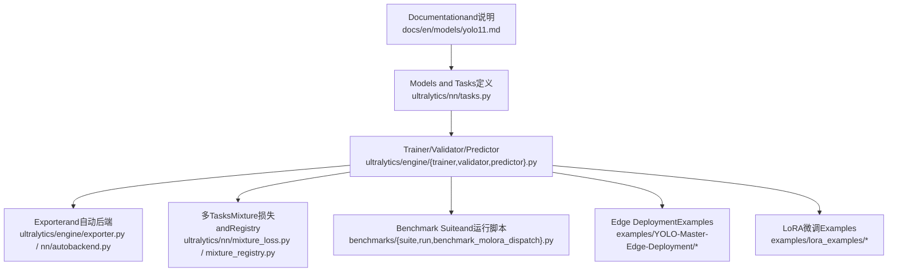
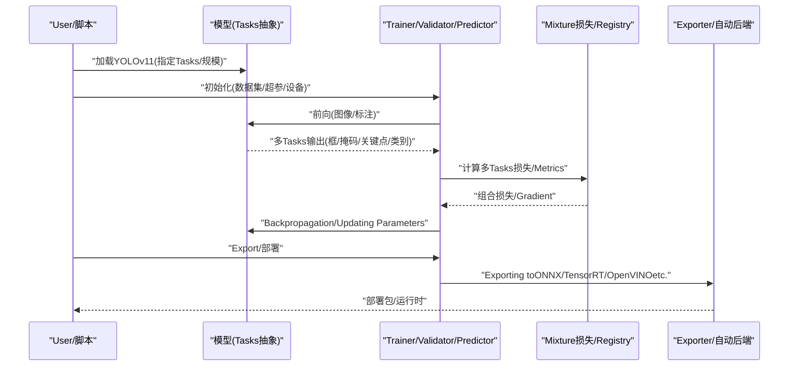
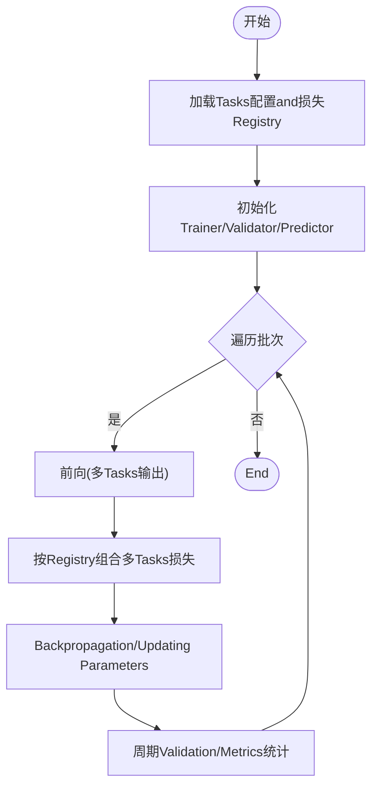
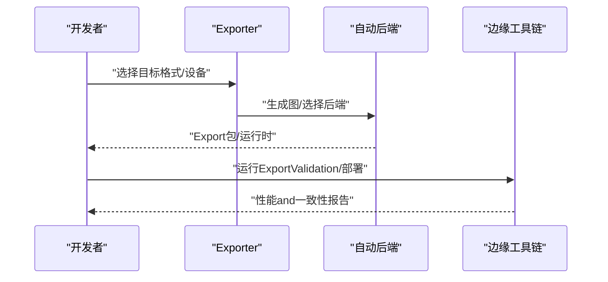
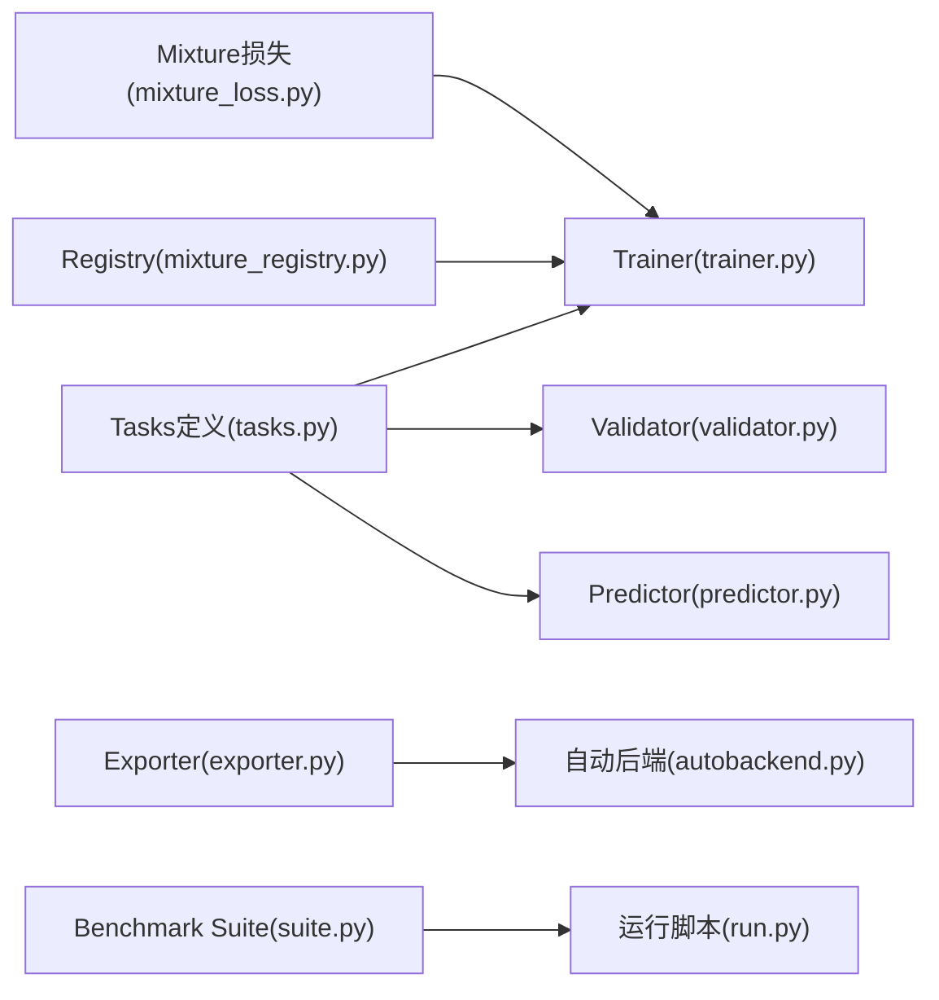

# YOLOv11模型

<cite>
**Files Referenced in This Document**
- [README.md](file://README.md)
- [yolo11.md](file://docs/en/models/yolo11.md)
- [yolo-architecture.md](file://docs/en/guides/yolo-architecture.md)
- [yolo26-mixture-compatibility.md](file://docs/en/guides/yolo26-mixture-compatibility.md)
- [mixture_loss.py](file://ultralytics/nn/mixture_loss.py)
- [mixture_registry.py](file://ultralytics/nn/mixture_registry.py)
- [tasks.py](file://ultralytics/nn/tasks.py)
- [model.py](file://ultralytics/engine/model.py)
- [trainer.py](file://ultralytics/engine/trainer.py)
- [validator.py](file://ultralytics/engine/validator.py)
- [predictor.py](file://ultralytics/engine/predictor.py)
- [exporter.py](file://ultralytics/engine/exporter.py)
- [autobackend.py](file://ultralytics/nn/autobackend.py)
- [benchmark_molora_dispatch.py](file://benchmarks/benchmark_molora_dispatch.py)
- [suite.py](file://benchmarks/suite.py)
- [run.py](file://benchmarks/run.py)
- [yolo11_lora.yaml](file://examples/lora_examples/yolo11_lora.yaml)
- [yolo_master_lora_README.md](file://examples/lora_examples/yolo_master_lora_README.md)
- [export_edge_models.py](file://examples/YOLO-Master-Edge-Deployment/export_edge_models.py)
- [edge_utils.py](file://examples/YOLO-Master-Edge-Deployment/edge_utils.py)
- [validate_edge_outputs.py](file://examples/YOLO-Master-Edge-Deployment/validate_edge_outputs.py)
</cite>

## Table of Contents
1. [Introduction](#Introduction)
2. [Project Structure](#Project Structure)
3. [Core Components](#Core Components)
4. [Architecture Overview](#Architecture Overview)
5. [Detailed Component Analysis](#Detailed Component Analysis)
6. [Dependency Analysis](#Dependency Analysis)
7. [性能and效率](#性能and效率)
8. [Troubleshooting Guide](#Troubleshooting Guide)
9. [Conclusion](#Conclusion)
10. [Appendix](#Appendix)

## Introduction
本文件targeting希望系统掌握YOLOv11多Tasks统一架构、Attention Mechanism改进、跨Tasks配置andMigration学习、联合Training策略、基准对比、轻量化and加速部署的EngineersandResearchers。Documentation基于仓库中的官方说明、Refer toimplementingandExamples工程，provides从高层设计to落地实践的全链路解读，并辅Centered onVisualization图示帮助理解关键流程andModules关系。

## Project Structure
围绕YOLOv11的多Taskscapabilities，仓库采用“模型定义—Training/Validation/Prediction引擎—Exportand部署—基准评测—Examples and Tutorials”的分层组织方式：
- Models and Tasks：while模型and神经网络Modules中集中定义YOLOv11and其多Tasks头（检测、分割、姿态、旋转Object Detection、分类），并ViaUnified Interface暴露给上层引擎。
- TrainingandInference：engine层EncapsulatesTrainer、Validator、PredictorandExporter，屏蔽底层细节，provides一致API。
- 多TasksMixtureand路由：ViaMixture损失andRegistry机制，支撑多Tasks联合TrainingandDynamic Routing。
- 基准and评测：providesBenchmark Suiteand调度脚本，便于while不同Tasksand规模上复现实验。
- Edge Deployment：providesExportandValidation工具链，覆盖ONNX/TensorRT/OpenVINOetc.后端。
- Examples and Tutorials：包含LoRA微调、Edge Deployment、Triton/C++Inferenceetc.端to端Examples。

**Figure Source**
- [yolo11.md](file://docs/en/models/yolo11.md)
- [tasks.py](file://ultralytics/nn/tasks.py)
- [trainer.py](file://ultralytics/engine/trainer.py)
- [validator.py](file://ultralytics/engine/validator.py)
- [predictor.py](file://ultralytics/engine/predictor.py)
- [exporter.py](file://ultralytics/engine/exporter.py)
- [autobackend.py](file://ultralytics/nn/autobackend.py)
- [mixture_loss.py](file://ultralytics/nn/mixture_loss.py)
- [mixture_registry.py](file://ultralytics/nn/mixture_registry.py)
- [suite.py](file://benchmarks/suite.py)
- [run.py](file://benchmarks/run.py)
- [benchmark_molora_dispatch.py](file://benchmarks/benchmark_molora_dispatch.py)
- [export_edge_models.py](file://examples/YOLO-Master-Edge-Deployment/export_edge_models.py)
- [edge_utils.py](file://examples/YOLO-Master-Edge-Deployment/edge_utils.py)
- [validate_edge_outputs.py](file://examples/YOLO-Master-Edge-Deployment/validate_edge_outputs.py)
- [yolo11_lora.yaml](file://examples/lora_examples/yolo11_lora.yaml)
- [yolo_master_lora_README.md](file://examples/lora_examples/yolo_master_lora_README.md)

**Section Source**
- [README.md](file://README.md)
- [yolo11.md](file://docs/en/models/yolo11.md)

## Core Components
- 统一Tasks接口and多Tasks头：ViaTasks抽象将检测、分割、姿态、旋转Object Detection、分类and other tasks统一to同一模型框架下，共享主干Feature Extractionand部分中间表示，降低重复计算。
- 多TasksMixture损失and路由：利用Mixture损失andRegistry机制，Supporting多Tasks联合Training时的Loss combination、权重调度andOptionalrouting strategies，提升多Tasks协同效果。
- Training/Validation/Prediction/Export流水线：engine层provides一致的API，贯穿Data Loading、前向传播、损失计算、Metrics统计、结果Post-Processingand格式Export。
- 自动后端适配：根据目标平台and格式选择最优执行后端，Combining算子Optimizationand图级融合，提高Inference吞吐and延迟表现。
- 基准评测套件：provides可复用的基准脚本andTasks矩阵，便于横向对比不同Tasksand模型规模的精度/速度权衡。
- 轻量and部署工具链：涵盖Export、量化、剪枝、编译and运行时适配，Combined withEdge DeploymentExamples完成端to端落地。

**Section Source**
- [tasks.py](file://ultralytics/nn/tasks.py)
- [mixture_loss.py](file://ultralytics/nn/mixture_loss.py)
- [mixture_registry.py](file://ultralytics/nn/mixture_registry.py)
- [model.py](file://ultralytics/engine/model.py)
- [trainer.py](file://ultralytics/engine/trainer.py)
- [validator.py](file://ultralytics/engine/validator.py)
- [predictor.py](file://ultralytics/engine/predictor.py)
- [exporter.py](file://ultralytics/engine/exporter.py)
- [autobackend.py](file://ultralytics/nn/autobackend.py)
- [suite.py](file://benchmarks/suite.py)
- [run.py](file://benchmarks/run.py)

## Architecture Overview
YOLOv11while多Tasks场景下的整体架构由“统一主干+多Tasks头+MixtureTraining+自动后端”构成。下图展示了从输入to输出的端to端流程，Centered onand各组件之间的交互关系。

**Figure Source**
- [model.py](file://ultralytics/engine/model.py)
- [trainer.py](file://ultralytics/engine/trainer.py)
- [validator.py](file://ultralytics/engine/validator.py)
- [predictor.py](file://ultralytics/engine/predictor.py)
- [mixture_loss.py](file://ultralytics/nn/mixture_loss.py)
- [mixture_registry.py](file://ultralytics/nn/mixture_registry.py)
- [exporter.py](file://ultralytics/engine/exporter.py)
- [autobackend.py](file://ultralytics/nn/autobackend.py)

## Detailed Component Analysis

### 多Tasks统一架构andAttention Mechanism改进
- 统一架构要点
  - 共享主干and多尺度特征：while检测、分割、姿态、旋转Object Detectionand分类Tasks间复用Backbone Networkand颈部结构，减少冗余计算。
  - Tasks特定头：针对不同Tasks的输出形式（边界框、掩码、关键点、角度、类别概率）设计专用头，保持Tasks语义清晰。
  - Unified Interface：ViaTasks抽象类Exposing a consistentforward/loss/inference接口，简化上层Calls。
- Attention Mechanism改进
  - while骨干或颈部引入更高效的注意力Modules，增强小目标and遮挡目标的表征capabilities，同时控制计算开销。
  - Combining多尺度融合，使注意力while不同分辨率特征图上自适应聚焦关键区域。
- Refer toand扩展
  - 官方Documentation对YOLOv11的整体设计and改进点进行了说明，可作for进一步阅读的基础。

**Section Source**
- [yolo11.md](file://docs/en/models/yolo11.md)
- [yolo-architecture.md](file://docs/en/guides/yolo-architecture.md)
- [tasks.py](file://ultralytics/nn/tasks.py)

### 多Tasks联合TrainingandLoss combination
- Mixture损失andRegistry
  - ViaRegistry机制管理不同Tasks的Loss Functionand权重策略，Supporting按Tasks类型动态组合。
  - whileTraining阶段，将多Tasks损失加权求和或按策略调度，Centered on平衡各Tasks收敛速度and最终性能。
- Training流程
  - Trainer负责数据迭代、前向/反向、Metrics统计andLogging；Validator负责周期性Evaluation；Predictor负责InferenceandPost-Processing。
- 注意事项
  - Tasks权重需随Training阶段调整，避免主导Tasks压制其他Tasks。
  - 对于长尾或难样本较多的Tasks，可采用难度感知或重采样策略。

**Figure Source**
- [trainer.py](file://ultralytics/engine/trainer.py)
- [validator.py](file://ultralytics/engine/validator.py)
- [mixture_loss.py](file://ultralytics/nn/mixture_loss.py)
- [mixture_registry.py](file://ultralytics/nn/mixture_registry.py)

**Section Source**
- [mixture_loss.py](file://ultralytics/nn/mixture_loss.py)
- [mixture_registry.py](file://ultralytics/nn/mixture_registry.py)
- [trainer.py](file://ultralytics/engine/trainer.py)
- [validator.py](file://ultralytics/engine/validator.py)

### 模型规模扩展and计算效率Optimization
- 规模扩展
  - Via缩放深度/宽度/分辨率etc.维度，生成不同规模的YOLOv11变体，满足从移动端to服务器的多样化需求。
- 计算效率Optimization
  - Uses高效注意力and卷积组合，减少冗余计算。
  - whileExport阶段启用图级融合、算子替换and内核Optimization，Combining自动后端选择，最大化硬件利用率。
- 基准评测
  - 借助Benchmark Suite对不同规模andTasks进行横向对比，定位bottlenecksand收益点。

**Section Source**
- [yolo11.md](file://docs/en/models/yolo11.md)
- [suite.py](file://benchmarks/suite.py)
- [run.py](file://benchmarks/run.py)
- [benchmark_molora_dispatch.py](file://benchmarks/benchmark_molora_dispatch.py)

### 跨Tasks配置模板andMigration学习指南
- 配置模板
  - provides针对YOLOv11的LoRA微调配置文件，便于快速启动跨Tasks微调。
- Migration学习步骤
  - 加载Pre-trained Weights → 冻结主干或部分Modules → 替换Tasks头and类别数 → 设置LoRA秩andLearning Rate → 小规模数据预热 → 全量微调。
- 最佳实践
  - 先冻结再解冻，逐步扩大可Training范围。
  - Uses较小的初始Learning Rateandwarmup，稳定收敛。
  - 监控各TasksMetrics，必要时调整损失权重或数据配比。

**Section Source**
- [yolo11_lora.yaml](file://examples/lora_examples/yolo11_lora.yaml)
- [yolo_master_lora_README.md](file://examples/lora_examples/yolo_master_lora_README.md)

### 自定义Tasks适配方案and实践
- Tasks注册
  - whileTasks抽象andRegistry中新增自定义Tasks类型，定义其输出格式andLoss Function。
- 数据and标注
  - 适配Data Loading器and标注解析器，确保and现有管线兼容。
- TrainingandValidation
  - whileTrainer中集成新Tasks的损失andMetrics，whileValidator中implementing相应的Evaluation逻辑。
- Exportand部署
  - 确保Exporter能正确序列化新Tasks的输出，并while自动后端中可用。

**Section Source**
- [tasks.py](file://ultralytics/nn/tasks.py)
- [mixture_registry.py](file://ultralytics/nn/mixture_registry.py)
- [trainer.py](file://ultralytics/engine/trainer.py)
- [validator.py](file://ultralytics/engine/validator.py)
- [exporter.py](file://ultralytics/engine/exporter.py)

### 轻量化and加速部署implementing
- Exportand后端
  - UsesExporter生成目标格式（such asONNX/TensorRT/OpenVINO），并由自动后端选择最优执行路径。
- Edge DeploymentExamples
  - providesExport脚本、边缘工具and输出校验脚本，形成完整的部署闭环。
- 性能调优
  - Combining量化、剪枝and编译Optimization，while延迟and吞吐之间取得平衡。

**Figure Source**
- [exporter.py](file://ultralytics/engine/exporter.py)
- [autobackend.py](file://ultralytics/nn/autobackend.py)
- [export_edge_models.py](file://examples/YOLO-Master-Edge-Deployment/export_edge_models.py)
- [edge_utils.py](file://examples/YOLO-Master-Edge-Deployment/edge_utils.py)
- [validate_edge_outputs.py](file://examples/YOLO-Master-Edge-Deployment/validate_edge_outputs.py)

**Section Source**
- [exporter.py](file://ultralytics/engine/exporter.py)
- [autobackend.py](file://ultralytics/nn/autobackend.py)
- [export_edge_models.py](file://examples/YOLO-Master-Edge-Deployment/export_edge_models.py)
- [edge_utils.py](file://examples/YOLO-Master-Edge-Deployment/edge_utils.py)
- [validate_edge_outputs.py](file://examples/YOLO-Master-Edge-Deployment/validate_edge_outputs.py)

## Dependency Analysis
YOLOv11的核心依赖关系such as下：
- Models and Tasks定义被Trainer、Validator、Predictor共同依赖。
- Mixture损失andRegistryforTraining阶段providesLoss combinationand策略管理。
- Exporterand自动后端for部署阶段provides格式转换and后端选择。
- Benchmark Suite用于横向评测and回归测试。

**Figure Source**
- [tasks.py](file://ultralytics/nn/tasks.py)
- [trainer.py](file://ultralytics/engine/trainer.py)
- [validator.py](file://ultralytics/engine/validator.py)
- [predictor.py](file://ultralytics/engine/predictor.py)
- [mixture_loss.py](file://ultralytics/nn/mixture_loss.py)
- [mixture_registry.py](file://ultralytics/nn/mixture_registry.py)
- [exporter.py](file://ultralytics/engine/exporter.py)
- [autobackend.py](file://ultralytics/nn/autobackend.py)
- [suite.py](file://benchmarks/suite.py)
- [run.py](file://benchmarks/run.py)

**Section Source**
- [tasks.py](file://ultralytics/nn/tasks.py)
- [trainer.py](file://ultralytics/engine/trainer.py)
- [validator.py](file://ultralytics/engine/validator.py)
- [predictor.py](file://ultralytics/engine/predictor.py)
- [mixture_loss.py](file://ultralytics/nn/mixture_loss.py)
- [mixture_registry.py](file://ultralytics/nn/mixture_registry.py)
- [exporter.py](file://ultralytics/engine/exporter.py)
- [autobackend.py](file://ultralytics/nn/autobackend.py)
- [suite.py](file://benchmarks/suite.py)
- [run.py](file://benchmarks/run.py)

## 性能and效率
- 多Tasks性能权衡
  - 联合Training时，建议对各Tasks分别统计精度and速度，关注主导Tasks对其他Tasks的影响。
- 规模and效率
  - 不同规模模型while精度and延迟之间存while折衷，应Combining实际部署环境选择合适版本。
- 基准and回归
  - UsesBenchmark Suite定期回归测试，确保改动不破坏既有性能基线。
- Refer toDocumentation
  - 官方Documentation中包含YOLO系列性能Metricsand对比，可作forRefer to基线。

**Section Source**
- [suite.py](file://benchmarks/suite.py)
- [run.py](file://benchmarks/run.py)
- [benchmark_molora_dispatch.py](file://benchmarks/benchmark_molora_dispatch.py)
- [yolo11.md](file://docs/en/models/yolo11.md)

## Troubleshooting Guide
- Training不稳定
  - 检查损失权重是否合理，是否存while某Tasks主导导致Gradient爆炸或消失。
  - 确认数据预处理and标注格式是否andTasks头匹配。
- Export Failure或Inference异常
  - 核对Export格式and后端兼容性，查看自动后端选择Logging。
  - UsesEdge DeploymentExamples中的校验脚本ValidationExport结果的一致性。
- 性能不达预期
  - 检查是否启用了合适的Optimization选项（图融合、算子替换、量化）。
  - 对比Benchmark Suite结果，定位bottlenecks层或算子。

**Section Source**
- [exporter.py](file://ultralytics/engine/exporter.py)
- [autobackend.py](file://ultralytics/nn/autobackend.py)
- [validate_edge_outputs.py](file://examples/YOLO-Master-Edge-Deployment/validate_edge_outputs.py)

## Conclusion
YOLOv11while多Tasks统一架构下，Via共享主干andTasks特定头的设计，有效提升了多Tasks协同Training的效率and效果。CombiningMixture损失andRegistry机制，implementing了灵活的Tasks组合and权重调度。while部署侧，Exporterand自动后端provides了良好的跨平台适配capabilities，Combined withEdge DeploymentExamplesandBenchmark Suite，形成了从Trainingto落地的完整闭环。建议while具体项目中依据Tasks特性and部署约束，选择合适的模型规模andOptimization策略，并Via基准回归保障稳定性。

## Appendix
- 官方Documentationand架构说明
  - Refer toYOLOv11andYOLO架构Documentation，了解整体设计and改进点。
- 多Tasks兼容性
  - Refer to多TasksMixture兼容性说明，理解不同Tasks间的兼容性and差异。

**Section Source**
- [yolo11.md](file://docs/en/models/yolo11.md)
- [yolo-architecture.md](file://docs/en/guides/yolo-architecture.md)
- [yolo26-mixture-compatibility.md](file://docs/en/guides/yolo26-mixture-compatibility.md)