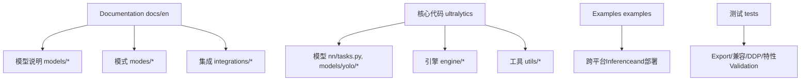
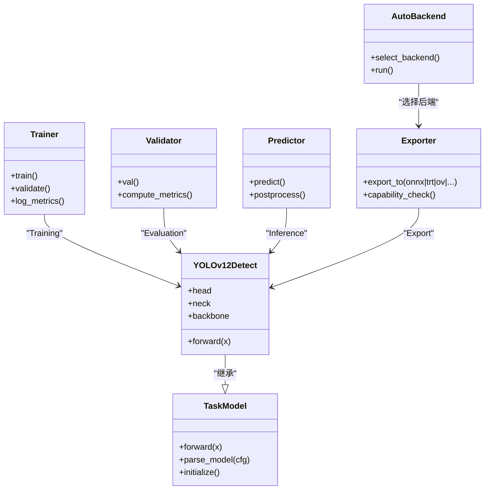
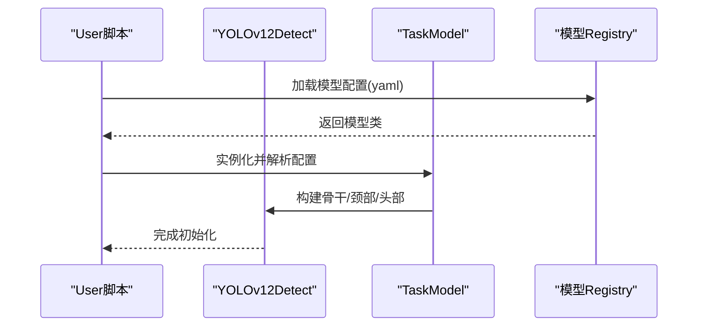
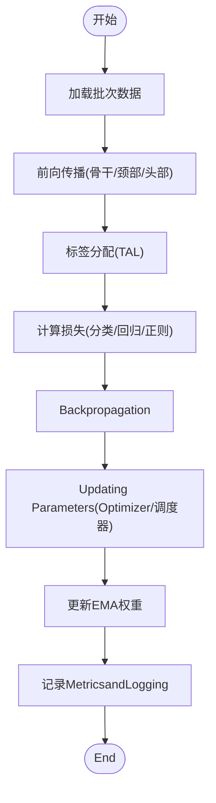
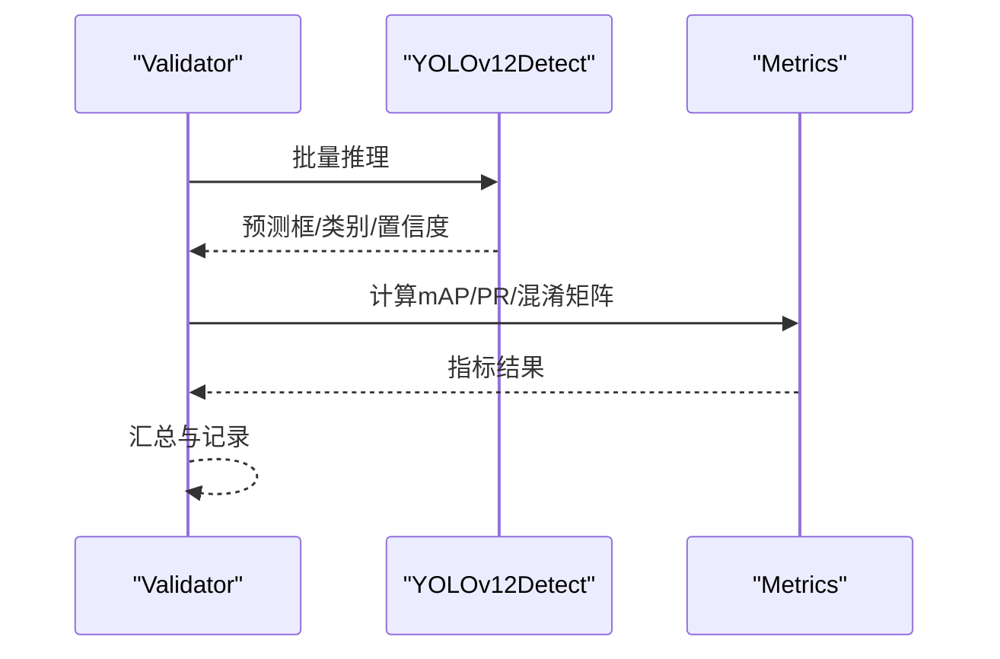
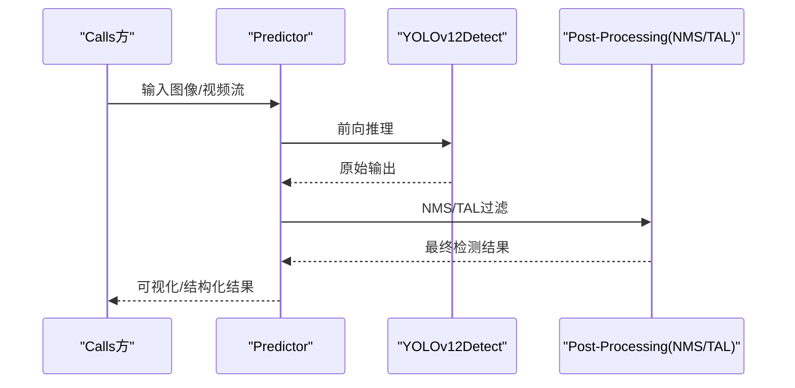
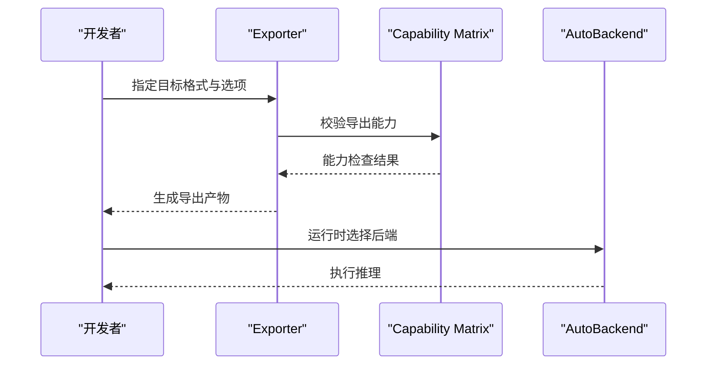
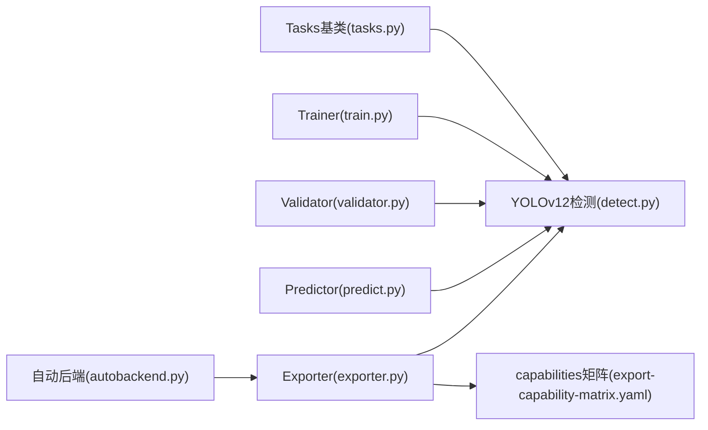

# YOLOv12模型

<cite>
**Files Referenced in This Document**
- [README.md](file://README.md)
- [yolo12.md](file://docs/en/models/yolo12.md)
- [yolo11.md](file://docs/en/models/yolo11.md)
- [yolo-architecture.md](file://docs/en/guides/yolo-architecture.md)
- [model-yaml-config.md](file://docs/en/guides/model-yaml-config.md)
- [yolo-performance-metrics.md](file://docs/en/guides/yolo-performance-metrics.md)
- [model-deployment-practices.md](file://docs/en/guides/model-deployment-practices.md)
- [triton-inference-server.md](file://docs/en/integrations/triton-inference-server.md)
- [openvino.md](file://docs/en/integrations/openvino.md)
- [tensorrt.md](file://docs/en/integrations/tensorrt.md)
- [export-capability-matrix.yaml](file://ultralytics/cfg/export-capability-matrix.yaml)
- [default.yaml](file://ultralytics/cfg/default.yaml)
- [yolo.py](file://ultralytics/models/yolo/model.py)
- [detect.py](file://ultralytics/models/yolo/detect/model.py)
- [train.py](file://ultralytics/engine/trainer.py)
- [predict.py](file://ultralytics/engine/predictor.py)
- [validator.py](file://ultralytics/engine/validator.py)
- [exporter.py](file://ultralytics/engine/exporter.py)
- [tasks.py](file://ultralytics/nn/tasks.py)
- [autobackend.py](file://ultralytics/nn/autobackend.py)
- [benchmarks.py](file://ultralytics/utils/benchmarks.py)
- [tal.py](file://ultralytics/utils/tal.py)
- [loss.py](file://ultralytics/utils/loss.py)
- [metrics.py](file://ultralytics/utils/metrics.py)
</cite>

## Table of Contents
1. [Introduction](#Introduction)
2. [Project Structure](#Project Structure)
3. [Core Components](#Core Components)
4. [Architecture Overview](#Architecture Overview)
5. [Detailed Component Analysis](#Detailed Component Analysis)
6. [Dependency Analysis](#Dependency Analysis)
7. [性能and基准](#性能and基准)
8. [Training技巧and调参](#Training技巧and调参)
9. [部署and生产实践](#部署and生产实践)
10. [故障排除指南](#故障排除指南)
11. [Conclusion](#Conclusion)
12. [Appendix](#Appendix)

## Introduction
本文件targeting希望深入理解并高效UsesYOLOv12的EngineersandResearchers，系统梳理其最新架构改进、多尺度特征融合and动态Routing Mechanism的创新点，给出针对不同硬件平台的Optimization策略、模型选择and性能基准对比方法、高级配置and自定义扩展路径，Centered onand生产环境部署最佳实践and常见问题排查。同时，Combining仓库中的Documentationand源码组织，provides从TrainingtoInference、从Exportto集成的端to端Refer to。

## Project Structure
该仓库采用“Documentation+代码+Examples+测试”的分层组织方式：
- Documentation层：docs/en 下按Tasks、模式、平台、集成etc.维度组织，包含YOLO Series Models说明、Training/Validation/Prediction/Export模式、部署and集成指南etc.。
- 代码层：ultralytics for核心implementing，包含模型定义、Training/Validation/Prediction引擎、Export工具、后端适配、Metricsand损失计算etc.。
- Examples层：examples provides跨平台Inference、Edge Deployment、ONNX/TensorRT/OpenVINOetc.集成样例。
- 测试层：tests 覆盖Exportcapabilities矩阵、兼容性、DDP稳定性、MoE/MoA相关特性etc.。

Figure Source
- [yolo12.md](file://docs/en/models/yolo12.md)
- [yolo-architecture.md](file://docs/en/guides/yolo-architecture.md)
- [yolo.py](file://ultralytics/models/yolo/model.py)
- [tasks.py](file://ultralytics/nn/tasks.py)

Section Source
- [README.md](file://README.md)
- [yolo12.md](file://docs/en/models/yolo12.md)
- [yolo-architecture.md](file://docs/en/guides/yolo-architecture.md)

## Core Components
- 模型定义andTasksEncapsulates
  - 统一Tasks接口andDetection HeadEncapsulateswhileTasksModules中，负责将通用骨干and颈部组合for具体Tasks（such as检测）。
  - YOLOv12的检测模型Via专用模型类注册and加载，Supporting不同规模变体and配置。
- Training/Validation/Prediction引擎
  - Trainer负责Data Loading、Optimizer调度、损失计算、EMAandLogging。
  - Validator负责Metrics统计、混淆矩阵、PR曲线andmAPEvaluation。
  - Predictor负责Inference流程、Post-Processing（NMS/TAL）andVisualization结果。
- Exportand后端适配
  - ExporterSupporting多种目标格式（ONNX、TensorRT、OpenVINO、TFLiteetc.），并providescapabilities矩阵校验。
  - 自动后端选择根据运行环境andExport产物选择合适的执行后端。
- 工具andMetrics
  - TAL（标签分配）、Loss Function、Metrics计算、基准测试etc.工具贯穿TrainingandEvaluation全流程。

Section Source
- [tasks.py](file://ultralytics/nn/tasks.py)
- [yolo.py](file://ultralytics/models/yolo/model.py)
- [detect.py](file://ultralytics/models/yolo/detect/model.py)
- [train.py](file://ultralytics/engine/trainer.py)
- [validator.py](file://ultralytics/engine/validator.py)
- [predict.py](file://ultralytics/engine/predictor.py)
- [exporter.py](file://ultralytics/engine/exporter.py)
- [autobackend.py](file://ultralytics/nn/autobackend.py)
- [tal.py](file://ultralytics/utils/tal.py)
- [loss.py](file://ultralytics/utils/loss.py)
- [metrics.py](file://ultralytics/utils/metrics.py)

## Architecture Overview
YOLOv12while整体设计上延续“骨干-颈部-头部”的经典范式，并whileCentered on下方面进行增强：
- 多尺度特征融合：Neck Network引入更灵活的特征金字塔and跨层连接，提升小目标and复杂场景下的表征capabilities。
- 动态Routing Mechanism：while关键Modules中引入可学习的门控或稀疏路由，使模型while不同输入样本上自适应地激活子路径，兼顾精度and效率。
- Tasks解耦andUnified Interface：检测、分割、姿态and other tasks共享统一的模型注册and加载机制，便于扩展andMigration。

Figure Source
- [tasks.py](file://ultralytics/nn/tasks.py)
- [yolo.py](file://ultralytics/models/yolo/model.py)
- [detect.py](file://ultralytics/models/yolo/detect/model.py)
- [train.py](file://ultralytics/engine/trainer.py)
- [validator.py](file://ultralytics/engine/validator.py)
- [predict.py](file://ultralytics/engine/predictor.py)
- [exporter.py](file://ultralytics/engine/exporter.py)
- [autobackend.py](file://ultralytics/nn/autobackend.py)

## Detailed Component Analysis

### 模型定义and注册
- 统一Tasks基类provides模型构建、权重初始化and配置解析的Unified entry point。
- YOLOv12检测模型while检测子Modules中implementing，包含骨干、颈部andDetection Head的组装逻辑，并ViaRegistry对外暴露。
- 模型配置文件（YAML）描述网络拓扑、通道数、深度缩放因子etc.超参，便于快速切换不同规模变体。

Figure Source
- [tasks.py](file://ultralytics/nn/tasks.py)
- [yolo.py](file://ultralytics/models/yolo/model.py)
- [detect.py](file://ultralytics/models/yolo/detect/model.py)

Section Source
- [tasks.py](file://ultralytics/nn/tasks.py)
- [yolo.py](file://ultralytics/models/yolo/model.py)
- [detect.py](file://ultralytics/models/yolo/detect/model.py)
- [model-yaml-config.md](file://docs/en/guides/model-yaml-config.md)

### Training流程and损失/分配
- Trainer负责数据迭代、前向传播、损失计算、Backpropagationand参数更新。
- 标签分配策略（TAL）andLoss Function共同决定定位and分类Optimization的方向and强度。
- EMA（指数移动平均）用于稳定Training后期权重，提升泛化capabilities。

Figure Source
- [train.py](file://ultralytics/engine/trainer.py)
- [tal.py](file://ultralytics/utils/tal.py)
- [loss.py](file://ultralytics/utils/loss.py)

Section Source
- [train.py](file://ultralytics/engine/trainer.py)
- [tal.py](file://ultralytics/utils/tal.py)
- [loss.py](file://ultralytics/utils/loss.py)

### ValidationandMetrics
- Validator对Validation集进行InferenceandPost-Processing，计算mAP、召回率、精确率etc.Metrics，并生成PR曲线and混淆矩阵。
- Metrics计算Modulesprovides数值稳定的Evaluation逻辑，Supporting不同IoU阈值and类别聚合。

Figure Source
- [validator.py](file://ultralytics/engine/validator.py)
- [metrics.py](file://ultralytics/utils/metrics.py)

Section Source
- [validator.py](file://ultralytics/engine/validator.py)
- [metrics.py](file://ultralytics/utils/metrics.py)
- [yolo-performance-metrics.md](file://docs/en/guides/yolo-performance-metrics.md)

### InferenceandPost-Processing
- Predictor负责Image Preprocessing、模型Inference、NMS/TALPost-Processingand结果Visualization。
- Supporting多线程/批处理and设备自动选择，提高吞吐and延迟表现。

Figure Source
- [predict.py](file://ultralytics/engine/predictor.py)
- [tal.py](file://ultralytics/utils/tal.py)

Section Source
- [predict.py](file://ultralytics/engine/predictor.py)
- [tal.py](file://ultralytics/utils/tal.py)

### Exportand后端适配
- ExporterSupporting多种目标格式，并providescapabilities矩阵检查Centered on确保Export产物满足预期。
- 自动后端根据运行环境andExport格式选择最优执行后端（such asTensorRT、OpenVINO、ONNXRuntimeetc.）。

Figure Source
- [exporter.py](file://ultralytics/engine/exporter.py)
- [export-capability-matrix.yaml](file://ultralytics/cfg/export-capability-matrix.yaml)
- [autobackend.py](file://ultralytics/nn/autobackend.py)

Section Source
- [exporter.py](file://ultralytics/engine/exporter.py)
- [export-capability-matrix.yaml](file://ultralytics/cfg/export-capability-matrix.yaml)
- [autobackend.py](file://ultralytics/nn/autobackend.py)

## Dependency Analysis
- Models and Tasks：YOLOv12检测模型依赖Tasks基类进行统一构建and注册。
- Training/Validation/Prediction：三者均依赖模型and工具Modules（损失、Metrics、TALetc.）。
- Exportand后端：Exporter依赖capabilities矩阵and自动后端Centered on适配不同运行环境。

Figure Source
- [tasks.py](file://ultralytics/nn/tasks.py)
- [detect.py](file://ultralytics/models/yolo/detect/model.py)
- [train.py](file://ultralytics/engine/trainer.py)
- [validator.py](file://ultralytics/engine/validator.py)
- [predict.py](file://ultralytics/engine/predictor.py)
- [exporter.py](file://ultralytics/engine/exporter.py)
- [export-capability-matrix.yaml](file://ultralytics/cfg/export-capability-matrix.yaml)
- [autobackend.py](file://ultralytics/nn/autobackend.py)

Section Source
- [tasks.py](file://ultralytics/nn/tasks.py)
- [detect.py](file://ultralytics/models/yolo/detect/model.py)
- [train.py](file://ultralytics/engine/trainer.py)
- [validator.py](file://ultralytics/engine/validator.py)
- [predict.py](file://ultralytics/engine/predictor.py)
- [exporter.py](file://ultralytics/engine/exporter.py)
- [export-capability-matrix.yaml](file://ultralytics/cfg/export-capability-matrix.yaml)
- [autobackend.py](file://ultralytics/nn/autobackend.py)

## 性能and基准
- 基准测试工具provides端to端延迟and吞吐测量，Supporting不同输入尺寸、批量大小and后端。
- 建议while不同硬件（CPU/GPU/边缘设备）and不同Export格式下进行对比，Centered on获得真实部署环境的性能画像。
- CombiningMetricsDocumentation了解mAP、召回率、精确率etc.Evaluation维度的含义and计算方法。

Section Source
- [benchmarks.py](file://ultralytics/utils/benchmarks.py)
- [yolo-performance-metrics.md](file://docs/en/guides/yolo-performance-metrics.md)

## Training技巧and调参
- Learning Rateand调度：采用余弦退火或多阶段Learning Rate策略，Combined withWarmup提升稳定性。
- Data Augmentation：Mixture随机裁剪、Mosaic、MixUpetc.增强策略有助于提升鲁棒性。
- 标签分配and损失：Set appropriatelyTAL阈值and损失权重，平衡定位and分类Optimization。
- 早停andEMA：启用EMAand早停策略，避免过拟合并提升泛化。
- 超参搜索：利用Built-in调参工具进行网格/贝叶斯搜索，针对数据集特点定制。

Section Source
- [train.py](file://ultralytics/engine/trainer.py)
- [tal.py](file://ultralytics/utils/tal.py)
- [loss.py](file://ultralytics/utils/loss.py)
- [model-yaml-config.md](file://docs/en/guides/model-yaml-config.md)

## 部署and生产实践
- Export格式选择：
  - ONNX：通用性强，适合跨平台Inference。
  - TensorRT：GPU高吞吐低延迟，适合数据中心and高性能服务器。
  - OpenVINO：Intel CPU/加速器Optimization，适合边缘and桌面部署。
  - TFLite：移动端and嵌入式设备友好。
- 后端选择：Uses自动后端根据运行环境选择最优执行器，减少适配成本。
- 服务化部署：CombiningTriton Inference Serverimplementing并发请求、动态批处理and版本管理。
- 监控and维护：建立性能监控、错误追踪and回滚机制，确保线上稳定性。

Section Source
- [openvino.md](file://docs/en/integrations/openvino.md)
- [tensorrt.md](file://docs/en/integrations/tensorrt.md)
- [triton-inference-server.md](file://docs/en/integrations/triton-inference-server.md)
- [model-deployment-practices.md](file://docs/en/guides/model-deployment-practices.md)
- [autobackend.py](file://ultralytics/nn/autobackend.py)

## 故障排除指南
- Export Failure或capabilities不匹配：检查Exportcapabilities矩阵and目标格式Supporting情况，确认依赖库版本and环境。
- Inference精度下降：核对Export前后算子一致性，检查NMS/TAL参数and阈值设置。
- Training不稳定或NaN：检查数据质量、Learning RateandGradient裁剪，启用AMP时注意数值稳定性。
- 资源不足或OOM：降低输入分辨率或批量大小，启用Gradient累积and半精度Training。
- 跨平台差异：对不同后端进行回归测试，确保行for一致。

Section Source
- [export-capability-matrix.yaml](file://ultralytics/cfg/export-capability-matrix.yaml)
- [exporter.py](file://ultralytics/engine/exporter.py)
- [train.py](file://ultralytics/engine/trainer.py)
- [predict.py](file://ultralytics/engine/predictor.py)

## Conclusion
YOLOv12while多尺度特征融合and动态Routing Mechanism上的改进，使其while复杂场景and小Object Detection中具备更强的表征capabilitiesand自适应效率。Combining完善的Training/Validation/Prediction/Export工具链and丰富的集成方案，YOLOv12能够covering from研发to生产的完整链路。建议while真实业务数据上进行端to端Validation，并根据硬件and部署约束选择合适的模型规模and后端，Centered onimplementing精度and性能的平衡。

## Appendix

### 模型选择指南
- 小规模变体：适用于边缘设备and实时性要求高的场景，优先关注延迟and内存占用。
- 中etc.规模变体：while精度and效率之间取得较好平衡，适合多数工业应用。
- 大规模变体：追求更高精度，适合离线分析and高精度需求场景。
- 选择依据：数据集复杂度、目标尺度分布、硬件算力and延迟预算。

Section Source
- [yolo12.md](file://docs/en/models/yolo12.md)
- [model-yaml-config.md](file://docs/en/guides/model-yaml-config.md)

### andYOLOv11的主要改进and升级路径
- 架构层面：颈部融合andDynamic Routing增强，提升多尺度and自适应capabilities。
- Training层面：标签分配and损失策略Optimization，提升收敛稳定性and泛化。
- 工程层面：Exportcapabilities矩阵and自动后端选择，简化部署适配。
- 升级建议：从v11配置平滑Migration至v12，逐步替换颈部and路由Modules，重新校准超参and阈值。

Section Source
- [yolo12.md](file://docs/en/models/yolo12.md)
- [yolo11.md](file://docs/en/models/yolo11.md)
- [yolo-architecture.md](file://docs/en/guides/yolo-architecture.md)

### 高级配置and自定义扩展
- YAML配置：Via模型配置文件调整骨干/颈部/头部结构、通道数and深度缩放因子。
- 自定义Modules：whileTasks基类基础上扩展新Modules，保持注册and加载机制一致。
- Training回调：插入自定义回调Centered on记录中间状态、动态调整超参或触发额外Evaluation。
- Export扩展：基于capabilities矩阵andExporter接口，新增目标格式或Optimization选项。

Section Source
- [model-yaml-config.md](file://docs/en/guides/model-yaml-config.md)
- [tasks.py](file://ultralytics/nn/tasks.py)
- [train.py](file://ultralytics/engine/trainer.py)
- [exporter.py](file://ultralytics/engine/exporter.py)
- [export-capability-matrix.yaml](file://ultralytics/cfg/export-capability-matrix.yaml)