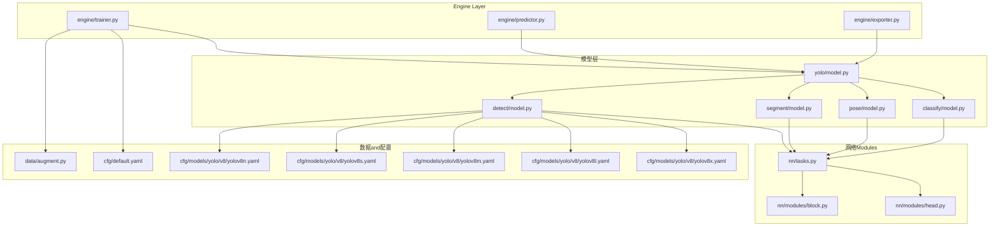
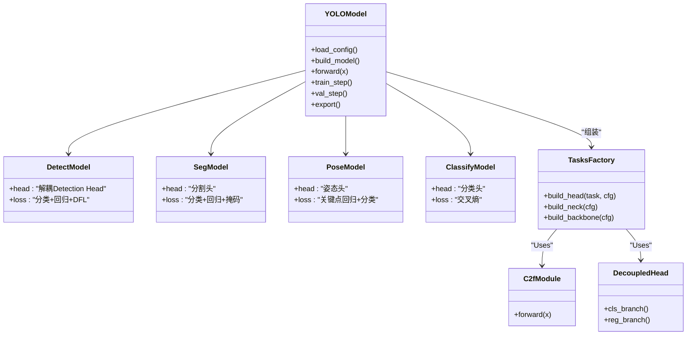
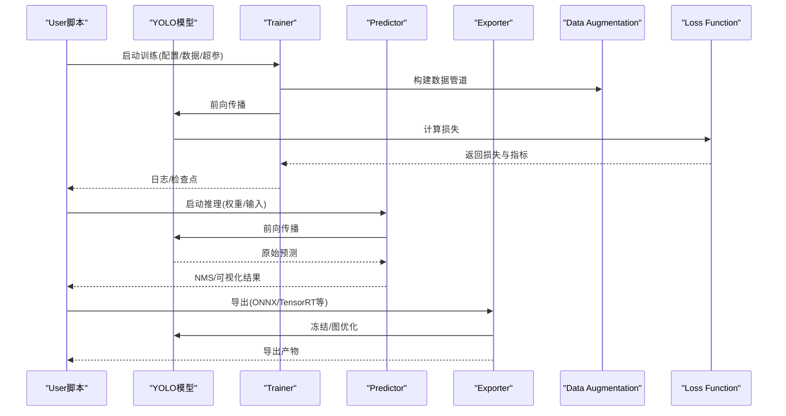
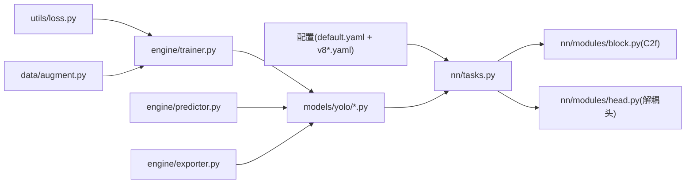

# YOLOv8模型

<cite>
**Files Referenced in This Document**
- [ultralytics/cfg/models/yolo/v8/README.md](file://ultralytics/cfg/models/yolo/v8/README.md)
- [ultralytics/cfg/models/yolo/v8/yolov8.yaml](file://ultralytics/cfg/models/yolo/v8/yolov8.yaml)
- [ultralytics/cfg/models/yolo/v8/yolov8n.yaml](file://ultralytics/cfg/models/yolo/v8/yolov8n.yaml)
- [ultralytics/cfg/models/yolo/v8/yolov8s.yaml](file://ultralytics/cfg/models/yolo/v8/yolov8s.yaml)
- [ultralytics/cfg/models/yolo/v8/yolov8m.yaml](file://ultralytics/cfg/models/yolo/v8/yolov8m.yaml)
- [ultralytics/cfg/models/yolo/v8/yolov8l.yaml](file://ultralytics/cfg/models/yolo/v8/yolov8l.yaml)
- [ultralytics/cfg/models/yolo/v8/yolov8x.yaml](file://ultralytics/cfg/models/yolo/v8/yolov8x.yaml)
- [ultralytics/models/yolo/model.py](file://ultralytics/models/yolo/model.py)
- [ultralytics/models/yolo/detect/model.py](file://ultralytics/models/yolo/detect/model.py)
- [ultralytics/models/yolo/segment/model.py](file://ultralytics/models/yolo/segment/model.py)
- [ultralytics/models/yolo/pose/model.py](file://ultralytics/models/yolo/pose/model.py)
- [ultralytics/models/yolo/classify/model.py](file://ultralytics/models/yolo/classify/model.py)
- [ultralytics/nn/tasks.py](file://ultralytics/nn/tasks.py)
- [ultralytics/nn/modules/block.py](file://ultralytics/nn/modules/block.py)
- [ultralytics/nn/modules/head.py](file://ultralytics/nn/modules/head.py)
- [ultralytics/utils/loss.py](file://ultralytics/utils/loss.py)
- [ultralytics/engine/trainer.py](file://ultralytics/engine/trainer.py)
- [ultralytics/engine/predictor.py](file://ultralytics/engine/predictor.py)
- [ultralytics/engine/exporter.py](file://ultralytics/engine/exporter.py)
- [ultralytics/data/augment.py](file://ultralytics/data/augment.py)
- [ultralytics/cfg/default.yaml](file://ultralytics/cfg/default.yaml)
- [examples/YOLOv8-ONNXRuntime-Python/main.py](file://examples/YOLOv8-ONNXRuntime-Python/main.py)
- [examples/tutorial.ipynb](file://examples/tutorial.ipynb)
</cite>

## Table of Contents
1. [Introduction](#Introduction)
2. [Project Structure](#Project Structure)
3. [Core Components](#Core Components)
4. [Architecture Overview](#Architecture Overview)
5. [Detailed Component Analysis](#Detailed Component Analysis)
6. [Dependency Analysis](#Dependency Analysis)
7. [性能and规模特性](#性能and规模特性)
8. [配置语法说明](#配置语法说明)
9. [Python APIUses指南](#python-apiUses指南)
10. [Loss FunctionandTraining策略](#Loss FunctionandTraining策略)
11. [故障排查](#故障排查)
12. [Conclusion](#Conclusion)

## Introduction
本文件targeting希望深入理解并高效UsesYOLOv8的EngineersandResearchers，系统阐述其架构设计、TasksSupporting、配置体系、TrainingandInference流程、ExportcapabilitiesCentered onand最佳实践。重点覆盖：
- C2fModules、解耦头、Anchor-FreeDetection Headetc.关键改进
- n/s/m/l/x多尺度模型的参数and性能权衡
- Object Detection、Instance Segmentation、Pose Estimation、分类and other tasks统一建模方式
- 配置文件语法and超参体系
- Python API的Training、InferenceandExport路径
- Loss Function设计andTrainingOptimization策略

## Project Structure
仓库采用“Modules化+Tasks化”的组织方式：
- 模型定义位于 ultralytics/models/yolo 下，按Tasks（detect/segment/pose/classify）拆分
- 通用网络Modules集中于 ultralytics/nn/modules，包含C2f、Headetc.基础构件
- Tasks级Tasks工厂and动态构建逻辑while ultralytics/nn/tasks.py
- Training/Validation/Prediction/Export引擎while ultralytics/engine 下
- Data Augmentationand数据集加载while ultralytics/data 下
- 默认配置andTasks级配置while ultralytics/cfg 下
- Examples and Tutorialswhile examples 下

Figure Source
- [ultralytics/models/yolo/model.py](file://ultralytics/models/yolo/model.py)
- [ultralytics/models/yolo/detect/model.py](file://ultralytics/models/yolo/detect/model.py)
- [ultralytics/models/yolo/segment/model.py](file://ultralytics/models/yolo/segment/model.py)
- [ultralytics/models/yolo/pose/model.py](file://ultralytics/models/yolo/pose/model.py)
- [ultralytics/models/yolo/classify/model.py](file://ultralytics/models/yolo/classify/model.py)
- [ultralytics/nn/tasks.py](file://ultralytics/nn/tasks.py)
- [ultralytics/nn/modules/block.py](file://ultralytics/nn/modules/block.py)
- [ultralytics/nn/modules/head.py](file://ultralytics/nn/modules/head.py)
- [ultralytics/engine/trainer.py](file://ultralytics/engine/trainer.py)
- [ultralytics/engine/predictor.py](file://ultralytics/engine/predictor.py)
- [ultralytics/engine/exporter.py](file://ultralytics/engine/exporter.py)
- [ultralytics/data/augment.py](file://ultralytics/data/augment.py)
- [ultralytics/cfg/default.yaml](file://ultralytics/cfg/default.yaml)
- [ultralytics/cfg/models/yolo/v8/yolov8n.yaml](file://ultralytics/cfg/models/yolo/v8/yolov8n.yaml)
- [ultralytics/cfg/models/yolo/v8/yolov8s.yaml](file://ultralytics/cfg/models/yolo/v8/yolov8s.yaml)
- [ultralytics/cfg/models/yolo/v8/yolov8m.yaml](file://ultralytics/cfg/models/yolo/v8/yolov8m.yaml)
- [ultralytics/cfg/models/yolo/v8/yolov8l.yaml](file://ultralytics/cfg/models/yolo/v8/yolov8l.yaml)
- [ultralytics/cfg/models/yolo/v8/yolov8x.yaml](file://ultralytics/cfg/models/yolo/v8/yolov8x.yaml)

Section Source
- [ultralytics/models/yolo/model.py](file://ultralytics/models/yolo/model.py)
- [ultralytics/nn/tasks.py](file://ultralytics/nn/tasks.py)
- [ultralytics/nn/modules/block.py](file://ultralytics/nn/modules/block.py)
- [ultralytics/nn/modules/head.py](file://ultralytics/nn/modules/head.py)
- [ultralytics/engine/trainer.py](file://ultralytics/engine/trainer.py)
- [ultralytics/engine/predictor.py](file://ultralytics/engine/predictor.py)
- [ultralytics/engine/exporter.py](file://ultralytics/engine/exporter.py)
- [ultralytics/data/augment.py](file://ultralytics/data/augment.py)
- [ultralytics/cfg/default.yaml](file://ultralytics/cfg/default.yaml)
- [ultralytics/cfg/models/yolo/v8/yolov8n.yaml](file://ultralytics/cfg/models/yolo/v8/yolov8n.yaml)
- [ultralytics/cfg/models/yolo/v8/yolov8s.yaml](file://ultralytics/cfg/models/yolo/v8/yolov8s.yaml)
- [ultralytics/cfg/models/yolo/v8/yolov8m.yaml](file://ultralytics/cfg/models/yolo/v8/yolov8m.yaml)
- [ultralytics/cfg/models/yolo/v8/yolov8l.yaml](file://ultralytics/cfg/models/yolo/v8/yolov8l.yaml)
- [ultralytics/cfg/models/yolo/v8/yolov8x.yaml](file://ultralytics/cfg/models/yolo/v8/yolov8x.yaml)

## Core Components
- C2fModules：引入更丰富的特征融合路径and残差连接，提升小目标and密集场景下的表征capabilities，同时保持计算效率。
- 解耦头：将分类and回归分支分离，减少Tasks间干扰，提高定位精度and类别判别力。
- Anchor-FreeDetection Head：直接Prediction对象中心and宽高偏移，简化Post-Processing，提升端to端Optimization稳定性。
- Tasks统一建模：ViaTasks工厂动态装配Backbone、NeckandHead，implementing检测、分割、姿态、分类的Unified Interface。

Section Source
- [ultralytics/nn/modules/block.py](file://ultralytics/nn/modules/block.py)
- [ultralytics/nn/modules/head.py](file://ultralytics/nn/modules/head.py)
- [ultralytics/nn/tasks.py](file://ultralytics/nn/tasks.py)

## Architecture Overview
YOLOv8采用“Backbone + Neck + Head”的三阶段结构，CombiningC2fand解耦头，形成高吞吐、高精度的单阶段检测范式。不同Tasks共享同一套构建机制，仅替换HeadandLoss Function。

Figure Source
- [ultralytics/models/yolo/model.py](file://ultralytics/models/yolo/model.py)
- [ultralytics/models/yolo/detect/model.py](file://ultralytics/models/yolo/detect/model.py)
- [ultralytics/models/yolo/segment/model.py](file://ultralytics/models/yolo/segment/model.py)
- [ultralytics/models/yolo/pose/model.py](file://ultralytics/models/yolo/pose/model.py)
- [ultralytics/models/yolo/classify/model.py](file://ultralytics/models/yolo/classify/model.py)
- [ultralytics/nn/tasks.py](file://ultralytics/nn/tasks.py)
- [ultralytics/nn/modules/block.py](file://ultralytics/nn/modules/block.py)
- [ultralytics/nn/modules/head.py](file://ultralytics/nn/modules/head.py)

## Detailed Component Analysis

### C2fModules
- 设计要点：
  - 多层并行卷积and跨层连接，增强特征多样性
  - 残差式聚合，缓解Gradient消失，利于深层堆叠
  - while颈部中广泛Uses，提升多尺度融合效果
- 复杂度and收益：
  - 相比传统bottlenecks块，增加少量FLOPs，显著改善小目标召回
- Applicable Scenarios：
  - 密集小目标、遮挡严重、复杂背景的检测and分割

Section Source
- [ultralytics/nn/modules/block.py](file://ultralytics/nn/modules/block.py)

### 解耦头andAnchor-FreeDetection Head
- 解耦头：
  - 分类分支专注类别判别，回归分支专注边界框或掩码/关键点Prediction
  - 降低Tasks耦合，提升收敛稳定性
- Anchor-Free：
  - Centered on对象点Prediction，避免锚框先验带来的搜索空间冗余
  - Combined with动态正样本分配策略，提升Training效率and精度
- 输出格式：
  - 检测：类别概率and边界框偏移
  - 分割：类别+掩码系数
  - 姿态：类别+关键点坐标
  - 分类：类别概率

Section Source
- [ultralytics/nn/modules/head.py](file://ultralytics/nn/modules/head.py)
- [ultralytics/nn/tasks.py](file://ultralytics/nn/tasks.py)

### Tasks工厂and动态装配
- 根据Tasks类型and配置文件动态构建Backbone、NeckandHead
- 统一前向接口，便于Training/Validation/Export复用
- Supporting扩展新Tasks时仅需注册HeadandLoss

Section Source
- [ultralytics/nn/tasks.py](file://ultralytics/nn/tasks.py)

### Training/Inference/Export流水线

Figure Source
- [ultralytics/engine/trainer.py](file://ultralytics/engine/trainer.py)
- [ultralytics/engine/predictor.py](file://ultralytics/engine/predictor.py)
- [ultralytics/engine/exporter.py](file://ultralytics/engine/exporter.py)
- [ultralytics/data/augment.py](file://ultralytics/data/augment.py)
- [ultralytics/utils/loss.py](file://ultralytics/utils/loss.py)
- [ultralytics/models/yolo/model.py](file://ultralytics/models/yolo/model.py)

## Dependency Analysis
- 模型层依赖Tasks工厂进行动态构建
- Tasks工厂依赖基础Modules（C2f、Head）
- Engine Layer依赖模型andLoss Function
- 数据层forTrainingprovides增强and批处理
- 配置层provides默认值andTasks级覆盖

Figure Source
- [ultralytics/cfg/default.yaml](file://ultralytics/cfg/default.yaml)
- [ultralytics/cfg/models/yolo/v8/yolov8n.yaml](file://ultralytics/cfg/models/yolo/v8/yolov8n.yaml)
- [ultralytics/nn/tasks.py](file://ultralytics/nn/tasks.py)
- [ultralytics/nn/modules/block.py](file://ultralytics/nn/modules/block.py)
- [ultralytics/nn/modules/head.py](file://ultralytics/nn/modules/head.py)
- [ultralytics/models/yolo/model.py](file://ultralytics/models/yolo/model.py)
- [ultralytics/engine/trainer.py](file://ultralytics/engine/trainer.py)
- [ultralytics/engine/predictor.py](file://ultralytics/engine/predictor.py)
- [ultralytics/engine/exporter.py](file://ultralytics/engine/exporter.py)
- [ultralytics/utils/loss.py](file://ultralytics/utils/loss.py)
- [ultralytics/data/augment.py](file://ultralytics/data/augment.py)

## 性能and规模特性
- 模型规模：n/s/m/l/x，随深度and宽度递增，精度提升但Inference延迟and显存占用增加
- 典型特点：
  - n/s：轻量快速，适合边缘设备and实时应用
  - m/l：平衡精度and速度，适合服务器端部署
  - x：追求极致精度，适合离线高精度场景
- 选择建议：
  - 资源受限优先n/s；生产环境常用m/l；研究对比用x

Section Source
- [ultralytics/cfg/models/yolo/v8/README.md](file://ultralytics/cfg/models/yolo/v8/README.md)
- [ultralytics/cfg/models/yolo/v8/yolov8n.yaml](file://ultralytics/cfg/models/yolo/v8/yolov8n.yaml)
- [ultralytics/cfg/models/yolo/v8/yolov8s.yaml](file://ultralytics/cfg/models/yolo/v8/yolov8s.yaml)
- [ultralytics/cfg/models/yolo/v8/yolov8m.yaml](file://ultralytics/cfg/models/yolo/v8/yolov8m.yaml)
- [ultralytics/cfg/models/yolo/v8/yolov8l.yaml](file://ultralytics/cfg/models/yolo/v8/yolov8l.yaml)
- [ultralytics/cfg/models/yolo/v8/yolov8x.yaml](file://ultralytics/cfg/models/yolo/v8/yolov8x.yaml)

## 配置语法说明
- 默认配置：
  - Learning Rate、Optimizer、Batch Size、图像尺寸、数据路径、增强策略etc.
- Tasks级配置：
  - 各规模模型（n/s/m/l/x）的网络深度、宽度、通道数、层数etc.
- 关键字段（Examples性说明，具体Centered on实际配置for准）：
  - model：指定模型配置文件路径
  - data：数据集配置文件路径
  - epochs：Training轮数
  - batch：Batch Size
  - imgsz：输入图像尺寸
  - lr0：初始Learning Rate
  - optimizer：Optimizer名称
  - augment：Data Augmentation开关and强度
  - task：Tasks类型（detect/segment/pose/classify）
  - weights：Pre-trained Weights路径
  - device：运行设备（cpu/cuda）
- 覆盖策略：
  - 命令行参数可覆盖default.yamlandTasks级配置中的同名字段

Section Source
- [ultralytics/cfg/default.yaml](file://ultralytics/cfg/default.yaml)
- [ultralytics/cfg/models/yolo/v8/yolov8n.yaml](file://ultralytics/cfg/models/yolo/v8/yolov8n.yaml)
- [ultralytics/cfg/models/yolo/v8/yolov8s.yaml](file://ultralytics/cfg/models/yolo/v8/yolov8s.yaml)
- [ultralytics/cfg/models/yolo/v8/yolov8m.yaml](file://ultralytics/cfg/models/yolo/v8/yolov8m.yaml)
- [ultralytics/cfg/models/yolo/v8/yolov8l.yaml](file://ultralytics/cfg/models/yolo/v8/yolov8l.yaml)
- [ultralytics/cfg/models/yolo/v8/yolov8x.yaml](file://ultralytics/cfg/models/yolo/v8/yolov8x.yaml)

## Python APIUses指南
- Training
  - Via模型类加载Tasks配置and权重，CallsTraining方法传入数据路径and超参
  - Refer to路径：[ultralytics/models/yolo/model.py](file://ultralytics/models/yolo/model.py)、[ultralytics/engine/trainer.py](file://ultralytics/engine/trainer.py)
- Inference
  - 加载权重后对图像或视频流进行Prediction，获取检测结果并进行Visualization
  - Refer to路径：[ultralytics/engine/predictor.py](file://ultralytics/engine/predictor.py)、[examples/YOLOv8-ONNXRuntime-Python/main.py](file://examples/YOLOv8-ONNXRuntime-Python/main.py)
- Export
  - SupportingExporting toONNX、TensorRT、OpenVINOetc.格式，便于部署
  - Refer to路径：[ultralytics/engine/exporter.py](file://ultralytics/engine/exporter.py)
- 教程andExamples
  - 交互式教程and常见用例可whilenotebook中查看
  - Refer to路径：[examples/tutorial.ipynb](file://examples/tutorial.ipynb)

Section Source
- [ultralytics/models/yolo/model.py](file://ultralytics/models/yolo/model.py)
- [ultralytics/engine/trainer.py](file://ultralytics/engine/trainer.py)
- [ultralytics/engine/predictor.py](file://ultralytics/engine/predictor.py)
- [ultralytics/engine/exporter.py](file://ultralytics/engine/exporter.py)
- [examples/YOLOv8-ONNXRuntime-Python/main.py](file://examples/YOLOv8-ONNXRuntime-Python/main.py)
- [examples/tutorial.ipynb](file://examples/tutorial.ipynb)

## Loss FunctionandTraining策略
- 损失组成：
  - 分类损失：类别判别误差
  - 回归损失：边界框/掩码/关键点定位误差
  - DFL（Distribution Focal Loss）：细化边界框分布，提升定位精度
- 正负样本分配：
  - 基于IoUand类别置信度的动态匹配策略，自适应选择正样本
- Training策略：
  - Learning Rate调度（余弦退火）、EMA平滑、Mixture精度Training
  - Data Augmentation（Mosaic、MixUp、随机裁剪、色彩抖动etc.）
- EvaluationMetrics：
  - mAP@0.5:0.95、Precision、Recall、F1etc.

Section Source
- [ultralytics/utils/loss.py](file://ultralytics/utils/loss.py)
- [ultralytics/data/augment.py](file://ultralytics/data/augment.py)
- [ultralytics/engine/trainer.py](file://ultralytics/engine/trainer.py)

## 故障排查
- 常见问题
  - 显存不足：减小batch或imgsz，启用Mixture精度
  - Training不收敛：调整lr0、optimizer、数据质量and标注一致性
  - Export Failure：检查后端版本and算子Supporting，必要时降级Export格式
- 调试建议
  - 打印中间张量形状and数值范围，定位NaN/Inf
  - 逐步关闭增强and正则项，Validation数据and标签正确性
  - Uses最小复现脚本and固定随机种子保证可重复性

Section Source
- [ultralytics/engine/trainer.py](file://ultralytics/engine/trainer.py)
- [ultralytics/engine/exporter.py](file://ultralytics/engine/exporter.py)
- [ultralytics/utils/loss.py](file://ultralytics/utils/loss.py)

## Conclusion
YOLOv8ViaC2f、解耦头andAnchor-FreeDetection Headetc.创新，While maintaining高效率显著提升精度and鲁棒性。统一的模型构建andTasks接口使得检测、分割、姿态、分类etc.多Tasks得Centered onwhile同一框架内高效implementing。借助完善的配置体系andPython API，User可Centered on快速完成从Trainingto部署的全流程。推荐根据业务需求选择合适的模型规模，并CombiningData Augmentationand损失策略进行调优，Centered on获得最佳性能and成本平衡。