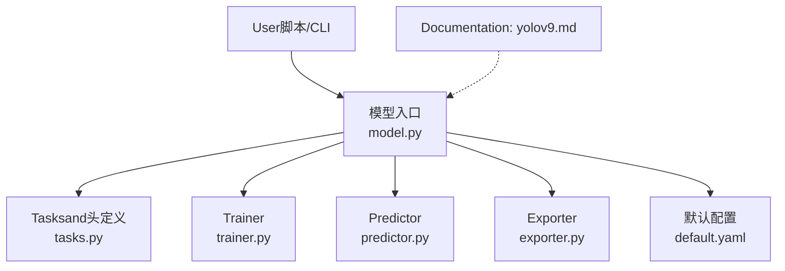
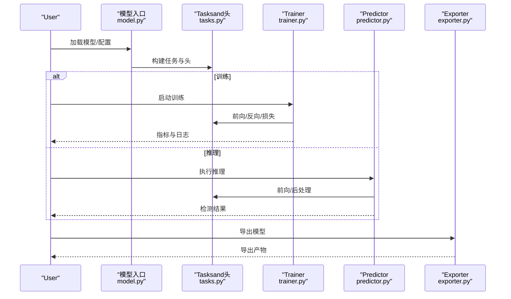
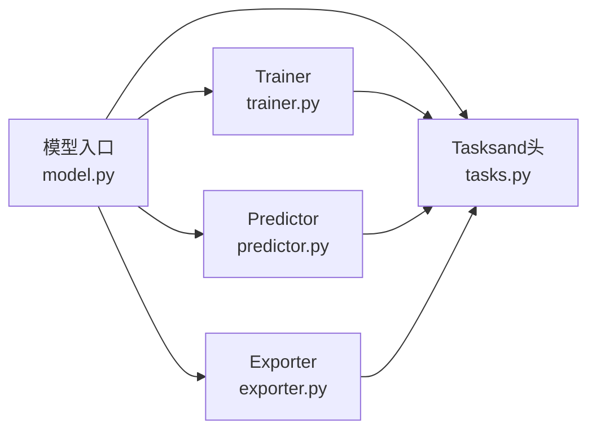

# YOLOv9模型

<cite>
**Files Referenced in This Document**
- [yolov9.md](file://docs/en/models/yolov9.md)
- [yolo.py](file://ultralytics/models/yolo/model.py)
- [train.py](file://ultralytics/engine/trainer.py)
- [predict.py](file://ultralytics/engine/predictor.py)
- [exporter.py](file://ultralytics/engine/exporter.py)
- [tasks.py](file://ultralytics/nn/tasks.py)
- [default.yaml](file://ultralytics/cfg/default.yaml)
- [yolo26.md](file://docs/en/models/yolo26.md)
</cite>

## Table of Contents
1. [Introduction](#Introduction)
2. [Project Structure](#Project Structure)
3. [Core Components](#Core Components)
4. [Architecture Overview](#Architecture Overview)
5. [Detailed Component Analysis](#Detailed Component Analysis)
6. [Dependency Analysis](#Dependency Analysis)
7. [性能考量](#性能考量)
8. [Troubleshooting Guide](#Troubleshooting Guide)
9. [Conclusion](#Conclusion)
10. [Appendix](#Appendix)

## Introduction
本文件targeting希望系统掌握YOLOv9的EngineersandResearchers，聚焦Centered on下目标：
- 深入解读YOLOv9的核心创新点（可编程Gradient信息PGI、广义高效层聚合网络GELANetc.）and其while检测Tasks中的作用。
- 梳理不同规模变体（s/m/g/e）的架构差异andApplicable Scenarios。
- 阐述“While maintaining精度降低计算复杂度”的设计思路。
- provides完整的模型配置文件说明and参数调优指南。
- 给出Training、InferenceandModel Export的具体implementing路径and最佳实践。
- 对比YOLOv8的性能提升and效率改进方向。

## Project Structure
本项目采用Modules化组织方式，YOLO Series Models统一由高层接口加载and调度，配置andDocumentation分离，便于扩展and维护。andYOLOv9相关的核心位置such as下：
- 模型DocumentationandUses说明：docs/en/models/yolov9.md
- 高层模型Entry and Registration：ultralytics/models/yolo/model.py
- Training流程：ultralytics/engine/trainer.py
- Inference流程：ultralytics/engine/predictor.py
- Export流程：ultralytics/engine/exporter.py
- Tasksand头定义：ultralytics/nn/tasks.py
- 默认配置项：ultralytics/cfg/default.yaml
- 同系列Refer to（such asYOLO26）：docs/en/models/yolo26.md

Figure Source
- [yolo.py](file://ultralytics/models/yolo/model.py)
- [tasks.py](file://ultralytics/nn/tasks.py)
- [train.py](file://ultralytics/engine/trainer.py)
- [predict.py](file://ultralytics/engine/predictor.py)
- [exporter.py](file://ultralytics/engine/exporter.py)
- [default.yaml](file://ultralytics/cfg/default.yaml)
- [yolov9.md](file://docs/en/models/yolov9.md)

Section Source
- [yolov9.md](file://docs/en/models/yolov9.md)
- [yolo.py](file://ultralytics/models/yolo/model.py)
- [train.py](file://ultralytics/engine/trainer.py)
- [predict.py](file://ultralytics/engine/predictor.py)
- [exporter.py](file://ultralytics/engine/exporter.py)
- [tasks.py](file://ultralytics/nn/tasks.py)
- [default.yaml](file://ultralytics/cfg/default.yaml)

## Core Components
- 模型Entry and Registration
  - Via高层API统一加载YOLOv9系列权重and配置，Internally selecting the corresponding head and loss based on task type函数。
- Tasksand头
  - 将通用骨干and颈部andDetection Head解耦，Supporting多Tasks复用and灵活组合。
- Trainer
  - EncapsulatesData Loading、Optimizer、Learning Rate调度、EMA、LoggingandValidation循环。
- Predictor
  - Encapsulates预处理、Forward Inference、Post-Processing（NMSetc.）、Visualizationand结果输出。
- Exporter
  - Supporting多种后端格式Export，包含Export前检查andcapabilities矩阵校验。
- 默认配置
  - provides常用超参andIOU/NMS阈值、类别数、输入尺寸etc.默认值。

Section Source
- [yolo.py](file://ultralytics/models/yolo/model.py)
- [tasks.py](file://ultralytics/nn/tasks.py)
- [train.py](file://ultralytics/engine/trainer.py)
- [predict.py](file://ultralytics/engine/predictor.py)
- [exporter.py](file://ultralytics/engine/exporter.py)
- [default.yaml](file://ultralytics/cfg/default.yaml)

## Architecture Overview
YOLOv9while整体架构上延续“骨干+颈部+Detection Head”的经典范式，并Via可插拔Modulesand配置化设计implementing不同规模的变体。下图展示了从UserCallsto各子系统的交互关系。

Figure Source
- [yolo.py](file://ultralytics/models/yolo/model.py)
- [tasks.py](file://ultralytics/nn/tasks.py)
- [train.py](file://ultralytics/engine/trainer.py)
- [predict.py](file://ultralytics/engine/predictor.py)
- [exporter.py](file://ultralytics/engine/exporter.py)

## Detailed Component Analysis

### 可编程Gradient信息（PGI）
- 设计动机
  - while深层网络中缓解Gradient衰减and信息丢失，使浅层特征能更稳定地参andOptimization。
- 作用机制
  - Via引入可学习的Gradient路径或辅助信号，增强关键特征的传播and保留，从而while不显著增加Inference成本的前提下提升收敛稳定性and精度。
- 工程落地
  - 通常Centered on轻量分支或旁路形式接入主干/颈部，Training时参andBackpropagation，Inference时可被剪枝或融合Centered on降低开销。
- Evaluation建议
  - 关注小目标召回、低光照/遮挡场景下的鲁棒性；Combining消融实验Validation对mAPandFLOPs的影响。

Section Source
- [yolov9.md](file://docs/en/models/yolov9.md)

### 广义高效层聚合网络（GELAN）
- 设计动机
  - While maintaining强表征capabilities，减少冗余计算and内存占用，提高吞吐and能效。
- 结构要点
  - 采用分层聚合策略，将多尺度特征进行选择性融合；Combined with轻量化卷积and通道重排，平衡精度and速度。
- 变体差异
  - s/m/g/eetc.不同规模Via堆叠深度、通道宽度and聚合粒度控制，形成从移动端to服务器的全谱系覆盖。
- 部署建议
  - 优先选择g/e用于云端高精度需求；s/m用于边缘设备and实时视频流。

Section Source
- [yolov9.md](file://docs/en/models/yolov9.md)

### 变体对比andApplicable Scenarios（s/m/g/e）
- 规模and复杂度
  - s：最小体积and最低延迟，适合端侧and低功耗设备。
  - m：精度and速度的折中，适合多数工业现场and移动应用。
  - g：更高精度，适合服务器端and离线批处理。
  - e：最大容量，追求极致精度，算力充裕场景。
- 选择建议
  - 依据目标对象尺度分布、帧率要求、硬件预算and功耗约束综合权衡。
- Migrationand微调
  - 从小模型开始快速Validation，再逐步放大至更大变体；注意输入分辨率andNMS阈值的联动调整。

Section Source
- [yolov9.md](file://docs/en/models/yolov9.md)

### 配置and参数调优指南
- 关键配置项
  - 类别数、输入尺寸、锚框/Anchor-Free设置、NMS阈值、Confidence Threshold、Data Augmentation强度、Learning Rateand权重衰减etc.。
- 推荐流程
  - 先固定骨干and颈部，调优Detection Headand损失权重；再逐步放宽Data Augmentationand正则化；最后针对部署格式做ExportOptimization。
- 常见陷阱
  - 过大的输入尺寸导致显存溢出；过高的Learning Rate造成不稳定；NMS阈值不当影响小目标召回。

Section Source
- [default.yaml](file://ultralytics/cfg/default.yaml)
- [yolov9.md](file://docs/en/models/yolov9.md)

### Training流程
- 主要步骤
  - Data Preparationand加载、模型初始化、Optimizerand调度器配置、Training循环、Validationand保存、Logging。
- 关键技巧
  - UsesEMA平滑权重、Mixture精度加速、Distributed Training、早停andLearning Rate预热。
- 监控Metrics
  - Training/Validation损失、mAP、PR曲线、混淆矩阵and错误样本分析。

Section Source
- [train.py](file://ultralytics/engine/trainer.py)
- [yolo.py](file://ultralytics/models/yolo/model.py)

### Inference流程
- 主要步骤
  - Image Preprocessing、Forward Inference、Post-Processing（NMS、置信度过滤）、结果VisualizationandExport。
- 性能Optimization
  - Batch Inference、动态形状裁剪、算子融合、后端特定Optimization（such asTensorRT/OpenVINO）。
- 质量保障
  - 一致性校验、边界框坐标归一化、类别映射and标签对齐。

Section Source
- [predict.py](file://ultralytics/engine/predictor.py)
- [tasks.py](file://ultralytics/nn/tasks.py)

### Model Export
- Supporting格式
  - ONNX、TensorRT、OpenVINO、CoreML、TFLiteetc.（Centered on实际capabilities矩阵for准）。
- Export前检查
  - 图结构合法性、算子兼容性、动态维度and常量折叠。
- 部署建议
  - 针对目标平台选择最优后端；必要时进行量化and稀疏化。

Section Source
- [exporter.py](file://ultralytics/engine/exporter.py)
- [yolo.py](file://ultralytics/models/yolo/model.py)

### andYOLOv8的Key Comparison Points
- 精度and效率
  - while同etc.算力下，YOLOv9ViaPGIandGELAN提升特征传播and聚合效率，通常带来更高的mAPand更低的延迟。
- 工程体验
  - 统一的APIand配置体系，简化从v8tov9的Migrationand对比实验。
- Refer toDocumentation
  - 可对照官方Documentation中的基准and案例，Combining自有数据集进行复现实验。

Section Source
- [yolo.py](file://ultralytics/models/yolo/model.py)
- [yolov9.md](file://docs/en/models/yolov9.md)
- [yolo26.md](file://docs/en/models/yolo26.md)

## Dependency Analysis
- Modules耦合
  - 模型入口负责解析配置并实例化Tasksand头；TrainerandPredictor分别消费TasksModules完成各自流程；Exporter独立于运行时，专注格式转换。
- External Dependencies
  - PyTorch生态、第三方Inference后端（ONNXRuntime/TensorRT/OpenVINOetc.）、Visualization工具andLogging框架。
- 潜while风险
  - 版本不兼容导致的算子缺失；Export链路的平台差异；分布式环境下的通信and同步问题。

Figure Source
- [yolo.py](file://ultralytics/models/yolo/model.py)
- [tasks.py](file://ultralytics/nn/tasks.py)
- [train.py](file://ultralytics/engine/trainer.py)
- [predict.py](file://ultralytics/engine/predictor.py)
- [exporter.py](file://ultralytics/engine/exporter.py)

Section Source
- [yolo.py](file://ultralytics/models/yolo/model.py)
- [tasks.py](file://ultralytics/nn/tasks.py)
- [train.py](file://ultralytics/engine/trainer.py)
- [predict.py](file://ultralytics/engine/predictor.py)
- [exporter.py](file://ultralytics/engine/exporter.py)

## 性能考量
- 数据流水线
  - Set appropriatelyBatch Size、线程数and缓存策略，避免I/Obottlenecks。
- 计算图Optimization
  - 启用Mixture精度、算子融合and静态形状编译，减少内存峰值and重复计算。
- 部署后端
  - 根据硬件特性选择最优后端，并进行端to端延迟and吞吐评测。
- 监控and回归
  - 建立基线Metricsand自动化回归测试，确保升级and变更不影响线上性能。

## Troubleshooting Guide
- 常见问题
  - 显存不足：减小输入尺寸或Batch Size；关闭不必要的调试输出。
  - Export Failure：检查算子Supportingand动态维度；UsesExport前检查工具定位问题。
  - 精度下降：核对Data AugmentationandNMS阈值；确认权重and配置一致。
- 诊断手段
  - 分阶段Validation（数据、模型、Training、Inference、Export）；打印中间张量形状and数值范围；对比不同后端输出一致性。

Section Source
- [exporter.py](file://ultralytics/engine/exporter.py)
- [predict.py](file://ultralytics/engine/predictor.py)
- [train.py](file://ultralytics/engine/trainer.py)

## Conclusion
YOLOv9ViaPGIandGELAN两项关键技术，while特征传播and聚合层面implementing了“更强、更快、更稳”的目标。其Modules化and配置化的设计使得从移动端to云端的广泛部署成for可能。建议while工程中Centered ons/mfor起点快速迭代，逐步过渡tog/eCentered on满足更高精度需求，并Combining目标平台选择合适的Export BackendsandOptimization策略。

## Appendix
- 术语表
  - PGI：可编程Gradient信息
  - GELAN：广义高效层聚合网络
  - NMS：Non-Maximum Suppression
  - EMA：指数移动平均
- Refer to链接
  - 模型Documentation：docs/en/models/yolov9.md
  - 同系列Refer to：docs/en/models/yolo26.md