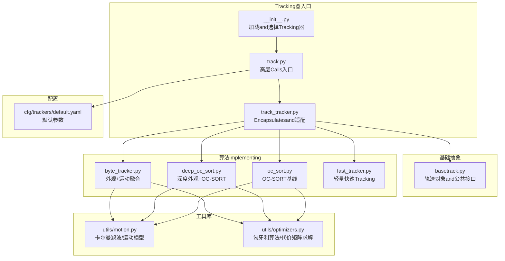
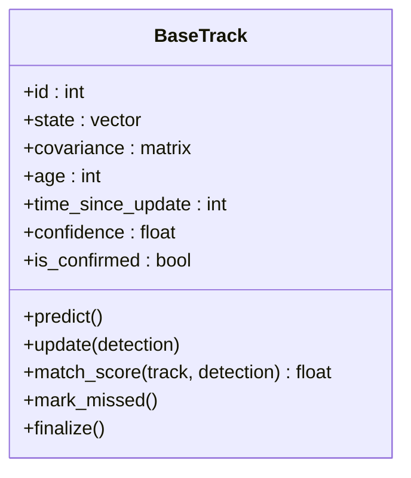
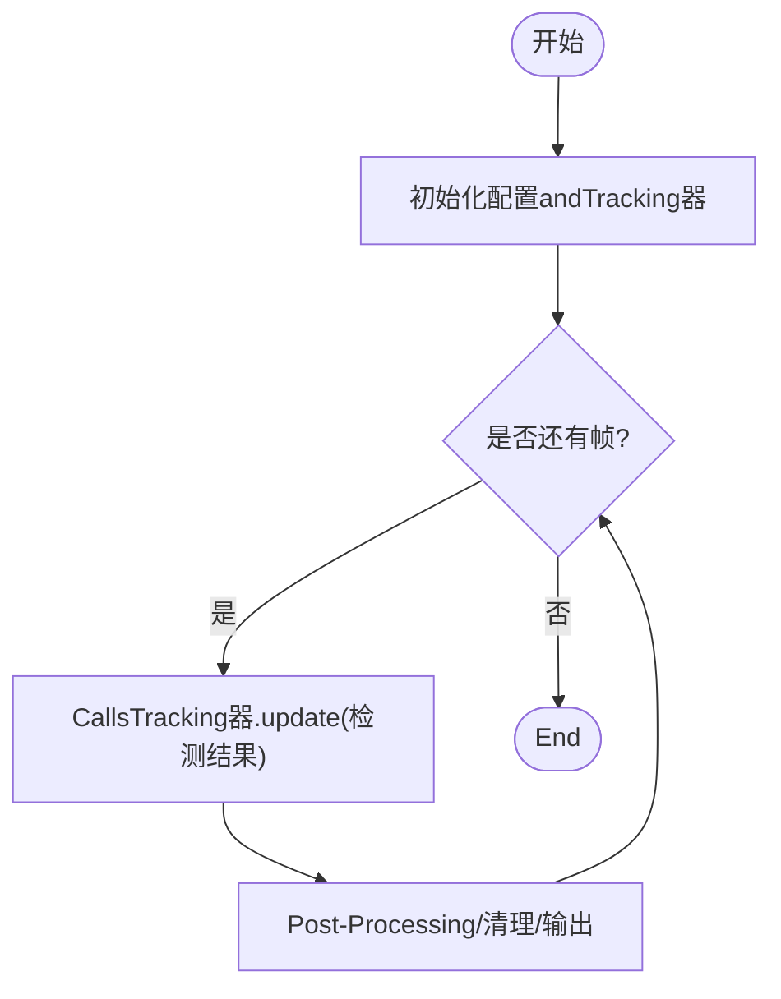
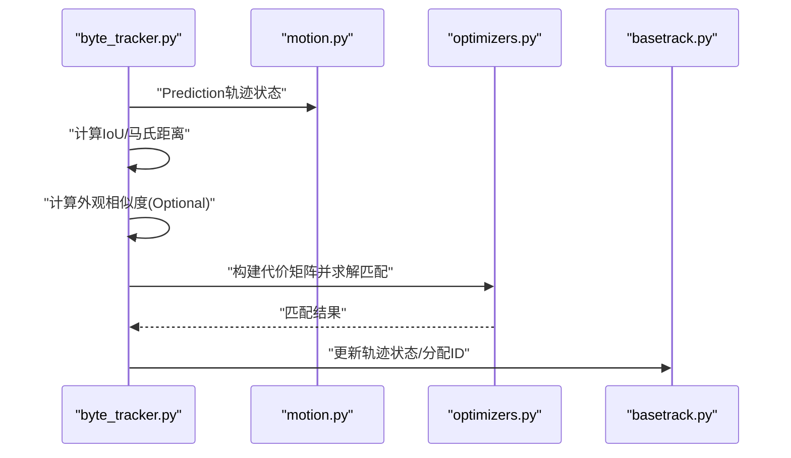
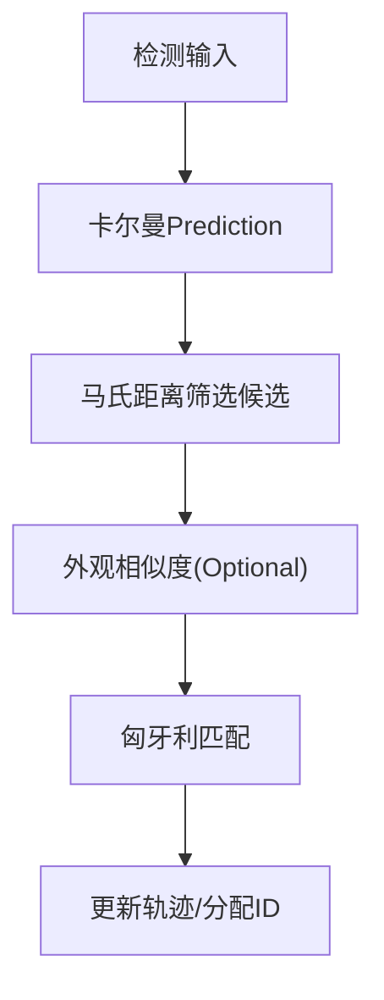
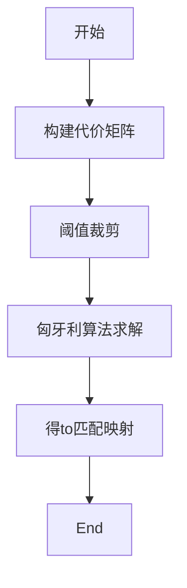
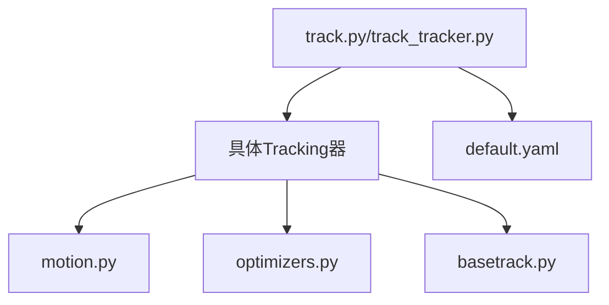

# ID分配and关联

<cite>
**Files Referenced in This Document**
- [ultralytics/trackers/__init__.py](file://ultralytics/trackers/__init__.py)
- [ultralytics/trackers/basetrack.py](file://ultralytics/trackers/basetrack.py)
- [ultralytics/trackers/byte_tracker.py](file://ultralytics/trackers/byte_tracker.py)
- [ultralytics/trackers/deep_oc_sort.py](file://ultralytics/trackers/deep_oc_sort.py)
- [ultralytics/trackers/oc_sort.py](file://ultralytics/trackers/oc_sort.py)
- [ultralytics/trackers/fast_tracker.py](file://ultralytics/trackers/fast_tracker.py)
- [ultralytics/trackers/track.py](file://ultralytics/trackers/track.py)
- [ultralytics/trackers/track_tracker.py](file://ultralytics/trackers/track_tracker.py)
- [ultralytics/trackers/utils/motion.py](file://ultralytics/trackers/utils/motion.py)
- [ultralytics/trackers/utils/optimizers.py](file://ultralytics/trackers/utils/optimizers.py)
- [ultralytics/cfg/trackers/default.yaml](file://ultralytics/cfg/trackers/default.yaml)
</cite>

## Table of Contents
1. [Introduction](#Introduction)
2. [Project Structure](#Project Structure)
3. [Core Components](#Core Components)
4. [Architecture Overview](#Architecture Overview)
5. [Detailed Component Analysis](#Detailed Component Analysis)
6. [Dependency Analysis](#Dependency Analysis)
7. [Performance Considerations](#Performance Considerations)
8. [Troubleshooting Guide](#Troubleshooting Guide)
9. [Conclusion](#Conclusion)
10. [Appendix：配置参数调优指南](#Appendix配置参数调优指南)

## Introduction
本技术Documentation聚焦于YOLO-Master的ID分配and关联系统，围绕Multi-Object Tracking（MOT）中的关键问题unfold：such as何while检测帧之间稳定地for同一目标维持唯一ID。Documentation深入解释匈牙利算法while目标关联中的应用、Re-IdentificationFeature Extractionand匹配机制、运动信息（卡尔曼滤波Predictionand轨迹匹配）的作用、外观and运动的融合策略、ID丢失处理and重新识别机制、ID冲突检测and解决策略，Centered onand性能Optimization方法and配置参数调优建议。

## Project Structure
仓库中andID分配and关联相关的代码主要位于 trackers Modulesand其 utils 子Modules中，同时provides默认配置文件Centered on统一控制行for。整体组织方式采用“按功能分层 + 按算法Modules化”的结构：
- 顶层Entry and Registration：负责加载and选择具体Tracking器implementing
- 基础抽象：定义轨迹对象、Tracking器接口and通用流程
- 具体算法implementing：包含基于外观+运动融合的ByteTrack风格方案、OC-SORT系列、快速Tracking器etc.
- 工具库：运动模型（卡尔曼滤波）、Optimizer（such as匈牙利算法求解器）etc.
- 配置：默认Tracking器参数集中管理



Figure Source
- [ultralytics/trackers/__init__.py](file://ultralytics/trackers/__init__.py)
- [ultralytics/trackers/track.py](file://ultralytics/trackers/track.py)
- [ultralytics/trackers/track_tracker.py](file://ultralytics/trackers/track_tracker.py)
- [ultralytics/trackers/basetrack.py](file://ultralytics/trackers/basetrack.py)
- [ultralytics/trackers/byte_tracker.py](file://ultralytics/trackers/byte_tracker.py)
- [ultralytics/trackers/deep_oc_sort.py](file://ultralytics/trackers/deep_oc_sort.py)
- [ultralytics/trackers/oc_sort.py](file://ultralytics/trackers/oc_sort.py)
- [ultralytics/trackers/fast_tracker.py](file://ultralytics/trackers/fast_tracker.py)
- [ultralytics/trackers/utils/motion.py](file://ultralytics/trackers/utils/motion.py)
- [ultralytics/trackers/utils/optimizers.py](file://ultralytics/trackers/utils/optimizers.py)
- [ultralytics/cfg/trackers/default.yaml](file://ultralytics/cfg/trackers/default.yaml)

Section Source
- [ultralytics/trackers/__init__.py](file://ultralytics/trackers/__init__.py)
- [ultralytics/trackers/track.py](file://ultralytics/trackers/track.py)
- [ultralytics/trackers/track_tracker.py](file://ultralytics/trackers/track_tracker.py)
- [ultralytics/trackers/basetrack.py](file://ultralytics/trackers/basetrack.py)
- [ultralytics/trackers/byte_tracker.py](file://ultralytics/trackers/byte_tracker.py)
- [ultralytics/trackers/deep_oc_sort.py](file://ultralytics/trackers/deep_oc_sort.py)
- [ultralytics/trackers/oc_sort.py](file://ultralytics/trackers/oc_sort.py)
- [ultralytics/trackers/fast_tracker.py](file://ultralytics/trackers/fast_tracker.py)
- [ultralytics/trackers/utils/motion.py](file://ultralytics/trackers/utils/motion.py)
- [ultralytics/trackers/utils/optimizers.py](file://ultralytics/trackers/utils/optimizers.py)
- [ultralytics/cfg/trackers/default.yaml](file://ultralytics/cfg/trackers/default.yaml)

## Core Components
- 轨迹对象and接口（BaseTrack）
  - 职责：维护单条轨迹的状态（位置、速度、置信度、可见性、ID、年龄etc.），provides更新、Prediction、匹配得分计算etc.通用capabilities。
  - 关键点：状态表示通常包含中心点坐标and尺度，Supporting线性或扩展卡尔曼滤波；providesand检测框的IoU/马氏距离etc.度量接口。
- Tracking器抽象andEncapsulates（track.py / track_tracker.py）
  - 职责：对外暴露统一的Tracking接口，内部根据配置实例化具体Tracking器；协调每帧的检测输入、历史轨迹、输出结果。
  - 关键点：Encapsulates了初始化、逐帧推进、清理过期轨迹、LoggingandVisualization钩子。
- 具体Tracking器implementing
  - ByteTrack风格（byte_tracker.py）：Combining外观相似度and运动一致性进行两阶段关联，强调低分检测的召回andID稳定性。
  - OC-SORT系列（oc_sort.py, deep_oc_sort.py）：Centered on运动for主的外观辅助方案，深外观版本集成深度学习Feature Extraction器用于再识别。
  - 快速Tracking器（fast_tracker.py）：简化外观分支，侧重速度and鲁棒性的折中。
- 工具库
  - 运动模型（motion.py）：provides卡尔曼滤波、Prediction协方差更新、马氏距离计算etc.。
  - Optimizer（optimizers.py）：provides匈牙利算法求解器、代价矩阵构建and阈值裁剪etc.。
- 配置（default.yaml）
  - 统一管理各Tracking器的超参，包括外观/运动权重、阈值、最大失配次数、轨迹寿命etc.。

Section Source
- [ultralytics/trackers/basetrack.py](file://ultralytics/trackers/basetrack.py)
- [ultralytics/trackers/track.py](file://ultralytics/trackers/track.py)
- [ultralytics/trackers/track_tracker.py](file://ultralytics/trackers/track_tracker.py)
- [ultralytics/trackers/byte_tracker.py](file://ultralytics/trackers/byte_tracker.py)
- [ultralytics/trackers/oc_sort.py](file://ultralytics/trackers/oc_sort.py)
- [ultralytics/trackers/deep_oc_sort.py](file://ultralytics/trackers/deep_oc_sort.py)
- [ultralytics/trackers/fast_tracker.py](file://ultralytics/trackers/fast_tracker.py)
- [ultralytics/trackers/utils/motion.py](file://ultralytics/trackers/utils/motion.py)
- [ultralytics/trackers/utils/optimizers.py](file://ultralytics/trackers/utils/optimizers.py)
- [ultralytics/cfg/trackers/default.yaml](file://ultralytics/cfg/trackers/default.yaml)

## Architecture Overview
下图展示了从高层入口to具体算法and工具的Calls关系，Centered onand数据流and控制流的关键节点。

```mermaid
sequenceDiagram
participant App as "应用/上层Calls"
participant Entry as "track.py"
participant Wrapper as "track_tracker.py"
participant Tracker as "具体Tracking器(such asbyte_tracker)"
participant Motion as "motion.py"
participant Opt as "optimizers.py"
participant Base as "basetrack.py"
App->>Entry : "初始化并传入配置"
Entry->>Wrapper : "创建Tracking器实例"
Wrapper->>Tracker : "实例化具体算法"
loop 每帧
App->>Entry : "传入检测结果"
Entry->>Wrapper : "Callsupdate()"
Wrapper->>Tracker : "执行关联andID分配"
Tracker->>Motion : "Prediction轨迹状态"
Tracker->>Opt : "构建代价矩阵并求解匹配"
Tracker->>Base : "更新轨迹状态/分配ID"
Tracker-->>Wrapper : "返回带ID的结果"
Wrapper-->>App : "输出Tracking结果"
end
```

Figure Source
- [ultralytics/trackers/track.py](file://ultralytics/trackers/track.py)
- [ultralytics/trackers/track_tracker.py](file://ultralytics/trackers/track_tracker.py)
- [ultralytics/trackers/byte_tracker.py](file://ultralytics/trackers/byte_tracker.py)
- [ultralytics/trackers/oc_sort.py](file://ultralytics/trackers/oc_sort.py)
- [ultralytics/trackers/deep_oc_sort.py](file://ultralytics/trackers/deep_oc_sort.py)
- [ultralytics/trackers/utils/motion.py](file://ultralytics/trackers/utils/motion.py)
- [ultralytics/trackers/utils/optimizers.py](file://ultralytics/trackers/utils/optimizers.py)
- [ultralytics/trackers/basetrack.py](file://ultralytics/trackers/basetrack.py)

## Detailed Component Analysis

### 轨迹对象and接口（BaseTrack）
- 设计要点
  - 状态向量：通常包含二维或三维位置、速度、尺度etc.；Supporting时间步进and协方差更新。
  - 生命周期：新增、活跃、失配计数、最大失配阈值、最终删除。
  - 匹配接口：providesand检测框的相似度计算（IoU、马氏距离、外观余弦相似度etc.）。
- 复杂度
  - 单步更新：常数时间；批量匹配：O(N×M)，Nfor轨迹数，Mfor检测数。
- Optimization机会
  - Uses空间索引或区域过滤减少候选对数量；按需更新协方差；缓存Appearance Features。



Figure Source
- [ultralytics/trackers/basetrack.py](file://ultralytics/trackers/basetrack.py)

Section Source
- [ultralytics/trackers/basetrack.py](file://ultralytics/trackers/basetrack.py)

### 高层入口andEncapsulates（track.py / track_tracker.py）
- 职责
  - 统一初始化：读取配置、实例化具体Tracking器、准备资源。
  - 逐帧推进：接收检测结果、CallsTracking器update、返回带ID的输出。
  - 生命周期管理：清理长期未更新的轨迹、重置状态。
- 控制流
  - 初始化 → 循环帧 → Calls具体Tracking器 → Post-Processingand输出。



Figure Source
- [ultralytics/trackers/track.py](file://ultralytics/trackers/track.py)
- [ultralytics/trackers/track_tracker.py](file://ultralytics/trackers/track_tracker.py)

Section Source
- [ultralytics/trackers/track.py](file://ultralytics/trackers/track.py)
- [ultralytics/trackers/track_tracker.py](file://ultralytics/trackers/track_tracker.py)

### 外观+运动融合Tracking器（ByteTrack风格）
- 核心思想
  - 两阶段关联：先高置信度检测and轨迹匹配，再低置信度检测尝试恢复被遮挡或漏检的目标。
  - 融合策略：将外观相似度and运动一致性加权组合，形成综合代价矩阵。
- 关键步骤
  - Prediction：Uses卡尔曼滤波Prediction当前帧轨迹状态。
  - 匹配：构建代价矩阵（IoU/马氏距离 + 外观余弦相似度），Uses匈牙利算法求解最优匹配。
  - 更新：成功匹配的轨迹更新状态；未匹配检测作for新轨迹；未匹配轨迹增加失配计数。
- 复杂度
  - 外观Feature Extraction：取决于后端网络；匹配阶段O(N×M)。
- Optimization技巧
  - Appearance Features缓存and增量更新；仅对候选集计算外观；动态调整阈值。



Figure Source
- [ultralytics/trackers/byte_tracker.py](file://ultralytics/trackers/byte_tracker.py)
- [ultralytics/trackers/utils/motion.py](file://ultralytics/trackers/utils/motion.py)
- [ultralytics/trackers/utils/optimizers.py](file://ultralytics/trackers/utils/optimizers.py)
- [ultralytics/trackers/basetrack.py](file://ultralytics/trackers/basetrack.py)

Section Source
- [ultralytics/trackers/byte_tracker.py](file://ultralytics/trackers/byte_tracker.py)

### OC-SORT系列（oc_sort.py / deep_oc_sort.py）
- 核心思想
  - Centered on运动for主：Prefer卡尔曼滤波Predictionand马氏距离进行匹配，外观作for辅助提升鲁棒性。
  - 深外观版本：集成深度学习Feature Extraction器，while遮挡或外观变化场景下增强再识别capabilities。
- 关键步骤
  - Predictionand匹配：基于运动模型的马氏距离筛选候选，再用外观相似度细化。
  - 轨迹管理：失配计数and最大寿命控制，避免ID漂移。
- 复杂度
  - 深外观版本额外开销来自Feature Extractionand相似度计算。



Figure Source
- [ultralytics/trackers/oc_sort.py](file://ultralytics/trackers/oc_sort.py)
- [ultralytics/trackers/deep_oc_sort.py](file://ultralytics/trackers/deep_oc_sort.py)
- [ultralytics/trackers/utils/motion.py](file://ultralytics/trackers/utils/motion.py)
- [ultralytics/trackers/utils/optimizers.py](file://ultralytics/trackers/utils/optimizers.py)

Section Source
- [ultralytics/trackers/oc_sort.py](file://ultralytics/trackers/oc_sort.py)
- [ultralytics/trackers/deep_oc_sort.py](file://ultralytics/trackers/deep_oc_sort.py)

### 快速Tracking器（fast_tracker.py）
- 特点
  - 简化外观分支，降低计算量，适合实时或Edge Deployment。
  - 更依赖运动一致性and阈值策略，保证基本ID稳定性。
- Applicable Scenarios
  - 高速视频、算力受限设备、对延迟敏感的应用。

Section Source
- [ultralytics/trackers/fast_tracker.py](file://ultralytics/trackers/fast_tracker.py)

### 匈牙利算法while目标关联中的应用andimplementing
- 作用
  - while代价矩阵上求解最小权匹配，确保每个检测最多匹配一条轨迹，每条轨迹最多匹配一个检测。
- implementing要点
  - 代价矩阵构建：融合IoU/马氏距离and外观相似度，并进行阈值裁剪（超过阈值的边置for极大值）。
  - 求解器：Uses高效implementing（such asscipy.optimize.linear_sum_assignment或自定义implementing）。
  - 边界处理：未匹配检测and新轨迹；未匹配轨迹的失配计数。
- 复杂度
  - 典型O(N^3)，可Via限制候选集规模降低实际运行时间。



Figure Source
- [ultralytics/trackers/utils/optimizers.py](file://ultralytics/trackers/utils/optimizers.py)

Section Source
- [ultralytics/trackers/utils/optimizers.py](file://ultralytics/trackers/utils/optimizers.py)

### Re-IdentificationFeature Extractionand匹配机制
- 集成方式
  - while深外观Tracking器中，Via外部Feature Extraction器（such asReID网络）生成检测框的特征向量。
  - 相似度度量：常用余弦相似度或欧氏距离，需归一化Centered on保证数值稳定。
- 匹配策略
  - 仅while候选集内计算外观相似度，减少计算量。
  - and运动信息融合：加权组合或级联决策（先运动后外观）。
- 性能Optimization
  - 特征缓存and增量更新；批量化Inference；降维and量化。

Section Source
- [ultralytics/trackers/deep_oc_sort.py](file://ultralytics/trackers/deep_oc_sort.py)

### 运动信息and卡尔曼滤波
- 角色
  - Prediction下一帧目标位置and不确定性，provides马氏距离用于候选筛选and匹配。
- 关键参数
  - 过程噪声and观测噪声影响Prediction精度and收敛速度。
  - 初始协方差决定早期匹配灵敏度。
- Optimization建议
  - 自适应噪声调节；基于检测质量的观测更新；区域约束减少误匹配。

Section Source
- [ultralytics/trackers/utils/motion.py](file://ultralytics/trackers/utils/motion.py)

### 外观and运动信息的融合策略
- 常见方法
  - 加权融合：综合代价 = α·运动代价 + β·外观代价。
  - 级联决策：先用运动筛选候选，再用外观细化匹配。
  - 动态权重：根据场景（遮挡、密集、快速运动）调整α/β。
- 效果权衡
  - 外观强有助于遮挡恢复，但可能引入误匹配；运动强有助于快速目标，但while外观相似时易混淆。

Section Source
- [ultralytics/trackers/byte_tracker.py](file://ultralytics/trackers/byte_tracker.py)
- [ultralytics/trackers/deep_oc_sort.py](file://ultralytics/trackers/deep_oc_sort.py)

### ID丢失处理and重新识别机制
- 失配计数and最大寿命
  - 未匹配轨迹累计失配次数，超过阈值则标记for待删除；达to最大年龄则强制终止。
- 重新识别
  - 深外观版本利用ReID特征while长时间遮挡后仍可进行再识别。
  - 低置信度检测的二次匹配（ByteTrack风格）有助于恢复被遮挡目标。
- 策略建议
  - Set appropriately最大失配次数and轨迹寿命；while密集场景中放宽外观阈值。

Section Source
- [ultralytics/trackers/basetrack.py](file://ultralytics/trackers/basetrack.py)
- [ultralytics/trackers/byte_tracker.py](file://ultralytics/trackers/byte_tracker.py)
- [ultralytics/trackers/deep_oc_sort.py](file://ultralytics/trackers/deep_oc_sort.py)

### ID冲突检测and解决策略
- 冲突来源
  - 外观相似导致误匹配；运动Prediction偏差导致错误关联；阈值不当造成一对多或多对一。
- 检测方法
  - 检查匹配映射的唯一性；统计局部密度and相似度分布异常。
- 解决策略
  - 引入时空一致性校验（连续帧匹配一致性）；提高运动模型精度；动态阈值and回退策略。

Section Source
- [ultralytics/trackers/utils/optimizers.py](file://ultralytics/trackers/utils/optimizers.py)
- [ultralytics/trackers/utils/motion.py](file://ultralytics/trackers/utils/motion.py)

## Dependency Analysis
- 耦合and内聚
  - 高层入口andEncapsulates层解耦具体算法，便于替换and扩展。
  - 工具库（运动、Optimization）被多个Tracking器复用，内聚性强。
- 直接依赖
  - 具体Tracking器依赖运动模型andOptimizer；部分Tracking器依赖外观Feature Extraction器。
- Potential Cycles依赖
  - Via分层and接口隔离避免循环；若出现，应抽取公共接口或Uses事件回调。
- External Dependencies
  - 数值计算库（NumPy/Torch）、Optimization库（SciPy）、可能的ReID后端。



Figure Source
- [ultralytics/trackers/track.py](file://ultralytics/trackers/track.py)
- [ultralytics/trackers/track_tracker.py](file://ultralytics/trackers/track_tracker.py)
- [ultralytics/trackers/byte_tracker.py](file://ultralytics/trackers/byte_tracker.py)
- [ultralytics/trackers/oc_sort.py](file://ultralytics/trackers/oc_sort.py)
- [ultralytics/trackers/deep_oc_sort.py](file://ultralytics/trackers/deep_oc_sort.py)
- [ultralytics/trackers/fast_tracker.py](file://ultralytics/trackers/fast_tracker.py)
- [ultralytics/trackers/utils/motion.py](file://ultralytics/trackers/utils/motion.py)
- [ultralytics/trackers/utils/optimizers.py](file://ultralytics/trackers/utils/optimizers.py)
- [ultralytics/trackers/basetrack.py](file://ultralytics/trackers/basetrack.py)
- [ultralytics/cfg/trackers/default.yaml](file://ultralytics/cfg/trackers/default.yaml)

Section Source
- [ultralytics/trackers/track.py](file://ultralytics/trackers/track.py)
- [ultralytics/trackers/track_tracker.py](file://ultralytics/trackers/track_tracker.py)
- [ultralytics/trackers/byte_tracker.py](file://ultralytics/trackers/byte_tracker.py)
- [ultralytics/trackers/oc_sort.py](file://ultralytics/trackers/oc_sort.py)
- [ultralytics/trackers/deep_oc_sort.py](file://ultralytics/trackers/deep_oc_sort.py)
- [ultralytics/trackers/fast_tracker.py](file://ultralytics/trackers/fast_tracker.py)
- [ultralytics/trackers/utils/motion.py](file://ultralytics/trackers/utils/motion.py)
- [ultralytics/trackers/utils/optimizers.py](file://ultralytics/trackers/utils/optimizers.py)
- [ultralytics/trackers/basetrack.py](file://ultralytics/trackers/basetrack.py)
- [ultralytics/cfg/trackers/default.yaml](file://ultralytics/cfg/trackers/default.yaml)

## Performance Considerations
- 候选集裁剪
  - Uses空间区域或时间窗口限制匹配范围，显著降低O(N×M)成本。
- Appearance FeaturesOptimization
  - 缓存and增量更新；批量化Inference；降维and半精度计算。
- 匈牙利算法Optimization
  - 限制代价矩阵规模；稀疏化处理；必要时Uses近似匹配。
- 卡尔曼滤波Optimization
  - 自适应噪声；按需更新协方差；并行化独立轨迹更新。
- 内存andI/O
  - 减少中间对象创建；复用缓冲区；异步加载特征。

[This section provides general guidance and does not directly analyze specific files]

## Troubleshooting Guide
- 常见问题
  - ID频繁切换：检查外观阈值and运动阈值；确认候选集裁剪是否过严。
  - 遮挡后无法恢复：增大最大失配次数；启用深外观再识别；调整低置信度检测匹配策略。
  - 匹配耗时过高：缩小候选集；关闭不必要的外观计算；Uses更快的Optimizerimplementing。
- 诊断建议
  - 记录每帧匹配映射and代价分布；Visualization轨迹andPrediction框；对比不同参数的HOTA/MOTAMetrics。
  - 监控失配计数and轨迹寿命，定位过早删除或过晚删除的问题。

Section Source
- [ultralytics/trackers/basetrack.py](file://ultralytics/trackers/basetrack.py)
- [ultralytics/trackers/byte_tracker.py](file://ultralytics/trackers/byte_tracker.py)
- [ultralytics/trackers/deep_oc_sort.py](file://ultralytics/trackers/deep_oc_sort.py)
- [ultralytics/trackers/utils/optimizers.py](file://ultralytics/trackers/utils/optimizers.py)
- [ultralytics/trackers/utils/motion.py](file://ultralytics/trackers/utils/motion.py)

## Conclusion
YOLO-Master的ID分配and关联系统Via分层设计andModules化implementing，provides了多种Tracking策略Centered on适应不同场景需求。外观and运动的融合、匈牙利算法的高效匹配、卡尔曼滤波的稳健PredictionCentered onand深外观再识别共同构成了稳定的ID维持机制。Via合理的参数调优and性能Optimization，可while复杂场景中取得良好的Tracking质量and效率平衡。

[本节for总结，不直接分析具体文件]

## Appendix：配置参数调优指南
- 外观and运动权重
  - 调整外观相似度and运动代价的权重比例，依据场景遮挡程度and目标外观变化强度。
- 阈值设置
  - IoU/马氏距离阈值：控制候选集大小and匹配严格度；外观相似度阈值：防止误匹配。
- 轨迹生命周期
  - 最大失配次数and最大寿命：while密集and遮挡场景中适当放宽，避免ID过早丢失。
- Feature Extraction
  - 开启/关闭深外观分支；选择合适特征维度and相似度度量；考虑半精度and缓存策略。
- Optimizer
  - 匈牙利算法implementing选择；候选集规模限制；稀疏代价矩阵。

Section Source
- [ultralytics/cfg/trackers/default.yaml](file://ultralytics/cfg/trackers/default.yaml)