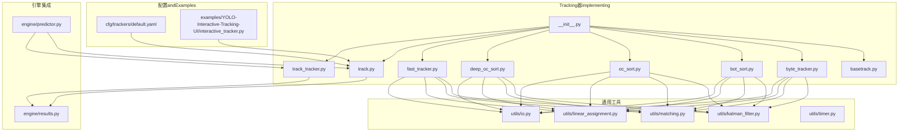
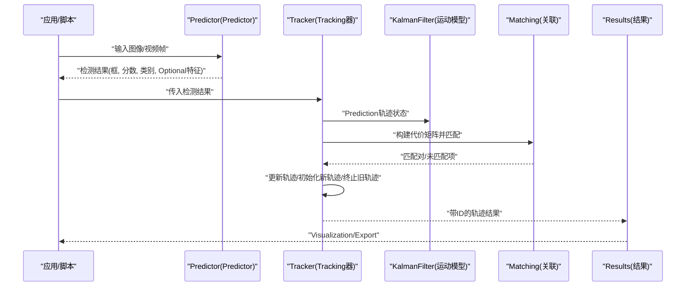
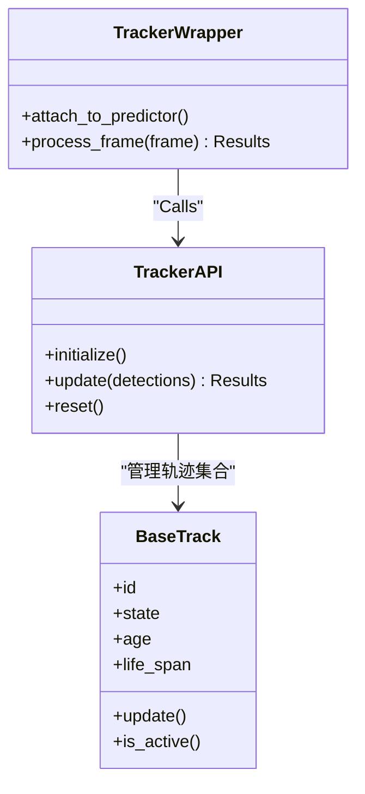
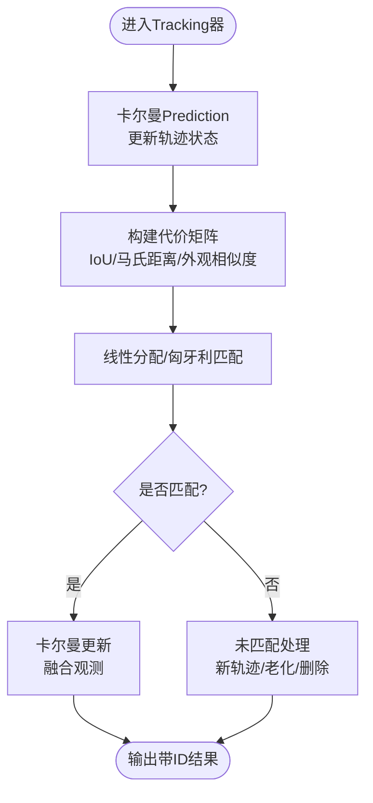
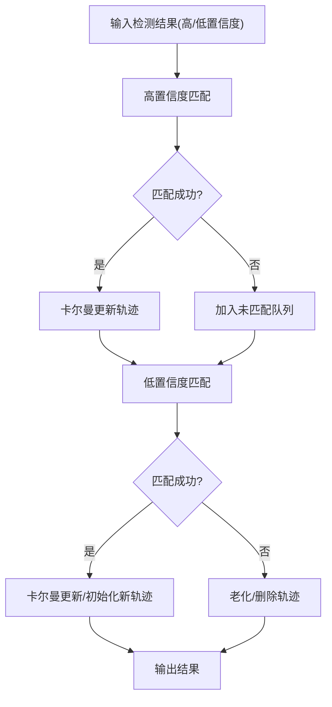
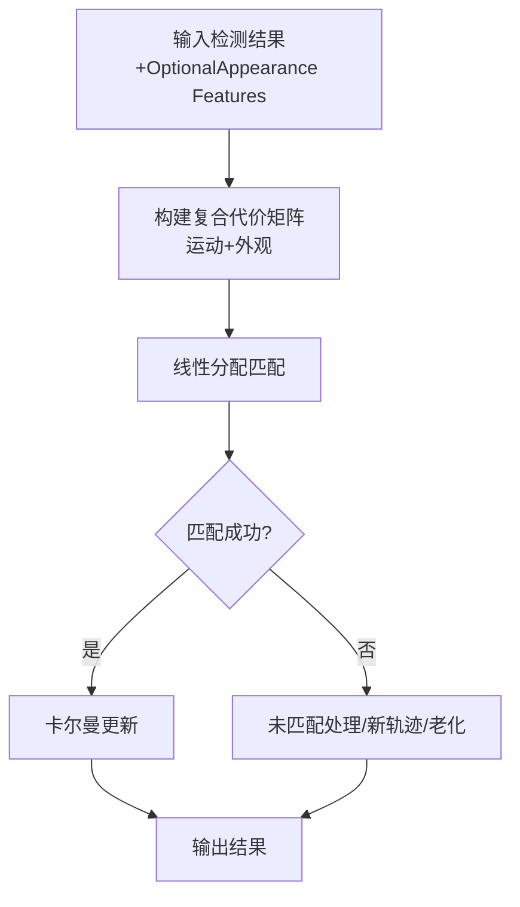
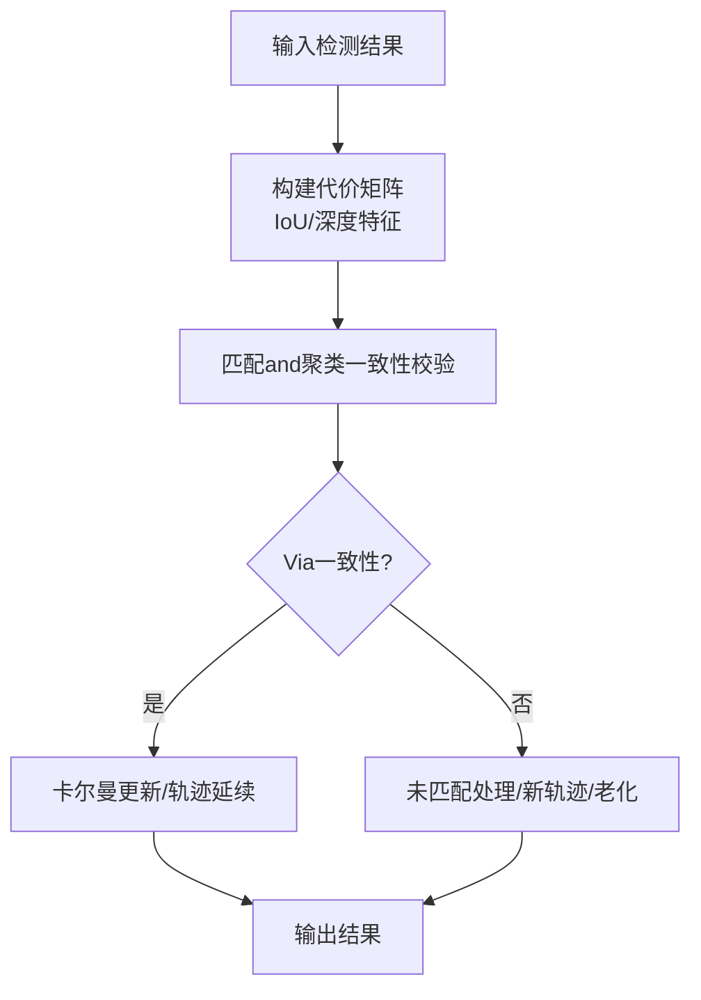
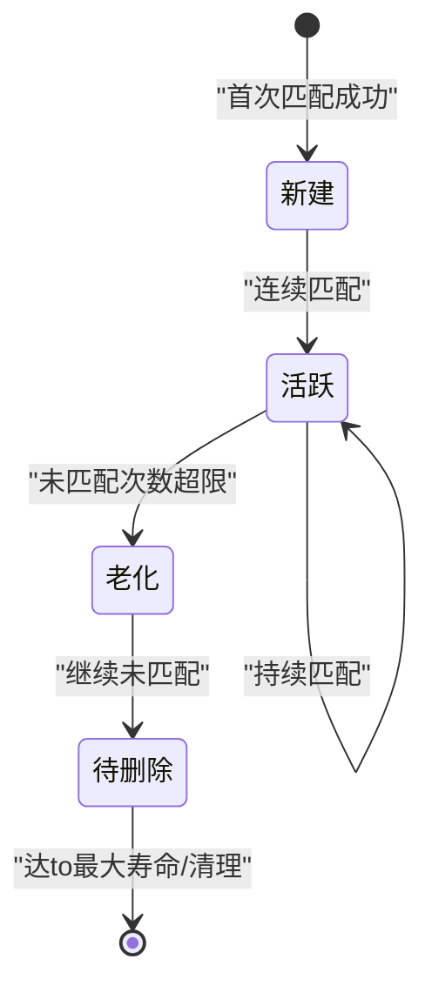
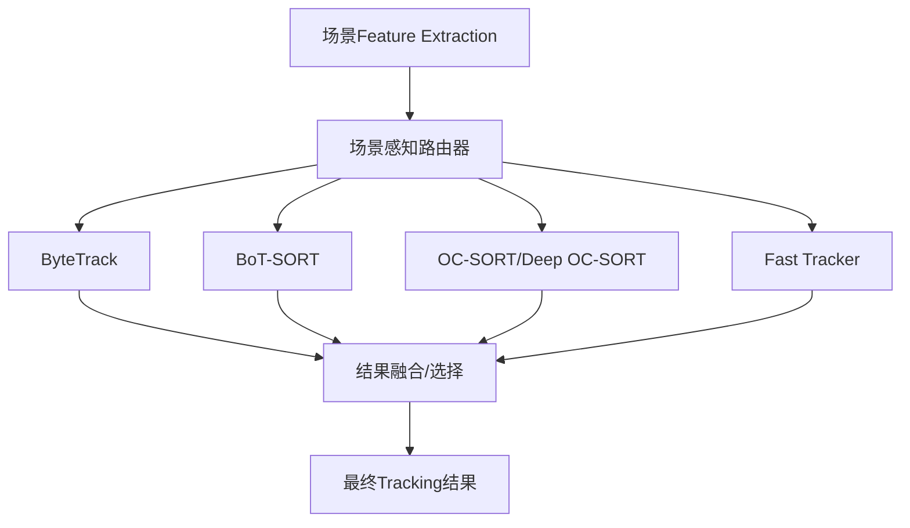
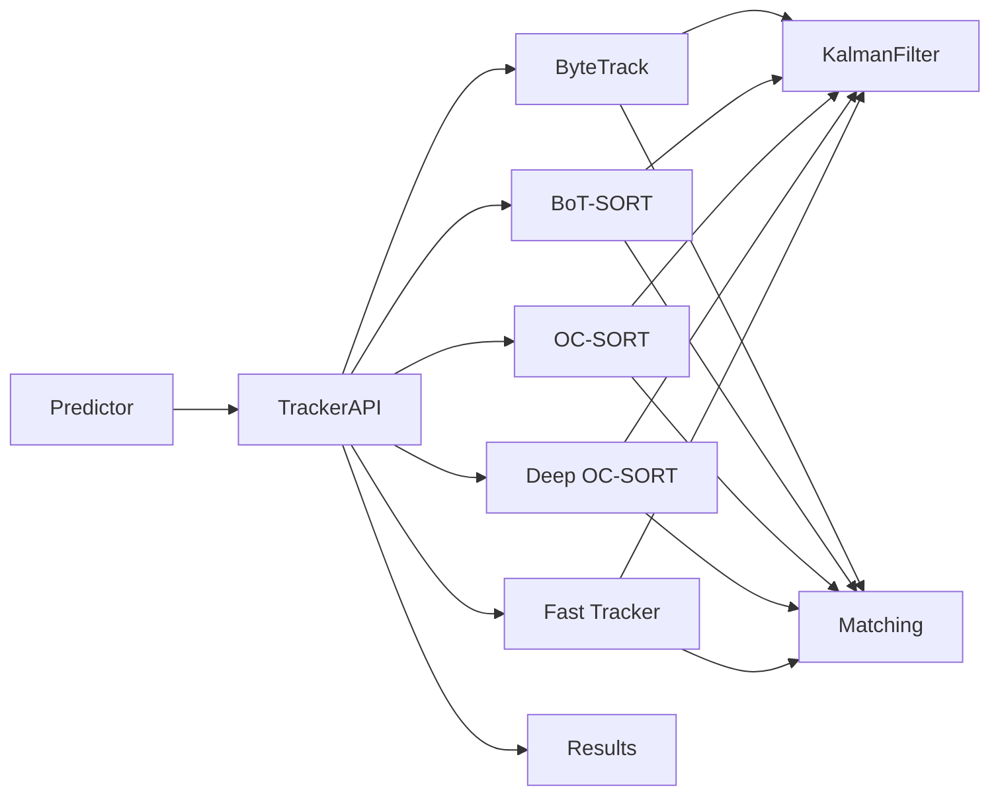

# Multi-Object Tracking System

<cite>
**Files Referenced in This Document**
- [ultralytics/trackers/__init__.py](file://ultralytics/trackers/__init__.py)
- [ultralytics/trackers/basetrack.py](file://ultralytics/trackers/basetrack.py)
- [ultralytics/trackers/byte_tracker.py](file://ultralytics/trackers/byte_tracker.py)
- [ultralytics/trackers/bot_sort.py](file://ultralytics/trackers/bot_sort.py)
- [ultralytics/trackers/deep_oc_sort.py](file://ultralytics/trackers/deep_oc_sort.py)
- [ultralytics/trackers/oc_sort.py](file://ultralytics/trackers/oc_sort.py)
- [ultralytics/trackers/fast_tracker.py](file://ultralytics/trackers/fast_tracker.py)
- [ultralytics/trackers/track.py](file://ultralytics/trackers/track.py)
- [ultralytics/trackers/track_tracker.py](file://ultralytics/trackers/track_tracker.py)
- [ultralytics/trackers/utils/kalman_filter.py](file://ultralytics/trackers/utils/kalman_filter.py)
- [ultralytics/trackers/utils/matching.py](file://ultralytics/trackers/utils/matching.py)
- [ultralytics/trackers/utils/linear_assignment.py](file://ultralytics/trackers/utils/linear_assignment.py)
- [ultralytics/trackers/utils/io.py](file://ultralytics/trackers/utils/io.py)
- [ultralytics/trackers/utils/timer.py](file://ultralytics/trackers/utils/timer.py)
- [ultralytics/engine/predictor.py](file://ultralytics/engine/predictor.py)
- [ultralytics/engine/results.py](file://ultralytics/engine/results.py)
- [ultralytics/cfg/trackers/default.yaml](file://ultralytics/cfg/trackers/default.yaml)
- [examples/YOLO-Interactive-Tracking-UI/interactive_tracker.py](file://examples/YOLO-Interactive-Tracking-UI/interactive_tracker.py)
- [benchmarks/benchmark_mot_dispatch.py](file://benchmarks/benchmark_mot_dispatch.py)
- [scripts/analyze_mot_routing.py](file://scripts/analyze_mot_routing.py)
- [scripts/diagnose_mot_routing.py](file://scripts/diagnose_mot_routing.py)
- [tests/test_mot.py](file://tests/test_mot.py)
- [tests/test_mot_scene_aware_router.py](file://tests/test_mot_scene_aware_router.py)
</cite>

## Table of Contents
1. [Introduction](#Introduction)
2. [Project Structure](#Project Structure)
3. [Core Components](#Core Components)
4. [Architecture Overview](#Architecture Overview)
5. [Detailed Component Analysis](#Detailed Component Analysis)
6. [Dependency Analysis](#Dependency Analysis)
7. [性能考量](#性能考量)
8. [Troubleshooting Guide](#Troubleshooting Guide)
9. [Conclusion](#Conclusion)
10. [Appendix](#Appendix)

## Introduction
本技术DocumentationtargetingYOLO-Master的Multi-Object Tracking（MOT）子系统，系统性阐述“检测-关联-Tracking”的完整流程and工程implementing。重点覆盖：
- Tracking算法族：ByteTrack、BoT-SORT、OC-SORTand其变体（Deep OC-SORT、Fast Tracker）的核心原理and配置要点
- ID分配策略andRe-Identification（Re-ID）集成方式
- 运动建模and卡尔曼滤波的implementing细节
- 轨迹管理and生命周期控制机制
- 场景感知路由器andMixture架构设计
- EvaluationMetricsand基准测试方法
- 实时Optimization策略（内存管理、计算效率）
- 交互式TrackingUIUsesand二次开发
- 结果Post-ProcessingandVisualization输出
- 不同场景下的配置调优建议

## Project Structure
Multi-Object Tracking相关代码主要位于 ultralytics/trackers Table of Contents，配套工具while utils 子Table of Contents中；andInference引擎的集成Via engine/predictor 和 engine/results 完成；配置文件集中于 cfg/trackers；Examplesand交互界面while examples 下；基准and诊断脚本while benchmarks and scripts 下；测试用例while tests 下。

Figure Source
- [ultralytics/trackers/__init__.py](file://ultralytics/trackers/__init__.py)
- [ultralytics/trackers/basetrack.py](file://ultralytics/trackers/basetrack.py)
- [ultralytics/trackers/byte_tracker.py](file://ultralytics/trackers/byte_tracker.py)
- [ultralytics/trackers/bot_sort.py](file://ultralytics/trackers/bot_sort.py)
- [ultralytics/trackers/oc_sort.py](file://ultralytics/trackers/oc_sort.py)
- [ultralytics/trackers/deep_oc_sort.py](file://ultralytics/trackers/deep_oc_sort.py)
- [ultralytics/trackers/fast_tracker.py](file://ultralytics/trackers/fast_tracker.py)
- [ultralytics/trackers/track.py](file://ultralytics/trackers/track.py)
- [ultralytics/trackers/track_tracker.py](file://ultralytics/trackers/track_tracker.py)
- [ultralytics/trackers/utils/kalman_filter.py](file://ultralytics/trackers/utils/kalman_filter.py)
- [ultralytics/trackers/utils/matching.py](file://ultralytics/trackers/utils/matching.py)
- [ultralytics/trackers/utils/linear_assignment.py](file://ultralytics/trackers/utils/linear_assignment.py)
- [ultralytics/trackers/utils/io.py](file://ultralytics/trackers/utils/io.py)
- [ultralytics/trackers/utils/timer.py](file://ultralytics/trackers/utils/timer.py)
- [ultralytics/engine/predictor.py](file://ultralytics/engine/predictor.py)
- [ultralytics/engine/results.py](file://ultralytics/engine/results.py)
- [ultralytics/cfg/trackers/default.yaml](file://ultralytics/cfg/trackers/default.yaml)
- [examples/YOLO-Interactive-Tracking-UI/interactive_tracker.py](file://examples/YOLO-Interactive-Tracking-UI/interactive_tracker.py)

Section Source
- [ultralytics/trackers/__init__.py](file://ultralytics/trackers/__init__.py)
- [ultralytics/trackers/track.py](file://ultralytics/trackers/track.py)
- [ultralytics/trackers/track_tracker.py](file://ultralytics/trackers/track_tracker.py)
- [ultralytics/engine/predictor.py](file://ultralytics/engine/predictor.py)
- [ultralytics/engine/results.py](file://ultralytics/engine/results.py)
- [ultralytics/cfg/trackers/default.yaml](file://ultralytics/cfg/trackers/default.yaml)

## Core Components
- 统一Tracking接口and包装器
  - track.py：provides高层TrackingAPI，负责将检测结果输入to具体Tracking器实例，并返回带ID的轨迹结果。
  - track_tracker.py：EncapsulatesTracking器Calls，便于andPredictor流水线集成。
- 基类and轨迹对象
  - basetrack.py：定义轨迹基类，包含ID、状态、生命周期、更新接口etc.通用capabilities。
- 具体Tracking算法
  - byte_tracker.py：基于低置信度检测补全的匹配策略，强调召回率and稳定性。
  - bot_sort.py：融合Appearance Features（Re-ID）and运动模型，提升遮挡and长时Tracking鲁棒性。
  - oc_sort.py / deep_oc_sort.py：基于IoUand深度特征的SORT变体，兼顾速度and精度。
  - fast_tracker.py：轻量级快速Trackingimplementing，适合资源受限场景。
- 通用工具
  - kalman_filter.py：线性高斯运动模型，用于Predictionand更新轨迹状态。
  - matching.py：匈牙利匹配、阈值过滤、代价矩阵构建etc.。
  - linear_assignment.py：线性分配求解器Encapsulates。
  - io.py：IoU、NMSetc.几何操作。
  - timer.py：计时and统计辅助。

Section Source
- [ultralytics/trackers/track.py](file://ultralytics/trackers/track.py)
- [ultralytics/trackers/track_tracker.py](file://ultralytics/trackers/track_tracker.py)
- [ultralytics/trackers/basetrack.py](file://ultralytics/trackers/basetrack.py)
- [ultralytics/trackers/byte_tracker.py](file://ultralytics/trackers/byte_tracker.py)
- [ultralytics/trackers/bot_sort.py](file://ultralytics/trackers/bot_sort.py)
- [ultralytics/trackers/oc_sort.py](file://ultralytics/trackers/oc_sort.py)
- [ultralytics/trackers/deep_oc_sort.py](file://ultralytics/trackers/deep_oc_sort.py)
- [ultralytics/trackers/fast_tracker.py](file://ultralytics/trackers/fast_tracker.py)
- [ultralytics/trackers/utils/kalman_filter.py](file://ultralytics/trackers/utils/kalman_filter.py)
- [ultralytics/trackers/utils/matching.py](file://ultralytics/trackers/utils/matching.py)
- [ultralytics/trackers/utils/linear_assignment.py](file://ultralytics/trackers/utils/linear_assignment.py)
- [ultralytics/trackers/utils/io.py](file://ultralytics/trackers/utils/io.py)
- [ultralytics/trackers/utils/timer.py](file://ultralytics/trackers/utils/timer.py)

## Architecture Overview
整体遵循“检测-关联-Tracking”流水线：Predictor输出检测框andOptional特征，Tracking器根据当前帧检测结果and历史轨迹进行关联，更新轨迹状态并生成带ID的结果。

Figure Source
- [ultralytics/engine/predictor.py](file://ultralytics/engine/predictor.py)
- [ultralytics/trackers/track.py](file://ultralytics/trackers/track.py)
- [ultralytics/trackers/utils/kalman_filter.py](file://ultralytics/trackers/utils/kalman_filter.py)
- [ultralytics/trackers/utils/matching.py](file://ultralytics/trackers/utils/matching.py)
- [ultralytics/engine/results.py](file://ultralytics/engine/results.py)

## Detailed Component Analysis

### 统一Tracking接口and包装器
- track.py
  - 职责：对外暴露统一的TrackingAPI，接收检测结果，选择并Calls具体Tracking器，返回标准化结果。
  - 关键点：Supporting多种Tracking器注册and切换；维护每帧处理时序；andResults对象对接。
- track_tracker.py
  - 职责：forPredictor流水线providesTracking包装，简化集成步骤。
  - 关键点：Encapsulates初始化、逐帧Calls、结果合并and清理。

Figure Source
- [ultralytics/trackers/track.py](file://ultralytics/trackers/track.py)
- [ultralytics/trackers/track_tracker.py](file://ultralytics/trackers/track_tracker.py)
- [ultralytics/trackers/basetrack.py](file://ultralytics/trackers/basetrack.py)

Section Source
- [ultralytics/trackers/track.py](file://ultralytics/trackers/track.py)
- [ultralytics/trackers/track_tracker.py](file://ultralytics/trackers/track_tracker.py)
- [ultralytics/trackers/basetrack.py](file://ultralytics/trackers/basetrack.py)

### 运动建模and卡尔曼滤波
- kalman_filter.py
  - 职责：implementing线性高斯卡尔曼滤波，用于位置/速度Predictionand观测更新。
  - 关键点：状态向量维度、过程噪声、观测噪声、协方差更新；and匹配Modules协同providesPrediction边界。

Figure Source
- [ultralytics/trackers/utils/kalman_filter.py](file://ultralytics/trackers/utils/kalman_filter.py)
- [ultralytics/trackers/utils/matching.py](file://ultralytics/trackers/utils/matching.py)
- [ultralytics/trackers/utils/linear_assignment.py](file://ultralytics/trackers/utils/linear_assignment.py)

Section Source
- [ultralytics/trackers/utils/kalman_filter.py](file://ultralytics/trackers/utils/kalman_filter.py)
- [ultralytics/trackers/utils/matching.py](file://ultralytics/trackers/utils/matching.py)
- [ultralytics/trackers/utils/linear_assignment.py](file://ultralytics/trackers/utils/linear_assignment.py)

### ByteTrack 算法
- 核心思想：利用低置信度检测补充匹配，提高召回and连续性；CombiningIoUandConfidence Threshold进行两阶段匹配。
- 关键流程：
  - 第一阶段：高置信度检测and活跃轨迹匹配
  - 第二阶段：低置信度检测and未匹配轨迹或新候选匹配
  - 轨迹更新：成功匹配则卡尔曼更新，未匹配则老化计数增加
- Applicable Scenarios：密集人群、频繁遮挡、需要高召回率的场景

Figure Source
- [ultralytics/trackers/byte_tracker.py](file://ultralytics/trackers/byte_tracker.py)
- [ultralytics/trackers/utils/matching.py](file://ultralytics/trackers/utils/matching.py)
- [ultralytics/trackers/utils/io.py](file://ultralytics/trackers/utils/io.py)

Section Source
- [ultralytics/trackers/byte_tracker.py](file://ultralytics/trackers/byte_tracker.py)
- [ultralytics/trackers/utils/matching.py](file://ultralytics/trackers/utils/matching.py)
- [ultralytics/trackers/utils/io.py](file://ultralytics/trackers/utils/io.py)

### BoT-SORT 算法
- 核心思想：融合Appearance Features（Re-ID）and运动模型，采用更稳健的代价组合and轨迹管理策略。
- 关键流程：
  - 外观Feature Extractionand归一化
  - 运动代价and外观代价加权融合
  - 匹配策略and轨迹生命周期控制
- Applicable Scenarios：存while显著外观变化、长时间遮挡、需要稳定ID的场景

Figure Source
- [ultralytics/trackers/bot_sort.py](file://ultralytics/trackers/bot_sort.py)
- [ultralytics/trackers/utils/matching.py](file://ultralytics/trackers/utils/matching.py)
- [ultralytics/trackers/utils/kalman_filter.py](file://ultralytics/trackers/utils/kalman_filter.py)

Section Source
- [ultralytics/trackers/bot_sort.py](file://ultralytics/trackers/bot_sort.py)
- [ultralytics/trackers/utils/matching.py](file://ultralytics/trackers/utils/matching.py)
- [ultralytics/trackers/utils/kalman_filter.py](file://ultralytics/trackers/utils/kalman_filter.py)

### OC-SORT and Deep OC-SORT
- OC-SORT：whileSORT基础上引入while线聚类and轨迹一致性约束，增强遮挡恢复capabilities。
- Deep OC-SORT：进一步引入深度特征，提升复杂场景下的区分度and鲁棒性。
- 关键差异：
  - 代价函数：IoU vs IoU+深度特征
  - 轨迹管理：while线聚类策略and一致性检查
- Applicable Scenarios：中etc.至高密度场景，需要平衡速度and精度的应用

Figure Source
- [ultralytics/trackers/oc_sort.py](file://ultralytics/trackers/oc_sort.py)
- [ultralytics/trackers/deep_oc_sort.py](file://ultralytics/trackers/deep_oc_sort.py)
- [ultralytics/trackers/utils/matching.py](file://ultralytics/trackers/utils/matching.py)

Section Source
- [ultralytics/trackers/oc_sort.py](file://ultralytics/trackers/oc_sort.py)
- [ultralytics/trackers/deep_oc_sort.py](file://ultralytics/trackers/deep_oc_sort.py)
- [ultralytics/trackers/utils/matching.py](file://ultralytics/trackers/utils/matching.py)

### Fast Tracker
- 定位：轻量级快速Trackingimplementing，减少计算开销，适合边缘设备或高帧率需求。
- 特点：简化匹配and轨迹管理逻辑，降低内存占用。
- Applicable Scenarios：移动端、嵌入式平台、实时性优先的应用

Section Source
- [ultralytics/trackers/fast_tracker.py](file://ultralytics/trackers/fast_tracker.py)

### 轨迹管理and生命周期控制
- 轨迹对象（BaseTrack）
  - 属性：唯一ID、状态向量、年龄、最大寿命、活跃度标志
  - 行for：更新状态、判断活跃、清理资源
- 生命周期策略
  - 初始化：首次匹配成功即创建新轨迹
  - 延续：连续匹配成功则更新状态
  - 老化：未匹配次数超过阈值则标记for待删除
  - 删除：达to最大寿命或不可恢复时移除

Figure Source
- [ultralytics/trackers/basetrack.py](file://ultralytics/trackers/basetrack.py)

Section Source
- [ultralytics/trackers/basetrack.py](file://ultralytics/trackers/basetrack.py)

### 场景感知路由器andMixture架构
- 动机：不同场景（such as密集人群、稀疏道路、强遮挡）对Tracking器的偏好不同，单一算法难Centered on兼顾所有Metrics。
- 设计思路：
  - 场景分类：基于帧内统计（密度、遮挡比例、运动强度）或外部元数据
  - 路由决策：根据场景标签选择最优Tracking器或动态Mixture权重
  - Mixture模式：多Tracking器并行运行，按场景自适应融合结果
- 诊断and分析：
  - analyze_mot_routing.py：分析路由效果and性能分布
  - diagnose_mot_routing.py：定位路由异常and漂移

Figure Source
- [scripts/analyze_mot_routing.py](file://scripts/analyze_mot_routing.py)
- [scripts/diagnose_mot_routing.py](file://scripts/diagnose_mot_routing.py)

Section Source
- [scripts/analyze_mot_routing.py](file://scripts/analyze_mot_routing.py)
- [scripts/diagnose_mot_routing.py](file://scripts/diagnose_mot_routing.py)

### EvaluationMetricsand基准测试
- 常用Metrics：MOTA、IDF1、IDs、MT、ML、FP、FNetc.
- Benchmark Suite：
  - benchmark_mot_dispatch.py：调度不同Tracking器and数据集，汇总对比结果
  - tests/test_mot.py：单元测试and回归Validation
  - tests/test_mot_scene_aware_router.py：场景感知路由的专项测试
- Uses方法：
  - 配置数据集路径andTracking器参数
  - 运行基准脚本，输出MetricsandVisualization报告
  - 对比不同配置and算法的性能差异

Section Source
- [benchmarks/benchmark_mot_dispatch.py](file://benchmarks/benchmark_mot_dispatch.py)
- [tests/test_mot.py](file://tests/test_mot.py)
- [tests/test_mot_scene_aware_router.py](file://tests/test_mot_scene_aware_router.py)

### 实时TrackingOptimization策略
- 内存管理
  - 限制轨迹缓存数量and生命周期，and时释放无用轨迹
  - 复用中间张量and缓冲区，避免频繁分配
- 计算效率
  - 选择合适的Tracking器（Fast Tracker用于边缘设备）
  - 调整匹配阈值and窗口大小，平衡召回and延迟
  - Uses向量化IoUand近似匹配加速
- 流水线并行
  - PredictionandTracking解耦，异步处理前后帧
  - 批处理小批量帧Centered on提升吞吐

[This section provides general guidance and does not directly analyze specific files]

### 交互式TrackingUIand自定义开发
- interactive_tracker.py
  - 功能：provides交互式界面，Supporting加载视频/摄像头、选择Tracking器、调节参数、实时Visualization
  - 扩展点：新增Tracking器、自定义Visualization样式、添加业务逻辑（区域计数、越界报警etc.）
- Uses指南
  - 启动UI，选择模型andTracking器
  - 加载输入源，开始Tracking
  - Via界面控件调整阈值、窗口大小、外观权重etc.
  - 保存结果或Export轨迹

Section Source
- [examples/YOLO-Interactive-Tracking-UI/interactive_tracker.py](file://examples/YOLO-Interactive-Tracking-UI/interactive_tracker.py)

### 结果Post-ProcessingandVisualization输出
- Results Object（Results）
  - 承载带ID的轨迹、边界框、类别、分数、Optional特征
  - provides绘制、Export、统计etc.方法
- Post-Processing
  - 轨迹平滑、去抖、跨视角拼接
  - 统计Metrics计算and报表生成
- Visualization
  - 绘制轨迹线、ID标签、热力图
  - Export视频或序列图像

Section Source
- [ultralytics/engine/results.py](file://ultralytics/engine/results.py)

### 配置方法and最佳实践
- 默认配置（default.yaml）
  - Tracking器选择、阈值、窗口大小、外观权重、卡尔曼噪声etc.
- 调优建议
  - 密集人群：提高低Confidence Threshold、增大匹配窗口、启用Appearance Features
  - 稀疏道路：降低外观权重、缩短轨迹寿命、提高删除阈值
  - 强遮挡：延长轨迹寿命、增加外观相似度权重、UsesBoT-SORT或Deep OC-SORT
  - 边缘设备：选用Fast Tracker、减小窗口、降低分辨率

Section Source
- [ultralytics/cfg/trackers/default.yaml](file://ultralytics/cfg/trackers/default.yaml)

## Dependency Analysis
Tracking器之间的耦合度较低，主要ViaUnified Interfaceand通用工具协作；andPredictor和Results Object的集成清晰，便于替换and扩展。

Figure Source
- [ultralytics/engine/predictor.py](file://ultralytics/engine/predictor.py)
- [ultralytics/trackers/track.py](file://ultralytics/trackers/track.py)
- [ultralytics/trackers/byte_tracker.py](file://ultralytics/trackers/byte_tracker.py)
- [ultralytics/trackers/bot_sort.py](file://ultralytics/trackers/bot_sort.py)
- [ultralytics/trackers/oc_sort.py](file://ultralytics/trackers/oc_sort.py)
- [ultralytics/trackers/deep_oc_sort.py](file://ultralytics/trackers/deep_oc_sort.py)
- [ultralytics/trackers/fast_tracker.py](file://ultralytics/trackers/fast_tracker.py)
- [ultralytics/trackers/utils/kalman_filter.py](file://ultralytics/trackers/utils/kalman_filter.py)
- [ultralytics/trackers/utils/matching.py](file://ultralytics/trackers/utils/matching.py)
- [ultralytics/engine/results.py](file://ultralytics/engine/results.py)

Section Source
- [ultralytics/trackers/__init__.py](file://ultralytics/trackers/__init__.py)
- [ultralytics/trackers/track.py](file://ultralytics/trackers/track.py)
- [ultralytics/trackers/track_tracker.py](file://ultralytics/trackers/track_tracker.py)
- [ultralytics/engine/predictor.py](file://ultralytics/engine/predictor.py)
- [ultralytics/engine/results.py](file://ultralytics/engine/results.py)

## 性能考量
- 算法选择
  - 高精度优先：BoT-SORT、Deep OC-SORT
  - 高召回优先：ByteTrack
  - 低延迟优先：Fast Tracker
- 参数调优
  - 匹配阈值、外观权重、轨迹寿命、窗口大小
- 硬件适配
  - CPU/GPU/边缘设备的权衡
  - 模型andTracking器联合Optimization（分辨率、Batch Size）

[This section provides general guidance and does not directly analyze specific files]

## Troubleshooting Guide
- 常见问题
  - ID跳变：检查外观相似度阈值and轨迹寿命
  - 漏检过多：提高低Confidence Threshold、扩大匹配窗口
  - 延迟过高：更换轻量Tracking器、降低分辨率、减少窗口
- 诊断工具
  - analyze_mot_routing.py：分析路由效果
  - diagnose_mot_routing.py：定位路由异常
- 测试Validation
  - tests/test_mot.py：回归测试
  - tests/test_mot_scene_aware_router.py：路由专项测试

Section Source
- [scripts/analyze_mot_routing.py](file://scripts/analyze_mot_routing.py)
- [scripts/diagnose_mot_routing.py](file://scripts/diagnose_mot_routing.py)
- [tests/test_mot.py](file://tests/test_mot.py)
- [tests/test_mot_scene_aware_router.py](file://tests/test_mot_scene_aware_router.py)

## Conclusion
YOLO-Master的Multi-Object Trackingsubsystem provides了Modules化、可扩展的Tracking框架，涵盖主流算法and实用工具。Via场景感知路由器andMixture架构，可while不同场景中灵活选择and融合Tracking策略。Combined with完善的Evaluationand诊断工具，User可高效调优Centered on满足多样化应用需求。

[本节for总结，不直接分析具体文件]

## Appendix
- 快速上手
  - Uses默认配置快速运行Tracking
  - Via交互式UI进行参数探索
- 进阶定制
  - 新增Tracking器implementingand注册
  - 自定义代价函数and匹配策略
  - 集成外部Re-ID模型

[本节for补充说明，不直接分析具体文件]