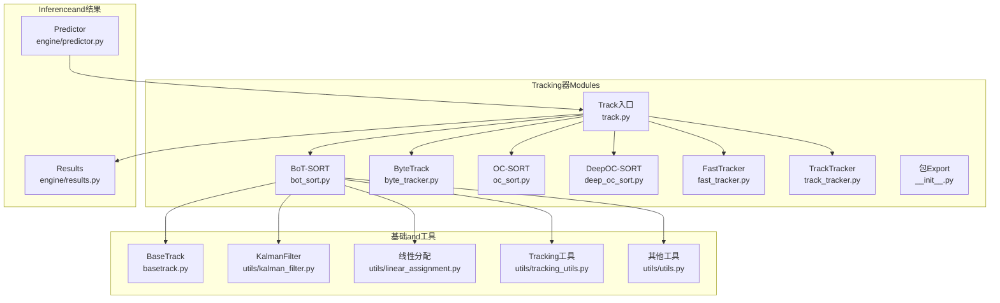
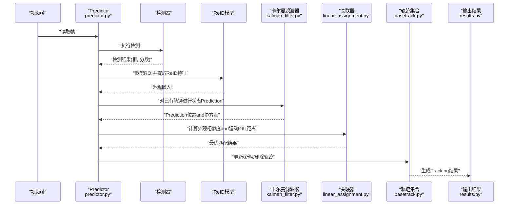
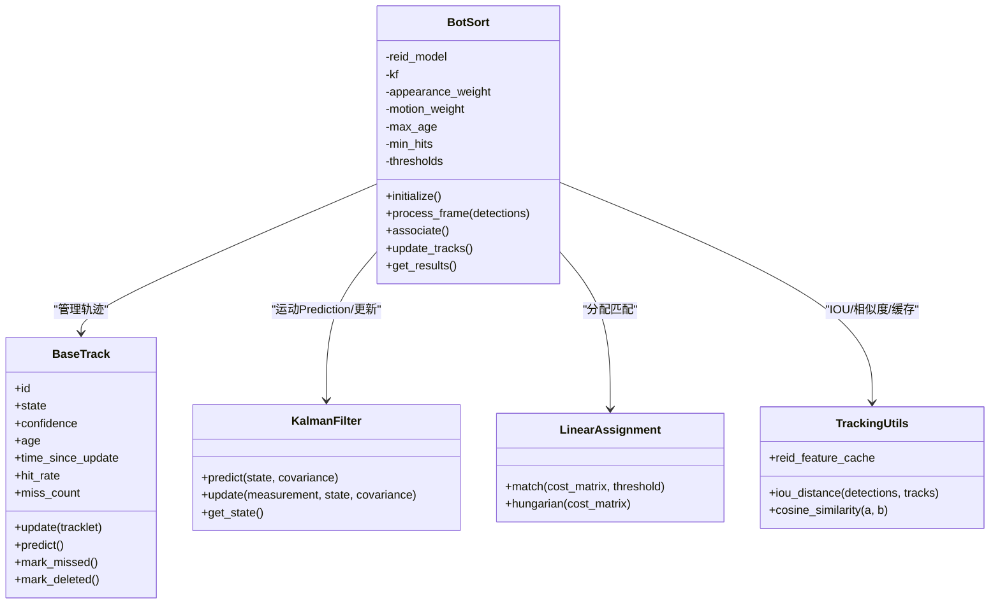
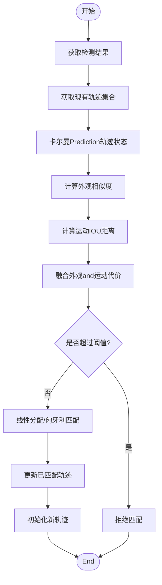

# BoT-SORT算法implementing

<cite>
**Files Referenced in This Document**
- [bot_sort.py](file://ultralytics/trackers/bot_sort.py)
- [basetrack.py](file://ultralytics/trackers/basetrack.py)
- [byte_tracker.py](file://ultralytics/trackers/byte_tracker.py)
- [deep_oc_sort.py](file://ultralytics/trackers/deep_oc_sort.py)
- [fast_tracker.py](file://ultralytics/trackers/fast_tracker.py)
- [oc_sort.py](file://ultralytics/trackers/oc_sort.py)
- [track.py](file://ultralytics/trackers/track.py)
- [track_tracker.py](file://ultralytics/trackers/track_tracker.py)
- [__init__.py](file://ultralytics/trackers/__init__.py)
- [predictor.py](file://ultralytics/engine/predictor.py)
- [results.py](file://ultralytics/engine/results.py)
- [utils.py](file://ultralytics/trackers/utils/utils.py)
- [kalman_filter.py](file://ultralytics/trackers/utils/kalman_filter.py)
- [linear_assignment.py](file://ultralytics/trackers/utils/linear_assignment.py)
- [tracking_utils.py](file://ultralytics/trackers/utils/tracking_utils.py)
- [README.md](file://ultralytics/trackers/README.md)
</cite>

## Table of Contents
1. [Introduction](#Introduction)
2. [Project Structure](#Project Structure)
3. [Core Components](#Core Components)
4. [Architecture Overview](#Architecture Overview)
5. [Detailed Component Analysis](#Detailed Component Analysis)
6. [Dependency Analysis](#Dependency Analysis)
7. [性能考量](#性能考量)
8. [Troubleshooting Guide](#Troubleshooting Guide)
9. [Conclusion](#Conclusion)
10. [Appendix](#Appendix)

## Introduction
本技术Documentation围绕BoT-SORTwhileMulti-Object Tracking（MOT）中的工程化implementing进行系统化梳理，重点解释其关键创新点and落地细节：ReIDFeature Extraction、卡尔曼滤波Optimization、运动一致性建模，Centered onand外观and运动信息while关联阶段的融合策略。Documentation同时给出配置参数说明、调优建议、UsesExamplesandwhile不同数据集上的表现Refer to，帮助读者快速理解并高效应用该算法。

## Project Structure
本项目将Multi-Object Tracking相关代码集中while trackers Modules中，其中BoT-SORT的implementing位于 bot_sort.py，配套的基础轨迹对象、工具函数and通用Tracking器基类分别位于 basetrack.py、utils/* and track_tracker.py etc.文件中。Prediction阶段由 engine/predictor.py drivers are installed，结果Encapsulates于 engine/results.py。



Figure Source
- [bot_sort.py](file://ultralytics/trackers/bot_sort.py)
- [basetrack.py](file://ultralytics/trackers/basetrack.py)
- [kalman_filter.py](file://ultralytics/trackers/utils/kalman_filter.py)
- [linear_assignment.py](file://ultralytics/trackers/utils/linear_assignment.py)
- [tracking_utils.py](file://ultralytics/trackers/utils/tracking_utils.py)
- [utils.py](file://ultralytics/trackers/utils/utils.py)
- [track.py](file://ultralytics/trackers/track.py)
- [predictor.py](file://ultralytics/engine/predictor.py)
- [results.py](file://ultralytics/engine/results.py)

Section Source
- [README.md](file://ultralytics/trackers/README.md)
- [__init__.py](file://ultralytics/trackers/__init__.py)

## Core Components
- 检测器：YOLO Series Models负责帧级Object Detection，输出边界框and置信度。
- ReID模型：provides外观嵌入向量，用于计算目标间的相似度，增强遮挡and重入场景的鲁棒性。
- 运动模型：基于卡尔曼滤波的状态估计andPrediction，CombiningIOU距离度量，提升短遮挡下的轨迹连续性。
- 关联算法：将外观相似度and运动相似度进行融合，采用线性分配或匈牙利算法完成检测-轨迹匹配。
- 轨迹管理：维护轨迹生命周期、状态机、可见性and丢失计数，Supporting轨迹初始化、更新and消亡。

Section Source
- [bot_sort.py](file://ultralytics/trackers/bot_sort.py)
- [basetrack.py](file://ultralytics/trackers/basetrack.py)
- [kalman_filter.py](file://ultralytics/trackers/utils/kalman_filter.py)
- [linear_assignment.py](file://ultralytics/trackers/utils/linear_assignment.py)
- [tracking_utils.py](file://ultralytics/trackers/utils/tracking_utils.py)

## Architecture Overview
下图展示了从视频帧输入toTracking输出的端to端流程，包括检测、ReIDFeature Extraction、卡尔曼Prediction、外观and运动融合、线性分配and轨迹更新。



Figure Source
- [predictor.py](file://ultralytics/engine/predictor.py)
- [bot_sort.py](file://ultralytics/trackers/bot_sort.py)
- [kalman_filter.py](file://ultralytics/trackers/utils/kalman_filter.py)
- [linear_assignment.py](file://ultralytics/trackers/utils/linear_assignment.py)
- [basetrack.py](file://ultralytics/trackers/basetrack.py)
- [results.py](file://ultralytics/engine/results.py)

## Detailed Component Analysis

### BoT-SORT主类and接口
BoT-SORT继承自通用Tracking器基类，Encapsulates了ReID特征缓存、卡尔曼滤波参数、外观and运动权重、阈值策略etc.。其核心方法包括初始化、单帧处理、轨迹更新and结果返回。



Figure Source
- [basetrack.py](file://ultralytics/trackers/basetrack.py)
- [kalman_filter.py](file://ultralytics/trackers/utils/kalman_filter.py)
- [linear_assignment.py](file://ultralytics/trackers/utils/linear_assignment.py)
- [tracking_utils.py](file://ultralytics/trackers/utils/tracking_utils.py)
- [bot_sort.py](file://ultralytics/trackers/bot_sort.py)

Section Source
- [bot_sort.py](file://ultralytics/trackers/bot_sort.py)
- [basetrack.py](file://ultralytics/trackers/basetrack.py)
- [kalman_filter.py](file://ultralytics/trackers/utils/kalman_filter.py)
- [linear_assignment.py](file://ultralytics/trackers/utils/linear_assignment.py)
- [tracking_utils.py](file://ultralytics/trackers/utils/tracking_utils.py)

### ReIDFeature Extractionand嵌入空间学习
- Feature Extraction：对检测框对应的ROI进行归一化and缩放后送入ReID模型，得to固定维度的外观嵌入。
- 嵌入空间学习：Training阶段通常采用对比损失或三元组损失，使同一ID样本while嵌入空间中靠近，不同ID样本远离，从而提升跨帧匹配的鲁棒性。
- 相似度度量：常用余弦相似度或欧氏距离；while工程中常Via阈值或动态自适应策略控制匹配严格程度。
- 缓存策略：for减少重复计算，可对短时内未更新的轨迹或稳定ROI进行特征缓存，并while必要时刷新。

Section Source
- [bot_sort.py](file://ultralytics/trackers/bot_sort.py)
- [tracking_utils.py](file://ultralytics/trackers/utils/tracking_utils.py)

### 卡尔曼滤波Optimizationand运动一致性建模
- 状态表示：通常for位置坐标and速度分量的一维或二维状态向量，Combined with观测噪声and过程噪声协方差矩阵。
- Predictionand更新：while每帧前对轨迹进行Prediction，得to先验位置and不确定性；匹配成功后Centered on检测框作for观测进行更新，缩小不确定性。
- 运动一致性：Via协方差的椭圆区域约束候选匹配范围，并CombiningIOU距离衡量几何一致性，提高遮挡and密集场景下的稳定性。
- 参数调优：过程噪声and观测噪声直接影响Prediction漂移and收敛速度，需根据场景运动剧烈程度调整。

Section Source
- [kalman_filter.py](file://ultralytics/trackers/utils/kalman_filter.py)
- [tracking_utils.py](file://ultralytics/trackers/utils/tracking_utils.py)
- [bot_sort.py](file://ultralytics/trackers/bot_sort.py)

### 外观and运动信息融合策略
- 代价矩阵构建：外观相似度转换for代价（such as负相似度），运动IOU距离直接作for代价项。
- 加权融合：Via外观权重and运动权重的组合形成最终代价矩阵，常见形式for线性加权或非线性映射。
- 阈值门控：对匹配代价设置上限，避免错误匹配；可针对不同场景动态调整阈值。
- 分配求解：Uses线性分配或匈牙利算法求解全局最优匹配，保证一对一约束。



Figure Source
- [bot_sort.py](file://ultralytics/trackers/bot_sort.py)
- [linear_assignment.py](file://ultralytics/trackers/utils/linear_assignment.py)
- [tracking_utils.py](file://ultralytics/trackers/utils/tracking_utils.py)

Section Source
- [bot_sort.py](file://ultralytics/trackers/bot_sort.py)
- [linear_assignment.py](file://ultralytics/trackers/utils/linear_assignment.py)
- [tracking_utils.py](file://ultralytics/trackers/utils/tracking_utils.py)

### 关键组件详解
- 检测器：YOLO模型输出高质量检测框，影响后续ReIDand关联质量。建议针对目标尺度分布and遮挡情况选择合适尺寸andNMS策略。
- ReID模型：Recommended to use预Training且andTasks域相近的模型，并进行轻量微调Centered on提升领域适配性。注意ROI裁剪and归一化的稳定性。
- 运动模型：根据场景运动特性调整卡尔曼噪声参数，确保Prediction合理且不发散。
- 关联算法：Set appropriately外观and运动权重and阈值，平衡召回率and精度。

Section Source
- [predictor.py](file://ultralytics/engine/predictor.py)
- [results.py](file://ultralytics/engine/results.py)
- [bot_sort.py](file://ultralytics/trackers/bot_sort.py)

### and其他Tracking器的对比
- ByteTrack：侧重低置信度检测的利用，适合高召回场景。
- OC-SORT：强调外观一致性，适合长时遮挡and身份切换频繁的场景。
- DeepOC-SORT：引入深度外观and运动联合建模，复杂度较高但鲁棒性强。
- FastTracker：追求实时性，牺牲部分精度换取速度。

Section Source
- [byte_tracker.py](file://ultralytics/trackers/byte_tracker.py)
- [oc_sort.py](file://ultralytics/trackers/oc_sort.py)
- [deep_oc_sort.py](file://ultralytics/trackers/deep_oc_sort.py)
- [fast_tracker.py](file://ultralytics/trackers/fast_tracker.py)

## Dependency Analysis
BoT-SORT依赖Centered on下内部Modules：
- 基础轨迹对象：basetrack.py
- 卡尔曼滤波：utils/kalman_filter.py
- 线性分配：utils/linear_assignment.py
- Tracking工具：utils/tracking_utils.py
- 通用工具：utils/utils.py
- Inferenceand结果：engine/predictor.py、engine/results.py

```mermaid
graph LR
BS["BotSort<br/>bot_sort.py"] --> BASE["BaseTrack<br/>basetrack.py"]
BS --> KF["KalmanFilter<br/>utils/kalman_filter.py"]
BS --> LA["LinearAssignment<br/>utils/linear_assignment.py"]
BS --> TU["TrackingUtils<br/>utils/tracking_utils.py"]
BS --> U["Utils<br/>utils/utils.py"]
PRED["Predictor<br/>engine/predictor.py"] --> BS
RES["Results<br/>engine/results.py"] <-- BS
```

Figure Source
- [bot_sort.py](file://ultralytics/trackers/bot_sort.py)
- [basetrack.py](file://ultralytics/trackers/basetrack.py)
- [kalman_filter.py](file://ultralytics/trackers/utils/kalman_filter.py)
- [linear_assignment.py](file://ultralytics/trackers/utils/linear_assignment.py)
- [tracking_utils.py](file://ultralytics/trackers/utils/tracking_utils.py)
- [utils.py](file://ultralytics/trackers/utils/utils.py)
- [predictor.py](file://ultralytics/engine/predictor.py)
- [results.py](file://ultralytics/engine/results.py)

Section Source
- [bot_sort.py](file://ultralytics/trackers/bot_sort.py)
- [__init__.py](file://ultralytics/trackers/__init__.py)

## 性能考量
- 计算开销：ReIDFeature Extraction是主要bottlenecks，可ViaROI缓存、批处理andModel Quantization降低延迟。
- 内存占用：轨迹历史and特征缓存随时间增长，需设置最大年龄and淘汰策略。
- 并行and流水线：检测、ReID、关联可适度并行，注意数据同步and锁竞争。
- 设备适配：GPU上Prefer张量操作andBatch Inference；CPU场景下考虑ONNX/TensorRT加速。

[This section provides general guidance and does not directly analyze specific files]

## Troubleshooting Guide
- 轨迹频繁断裂：检查卡尔曼噪声参数是否过大或过小；适当增大运动权重或放宽阈值。
- 身份切换频繁：提升外观权重或引入更稳定的ReID模型；增加最小命中次数and最大丢失计数。
- 漏检导致轨迹丢失：启用低置信度检测（such asByteTrack策略）或调整检测阈值。
- 性能不足：关闭不必要的Visualization；减少ReID特征刷新频率；Uses更快的ReID模型或降级分辨率。

Section Source
- [bot_sort.py](file://ultralytics/trackers/bot_sort.py)
- [basetrack.py](file://ultralytics/trackers/basetrack.py)
- [tracking_utils.py](file://ultralytics/trackers/utils/tracking_utils.py)

## Conclusion
BoT-SORTVia将ReID外观信息and卡尔曼运动模型有机Combining，while复杂场景中implementing了较高的Tracking鲁棒性and稳定性。合理的参数调优and工程Optimization（such as特征缓存、Batch Inference）能显著提升性能。while实际应用中，应根据场景特点选择合适的权重and阈值，并Combining其他Tracking器（such asByteTrack、OC-SORT）的优势进行Mixture策略设计。

[本节for总结，不直接分析具体文件]

## Appendix

### 配置参数说明and调优指南
- 外观权重：控制ReID相似度while代价矩阵中的比重，值越大越依赖外观。
- 运动权重：控制IOU距离的比重，值越大越依赖几何一致性。
- 最大年龄：轨迹最长存活帧数，防止幽灵轨迹。
- 最小命中次数：轨迹被确认前的最少成功匹配次数。
- 最大丢失计数：允许连续丢失的帧数，超过则删除轨迹。
- 外观阈值：外观相似度匹配的上限阈值。
- 运动阈值：IOU距离匹配的上限阈值。
- ReID特征缓存：是否启用缓存and缓存时长。

调优建议：
- 高遮挡场景：提高外观权重and最小命中次数，适当放宽最大丢失计数。
- 高速运动场景：增大运动权重，调整卡尔曼过程噪声Centered on更好Tracking快速变化。
- 资源受限场景：降低ReID刷新频率，减小模型尺寸或Uses量化版本。

Section Source
- [bot_sort.py](file://ultralytics/trackers/bot_sort.py)
- [tracking_utils.py](file://ultralytics/trackers/utils/tracking_utils.py)

### UsesExamples
- 基本用法：加载YOLO检测器andBoT-SORTTracking器，逐帧读取视频，CallsTracking器处理检测结果并输出轨迹。
- 集成方式：whilePredictor中配置Tracking器类型and参数，统一输出包含轨迹ID的结果。
- Visualization：绘制边界框、轨迹IDand轨迹线，便于调试and分析。

Section Source
- [track.py](file://ultralytics/trackers/track.py)
- [predictor.py](file://ultralytics/engine/predictor.py)
- [results.py](file://ultralytics/engine/results.py)

### 性能对比andApplicable Scenarios
- MOT17/MOT20：while复杂人群and遮挡场景下，BoT-SORT凭借外观and运动融合取得较好HOTAandMOTAMetrics。
- VisDrone：高空视角and小目标场景，需强化检测召回andReID鲁棒性。
- 自动驾驶：高速运动and密集交通，应侧重运动一致性and实时性。
- 零售and室内：光照变化and遮挡频繁，外观稳定性至关重要。

[本节for概念性内容，不直接分析具体文件]