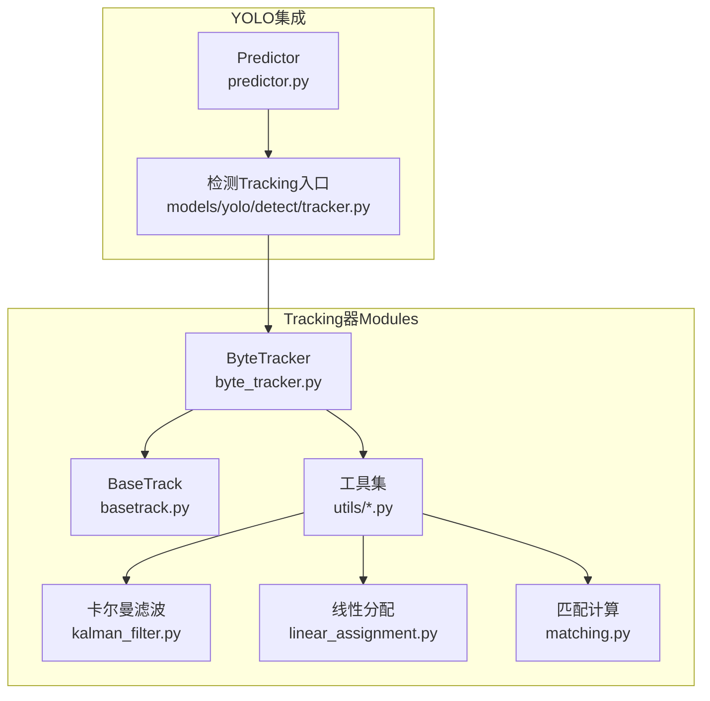
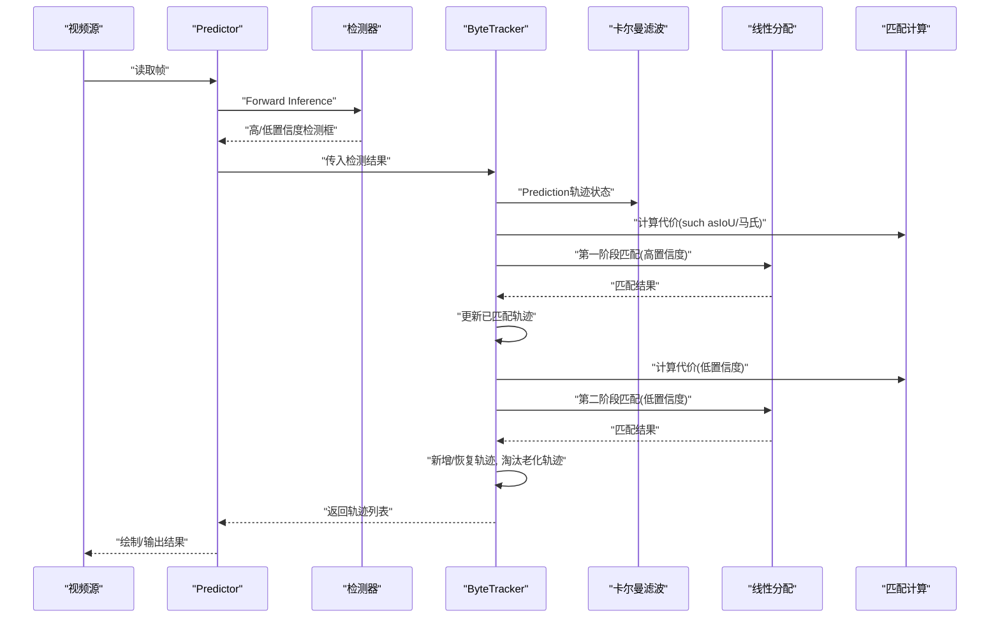
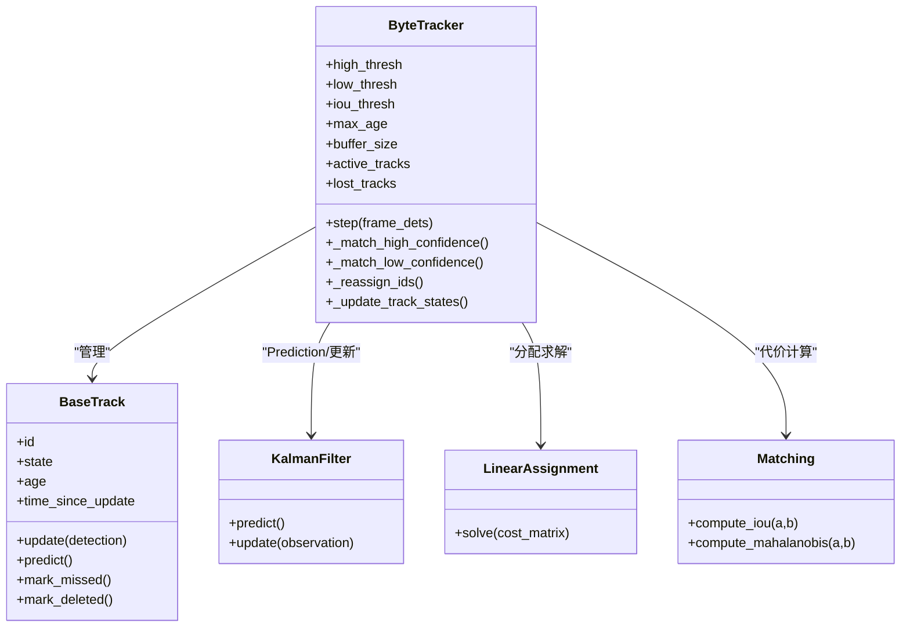
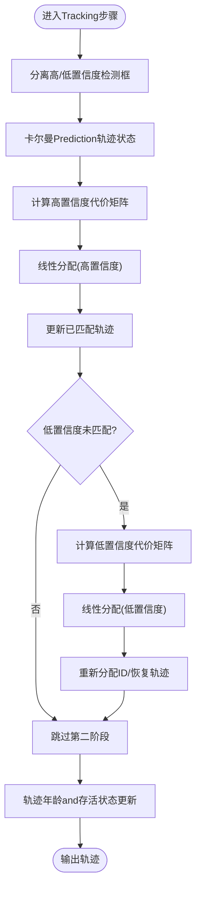
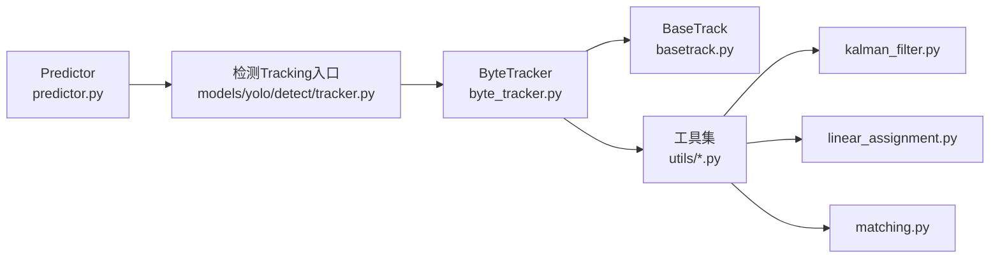

# ByteTrack算法implementing

<cite>
**Files Referenced in This Document**
- [byte_tracker.py](file://ultralytics/trackers/byte_tracker.py)
- [basetrack.py](file://ultralytics/trackers/basetrack.py)
- [deep_oc_sort.py](file://ultralytics/trackers/deep_oc_sort.py)
- [fast_tracker.py](file://ultralytics/trackers/fast_tracker.py)
- [oc_sort.py](file://ultralytics/trackers/oc_sort.py)
- [track.py](file://ultralytics/trackers/track.py)
- [track_tracker.py](file://ultralytics/trackers/track_tracker.py)
- [__init__.py](file://ultralytics/trackers/__init__.py)
- [utils.py](file://ultralytics/trackers/utils/utils.py)
- [kalman_filter.py](file://ultralytics/trackers/utils/kalman_filter.py)
- [linear_assignment.py](file://ultralytics/trackers/utils/linear_assignment.py)
- [matching.py](file://ultralytics/trackers/utils/matching.py)
- [models/yolo/detect/tracker.py](file://ultralytics/models/yolo/detect/tracker.py)
- [engine/predictor.py](file://ultralytics/engine/predictor.py)
- [cfg/trackers/byte.yaml](file://ultralytics/cfg/trackers/byte.yaml)
</cite>

## Table of Contents
1. [Introduction](#Introduction)
2. [Project Structure](#Project Structure)
3. [Core Components](#Core Components)
4. [Architecture Overview](#Architecture Overview)
5. [Detailed Component Analysis](#Detailed Component Analysis)
6. [Dependency Analysis](#Dependency Analysis)
7. [性能考量](#性能考量)
8. [Troubleshooting Guide](#Troubleshooting Guide)
9. [Conclusion](#Conclusion)
10. [Appendix](#Appendix)

## Introduction
本技术Documentation围绕ByteTrackMulti-Object Tracking算法while仓库中的implementing，系统阐述其核心原理、关键参数and匹配策略，重点解释低分检测框重用机制and两阶段匹配Optimization。Documentation同时provides配置模板、UsesExamples、调优建议Centered onandApplicable Scenariosand局限性分析，帮助读者快速理解并高效应用该算法。

## Project Structure
ByteTrackwhileMulti-Object TrackingModules中作for独立Tracking器implementing，并andYOLO检测流程集成。整体结构such as下：
- Tracking器implementing位于 trackers 子包，包含ByteTrackand其工具函数（卡尔曼滤波、线性分配、匹配etc.）。
- YOLO检测Inference时ViaPredictorCallsTracking器，完成“检测—匹配—轨迹更新”的闭环。
- 配置文件provides默认阈值and行for开关，便于while不同数据集和场景下快速切换。

Figure Source
- [byte_tracker.py](file://ultralytics/trackers/byte_tracker.py)
- [basetrack.py](file://ultralytics/trackers/basetrack.py)
- [kalman_filter.py](file://ultralytics/trackers/utils/kalman_filter.py)
- [linear_assignment.py](file://ultralytics/trackers/utils/linear_assignment.py)
- [matching.py](file://ultralytics/trackers/utils/matching.py)
- [predictor.py](file://ultralytics/engine/predictor.py)
- [tracker.py](file://ultralytics/models/yolo/detect/tracker.py)

Section Source
- [byte_tracker.py](file://ultralytics/trackers/byte_tracker.py)
- [predictor.py](file://ultralytics/engine/predictor.py)
- [tracker.py](file://ultralytics/models/yolo/detect/tracker.py)

## Core Components
- ByteTracker：implementing两阶段匹配and低分框重用策略，维护轨迹状态、ID管理and轨迹输出。
- BaseTrack：轨迹基类，Encapsulates轨迹生命周期、状态更新接口andVisualization所需属性。
- 工具库：
  - 卡尔曼滤波：用于运动模型Predictionand观测更新。
  - 线性分配：匈牙利算法或近似求解器，完成检测框and轨迹的代价矩阵最小化匹配。
  - 匹配计算：IoU、马氏距离etc.代价度量。
- 集成层：YOLOPredictorwhile每帧Inference后CallsTracking器进行匹配and轨迹更新。

Section Source
- [byte_tracker.py](file://ultralytics/trackers/byte_tracker.py)
- [basetrack.py](file://ultralytics/trackers/basetrack.py)
- [kalman_filter.py](file://ultralytics/trackers/utils/kalman_filter.py)
- [linear_assignment.py](file://ultralytics/trackers/utils/linear_assignment.py)
- [matching.py](file://ultralytics/trackers/utils/matching.py)

## Architecture Overview
ByteTrackwhileYOLO检测流水线中的工作流such as下：
- 输入帧经检测模型得to高置信度and低置信度两类候选框。
- 第一阶段：对高置信度检测框and现有轨迹进行匹配，更新已存while轨迹。
- 第二阶段：对未被匹配的低置信度检测框and未匹配轨迹再次匹配，Centered on恢复被遮挡或短时漏检的目标。
- 未匹配的轨迹按老化策略逐步淘汰，最终输出稳定轨迹集合。

Figure Source
- [predictor.py](file://ultralytics/engine/predictor.py)
- [byte_tracker.py](file://ultralytics/trackers/byte_tracker.py)
- [kalman_filter.py](file://ultralytics/trackers/utils/kalman_filter.py)
- [linear_assignment.py](file://ultralytics/trackers/utils/linear_assignment.py)
- [matching.py](file://ultralytics/trackers/utils/matching.py)

## Detailed Component Analysis

### ByteTracker 组件分析
ByteTracker的核心while于两阶段匹配and低分框重用：
- 两阶段匹配：先匹配高置信度检测框，再对低置信度检测框进行二次匹配，提升召回率。
- 低分框重用：将低置信度检测框视for潜while真实目标，Combining轨迹Predictionand代价阈值判断是否恢复轨迹。
- 轨迹管理：维护轨迹状态（活跃、隐藏、终止）、ID分配and轨迹寿命控制。
- 代价度量：通常采用IoUand马氏距离组合，兼顾空间重叠and运动一致性。

Figure Source
- [byte_tracker.py](file://ultralytics/trackers/byte_tracker.py)
- [basetrack.py](file://ultralytics/trackers/basetrack.py)
- [kalman_filter.py](file://ultralytics/trackers/utils/kalman_filter.py)
- [linear_assignment.py](file://ultralytics/trackers/utils/linear_assignment.py)
- [matching.py](file://ultralytics/trackers/utils/matching.py)

Section Source
- [byte_tracker.py](file://ultralytics/trackers/byte_tracker.py)
- [basetrack.py](file://ultralytics/trackers/basetrack.py)

#### 两阶段匹配流程（算法流程图）

Figure Source
- [byte_tracker.py](file://ultralytics/trackers/byte_tracker.py)
- [kalman_filter.py](file://ultralytics/trackers/utils/kalman_filter.py)
- [linear_assignment.py](file://ultralytics/trackers/utils/linear_assignment.py)
- [matching.py](file://ultralytics/trackers/utils/matching.py)

Section Source
- [byte_tracker.py](file://ultralytics/trackers/byte_tracker.py)

### 其他Tracking器对比（Refer to）
仓库中还包含其他Tracking器implementing，可作for对照理解ByteTrack的优势：
- DeepOCSort：引入Appearance Features增强匹配鲁棒性。
- FastTracker：侧重速度Optimization的简化匹配策略。
- OCSort：基于运动一致性的基础Tracking器。
- TrackTracker：通用Tracking框架Encapsulates。

Section Source
- [deep_oc_sort.py](file://ultralytics/trackers/deep_oc_sort.py)
- [fast_tracker.py](file://ultralytics/trackers/fast_tracker.py)
- [oc_sort.py](file://ultralytics/trackers/oc_sort.py)
- [track_tracker.py](file://ultralytics/trackers/track_tracker.py)

## Dependency Analysis
ByteTrackerand其依赖Modules的关系such as下：
- ByteTracker依赖BaseTrack进行轨迹对象管理。
- 工具库provides卡尔曼滤波、线性分配and匹配计算。
- YOLOPredictorwhile每帧Inference后CallsTracking器，形成端to端Tracking链路。

Figure Source
- [predictor.py](file://ultralytics/engine/predictor.py)
- [tracker.py](file://ultralytics/models/yolo/detect/tracker.py)
- [byte_tracker.py](file://ultralytics/trackers/byte_tracker.py)
- [basetrack.py](file://ultralytics/trackers/basetrack.py)
- [kalman_filter.py](file://ultralytics/trackers/utils/kalman_filter.py)
- [linear_assignment.py](file://ultralytics/trackers/utils/linear_assignment.py)
- [matching.py](file://ultralytics/trackers/utils/matching.py)

Section Source
- [predictor.py](file://ultralytics/engine/predictor.py)
- [tracker.py](file://ultralytics/models/yolo/detect/tracker.py)
- [byte_tracker.py](file://ultralytics/trackers/byte_tracker.py)

## 性能考量
- 两阶段匹配复杂度：主要受检测框数量and轨迹数量影响，线性分配通常forO(n^3)，可Via阈值裁剪and批量处理降低实际开销。
- 代价矩阵规模：while高密度场景中，建议限制候选框数量或Uses近似分配算法。
- 卡尔曼滤波稳定性：Set appropriately过程噪声and观测噪声，避免过度平滑导致延迟。
- 内存and缓存：轨迹缓冲大小and最大年龄需根据场景调整，避免过多历史轨迹占用资源。
- 并行and向量化：匹配and代价计算可考虑GPU加速或向量化implementingCentered on提升吞吐。

[This section provides general guidance and does not directly analyze specific files]

## Troubleshooting Guide
- 轨迹频繁丢失：检查高/低Confidence Threshold是否过严；适当放宽低Confidence Threshold并增大第二阶段匹配窗口。
- ID跳变严重：确认ID重分配逻辑and轨迹寿命控制；增加轨迹最小存活帧数。
- 匹配错误率高：调整IoUand马氏距离权重；while复杂遮挡场景引入Appearance Features辅助。
- 运行缓慢：减少候选框数量、限制匹配范围、启用近似分配或批处理。
- 初始化不稳定：提高初始Confidence Threshold，确保首帧高质量轨迹建立。

Section Source
- [byte_tracker.py](file://ultralytics/trackers/byte_tracker.py)
- [matching.py](file://ultralytics/trackers/utils/matching.py)
- [linear_assignment.py](file://ultralytics/trackers/utils/linear_assignment.py)

## Conclusion
ByteTrackVia两阶段匹配and低分框重用策略，while复杂遮挡and密集场景下显著提升Tracking稳定性and召回率。合理配置Confidence Threshold、IoU阈值and轨迹寿命参数，并Combining场景特性Optimization匹配代价and分配策略，可while精度and效率之间取得良好平衡。

[This section is summary content and does not directly analyze specific files]

## Appendix

### 关键参数说明
- Confidence Threshold（高/低）：控制检测框进入Tracking的门槛，高阈值保证准确性，低阈值提升召回。
- IoU阈值：决定检测框and轨迹的空间重叠要求，过大易漏配，过小易误配。
- 轨迹最大年龄：控制轨迹存活时长，防止长期未观测目标占用ID。
- 缓冲区大小：限制历史轨迹数量，平衡记忆capabilitiesand内存占用。
- 匹配代价权重：IoUand马氏距离的组合权重，需根据运动模式and遮挡程度调整。

Section Source
- [byte.yaml](file://ultralytics/cfg/trackers/byte.yaml)
- [byte_tracker.py](file://ultralytics/trackers/byte_tracker.py)

### UsesExamplesand配置模板
- 基本用法：whileYOLOPrediction流程中指定Tracking器forByteTrack，并加载对应配置文件。
- 配置模板：Refer to字节Tracking配置文件，设置高/低Confidence Threshold、IoU阈值、最大年龄and缓冲区大小etc.。
- 实战建议：
  - 交通监控：提高IoU阈值，适度放宽低Confidence ThresholdCentered on应对遮挡。
  - 人群Tracking：降低IoU阈值，增加轨迹最大年龄Centered on维持长时关联。
  - 无人机航拍：增大缓冲区and最大年龄，Combined withAppearance Features提升鲁棒性。

Section Source
- [byte.yaml](file://ultralytics/cfg/trackers/byte.yaml)
- [predictor.py](file://ultralytics/engine/predictor.py)
- [tracker.py](file://ultralytics/models/yolo/detect/tracker.py)

### Applicable Scenariosand局限性
- Applicable Scenarios：
  - 复杂遮挡环境（such as十字路口、拥挤人群）。
  - 目标短时消失and重现频繁的场景。
  - 需要较高召回率的实时TrackingTasks。
- 局限性：
  - 高度密集且快速运动目标可能导致匹配歧义。
  - 缺乏Appearance Features时，长时间遮挡下的身份保持capabilities有限。
  - 参数敏感，需针对数据集and硬件平台进行细致调优。

[本节for概念性内容，不直接分析具体文件]