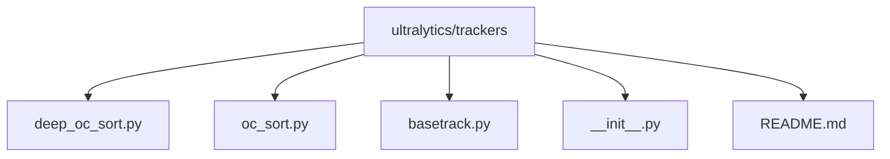
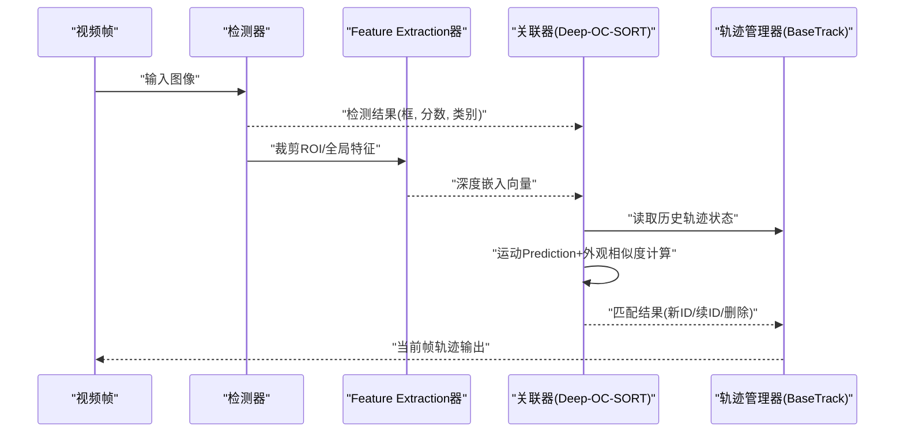
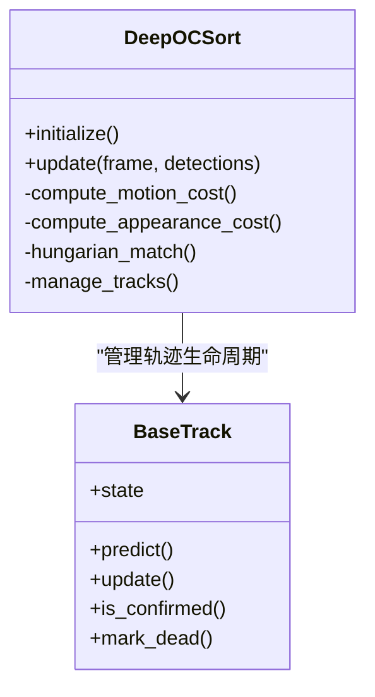
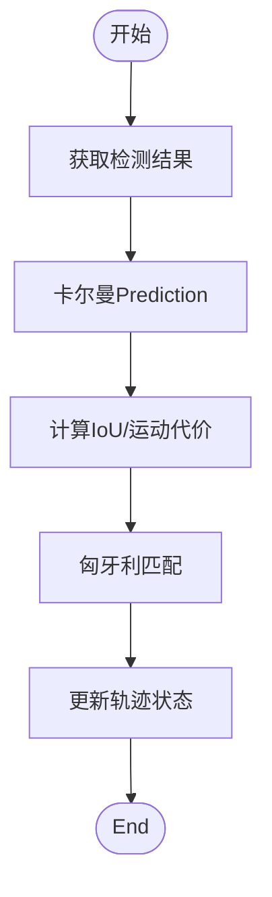
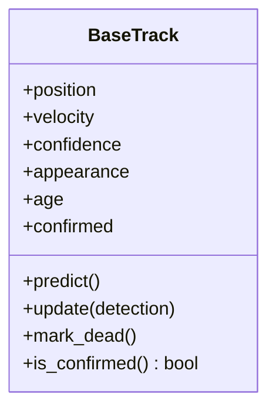
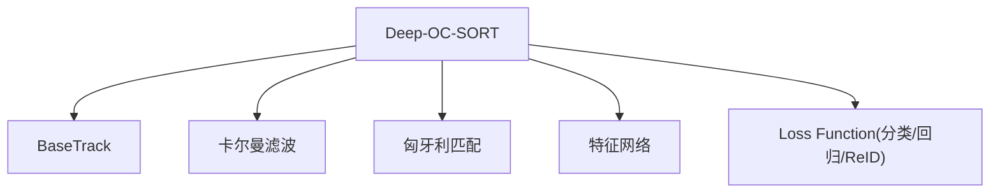

# Deep-OC-SORT算法implementing

<cite>
**Files Referenced in This Document**
- [deep_oc_sort.py](file://ultralytics/trackers/deep_oc_sort.py)
- [oc_sort.py](file://ultralytics/trackers/oc_sort.py)
- [basetrack.py](file://ultralytics/trackers/basetrack.py)
- [__init__.py](file://ultralytics/trackers/__init__.py)
- [README.md](file://ultralytics/trackers/README.md)
</cite>

## Table of Contents
1. [Introduction](#Introduction)
2. [Project Structure](#Project Structure)
3. [Core Components](#Core Components)
4. [Architecture Overview](#Architecture Overview)
5. [Detailed Component Analysis](#Detailed Component Analysis)
6. [Dependency Analysis](#Dependency Analysis)
7. [性能and复杂度](#性能and复杂度)
8. [TrainingandInference指南](#TrainingandInference指南)
9. [故障排查](#故障排查)
10. [Conclusion](#Conclusion)

## Introduction
本技术Documentation围绕仓库中的 Deep-OC-SORT Multi-Object Trackingimplementing，系统阐述其深度学习增强特性、网络架构设计、Loss Function定义、and传统 OC-SORT 的差异and改进、端to端Training策略、InferenceOptimization、权重管理and部署配置，并providesTrainingandInferenceExamplesCentered onand计算复杂度分析andEvaluationMetrics说明。Deep-OC-SORT while经典 OC-SORT 基础上引入深度特征学习，Via可学习的嵌入向量提升跨帧关联鲁棒性，并Supporting端to端联合Optimization检测andRe-Identificationcapabilities。

## Project Structure
Deep-OC-SORT 位于 trackers Modules中，and OC-SORT、ByteTrack、BoT-SORT etc.Tracking器并列管理。关键文件包括：
- deep_oc_sort.py：Deep-OC-SORT 主implementing（含初始化、状态维护、匹配逻辑、更新流程）
- oc_sort.py：传统 OC-SORT Refer toimplementing（用于对比差异）
- basetrack.py：轨迹基类（包含轨迹生命周期、状态表示、Visualization接口etc.）
- __init__.py：Tracking器注册andExport入口
- README.md：Tracking器Uses说明and参数说明

**Figure Source**
- [deep_oc_sort.py](file://ultralytics/trackers/deep_oc_sort.py)
- [oc_sort.py](file://ultralytics/trackers/oc_sort.py)
- [basetrack.py](file://ultralytics/trackers/basetrack.py)
- [__init__.py](file://ultralytics/trackers/__init__.py)
- [README.md](file://ultralytics/trackers/README.md)

**Section Source**
- [deep_oc_sort.py](file://ultralytics/trackers/deep_oc_sort.py)
- [oc_sort.py](file://ultralytics/trackers/oc_sort.py)
- [basetrack.py](file://ultralytics/trackers/basetrack.py)
- [__init__.py](file://ultralytics/trackers/__init__.py)
- [README.md](file://ultralytics/trackers/README.md)

## Core Components
- Deep-OC-SORT Tracking器：Encapsulates了基于深度特征的关联and卡尔曼滤波Prediction，provides端to端TrainingandInference接口。
- 轨迹基类 BaseTrack：统一轨迹对象的生命周期管理、状态表示、运动模型andVisualization方法。
- 传统 OC-SORT：作for对照implementing，仅Uses几何and外观启发式规则进行关联。
- Tracking器Registry：集中管理不同Tracking器的实例化and选择。

**Section Source**
- [deep_oc_sort.py](file://ultralytics/trackers/deep_oc_sort.py)
- [basetrack.py](file://ultralytics/trackers/basetrack.py)
- [oc_sort.py](file://ultralytics/trackers/oc_sort.py)
- [__init__.py](file://ultralytics/trackers/__init__.py)

## Architecture Overview
Deep-OC-SORT 的端to端架构由“检测 + Feature Extraction + 关联 + 轨迹管理”组成。检测输出边界框and类别置信度；Feature Extraction分支生成每目标的深度嵌入；关联阶段Combining运动先验（卡尔曼滤波）and外观相似度（余弦距离或归一化内积）完成匈牙利匹配；轨迹管理器负责轨迹创建、维持、消亡and ID 分配。

**Figure Source**
- [deep_oc_sort.py](file://ultralytics/trackers/deep_oc_sort.py)
- [basetrack.py](file://ultralytics/trackers/basetrack.py)

## Detailed Component Analysis

### Deep-OC-SORT Tracking器
- 初始化and配置：加载深度特征网络、外观相似度阈值、卡尔曼滤波参数、轨迹存活/消亡策略。
- 特征学习：对每个检测目标提取深度嵌入，Supportingwhile线更新and离线Pre-trained Weights加载。
- 关联策略：将运动一致性（卡尔曼Prediction）and外观相似度融合for综合代价矩阵，采用匈牙利算法求解最优匹配。
- 轨迹更新：根据匹配结果更新轨迹状态（位置、速度、外观缓存），处理未匹配的检测and轨迹。
- 端to端Training：Supporting联合OptimizationDetection HeadandFeature Extraction头的损失，包括分类/回归损失andRe-Identification损失（such as InfoNCE）。

**Figure Source**
- [deep_oc_sort.py](file://ultralytics/trackers/deep_oc_sort.py)
- [basetrack.py](file://ultralytics/trackers/basetrack.py)

**Section Source**
- [deep_oc_sort.py](file://ultralytics/trackers/deep_oc_sort.py)
- [basetrack.py](file://ultralytics/trackers/basetrack.py)

### 传统 OC-SORT Tracking器
- 仅依赖几何约束and简单外观启发式，无深度特征学习。
- 关联代价主要由 IoU and运动模型构成，缺少跨长时遮挡的鲁棒性。
- 适用于轻量场景，但while复杂遮挡and外观相似目标下表现受限。

**Figure Source**
- [oc_sort.py](file://ultralytics/trackers/oc_sort.py)

**Section Source**
- [oc_sort.py](file://ultralytics/trackers/oc_sort.py)

### 轨迹基类 BaseTrack
- 状态表示：包含位置、速度、置信度、外观缓存、年龄、确认状态etc.。
- 运动模型：线性高斯卡尔曼滤波，SupportingPredictionand更新步骤。
- 生命周期：创建、确认、维持、消亡的Unified Interface，便于上层Tracking器复用。

**Figure Source**
- [basetrack.py](file://ultralytics/trackers/basetrack.py)

**Section Source**
- [basetrack.py](file://ultralytics/trackers/basetrack.py)

### and传统 OC-SORT 的差异and改进
- 深度特征学习：Deep-OC-SORT 引入可学习的嵌入空间，显著提升跨帧外观一致性。
- 端to端Training：联合Optimization检测andRe-Identification损失，避免两阶段误差累积。
- 关联代价融合：同时考虑运动一致性and外观相似度，提高遮挡恢复capabilities。
- while线自适应：Supportingwhile线更新外观缓存and特征分布，适应动态场景。

**Section Source**
- [deep_oc_sort.py](file://ultralytics/trackers/deep_oc_sort.py)
- [oc_sort.py](file://ultralytics/trackers/oc_sort.py)

## Dependency Analysis
Deep-OC-SORT 依赖Centered on下Modules：
- 轨迹基类：provides统一的轨迹对象and生命周期管理。
- 卡尔曼滤波：用于运动Predictionand更新。
- 匈牙利匹配：用于最优分配。
- 特征网络：用于提取深度嵌入。
- Loss Function：分类/回归损失andRe-IdentificationLoss combination。

**Figure Source**
- [deep_oc_sort.py](file://ultralytics/trackers/deep_oc_sort.py)
- [basetrack.py](file://ultralytics/trackers/basetrack.py)

**Section Source**
- [deep_oc_sort.py](file://ultralytics/trackers/deep_oc_sort.py)
- [basetrack.py](file://ultralytics/trackers/basetrack.py)

## 性能and复杂度
- 时间复杂度：
  - Feature Extraction：O(N·C)，N for目标数，C for特征维度。
  - 关联代价矩阵：O(N·M)，N for检测数，M for轨迹数。
  - 匈牙利匹配：O((N+M)^3)。
  - 卡尔曼Prediction/更新：O(M·d^3)，d for状态维度。
- 空间复杂度：
  - 外观缓存：O(M·C)。
  - 轨迹状态：O(M·d)。
- EvaluationMetrics：
  - MOTA、MOTP、IDF1、IDs、MT、ML、FP、FN etc. MOT 标准Metrics。
  - Re-Identification精度：Top-1/Top-5 准确率、mAP（若适用）。

[本节for通用性能讨论，不直接分析具体文件]

## TrainingandInference指南

### Training策略
- Data Preparation：Uses带标注的Multi-Object Tracking数据集（such as MOT17/MOT20/VisDrone），确保时序标注完整。
- Loss Function：
  - 检测损失：分类交叉熵 + 定位回归损失（such as CIoU）。
  - Re-Identification损失：InfoNCE 或 Triplet Loss，拉近同 ID 样本、推远异 ID 样本。
  - 总损失：加权组合，平衡检测and ReID 贡献。
- Optimizerand调度：AdamW 或 SGD，Combined with余弦退火或阶梯衰减。
- 端to端Training：冻结/解冻策略，逐步放开特征网络andDetection Head，稳定收敛。
- Validationand早停：基于Validation集 IDF1 或 MOTA 监控，防止过拟合。

**Section Source**
- [deep_oc_sort.py](file://ultralytics/trackers/deep_oc_sort.py)
- [README.md](file://ultralytics/trackers/README.md)

### InferenceOptimization
- 批处理and流水线：并行Feature Extractionand关联，减少etc.待时间。
- 近似最近邻检索：Uses FAISS 或局部敏感哈希加速外观匹配。
- 低精度Inference：FP16/INT8 量化，降低内存and延迟。
- Model Export：ONNX/TensorRT/OpenVINO Export，适配边缘设备。
- 动态阈值：根据场景调整外观相似度阈值and卡尔曼噪声协方差。

**Section Source**
- [deep_oc_sort.py](file://ultralytics/trackers/deep_oc_sort.py)
- [README.md](file://ultralytics/trackers/README.md)

### 模型权重管理and部署配置
- 权重保存：按 epoch and最佳Metrics保存Checkpoint，记录超参and环境信息。
- 版本控制：Uses模型Registry或 Hub 管理权重版本and元数据。
- 部署清单：包含模型文件、配置文件、依赖库版本and硬件要求。
- 热更新：Supporting运行时切换权重and阈值，无需重启服务。

**Section Source**
- [deep_oc_sort.py](file://ultralytics/trackers/deep_oc_sort.py)
- [README.md](file://ultralytics/trackers/README.md)

### TrainingandInferenceExamples
- TrainingExamples：
  - 指定数据集路径、模型配置andTraining脚本。
  - 设置损失权重、Learning RateandBatch Size。
  - 启动Distributed Training（DDP）Centered on提升吞吐。
- InferenceExamples：
  - 加载Pre-trained WeightsandTracking器配置。
  - 输入视频流或图像序列，输出轨迹andVisualization结果。
  - Exporting to ONNX/TensorRT 并while服务端部署。

**Section Source**
- [README.md](file://ultralytics/trackers/README.md)
- [deep_oc_sort.py](file://ultralytics/trackers/deep_oc_sort.py)

## 故障排查
- 常见问题：
  - 外观相似度阈值过高/过低导致 ID 切换或漏检。
  - 卡尔曼噪声协方差设置不当导致轨迹漂移。
  - 特征网络未收敛导致 ReID 效果差。
- 诊断工具：
  - Logging：打印匹配代价矩阵、未匹配项and轨迹状态变化。
  - Visualization：绘制轨迹、匹配边and外观相似度分布。
  - Metrics监控：实时统计 MOTA、IDF1 and丢失/重复计数。
- 修复建议：
  - 调整阈值and协方差，进行网格搜索或贝叶斯Optimization。
  - 增加Data Augmentationand难例挖掘，提升特征判别力。
  - Uses半监督或自监督预Training，缓解标注不足。

**Section Source**
- [deep_oc_sort.py](file://ultralytics/trackers/deep_oc_sort.py)
- [README.md](file://ultralytics/trackers/README.md)

## Conclusion
Deep-OC-SORT while传统 OC-SORT 的基础上引入深度特征学习and端to端Training，显著提升了Multi-Object Trackingwhile复杂场景下的鲁棒性and准确性。Via合理的损失设计、关联策略andInferenceOptimization，该算法While maintaining高效implementing了更好的跨帧关联capabilities。未来工作可进一步探索轻量化特征网络、while线自适应机制and跨域泛化capabilities，Centered on满足更广泛的工业应用需求。