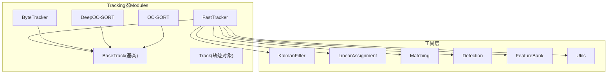
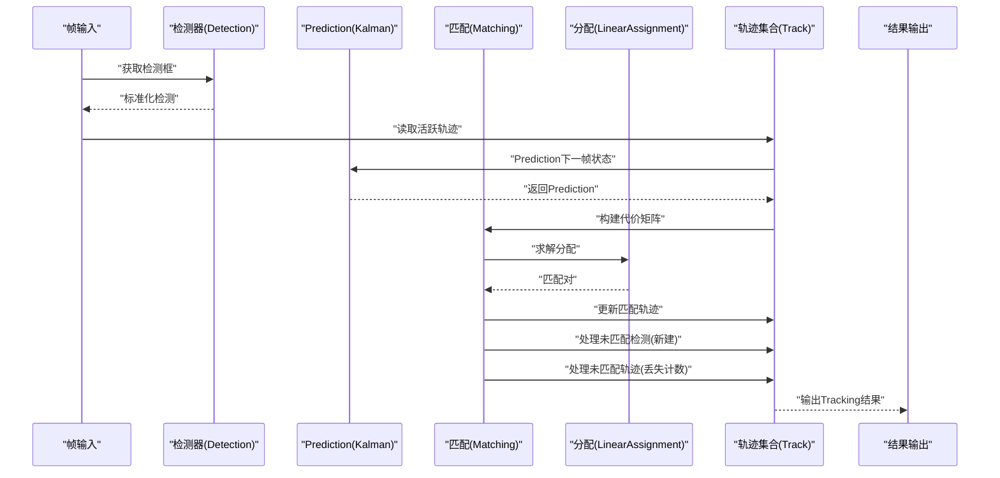
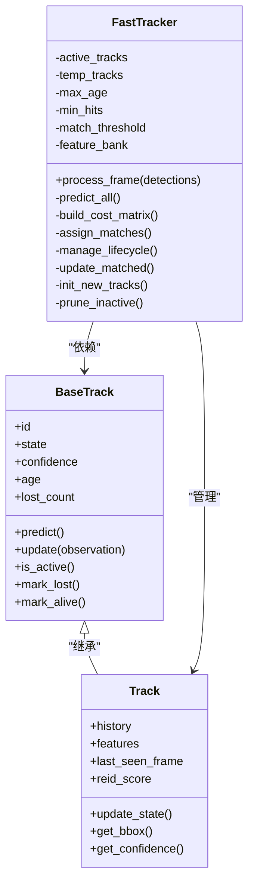
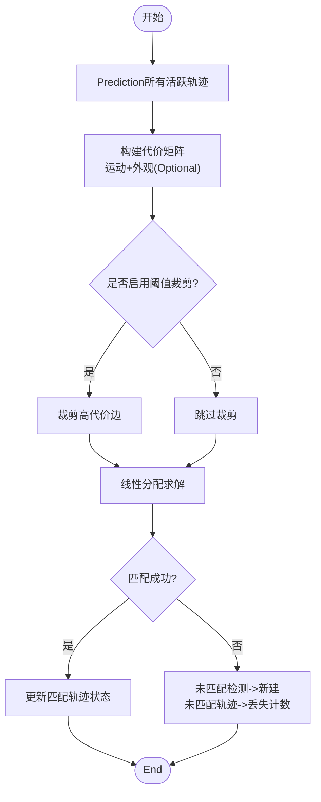
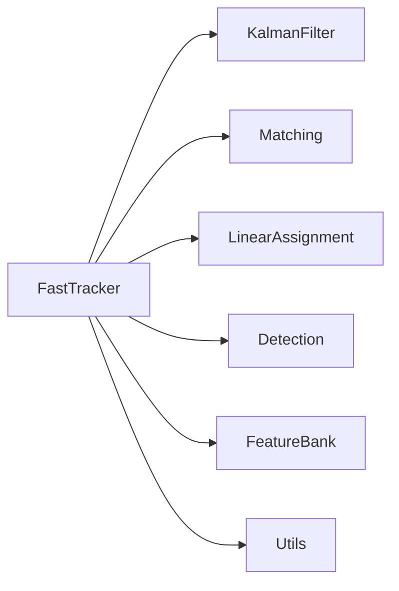

# FastTracker算法implementing

<cite>
**Files Referenced in This Document**
- [fast_tracker.py](file://ultralytics/trackers/fast_tracker.py)
- [basetrack.py](file://ultralytics/trackers/basetrack.py)
- [byte_tracker.py](file://ultralytics/trackers/byte_tracker.py)
- [deep_oc_sort.py](file://ultralytics/trackers/deep_oc_sort.py)
- [oc_sort.py](file://ultralytics/trackers/oc_sort.py)
- [track.py](file://ultralytics/trackers/track.py)
- [__init__.py](file://ultralytics/trackers/__init__.py)
- [README.md](file://ultralytics/trackers/README.md)
- [utils.py](file://ultralytics/trackers/utils/utils.py)
- [kalman_filter.py](file://ultralytics/trackers/utils/kalman_filter.py)
- [linear_assignment.py](file://ultralytics/trackers/utils/linear_assignment.py)
- [matching.py](file://ultralytics/trackers/utils/matching.py)
- [detection.py](file://ultralytics/trackers/utils/detection.py)
- [feature_bank.py](file://ultralytics/trackers/utils/feature_bank.py)
- [benchmark_molora_dispatch.py](file://benchmarks/benchmark_molora_dispatch.py)
- [benchmark_mot_dispatch.py](file://benchmarks/benchmark_mot_dispatch.py)
- [suite.py](file://benchmarks/suite.py)
- [run.py](file://benchmarks/run.py)
</cite>

## Table of Contents
1. [Introduction](#Introduction)
2. [Project Structure](#Project Structure)
3. [Core Components](#Core Components)
4. [Architecture Overview](#Architecture Overview)
5. [Detailed Component Analysis](#Detailed Component Analysis)
6. [Dependency Analysis](#Dependency Analysis)
7. [性能考量](#性能考量)
8. [Troubleshooting Guide](#Troubleshooting Guide)
9. [Conclusion](#Conclusion)
10. [Appendix](#Appendix)

## Introduction
本技术Documentation聚焦于FastTracker算法的implementingand工程化落地，围绕其高效设计理念、实时Optimization策略、轻量化设计and计算效率Optimization进行深入解析。Documentation同时覆盖快速匹配算法and内存管理机制，给出while资源受限环境下的部署考虑、基准测试and对比分析方法、具体部署Examplesand调优指南，并明确Applicable Scenariosand硬件要求。

## Project Structure
FastTracker位于Tracking器Modules中，遵循“基类抽象 + 多implementing”的Modules化组织方式：
- 基类定义通用接口and公共capabilities（such as轨迹生命周期管理、状态表示etc.）
- FastTracker作for轻量级实时Trackingimplementing，强调低延迟and高吞吐
- 其他Tracking器（such asByteTrack、DeepOC-SORT、OC-SORT）provides不同权衡方案Centered on供对比and选择
- 工具层provides卡尔曼滤波、线性分配、特征库、检测Encapsulatesetc.支撑

Figure Source
- [fast_tracker.py:1-200](file://ultralytics/trackers/fast_tracker.py#L1-L200)
- [basetrack.py:1-200](file://ultralytics/trackers/basetrack.py#L1-L200)
- [byte_tracker.py:1-200](file://ultralytics/trackers/byte_tracker.py#L1-L200)
- [deep_oc_sort.py:1-200](file://ultralytics/trackers/deep_oc_sort.py#L1-L200)
- [oc_sort.py:1-200](file://ultralytics/trackers/oc_sort.py#L1-L200)
- [track.py:1-200](file://ultralytics/trackers/track.py#L1-L200)
- [kalman_filter.py:1-200](file://ultralytics/trackers/utils/kalman_filter.py#L1-L200)
- [linear_assignment.py:1-200](file://ultralytics/trackers/utils/linear_assignment.py#L1-L200)
- [matching.py:1-200](file://ultralytics/trackers/utils/matching.py#L1-L200)
- [detection.py:1-200](file://ultralytics/trackers/utils/detection.py#L1-L200)
- [feature_bank.py:1-200](file://ultralytics/trackers/utils/feature_bank.py#L1-L200)
- [utils.py:1-200](file://ultralytics/trackers/utils/utils.py#L1-L200)

Section Source
- [README.md](file://ultralytics/trackers/README.md)
- [__init__.py](file://ultralytics/trackers/__init__.py)

## Core Components
- BaseTrack：定义轨迹对象的Unified Interfaceand生命周期管理，包括ID、状态机、可见性、置信度、历史状态缓存etc.。
- Track：具体轨迹实例，承载Prediction位置、观测更新、年龄、丢失计数、Re-Identification特征etc.。
- FastTracker：targeting实时的Tracking器implementing，采用轻量化的数据关联and状态更新策略，强调低开销and稳定ID保持。
- 工具组件：
  - KalmanFilter：目标运动模型andPrediction/更新
  - LinearAssignment：匈牙利或近似线性分配求解
  - Matching：代价矩阵构建and匹配策略
  - Detection：检测框标准化and过滤
  - FeatureBank：Appearance Features缓存and检索（Optional）
  - Utils：几何变换、IOU计算、Visualization辅助etc.

Section Source
- [basetrack.py:1-200](file://ultralytics/trackers/basetrack.py#L1-L200)
- [track.py:1-200](file://ultralytics/trackers/track.py#L1-L200)
- [fast_tracker.py:1-200](file://ultralytics/trackers/fast_tracker.py#L1-L200)
- [kalman_filter.py:1-200](file://ultralytics/trackers/utils/kalman_filter.py#L1-L200)
- [linear_assignment.py:1-200](file://ultralytics/trackers/utils/linear_assignment.py#L1-L200)
- [matching.py:1-200](file://ultralytics/trackers/utils/matching.py#L1-L200)
- [detection.py:1-200](file://ultralytics/trackers/utils/detection.py#L1-L200)
- [feature_bank.py:1-200](file://ultralytics/trackers/utils/feature_bank.py#L1-L200)
- [utils.py:1-200](file://ultralytics/trackers/utils/utils.py#L1-L200)

## Architecture Overview
FastTracker的整体流程such as下：
- 输入帧预处理and检测输出标准化
- 对每个活跃轨迹进行运动Prediction
- 构建检测and轨迹之间的代价矩阵（运动+外观Optional）
- Uses线性分配完成匹配
- 未匹配检测初始化新轨迹
- 未匹配轨迹进入丢失计数and消亡判定
- 更新已匹配轨迹的状态（卡尔曼更新）
- 输出当前帧Tracking结果

Figure Source
- [fast_tracker.py:1-200](file://ultralytics/trackers/fast_tracker.py#L1-L200)
- [kalman_filter.py:1-200](file://ultralytics/trackers/utils/kalman_filter.py#L1-L200)
- [linear_assignment.py:1-200](file://ultralytics/trackers/utils/linear_assignment.py#L1-L200)
- [matching.py:1-200](file://ultralytics/trackers/utils/matching.py#L1-L200)
- [detection.py:1-200](file://ultralytics/trackers/utils/detection.py#L1-L200)
- [track.py:1-200](file://ultralytics/trackers/track.py#L1-L200)

## Detailed Component Analysis

### FastTracker类分析
FastTracker是targeting实时场景的Tracking器implementing，重点while于：
- 轻量化设计：减少不必要的特征计算and存储，Prefer运动信息drivers are installed匹配
- 快速匹配：Via合理的代价函数and阈值控制降低分配复杂度
- 内存管理：对轨迹历史andAppearance Features进行有界缓存and淘汰策略
- 鲁棒性：对遮挡and短暂丢失具备恢复capabilities

Figure Source
- [basetrack.py:1-200](file://ultralytics/trackers/basetrack.py#L1-L200)
- [track.py:1-200](file://ultralytics/trackers/track.py#L1-L200)
- [fast_tracker.py:1-200](file://ultralytics/trackers/fast_tracker.py#L1-L200)

Section Source
- [fast_tracker.py:1-200](file://ultralytics/trackers/fast_tracker.py#L1-L200)
- [basetrack.py:1-200](file://ultralytics/trackers/basetrack.py#L1-L200)
- [track.py:1-200](file://ultralytics/trackers/track.py#L1-L200)

### 快速匹配算法and代价函数
FastTracker的匹配阶段通常包含：
- 运动代价：基于卡尔曼Predictionand检测框的IoU或马氏距离
- 外观代价（Optional）：基于特征相似度，但for轻量化可关闭或降采样
- 阈值裁剪：仅保留低于阈值的候选边，减少分配规模
- 分配求解：线性分配器while稀疏图上运行，提升速度

Figure Source
- [matching.py:1-200](file://ultralytics/trackers/utils/matching.py#L1-L200)
- [linear_assignment.py:1-200](file://ultralytics/trackers/utils/linear_assignment.py#L1-L200)
- [kalman_filter.py:1-200](file://ultralytics/trackers/utils/kalman_filter.py#L1-L200)
- [fast_tracker.py:1-200](file://ultralytics/trackers/fast_tracker.py#L1-L200)

Section Source
- [matching.py:1-200](file://ultralytics/trackers/utils/matching.py#L1-L200)
- [linear_assignment.py:1-200](file://ultralytics/trackers/utils/linear_assignment.py#L1-L200)
- [kalman_filter.py:1-200](file://ultralytics/trackers/utils/kalman_filter.py#L1-L200)
- [fast_tracker.py:1-200](file://ultralytics/trackers/fast_tracker.py#L1-L200)

### 内存管理and轻量化策略
- 轨迹历史有界缓存：限制历史长度，避免无限增长
- Appearance Features按需计算and淘汰：仅while必要时提取特征，定期清理旧特征
- 临时轨迹池：未确认轨迹短期存while，达to命中次数后转正
- 垃圾回收：超过最大年龄或丢失计数的轨迹and时释放

Section Source
- [feature_bank.py:1-200](file://ultralytics/trackers/utils/feature_bank.py#L1-L200)
- [fast_tracker.py:1-200](file://ultralytics/trackers/fast_tracker.py#L1-L200)
- [track.py:1-200](file://ultralytics/trackers/track.py#L1-L200)

### and其他Tracking器的对比定位
- ByteTracker：侧重检测召回and关联稳定性，适合复杂场景
- DeepOC-SORT：引入深度Appearance Features，精度更高但开销更大
- OC-SORT：经典SORT改进，平衡速度and精度
- FastTracker：Centered on实时性and轻量化for核心，适合边缘设备and高帧率需求

Section Source
- [byte_tracker.py:1-200](file://ultralytics/trackers/byte_tracker.py#L1-L200)
- [deep_oc_sort.py:1-200](file://ultralytics/trackers/deep_oc_sort.py#L1-L200)
- [oc_sort.py:1-200](file://ultralytics/trackers/oc_sort.py#L1-L200)
- [fast_tracker.py:1-200](file://ultralytics/trackers/fast_tracker.py#L1-L200)

## Dependency Analysis
FastTrackerand其工具层的依赖关系such as下：
- 运动模型依赖KalmanFilter
- 匹配逻辑依赖MatchingandLinearAssignment
- 检测输入依赖DetectionEncapsulates
- Appearance Features依赖FeatureBank（Optional）
- 通用工具依赖Utils

Figure Source
- [fast_tracker.py:1-200](file://ultralytics/trackers/fast_tracker.py#L1-L200)
- [kalman_filter.py:1-200](file://ultralytics/trackers/utils/kalman_filter.py#L1-L200)
- [linear_assignment.py:1-200](file://ultralytics/trackers/utils/linear_assignment.py#L1-L200)
- [matching.py:1-200](file://ultralytics/trackers/utils/matching.py#L1-L200)
- [detection.py:1-200](file://ultralytics/trackers/utils/detection.py#L1-L200)
- [feature_bank.py:1-200](file://ultralytics/trackers/utils/feature_bank.py#L1-L200)
- [utils.py:1-200](file://ultralytics/trackers/utils/utils.py#L1-L200)

Section Source
- [fast_tracker.py:1-200](file://ultralytics/trackers/fast_tracker.py#L1-L200)
- [kalman_filter.py:1-200](file://ultralytics/trackers/utils/kalman_filter.py#L1-L200)
- [linear_assignment.py:1-200](file://ultralytics/trackers/utils/linear_assignment.py#L1-L200)
- [matching.py:1-200](file://ultralytics/trackers/utils/matching.py#L1-L200)
- [detection.py:1-200](file://ultralytics/trackers/utils/detection.py#L1-L200)
- [feature_bank.py:1-200](file://ultralytics/trackers/utils/feature_bank.py#L1-L200)
- [utils.py:1-200](file://ultralytics/trackers/utils/utils.py#L1-L200)

## 性能考量
- 实时性Optimization
  - 关闭或降采样Appearance Features，Prefer运动信息
  - Set appropriately匹配阈值，减少无效候选边
  - 限制轨迹历史长度and特征缓存大小
- 计算效率
  - Uses稀疏代价矩阵and阈值裁剪
  - 批量操作and向量化计算
  - 避免每帧重复构造大型数据结构
- 内存占用
  - 有界缓存and定期清理
  - 临时轨迹池复用
  - 特征向量类型and尺寸Optimization
- 资源受限部署
  - CPU优先路径，减少GPU依赖
  - 低精度Inferenceand量化（若可用）
  - 线程安全and无锁队列（视系统而定）

[This section provides general guidance and does not directly analyze specific files]

## Troubleshooting Guide
- 常见问题
  - ID频繁切换：检查匹配阈值and丢失计数参数
  - 漏检导致轨迹中断：调整检测阈值and最小命中次数
  - 内存持续增长：确认历史长度and特征缓存上限
  - 延迟过高：关闭Appearance Features、降低分辨率或批大小
- 调试建议
  - 打印匹配代价分布and分配结果
  - 记录轨迹生命周期事件（新建、丢失、消亡）
  - VisualizationPredictionand观测对齐情况

Section Source
- [fast_tracker.py:1-200](file://ultralytics/trackers/fast_tracker.py#L1-L200)
- [track.py:1-200](file://ultralytics/trackers/track.py#L1-L200)
- [utils.py:1-200](file://ultralytics/trackers/utils/utils.py#L1-L200)

## Conclusion
FastTrackerCentered on轻量化and实时性forCore Objective，Via运动drivers are installed的匹配、阈值裁剪and有界缓存etc.策略，while资源受限环境下仍能provides稳定的Tracking效果。对于需要高帧率and低延迟的场景，FastTracker是合适的选择；而while复杂遮挡and长时遮挡场景中，可CombiningByteTrack或DeepOC-SORTCentered on获得更高的鲁棒性and精度。

[This section is summary content and does not directly analyze specific files]

## Appendix

### 部署Examplesand调优指南
- 基本流程
  - 加载检测器andFastTracker实例
  - 逐帧读取视频或摄像头流
  - CallsTracking器处理检测输出
  - 保存或Visualization结果
- 关键参数调优
  - 匹配阈值：根据场景密度and遮挡程度调整
  - 最大年龄and最小命中：影响轨迹稳定性and新建速度
  - Appearance Features开关and维度：while精度and速度间权衡
- 性能基准and对比
  - UsesBenchmark SuiteEvaluationFPS、延迟and内存占用
  - andByteTrack、DeepOC-SORT、OC-SORT进行对比
  - while不同分辨率and批大小下Evaluation

Section Source
- [README.md](file://ultralytics/trackers/README.md)
- [benchmark_molora_dispatch.py:1-200](file://benchmarks/benchmark_molora_dispatch.py#L1-L200)
- [benchmark_mot_dispatch.py:1-200](file://benchmarks/benchmark_mot_dispatch.py#L1-L200)
- [suite.py:1-200](file://benchmarks/suite.py#L1-L200)
- [run.py:1-200](file://benchmarks/run.py#L1-L200)

### Applicable Scenariosand硬件要求
- Applicable Scenarios
  - 高帧率监控、边缘设备实时Tracking、移动端应用
  - 对延迟敏感且目标运动相对平滑的场景
- 硬件要求
  - CPU平台即可运行，推荐SupportingSIMD指令集
  - GPUOptional，用于加速检测或Appearance Features计算
  - 内存建议≥2GB，显存≥1GB（若UsesGPU）

[This section provides general guidance and does not directly analyze specific files]