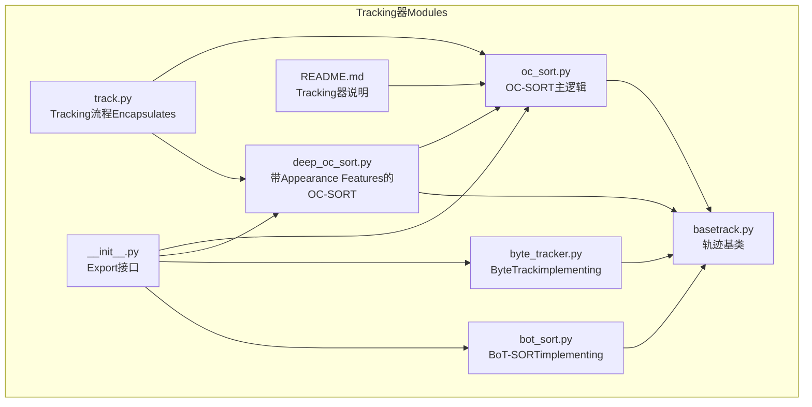
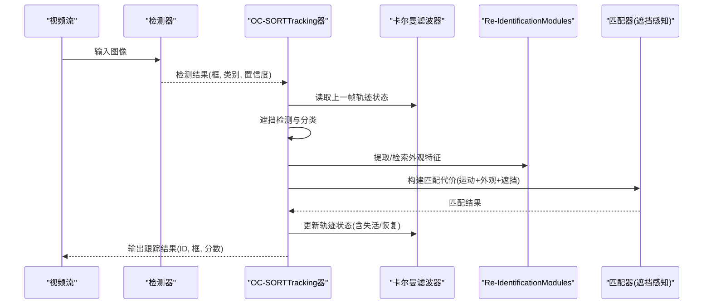
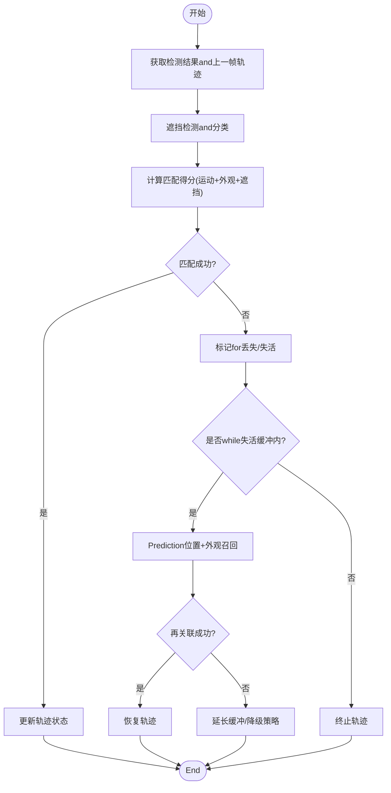
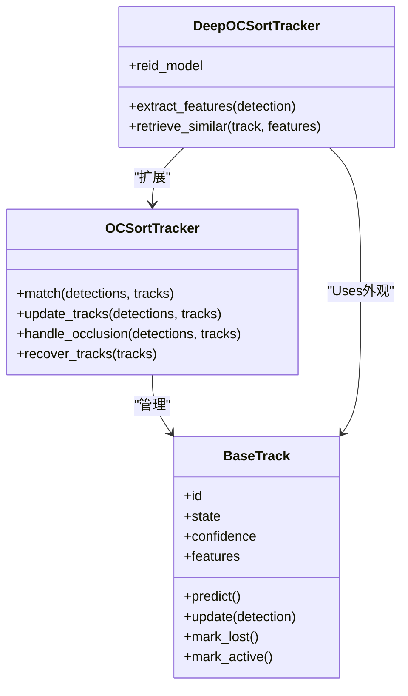
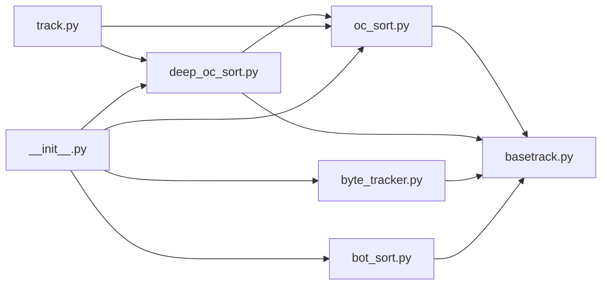

# OC-SORT算法implementing

<cite>
**Files Referenced in This Document**
- [oc_sort.py](file://ultralytics/trackers/oc_sort.py)
- [basetrack.py](file://ultralytics/trackers/basetrack.py)
- [deep_oc_sort.py](file://ultralytics/trackers/deep_oc_sort.py)
- [byte_tracker.py](file://ultralytics/trackers/byte_tracker.py)
- [bot_sort.py](file://ultralytics/trackers/bot_sort.py)
- [track.py](file://ultralytics/trackers/track.py)
- [__init__.py](file://ultralytics/trackers/__init__.py)
- [README.md](file://ultralytics/trackers/README.md)
</cite>

## Table of Contents
1. [Introduction](#Introduction)
2. [Project Structure](#Project Structure)
3. [Core Components](#Core Components)
4. [Architecture Overview](#Architecture Overview)
5. [Detailed Component Analysis](#Detailed Component Analysis)
6. [Dependency Analysis](#Dependency Analysis)
7. [性能考量](#性能考量)
8. [Troubleshooting Guide](#Troubleshooting Guide)
9. [Conclusion](#Conclusion)
10. [Appendix](#Appendix)

## Introduction
本技术Documentation围绕OC-SORT（遮挡感知排序）whileMulti-Object Tracking中的implementingunfold，重点解释其核心思想：遮挡感知排序and轨迹一致性维护。Documentation将深入剖析遮挡检测机制、轨迹恢复策略、长时间遮挡下的鲁棒性设计，并系统阐述关键Modules（遮挡分类器、轨迹评分函数、Re-IdentificationModules）的职责and交互。同时provides参数配置方法、调优经验、UsesExamplesand遮挡场景处理案例，并对and其他方法的改进点and性能优势进行对比说明。

## Project Structure
仓库中andMulti-Object Tracking相关的代码集中while trackers Table of Contents下，其中 oc_sort.py forOC-SORT的核心implementing，basetrack.py 定义了轨迹基类，deep_oc_sort.py whileOC-SORT基础上引入Appearance FeaturesCentered on增强遮挡恢复capabilities，其他such as byte_tracker.py、bot_sort.py etc.provides了可对比的Tracking器implementing。

Figure Source
- [oc_sort.py](file://ultralytics/trackers/oc_sort.py)
- [basetrack.py](file://ultralytics/trackers/basetrack.py)
- [deep_oc_sort.py](file://ultralytics/trackers/deep_oc_sort.py)
- [byte_tracker.py](file://ultralytics/trackers/byte_tracker.py)
- [bot_sort.py](file://ultralytics/trackers/bot_sort.py)
- [track.py](file://ultralytics/trackers/track.py)
- [__init__.py](file://ultralytics/trackers/__init__.py)
- [README.md](file://ultralytics/trackers/README.md)

Section Source
- [oc_sort.py](file://ultralytics/trackers/oc_sort.py)
- [basetrack.py](file://ultralytics/trackers/basetrack.py)
- [deep_oc_sort.py](file://ultralytics/trackers/deep_oc_sort.py)
- [byte_tracker.py](file://ultralytics/trackers/byte_tracker.py)
- [bot_sort.py](file://ultralytics/trackers/bot_sort.py)
- [track.py](file://ultralytics/trackers/track.py)
- [__init__.py](file://ultralytics/trackers/__init__.py)
- [README.md](file://ultralytics/trackers/README.md)

## Core Components
- 遮挡感知排序：while匹配阶段对候选检测and现有轨迹进行排序时显式考虑遮挡状态，降低误匹配风险，提升遮挡场景下的稳定性。
- 轨迹一致性维护：Via卡尔曼滤波Prediction、时序一致性and外观相似度etc.多源证据融合，维持轨迹ID稳定，减少ID切换。
- 遮挡检测机制：基于检测置信度、IoU、运动一致性Centered onandOptional的Appearance Features判别遮挡程度，形成遮挡分类信号。
- 轨迹恢复策略：对丢失轨迹设置“失活”缓冲期，CombiningPrediction位置and外观召回进行再关联；长时间遮挡下采用更宽松的匹配阈值and延迟激活策略。
- 关键Modules：
  - 遮挡分类器：输出当前帧中检测或轨迹的遮挡概率或etc.级。
  - 轨迹评分函数：综合运动距离、外观相似度、遮挡状态、历史一致性etc.计算匹配得分。
  - Re-IdentificationModules：提取并比对Appearance Features，用于遮挡后重新关联。

Section Source
- [oc_sort.py](file://ultralytics/trackers/oc_sort.py)
- [deep_oc_sort.py](file://ultralytics/trackers/deep_oc_sort.py)
- [basetrack.py](file://ultralytics/trackers/basetrack.py)

## Architecture Overview
OC-SORT的整体流程包括：读取上一帧轨迹状态and模型Prediction结果，执行遮挡检测and分类，构建匹配代价矩阵并进行匈牙利匹配，更新轨迹状态（包含失活and恢复），最终输出当前帧Tracking结果。

Figure Source
- [oc_sort.py](file://ultralytics/trackers/oc_sort.py)
- [deep_oc_sort.py](file://ultralytics/trackers/deep_oc_sort.py)
- [basetrack.py](file://ultralytics/trackers/basetrack.py)

## Detailed Component Analysis

### 遮挡分类器
- 职责：根据检测置信度、IoU、运动残差and外观相似度etc.Metrics，判定当前检测或轨迹是否处于遮挡状态，输出遮挡etc.级或概率。
- 设计要点：
  - 低置信度检测更易被判定for遮挡或噪声。
  - and最近邻轨迹的IoU较低且运动不一致时，倾向于遮挡。
  - 外观相似度显著下降可作for遮挡辅助证据。
- 输出：遮挡标签或概率，供匹配代价and轨迹恢复策略Uses。

Section Source
- [oc_sort.py](file://ultralytics/trackers/oc_sort.py)
- [deep_oc_sort.py](file://ultralytics/trackers/deep_oc_sort.py)

### 轨迹评分函数
- 职责：for候选检测and轨迹对计算匹配得分，作for匹配器的依据。
- 组成要素：
  - 运动距离：通常基于马氏距离或欧氏距离，衡量Prediction位置and检测位置的接近程度。
  - 外观相似度：由Re-IdentificationModulesprovides的特征余弦相似度或嵌入距离。
  - 遮挡惩罚：若任一对象被判定for遮挡，则相应降低匹配得分。
  - 历史一致性：轨迹的存活时长、近期匹配成功率etc.作for先验权重。
- 输出：标量得分，用于匈牙利匹配或贪心匹配。

Section Source
- [oc_sort.py](file://ultralytics/trackers/oc_sort.py)
- [deep_oc_sort.py](file://ultralytics/trackers/deep_oc_sort.py)

### Re-IdentificationModules
- 职责：提取检测框的Appearance Features，并while需要时检索已有轨迹的特征库，完成遮挡后的再关联。
- 关键点：
  - 特征归一化and缓存管理，避免重复计算。
  - 特征更新策略：仅while可靠匹配后更新轨迹外观，防止漂移。
  - 相似度阈值and回退策略：当外观不可靠时退回仅运动匹配。

Section Source
- [deep_oc_sort.py](file://ultralytics/trackers/deep_oc_sort.py)
- [basetrack.py](file://ultralytics/trackers/basetrack.py)

### 遮挡检测机制and轨迹恢复策略
- 遮挡检测：
  - 规则and学习相Combining：基于置信度、IoU、运动一致性etc.启发式规则，并可Combining轻量分类器输出。
  - 分级遮挡：轻度、中度、重度遮挡分别影响匹配代价and恢复策略。
- 轨迹恢复：
  - 失活缓冲：轨迹丢失后进入“失活”状态，保留一段时间etc.待再关联。
  - Prediction外推：利用卡尔曼滤波Prediction位置，扩大匹配搜索范围。
  - 外观召回：while失活期内尝试用Appearance Features召回匹配。
  - 长时间遮挡：放宽阈值、增加缓冲时长、降低外观权重，提高鲁棒性。

Figure Source
- [oc_sort.py](file://ultralytics/trackers/oc_sort.py)
- [deep_oc_sort.py](file://ultralytics/trackers/deep_oc_sort.py)
- [basetrack.py](file://ultralytics/trackers/basetrack.py)

Section Source
- [oc_sort.py](file://ultralytics/trackers/oc_sort.py)
- [deep_oc_sort.py](file://ultralytics/trackers/deep_oc_sort.py)
- [basetrack.py](file://ultralytics/trackers/basetrack.py)

### 类关系图（代码级）

Figure Source
- [basetrack.py](file://ultralytics/trackers/basetrack.py)
- [oc_sort.py](file://ultralytics/trackers/oc_sort.py)
- [deep_oc_sort.py](file://ultralytics/trackers/deep_oc_sort.py)

Section Source
- [basetrack.py](file://ultralytics/trackers/basetrack.py)
- [oc_sort.py](file://ultralytics/trackers/oc_sort.py)
- [deep_oc_sort.py](file://ultralytics/trackers/deep_oc_sort.py)

### UsesExamplesand遮挡场景处理案例
- 基本用法：
  - 初始化OC-SORTTracking器，传入必要参数（such as最大失活时长、匹配阈值、外观权重etc.）。
  - while每帧CallsTracking器，输入检测器输出的边界框、类别and置信度。
  - 获取Tracking结果（ID、框、分数），用于Visualization或下游Tasks。
- 遮挡场景案例：
  - 短时遮挡：适度收紧匹配阈值，快速恢复轨迹。
  - 长时遮挡：放宽阈值、增大失活缓冲，优先保证ID稳定。
  - 密集遮挡：降低外观权重，更多依赖运动一致性and遮挡分类。

Section Source
- [oc_sort.py](file://ultralytics/trackers/oc_sort.py)
- [deep_oc_sort.py](file://ultralytics/trackers/deep_oc_sort.py)
- [README.md](file://ultralytics/trackers/README.md)

### 参数配置and调优经验
- 关键参数：
  - 匹配阈值：控制运动and外观的综合匹配严格程度。
  - 失活缓冲时长：决定轨迹丢失后etc.待再关联的时间。
  - 外观权重：调节Re-IdentificationModules对匹配的影响。
  - 遮挡阈值：判定遮挡的置信度and相似度边界。
- 调优建议：
  - 高遮挡场景：适当提高失活缓冲and遮挡容忍度，降低外观权重。
  - 高速运动场景：加强运动项权重，确保Prediction准确性。
  - 外观区分度高：提升外观权重，改善遮挡后重关联。
  - 实时性要求高：简化外观计算and特征更新频率。

Section Source
- [oc_sort.py](file://ultralytics/trackers/oc_sort.py)
- [deep_oc_sort.py](file://ultralytics/trackers/deep_oc_sort.py)
- [README.md](file://ultralytics/trackers/README.md)

### and其他方法的改进点and性能优势
- 相比传统SORT：
  - 引入遮挡感知匹配and失活恢复，显著提升遮挡场景稳定性。
- 相比ByteTrack：
  - ByteTrack侧重弱检测的再利用，OC-SORT强调遮挡分类and轨迹一致性维护，适合复杂遮挡环境。
- 相比BoT-SORT：
  - BoT-SORT强于外观Re-Identification，OC-SORTwhile遮挡分类and匹配代价设计上更具针对性，兼顾速度and鲁棒性。
- 性能优势：
  - while遮挡密集场景中保持更高的轨迹连续性and较低的ID切换率。
  - Via遮挡感知and恢复策略，while长时遮挡下仍具备较好的再关联capabilities。

Section Source
- [byte_tracker.py](file://ultralytics/trackers/byte_tracker.py)
- [bot_sort.py](file://ultralytics/trackers/bot_sort.py)
- [oc_sort.py](file://ultralytics/trackers/oc_sort.py)
- [deep_oc_sort.py](file://ultralytics/trackers/deep_oc_sort.py)

## Dependency Analysis
OC-SORTand其相关Tracking器之间的依赖关系such as下：

Figure Source
- [oc_sort.py](file://ultralytics/trackers/oc_sort.py)
- [deep_oc_sort.py](file://ultralytics/trackers/deep_oc_sort.py)
- [basetrack.py](file://ultralytics/trackers/basetrack.py)
- [byte_tracker.py](file://ultralytics/trackers/byte_tracker.py)
- [bot_sort.py](file://ultralytics/trackers/bot_sort.py)
- [track.py](file://ultralytics/trackers/track.py)
- [__init__.py](file://ultralytics/trackers/__init__.py)

Section Source
- [oc_sort.py](file://ultralytics/trackers/oc_sort.py)
- [deep_oc_sort.py](file://ultralytics/trackers/deep_oc_sort.py)
- [basetrack.py](file://ultralytics/trackers/basetrack.py)
- [byte_tracker.py](file://ultralytics/trackers/byte_tracker.py)
- [bot_sort.py](file://ultralytics/trackers/bot_sort.py)
- [track.py](file://ultralytics/trackers/track.py)
- [__init__.py](file://ultralytics/trackers/__init__.py)

## 性能考量
- 计算开销：外观Feature Extractionand相似度计算可能成forbottlenecks，可Via特征缓存、降采样或异步更新缓解。
- 内存占用：轨迹特征库需定期清理and压缩，避免无限增长。
- 实时性：while高帧率场景下，Set appropriately外观更新频率and匹配窗口大小，平衡精度and速度。
- 数值稳定性：卡尔曼滤波的参数需针对场景调整，避免Prediction发散。

[This section provides general guidance and does not directly analyze specific files]

## Troubleshooting Guide
- 常见问题：
  - ID频繁切换：检查遮挡阈值and匹配阈值是否过严，适当放宽。
  - 轨迹过早终止：增加失活缓冲时长，Optimization外观更新策略。
  - Re-Identification失效：确认Appearance Features质量and相似度阈值，必要时降低外观权重。
- 诊断建议：
  - 记录遮挡分类结果and匹配代价分布，定位问题环节。
  - Visualization轨迹andPrediction位置，Validation卡尔曼滤波效果。
  - 对比不同参数组合的HOTA/MOTAetc.Metrics，量化改进。

Section Source
- [oc_sort.py](file://ultralytics/trackers/oc_sort.py)
- [deep_oc_sort.py](file://ultralytics/trackers/deep_oc_sort.py)
- [README.md](file://ultralytics/trackers/README.md)

## Conclusion
OC-SORTVia遮挡感知排序and轨迹一致性维护，while复杂遮挡场景下展现出更强的鲁棒性and稳定性。其关键Modules（遮挡分类器、轨迹评分函数、Re-IdentificationModules）协同工作，Combined with失活缓冲and恢复策略，有效应对短时长and长时长遮挡。相较于其他Tracking器，OC-SORTwhile遮挡密集环境中具有明显优势，适用于实际部署中对轨迹连续性要求较高的应用。

[This section is summary content and does not directly analyze specific files]

## Appendix
- Refer toimplementing路径：
  - OC-SORT主逻辑：[oc_sort.py](file://ultralytics/trackers/oc_sort.py)
  - 带外观的OC-SORT：[deep_oc_sort.py](file://ultralytics/trackers/deep_oc_sort.py)
  - 轨迹基类：[basetrack.py](file://ultralytics/trackers/basetrack.py)
  - 其他Tracking器对比：[byte_tracker.py](file://ultralytics/trackers/byte_tracker.py)、[bot_sort.py](file://ultralytics/trackers/bot_sort.py)
  - Tracking流程Encapsulates：[track.py](file://ultralytics/trackers/track.py)
  - Export接口：[__init__.py](file://ultralytics/trackers/__init__.py)
  - Tracking器说明：[README.md](file://ultralytics/trackers/README.md)