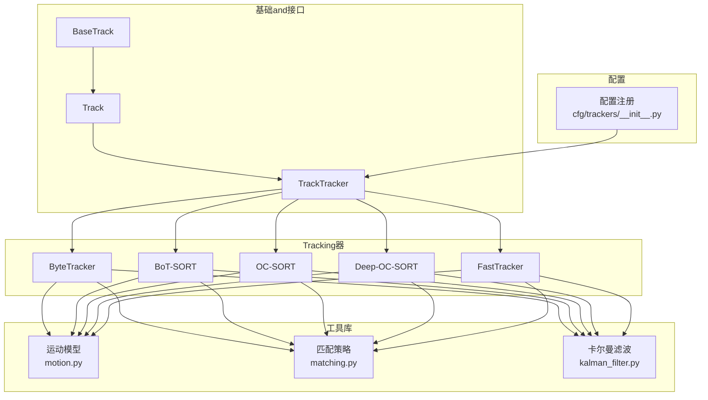
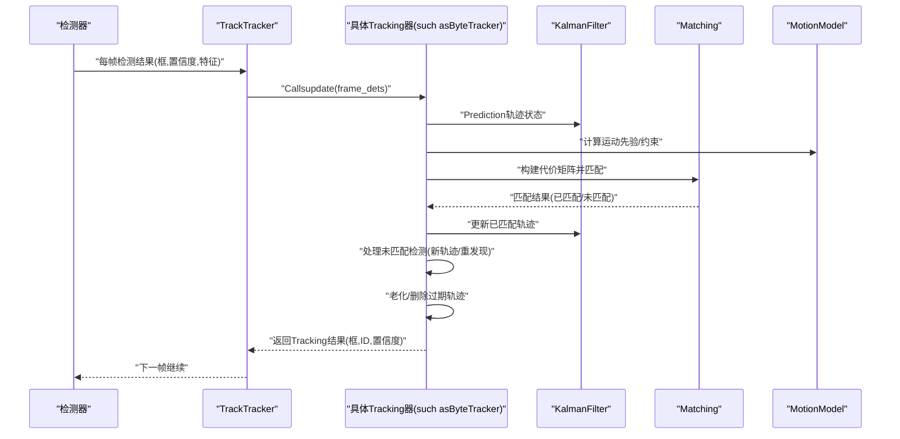
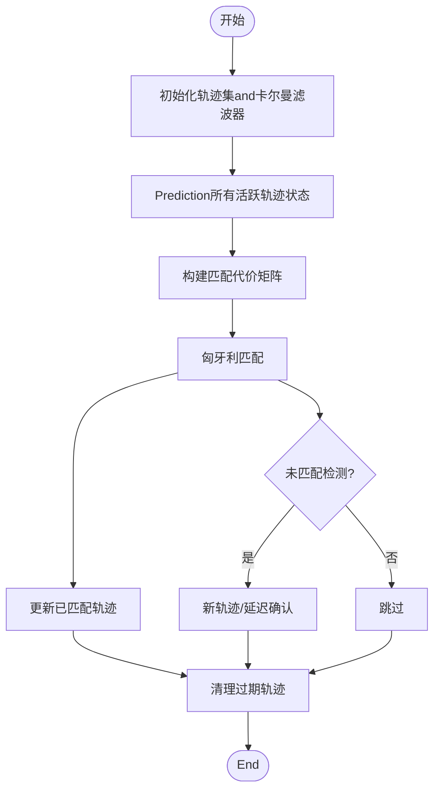
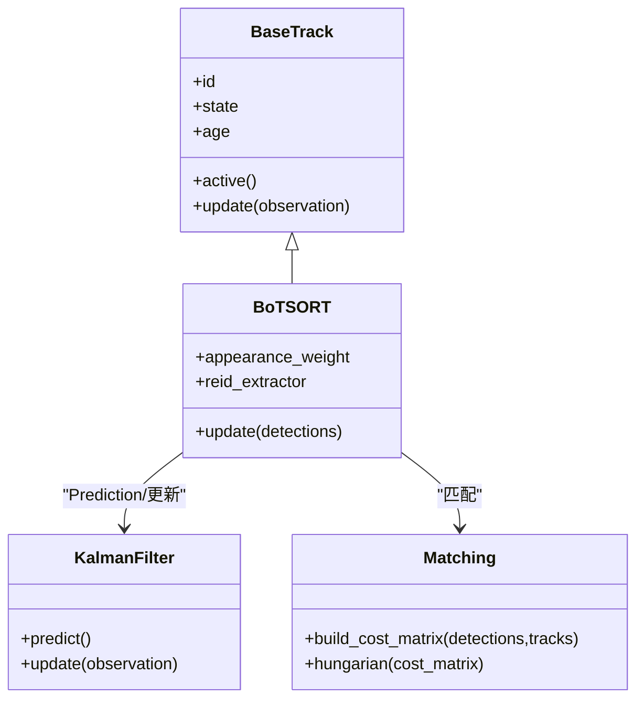
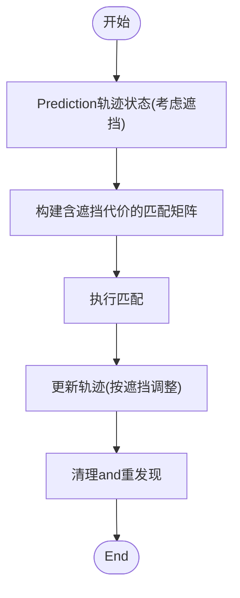
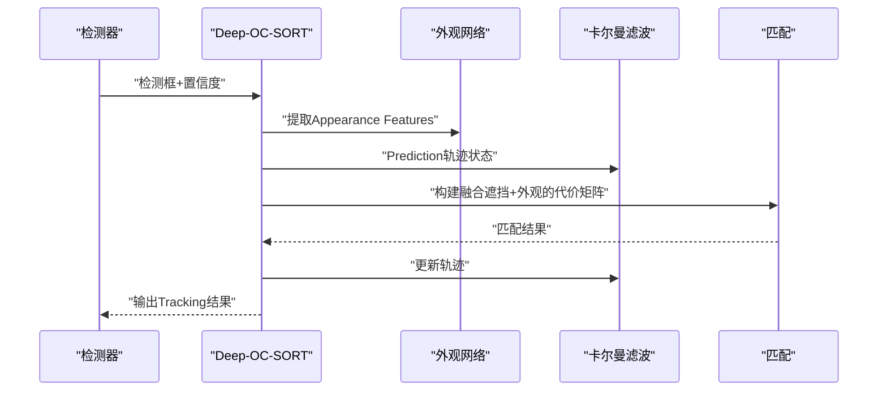
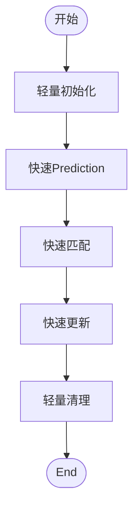
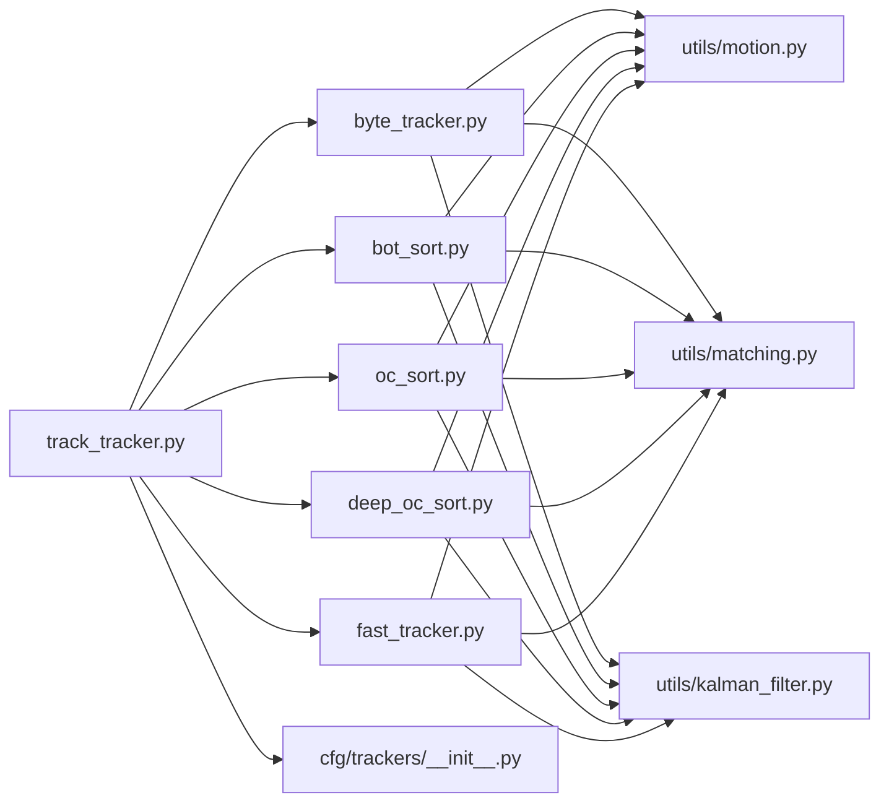

# Tracking Algorithm Implementation

<cite>
**Files Referenced in This Document**
- [ultralytics/trackers/basetrack.py](file://ultralytics/trackers/basetrack.py)
- [ultralytics/trackers/byte_tracker.py](file://ultralytics/trackers/byte_tracker.py)
- [ultralytics/trackers/bot_sort.py](file://ultralytics/trackers/bot_sort.py)
- [ultralytics/trackers/oc_sort.py](file://ultralytics/trackers/oc_sort.py)
- [ultralytics/trackers/deep_oc_sort.py](file://ultralytics/trackers/deep_oc_sort.py)
- [ultralytics/trackers/fast_tracker.py](file://ultralytics/trackers/fast_tracker.py)
- [ultralytics/trackers/track.py](file://ultralytics/trackers/track.py)
- [ultralytics/trackers/track_tracker.py](file://ultralytics/trackers/track_tracker.py)
- [ultralytics/trackers/utils/motion.py](file://ultralytics/trackers/utils/motion.py)
- [ultralytics/trackers/utils/matching.py](file://ultralytics/trackers/utils/matching.py)
- [ultralytics/trackers/utils/kalman_filter.py](file://ultralytics/trackers/utils/kalman_filter.py)
- [ultralytics/cfg/trackers/__init__.py](file://ultralytics/cfg/trackers/__init__.py)
</cite>

## Table of Contents
1. [Introduction](#Introduction)
2. [Project Structure](#Project Structure)
3. [Core Components](#Core Components)
4. [Architecture Overview](#Architecture Overview)
5. [Detailed Component Analysis](#Detailed Component Analysis)
6. [Dependency Analysis](#Dependency Analysis)
7. [性能考量](#性能考量)
8. [Troubleshooting Guide](#Troubleshooting Guide)
9. [Conclusion](#Conclusion)
10. [Appendix](#Appendix)

## Introduction
本技术Documentation聚焦于 YOLO-Master 中的Multi-Object Tracking（MOT）算法implementing，覆盖 ByteTrack、BoT-SORT、OC-SORT、Deep-OC-SORT、FastTracker and other mainstream algorithms的数学模型and代码implementing细节。Documentation从系统架构、数据流、关键数据结构and核心方法入手，解释各算法的Applicable Scenarios、性能特点and配置参数，并provides调优建议、扩展点and自定义开发方法，帮助读者快速理解并高效Uses这些Tracking器。

## Project Structure
Tracking子系统位于 ultralytics/trackers Table of Contents下，采用“基类 + 具体算法 + 工具库”的分层组织方式：
- 基类andUnified Interface：basetrack.py、track.py、track_tracker.py
- 具体算法implementing：byte_tracker.py、bot_sort.py、oc_sort.py、deep_oc_sort.py、fast_tracker.py
- 通用工具：utils/motion.py、utils/matching.py、utils/kalman_filter.py
- 配置注册：cfg/trackers/__init__.py

Figure Source
- [ultralytics/trackers/basetrack.py](file://ultralytics/trackers/basetrack.py)
- [ultralytics/trackers/track.py](file://ultralytics/trackers/track.py)
- [ultralytics/trackers/track_tracker.py](file://ultralytics/trackers/track_tracker.py)
- [ultralytics/trackers/byte_tracker.py](file://ultralytics/trackers/byte_tracker.py)
- [ultralytics/trackers/bot_sort.py](file://ultralytics/trackers/bot_sort.py)
- [ultralytics/trackers/oc_sort.py](file://ultralytics/trackers/oc_sort.py)
- [ultralytics/trackers/deep_oc_sort.py](file://ultralytics/trackers/deep_oc_sort.py)
- [ultralytics/trackers/fast_tracker.py](file://ultralytics/trackers/fast_tracker.py)
- [ultralytics/trackers/utils/motion.py](file://ultralytics/trackers/utils/motion.py)
- [ultralytics/trackers/utils/matching.py](file://ultralytics/trackers/utils/matching.py)
- [ultralytics/trackers/utils/kalman_filter.py](file://ultralytics/trackers/utils/kalman_filter.py)
- [ultralytics/cfg/trackers/__init__.py](file://ultralytics/cfg/trackers/__init__.py)

Section Source
- [ultralytics/trackers/basetrack.py](file://ultralytics/trackers/basetrack.py)
- [ultralytics/trackers/track.py](file://ultralytics/trackers/track.py)
- [ultralytics/trackers/track_tracker.py](file://ultralytics/trackers/track_tracker.py)
- [ultralytics/trackers/utils/motion.py](file://ultralytics/trackers/utils/motion.py)
- [ultralytics/trackers/utils/matching.py](file://ultralytics/trackers/utils/matching.py)
- [ultralytics/trackers/utils/kalman_filter.py](file://ultralytics/trackers/utils/kalman_filter.py)
- [ultralytics/cfg/trackers/__init__.py](file://ultralytics/cfg/trackers/__init__.py)

## Core Components
- 基类and接口
  - BaseTrack：定义轨迹对象的最小公共属性and方法，such as唯一ID、状态管理、生命周期控制etc.。
  - Track：Encapsulates单帧检测输入toTracking输出的基本流程，包括Prediction、关联、更新、消亡管理etc.。
  - TrackTracker：provides统一的初始化、运行接口，负责调度具体Tracking器实例，维护全局轨迹集合and时间步推进。
- 工具库
  - motion.py：运动模型（such as匀速/匀加速）、状态转移矩阵、观测矩阵etc.。
  - matching.py：匈牙利匹配、距离度量（IoU、马氏距离、外观相似度etc.）。
  - kalman_filter.py：卡尔曼滤波implementing，用于状态Predictionand更新。
- 配置注册
  - cfg/trackers/__init__.py：集中注册不同Tracking器的构造方法and默认参数，便于外部Via名称选择。

Section Source
- [ultralytics/trackers/basetrack.py](file://ultralytics/trackers/basetrack.py)
- [ultralytics/trackers/track.py](file://ultralytics/trackers/track.py)
- [ultralytics/trackers/track_tracker.py](file://ultralytics/trackers/track_tracker.py)
- [ultralytics/trackers/utils/motion.py](file://ultralytics/trackers/utils/motion.py)
- [ultralytics/trackers/utils/matching.py](file://ultralytics/trackers/utils/matching.py)
- [ultralytics/trackers/utils/kalman_filter.py](file://ultralytics/trackers/utils/kalman_filter.py)
- [ultralytics/cfg/trackers/__init__.py](file://ultralytics/cfg/trackers/__init__.py)

## Architecture Overview
下图展示了典型的一帧处理时序：检测输出进入Tracking器，进行状态Prediction、关联匹配、轨迹更新and未匹配项处理，最终输出带ID的目标框序列。

Figure Source
- [ultralytics/trackers/track_tracker.py](file://ultralytics/trackers/track_tracker.py)
- [ultralytics/trackers/byte_tracker.py](file://ultralytics/trackers/byte_tracker.py)
- [ultralytics/trackers/bot_sort.py](file://ultralytics/trackers/bot_sort.py)
- [ultralytics/trackers/oc_sort.py](file://ultralytics/trackers/oc_sort.py)
- [ultralytics/trackers/deep_oc_sort.py](file://ultralytics/trackers/deep_oc_sort.py)
- [ultralytics/trackers/fast_tracker.py](file://ultralytics/trackers/fast_tracker.py)
- [ultralytics/trackers/utils/kalman_filter.py](file://ultralytics/trackers/utils/kalman_filter.py)
- [ultralytics/trackers/utils/matching.py](file://ultralytics/trackers/utils/matching.py)
- [ultralytics/trackers/utils/motion.py](file://ultralytics/trackers/utils/motion.py)

## Detailed Component Analysis

### ByteTracker
- 核心思想
  - 基于低阈值检测保留更多候选，利用轨迹and检测之间的关联进行匹配；对未匹配的检测尝试while后续帧中重新关联，提升召回率。
  - 通常Combining卡尔曼滤波PredictionandIoU/马氏距离etc.度量进行匹配。
- Applicable Scenarios
  - 高遮挡、密集场景下需要较高召回率的视频Tracking。
- 关键数据结构
  - 轨迹集合、待匹配队列、历史匹配记录、卡尔曼状态。
- 核心方法
  - 初始化：加载默认参数、创建轨迹容器、设置卡尔曼滤波器。
  - Prediction：对所有活跃轨迹进行状态Prediction。
  - 匹配：构建代价矩阵，执行匈牙利匹配。
  - 更新：对已匹配轨迹进行观测更新；对未匹配检测进行新轨迹或延迟确认。
  - 清理：按年龄/Confidence Threshold淘汰轨迹。
- 配置参数要点
  - 低阈值、高阈值、最大失配次数、卡尔曼噪声、匹配阈值etc.。
- 性能特点
  - while复杂场景中鲁棒性较好，但需权衡误检and计算开销。

Figure Source
- [ultralytics/trackers/byte_tracker.py](file://ultralytics/trackers/byte_tracker.py)
- [ultralytics/trackers/utils/matching.py](file://ultralytics/trackers/utils/matching.py)
- [ultralytics/trackers/utils/kalman_filter.py](file://ultralytics/trackers/utils/kalman_filter.py)
- [ultralytics/trackers/utils/motion.py](file://ultralytics/trackers/utils/motion.py)

Section Source
- [ultralytics/trackers/byte_tracker.py](file://ultralytics/trackers/byte_tracker.py)
- [ultralytics/trackers/utils/matching.py](file://ultralytics/trackers/utils/matching.py)
- [ultralytics/trackers/utils/kalman_filter.py](file://ultralytics/trackers/utils/kalman_filter.py)
- [ultralytics/trackers/utils/motion.py](file://ultralytics/trackers/utils/motion.py)

### BoT-SORT
- 核心思想
  - whileSORT基础上引入Appearance Features（Re-ID）and更稳健的运动模型，Combining卡尔曼滤波and外观相似度进行联合匹配。
- Applicable Scenarios
  - 存while长时间遮挡、身份切换频繁的场景，强调身份一致性。
- 关键数据结构
  - 轨迹Appearance Features缓存、外观相似度矩阵、运动状态。
- 核心方法
  - 初始化：加载外观Feature Extraction器、设置外观权重and运动权重。
  - Predictionand更新：同卡尔曼框架，但while代价矩阵中加入外观项。
  - 匹配：加权组合IoU/马氏距离and外观相似度。
  - 清理：基于外观稳定性and轨迹寿命综合判断。
- 配置参数要点
  - 外观相似度阈值、外观权重、卡尔曼噪声、轨迹寿命etc.。
- 性能特点
  - 身份保持capabilities强，但对Appearance Features质量敏感，计算开销高于纯运动模型。

Figure Source
- [ultralytics/trackers/basetrack.py](file://ultralytics/trackers/basetrack.py)
- [ultralytics/trackers/bot_sort.py](file://ultralytics/trackers/bot_sort.py)
- [ultralytics/trackers/utils/kalman_filter.py](file://ultralytics/trackers/utils/kalman_filter.py)
- [ultralytics/trackers/utils/matching.py](file://ultralytics/trackers/utils/matching.py)

Section Source
- [ultralytics/trackers/bot_sort.py](file://ultralytics/trackers/bot_sort.py)
- [ultralytics/trackers/basetrack.py](file://ultralytics/trackers/basetrack.py)
- [ultralytics/trackers/utils/kalman_filter.py](file://ultralytics/trackers/utils/kalman_filter.py)
- [ultralytics/trackers/utils/matching.py](file://ultralytics/trackers/utils/matching.py)

### OC-SORT
- 核心思想
  - 引入遮挡感知（Occlusion-aware）的匹配策略，针对遮挡导致的检测缺失and误检进行Optimization，常Combining运动一致性and遮挡概率。
- Applicable Scenarios
  - 遮挡严重、目标进出频繁的场景。
- 关键数据结构
  - 遮挡估计、轨迹可见性标记、遮挡代价。
- 核心方法
  - 初始化：设置遮挡阈值and代价函数。
  - Prediction：考虑遮挡可能性的状态Prediction。
  - 匹配：加入遮挡惩罚，避免错误关联。
  - 更新：根据遮挡情况调整轨迹置信度and寿命。
- 配置参数要点
  - 遮挡阈值、遮挡代价权重、匹配阈值etc.。
- 性能特点
  - while遮挡环境下稳定性提升，但需合理调节遮挡相关参数Centered on避免过度保守。

Figure Source
- [ultralytics/trackers/oc_sort.py](file://ultralytics/trackers/oc_sort.py)
- [ultralytics/trackers/utils/matching.py](file://ultralytics/trackers/utils/matching.py)
- [ultralytics/trackers/utils/kalman_filter.py](file://ultralytics/trackers/utils/kalman_filter.py)
- [ultralytics/trackers/utils/motion.py](file://ultralytics/trackers/utils/motion.py)

Section Source
- [ultralytics/trackers/oc_sort.py](file://ultralytics/trackers/oc_sort.py)
- [ultralytics/trackers/utils/matching.py](file://ultralytics/trackers/utils/matching.py)
- [ultralytics/trackers/utils/kalman_filter.py](file://ultralytics/trackers/utils/kalman_filter.py)
- [ultralytics/trackers/utils/motion.py](file://ultralytics/trackers/utils/motion.py)

### Deep-OC-SORT
- 核心思想
  - whileOC-SORT基础上引入深度Appearance Features，增强遮挡环境下的身份识别capabilities。
- Applicable Scenarios
  - 遮挡+身份混淆严重的复杂场景。
- 关键数据结构
  - 深度外观嵌入、遮挡估计、轨迹外观缓存。
- 核心方法
  - 初始化：加载外观网络and遮挡Modules。
  - Predictionand匹配：融合运动、遮挡and外观信息。
  - 更新：依据外观稳定性and遮挡情况动态调整轨迹。
- 配置参数要点
  - 外观权重、遮挡阈值、外观相似度阈值、网络Inference开销控制。
- 性能特点
  - 精度更高，但计算成本显著增加，适合离线或算力充足场景。

Figure Source
- [ultralytics/trackers/deep_oc_sort.py](file://ultralytics/trackers/deep_oc_sort.py)
- [ultralytics/trackers/utils/kalman_filter.py](file://ultralytics/trackers/utils/kalman_filter.py)
- [ultralytics/trackers/utils/matching.py](file://ultralytics/trackers/utils/matching.py)

Section Source
- [ultralytics/trackers/deep_oc_sort.py](file://ultralytics/trackers/deep_oc_sort.py)
- [ultralytics/trackers/utils/kalman_filter.py](file://ultralytics/trackers/utils/kalman_filter.py)
- [ultralytics/trackers/utils/matching.py](file://ultralytics/trackers/utils/matching.py)

### FastTracker
- 核心思想
  - targeting实时性Optimization的轻量级Tracking器，简化外观and遮挡建模，侧重速度and稳定性的平衡。
- Applicable Scenarios
  - 实时视频流、Edge Device Deployment。
- 关键数据结构
  - 精简轨迹状态、轻量匹配代价。
- 核心方法
  - 初始化：最小化参数and内存占用。
  - Predictionand匹配：Uses简化的运动模型and快速匹配策略。
  - 更新：快速更新and清理，减少计算路径。
- 配置参数要点
  - 匹配阈值、轨迹寿命、卡尔曼噪声etc.轻量化设置。
- 性能特点
  - 速度优先，精度略低于复杂模型，适合资源受限环境。

Figure Source
- [ultralytics/trackers/fast_tracker.py](file://ultralytics/trackers/fast_tracker.py)
- [ultralytics/trackers/utils/matching.py](file://ultralytics/trackers/utils/matching.py)
- [ultralytics/trackers/utils/kalman_filter.py](file://ultralytics/trackers/utils/kalman_filter.py)

Section Source
- [ultralytics/trackers/fast_tracker.py](file://ultralytics/trackers/fast_tracker.py)
- [ultralytics/trackers/utils/matching.py](file://ultralytics/trackers/utils/matching.py)
- [ultralytics/trackers/utils/kalman_filter.py](file://ultralytics/trackers/utils/kalman_filter.py)

## Dependency Analysis
- 耦合and内聚
  - 具体Tracking器均依赖统一的运动模型、匹配策略and卡尔曼滤波，形成高内聚、低耦合的结构。
- 直接依赖
  - byte_tracker.py、bot_sort.py、oc_sort.py、deep_oc_sort.py、fast_tracker.py 均导入 utils/motion.py、utils/matching.py、utils/kalman_filter.py。
- 间接依赖
  - track_tracker.py 作forUnified entry point，Via配置Registry选择具体算法实例。
- 外部集成点
  - 外观Feature Extraction器（BoT-SORT、Deep-OC-SORT）可替换for不同后端（ONNX/TensorRT/CPU），Centered on适配部署需求。

Figure Source
- [ultralytics/trackers/byte_tracker.py](file://ultralytics/trackers/byte_tracker.py)
- [ultralytics/trackers/bot_sort.py](file://ultralytics/trackers/bot_sort.py)
- [ultralytics/trackers/oc_sort.py](file://ultralytics/trackers/oc_sort.py)
- [ultralytics/trackers/deep_oc_sort.py](file://ultralytics/trackers/deep_oc_sort.py)
- [ultralytics/trackers/fast_tracker.py](file://ultralytics/trackers/fast_tracker.py)
- [ultralytics/trackers/track_tracker.py](file://ultralytics/trackers/track_tracker.py)
- [ultralytics/trackers/utils/motion.py](file://ultralytics/trackers/utils/motion.py)
- [ultralytics/trackers/utils/matching.py](file://ultralytics/trackers/utils/matching.py)
- [ultralytics/trackers/utils/kalman_filter.py](file://ultralytics/trackers/utils/kalman_filter.py)
- [ultralytics/cfg/trackers/__init__.py](file://ultralytics/cfg/trackers/__init__.py)

Section Source
- [ultralytics/trackers/track_tracker.py](file://ultralytics/trackers/track_tracker.py)
- [ultralytics/cfg/trackers/__init__.py](file://ultralytics/cfg/trackers/__init__.py)

## 性能考量
- 复杂度and开销
  - 外观Feature Extraction（BoT-SORT、Deep-OC-SORT）带来额外计算，建议whileGPU或专用加速器上运行。
  - 匹配阶段的时间复杂度and检测数×轨迹数成正比，可Via限制轨迹数量and提前剪枝降低开销。
- 内存and缓存
  - Appearance Features缓存需控制大小and刷新频率，避免内存泄漏。
- 数值稳定性
  - 卡尔曼滤波的协方差矩阵需定期正则化，防止数值不稳定。
- 并行and批处理
  - 匹配and外观Feature Extraction可并行化，充分利用多核/GPU。
- 部署Optimization
  - 将外观网络Exporting toONNX/TensorRT，减少Python运行时开销。

[This section provides general guidance and does not directly analyze specific files]

## Troubleshooting Guide
- 常见问题
  - ID频繁跳变：检查外观相似度阈值and权重，适当提高外观稳定性要求。
  - 漏检增多：降低低阈值或放宽匹配阈值，关注遮挡相关参数。
  - 计算超时：启用FastTracker或关闭Appearance Features，减少匹配规模。
  - 数值异常：检查卡尔曼噪声and协方差更新逻辑，必要时添加数值保护。
- 调试建议
  - 打印匹配代价矩阵and匹配结果，定位错误关联。
  - Visualization轨迹寿命and置信度变化，辅助参数调优。
  - 分Modules测试（仅运动/仅外观/联合），隔离问题来源。

Section Source
- [ultralytics/trackers/byte_tracker.py](file://ultralytics/trackers/byte_tracker.py)
- [ultralytics/trackers/bot_sort.py](file://ultralytics/trackers/bot_sort.py)
- [ultralytics/trackers/oc_sort.py](file://ultralytics/trackers/oc_sort.py)
- [ultralytics/trackers/deep_oc_sort.py](file://ultralytics/trackers/deep_oc_sort.py)
- [ultralytics/trackers/fast_tracker.py](file://ultralytics/trackers/fast_tracker.py)
- [ultralytics/trackers/utils/matching.py](file://ultralytics/trackers/utils/matching.py)
- [ultralytics/trackers/utils/kalman_filter.py](file://ultralytics/trackers/utils/kalman_filter.py)

## Conclusion
YOLO-Master的Tracking子系统Centered on清晰的基类and工具库for基础，provides了多种主流Tracking算法的implementing。ByteTrackwhile召回率and鲁棒性方面表现优异；BoT-SORTandDeep-OC-SORTwhile身份一致性上更强；OC-SORT针对遮挡进行了专门Optimization；FastTracker则targeting实时and资源受限场景。实际应用中应根据场景特性（遮挡、密度、算力）选择合适的算法，并Via合理的参数调优and部署Optimization达to最佳效果。

[This section is summary content and does not directly analyze specific files]

## Appendix
- Uses模式andExamples
  - Via配置Registry选择Tracking器名称，初始化后逐帧Callsupdate接口即可得toTracking结果。
  - ExamplesRefer to路径：examples/object_tracking.ipynb（概念性说明，非代码片段）。
- 扩展and自定义
  - 新增Tracking器：继承基类并while配置Registry中注册，implementingupdate接口Centered on完成Prediction、匹配、更新and清理。
  - 替换Appearance Features：whileBoT-SORT/Deep-OC-SORT中注入新的外观提取器，确保输出维度and归一化一致。
  - 自定义匹配代价：whilematching.py中扩展代价函数，并while具体Tracking器中接入。

Section Source
- [ultralytics/cfg/trackers/__init__.py](file://ultralytics/cfg/trackers/__init__.py)
- [ultralytics/trackers/basetrack.py](file://ultralytics/trackers/basetrack.py)
- [ultralytics/trackers/track.py](file://ultralytics/trackers/track.py)
- [ultralytics/trackers/track_tracker.py](file://ultralytics/trackers/track_tracker.py)
- [ultralytics/trackers/utils/matching.py](file://ultralytics/trackers/utils/matching.py)