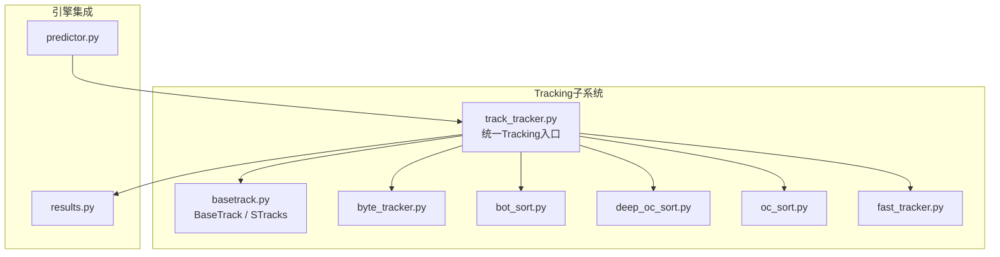
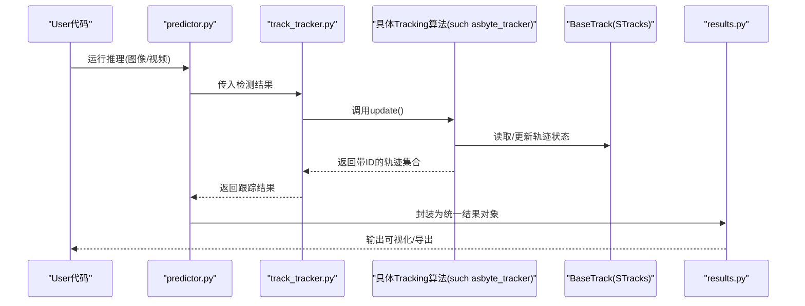
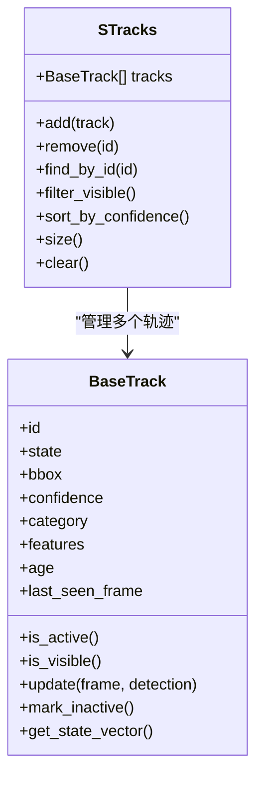
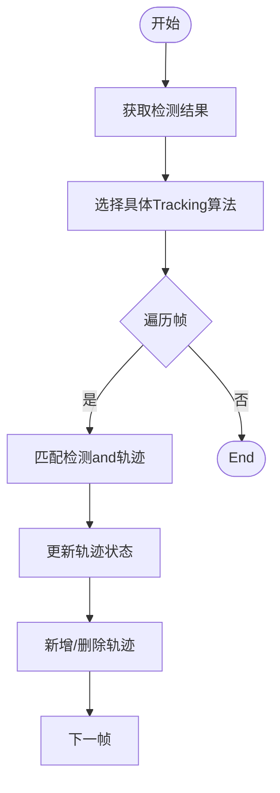
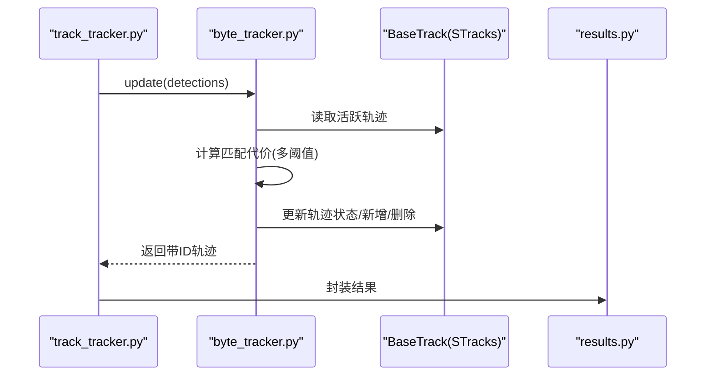
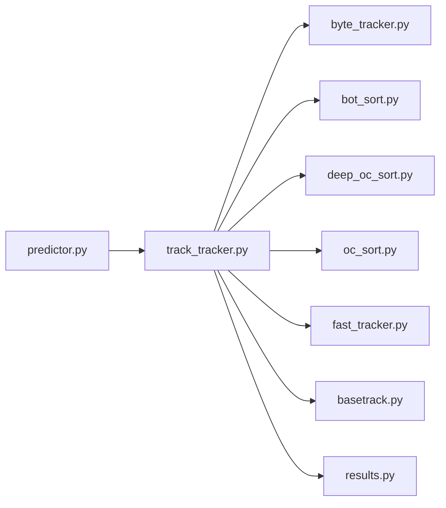

# 基础Tracking类设计

<cite>
**Files Referenced in This Document**
- [basetrack.py](file://ultralytics/trackers/basetrack.py)
- [track.py](file://ultralytics/trackers/track.py)
- [byte_tracker.py](file://ultralytics/trackers/byte_tracker.py)
- [bot_sort.py](file://ultralytics/trackers/bot_sort.py)
- [deep_oc_sort.py](file://ultralytics/trackers/deep_oc_sort.py)
- [oc_sort.py](file://ultralytics/trackers/oc_sort.py)
- [fast_tracker.py](file://ultralytics/trackers/fast_tracker.py)
- [track_tracker.py](file://ultralytics/trackers/track_tracker.py)
- [predictor.py](file://ultralytics/engine/predictor.py)
- [results.py](file://ultralytics/engine/results.py)
</cite>

## Table of Contents
1. [Introduction](#Introduction)
2. [Project Structure](#Project Structure)
3. [Core Components](#Core Components)
4. [Architecture Overview](#Architecture Overview)
5. [Detailed Component Analysis](#Detailed Component Analysis)
6. [Dependency Analysis](#Dependency Analysis)
7. [Performance Considerations](#Performance Considerations)
8. [Troubleshooting Guide](#Troubleshooting Guide)
9. [Conclusion](#Conclusion)
10. [Appendix](#Appendix)

## Introduction
本文件聚焦于 YOLO-Master 的“基础Tracking类”and“STracks 数据结构”，系统性阐述 BaseTrack 的Core Architecture、抽象接口、对象生命周期管理、状态表示and通用方法；解释 STracks 的设计动机and字段语义；梳理Tracking算法的通用流程and扩展机制；说明Tracking ID 分配策略、轨迹管理and状态更新机制；并provides自定义Tracking算法的开发指南、最佳实践、继承模式Centered onandandPredictor、Results Object的集成方式and数据流处理。

## Project Structure
Tracking子系统位于 ultralytics/trackers Table of Contents下，采用“基类 + 多implementing”的分层组织：
- 基类and通用数据结构：basetrack.py（BaseTrack、STracks）
- 具体Tracking算法：byte_tracker.py、bot_sort.py、deep_oc_sort.py、oc_sort.py、fast_tracker.py
- 统一Tracking入口：track_tracker.py（对外暴露统一的Tracking接口）
- and引擎集成：predictor.py（CallsTracking器）、results.py（Encapsulates带TrackingID的结果）

Figure Source
- [basetrack.py](file://ultralytics/trackers/basetrack.py)
- [track_tracker.py](file://ultralytics/trackers/track_tracker.py)
- [byte_tracker.py](file://ultralytics/trackers/byte_tracker.py)
- [bot_sort.py](file://ultralytics/trackers/bot_sort.py)
- [deep_oc_sort.py](file://ultralytics/trackers/deep_oc_sort.py)
- [oc_sort.py](file://ultralytics/trackers/oc_sort.py)
- [fast_tracker.py](file://ultralytics/trackers/fast_tracker.py)
- [predictor.py](file://ultralytics/engine/predictor.py)
- [results.py](file://ultralytics/engine/results.py)

Section Source
- [basetrack.py](file://ultralytics/trackers/basetrack.py)
- [track_tracker.py](file://ultralytics/trackers/track_tracker.py)
- [predictor.py](file://ultralytics/engine/predictor.py)
- [results.py](file://ultralytics/engine/results.py)

## Core Components
本节深入解析 BaseTrack and STracks 的设计要点。

- BaseTrack 的职责
  - 定义Tracking对象的最小公共接口：初始化、状态更新、是否存活、是否可见etc.。
  - provides通用的生命周期管理：创建、激活、消亡判定、清理。
  - 维护and帧相关的元信息：时间戳、帧号、置信度、类别、框坐标etc.。
  - for派生算法provides可复用的工具方法：距离度量、相似度计算、阈值判断etc.。

- STracks 数据结构
  - 用于while单帧内聚合和管理一组Tracking对象（即“当前帧的轨迹集合”）。
  - 典型字段包括：唯一ID、边界框、类别、置信度、特征向量（Optional）、运动状态（such as均值-方差或卡尔曼滤波状态）、可见性标志、年龄/寿命、最后更新时间etc.。
  - provides常用操作：按ID查找、过滤可见/不可见轨迹、排序（按置信度或匹配代价）、合并/拆分（由上层算法决定）。

- 生命周期and状态
  - 常见状态：未激活、活跃、隐藏、消亡。
  - 触发条件：新检测进入、匹配成功、长时间未观测to、置信度过低、超龄etc.。
  - 状态Migration遵循“最小化误删、最大化连续性”的原则，Combining可见性and运动一致性进行决策。

- 通用方法and扩展点
  - 匹配接口：将检测and现有轨迹进行关联（匈牙利匹配、最近邻、图匹配etc.）。
  - 更新接口：根据匹配结果更新轨迹的状态andAppearance Features。
  - 新增/删除接口：处理未匹配的检测and长期未匹配的轨迹。
  - 这些扩展点允许不同算法Centered on插件式方式接入，保持统一的数据契约。

Section Source
- [basetrack.py](file://ultralytics/trackers/basetrack.py)
- [track.py](file://ultralytics/trackers/track.py)

## Architecture Overview
Tracking系统采用“Unified entry point + 多算法implementing + 基类抽象”的架构：
- track_tracker.py 作forUnified entry point，负责选择并调度具体Tracking算法。
- 各算法implementing byte_tracker、bot_sort、deep_oc_sort、oc_sort、fast_tracker etc.，均基于 BaseTrack provides的接口完成匹配、更新、增删逻辑。
- predictor.py whileInference阶段CallsTracking器，将检测结果送入Tracking管线。
- results.py 将Tracking结果（含TrackingID）包装for统一格式，供Visualizationand下游TasksUses。

Figure Source
- [predictor.py](file://ultralytics/engine/predictor.py)
- [track_tracker.py](file://ultralytics/trackers/track_tracker.py)
- [byte_tracker.py](file://ultralytics/trackers/byte_tracker.py)
- [basetrack.py](file://ultralytics/trackers/basetrack.py)
- [results.py](file://ultralytics/engine/results.py)

## Detailed Component Analysis

### BaseTrack and STracks 设计
- 设计目标
  - Via最小公共接口屏蔽不同Tracking算法的差异，使上层Calls保持一致。
  - 将“轨迹对象”and“轨迹集合”解耦，便于while不同场景下复用and组合。
- 关键抽象
  - 轨迹对象：包含ID、状态、属性、更新接口。
  - 轨迹集合：provides批量操作（查找、过滤、排序、统计）。
- 复杂度and性能
  - 单帧内轨迹集合操作通常for O(N) 或 O(N log N)，取决于排序and查找策略。
  - 匹配阶段可能引入 O(N×M) 的代价矩阵计算，需Combining阈值裁剪and近似匹配Optimization。

Figure Source
- [basetrack.py](file://ultralytics/trackers/basetrack.py)

Section Source
- [basetrack.py](file://ultralytics/trackers/basetrack.py)

### 统一Tracking入口 track_tracker.py
- 职责
  - 接收Predictor的检测结果，选择具体Tracking算法实例。
  - 协调多帧间的轨迹更新，保证ID一致性and稳定性。
  - 将最终结果转换for标准格式，交由 results.py Encapsulates。
- andPredictor集成
  - predictor.py while每帧Inference后CallsTracking器，传入检测结果and必要上下文（such as图像尺寸、时间戳）。
  - Tracking器返回带ID的轨迹列表，Predictor将其写入Results Object。

Figure Source
- [track_tracker.py](file://ultralytics/trackers/track_tracker.py)
- [predictor.py](file://ultralytics/engine/predictor.py)

Section Source
- [track_tracker.py](file://ultralytics/trackers/track_tracker.py)
- [predictor.py](file://ultralytics/engine/predictor.py)

### 具体Tracking算法Examples：ByteTrack
- 特点
  - 强调“高召回+稳定ID”的平衡，适合密集场景。
  - Via多阈值策略区分强匹配and弱匹配，提升漏检恢复capabilities。
- and基类的协作
  - Uses BaseTrack 的状态and属性进行匹配and更新。
  - 利用 STracks 管理当前帧轨迹集合，执行过滤and排序。

Figure Source
- [track_tracker.py](file://ultralytics/trackers/track_tracker.py)
- [byte_tracker.py](file://ultralytics/trackers/byte_tracker.py)
- [basetrack.py](file://ultralytics/trackers/basetrack.py)
- [results.py](file://ultralytics/engine/results.py)

Section Source
- [byte_tracker.py](file://ultralytics/trackers/byte_tracker.py)
- [basetrack.py](file://ultralytics/trackers/basetrack.py)

### 其他算法对比and扩展点
- bot_sort、deep_oc_sort、oc_sort、fast_tracker etc.均Centered on BaseTrack for基础，差异主要体现while：
  - 匹配策略：IoU、ReID特征、运动模型（卡尔曼滤波）、图匹配etc.。
  - 状态更新：外观融合权重、运动平滑策略、遮挡处理。
  - 新增/删除策略：超时阈值、置信度门限、轨迹长度惩罚。
- 扩展建议
  - 优先implementing匹配and更新两个核心接口，确保and BaseTrack 契约一致。
  - 对复杂场景（遮挡、快速运动）引入鲁棒的外观and运动模型。
  - 控制计算开销：裁剪候选集、近似匹配、增量更新。

Section Source
- [bot_sort.py](file://ultralytics/trackers/bot_sort.py)
- [deep_oc_sort.py](file://ultralytics/trackers/deep_oc_sort.py)
- [oc_sort.py](file://ultralytics/trackers/oc_sort.py)
- [fast_tracker.py](file://ultralytics/trackers/fast_tracker.py)
- [basetrack.py](file://ultralytics/trackers/basetrack.py)

## Dependency Analysis
- 内部依赖
  - track_tracker.py 依赖具体算法implementingand BaseTrack。
  - 具体算法implementing依赖 BaseTrack and STracks provides的数据结构and接口。
  - predictor.py and results.py 构成Tracking结果的输入输出契约。
- External Dependencies
  - 数值计算库（such as NumPy/Torch）用于距离度量and特征运算。
  - 可能的第三方匹配库（such as scipy.optimize.linear_sum_assignment）用于匈牙利匹配。

Figure Source
- [predictor.py](file://ultralytics/engine/predictor.py)
- [track_tracker.py](file://ultralytics/trackers/track_tracker.py)
- [byte_tracker.py](file://ultralytics/trackers/byte_tracker.py)
- [bot_sort.py](file://ultralytics/trackers/bot_sort.py)
- [deep_oc_sort.py](file://ultralytics/trackers/deep_oc_sort.py)
- [oc_sort.py](file://ultralytics/trackers/oc_sort.py)
- [fast_tracker.py](file://ultralytics/trackers/fast_tracker.py)
- [basetrack.py](file://ultralytics/trackers/basetrack.py)
- [results.py](file://ultralytics/engine/results.py)

Section Source
- [predictor.py](file://ultralytics/engine/predictor.py)
- [track_tracker.py](file://ultralytics/trackers/track_tracker.py)
- [basetrack.py](file://ultralytics/trackers/basetrack.py)
- [results.py](file://ultralytics/engine/results.py)

## Performance Considerations
- 匹配复杂度
  - 直接全量匹配for O(N×M)，可Via空间索引、区域划分、候选集裁剪降低实际计算量。
- 特征计算
  - ReID 特征计算开销较大，建议缓存、异步计算或降采样。
- 状态更新
  - 卡尔曼滤波etc.运动模型应控制维度and协方差更新频率。
- 内存管理
  - and时释放不可见或消亡轨迹，避免轨迹集合无限增长。
- 并行and批处理
  - while多目标场景下，尽量向量化操作，减少 Python 循环开销。

[This section provides general guidance and does not directly analyze specific files]

## Troubleshooting Guide
- 常见问题
  - ID频繁跳变：检查匹配阈值andRe-Identification特征质量，调整多阈值策略。
  - 轨迹过早消亡：提高可见性容忍度and超时阈值，增强遮挡处理。
  - 漏检恢复慢：引入弱匹配分支and回溯机制，提升召回率。
  - 性能bottlenecks：定位匹配and特征计算热点，启用近似匹配and缓存。
- 调试建议
  - 打印每帧匹配代价矩阵and匹配结果，观察异常路径。
  - 记录轨迹状态MigrationLogging，定位状态突变原因。
  - Visualization轨迹and检测框，辅助人工校验。

Section Source
- [basetrack.py](file://ultralytics/trackers/basetrack.py)
- [track_tracker.py](file://ultralytics/trackers/track_tracker.py)

## Conclusion
BaseTrack and STracks 构成了 YOLO-Master Tracking子系统的基石，provides了稳定的抽象接口and数据结构，使得多种Tracking算法可Centered onCentered on插件式方式接入并保持统一的数据契约。Via track_tracker.py 的Unified entry point，PredictorandResults Object得Centered on无缝集成，形成端to端的Tracking流水线。while实际工程中，应根据场景特性选择合适的算法and参数，并while匹配、更新、新增/删除三个关键环节进行精细化调优，Centered onimplementing高精度、高稳定性的Tracking效果。

[This section is summary content and does not directly analyze specific files]

## Appendix
- 开发指南and最佳实践
  - 继承 BaseTrack 时，Strictly follow接口契约，确保状态字段and生命周期方法行for一致。
  - while匹配阶段引入多源证据（几何、外观、运动），并Uses阈值裁剪降低计算量。
  - 对遮挡and快速运动场景，增加鲁棒性设计（such as延迟消亡、回溯匹配）。
  - provides清晰的配置项（阈值、超时、权重），便于实验and部署。
- 代码Examplesand继承模式
  - Refer to byte_tracker.py、bot_sort.py、deep_oc_sort.py、oc_sort.py、fast_tracker.py 的implementing风格，理解such as何基于 BaseTrack 扩展匹配and更新逻辑。
  - while track_tracker.py 中注册新算法，使其能被Unified entry point调度。
- and其他组件的集成
  - predictor.py 负责将检测结果送入Tracking器，results.py 负责将带ID的轨迹Encapsulatesfor标准Results Object，便于VisualizationandExport。

Section Source
- [byte_tracker.py](file://ultralytics/trackers/byte_tracker.py)
- [bot_sort.py](file://ultralytics/trackers/bot_sort.py)
- [deep_oc_sort.py](file://ultralytics/trackers/deep_oc_sort.py)
- [oc_sort.py](file://ultralytics/trackers/oc_sort.py)
- [fast_tracker.py](file://ultralytics/trackers/fast_tracker.py)
- [track_tracker.py](file://ultralytics/trackers/track_tracker.py)
- [predictor.py](file://ultralytics/engine/predictor.py)
- [results.py](file://ultralytics/engine/results.py)