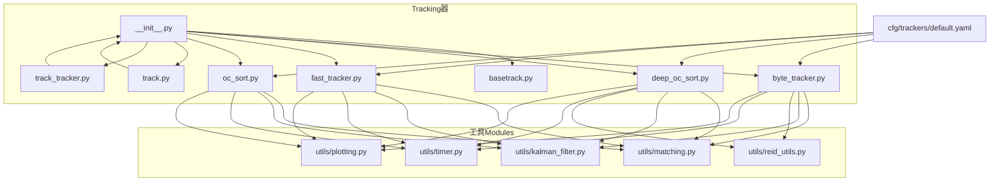
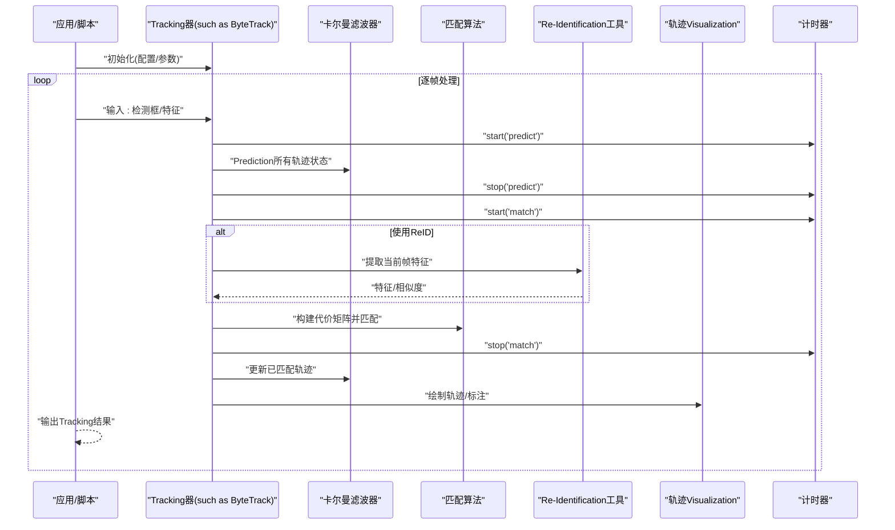
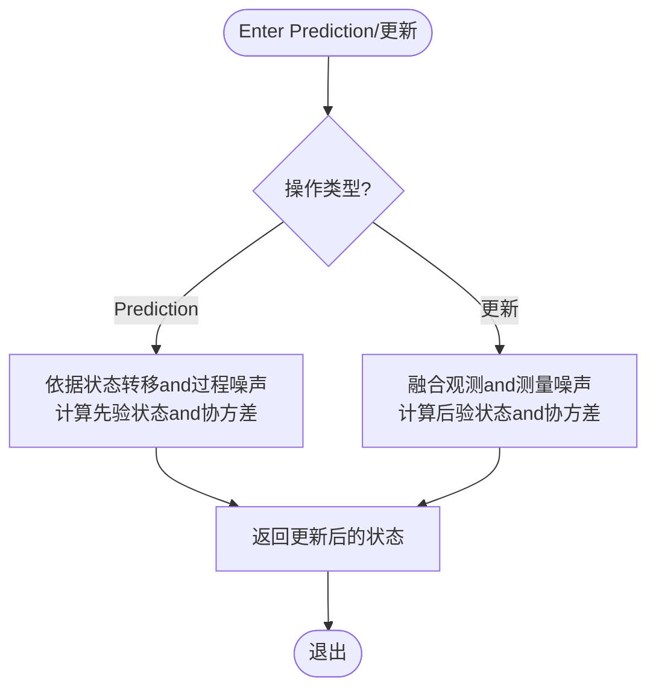
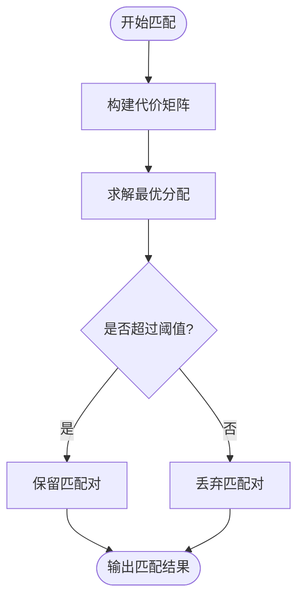
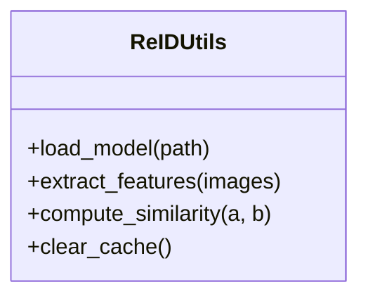
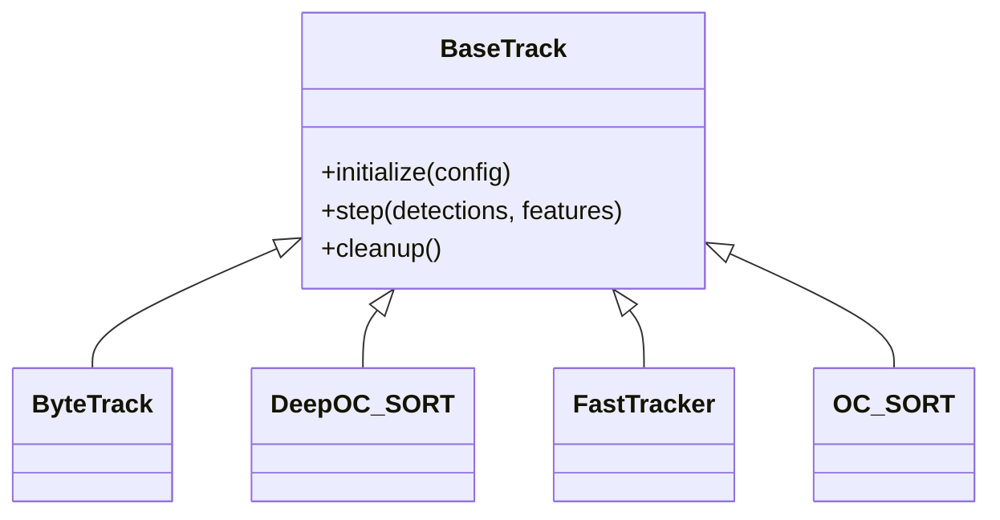
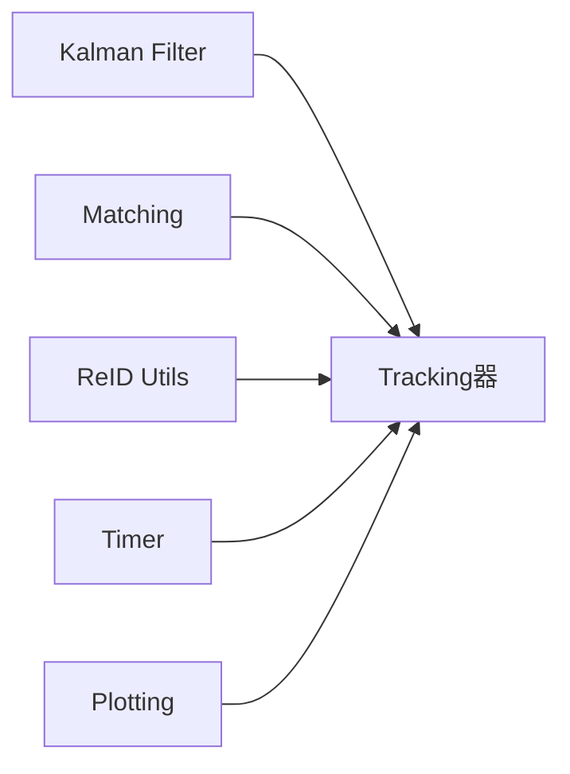

# Tracking工具Modules

<cite>
**Files Referenced in This Document**
- [ultralytics/trackers/__init__.py](file://ultralytics/trackers/__init__.py)
- [ultralytics/trackers/basetrack.py](file://ultralytics/trackers/basetrack.py)
- [ultralytics/trackers/byte_tracker.py](file://ultralytics/trackers/byte_tracker.py)
- [ultralytics/trackers/deep_oc_sort.py](file://ultralytics/trackers/deep_oc_sort.py)
- [ultralytics/trackers/fast_tracker.py](file://ultralytics/trackers/fast_tracker.py)
- [ultralytics/trackers/oc_sort.py](file://ultralytics/trackers/oc_sort.py)
- [ultralytics/trackers/track.py](file://ultralytics/trackers/track.py)
- [ultralytics/trackers/track_tracker.py](file://ultralytics/trackers/track_tracker.py)
- [ultralytics/trackers/utils/matching.py](file://ultralytics/trackers/utils/matching.py)
- [ultralytics/trackers/utils/kalman_filter.py](file://ultralytics/trackers/utils/kalman_filter.py)
- [ultralytics/trackers/utils/reid_utils.py](file://ultralytics/trackers/utils/reid_utils.py)
- [ultralytics/trackers/utils/timer.py](file://ultralytics/trackers/utils/timer.py)
- [ultralytics/trackers/utils/plotting.py](file://ultralytics/trackers/utils/plotting.py)
- [ultralytics/cfg/trackers/default.yaml](file://ultralytics/cfg/trackers/default.yaml)
- [examples/YOLO-Interactive-Tracking-UI/interactive_tracker.py](file://examples/YOLO-Interactive-Tracking-UI/interactive_tracker.py)
</cite>

## Table of Contents
1. [Introduction](#Introduction)
2. [Project Structure](#Project Structure)
3. [Core Components](#Core Components)
4. [Architecture Overview](#Architecture Overview)
5. [Detailed Component Analysis](#Detailed Component Analysis)
6. [Dependency Analysis](#Dependency Analysis)
7. [Performance Considerations](#Performance Considerations)
8. [Troubleshooting Guide](#Troubleshooting Guide)
9. [Conclusion](#Conclusion)
10. [Appendix](#Appendix)

## Introduction
本技术Documentation聚焦于Tracking系统的“工具Modules”，涵盖卡尔曼滤波器、匹配算法、Re-Identification（ReID）工具and轨迹Visualizationetc.关键辅助capabilities，并说明它们such as何被上层Tracking器组合Uses。Documentationtargeting希望理解或扩展Tracking工具链的EngineersandResearchers，provides接口概览、数据流、配置项、扩展点、组合Examples、最佳实践、性能Optimizationand调试方法，Centered onand测试andValidation流程建议。

## Project Structure
Tracking工具Modules主要位于Centered on下路径：
- Tracking器implementingand入口：ultralytics/trackers/*
- 工具子Modules：ultralytics/trackers/utils/*
- 默认配置：ultralytics/cfg/trackers/default.yaml
- 交互式演示：examples/YOLO-Interactive-Tracking-UI/interactive_tracker.py

Figure Source
- [ultralytics/trackers/__init__.py](file://ultralytics/trackers/__init__.py)
- [ultralytics/trackers/basetrack.py](file://ultralytics/trackers/basetrack.py)
- [ultralytics/trackers/byte_tracker.py](file://ultralytics/trackers/byte_tracker.py)
- [ultralytics/trackers/deep_oc_sort.py](file://ultralytics/trackers/deep_oc_sort.py)
- [ultralytics/trackers/fast_tracker.py](file://ultralytics/trackers/fast_tracker.py)
- [ultralytics/trackers/oc_sort.py](file://ultralytics/trackers/oc_sort.py)
- [ultralytics/trackers/track.py](file://ultralytics/trackers/track.py)
- [ultralytics/trackers/track_tracker.py](file://ultralytics/trackers/track_tracker.py)
- [ultralytics/trackers/utils/matching.py](file://ultralytics/trackers/utils/matching.py)
- [ultralytics/trackers/utils/kalman_filter.py](file://ultralytics/trackers/utils/kalman_filter.py)
- [ultralytics/trackers/utils/reid_utils.py](file://ultralytics/trackers/utils/reid_utils.py)
- [ultralytics/trackers/utils/timer.py](file://ultralytics/trackers/utils/timer.py)
- [ultralytics/trackers/utils/plotting.py](file://ultralytics/trackers/utils/plotting.py)
- [ultralytics/cfg/trackers/default.yaml](file://ultralytics/cfg/trackers/default.yaml)

Section Source
- [ultralytics/trackers/__init__.py](file://ultralytics/trackers/__init__.py)
- [ultralytics/trackers/basetrack.py](file://ultralytics/trackers/basetrack.py)
- [ultralytics/trackers/byte_tracker.py](file://ultralytics/trackers/byte_tracker.py)
- [ultralytics/trackers/deep_oc_sort.py](file://ultralytics/trackers/deep_oc_sort.py)
- [ultralytics/trackers/fast_tracker.py](file://ultralytics/trackers/fast_tracker.py)
- [ultralytics/trackers/oc_sort.py](file://ultralytics/trackers/oc_sort.py)
- [ultralytics/trackers/track.py](file://ultralytics/trackers/track.py)
- [ultralytics/trackers/track_tracker.py](file://ultralytics/trackers/track_tracker.py)
- [ultralytics/trackers/utils/matching.py](file://ultralytics/trackers/utils/matching.py)
- [ultralytics/trackers/utils/kalman_filter.py](file://ultralytics/trackers/utils/kalman_filter.py)
- [ultralytics/trackers/utils/reid_utils.py](file://ultralytics/trackers/utils/reid_utils.py)
- [ultralytics/trackers/utils/timer.py](file://ultralytics/trackers/utils/timer.py)
- [ultralytics/trackers/utils/plotting.py](file://ultralytics/trackers/utils/plotting.py)
- [ultralytics/cfg/trackers/default.yaml](file://ultralytics/cfg/trackers/default.yaml)

## Core Components
本节概述各工具Modules的职责and对外接口要点，便于快速定位and组合Uses。

- 卡尔曼滤波器（Kalman Filter）
  - 功能：对目标状态进行线性高斯Predictionand更新，Supporting位置/速度建模and观测融合。
  - 典型接口：初始化、Prediction（按帧推进）、更新（融合检测框观测）。
  - 复杂度：状态维度固定时，Prediction/更新for常数时间；矩阵运算规模由状态向量决定。
  - 扩展点：自定义观测模型、过程噪声and观测噪声协方差。

- 匹配算法（Matching）
  - 功能：while检测and轨迹之间建立关联，常用匈牙利算法求解最小代价匹配。
  - 典型接口：计算代价矩阵、执行分配、返回匹配索引。
  - 扩展点：代价函数可替换（IoU、马氏距离、ReID相似度etc.），阈值策略可调。

- Re-Identification工具（ReID Utils）
  - 功能：providesFeature Extraction、相似度计算and缓存管理，用于跨帧身份一致性判别。
  - 典型接口：Load model、提取特征、计算相似度、清理过期缓存。
  - 扩展点：可插拔特征模型、相似度度量、缓存淘汰策略。

- 计时器（Timer）
  - 功能：统计各阶段耗时，便于性能分析andbottlenecks定位。
  - 典型接口：开始/End计时、获取累计耗时、重置。

- 轨迹Visualization（Plotting）
  - 功能：绘制轨迹线、历史窗口、ID标注、热力图etc.，辅助调试and展示。
  - 典型接口：绘制单帧结果、累积轨迹、Export图像。

- Tracking器基类and具体implementing
  - 基类：定义统一的Tracking生命周期（初始化、步进、清理）and通用属性。
  - 具体implementing：ByteTrack、DeepOC-SORT、FastTracker、OC-SORT etc.，组合上述工具完成不同策略的Tracking。

Section Source
- [ultralytics/trackers/utils/kalman_filter.py](file://ultralytics/trackers/utils/kalman_filter.py)
- [ultralytics/trackers/utils/matching.py](file://ultralytics/trackers/utils/matching.py)
- [ultralytics/trackers/utils/reid_utils.py](file://ultralytics/trackers/utils/reid_utils.py)
- [ultralytics/trackers/utils/timer.py](file://ultralytics/trackers/utils/timer.py)
- [ultralytics/trackers/utils/plotting.py](file://ultralytics/trackers/utils/plotting.py)
- [ultralytics/trackers/basetrack.py](file://ultralytics/trackers/basetrack.py)
- [ultralytics/trackers/byte_tracker.py](file://ultralytics/trackers/byte_tracker.py)
- [ultralytics/trackers/deep_oc_sort.py](file://ultralytics/trackers/deep_oc_sort.py)
- [ultralytics/trackers/fast_tracker.py](file://ultralytics/trackers/fast_tracker.py)
- [ultralytics/trackers/oc_sort.py](file://ultralytics/trackers/oc_sort.py)

## Architecture Overview
Tracking系统Centered on“Tracking器”for核心编排者，Calls工具Modules完成Prediction、匹配、身份判别andVisualization。下图展示了典型的数据流and控制流。

Figure Source
- [ultralytics/trackers/byte_tracker.py](file://ultralytics/trackers/byte_tracker.py)
- [ultralytics/trackers/utils/kalman_filter.py](file://ultralytics/trackers/utils/kalman_filter.py)
- [ultralytics/trackers/utils/matching.py](file://ultralytics/trackers/utils/matching.py)
- [ultralytics/trackers/utils/reid_utils.py](file://ultralytics/trackers/utils/reid_utils.py)
- [ultralytics/trackers/utils/plotting.py](file://ultralytics/trackers/utils/plotting.py)
- [ultralytics/trackers/utils/timer.py](file://ultralytics/trackers/utils/timer.py)

## Detailed Component Analysis

### 卡尔曼滤波器（Kalman Filter）
- 职责：维护每个轨迹的状态估计，providesPredictionand更新两个核心步骤。
- 关键接口（概念性）：
  - 初始化：设置状态维、转移矩阵、观测矩阵、协方差。
  - Prediction：根据上一时刻状态and过程噪声，推演下一时刻先验。
  - 更新：用当前观测修正先验，得to后验状态。
- 复杂度：O(d^3) 量级（d for状态维度），通常 d 较小，开销可控。
- 扩展点：
  - 自定义观测模型（例such as仅观测中心点或包含宽高）。
  - 自适应噪声调节（基于残差或置信度）。
- 常见陷阱：数值不稳定（协方差非正定）、异常观测导致发散。

Figure Source
- [ultralytics/trackers/utils/kalman_filter.py](file://ultralytics/trackers/utils/kalman_filter.py)

Section Source
- [ultralytics/trackers/utils/kalman_filter.py](file://ultralytics/trackers/utils/kalman_filter.py)

### 匹配算法（Matching）
- 职责：将当前帧检测and已有轨迹进行一一对应，最大化整体匹配质量。
- 关键接口（概念性）：
  - 构建代价矩阵：综合 IoU、马氏距离、ReID 相似度etc.。
  - 执行分配：Uses匈牙利算法或其他最优分配求解器。
  - 过滤未匹配：根据阈值判定是否保留候选。
- 复杂度：O(n^3)（n for候选数），可Via剪枝and阈值降低实际规模。
- 扩展点：
  - 代价函数可插拔（几何/外观/运动一致性）。
  - 多阶段匹配（先粗配再精配）。
- 常见陷阱：阈值不当导致 ID 切换或漏跟；大规模场景下性能退化。

Figure Source
- [ultralytics/trackers/utils/matching.py](file://ultralytics/trackers/utils/matching.py)

Section Source
- [ultralytics/trackers/utils/matching.py](file://ultralytics/trackers/utils/matching.py)

### Re-Identification工具（ReID Utils）
- 职责：provides外观Feature Extractionand相似度计算，增强长时Tracking鲁棒性。
- 关键接口（概念性）：
  - Load modeland预处理管线。
  - 提取特征向量。
  - 计算相似度（余弦/欧氏etc.）。
  - 缓存管理and失效策略。
- 复杂度：取决于特征模型大小and批量尺寸；可批量化Inference提升吞吐。
- 扩展点：
  - 替换特征模型（轻量/高精度）。
  - 动态阈值andwhile线校准。
- 常见陷阱：内存泄漏（缓存过大）、特征漂移（需定期刷新）。

Figure Source
- [ultralytics/trackers/utils/reid_utils.py](file://ultralytics/trackers/utils/reid_utils.py)

Section Source
- [ultralytics/trackers/utils/reid_utils.py](file://ultralytics/trackers/utils/reid_utils.py)

### 轨迹Visualization（Plotting）
- 职责：将Tracking结果直观呈现，包括轨迹线、历史窗口、ID 标签、热力图etc.。
- 关键接口（概念性）：
  - 绘制单帧结果。
  - 累积绘制轨迹。
  - Export图像/视频片段。
- 扩展点：
  - 自定义样式（颜色映射、线宽、透明度）。
  - 叠加其他信息（速度矢量、置信度）。

Section Source
- [ultralytics/trackers/utils/plotting.py](file://ultralytics/trackers/utils/plotting.py)

### 计时器（Timer）
- 职责：细粒度统计各阶段耗时，支撑性能分析and调优。
- 关键接口（概念性）：
  - start/stop/reset。
  - 查询累计耗时and均值。
- Uses建议：whilePrediction、匹配、ReID、绘图etc.关键路径埋点。

Section Source
- [ultralytics/trackers/utils/timer.py](file://ultralytics/trackers/utils/timer.py)

### Tracking器基类and具体implementing
- 基类（BaseTrack）：统一生命周期and通用属性，定义抽象接口供子类implementing。
- 具体implementing：
  - ByteTrack：Combining多尺度检测andTrajectory Association，适合复杂场景。
  - DeepOC-SORT：引入深度Appearance Featuresand排序逻辑，提高遮挡恢复capabilities。
  - FastTracker：轻量化设计，强调低延迟。
  - OC-SORT：经典排序型Tracking器，侧重速度and稳定性平衡。
- 组合模式：各Tracking器Via工具Modules拼装出不同策略。

Figure Source
- [ultralytics/trackers/basetrack.py](file://ultralytics/trackers/basetrack.py)
- [ultralytics/trackers/byte_tracker.py](file://ultralytics/trackers/byte_tracker.py)
- [ultralytics/trackers/deep_oc_sort.py](file://ultralytics/trackers/deep_oc_sort.py)
- [ultralytics/trackers/fast_tracker.py](file://ultralytics/trackers/fast_tracker.py)
- [ultralytics/trackers/oc_sort.py](file://ultralytics/trackers/oc_sort.py)

Section Source
- [ultralytics/trackers/basetrack.py](file://ultralytics/trackers/basetrack.py)
- [ultralytics/trackers/byte_tracker.py](file://ultralytics/trackers/byte_tracker.py)
- [ultralytics/trackers/deep_oc_sort.py](file://ultralytics/trackers/deep_oc_sort.py)
- [ultralytics/trackers/fast_tracker.py](file://ultralytics/trackers/fast_tracker.py)
- [ultralytics/trackers/oc_sort.py](file://ultralytics/trackers/oc_sort.py)

## Dependency Analysis
- Cohesion and Coupling
  - 工具Modules高度内聚且低耦合，便于替换and复用。
  - Tracking器作for编排层，依赖工具Modules但不反向依赖具体implementing细节。
- External Dependencies
  - 数值库（矩阵运算）、图匹配库（匈牙利算法）、Deep Learning Framework（ReID Inference）。
- Potential Cycles依赖
  - 工具Modules之间无直接循环；Tracking器and工具for单向依赖。
- 接口契约
  - 工具ModulesVia稳定接口暴露capabilities，Tracking器Via配置注入行for。

Figure Source
- [ultralytics/trackers/utils/kalman_filter.py](file://ultralytics/trackers/utils/kalman_filter.py)
- [ultralytics/trackers/utils/matching.py](file://ultralytics/trackers/utils/matching.py)
- [ultralytics/trackers/utils/reid_utils.py](file://ultralytics/trackers/utils/reid_utils.py)
- [ultralytics/trackers/utils/timer.py](file://ultralytics/trackers/utils/timer.py)
- [ultralytics/trackers/utils/plotting.py](file://ultralytics/trackers/utils/plotting.py)

Section Source
- [ultralytics/trackers/utils/kalman_filter.py](file://ultralytics/trackers/utils/kalman_filter.py)
- [ultralytics/trackers/utils/matching.py](file://ultralytics/trackers/utils/matching.py)
- [ultralytics/trackers/utils/reid_utils.py](file://ultralytics/trackers/utils/reid_utils.py)
- [ultralytics/trackers/utils/timer.py](file://ultralytics/trackers/utils/timer.py)
- [ultralytics/trackers/utils/plotting.py](file://ultralytics/trackers/utils/plotting.py)

## Performance Considerations
- 批量化and并行化
  - ReID Feature Extraction尽量批量化；GPU 上利用并行减少延迟。
- 阈值and剪枝
  - 匹配前对候选集做预筛选（such as IoU 阈值、距离阈值），降低代价矩阵规模。
- 状态维度and数值稳定
  - Set appropriately卡尔曼状态维度；必要时加入正则化避免协方差奇异。
- 缓存and内存管理
  - ReID 特征缓存设置上限and TTL，防止内存增长。
- 计时and热点定位
  - Uses计时器while关键路径埋点，定位bottlenecks后进行针对性Optimization。

[This section provides general guidance and does not directly analyze specific files]

## Troubleshooting Guide
- 常见问题
  - ID 频繁切换：检查匹配阈值、ReID 相似度权重and轨迹存活策略。
  - 轨迹发散：调整卡尔曼过程/观测噪声，增加异常观测剔除。
  - 性能不足：启用批量化、减少 ReID 频率、裁剪候选集。
- 调试技巧
  - 开启Visualization，观察轨迹连续性、匹配对应关系。
  - 打印关键中间变量（代价矩阵分布、匹配成功率、未匹配比例）。
  - Uses计时器对比不同配置下的耗时差异。
- 回归andValidation
  - 针对问题场景构造小样本用例，确保修复后Metrics回退不出现。

Section Source
- [ultralytics/trackers/utils/timer.py](file://ultralytics/trackers/utils/timer.py)
- [ultralytics/trackers/utils/plotting.py](file://ultralytics/trackers/utils/plotting.py)

## Conclusion
Tracking工具ModulesCentered on清晰的分层and稳定的接口，for多种Tracking策略provides了可复用的基础capabilities。Via合理配置and组合，可while精度、速度and鲁棒性之间取得良好平衡。建议while真实场景中持续监控关键Metrics，并CombiningVisualization工具and计时器进行迭代Optimization。

[This section is summary content and does not directly analyze specific files]

## Appendix

### 配置选项and自定义扩展点
- 默认配置
  - 路径：ultralytics/cfg/trackers/default.yaml
  - 作用：集中管理Tracking器参数（阈值、噪声、ReID 开关etc.）。
- 扩展点
  - 自定义代价函数：while匹配Modules中注册新度量。
  - 自定义观测模型：while卡尔曼滤波器中替换观测矩阵。
  - 自定义Visualization：while绘图Modules中添加图层或样式。

Section Source
- [ultralytics/cfg/trackers/default.yaml](file://ultralytics/cfg/trackers/default.yaml)

### 组合UsesExamplesand最佳实践
- Examples脚本
  - 交互式Tracking UI：examples/YOLO-Interactive-Tracking-UI/interactive_tracker.py
  - 用途：演示such as何while应用中集成Tracking器and工具Modules，进行实时Visualizationand交互。
- 最佳实践
  - 先运行轻量Tracking器（such as FastTracker）Evaluation基线，再逐步引入 ReID and更复杂的匹配策略。
  - 针对不同场景调参：拥挤场景提高外观权重，高速场景强化运动模型。
  - Uses计时器andVisualization闭环Validation改进效果。

Section Source
- [examples/YOLO-Interactive-Tracking-UI/interactive_tracker.py](file://examples/YOLO-Interactive-Tracking-UI/interactive_tracker.py)

### 测试方法andValidation流程
- 单元测试
  - 针对工具Modules编写独立用例：匹配正确性、卡尔曼收敛性、ReID 相似度范围。
- 集成测试
  - 端to端跑通Tracking流程，Validation输出格式and基本Metrics。
- 回归测试
  - 保存基准数据集and结果，确保后续修改不破坏既有性能。
- 性能测试
  - while不同分辨率and硬件上测量延迟and吞吐，记录计时器汇总。

[This section provides general guidance and does not directly analyze specific files]