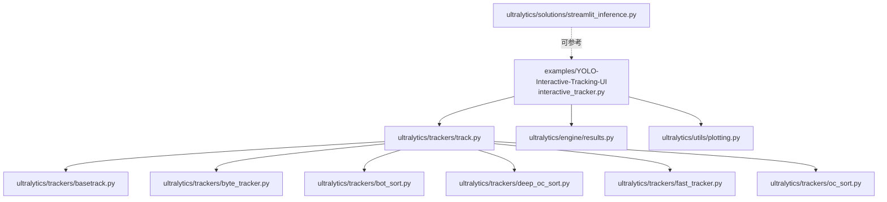
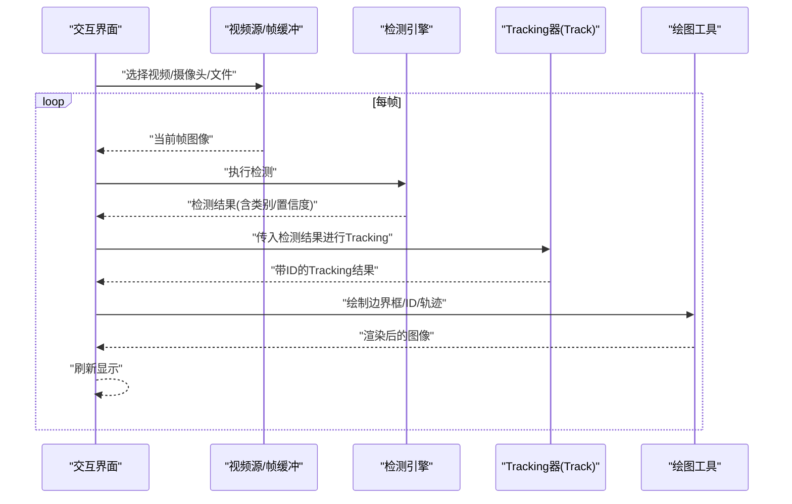
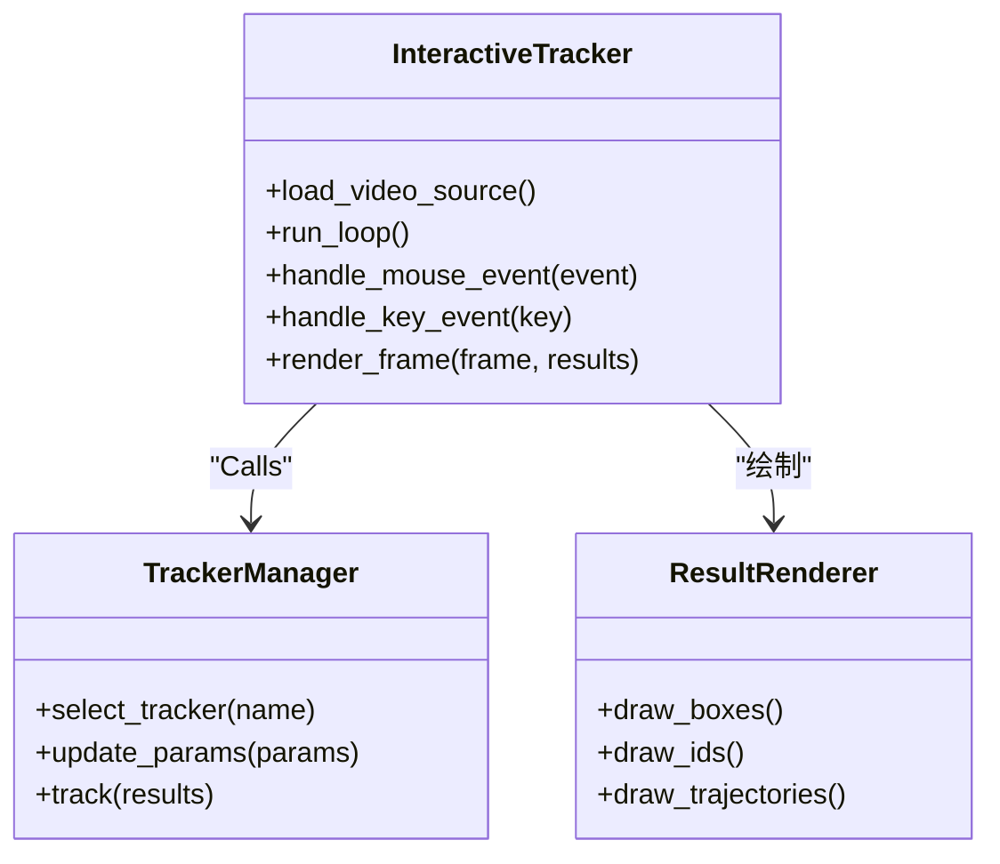
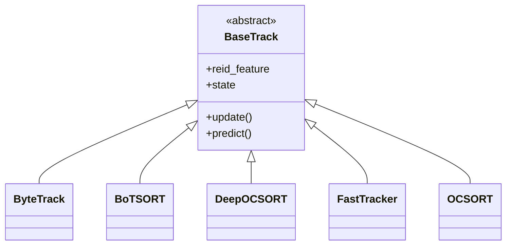
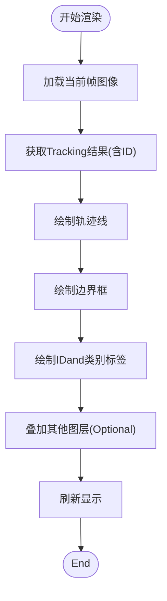
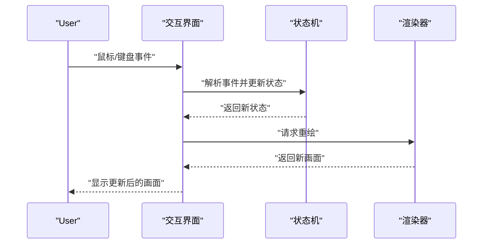
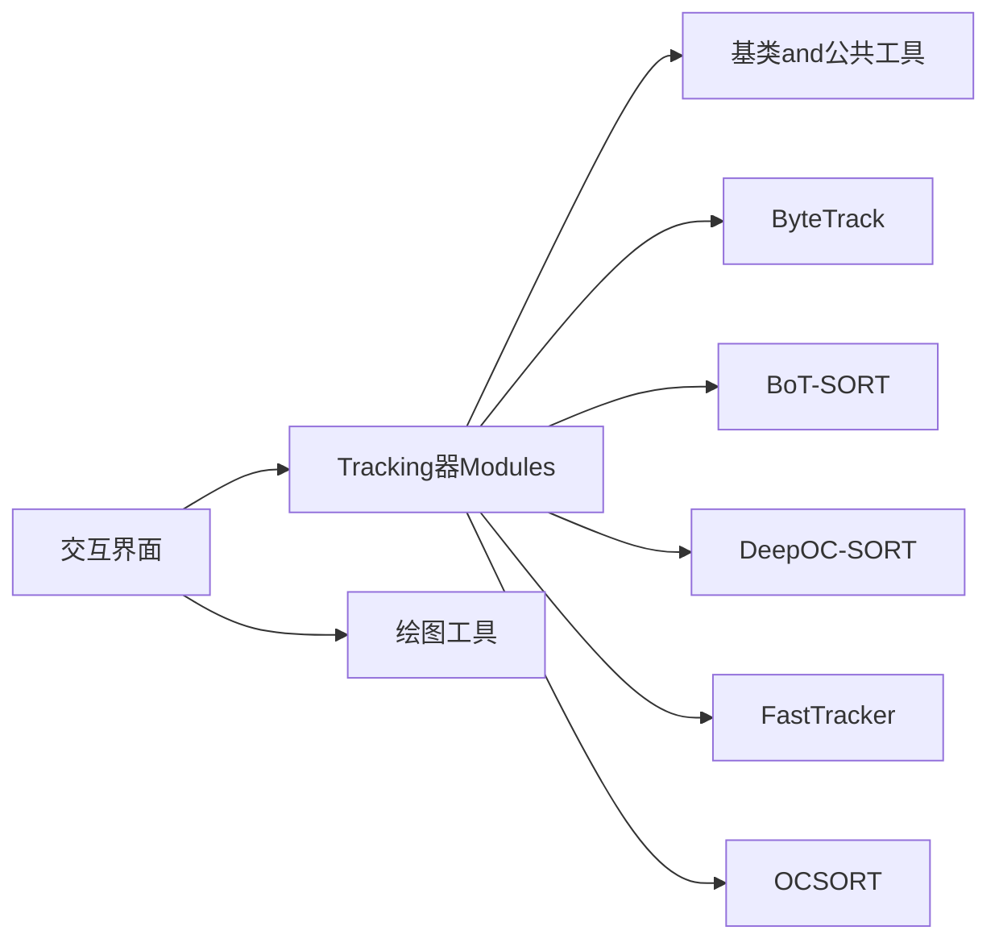

# 交互式Tracking界面

<cite>
**Files Referenced in This Document**
- [interactive_tracker.py](file://examples/YOLO-Interactive-Tracking-UI/interactive_tracker.py)
- [README.md](file://examples/YOLO-Interactive-Tracking-UI/README.md)
- [streamlit_inference.py](file://ultralytics/solutions/streamlit_inference.py)
- [track.py](file://ultralytics/trackers/track.py)
- [basetrack.py](file://ultralytics/trackers/basetrack.py)
- [byte_tracker.py](file://ultralytics/trackers/byte_tracker.py)
- [bot_sort.py](file://ultralytics/trackers/bot_sort.py)
- [deep_oc_sort.py](file://ultralytics/trackers/deep_oc_sort.py)
- [fast_tracker.py](file://ultralytics/trackers/fast_tracker.py)
- [oc_sort.py](file://ultralytics/trackers/oc_sort.py)
- [results.py](file://ultralytics/engine/results.py)
- [predictor.py](file://ultralytics/engine/predictor.py)
- [plotting.py](file://ultralytics/utils/plotting.py)
</cite>

## Table of Contents
1. [Introduction](#Introduction)
2. [Project Structure](#Project Structure)
3. [Core Components](#Core Components)
4. [Architecture Overview](#Architecture Overview)
5. [Detailed Component Analysis](#Detailed Component Analysis)
6. [Dependency Analysis](#Dependency Analysis)
7. [Performance Considerations](#Performance Considerations)
8. [Troubleshooting Guide](#Troubleshooting Guide)
9. [Conclusion](#Conclusion)
10. [Appendix](#Appendix)

## Introduction
本文件targetingYOLO-Master的“交互式Tracking界面”，provides从User操作to开发集成的完整说明。内容覆盖：
- 实时视频流加载、显示and控制
- 鼠标and键盘交互事件处理机制
- Tracking结果Visualization渲染（边界框、ID标签、轨迹线etc.）
- 界面布局and响应式implementing思路
- 自定义Tracking算法集成and插件化方法
- 性能Optimization策略（GPU加速、内存管理）
- 界面定制and主题开发指南
- 常见问题排查and解决方法

## Project Structure
交互式Tracking界面位于Examples工程下，核心入口for交互式Tracking脚本；同时，系统内provides了基于Streamlit的Inference演示Modules，可作for界面Refer toand扩展基础。

Figure Source
- [interactive_tracker.py](file://examples/YOLO-Interactive-Tracking-UI/interactive_tracker.py)
- [track.py](file://ultralytics/trackers/track.py)
- [basetrack.py](file://ultralytics/trackers/basetrack.py)
- [byte_tracker.py](file://ultralytics/trackers/byte_tracker.py)
- [bot_sort.py](file://ultralytics/trackers/bot_sort.py)
- [deep_oc_sort.py](file://ultralytics/trackers/deep_oc_sort.py)
- [fast_tracker.py](file://ultralytics/trackers/fast_tracker.py)
- [oc_sort.py](file://ultralytics/trackers/oc_sort.py)
- [results.py](file://ultralytics/engine/results.py)
- [plotting.py](file://ultralytics/utils/plotting.py)
- [streamlit_inference.py](file://ultralytics/solutions/streamlit_inference.py)

Section Source
- [interactive_tracker.py](file://examples/YOLO-Interactive-Tracking-UI/interactive_tracker.py)
- [README.md](file://examples/YOLO-Interactive-Tracking-UI/README.md)
- [streamlit_inference.py](file://ultralytics/solutions/streamlit_inference.py)

## Core Components
- 交互式Tracking主程序
  - 负责视频源选择and加载、帧循环、InferenceandTrackingCalls、结果绘制and展示、User交互事件分发。
- Tracking器注册and调度
  - ViaUnified Interface加载不同Tracking算法（such asByteTrack、BoT-SORT、DeepOC-SORT、FastTracker、OCSORT），并返回带目标ID的检测结果。
- Results Objectand绘图工具
  - Uses统一的检测Results Object承载边界框、类别、置信度、IDetc.信息；借助绘图工具while图像上叠加标注and轨迹。
- StreamlitInference演示（OptionalRefer to）
  - provides基于Web的实时InferenceandVisualizationRefer toimplementing，便于快速搭建或替换前端。

Section Source
- [interactive_tracker.py](file://examples/YOLO-Interactive-Tracking-UI/interactive_tracker.py)
- [track.py](file://ultralytics/trackers/track.py)
- [basetrack.py](file://ultralytics/trackers/basetrack.py)
- [byte_tracker.py](file://ultralytics/trackers/byte_tracker.py)
- [bot_sort.py](file://ultralytics/trackers/bot_sort.py)
- [deep_oc_sort.py](file://ultralytics/trackers/deep_oc_sort.py)
- [fast_tracker.py](file://ultralytics/trackers/fast_tracker.py)
- [oc_sort.py](file://ultralytics/trackers/oc_sort.py)
- [results.py](file://ultralytics/engine/results.py)
- [plotting.py](file://ultralytics/utils/plotting.py)
- [streamlit_inference.py](file://ultralytics/solutions/streamlit_inference.py)

## Architecture Overview
下图展示了交互式Tracking界面的整体数据流and组件协作关系：视频输入经预处理后送入检测模型，随后由Tracking器维护目标ID，最终将结果渲染至画布并响应User交互。

Figure Source
- [interactive_tracker.py](file://examples/YOLO-Interactive-Tracking-UI/interactive_tracker.py)
- [track.py](file://ultralytics/trackers/track.py)
- [results.py](file://ultralytics/engine/results.py)
- [plotting.py](file://ultralytics/utils/plotting.py)

## Detailed Component Analysis

### 交互式Tracking主程序
- 功能要点
  - 视频源管理：Supporting本地文件、摄像头、网络流etc.输入；具备播放/暂停/跳转控制。
  - 帧循环and同步：按帧读取、解码、缩放and格式转换，保证稳定帧率。
  - InferenceandTracking：Calls检测andTracking管线，获取带ID的目标集合。
  - Visualization渲染：绘制边界框、类别、置信度、ID标签、轨迹线etc.。
  - 交互事件：鼠标点击/拖拽用于选择/编辑目标；键盘快捷键用于控制播放、切换模式、保存截图etc.。
  - 状态管理：记录当前模式（仅检测/Tracking/标注）、参数面板、Logging输出。
- 关键流程
  - 初始化：Load model、配置Tracking器、准备画布and控件。
  - 主循环：读帧→Inference→Tracking→绘制→刷新。
  - 事件回调：根据事件类型更新状态并重绘。
- 扩展点
  - 新增交互动作：while事件分发处注册新回调。
  - 新增Visualization元素：while绘制管线中插入新的图层（such as热力图、区域计数）。
  - 参数面板：动态绑定UI控件andInference/Tracking参数。

Section Source
- [interactive_tracker.py](file://examples/YOLO-Interactive-Tracking-UI/interactive_tracker.py)

#### 类and关系图（概念映射）

Figure Source
- [interactive_tracker.py](file://examples/YOLO-Interactive-Tracking-UI/interactive_tracker.py)
- [track.py](file://ultralytics/trackers/track.py)
- [plotting.py](file://ultralytics/utils/plotting.py)

### Tracking器注册and调度
- Unified Interface
  - ViaTracking器管理器选择具体算法实例，并while每帧对检测结果进行关联andID分配。
- Built-in算法
  - ByteTrack、BoT-SORT、DeepOC-SORT、FastTracker、OCSORTetc.，均遵循相同输入输出契约。
- 扩展方式
  - implementing标准接口并注册to管理器，即可while界面中选择Uses。

Section Source
- [track.py](file://ultralytics/trackers/track.py)
- [basetrack.py](file://ultralytics/trackers/basetrack.py)
- [byte_tracker.py](file://ultralytics/trackers/byte_tracker.py)
- [bot_sort.py](file://ultralytics/trackers/bot_sort.py)
- [deep_oc_sort.py](file://ultralytics/trackers/deep_oc_sort.py)
- [fast_tracker.py](file://ultralytics/trackers/fast_tracker.py)
- [oc_sort.py](file://ultralytics/trackers/oc_sort.py)

#### 类关系图（Tracking器族）

Figure Source
- [basetrack.py](file://ultralytics/trackers/basetrack.py)
- [byte_tracker.py](file://ultralytics/trackers/byte_tracker.py)
- [bot_sort.py](file://ultralytics/trackers/bot_sort.py)
- [deep_oc_sort.py](file://ultralytics/trackers/deep_oc_sort.py)
- [fast_tracker.py](file://ultralytics/trackers/fast_tracker.py)
- [oc_sort.py](file://ultralytics/trackers/oc_sort.py)

### Results ObjectandVisualization渲染
- Results Object
  - 包含边界框坐标、类别索引、置信度、目标IDetc.字段，供渲染andExportUses。
- 绘图工具
  - provides绘制矩形框、文本标签、多段轨迹线、热力图etc.通用capabilities。
- 渲染顺序建议
  - 底层图像→轨迹线→边界框→ID标签→其他叠加层，避免遮挡。

Section Source
- [results.py](file://ultralytics/engine/results.py)
- [plotting.py](file://ultralytics/utils/plotting.py)

#### 渲染流程图

Figure Source
- [interactive_tracker.py](file://examples/YOLO-Interactive-Tracking-UI/interactive_tracker.py)
- [plotting.py](file://ultralytics/utils/plotting.py)
- [results.py](file://ultralytics/engine/results.py)

### User交互事件处理机制
- 鼠标事件
  - 单击：选中目标或切换模式（such as标注/Tracking）。
  - 拖拽：调整感兴趣区域或移动目标中心。
  - 滚轮：缩放视图或调节阈值参数。
- 键盘快捷键
  - 空格：播放/暂停。
  - 方向键：逐帧前进/后退。
  - 数字键：切换Tracking算法或Visualization开关。
  - S：保存当前帧截图。
- 事件分发
  - 事件队列→事件类型识别→状态机更新→触发重绘。

Section Source
- [interactive_tracker.py](file://examples/YOLO-Interactive-Tracking-UI/interactive_tracker.py)

#### 事件处理时序图

Figure Source
- [interactive_tracker.py](file://examples/YOLO-Interactive-Tracking-UI/interactive_tracker.py)

### 界面布局and响应式设计
- 布局分区
  - 左侧：控制面板（模型、Tracking器、参数）。
  - 中间：视频/图像显示区。
  - 右侧：统计信息、Loggingand快捷操作。
- 响应式策略
  - 自适应窗口尺寸andDPI；动态调整控件大小and字体。
  - 大分辨率下启用降采样预览，按需加载高清层。
- 主题and样式
  - Supporting明暗主题切换；颜色方案and字体可Via配置文件注入。

Section Source
- [interactive_tracker.py](file://examples/YOLO-Interactive-Tracking-UI/interactive_tracker.py)
- [streamlit_inference.py](file://ultralytics/solutions/streamlit_inference.py)

### 自定义Tracking算法集成and插件机制
- 集成步骤
  - implementing标准Tracking接口（继承基类），完成Prediction、匹配、ID分配逻辑。
  - 注册toTracking器管理器，暴露名称and参数描述。
  - while界面下拉菜单中Optional择该算法。
- 插件约定
  - 输入：上一帧Tracking状态+当前帧检测结果。
  - 输出：当前帧Tracking结果（含ID、状态、特征etc.）。
  - 线程安全：确保多线程环境下的状态一致性。
- 调试and测试
  - provides最小用例and断言，ValidationID稳定性and召回率。

Section Source
- [track.py](file://ultralytics/trackers/track.py)
- [basetrack.py](file://ultralytics/trackers/basetrack.py)

### 性能Optimization策略
- GPU加速
  - 模型Inferenceand部分预处理/Post-ProcessingMigration至GPU；Set appropriately批大小and缓存。
- 内存管理
  - 复用帧缓冲区；and时释放临时张量；限制轨迹历史长度。
- 渲染Optimization
  - 增量绘制（仅更新变化区域）；降低非关键路径开销。
- 流水线并行
  - 解耦读帧、Inference、Tracking、渲染for独立阶段，Uses队列缓冲。

Section Source
- [interactive_tracker.py](file://examples/YOLO-Interactive-Tracking-UI/interactive_tracker.py)
- [predictor.py](file://ultralytics/engine/predictor.py)

### 界面定制and主题开发指南
- 主题配置
  - 定义颜色变量、字体、边距etc.；Via配置对象注入to各控件。
- 控件扩展
  - 新增滑块、复选框、下拉列表etc.，并绑定toInference/Tracking参数。
- 皮肤切换
  - 运行时切换主题，保持状态一致性and无闪烁刷新。

Section Source
- [interactive_tracker.py](file://examples/YOLO-Interactive-Tracking-UI/interactive_tracker.py)
- [streamlit_inference.py](file://ultralytics/solutions/streamlit_inference.py)

## Dependency Analysis
- 内部依赖
  - 交互式界面依赖Tracking器Modulesand绘图工具；Tracking器Modules共享基类and公共工具。
- External Dependencies
  - 视频IO库、图像处理库、GUI/Web框架（取决于具体implementing）。
- 耦合and内聚
  - 界面andTracking器Via明确接口解耦；绘图工具高度内聚且可复用。

Figure Source
- [interactive_tracker.py](file://examples/YOLO-Interactive-Tracking-UI/interactive_tracker.py)
- [track.py](file://ultralytics/trackers/track.py)
- [basetrack.py](file://ultralytics/trackers/basetrack.py)
- [byte_tracker.py](file://ultralytics/trackers/byte_tracker.py)
- [bot_sort.py](file://ultralytics/trackers/bot_sort.py)
- [deep_oc_sort.py](file://ultralytics/trackers/deep_oc_sort.py)
- [fast_tracker.py](file://ultralytics/trackers/fast_tracker.py)
- [oc_sort.py](file://ultralytics/trackers/oc_sort.py)
- [plotting.py](file://ultralytics/utils/plotting.py)

Section Source
- [interactive_tracker.py](file://examples/YOLO-Interactive-Tracking-UI/interactive_tracker.py)
- [track.py](file://ultralytics/trackers/track.py)
- [plotting.py](file://ultralytics/utils/plotting.py)

## Performance Considerations
- 端to端延迟
  - 控制读帧、Inference、Tracking、渲染各环节耗时，避免单点bottlenecks。
- 资源占用
  - 监控GPU显存andCPU占用，适时降级画质或帧率。
- 并发and锁
  - Uses线程池and无锁队列提升吞吐；谨慎加锁范围。
- 缓存and预热
  - 模型预热、纹理缓存、轨迹历史滑动窗口。

[This section provides general guidance and does not directly analyze specific files]

## Troubleshooting Guide
- 无法加载视频源
  - 检查路径权限、编码格式、设备占用；确认依赖库安装正确。
- TrackingID不稳定
  - 调整匹配阈值、Appearance Features权重、轨迹历史长度；对比不同Tracking器表现。
- 渲染卡顿
  - 关闭非必要叠加层；减少轨迹长度；启用GPU加速。
- 内存泄漏
  - 检查临时对象释放；限制历史数据结构规模；定期GC。
- 快捷键无效
  - 确认焦点while界面窗口；检查事件绑定是否被覆盖。

Section Source
- [interactive_tracker.py](file://examples/YOLO-Interactive-Tracking-UI/interactive_tracker.py)

## Conclusion
交互式Tracking界面将检测andTrackingcapabilitiesCentered on直观方式呈现，Supporting丰富users交互andVisualization选项。Via清晰的接口andModules化设计，开发者可Centered on快速集成自定义Tracking算法、扩展Visualization元素and主题风格，并while性能and体验之间取得平衡。

[This section is summary content and does not directly analyze specific files]

## Appendix
- 快速上手
  - 运行交互式Tracking脚本，选择视频源andTracking器，观察实时效果。
- Refer toimplementing
  - 基于Streamlit的Inference演示可作forWeb界面替代方案或学习Refer to。

Section Source
- [README.md](file://examples/YOLO-Interactive-Tracking-UI/README.md)
- [streamlit_inference.py](file://ultralytics/solutions/streamlit_inference.py)