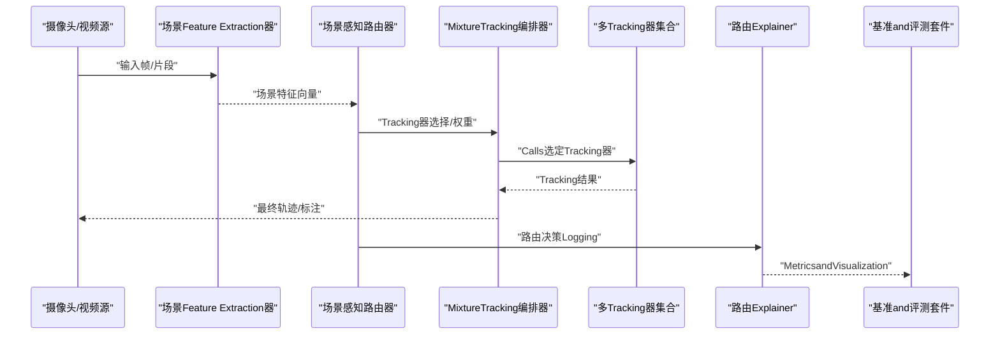
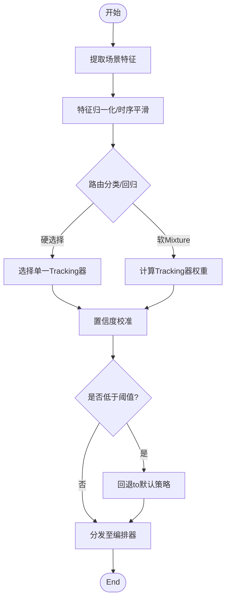
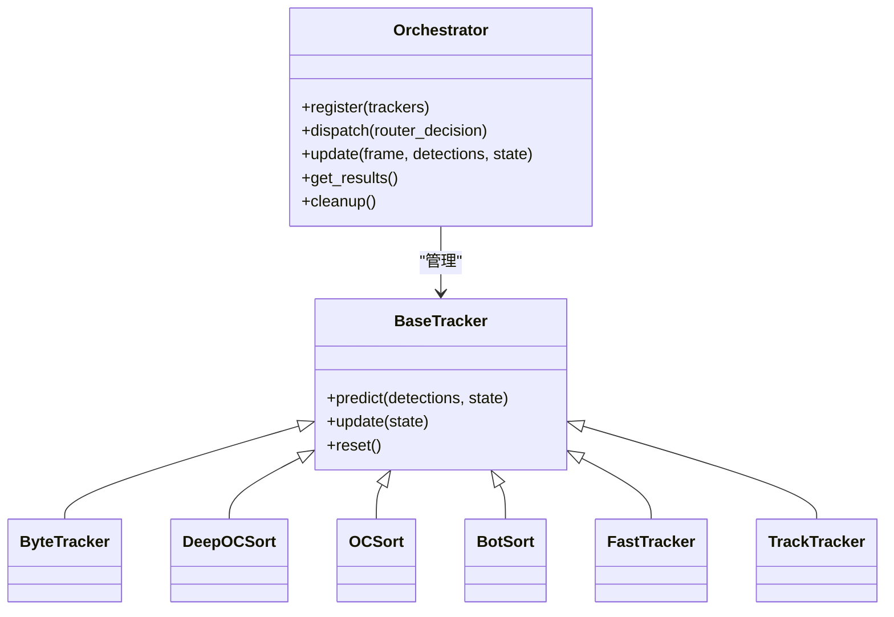
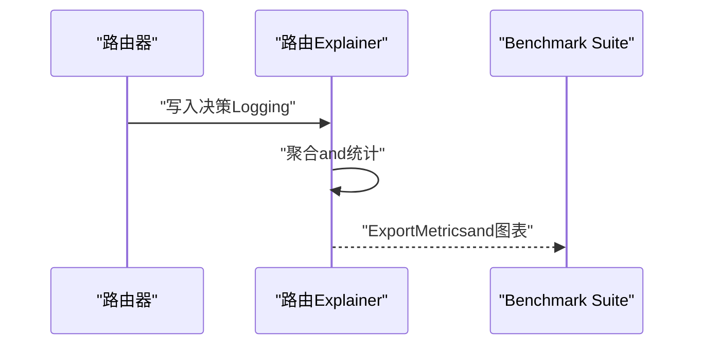
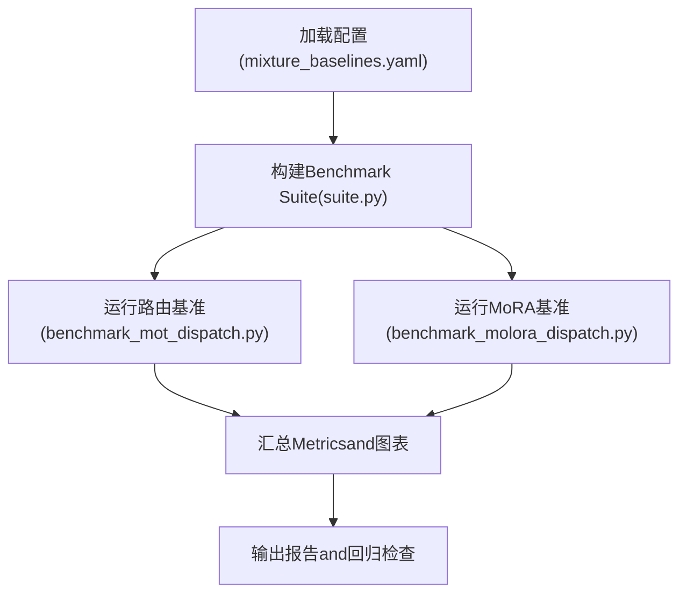
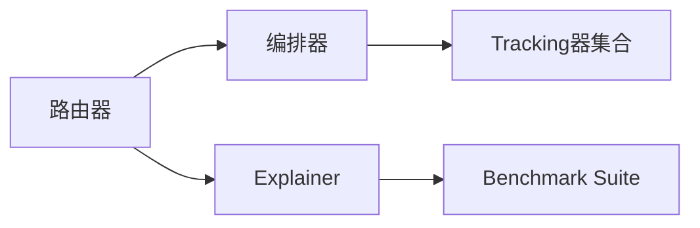

# 场景感知路由andMixture架构

<cite>
**Files Referenced in This Document**
- [mot-hybrid-architecture.md](file://docs/plans/mot-hybrid-architecture.md)
- [2026-07-17-mot-scene-aware-router.md](file://docs/plans/2026-07-17-mot-scene-aware-router.md)
- [routing-interpreter-toolkit.md](file://docs/plans/2026-07-17-routing-interpreter-toolkit.md)
- [benchmark_molora_dispatch.py](file://benchmarks/benchmark_molora_dispatch.py)
- [benchmark_mot_dispatch.py](file://benchmarks/benchmark_mot_dispatch.py)
- [suite.py](file://benchmarks/suite.py)
- [run.py](file://benchmarks/run.py)
- [mixture_baselines.yaml](file://benchmarks/mixture_baselines.yaml)
- [test_mot_scene_aware_router.py](file://tests/test_mot_scene_aware_router.py)
- [test_mot_routing_diagnostics.py](file://tests/test_mot_routing_diagnostics.py)
- [analyze_mot_routing.py](file://scripts/analyze_mot_routing.py)
- [diagnose_mot_routing.py](file://scripts/diagnose_mot_routing.py)
- [prepare_mot_routing_scenes.py](file://scripts/prepare_mot_routing_scenes.py)
- [compare_mot_ablation.py](file://scripts/compare_mot_ablation.py)
- [ablation_routing_cl.py](file://scripts/ablation_suite/ablation_routing_cl.py)
- [ablation_full_scenarios.py](file://scripts/ablation_suite/full_ablation_scenarios.py)
- [track.py](file://ultralytics/trackers/track.py)
- [basetrack.py](file://ultralytics/trackers/basetrack.py)
- [byte_tracker.py](file://ultralytics/trackers/byte_tracker.py)
- [deep_oc_sort.py](file://ultralytics/trackers/deep_oc_sort.py)
- [oc_sort.py](file://ultralytics/trackers/oc_sort.py)
- [bot_sort.py](file://ultralytics/trackers/bot_sort.py)
- [fast_tracker.py](file://ultralytics/trackers/fast_tracker.py)
- [track_tracker.py](file://ultralytics/trackers/track_tracker.py)
- [__init__.py](file://ultralytics/trackers/__init__.py)
- [utils/routing_interpreter.py](file://ultralytics/utils/routing_interpreter.py)
- [tools/routing_interpreter.py](file://tools/routing_interpreter.py)
- [governance/routing-interpretability.md](file://docs/governance/routing-interpretability.md)
</cite>

## Table of Contents
1. [引言](#引言)
2. [Project Structure](#Project Structure)
3. [Core Components](#Core Components)
4. [Architecture Overview](#Architecture Overview)
5. [Detailed Component Analysis](#Detailed Component Analysis)
6. [Dependency Analysis](#Dependency Analysis)
7. [性能考量](#性能考量)
8. [Troubleshooting Guide](#Troubleshooting Guide)
9. [Conclusion](#Conclusion)
10. [Appendix](#Appendix)

## 引言
本技术Documentation围绕YOLO-MasterwhileMulti-Object Tracking（MOT）中的“场景感知路由andMixture架构”unfold，系统性阐述Centered on下主题：
- 场景感知的概念and设计思想：such as何从视频帧或局部场景中抽取可区分特征，Centered on指导不同Tracking算法的选择。
- Dynamic Routing器implementing原理：包括场景Feature Extraction、路由决策机制、Training策略andOptimization目标。
- Mixture架构设计模式：Supporting多种Tracking算法的动态切换andUnified Interface。
- 路由器的Training流程and最佳实践：Data Preparation、损失设计、校准andEvaluation。
- 不同场景下的routing strategiesand配置方法：典型场景分类、阈值and权重调优。
- 路由器andTracking算法的接口设计and集成方式：统一Calls契约、状态管理and资源调度。
- 路由性能监控and自适应调整机制：while线Metrics采集、Drift Detectionand回退策略。
- 分析and诊断工具：场景分类Visualization、路由效果归因and解释性报告。

## Project Structure
and场景感知路由和Mixture架构相关的代码andDocumentation分布whilesuch as下位置：
- 规划and设计Documentation：位于 docs/plans and docs/governance，定义整体方案、边界and治理要求。
- 基准Test Suite：位于 benchmarks，provides路由andMixtureInference的性能对比and回归基线。
- 单元测试and验收用例：位于 tests，覆盖路由器行for、诊断and一致性校验。
- 脚本and分析工具：位于 scripts，包含场景准备、路由分析、消融实验and结果汇总。
- Tracking器Modules：位于 ultralytics/trackers，provides多类Tracking算法的统一Encapsulatesand接口。
- 路由Explainer：位于 ultralytics/utils and tools，provides路由决策的可解释性andVisualization。

```mermaid
graph TB
subgraph "规划and治理"
P1["plans/mot-hybrid-architecture.md"]
P2["plans/2026-07-17-mot-scene-aware-router.md"]
G1["governance/routing-interpretability.md"]
end
subgraph "基准测试"
B1["benchmarks/benchmark_molora_dispatch.py"]
B2["benchmarks/benchmark_mot_dispatch.py"]
B3["benchmarks/suite.py"]
B4["benchmarks/run.py"]
B5["benchmarks/mixture_baselines.yaml"]
end
subgraph "测试andValidation"
T1["tests/test_mot_scene_aware_router.py"]
T2["tests/test_mot_routing_diagnostics.py"]
end
subgraph "脚本and工具"
S1["scripts/analyze_mot_routing.py"]
S2["scripts/diagnose_mot_routing.py"]
S3["scripts/prepare_mot_routing_scenes.py"]
S4["scripts/compare_mot_ablation.py"]
S5["scripts/ablation_suite/ablation_routing_cl.py"]
S6["scripts/ablation_suite/full_ablation_scenarios.py"]
U1["ultralytics/utils/routing_interpreter.py"]
U2["tools/routing_interpreter.py"]
end
subgraph "Tracking器Modules"
M0["ultralytics/trackers/__init__.py"]
M1["ultralytics/trackers/track.py"]
M2["ultralytics/trackers/basetrack.py"]
M3["ultralytics/trackers/byte_tracker.py"]
M4["ultralytics/trackers/deep_oc_sort.py"]
M5["ultralytics/trackers/oc_sort.py"]
M6["ultralytics/trackers/bot_sort.py"]
M7["ultralytics/trackers/fast_tracker.py"]
M8["ultralytics/trackers/track_tracker.py"]
end
P1 --> B1
P2 --> T1
G1 --> U1
B3 --> B1
B3 --> B2
S1 --> T2
S2 --> T2
S3 --> S1
S4 --> S1
S5 --> S1
S6 --> S1
U1 --> M0
U2 --> M0
M0 --> M1
M1 --> M2
M1 --> M3
M1 --> M4
M1 --> M5
M1 --> M6
M1 --> M7
M1 --> M8
```

Figure Source
- [mot-hybrid-architecture.md](file://docs/plans/mot-hybrid-architecture.md)
- [2026-07-17-mot-scene-aware-router.md](file://docs/plans/2026-07-17-mot-scene-aware-router.md)
- [routing-interpretability.md](file://docs/governance/routing-interpretability.md)
- [benchmark_molora_dispatch.py](file://benchmarks/benchmark_molora_dispatch.py)
- [benchmark_mot_dispatch.py](file://benchmarks/benchmark_mot_dispatch.py)
- [suite.py](file://benchmarks/suite.py)
- [run.py](file://benchmarks/run.py)
- [mixture_baselines.yaml](file://benchmarks/mixture_baselines.yaml)
- [test_mot_scene_aware_router.py](file://tests/test_mot_scene_aware_router.py)
- [test_mot_routing_diagnostics.py](file://tests/test_mot_routing_diagnostics.py)
- [analyze_mot_routing.py](file://scripts/analyze_mot_routing.py)
- [diagnose_mot_routing.py](file://scripts/diagnose_mot_routing.py)
- [prepare_mot_routing_scenes.py](file://scripts/prepare_mot_routing_scenes.py)
- [compare_mot_ablation.py](file://scripts/compare_mot_ablation.py)
- [ablation_routing_cl.py](file://scripts/ablation_suite/ablation_routing_cl.py)
- [full_ablation_scenarios.py](file://scripts/ablation_suite/full_ablation_scenarios.py)
- [routing_interpreter.py](file://ultralytics/utils/routing_interpreter.py)
- [routing_interpreter.py](file://tools/routing_interpreter.py)
- [__init__.py](file://ultralytics/trackers/__init__.py)
- [track.py](file://ultralytics/trackers/track.py)
- [basetrack.py](file://ultralytics/trackers/basetrack.py)
- [byte_tracker.py](file://ultralytics/trackers/byte_tracker.py)
- [deep_oc_sort.py](file://ultralytics/trackers/deep_oc_sort.py)
- [oc_sort.py](file://ultralytics/trackers/oc_sort.py)
- [bot_sort.py](file://ultralytics/trackers/bot_sort.py)
- [fast_tracker.py](file://ultralytics/trackers/fast_tracker.py)
- [track_tracker.py](file://ultralytics/trackers/track_tracker.py)

Section Source
- [mot-hybrid-architecture.md](file://docs/plans/mot-hybrid-architecture.md)
- [2026-07-17-mot-scene-aware-router.md](file://docs/plans/2026-07-17-mot-scene-aware-router.md)
- [routing-interpretability.md](file://docs/governance/routing-interpretability.md)

## Core Components
- 场景感知路由器：负责从输入帧或局部窗口中提取场景特征，并基于学习to的策略选择最优Tracking算法或组合策略。
- MixtureTracking编排器：统一管理多个Tracking器实例的生命周期、参数注入and结果融合，屏蔽底层差异。
- 路由Explainer：对路由决策进行归因andVisualization，输出专家Uses分布、置信度and时序稳定性etc.Metrics。
- 基准and评测套件：provides端to端的路由+Tracking性能对比、回归基线and消融实验capabilities。
- 诊断andVisualization工具：用于离线分析路由效果、场景分布and模型漂移，辅助迭代Optimization。

Section Source
- [2026-07-17-mot-scene-aware-router.md](file://docs/plans/2026-07-17-mot-scene-aware-router.md)
- [mot-hybrid-architecture.md](file://docs/plans/mot-hybrid-architecture.md)
- [routing-interpretability.md](file://docs/governance/routing-interpretability.md)

## Architecture Overview
下图展示了场景感知路由andMixture架构的整体数据流and控制流：输入帧经场景Feature Extraction后进入路由器，路由器输出Tracking器选择或权重；编排器根据决策加载或复用对应Tracking器，执行Tracking并返回结果；ExplainerandBenchmark Suitewhile旁路记录MetricsandVisualization。

Figure Source
- [2026-07-17-mot-scene-aware-router.md](file://docs/plans/2026-07-17-mot-scene-aware-router.md)
- [benchmark_mot_dispatch.py](file://benchmarks/benchmark_mot_dispatch.py)
- [benchmark_molora_dispatch.py](file://benchmarks/benchmark_molora_dispatch.py)
- [routing_interpreter.py](file://ultralytics/utils/routing_interpreter.py)
- [routing_interpreter.py](file://tools/routing_interpreter.py)

## Detailed Component Analysis

### 场景感知路由器
- 功能职责
  - 场景Feature Extraction：从单帧或多帧窗口中抽取结构化特征（such as密度、遮挡比例、运动强度、类别先验etc.）。
  - 路由决策：将场景特征映射to具体Tracking器或软权重，Supporting硬选择and软Mixture两种模式。
  - Trainingand校准：Via监督信号或强化学习信号Optimization路由网络，并进行置信度校准Centered on保证稳定性。
- 关键设计点
  - 特征工程and表示：强调跨场景鲁棒性and时序平滑，避免过拟合特定数据集。
  - 决策空间约束：限制专家数量and激活稀疏性，降低计算开销and内存占用。
  - 容错and回退：当置信度低或异常时，回退to默认Tracking器或保守策略。
- 接口约定
  - 输入：场景特征向量、Optional上下文（such as历史路由、时间步）。
  - 输出：Tracking器索引或权重分布、置信度、解释信息。
- Training策略andOptimization目标
  - 监督式：Centered on各Tracking器while场景子集上的表现作for标签，最小化路由误差。
  - 联合式：and下游TrackingTasks联合Optimization，引入Routing Regularization项and稀疏约束。
  - 校准：温度缩放或保序回归，提升置信度可靠性。

Figure Source
- [2026-07-17-mot-scene-aware-router.md](file://docs/plans/2026-07-17-mot-scene-aware-router.md)
- [routing_interpreter.py](file://ultralytics/utils/routing_interpreter.py)

Section Source
- [2026-07-17-mot-scene-aware-router.md](file://docs/plans/2026-07-17-mot-scene-aware-router.md)

### MixtureTracking编排器
- 功能职责
  - Unified Interface：for上层provides一致的TrackingAPI，屏蔽不同Tracking器的差异。
  - 生命周期管理：按需加载/卸载Tracking器，缓存热路径，减少启动延迟。
  - 结果融合：对软Mixture输出的轨迹进行加权融合或冲突消解。
- and路由器的协作
  - 接收路由器的选择或权重，按策略实例化或复用Tracking器。
  - 上报运行时Metrics（耗时、显存、吞吐）给ExplainerandBenchmark Suite。
- 接口约定
  - 初始化：注册可用Tracking器、设置全局参数and设备。
  - Inference：传入检测结果and上一帧状态，返回当前帧轨迹。
  - 清理：释放资源、重置内部状态。

Figure Source
- [track.py](file://ultralytics/trackers/track.py)
- [basetrack.py](file://ultralytics/trackers/basetrack.py)
- [byte_tracker.py](file://ultralytics/trackers/byte_tracker.py)
- [deep_oc_sort.py](file://ultralytics/trackers/deep_oc_sort.py)
- [oc_sort.py](file://ultralytics/trackers/oc_sort.py)
- [bot_sort.py](file://ultralytics/trackers/bot_sort.py)
- [fast_tracker.py](file://ultralytics/trackers/fast_tracker.py)
- [track_tracker.py](file://ultralytics/trackers/track_tracker.py)

Section Source
- [track.py](file://ultralytics/trackers/track.py)
- [basetrack.py](file://ultralytics/trackers/basetrack.py)
- [byte_tracker.py](file://ultralytics/trackers/byte_tracker.py)
- [deep_oc_sort.py](file://ultralytics/trackers/deep_oc_sort.py)
- [oc_sort.py](file://ultralytics/trackers/oc_sort.py)
- [bot_sort.py](file://ultralytics/trackers/bot_sort.py)
- [fast_tracker.py](file://ultralytics/trackers/fast_tracker.py)
- [track_tracker.py](file://ultralytics/trackers/track_tracker.py)

### 路由Explainerand可解释性
- 功能职责
  - 收集路由决策Logging：记录每帧的场景特征、选择/权重、置信度and耗时。
  - 生成解释报告：统计专家Uses分布、场景聚类、错误归因and稳定性Metrics。
  - Visualization：绘制路由热力图、时序曲线and混淆矩阵。
- 集成方式
  - while路由器and编排器之间插入钩子，异步写入Metricsand中间产物。
  - andBenchmark Suite对接，自动产出对比图表and回归告警。

Figure Source
- [routing_interpreter.py](file://ultralytics/utils/routing_interpreter.py)
- [routing_interpreter.py](file://tools/routing_interpreter.py)
- [benchmark_mot_dispatch.py](file://benchmarks/benchmark_mot_dispatch.py)
- [benchmark_molora_dispatch.py](file://benchmarks/benchmark_molora_dispatch.py)

Section Source
- [routing_interpreter.py](file://ultralytics/utils/routing_interpreter.py)
- [routing_interpreter.py](file://tools/routing_interpreter.py)
- [routing-interpretability.md](file://docs/governance/routing-interpretability.md)

### 基准测试and评测套件
- 功能职责
  - provides统一的运行入口and配置解析，Supporting多场景、多Tracking器androuting strategies的组合。
  - 输出标准Metrics（精度、召回、F1、HOTA、MOTAetc.）and性能Metrics（FPS、显存、CPU/GPU利用率）。
  - 维护回归基线，确保路由andMixture架构的改进不被退化。
- 关键文件
  - 运行器and套件：run.py、suite.py
  - 路由andMixture调度基准：benchmark_mot_dispatch.py、benchmark_molora_dispatch.py
  - 基线配置：mixture_baselines.yaml

Figure Source
- [run.py](file://benchmarks/run.py)
- [suite.py](file://benchmarks/suite.py)
- [benchmark_mot_dispatch.py](file://benchmarks/benchmark_mot_dispatch.py)
- [benchmark_molora_dispatch.py](file://benchmarks/benchmark_molora_dispatch.py)
- [mixture_baselines.yaml](file://benchmarks/mixture_baselines.yaml)

Section Source
- [run.py](file://benchmarks/run.py)
- [suite.py](file://benchmarks/suite.py)
- [benchmark_mot_dispatch.py](file://benchmarks/benchmark_mot_dispatch.py)
- [benchmark_molora_dispatch.py](file://benchmarks/benchmark_molora_dispatch.py)
- [mixture_baselines.yaml](file://benchmarks/mixture_baselines.yaml)

### Training流程and最佳实践
- Data Preparation
  - 场景划分：依据密度、遮挡、运动强度、类别分布etc.维度构造场景标签。
  - 样本均衡：对不同场景进行采样平衡，避免路由偏向多数场景。
- Training步骤
  - 预Training场景Feature Extraction器：while无监督或自监督Tasks上增强泛化。
  - 路由网络Training：监督信号来自各Tracking器while场景子集上的表现；加入稀疏and平滑正则。
  - 校准阶段：Uses独立Validation集进行置信度校准，提升稳定性。
- 最佳实践
  - 早停andValidation：监控路由准确率and下游TrackingMetrics，防止过拟合。
  - 增量更新：定期用新数据微调路由，保持对长尾场景的敏感度。
  - 资源约束：控制专家数量and激活规模，满足Edge Deployment需求。

Section Source
- [2026-07-17-mot-scene-aware-router.md](file://docs/plans/2026-07-17-mot-scene-aware-router.md)
- [prepare_mot_routing_scenes.py](file://scripts/prepare_mot_routing_scenes.py)
- [ablation_routing_cl.py](file://scripts/ablation_suite/ablation_routing_cl.py)

### 不同场景下的routing strategiesand配置
- 典型场景
  - 高密度人群：优先选择抗遮挡and强关联capabilities的Tracking器。
  - 快速运动：偏好高帧率、低延迟的轻量级Tracking器。
  - 复杂背景：需要更强的外观建模andRe-Identificationcapabilities。
- 配置方法
  - 场景阈值：调节特征空间的分割阈值，影响路由灵敏度。
  - 权重衰减：控制软Mixture的平滑程度，避免频繁切换。
  - 回退策略：设定置信度下限，触发默认Tracking器。
- 调优建议
  - 基于Benchmark Suite进行网格搜索and贝叶斯Optimization。
  - CombiningExplainer报告定位误判场景，针对性补充数据and正则。

Section Source
- [2026-07-17-mot-scene-aware-router.md](file://docs/plans/2026-07-17-mot-scene-aware-router.md)
- [compare_mot_ablation.py](file://scripts/compare_mot_ablation.py)
- [full_ablation_scenarios.py](file://scripts/ablation_suite/full_ablation_scenarios.py)

### 路由器andTracking算法的接口设计and集成
- Unified Interface
  - 初始化：注册Tracking器名称、参数模板and设备信息。
  - Inference：接收检测结果and状态，返回轨迹and元数据。
  - 清理：释放GPU/CPU资源，重置内部缓存。
- 集成要点
  - 状态隔离：每个Tracking器维护独立状态，避免交叉污染。
  - 资源池：对昂贵Tracking器进行预热and复用，降低冷启动开销。
  - 错误处理：捕获异常并记录，保证流水线稳定。

Section Source
- [__init__.py](file://ultralytics/trackers/__init__.py)
- [track.py](file://ultralytics/trackers/track.py)
- [basetrack.py](file://ultralytics/trackers/basetrack.py)

### 路由性能监控and自适应调整
- 监控Metrics
  - 路由准确率、专家Uses分布、置信度均值and方差。
  - 下游TrackingMetrics（HOTA、MOTA、IDF1）、延迟and吞吐。
- 自适应调整
  - 滑动窗口统计：检测场景分布漂移，触发路由微调或回退。
  - while线校准：动态调整温度参数，维持置信度可靠性。
  - 资源自适应：根据设备负载动态选择轻量或重型Tracking器。

Section Source
- [test_mot_routing_diagnostics.py](file://tests/test_mot_routing_diagnostics.py)
- [diagnose_mot_routing.py](file://scripts/diagnose_mot_routing.py)
- [routing-interpretability.md](file://docs/governance/routing-interpretability.md)

### 分析and诊断工具
- 场景准备
  - 自动化划分场景标签，生成Training/Validation/测试集。
- 路由分析
  - 统计专家Uses、场景聚类and错误归因，输出Visualization报告。
- 消融实验
  - 对比不同routing strategies、特征设计and正则项的效果。
- 工具清单
  - prepare_mot_routing_scenes.py：场景Data Preparation
  - analyze_mot_routing.py：路由效果分析
  - diagnose_mot_routing.py：诊断andVisualization
  - compare_mot_ablation.py：消融对比
  - ablation_routing_cl.py：路由持续学习消融
  - full_ablation_scenarios.py：全量场景消融

Section Source
- [prepare_mot_routing_scenes.py](file://scripts/prepare_mot_routing_scenes.py)
- [analyze_mot_routing.py](file://scripts/analyze_mot_routing.py)
- [diagnose_mot_routing.py](file://scripts/diagnose_mot_routing.py)
- [compare_mot_ablation.py](file://scripts/compare_mot_ablation.py)
- [ablation_routing_cl.py](file://scripts/ablation_suite/ablation_routing_cl.py)
- [full_ablation_scenarios.py](file://scripts/ablation_suite/full_ablation_scenarios.py)

## Dependency Analysis
- 组件耦合
  - 路由器and编排器松耦合：ViaUnified Interface通信，便于替换and扩展。
  - ExplainerandBenchmark Suite弱依赖：仅消费LoggingandMetrics，不影响主链路。
- External Dependencies
  - Tracking器implementing遵循统一协议，新增Tracking器无需修改路由器and编排器。
- Potential Cycles依赖
  - Via分层and接口抽象避免循环导入，确保可维护性。

Figure Source
- [2026-07-17-mot-scene-aware-router.md](file://docs/plans/2026-07-17-mot-scene-aware-router.md)
- [benchmark_mot_dispatch.py](file://benchmarks/benchmark_mot_dispatch.py)
- [routing_interpreter.py](file://ultralytics/utils/routing_interpreter.py)

Section Source
- [2026-07-17-mot-scene-aware-router.md](file://docs/plans/2026-07-17-mot-scene-aware-router.md)
- [benchmark_mot_dispatch.py](file://benchmarks/benchmark_mot_dispatch.py)
- [routing_interpreter.py](file://ultralytics/utils/routing_interpreter.py)

## 性能考量
- 计算开销
  - 场景Feature Extraction应轻量化，避免成forbottlenecks。
  - 路由决策需低延迟，必要时采用查表或近似匹配。
- 内存and显存
  - Tracking器按需加载，避免同时驻留过多重型模型。
  - 结果缓冲and批处理策略平衡吞吐and延迟。
- 可Extensibility
  - 插件化Tracking器注册机制，Supporting热插拔。
  - 配置drivers are installed的routing strategies，便于A/B测试and灰度发布。

## Troubleshooting Guide
- 常见问题
  - 路由不稳定：检查置信度校准and平滑正则，必要时提高回退阈值。
  - 专家偏斜：重新平衡场景数据，增加少数场景的正则权重。
  - 性能退化：核对Benchmark Suite配置and数据版本，确认无回归。
- 诊断步骤
  - UsesExplainer报告定位误判场景and高频切换帧。
  - ViaBenchmark Suite复现实验，对比不同策略and超参。
  - 逐步简化问题：关闭软Mixture、固定routing strategies，观察是否改善。

Section Source
- [test_mot_routing_diagnostics.py](file://tests/test_mot_routing_diagnostics.py)
- [diagnose_mot_routing.py](file://scripts/diagnose_mot_routing.py)
- [benchmark_mot_dispatch.py](file://benchmarks/benchmark_mot_dispatch.py)

## Conclusion
场景感知路由andMixture架构forMulti-Object Trackingprovides了灵活且高效的解决方案。Via合理的场景特征设计、稳健的路由决策and完善的监控解释体系，系统能够while多样化场景中取得更优的精度and性能平衡。Combined withBenchmark Suiteand诊断工具，团队可Centered on持续迭代andValidation，确保长期演进的质量and效率。

## Appendix
- 术语表
  - 场景感知：基于输入帧或片段的语义and统计特征进行决策。
  - 路由：将输入映射to具体Tracking器或权重分布的过程。
  - 软Mixture：对多个Tracking器结果进行加权融合的策略。
  - 校准：调整置信度使其and实际概率一致的技术。
- Refer toDocumentation
  - Mixture架构规划：[mot-hybrid-architecture.md](file://docs/plans/mot-hybrid-architecture.md)
  - 场景感知路由器规划：[2026-07-17-mot-scene-aware-router.md](file://docs/plans/2026-07-17-mot-scene-aware-router.md)
  - 路由可解释性治理：[routing-interpretability.md](file://docs/governance/routing-interpretability.md)