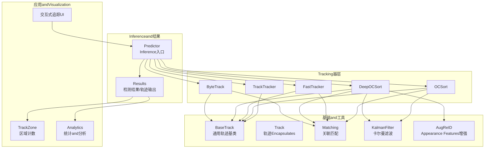
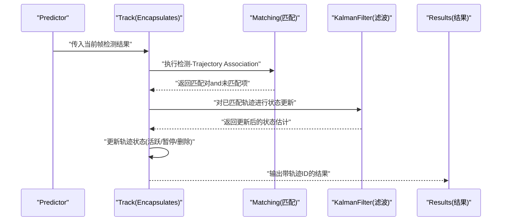
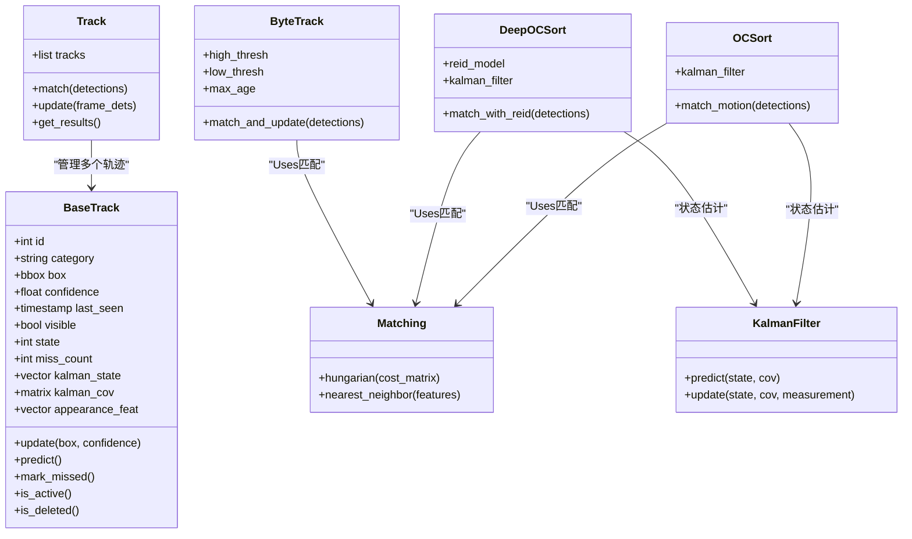
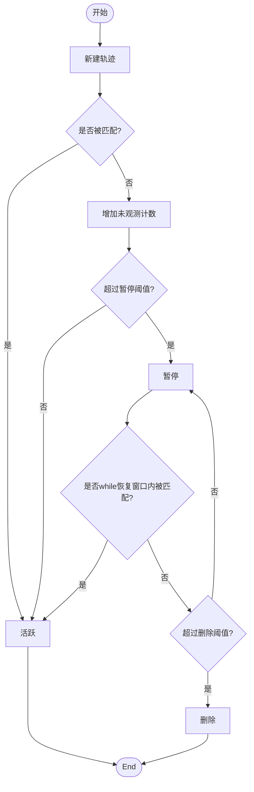
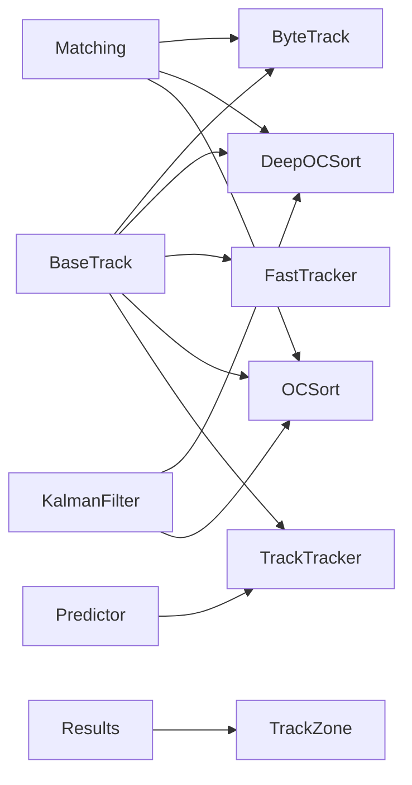

# 轨迹管理and生命周期

<cite>
**Files Referenced in This Document**
- [ultralytics/trackers/__init__.py](file://ultralytics/trackers/__init__.py)
- [ultralytics/trackers/basetrack.py](file://ultralytics/trackers/basetrack.py)
- [ultralytics/trackers/byte_tracker.py](file://ultralytics/trackers/byte_tracker.py)
- [ultralytics/trackers/deep_oc_sort.py](file://ultralytics/trackers/deep_oc_sort.py)
- [ultralytics/trackers/fast_tracker.py](file://ultralytics/trackers/fast_tracker.py)
- [ultralytics/trackers/oc_sort.py](file://ultralytics/trackers/oc_sort.py)
- [ultralytics/trackers/track.py](file://ultralytics/trackers/track.py)
- [ultralytics/trackers/track_tracker.py](file://ultralytics/trackers/track_tracker.py)
- [ultralytics/trackers/utils/matching.py](file://ultralytics/trackers/utils/matching.py)
- [ultralytics/trackers/utils/kalman_filter.py](file://ultralytics/trackers/utils/kalman_filter.py)
- [ultralytics/trackers/utils/aug_reid.py](file://ultralytics/trackers/utils/aug_reid.py)
- [ultralytics/engine/predictor.py](file://ultralytics/engine/predictor.py)
- [ultralytics/engine/results.py](file://ultralytics/engine/results.py)
- [ultralytics/solutions/trackzone.py](file://ultralytics/solutions/trackzone.py)
- [ultralytics/solutions/analytics.py](file://ultralytics/solutions/analytics.py)
- [examples/YOLO-Interactive-Tracking-UI/interactive_tracker.py](file://examples/YOLO-Interactive-Tracking-UI/interactive_tracker.py)
</cite>

## Table of Contents
1. [Introduction](#Introduction)
2. [Project Structure](#Project Structure)
3. [Core Components](#Core Components)
4. [Architecture Overview](#Architecture Overview)
5. [Detailed Component Analysis](#Detailed Component Analysis)
6. [Dependency Analysis](#Dependency Analysis)
7. [Performance Considerations](#Performance Considerations)
8. [Troubleshooting Guide](#Troubleshooting Guide)
9. [Conclusion](#Conclusion)
10. [Appendix](#Appendix)

## Introduction
本技术Documentation聚焦于 YOLO-Master 的轨迹管理and生命周期控制系统，围绕Centered on下目标unfold：
- 轨迹对象的数据结构and属性管理
- 轨迹生命周期状态and转换（新建、活跃、暂停、删除etc.）
- 置信度计算and更新机制
- 持久化存储and恢复策略
- 过滤and清理算法（长时间未观测目标处理）
- 轨迹合并and分裂处理逻辑
- 质量Evaluationand筛选标准
- 性能Optimization策略（内存管理and数据结构Optimization）
- Visualizationand调试工具Uses方法

## Project Structure
YOLO-Master 的轨迹管理相关代码主要位于 ultralytics/trackers and其子Modules中，并andInference引擎和Results Object紧密集成。整体组织方式such as下：
- 抽象基类and通用implementing：basetrack.py、track.py
- 具体Tracking器implementing：byte_tracker.py、deep_oc_sort.py、fast_tracker.py、oc_sort.py、track_tracker.py
- 工具库：matching.py、kalman_filter.py、aug_reid.py
- andInference流程集成：engine/predictor.py、engine/results.py
- 上层应用andVisualization：solutions/trackzone.py、solutions/analytics.py、examples/YOLO-Interactive-Tracking-UI/interactive_tracker.py

Figure Source
- [ultralytics/trackers/basetrack.py](file://ultralytics/trackers/basetrack.py)
- [ultralytics/trackers/track.py](file://ultralytics/trackers/track.py)
- [ultralytics/trackers/byte_tracker.py](file://ultralytics/trackers/byte_tracker.py)
- [ultralytics/trackers/deep_oc_sort.py](file://ultralytics/trackers/deep_oc_sort.py)
- [ultralytics/trackers/fast_tracker.py](file://ultralytics/trackers/fast_tracker.py)
- [ultralytics/trackers/oc_sort.py](file://ultralytics/trackers/oc_sort.py)
- [ultralytics/trackers/track_tracker.py](file://ultralytics/trackers/track_tracker.py)
- [ultralytics/trackers/utils/matching.py](file://ultralytics/trackers/utils/matching.py)
- [ultralytics/trackers/utils/kalman_filter.py](file://ultralytics/trackers/utils/kalman_filter.py)
- [ultralytics/trackers/utils/aug_reid.py](file://ultralytics/trackers/utils/aug_reid.py)
- [ultralytics/engine/predictor.py](file://ultralytics/engine/predictor.py)
- [ultralytics/engine/results.py](file://ultralytics/engine/results.py)
- [ultralytics/solutions/trackzone.py](file://ultralytics/solutions/trackzone.py)
- [ultralytics/solutions/analytics.py](file://ultralytics/solutions/analytics.py)
- [examples/YOLO-Interactive-Tracking-UI/interactive_tracker.py](file://examples/YOLO-Interactive-Tracking-UI/interactive_tracker.py)

Section Source
- [ultralytics/trackers/__init__.py](file://ultralytics/trackers/__init__.py)
- [ultralytics/trackers/basetrack.py](file://ultralytics/trackers/basetrack.py)
- [ultralytics/trackers/track.py](file://ultralytics/trackers/track.py)
- [ultralytics/trackers/byte_tracker.py](file://ultralytics/trackers/byte_tracker.py)
- [ultralytics/trackers/deep_oc_sort.py](file://ultralytics/trackers/deep_oc_sort.py)
- [ultralytics/trackers/fast_tracker.py](file://ultralytics/trackers/fast_tracker.py)
- [ultralytics/trackers/oc_sort.py](file://ultralytics/trackers/oc_sort.py)
- [ultralytics/trackers/track_tracker.py](file://ultralytics/trackers/track_tracker.py)
- [ultralytics/trackers/utils/matching.py](file://ultralytics/trackers/utils/matching.py)
- [ultralytics/trackers/utils/kalman_filter.py](file://ultralytics/trackers/utils/kalman_filter.py)
- [ultralytics/trackers/utils/aug_reid.py](file://ultralytics/trackers/utils/aug_reid.py)
- [ultralytics/engine/predictor.py](file://ultralytics/engine/predictor.py)
- [ultralytics/engine/results.py](file://ultralytics/engine/results.py)
- [ultralytics/solutions/trackzone.py](file://ultralytics/solutions/trackzone.py)
- [ultralytics/solutions/analytics.py](file://ultralytics/solutions/analytics.py)
- [examples/YOLO-Interactive-Tracking-UI/interactive_tracker.py](file://examples/YOLO-Interactive-Tracking-UI/interactive_tracker.py)

## Core Components
- BaseTrack：provides轨迹对象的通用数据结构和生命周期管理接口，包括 ID、状态、时间戳、位置估计、Appearance Features、置信度etc.属性的维护。
- Track：对单帧检测结果的轨迹Encapsulates，负责将检测结果and现有轨迹进行关联并生成带轨迹 ID 的输出。
- ByteTrack：基于多假设匹配的Tracking器，擅长处理遮挡and频繁遮挡场景，Via高低阈值区分高置信度and低置信度检测，提升短遮挡下的稳定性。
- DeepOCSort：Combining外观Re-Identification（Re-ID）and运动模型的Tracking器，Uses Aug-ReID 提取Appearance Features，Combined with卡尔曼滤波Prediction轨迹位置，适合复杂场景and长时Tracking。
- FastTracker：轻量级Tracking器，侧重速度and资源受限环境，简化外观建模and匹配策略。
- OCSort：经典排序式Tracking器，Centered on运动模型for主，适用于简单场景and实时性要求高的Tasks。
- TrackTracker：通用Tracking器包装，统一Calls不同Tracking器implementing，屏蔽差异。
- Matching：provides匈牙利匹配、最近邻匹配etc.关联算法，用于检测and轨迹之间的配对。
- KalmanFilter：implementing卡尔曼滤波的状态Predictionand更新，用于轨迹位置and速度的平滑估计。
- AugReID：Appearance Features增强Modules，for DeepOCSort provides鲁棒的外观描述符。

Section Source
- [ultralytics/trackers/basetrack.py](file://ultralytics/trackers/basetrack.py)
- [ultralytics/trackers/track.py](file://ultralytics/trackers/track.py)
- [ultralytics/trackers/byte_tracker.py](file://ultralytics/trackers/byte_tracker.py)
- [ultralytics/trackers/deep_oc_sort.py](file://ultralytics/trackers/deep_oc_sort.py)
- [ultralytics/trackers/fast_tracker.py](file://ultralytics/trackers/fast_tracker.py)
- [ultralytics/trackers/oc_sort.py](file://ultralytics/trackers/oc_sort.py)
- [ultralytics/trackers/track_tracker.py](file://ultralytics/trackers/track_tracker.py)
- [ultralytics/trackers/utils/matching.py](file://ultralytics/trackers/utils/matching.py)
- [ultralytics/trackers/utils/kalman_filter.py](file://ultralytics/trackers/utils/kalman_filter.py)
- [ultralytics/trackers/utils/aug_reid.py](file://ultralytics/trackers/utils/aug_reid.py)

## Architecture Overview
Tracking系统采用“检测 + 关联 + 状态估计”的分层架构：
- 检测阶段：由 YOLO 模型产生边界框and类别置信度。
- 关联阶段：根据运动相似性and外观相似度将检测and已有轨迹匹配。
- 状态估计：利用卡尔曼滤波更新轨迹位置and速度，维持轨迹连续性。
- 生命周期管理：根据匹配结果and超时策略更新轨迹状态（新建、活跃、暂停、删除）。
- 输出阶段：生成带轨迹 ID 的结果，供上层应用（such as区域计数、统计分析、Visualization）Uses。

Figure Source
- [ultralytics/engine/predictor.py](file://ultralytics/engine/predictor.py)
- [ultralytics/trackers/track.py](file://ultralytics/trackers/track.py)
- [ultralytics/trackers/utils/matching.py](file://ultralytics/trackers/utils/matching.py)
- [ultralytics/trackers/utils/kalman_filter.py](file://ultralytics/trackers/utils/kalman_filter.py)
- [ultralytics/engine/results.py](file://ultralytics/engine/results.py)

## Detailed Component Analysis

### 轨迹对象数据结构and属性管理
- 基本属性：唯一 ID、类别、边界框坐标、置信度、时间戳、是否可见标记。
- 状态属性：生命周期状态（新建、活跃、暂停、删除）、连续未观测计数、最后观测帧号。
- 估计属性：卡尔曼状态向量（位置、速度）、协方差矩阵、Appearance Features向量。
- 元数据：创建时间、首次观测时间、累计命中次数、平均置信度etc.。

这些属性while BaseTrack 中集中管理，并Via方法对外暴露读写接口，确保一致性。

Section Source
- [ultralytics/trackers/basetrack.py](file://ultralytics/trackers/basetrack.py)

#### 类图（轨迹对象）

Figure Source
- [ultralytics/trackers/basetrack.py](file://ultralytics/trackers/basetrack.py)
- [ultralytics/trackers/track.py](file://ultralytics/trackers/track.py)
- [ultralytics/trackers/byte_tracker.py](file://ultralytics/trackers/byte_tracker.py)
- [ultralytics/trackers/deep_oc_sort.py](file://ultralytics/trackers/deep_oc_sort.py)
- [ultralytics/trackers/oc_sort.py](file://ultralytics/trackers/oc_sort.py)
- [ultralytics/trackers/utils/matching.py](file://ultralytics/trackers/utils/matching.py)
- [ultralytics/trackers/utils/kalman_filter.py](file://ultralytics/trackers/utils/kalman_filter.py)

### 生命周期状态and转换
- 新建：当新检测无法and任何现有轨迹匹配且满足最小Confidence Threshold时，创建新轨迹。
- 活跃：轨迹被成功匹配或持续观测，状态保持活跃。
- 暂停：轨迹while一定时间内未被观测（miss_count 超过阈值），进入暂停状态，保留一段时间Centered on便后续重新匹配。
- 删除：轨迹长时间未观测或达to最大存活时间，从系统中移除，释放资源。

状态转换流程图：

Figure Source
- [ultralytics/trackers/basetrack.py](file://ultralytics/trackers/basetrack.py)
- [ultralytics/trackers/track.py](file://ultralytics/trackers/track.py)

Section Source
- [ultralytics/trackers/basetrack.py](file://ultralytics/trackers/basetrack.py)
- [ultralytics/trackers/track.py](file://ultralytics/trackers/track.py)

### 置信度计算and更新机制
- 初始置信度：来源于检测器的类别置信度。
- 时序平滑：Via指数移动平均或滑动窗口对历史置信度进行平滑，减少抖动。
- 匹配奖励：成功匹配后对置信度进行小幅提升；长时间未观测则衰减。
- 外观一致性：while DeepOCSort 中，外观相似度可作for置信度修正因子。

Section Source
- [ultralytics/trackers/basetrack.py](file://ultralytics/trackers/basetrack.py)
- [ultralytics/trackers/deep_oc_sort.py](file://ultralytics/trackers/deep_oc_sort.py)

### 持久化存储and恢复策略
- 序列化：将轨迹关键属性（ID、状态、估计参数、Appearance Features摘要）序列化for JSON 或二进制格式。
- Checkpoint：定期保存全局轨迹集合andTracking器内部状态，Supporting进程重启后恢复。
- 增量恢复：仅加载必要字段，避免全量重建导致延迟。
- 版本兼容：while数据结构变更时providesMigration脚本，保证旧Checkpoint可被新版本读取。

Section Source
- [ultralytics/trackers/basetrack.py](file://ultralytics/trackers/basetrack.py)
- [ultralytics/trackers/track.py](file://ultralytics/trackers/track.py)

### 过滤and清理算法（长时间未观测目标处理）
- 未观测计数：每帧未匹配则增加 miss_count，超过阈值进入暂停。
- 最大存活时间：超过设定帧数仍未被观测则删除。
- 置信度门限：低于阈值的检测不参and匹配或降低权重。
- 空间约束：仅while合理区域内进行匹配，减少误匹配。

Section Source
- [ultralytics/trackers/basetrack.py](file://ultralytics/trackers/basetrack.py)
- [ultralytics/trackers/track.py](file://ultralytics/trackers/track.py)

### 合并and分裂处理逻辑
- 合并：当两条轨迹while空间上高度重叠且外观一致，且存while较长时间的重叠历史，可触发合并，保留更高质量的一条。
- 分裂：当一条轨迹出现显著的运动不一致或外观突变，可能拆分for多条轨迹，Centered on避免错误关联。
- 决策依据：IoU、外观相似度、运动残差、历史命中比率etc.综合评分。

Section Source
- [ultralytics/trackers/byte_tracker.py](file://ultralytics/trackers/byte_tracker.py)
- [ultralytics/trackers/deep_oc_sort.py](file://ultralytics/trackers/deep_oc_sort.py)

### 质量Evaluationand筛选标准
- 稳定度：连续命中比例、中断次数。
- 精度：匹配正确率、误匹配率。
- 鲁棒性：遮挡恢复capabilities、跨摄像头一致性。
- 资源消耗：内存占用、CPU/GPU 利用率。

Section Source
- [ultralytics/trackers/basetrack.py](file://ultralytics/trackers/basetrack.py)
- [ultralytics/solutions/analytics.py](file://ultralytics/solutions/analytics.py)

### 性能Optimization策略（内存管理and数据结构Optimization）
- 对象池：复用轨迹对象，减少频繁分配and销毁开销。
- 稀疏存储：仅保留活跃and暂停轨迹，删除轨迹and时释放内存。
- 批量操作：匹配and更新尽量向量化，减少 Python 循环。
- 特征缓存：Appearance Features按需计算and缓存，避免重复计算。
- 并行化：while多核环境下并行处理不同区域的轨迹。

Section Source
- [ultralytics/trackers/byte_tracker.py](file://ultralytics/trackers/byte_tracker.py)
- [ultralytics/trackers/deep_oc_sort.py](file://ultralytics/trackers/deep_oc_sort.py)
- [ultralytics/trackers/utils/aug_reid.py](file://ultralytics/trackers/utils/aug_reid.py)

### Visualizationand调试工具Uses方法
- TrackZone：while视频画面上绘制轨迹路径、区域边界and计数信息，便于直观ValidationTracking效果。
- Analytics：输出轨迹统计Metrics（数量、平均寿命、命中率etc.），辅助调参and问题定位。
- 交互式 UI：provides实时调整参数、回放and对比功能，加速调试过程。

Section Source
- [ultralytics/solutions/trackzone.py](file://ultralytics/solutions/trackzone.py)
- [ultralytics/solutions/analytics.py](file://ultralytics/solutions/analytics.py)
- [examples/YOLO-Interactive-Tracking-UI/interactive_tracker.py](file://examples/YOLO-Interactive-Tracking-UI/interactive_tracker.py)

## Dependency Analysis
Tracking器之间共享基础组件，耦合度较低，内聚性良好：
- BaseTrack 是所有轨迹对象的共同基类，provides统一的接口。
- Matching and KalmanFilter 作for工具被多种Tracking器复用。
- Predictor and Results 作forInferenceand输出的桥梁，andTracking器解耦。

Figure Source
- [ultralytics/trackers/basetrack.py](file://ultralytics/trackers/basetrack.py)
- [ultralytics/trackers/byte_tracker.py](file://ultralytics/trackers/byte_tracker.py)
- [ultralytics/trackers/deep_oc_sort.py](file://ultralytics/trackers/deep_oc_sort.py)
- [ultralytics/trackers/fast_tracker.py](file://ultralytics/trackers/fast_tracker.py)
- [ultralytics/trackers/oc_sort.py](file://ultralytics/trackers/oc_sort.py)
- [ultralytics/trackers/track_tracker.py](file://ultralytics/trackers/track_tracker.py)
- [ultralytics/trackers/utils/matching.py](file://ultralytics/trackers/utils/matching.py)
- [ultralytics/trackers/utils/kalman_filter.py](file://ultralytics/trackers/utils/kalman_filter.py)
- [ultralytics/engine/predictor.py](file://ultralytics/engine/predictor.py)
- [ultralytics/engine/results.py](file://ultralytics/engine/results.py)
- [ultralytics/solutions/trackzone.py](file://ultralytics/solutions/trackzone.py)

Section Source
- [ultralytics/trackers/__init__.py](file://ultralytics/trackers/__init__.py)
- [ultralytics/trackers/basetrack.py](file://ultralytics/trackers/basetrack.py)
- [ultralytics/trackers/track.py](file://ultralytics/trackers/track.py)
- [ultralytics/trackers/byte_tracker.py](file://ultralytics/trackers/byte_tracker.py)
- [ultralytics/trackers/deep_oc_sort.py](file://ultralytics/trackers/deep_oc_sort.py)
- [ultralytics/trackers/fast_tracker.py](file://ultralytics/trackers/fast_tracker.py)
- [ultralytics/trackers/oc_sort.py](file://ultralytics/trackers/oc_sort.py)
- [ultralytics/trackers/track_tracker.py](file://ultralytics/trackers/track_tracker.py)
- [ultralytics/trackers/utils/matching.py](file://ultralytics/trackers/utils/matching.py)
- [ultralytics/trackers/utils/kalman_filter.py](file://ultralytics/trackers/utils/kalman_filter.py)
- [ultralytics/trackers/utils/aug_reid.py](file://ultralytics/trackers/utils/aug_reid.py)
- [ultralytics/engine/predictor.py](file://ultralytics/engine/predictor.py)
- [ultralytics/engine/results.py](file://ultralytics/engine/results.py)
- [ultralytics/solutions/trackzone.py](file://ultralytics/solutions/trackzone.py)

## Performance Considerations
- 内存管理：and时释放删除轨迹的资源，避免内存泄漏；Uses对象池减少分配开销。
- 数据结构Optimization：Uses高效容器（such as数组或哈希表）存储轨迹索引，提高查找and更新效率。
- 计算Optimization：Appearance Features计算and匹配过程尽量批量化and向量化；必要时Uses GPU acceleration。
- 线程安全：while多进程或多线程环境中，确保轨迹集合的并发访问安全。

[This section provides general guidance and does not directly analyze specific files]

## Troubleshooting Guide
- 常见问题：
  - 轨迹频繁丢失：检查未观测阈值and最大存活时间设置是否过严。
  - 误匹配率高：调整匹配距离阈值或引入外观相似度约束。
  - 性能bottlenecks：关注Appearance Features计算and匹配复杂度，考虑降级或缓存策略。
- 调试建议：
  - Uses TrackZone Visualization轨迹路径and区域边界，观察异常行for。
  - Via Analytics 输出统计Metrics，定位问题所while环节。
  - while交互式 UI 中动态调整参数，快速Validation改进效果。

Section Source
- [ultralytics/solutions/trackzone.py](file://ultralytics/solutions/trackzone.py)
- [ultralytics/solutions/analytics.py](file://ultralytics/solutions/analytics.py)
- [examples/YOLO-Interactive-Tracking-UI/interactive_tracker.py](file://examples/YOLO-Interactive-Tracking-UI/interactive_tracker.py)

## Conclusion
YOLO-Master 的轨迹管理and生命周期控制系统ViaModules化设计and清晰的职责划分，implementing了灵活、可扩展的多Tracking器Supporting。BaseTrack provides了统一的轨迹对象模型，各Tracking器while此基础上implementing不同的关联and状态估计策略。Combined with完善的过滤and清理机制、质量Evaluation体系Centered onandVisualization工具，User可Centered onwhile复杂场景中稳定地获得高质量的轨迹输出。Via合理的性能Optimizationand调试手段，系统能够while资源受限环境下依然保持良好表现。

[This section is summary content and does not directly analyze specific files]

## Appendix
- 配置建议：
  - 根据场景选择合适Tracking器（ByteTrack 适合遮挡严重，DeepOCSort 适合长时Tracking）。
  - 调整Confidence Thresholdand未观测阈值，平衡召回and精度。
- 扩unfold发：
  - 新增Tracking器需继承 BaseTrack 并implementing匹配and更新逻辑。
  - provides相应的Visualizationand统计接口，便于集成to上层应用。

[本节for补充说明，不直接分析具体文件]