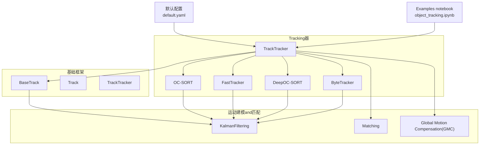
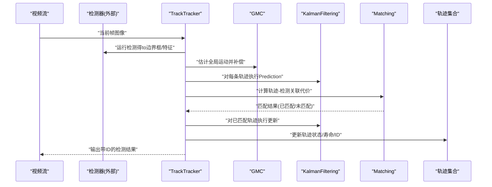
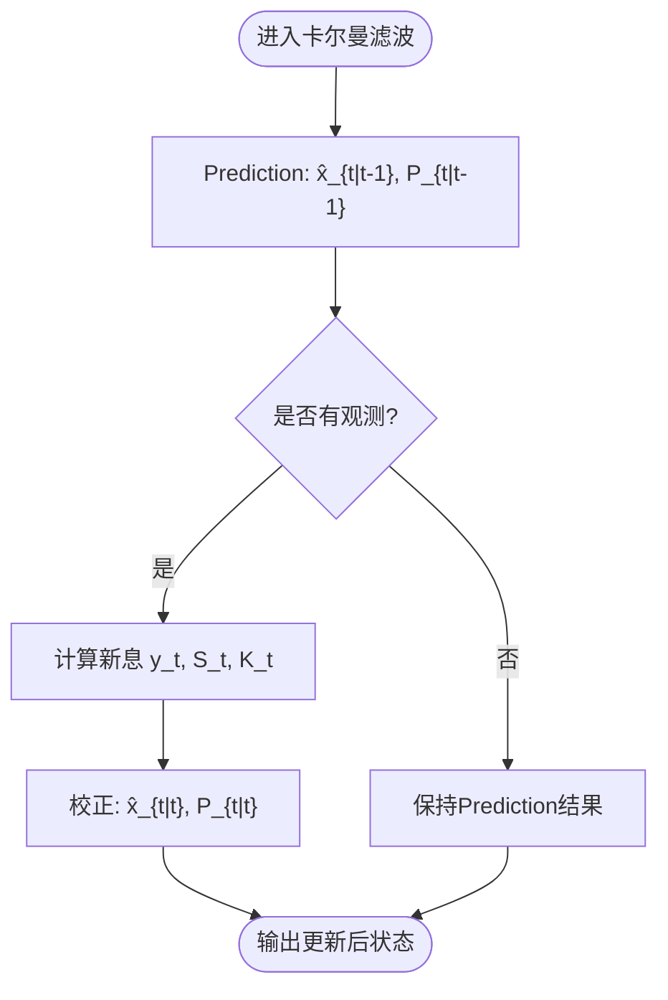
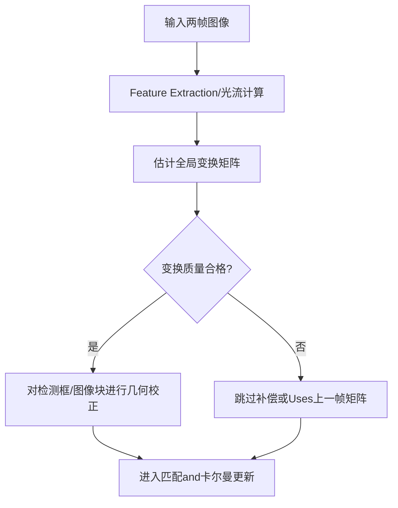
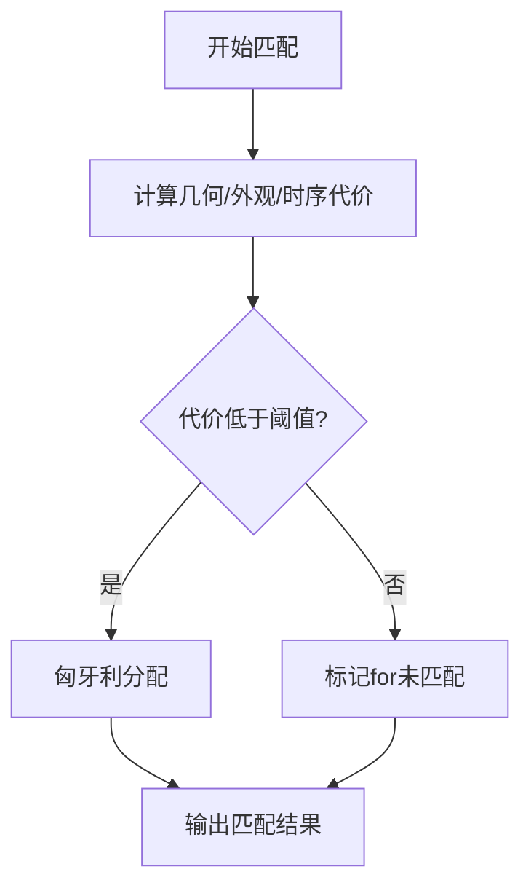
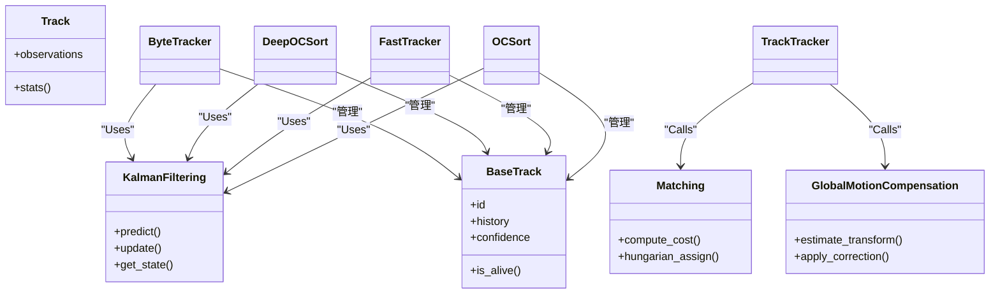
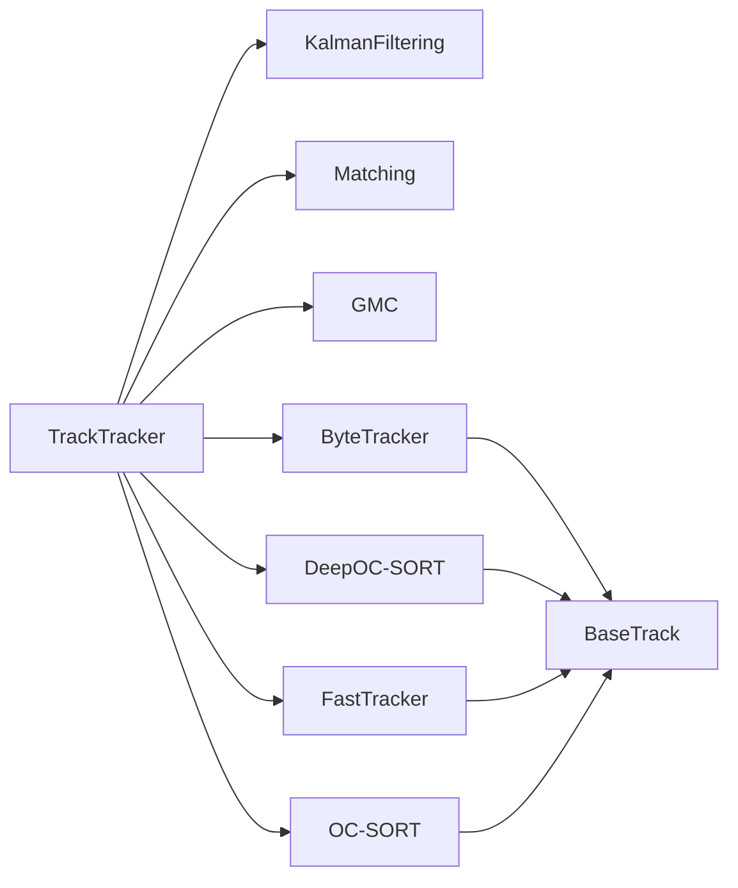

# 运动建模andPrediction

<cite>
**Files Referenced in This Document**
- [ultralytics/trackers/basetrack.py](file://ultralytics/trackers/basetrack.py)
- [ultralytics/trackers/byte_tracker.py](file://ultralytics/trackers/byte_tracker.py)
- [ultralytics/trackers/deep_oc_sort.py](file://ultralytics/trackers/deep_oc_sort.py)
- [ultralytics/trackers/fast_tracker.py](file://ultralytics/trackers/fast_tracker.py)
- [ultralytics/trackers/oc_sort.py](file://ultralytics/trackers/oc_sort.py)
- [ultralytics/trackers/track.py](file://ultralytics/trackers/track.py)
- [ultralytics/trackers/track_tracker.py](file://ultralytics/trackers/track_tracker.py)
- [ultralytics/trackers/utils/__init__.py](file://ultralytics/trackers/utils/__init__.py)
- [ultralytics/trackers/utils/kalman_filtering.py](file://ultralytics/trackers/utils/kalman_filtering.py)
- [ultralytics/trackers/utils/matching.py](file://ultralytics/trackers/utils/matching.py)
- [ultralytics/trackers/utils/gmc.py](file://ultralytics/trackers/utils/gmc.py)
- [ultralytics/cfg/trackers/default.yaml](file://ultralytics/cfg/trackers/default.yaml)
- [examples/object_tracking.ipynb](file://examples/object_tracking.ipynb)
</cite>

## Table of Contents
1. [Introduction](#Introduction)
2. [Project Structure](#Project Structure)
3. [Core Components](#Core Components)
4. [Architecture Overview](#Architecture Overview)
5. [Detailed Component Analysis](#Detailed Component Analysis)
6. [Dependency Analysis](#Dependency Analysis)
7. [性能考量](#性能考量)
8. [Troubleshooting Guide](#Troubleshooting Guide)
9. [Conclusion](#Conclusion)
10. [Appendix](#Appendix)

## Introduction
本技术Documentation聚焦于 YOLO-Master 的运动建模andPrediction系统，围绕卡尔曼滤波while目标Tracking中的理论基础and工程implementingunfold。内容涵盖状态空间模型构建（位置、速度、加速度etc.）、Predictionand更新步骤的数学推导、协方差矩阵的更新and收敛特性、全局运动补偿（GMC）的implementingand应用场景、不同运动模型的适用条件and切换策略、异常检测and处理机制，Centered onand参数调优方法and最佳实践。同时provides实际应用场景的性能分析andOptimization建议，帮助读者将理论落地to工程中。

## Project Structure
YOLO-Master 中and运动建模andPrediction相关的代码主要位于 trackers Modulesand其 utils 子Modules中：
- Tracking器骨架and通用逻辑：basetrack、track、track_tracker
- 具体Tracking算法：byte_tracker、deep_oc_sort、fast_tracker、oc_sort
- 运动建模and匹配工具：kalman_filtering、matching、gmc
- 配置入口：cfg/trackers/default.yaml
- Examples：examples/object_tracking.ipynb

Figure Source
- [ultralytics/trackers/track_tracker.py](file://ultralytics/trackers/track_tracker.py)
- [ultralytics/trackers/basetrack.py](file://ultralytics/trackers/basetrack.py)
- [ultralytics/trackers/byte_tracker.py](file://ultralytics/trackers/byte_tracker.py)
- [ultralytics/trackers/deep_oc_sort.py](file://ultralytics/trackers/deep_oc_sort.py)
- [ultralytics/trackers/fast_tracker.py](file://ultralytics/trackers/fast_tracker.py)
- [ultralytics/trackers/oc_sort.py](file://ultralytics/trackers/oc_sort.py)
- [ultralytics/trackers/utils/kalman_filtering.py](file://ultralytics/trackers/utils/kalman_filtering.py)
- [ultralytics/trackers/utils/matching.py](file://ultralytics/trackers/utils/matching.py)
- [ultralytics/trackers/utils/gmc.py](file://ultralytics/trackers/utils/gmc.py)
- [ultralytics/cfg/trackers/default.yaml](file://ultralytics/cfg/trackers/default.yaml)
- [examples/object_tracking.ipynb](file://examples/object_tracking.ipynb)

Section Source
- [ultralytics/trackers/track_tracker.py](file://ultralytics/trackers/track_tracker.py)
- [ultralytics/trackers/basetrack.py](file://ultralytics/trackers/basetrack.py)
- [ultralytics/trackers/byte_tracker.py](file://ultralytics/trackers/byte_tracker.py)
- [ultralytics/trackers/deep_oc_sort.py](file://ultralytics/trackers/deep_oc_sort.py)
- [ultralytics/trackers/fast_tracker.py](file://ultralytics/trackers/fast_tracker.py)
- [ultralytics/trackers/oc_sort.py](file://ultralytics/trackers/oc_sort.py)
- [ultralytics/trackers/utils/kalman_filtering.py](file://ultralytics/trackers/utils/kalman_filtering.py)
- [ultralytics/trackers/utils/matching.py](file://ultralytics/trackers/utils/matching.py)
- [ultralytics/trackers/utils/gmc.py](file://ultralytics/trackers/utils/gmc.py)
- [ultralytics/cfg/trackers/default.yaml](file://ultralytics/cfg/trackers/default.yaml)
- [examples/object_tracking.ipynb](file://examples/object_tracking.ipynb)

## Core Components
- BaseTrack：定义轨迹对象的基础属性and生命周期管理，包含 ID、历史观测、置信度、是否存活etc.元数据，for上层Tracking器providesUnified Interface。
- Track：Encapsulates单目标的观测序列管理and基本统计量，用于关联、匹配和Visualization。
- KalmanFiltering：implementing标准线性高斯卡尔曼滤波，包括状态转移、观测映射、Predictionand更新、协方差传播and数值稳定化。
- Matching：provides基于距离或代价的轨迹-检测关联策略，Supporting IoU、马氏距离、外观相似度etc.多源度量融合。
- Global Motion Compensation (GMC)：估计并补偿相机整体运动，提升局部目标Tracking鲁棒性，尤其适用于手持或车载平台。
- ByteTracker / DeepOC-SORT / FastTracker / OC-SORT：不同的多目标Tracking Algorithm Implementation，均复用 KalmanFiltering 进行运动建模andPrediction。
- TrackTracker：高层编排器，负责帧间循环、检测输入预处理、GMC 应用、匹配and轨迹更新、输出结果组装。
- default.yaml：Tracking器默认参数（such as卡尔曼噪声、匹配阈值、轨迹寿命etc.），便于快速调参and复现实验。

Section Source
- [ultralytics/trackers/basetrack.py](file://ultralytics/trackers/basetrack.py)
- [ultralytics/trackers/track.py](file://ultralytics/trackers/track.py)
- [ultralytics/trackers/utils/kalman_filtering.py](file://ultralytics/trackers/utils/kalman_filtering.py)
- [ultralytics/trackers/utils/matching.py](file://ultralytics/trackers/utils/matching.py)
- [ultralytics/trackers/utils/gmc.py](file://ultralytics/trackers/utils/gmc.py)
- [ultralytics/trackers/byte_tracker.py](file://ultralytics/trackers/byte_tracker.py)
- [ultralytics/trackers/deep_oc_sort.py](file://ultralytics/trackers/deep_oc_sort.py)
- [ultralytics/trackers/fast_tracker.py](file://ultralytics/trackers/fast_tracker.py)
- [ultralytics/trackers/oc_sort.py](file://ultralytics/trackers/oc_sort.py)
- [ultralytics/trackers/track_tracker.py](file://ultralytics/trackers/track_tracker.py)
- [ultralytics/cfg/trackers/default.yaml](file://ultralytics/cfg/trackers/default.yaml)

## Architecture Overview
下图展示了从视频帧输入to轨迹输出的端to端流程，突出卡尔曼滤波and GMC 的集成点。

Figure Source
- [ultralytics/trackers/track_tracker.py](file://ultralytics/trackers/track_tracker.py)
- [ultralytics/trackers/utils/gmc.py](file://ultralytics/trackers/utils/gmc.py)
- [ultralytics/trackers/utils/kalman_filtering.py](file://ultralytics/trackers/utils/kalman_filtering.py)
- [ultralytics/trackers/utils/matching.py](file://ultralytics/trackers/utils/matching.py)

## Detailed Component Analysis

### 卡尔曼滤波：理论基础andimplementing细节
- 状态空间模型
  - 状态向量 x_t：通常包含位置坐标、速度分量，必要时加入加速度项Centered on应对非匀速运动。
  - 观测向量 z_t：来自检测器的二维边界框中心或角点。
  - 状态转移矩阵 F：描述时间步长 Δt 下的动力学演化（匀速/匀加速）。
  - 观测矩阵 H：将状态映射to观测空间。
  - 过程噪声 Q：刻画模型误差and未建模动态。
  - 观测噪声 R：刻画检测不确定性。
- Prediction步骤
  - 状态Prediction：x̂_{t|t-1} = F x̂_{t-1|t-1}
  - 协方差Prediction：P_{t|t-1} = F P_{t-1|t-1} F^T + Q
- 更新步骤
  - 新息：y_t = z_t - H x̂_{t|t-1}
  - 新息协方差：S_t = H P_{t|t-1} H^T + R
  - 卡尔曼增益：K_t = P_{t|t-1} H^T S_t^{-1}
  - 状态更新：x̂_{t|t} = x̂_{t|t-1} + K_t y_t
  - 协方差更新：P_{t|t} = (I - K_t H) P_{t|t-1}
- 协方差矩阵的更新and收敛特性
  - 当 Q、R 固定且系统可观测时，P_{t|t} 会趋于稳态值，此时可用稳态增益简化while线计算。
  - 数值稳定性：采用对称正定保持、Cholesky分解或平方根形式可避免病态矩阵问题。
- implementing要点
  - 维度一致性：确保 F、H、Q、R and状态/观测维度匹配。
  - 自适应噪声：根据检测质量或场景变化动态调整 Q、R，提高鲁棒性。
  - 批量操作：对多目标并行更新Centered on提升吞吐。

Figure Source
- [ultralytics/trackers/utils/kalman_filtering.py](file://ultralytics/trackers/utils/kalman_filtering.py)

Section Source
- [ultralytics/trackers/utils/kalman_filtering.py](file://ultralytics/trackers/utils/kalman_filtering.py)

### 状态空间模型构建and运动模型选择
- 常用模型
  - 匀速模型（CV）：状态包含位置and速度，适用于大多数平滑运动场景。
  - 匀加速模型（CA）：引入加速度项，适合频繁加减速的目标。
  - 恒定转弯模型（CT）：考虑曲率变化，适用于道路场景的车辆Tracking。
- 适用条件and切换策略
  - 依据残差（新息）大小and协方差增长趋势判断模型失配程度。
  - 多模型交互（IMM）思想：维护多个模型的后验概率并进行加权融合。
  - 简单切换：当连续若干帧新息超过阈值或协方差发散时切换to更复杂模型。
- 工程implementing建议
  - 预置多套 F、Q 组合，按场景或Metrics自动选择。
  - Uses滑动窗口统计新息分布，动态调节 Q/R。

Section Source
- [ultralytics/trackers/utils/kalman_filtering.py](file://ultralytics/trackers/utils/kalman_filtering.py)
- [ultralytics/cfg/trackers/default.yaml](file://ultralytics/cfg/trackers/default.yaml)

### 全局运动补偿（GMC）的implementingand应用
- 原理
  - Via光流或特征匹配估计帧间全局变换（平移、仿射或透视），将当前帧对齐至Refer to帧，消除相机运动影响。
- 典型流程
  - 提取特征/计算光流 → 估计变换矩阵 → 对检测框或图像块进行几何校正 → 送入匹配and卡尔曼更新。
- 应用场景
  - 手持设备、车载摄像头、无人机etc.存while显著相机运动的场景。
  - and局部目标TrackingCombining，降低误匹配and轨迹抖动。
- 注意事项
  - 大视场或弱纹理区域可能导致估计不稳定，需Combining质量Evaluationand回退策略。
  - 计算开销较高，可while关键帧或低帧率下估算，再插值Uses。

Figure Source
- [ultralytics/trackers/utils/gmc.py](file://ultralytics/trackers/utils/gmc.py)

Section Source
- [ultralytics/trackers/utils/gmc.py](file://ultralytics/trackers/utils/gmc.py)

### 匹配and关联策略
- 代价函数
  - 几何代价：IoU、马氏距离（基于卡尔曼新息协方差）。
  - 外观代价：Re-ID 特征余弦距离（Optional）。
  - 时序代价：轨迹年龄、缺失次数惩罚。
- 匹配算法
  - 匈牙利算法求解指派问题，保证一对一匹配。
  - 阈值裁剪：仅允许低于阈值的边参and匹配，其余视for未匹配。
- and卡尔曼滤波的耦合
  - UsesPrediction协方差构造马氏距离，使匹配对不确定性敏感。
  - while多传感器或多尺度检测下，可对代价进行归一化and权重融合。

Figure Source
- [ultralytics/trackers/utils/matching.py](file://ultralytics/trackers/utils/matching.py)

Section Source
- [ultralytics/trackers/utils/matching.py](file://ultralytics/trackers/utils/matching.py)

### Tracking器implementing对比and集成点
- ByteTracker：强调高效性and实时性，常and轻量Appearance FeaturesCombining，适用于Mobile Deployment。
- DeepOC-SORT：引入深度外观嵌入，增强遮挡and密集场景鲁棒性。
- FastTracker：侧重速度and内存占用Optimization，适合高帧率场景。
- OC-SORT：while SORT 基础上改进关联and轨迹管理，平衡精度and效率。
- 共同点
  - 均基于 KalmanFiltering 进行运动建模andPrediction。
  - Via TrackTracker 统一编排 GMC、匹配and轨迹生命周期管理。
  - 参数可Via default.yaml 集中配置。

Figure Source
- [ultralytics/trackers/basetrack.py](file://ultralytics/trackers/basetrack.py)
- [ultralytics/trackers/track.py](file://ultralytics/trackers/track.py)
- [ultralytics/trackers/utils/kalman_filtering.py](file://ultralytics/trackers/utils/kalman_filtering.py)
- [ultralytics/trackers/utils/matching.py](file://ultralytics/trackers/utils/matching.py)
- [ultralytics/trackers/utils/gmc.py](file://ultralytics/trackers/utils/gmc.py)
- [ultralytics/trackers/byte_tracker.py](file://ultralytics/trackers/byte_tracker.py)
- [ultralytics/trackers/deep_oc_sort.py](file://ultralytics/trackers/deep_oc_sort.py)
- [ultralytics/trackers/fast_tracker.py](file://ultralytics/trackers/fast_tracker.py)
- [ultralytics/trackers/oc_sort.py](file://ultralytics/trackers/oc_sort.py)
- [ultralytics/trackers/track_tracker.py](file://ultralytics/trackers/track_tracker.py)

Section Source
- [ultralytics/trackers/byte_tracker.py](file://ultralytics/trackers/byte_tracker.py)
- [ultralytics/trackers/deep_oc_sort.py](file://ultralytics/trackers/deep_oc_sort.py)
- [ultralytics/trackers/fast_tracker.py](file://ultralytics/trackers/fast_tracker.py)
- [ultralytics/trackers/oc_sort.py](file://ultralytics/trackers/oc_sort.py)
- [ultralytics/trackers/track_tracker.py](file://ultralytics/trackers/track_tracker.py)

## Dependency Analysis
- 内部依赖
  - TrackTracker 依赖 KalmanFiltering、Matching、GMC 完成核心流程。
  - 各Tracking器implementing依赖 BaseTrack/Track 进行轨迹对象管理。
- External Dependencies
  - 检测器输出作for观测输入。
  - Optional的Appearance Features库（such as Re-ID）用于 DeepOC-SORT etc.。
- 潜while环路and解耦
  - Via TrackTracker 作for编排层，避免Tracking器and底层工具强耦合。
  - KalmanFiltering and Matching 独立，便于替换and扩展。

Figure Source
- [ultralytics/trackers/track_tracker.py](file://ultralytics/trackers/track_tracker.py)
- [ultralytics/trackers/utils/kalman_filtering.py](file://ultralytics/trackers/utils/kalman_filtering.py)
- [ultralytics/trackers/utils/matching.py](file://ultralytics/trackers/utils/matching.py)
- [ultralytics/trackers/utils/gmc.py](file://ultralytics/trackers/utils/gmc.py)
- [ultralytics/trackers/basetrack.py](file://ultralytics/trackers/basetrack.py)
- [ultralytics/trackers/byte_tracker.py](file://ultralytics/trackers/byte_tracker.py)
- [ultralytics/trackers/deep_oc_sort.py](file://ultralytics/trackers/deep_oc_sort.py)
- [ultralytics/trackers/fast_tracker.py](file://ultralytics/trackers/fast_tracker.py)
- [ultralytics/trackers/oc_sort.py](file://ultralytics/trackers/oc_sort.py)

Section Source
- [ultralytics/trackers/track_tracker.py](file://ultralytics/trackers/track_tracker.py)
- [ultralytics/trackers/utils/kalman_filtering.py](file://ultralytics/trackers/utils/kalman_filtering.py)
- [ultralytics/trackers/utils/matching.py](file://ultralytics/trackers/utils/matching.py)
- [ultralytics/trackers/utils/gmc.py](file://ultralytics/trackers/utils/gmc.py)
- [ultralytics/trackers/basetrack.py](file://ultralytics/trackers/basetrack.py)
- [ultralytics/trackers/byte_tracker.py](file://ultralytics/trackers/byte_tracker.py)
- [ultralytics/trackers/deep_oc_sort.py](file://ultralytics/trackers/deep_oc_sort.py)
- [ultralytics/trackers/fast_tracker.py](file://ultralytics/trackers/fast_tracker.py)
- [ultralytics/trackers/oc_sort.py](file://ultralytics/trackers/oc_sort.py)

## 性能考量
- 计算复杂度
  - 卡尔曼滤波每目标 O(d^3)（d for状态维数），匹配 O(n^2) 或借助阈值剪枝降低。
  - GMC 的光流/特征匹配成本较高，可按需降采样或隔帧计算。
- 内存and缓存
  - 轨迹历史长度andAppearance Features缓存直接影响内存占用。
  - Uses环形缓冲and惰性加载减少峰值内存。
- 并行and向量化
  - 对多目标卡尔曼更新and匹配代价矩阵进行批处理and向量化。
  - 利用 GPU acceleration光流andFeature Extraction（若硬件Supporting）。
- 实时性Optimization
  - 自适应帧率：while高动态场景提高 GMC 频率，while静态场景降低。
  - 早停策略：当新息协方差收敛后can use稳态增益减少矩阵求逆。

[This section provides general guidance and does not directly analyze specific files]

## Troubleshooting Guide
- 常见问题
  - 轨迹抖动：检查观测噪声 R 是否过小；适当增大 R 或引入 GMC。
  - 轨迹分裂：提高匹配阈值或引入外观相似度；延长轨迹寿命。
  - 漂移and发散：监控协方差迹and条件数；限制最大协方差或启用数值稳定化。
  - 漏检恢复：设置合理的“丢失计数”上限andRe-Identification召回策略。
- 诊断方法
  - 记录新息序列and协方差对角线，绘制随时间变化曲线。
  - 统计匹配成功率and未匹配比例，定位bottlenecks环节。
  - 对比开启/关闭 GMC 的效果，Evaluation全局运动影响。
- 修复建议
  - 动态调整 Q/R：基于新息分布估计观测噪声，自适应更新。
  - 模型切换：while新息超阈或协方差发散时切换to CA/CT 模型。
  - 降级策略：GMC 失败is available, fall back to上一帧变换或禁用补偿。

Section Source
- [ultralytics/trackers/utils/kalman_filtering.py](file://ultralytics/trackers/utils/kalman_filtering.py)
- [ultralytics/trackers/utils/matching.py](file://ultralytics/trackers/utils/matching.py)
- [ultralytics/trackers/utils/gmc.py](file://ultralytics/trackers/utils/gmc.py)
- [ultralytics/cfg/trackers/default.yaml](file://ultralytics/cfg/trackers/default.yaml)

## Conclusion
YOLO-Master 的运动建模andPrediction系统Centered on卡尔曼滤波for核心，Combining GMC and灵活的匹配策略，形成可扩展的Multi-Object Tracking架构。Via合理构建状态空间模型、动态调整噪声参数、选择合适的运动模型and切换策略，并while工程上注重数值稳定and性能Optimization，可while多种真实场景中取得稳健的Tracking效果。建议while实际部署中Combining场景先验and离线标定，持续监控新息and协方差Metrics，迭代Optimization参数and模型选择策略。

[This section is summary content and does not directly analyze specific files]

## Appendix
- 参数调优清单
  - 卡尔曼噪声：Q（过程噪声）、R（观测噪声）初始值and自适应范围。
  - 匹配阈值：几何and外观代价阈值、匈牙利分配裁剪阈值。
  - 轨迹管理：最小观测次数、最大丢失计数、轨迹寿命。
  - GMC 参数：特征数量、变换类型（平移/仿射/透视）、质量阈值。
- 最佳实践
  - 先标定相机内参and外参，提升 GMC 准确性。
  - whileTraining集/Validation集上进行网格搜索and贝叶斯Optimization，Combining HOTA/MOTA etc.MetricsEvaluation。
  - 针对遮挡严重场景引入Appearance FeaturesandRe-Identification，但注意计算开销。
- Examplesand复现
  - Refer toExamples notebook 了解端to端Calls方式andVisualization输出。

Section Source
- [ultralytics/cfg/trackers/default.yaml](file://ultralytics/cfg/trackers/default.yaml)
- [examples/object_tracking.ipynb](file://examples/object_tracking.ipynb)