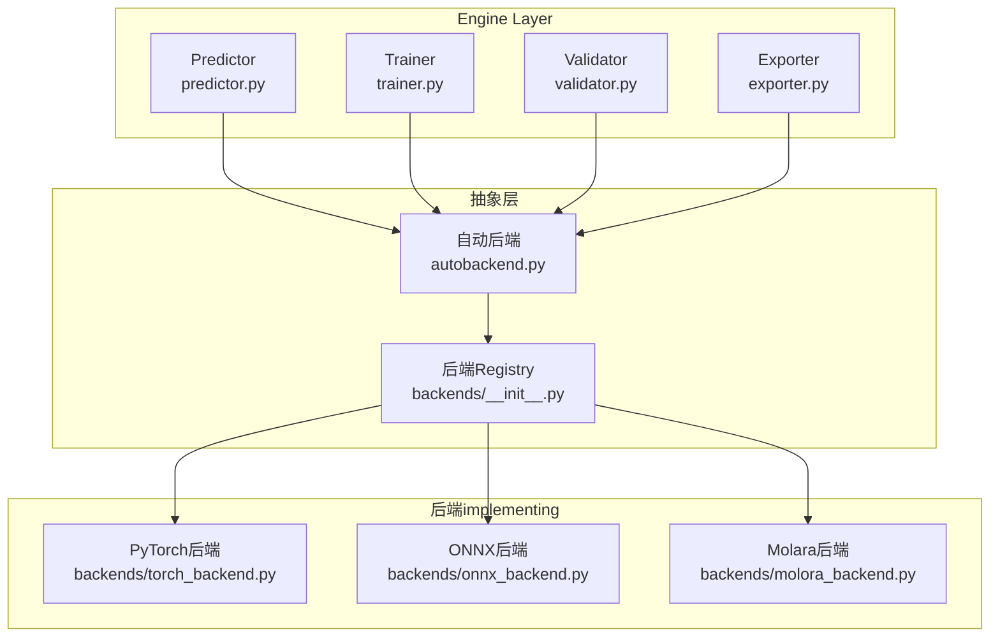
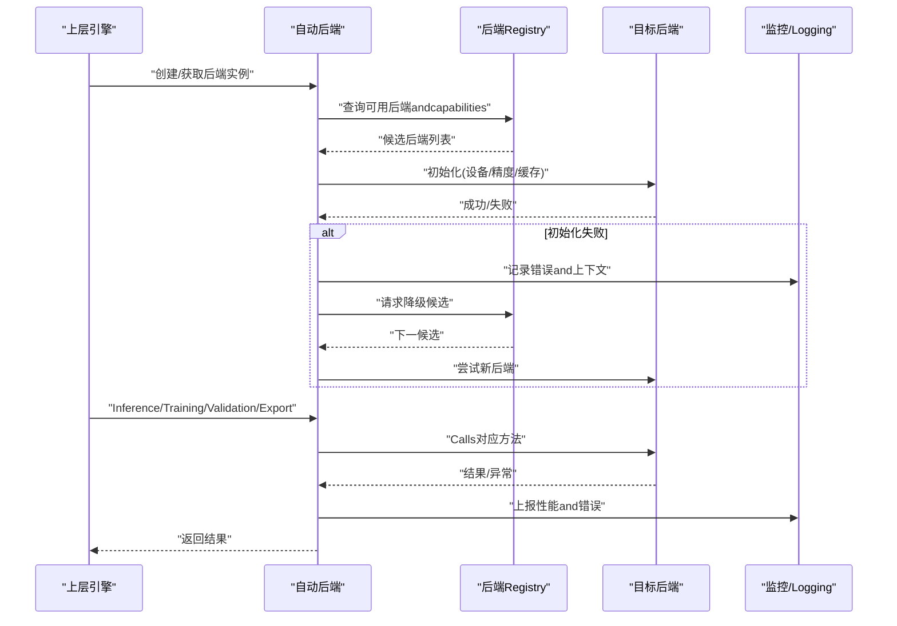
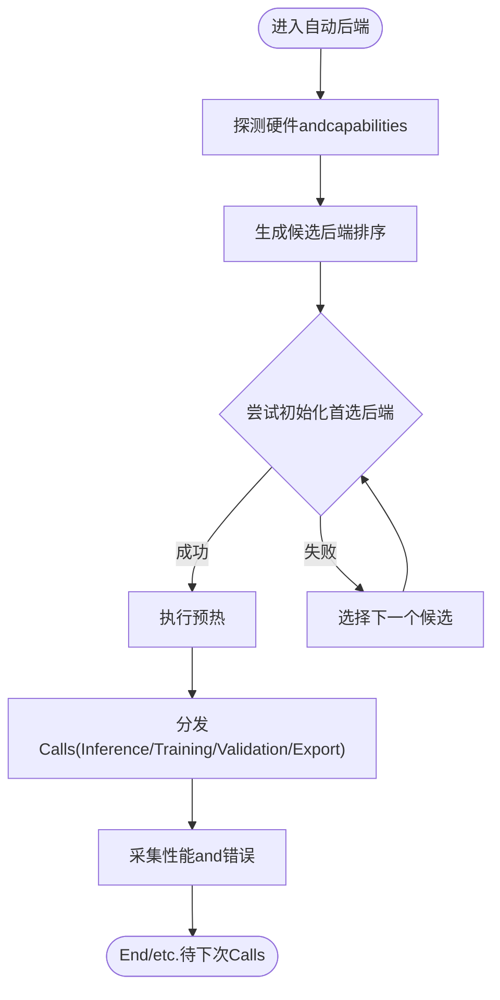
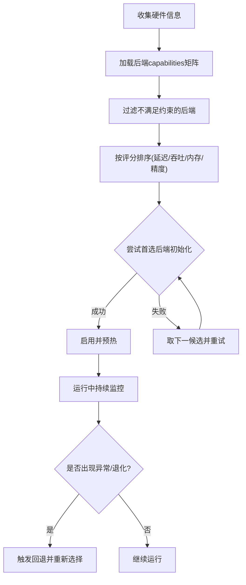
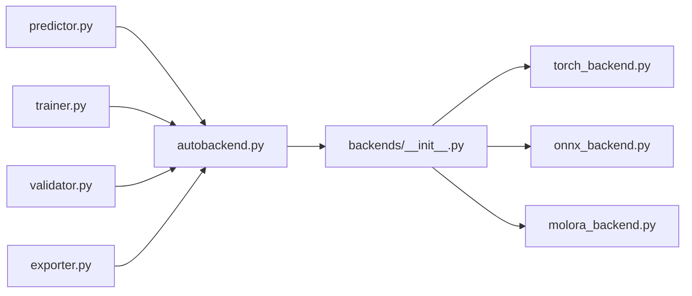

# Adapter后端抽象

<cite>
**Files Referenced in This Document**
- [autobackend.py](file://ultralytics/nn/autobackend.py)
- [__init__.py](file://ultralytics/nn/backends/__init__.py)
- [torch_backend.py](file://ultralytics/nn/backends/torch_backend.py)
- [onnx_backend.py](file://ultralytics/nn/backends/onnx_backend.py)
- [molora_backend.py](file://ultralytics/nn/backends/molora_backend.py)
- [exporter.py](file://ultralytics/engine/exporter.py)
- [predictor.py](file://ultralytics/engine/predictor.py)
- [trainer.py](file://ultralytics/engine/trainer.py)
- [validator.py](file://ultralytics/engine/validator.py)
- [benchmark_molora_dispatch.py](file://benchmarks/benchmark_molora_dispatch.py)
- [test_autobackend_warmup.py](file://tests/test_autobackend_warmup.py)
- [test_model_adapter_facade.py](file://tests/test_model_adapter_facade.py)
- [test_molora_sparse_dispatch.py](file://tests/test_molora_sparse_dispatch.py)
- [test_molora_routing_aware_merge.py](file://tests/test_molora_routing_aware_merge.py)
</cite>

## Table of Contents
1. [Introduction](#Introduction)
2. [Project Structure](#Project Structure)
3. [Core Components](#Core Components)
4. [Architecture Overview](#Architecture Overview)
5. [Detailed Component Analysis](#Detailed Component Analysis)
6. [Dependency Analysis](#Dependency Analysis)
7. [性能考量](#性能考量)
8. [Troubleshooting Guide](#Troubleshooting Guide)
9. [Conclusion](#Conclusion)
10. [Appendix](#Appendix)

## Introduction
本文件targetingYOLO-Master的“Adapter后端抽象层”，系统性阐述其统一API、插件注册and生命周期管理，覆盖PyTorch原生、ONNXExport兼容and移动端Optimizationetc.Adapter的implementing要点；深入解析回退机制（降级策略、性能监控、错误恢复）；专项Documentation化Molara后端的稀疏计算、内存OptimizationandRouting-Aware Merging；说明后端选择算法（硬件检测、capabilitiesEvaluation、动态切换）；provides自定义后端开发指南and模板；并给出基准测试方法and对比分析思路，Centered onandInference引擎集成and部署Optimization建议。

## Project Structure
后端抽象位于nnModules下，采用“自动后端+多后端implementing”的分层设计：
- 自动后端入口负责设备探测、capabilitiesEvaluation、后端实例化and生命周期管理
- 各具体后端Centered on插件形式注册toUnified Interface，Exposing a consistentInference/Training/Export契约
- 上层引擎（Prediction、Training、Validation、Export）ViaUnified InterfaceCalls后端，屏蔽底层差异

Figure Source
- [autobackend.py](file://ultralytics/nn/autobackend.py)
- [__init__.py](file://ultralytics/nn/backends/__init__.py)
- [torch_backend.py](file://ultralytics/nn/backends/torch_backend.py)
- [onnx_backend.py](file://ultralytics/nn/backends/onnx_backend.py)
- [molora_backend.py](file://ultralytics/nn/backends/molora_backend.py)
- [predictor.py](file://ultralytics/engine/predictor.py)
- [trainer.py](file://ultralytics/engine/trainer.py)
- [validator.py](file://ultralytics/engine/validator.py)
- [exporter.py](file://ultralytics/engine/exporter.py)

Section Source
- [autobackend.py](file://ultralytics/nn/autobackend.py)
- [__init__.py](file://ultralytics/nn/backends/__init__.py)
- [torch_backend.py](file://ultralytics/nn/backends/torch_backend.py)
- [onnx_backend.py](file://ultralytics/nn/backends/onnx_backend.py)
- [molora_backend.py](file://ultralytics/nn/backends/molora_backend.py)
- [predictor.py](file://ultralytics/engine/predictor.py)
- [trainer.py](file://ultralytics/engine/trainer.py)
- [validator.py](file://ultralytics/engine/validator.py)
- [exporter.py](file://ultralytics/engine/exporter.py)

## Core Components
- 统一后端接口
  - 定义Inference、Training、Validation、Export所需的最小契约方法族，确保上层引擎无需关心具体后端差异
  - 约定输入输出张量格式、设备语义、精度and数据类型、批处理and流式处理边界条件
- 插件注册机制
  - ViaRegistry集中管理后端implementing，Supporting按名称或capabilities标签动态加载
  - providescapabilities声明and兼容性矩阵，便于自动选择and回退
- 生命周期管理
  - 初始化、预热、运行、清理四个阶段，包含资源分配、缓存预热、异常捕获and状态复位
- 回退机制
  - 基于capabilitiesEvaluationand运行时异常的降级路径，such as从GPUtoCPU、从加速后端to通用后端
  - 性能监控Metrics采集and错误恢复策略（重试、参数回退、模式切换）

Section Source
- [autobackend.py](file://ultralytics/nn/autobackend.py)
- [__init__.py](file://ultralytics/nn/backends/__init__.py)
- [test_autobackend_warmup.py](file://tests/test_autobackend_warmup.py)

## Architecture Overview
后端抽象层对上provides一致API，对下聚合多种执行环境。自动后端根据硬件and模型capabilities选择最优后端，并while失败时触发回退流程。

Figure Source
- [autobackend.py](file://ultralytics/nn/autobackend.py)
- [__init__.py](file://ultralytics/nn/backends/__init__.py)
- [predictor.py](file://ultralytics/engine/predictor.py)
- [trainer.py](file://ultralytics/engine/trainer.py)
- [validator.py](file://ultralytics/engine/validator.py)
- [exporter.py](file://ultralytics/engine/exporter.py)

## Detailed Component Analysis

### 自动后端and统一API
- 职责
  - 设备探测andcapabilitiesEvaluation：识别GPU/CPU、加速器可用性、内存容量、精度Supporting
  - 后端选择：依据capabilities评分and约束（such as显存阈值、延迟预算）挑选最佳后端
  - 生命周期编排：初始化→预热→运行→清理，贯穿异常and回退
  - 监控and诊断：采集耗时、吞吐、内存峰值、错误码and堆栈摘要
- 关键流程
  - 启动阶段：扫描Registry，构建候选集；按优先级排序
  - 运行阶段：分发Calls至选定后端；捕获异常并触发回退
  - 关闭阶段：释放资源、清空缓存、重置统计

Figure Source
- [autobackend.py](file://ultralytics/nn/autobackend.py)
- [__init__.py](file://ultralytics/nn/backends/__init__.py)

Section Source
- [autobackend.py](file://ultralytics/nn/autobackend.py)
- [test_autobackend_warmup.py](file://tests/test_autobackend_warmup.py)

### PyTorch原生后端
- 特点
  - 直接利用PyTorch执行图and算子生态，Supporting动态形状、Mixture精度、分布式
  - 作for默认and兜底后端，保证功能完整性
- 关注点
  - 内存管理andGradient追踪
  - andTraining/Validation/Export流程的无缝衔接
  - 性能调优：算子融合、编译选项、Data Pipeline

Section Source
- [torch_backend.py](file://ultralytics/nn/backends/torch_backend.py)
- [trainer.py](file://ultralytics/engine/trainer.py)
- [validator.py](file://ultralytics/engine/validator.py)
- [exporter.py](file://ultralytics/engine/exporter.py)

### ONNXExport兼容后端
- 特点
  - 针对ONNXRuntime或兼容Inference引擎进行Optimization，静态图、低开销序列化
  - SupportingINT8/FP16量化and算子子图Optimization
- 关注点
  - Export前检查andcapabilities矩阵校验
  - 运行时IO绑定、内存池and线程并行
  - and自动后端的互操作：Export成功后PreferONNX后端

Section Source
- [onnx_backend.py](file://ultralytics/nn/backends/onnx_backend.py)
- [exporter.py](file://ultralytics/engine/exporter.py)

### Molara后端（稀疏计算、内存Optimization、Routing-Aware Merging）
- 特性
  - Sparse Scheduling：仅激活必要专家/分支，降低计算and访存
  - 内存Optimization：分块、复用缓冲区、按需加载专家权重
  - Routing-Aware Merging：while合并/Export阶段考虑路由分布，避免冗余计算
- Applicable Scenarios
  - 大规模MoE/MoA模型、边缘端受限设备、高并发Inference
- 注意事项
  - 路由校准and稳定性
  - 稀疏度阈值and精度权衡
  - andTraining阶段的稀疏一致性

Section Source
- [molora_backend.py](file://ultralytics/nn/backends/molora_backend.py)
- [test_molora_sparse_dispatch.py](file://tests/test_molora_sparse_dispatch.py)
- [test_molora_routing_aware_merge.py](file://tests/test_molora_routing_aware_merge.py)

### 后端选择算法（硬件检测、capabilitiesEvaluation、动态切换）
- 硬件检测
  - GPU/CPU/加速器枚举、drivers are installed版本、显存/内存容量、算力特征
- capabilitiesEvaluation
  - 后端capabilities标签（精度、稀疏、量化、ExportSupporting）、延迟/吞吐预估、内存占用上限
- 动态切换
  - 运行时异常触发回退；周期性健康检查；热插拔新后端
- 决策流程
  - 过滤不可用后端 → 评分排序 → 尝试初始化 → 失败回退 → 稳定运行

Figure Source
- [autobackend.py](file://ultralytics/nn/autobackend.py)
- [__init__.py](file://ultralytics/nn/backends/__init__.py)

Section Source
- [autobackend.py](file://ultralytics/nn/autobackend.py)
- [__init__.py](file://ultralytics/nn/backends/__init__.py)

### 回退机制（降级策略、性能监控、错误恢复）
- 降级策略
  - 精度降级（FP16→FP32）、稀疏关闭、批量大小下调、禁用某些Optimization
- 性能监控
  - 端to端延迟、吞吐、内存峰值、算子热点、错误率
- 错误恢复
  - 自动重试、参数回退、会话重建、Loggingand诊断快照

Section Source
- [autobackend.py](file://ultralytics/nn/autobackend.py)
- [test_autobackend_warmup.py](file://tests/test_autobackend_warmup.py)

### andInference引擎的集成and部署Optimization
- 集成方式
  - Via统一API对接ONNXRuntime、TensorRT、OpenVINOetc.引擎
  - Export阶段生成可移植模型，运行时由后端自动选择最优引擎
- 部署Optimization
  - Model Quantizationand剪枝、算子融合、批内并行、I/O流水线
  - 容器化and镜像裁剪、依赖最小化、安全加固

Section Source
- [exporter.py](file://ultralytics/engine/exporter.py)
- [onnx_backend.py](file://ultralytics/nn/backends/onnx_backend.py)

## Dependency Analysis
- 耦合and内聚
  - 自动后端andRegistry松耦合，新增后端只需implementing接口并注册
  - 上层引擎仅依赖统一API，不感知后端细节
- External Dependencies
  - PyTorch生态、ONNXandInference引擎、系统硬件drivers are installed
- Potential Cycles依赖
  - Via接口解耦避免循环；Registryfor单向依赖

Figure Source
- [predictor.py](file://ultralytics/engine/predictor.py)
- [trainer.py](file://ultralytics/engine/trainer.py)
- [validator.py](file://ultralytics/engine/validator.py)
- [exporter.py](file://ultralytics/engine/exporter.py)
- [autobackend.py](file://ultralytics/nn/autobackend.py)
- [__init__.py](file://ultralytics/nn/backends/__init__.py)
- [torch_backend.py](file://ultralytics/nn/backends/torch_backend.py)
- [onnx_backend.py](file://ultralytics/nn/backends/onnx_backend.py)
- [molora_backend.py](file://ultralytics/nn/backends/molora_backend.py)

Section Source
- [predictor.py](file://ultralytics/engine/predictor.py)
- [trainer.py](file://ultralytics/engine/trainer.py)
- [validator.py](file://ultralytics/engine/validator.py)
- [exporter.py](file://ultralytics/engine/exporter.py)
- [autobackend.py](file://ultralytics/nn/autobackend.py)
- [__init__.py](file://ultralytics/nn/backends/__init__.py)
- [torch_backend.py](file://ultralytics/nn/backends/torch_backend.py)
- [onnx_backend.py](file://ultralytics/nn/backends/onnx_backend.py)
- [molora_backend.py](file://ultralytics/nn/backends/molora_backend.py)

## 性能考量
- Benchmark Suite
  - Uses专用基准脚本对不同后端进行延迟/吞吐/内存/能耗测量
  - 覆盖不同输入尺寸、批次、稀疏度and量化配置
- 对比维度
  - 精度损失、稳定性、可Extensibility、部署成本
- Optimization建议
  - Set appropriately稀疏阈值androuting strategies
  - Combining硬件特性选择后端and精度
  - 预热and缓存命中Optimization

Section Source
- [benchmark_molora_dispatch.py](file://benchmarks/benchmark_molora_dispatch.py)

## Troubleshooting Guide
- 常见问题
  - 后端初始化失败：检查drivers are installed、依赖库、显存不足
  - Export Failure：核对Exportcapabilities矩阵and算子Supporting
  - 性能退化：定位热点算子、调整批大小and精度
- 诊断工具
  - 自动后端预热测试、模型Adapter门面测试、MolaraSparsity and Routing合并测试
- 步骤建议
  - 启用详细Loggingand监控Metrics
  - 逐步缩小问题范围（单算子/小模型/低分辨率）
  - 回退toPyTorch后端Validation是否for特定后端问题

Section Source
- [test_autobackend_warmup.py](file://tests/test_autobackend_warmup.py)
- [test_model_adapter_facade.py](file://tests/test_model_adapter_facade.py)
- [test_molora_sparse_dispatch.py](file://tests/test_molora_sparse_dispatch.py)
- [test_molora_routing_aware_merge.py](file://tests/test_molora_routing_aware_merge.py)

## Conclusion
该抽象层Via统一APIand插件注册机制，将多后端implementing解耦于上层引擎，Combined with自动选择and回退策略，显著提升跨平台and跨设备的鲁棒性and可维护性。Molara后端while稀疏计算and内存Optimization方面provides了显著收益，适合复杂模型and受限环境。完善的监控and诊断capabilities有助于快速定位问题and持续Optimization性能。

## Appendix

### 自定义后端开发指南and模板
- implementing要求
  - 遵循Unified Interface契约（Inference/Training/Validation/Export）
  - 声明capabilities标签and兼容性信息
  - implementing生命周期钩子（初始化、预热、清理）
- 注册流程
  - whileRegistry中登记后端名称andcapabilities
  - providesOptional的工厂函数用于实例化
- 测试建议
  - 编写端to端用例，覆盖正常路径and异常回退
  - 加入Benchmark Suite，Evaluation性能and稳定性

Section Source
- [__init__.py](file://ultralytics/nn/backends/__init__.py)
- [autobackend.py](file://ultralytics/nn/autobackend.py)