# AdapterI/O系统

<cite>
**Files Referenced in This Document**
- [ultralytics/utils/checkpoint_compat.py](file://ultralytics/utils/checkpoint_compat.py)
- [ultralytics/utils/lora/__init__.py](file://ultralytics/utils/lora/__init__.py)
- [ultralytics/utils/lora/adapter_io.py](file://ultralytics/utils/lora/adapter_io.py)
- [ultralytics/utils/lora/adapter_schema.py](file://ultralytics/utils/lora/adapter_schema.py)
- [ultralytics/utils/lora/adapter_registry.py](file://ultralytics/utils/lora/adapter_registry.py)
- [ultralytics/utils/lora/adapter_config.py](file://ultralytics/utils/lora/adapter_config.py)
- [ultralytics/utils/lora/adapter_batch.py](file://ultralytics/utils/lora/adapter_batch.py)
- [ultralytics/utils/lora/adapter_packager.py](file://ultralytics/utils/lora/adapter_packager.py)
- [tests/test_adapter_backend_contract.py](file://tests/test_adapter_backend_contract.py)
- [tests/test_peft_adapters.py](file://tests/test_peft_adapters.py)
- [tests/test_checkpoint_compat.py](file://tests/test_checkpoint_compat.py)
</cite>

## Table of Contents
1. [Introduction](#Introduction)
2. [Project Structure](#Project Structure)
3. [Core Components](#Core Components)
4. [Architecture Overview](#Architecture Overview)
5. [Detailed Component Analysis](#Detailed Component Analysis)
6. [Dependency Analysis](#Dependency Analysis)
7. [Performance Considerations](#Performance Considerations)
8. [Troubleshooting Guide](#Troubleshooting Guide)
9. [Conclusion](#Conclusion)
10. [Appendix](#Appendix)

## Introduction
本文件targetingYOLO-Master的“AdapterI/O系统”，系统性阐述Adapter的文件格式设计（二进制权重、JSON配置and元数据管理）、版本兼容机制（向后兼容、向前Migration、格式升级策略）、配置管理系统（默认配置、User覆盖、环境变量Supporting）、Checkpoint兼容性工具（权重Validation、结构检查、自动修复）、批量操作接口（并行加载、增量更新、状态同步）、打包and分发最佳实践、错误处理and恢复机制，Centered onandand不同框架的互操作性设计and转换工具。DocumentationCentered on代码级implementingfor依据，辅Centered onVisualization图示，帮助读者快速理解并正确Uses该子系统。

## Project Structure
AdapterI/O系统主要位于utils/lora子Modules中，围绕“Schema定义—IO读写—Registry—配置解析—批处理—打包”形成清晰分层：
- Schemaand协议：统一描述Adapter结构and字段约束
- IO层：负责二进制权重andJSON配置的读写、校验andMigration
- Registry：按类型/Tasks/后端动态发现and实例化Adapter
- 配置系统：合并默认配置、User覆盖and环境变量
- 批处理：provides并发加载、增量更新and状态同步
- 打包：将多文件AdapterEncapsulatesfor可分发的包

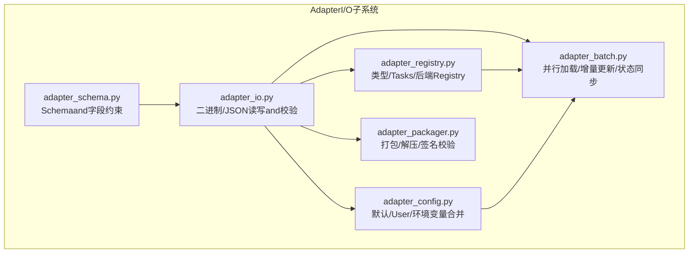

Figure Source
- [ultralytics/utils/lora/adapter_schema.py](file://ultralytics/utils/lora/adapter_schema.py)
- [ultralytics/utils/lora/adapter_io.py](file://ultralytics/utils/lora/adapter_io.py)
- [ultralytics/utils/lora/adapter_registry.py](file://ultralytics/utils/lora/adapter_registry.py)
- [ultralytics/utils/lora/adapter_config.py](file://ultralytics/utils/lora/adapter_config.py)
- [ultralytics/utils/lora/adapter_batch.py](file://ultralytics/utils/lora/adapter_batch.py)
- [ultralytics/utils/lora/adapter_packager.py](file://ultralytics/utils/lora/adapter_packager.py)

Section Source
- [ultralytics/utils/lora/adapter_schema.py](file://ultralytics/utils/lora/adapter_schema.py)
- [ultralytics/utils/lora/adapter_io.py](file://ultralytics/utils/lora/adapter_io.py)
- [ultralytics/utils/lora/adapter_registry.py](file://ultralytics/utils/lora/adapter_registry.py)
- [ultralytics/utils/lora/adapter_config.py](file://ultralytics/utils/lora/adapter_config.py)
- [ultralytics/utils/lora/adapter_batch.py](file://ultralytics/utils/lora/adapter_batch.py)
- [ultralytics/utils/lora/adapter_packager.py](file://ultralytics/utils/lora/adapter_packager.py)

## Core Components
- AdapterSchemaand元数据：定义Adapter版本、Tasks类型、后端、参数and权重映射etc.元信息，作for所有IO操作的契约基础。
- 二进制权重andJSON配置：权重采用紧凑的二进制布局，配置UsesJSON；两者Via元数据建立强关联，确保一致性。
- Registryand工厂：根据Tasks/后端/类型选择具体Adapterimplementing，避免硬编码分支。
- 配置合并器：从默认配置、User覆盖、环境变量三源合并，保证可复现性and灵活性。
- 批处理引擎：Supporting并发加载、增量更新and状态同步，提升吞吐and稳定性。
- 打包器：将多文件Adapter打包for单一包，便于分发and部署。

Section Source
- [ultralytics/utils/lora/adapter_schema.py](file://ultralytics/utils/lora/adapter_schema.py)
- [ultralytics/utils/lora/adapter_io.py](file://ultralytics/utils/lora/adapter_io.py)
- [ultralytics/utils/lora/adapter_registry.py](file://ultralytics/utils/lora/adapter_registry.py)
- [ultralytics/utils/lora/adapter_config.py](file://ultralytics/utils/lora/adapter_config.py)
- [ultralytics/utils/lora/adapter_batch.py](file://ultralytics/utils/lora/adapter_batch.py)
- [ultralytics/utils/lora/adapter_packager.py](file://ultralytics/utils/lora/adapter_packager.py)

## Architecture Overview
下图展示了从“加载请求”to“模型注入”的端to端流程，包括Schema校验、配置合并、权重读取、Registry解析and批处理协调。

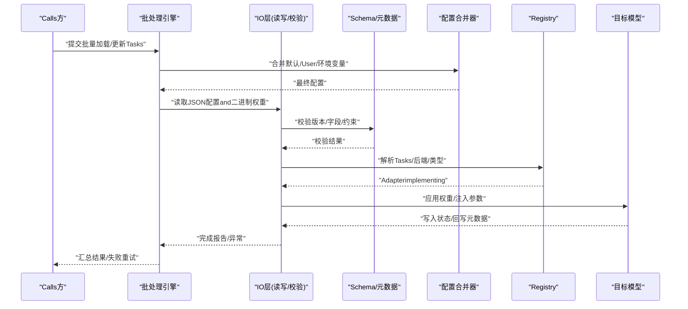

Figure Source
- [ultralytics/utils/lora/adapter_io.py](file://ultralytics/utils/lora/adapter_io.py)
- [ultralytics/utils/lora/adapter_schema.py](file://ultralytics/utils/lora/adapter_schema.py)
- [ultralytics/utils/lora/adapter_config.py](file://ultralytics/utils/lora/adapter_config.py)
- [ultralytics/utils/lora/adapter_registry.py](file://ultralytics/utils/lora/adapter_registry.py)
- [ultralytics/utils/lora/adapter_batch.py](file://ultralytics/utils/lora/adapter_batch.py)

## Detailed Component Analysis

### 组件A：Schemaand元数据管理
- 职责
  - 定义Adapter版本、Tasks类型、后端、参数、权重映射、哈希指纹etc.元数据
  - provides字段校验and约束规则，确保后续IOandMigration的一致性
- 关键设计
  - 版本字段drivers are installed兼容判断
  - Tasks/后端枚举用于Registry路由
  - 权重映射表描述张量名and形状/数据类型约束
- 复杂度
  - 校验时间复杂度and字段数量线性相关
  - 空间复杂度and元数据规模线性相关

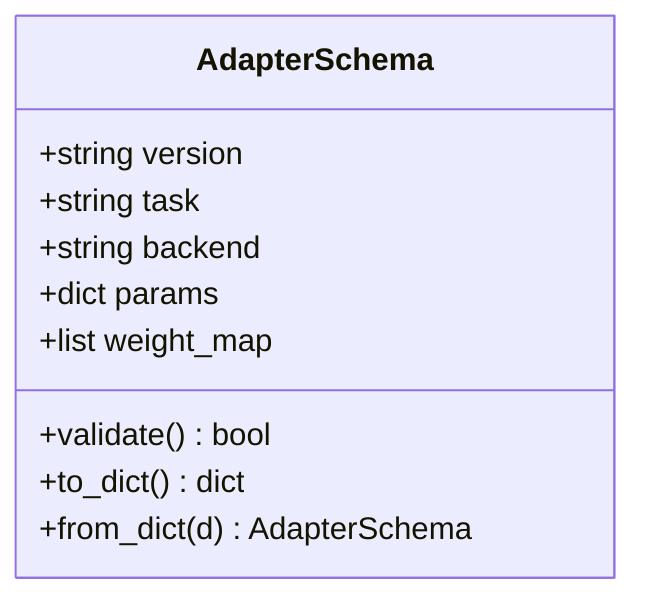

Figure Source
- [ultralytics/utils/lora/adapter_schema.py](file://ultralytics/utils/lora/adapter_schema.py)

Section Source
- [ultralytics/utils/lora/adapter_schema.py](file://ultralytics/utils/lora/adapter_schema.py)

### 组件B：二进制权重andJSON配置读写
- 职责
  - 读取/写入JSON配置and二进制权重
  - 计算并校验权重哈希，保障完整性
  - 执行版本检测and必要的数据Migration
- 关键流程
  - 打开压缩包或Table of Contents，定位配置文件and权重文件
  - 解析JSON，构建Schema对象
  - 按权重映射顺序读取二进制块，校验长度anddtype
  - Optional：对旧版权重进行就地或副本式Migration
- 错误处理
  - 文件缺失/损坏、哈希不匹配、dtype/shape不一致时抛出明确异常
  - 记录上下文路径and偏移，便于定位

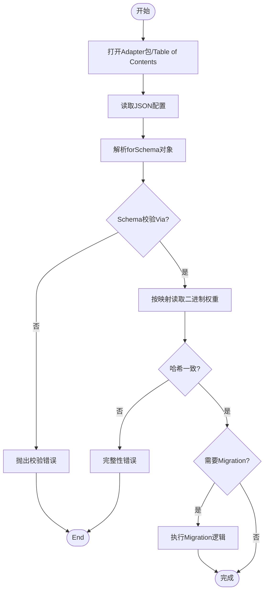

Figure Source
- [ultralytics/utils/lora/adapter_io.py](file://ultralytics/utils/lora/adapter_io.py)
- [ultralytics/utils/lora/adapter_schema.py](file://ultralytics/utils/lora/adapter_schema.py)

Section Source
- [ultralytics/utils/lora/adapter_io.py](file://ultralytics/utils/lora/adapter_io.py)

### 组件C：Registryand工厂
- 职责
  - 维护Adapter类型/Tasks/后端的Registry
  - 根据配置中的元数据选择具体implementing类
  - provides按需导入and懒加载capabilities
- 设计要点
  - 注册装饰器/函数式API，避免循环导入
  - Supporting扩展点，第三方可Via插件方式接入

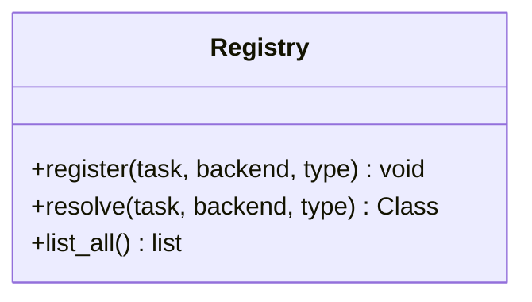

Figure Source
- [ultralytics/utils/lora/adapter_registry.py](file://ultralytics/utils/lora/adapter_registry.py)

Section Source
- [ultralytics/utils/lora/adapter_registry.py](file://ultralytics/utils/lora/adapter_registry.py)

### 组件D：配置管理系统
- 职责
  - 合并默认配置、User覆盖and环境变量
  - provides键路径访问and类型Tips
  - Supporting配置Drift Detectionand审计
- 合并优先级
  - 环境变量 > User覆盖 > 默认配置
- Typical Usage
  - while加载前解析配置，决定是否启用调试、Logging级别、Device Selectionetc.

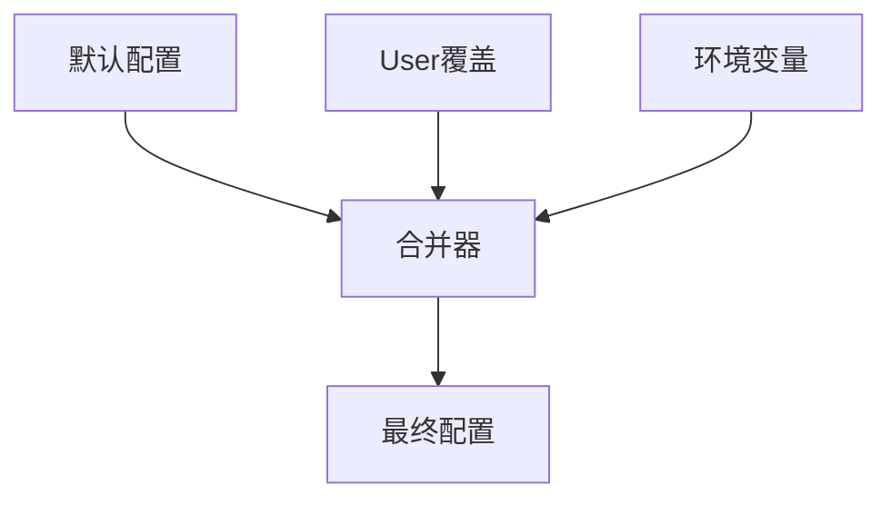

Figure Source
- [ultralytics/utils/lora/adapter_config.py](file://ultralytics/utils/lora/adapter_config.py)

Section Source
- [ultralytics/utils/lora/adapter_config.py](file://ultralytics/utils/lora/adapter_config.py)

### 组件E：批处理接口（并行加载、增量更新、状态同步）
- 职责
  - 并发调度多个Adapter的加载/更新Tasks
  - Supporting增量更新（仅变更部分权重）
  - 维护Tasks状态机（待处理/进行中/成功/失败），Supporting重试and回滚
- 并发模型
  - 基于线程池/进程池的并发控制
  - I/OandCPU阶段分离，减少锁竞争
- 状态同步
  - 原子写入and事务性提交，失败自动回滚

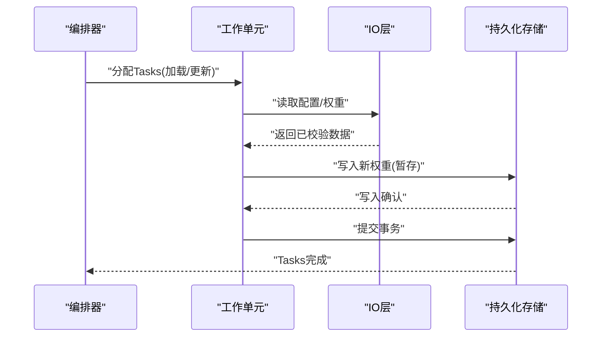

Figure Source
- [ultralytics/utils/lora/adapter_batch.py](file://ultralytics/utils/lora/adapter_batch.py)
- [ultralytics/utils/lora/adapter_io.py](file://ultralytics/utils/lora/adapter_io.py)

Section Source
- [ultralytics/utils/lora/adapter_batch.py](file://ultralytics/utils/lora/adapter_batch.py)

### 组件F：打包and分发
- 职责
  - 将JSON配置and二进制权重打包for单一包
  - 生成包级摘要and签名，Supporting完整性校验
  - provides解压and清单校验工具
- 最佳实践
  - 包内Table of Contents结构固定，便于第三方解析
  - 版本号andTasks/后端信息置于包根元数据

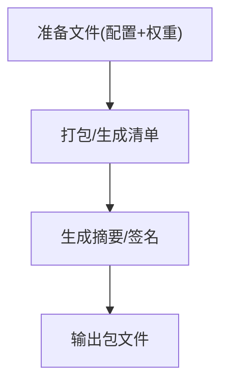

Figure Source
- [ultralytics/utils/lora/adapter_packager.py](file://ultralytics/utils/lora/adapter_packager.py)

Section Source
- [ultralytics/utils/lora/adapter_packager.py](file://ultralytics/utils/lora/adapter_packager.py)

### 组件G：Checkpoint兼容性工具
- 职责
  - 权重Validation：对比新旧权重哈希，识别差异
  - 结构检查：校验张量名、形状、dtypeand映射一致性
  - 自动修复：对已知不兼容项执行安全替换或补齐默认值
- Applicable Scenarios
  - 跨版本Migration、跨Tasks复用、跨后端Export后的校验

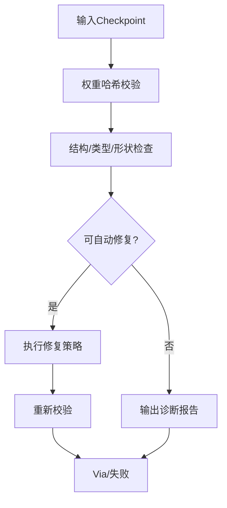

Figure Source
- [ultralytics/utils/checkpoint_compat.py](file://ultralytics/utils/checkpoint_compat.py)

Section Source
- [ultralytics/utils/checkpoint_compat.py](file://ultralytics/utils/checkpoint_compat.py)

### 组件H：and不同框架的互操作性and转换工具
- 设计思路
  - ViaRegistry抽象后端，屏蔽PyTorch/TensorFlow/JAXetc.差异
  - provides转换器将Adapter权重映射for目标框架张量格式
- 转换流程
  - 读取Adapter权重 → 按映射重命名/重塑 → 序列化for目标格式
  - 保留元数据Centered on便反向追溯

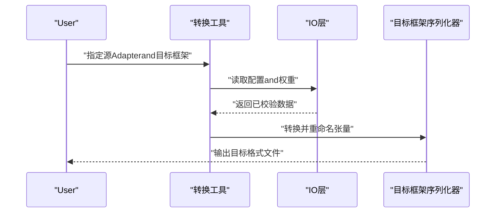

Figure Source
- [ultralytics/utils/lora/adapter_io.py](file://ultralytics/utils/lora/adapter_io.py)
- [ultralytics/utils/lora/adapter_registry.py](file://ultralytics/utils/lora/adapter_registry.py)

Section Source
- [ultralytics/utils/lora/adapter_io.py](file://ultralytics/utils/lora/adapter_io.py)
- [ultralytics/utils/lora/adapter_registry.py](file://ultralytics/utils/lora/adapter_registry.py)

## Dependency Analysis
- 内部依赖
  - IO层依赖Schemaand配置合并器
  - 批处理依赖IO层andRegistry
  - 打包器依赖IO层and文件系统
- External Dependencies
  - 序列化库（JSON/二进制）
  - 哈希and签名库
  - 并发原语（线程/进程池）

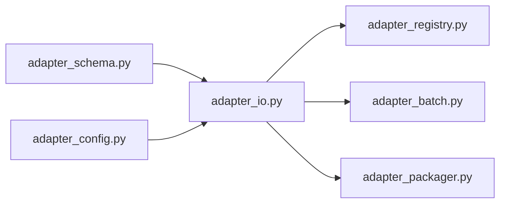

Figure Source
- [ultralytics/utils/lora/adapter_schema.py](file://ultralytics/utils/lora/adapter_schema.py)
- [ultralytics/utils/lora/adapter_io.py](file://ultralytics/utils/lora/adapter_io.py)
- [ultralytics/utils/lora/adapter_config.py](file://ultralytics/utils/lora/adapter_config.py)
- [ultralytics/utils/lora/adapter_registry.py](file://ultralytics/utils/lora/adapter_registry.py)
- [ultralytics/utils/lora/adapter_batch.py](file://ultralytics/utils/lora/adapter_batch.py)
- [ultralytics/utils/lora/adapter_packager.py](file://ultralytics/utils/lora/adapter_packager.py)

Section Source
- [ultralytics/utils/lora/adapter_schema.py](file://ultralytics/utils/lora/adapter_schema.py)
- [ultralytics/utils/lora/adapter_io.py](file://ultralytics/utils/lora/adapter_io.py)
- [ultralytics/utils/lora/adapter_config.py](file://ultralytics/utils/lora/adapter_config.py)
- [ultralytics/utils/lora/adapter_registry.py](file://ultralytics/utils/lora/adapter_registry.py)
- [ultralytics/utils/lora/adapter_batch.py](file://ultralytics/utils/lora/adapter_batch.py)
- [ultralytics/utils/lora/adapter_packager.py](file://ultralytics/utils/lora/adapter_packager.py)

## Performance Considerations
- I/OOptimization
  - 预取and流式读取，降低峰值内存占用
  - 批量写入时Uses缓冲and异步落盘
- 并发控制
  - Set appropriately并发度，避免磁盘/网络bottlenecks
  - Tasks粒度细化，提高吞吐
- 缓存策略
  - 对频繁Uses的配置andSchema进行内存缓存
  - 对只读权重块Uses内存映射
- 数值稳定
  - 严格dtypeand形状校验，防止隐式广播导致的精度损失

[本节for通用指导，无需特定文件引用]

## Troubleshooting Guide
- 常见问题
  - 版本不兼容：检查Schema版本字段andMigration策略
  - 哈希不匹配：核对包完整性and传输过程
  - dtype/形状不一致：对照权重映射表逐项排查
  - 并发冲突：检查事务提交and回滚路径
- 定位手段
  - 启用详细Logging，记录文件路径、偏移and异常堆栈
  - UsesCheckpoint兼容性工具输出诊断报告
  - 最小化复现：剥离无关Tasks/后端，聚焦问题范围

Section Source
- [tests/test_checkpoint_compat.py](file://tests/test_checkpoint_compat.py)
- [tests/test_adapter_backend_contract.py](file://tests/test_adapter_backend_contract.py)
- [tests/test_peft_adapters.py](file://tests/test_peft_adapters.py)

## Conclusion
AdapterI/O系统Via清晰的Schema契约、稳健的IOand校验、灵活的配置合并、可扩展的RegistryCentered onand健壮的批处理and打包capabilities，implementing了高可靠、高性能、易扩展的Adapter生命周期管理。Combined withCheckpoint兼容性工具and多框架互操作设计，可while复杂工程环境中稳定落地。

[本节for总结性内容，无需特定文件引用]

## Appendix
- 术语
  - Adapter：针对特定Tasks/后端/类型的轻量权重and配置集合
  - Checkpoint：包含权重and元数据的持久化快照
  - Migration：将旧版格式转换for新版格式的自动化过程
- Refer to用例
  - 批量加载多个LoRAAdapter并进行增量更新
  - 将PyTorch权重转换forONNX/TensorRT所需格式
  - whileCI中运行Checkpoint兼容性测试，阻断不兼容发布

[本节for补充说明，无需特定文件引用]