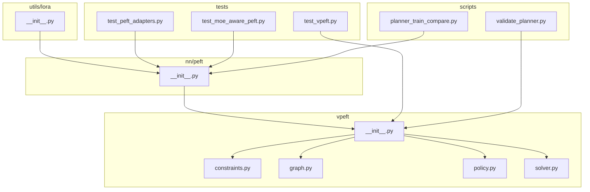
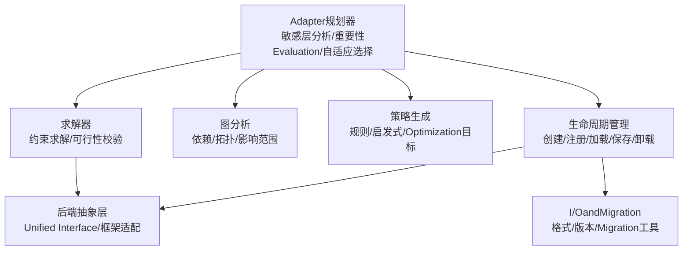
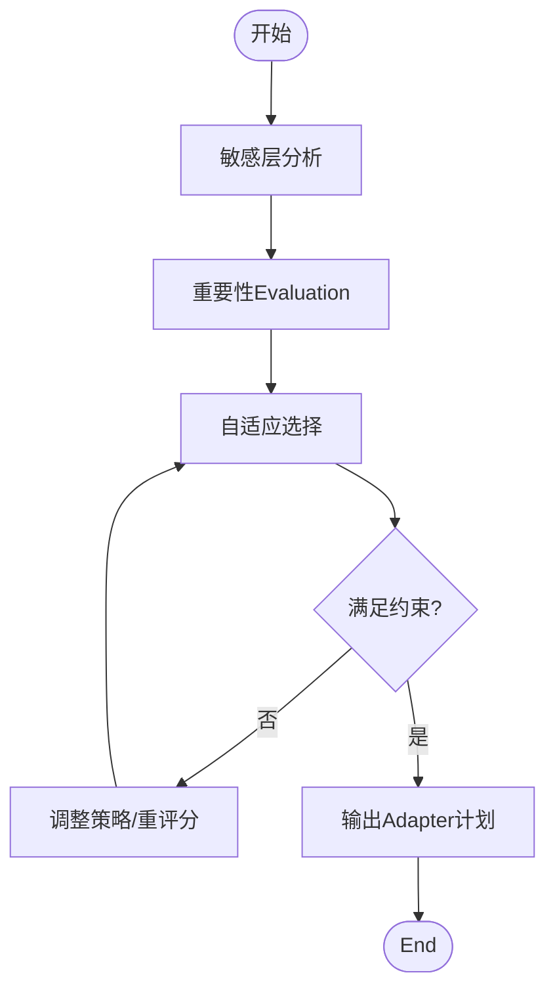
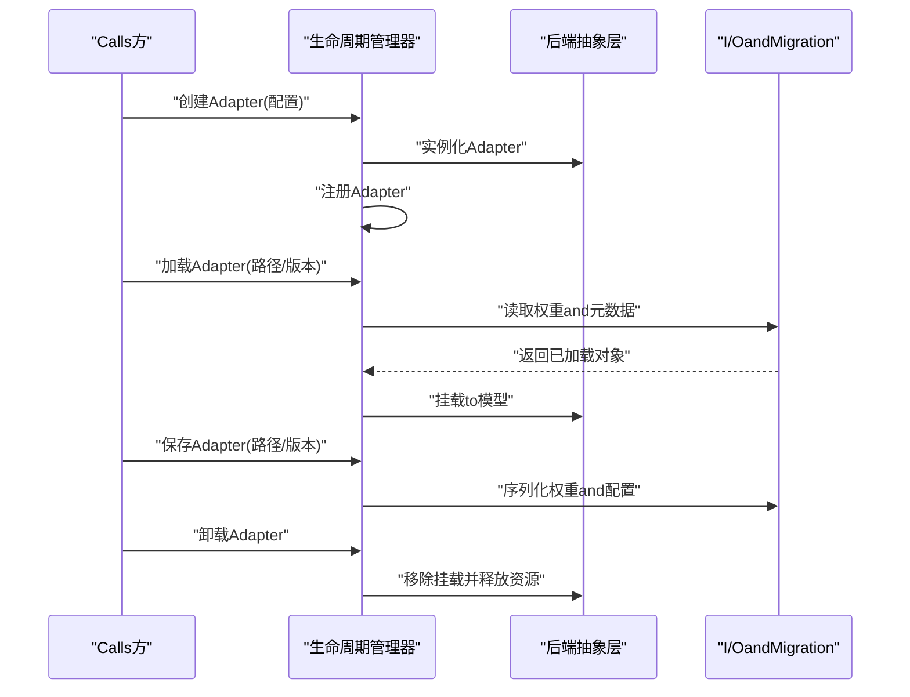
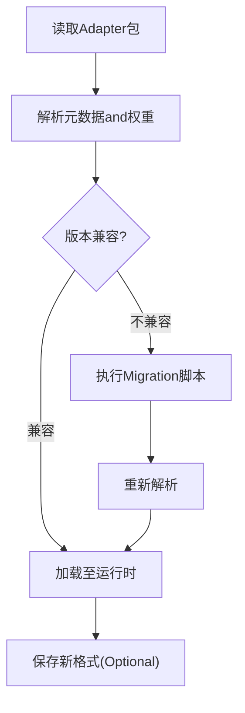
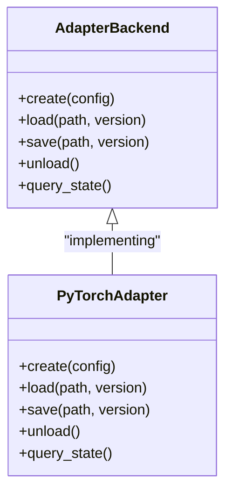
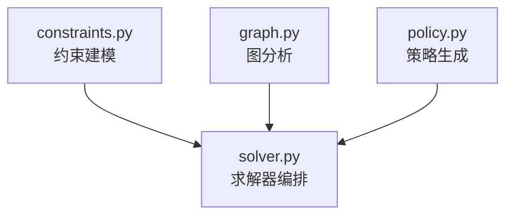
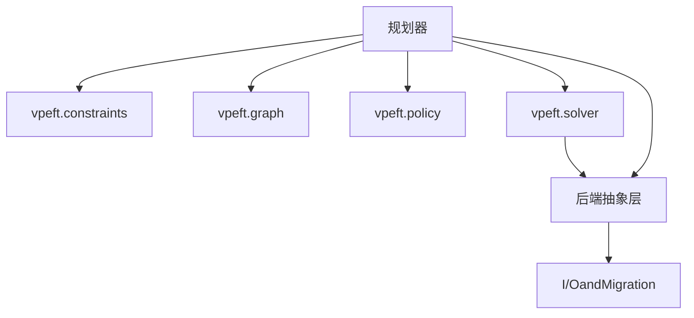

# Adapter Management System

<cite>
**Files Referenced in This Document**
- [vpeft/__init__.py](file://ultralytics/vpeft/__init__.py)
- [vpeft/constraints.py](file://ultralytics/vpeft/constraints.py)
- [vpeft/graph.py](file://ultralytics/vpeft/graph.py)
- [vpeft/policy.py](file://ultralytics/vpeft/policy.py)
- [vpeft/solver.py](file://ultralytics/vpeft/solver.py)
- [nn/peft/__init__.py](file://ultralytics/nn/peft/__init__.py)
- [utils/lora/__init__.py](file://ultralytics/utils/lora/__init__.py)
- [tests/test_vpeft.py](file://tests/test_vpeft.py)
- [tests/test_peft_adapters.py](file://tests/test_peft_adapters.py)
- [tests/test_moe_aware_peft.py](file://tests/test_moe_aware_peft.py)
- [scripts/validate_planner.py](file://scripts/validate_planner.py)
- [scripts/planner_train_compare.py](file://scripts/planner_train_compare.py)
</cite>

## Table of Contents
1. [Introduction](#Introduction)
2. [Project Structure](#Project Structure)
3. [Core Components](#Core Components)
4. [Architecture Overview](#Architecture Overview)
5. [Detailed Component Analysis](#Detailed Component Analysis)
6. [Dependency Analysis](#Dependency Analysis)
7. [性能考量](#性能考量)
8. [Troubleshooting Guide](#Troubleshooting Guide)
9. [Conclusion](#Conclusion)
10. [Appendix](#Appendix)

## Introduction
本技术DocumentationtargetingYOLO-Master的PEFT（Parameter-Efficient Fine-Tuning）Adapter Management System，聚焦Centered on下目标：
- 解释“Adapter规划器”的工作原理：敏感层分析、重要性Evaluationand自适应选择算法。
- 阐述Adapter的生命周期管理：创建、注册、加载、保存and卸载机制。
- 说明AdapterI/O系统的设计：格式Supporting、版本兼容性andMigration工具。
- 解释后端抽象层设计：不同框架Adapter的Unified Interface。
- Documentation化vpeftModules功能：约束求解、图分析and策略生成。
- providesAdapter管理的APIUsesExamples：批量操作and状态查询。
- 给出冲突解决and依赖管理的最佳实践。
- 解释AdapterandMoE架构的集成方式and兼容性考虑。

## Project Structure
围绕PEFTAdapter管理的关键代码分布whilesuch as下位置：
- vpeft：约束求解、图分析、策略生成and求解器编排。
- nn/peft：模型侧的AdapterEncapsulatesand后端抽象。
- utils/lora：LoRA相关工具andIOcapabilities。
- tests：针对vpeft、AdapterandMoE-aware PEFT的测试用例。
- scripts：规划器ValidationandTraining对比脚本。

Figure Source
- [vpeft/__init__.py](file://ultralytics/vpeft/__init__.py)
- [vpeft/constraints.py](file://ultralytics/vpeft/constraints.py)
- [vpeft/graph.py](file://ultralytics/vpeft/graph.py)
- [vpeft/policy.py](file://ultralytics/vpeft/policy.py)
- [vpeft/solver.py](file://ultralytics/vpeft/solver.py)
- [nn/peft/__init__.py](file://ultralytics/nn/peft/__init__.py)
- [utils/lora/__init__.py](file://ultralytics/utils/lora/__init__.py)
- [tests/test_vpeft.py](file://tests/test_vpeft.py)
- [tests/test_peft_adapters.py](file://tests/test_peft_adapters.py)
- [tests/test_moe_aware_peft.py](file://tests/test_moe_aware_peft.py)
- [scripts/validate_planner.py](file://scripts/validate_planner.py)
- [scripts/planner_train_compare.py](file://scripts/planner_train_compare.py)

Section Source
- [vpeft/__init__.py](file://ultralytics/vpeft/__init__.py)
- [nn/peft/__init__.py](file://ultralytics/nn/peft/__init__.py)
- [utils/lora/__init__.py](file://ultralytics/utils/lora/__init__.py)
- [tests/test_vpeft.py](file://tests/test_vpeft.py)
- [tests/test_peft_adapters.py](file://tests/test_peft_adapters.py)
- [tests/test_moe_aware_peft.py](file://tests/test_moe_aware_peft.py)
- [scripts/validate_planner.py](file://scripts/validate_planner.py)
- [scripts/planner_train_compare.py](file://scripts/planner_train_compare.py)

## Core Components
- Adapter规划器
  - 负责敏感层识别、重要性评分and自适应选择，输出可执行的Adapter配置计划。
- 生命周期管理器
  - 管理Adapter的创建、注册、加载、保存and卸载，确保状态一致性and资源安全释放。
- I/O系统andMigration工具
  - 定义Adapter数据格式、版本元数据and向后兼容策略，providesMigration路径。
- 后端抽象层
  - for不同框架（such asPyTorchetc.）providesUnified Interface，屏蔽底层差异。
- vpeftModules
  - provides约束建模、计算图分析、策略生成and求解器编排，支撑规划器决策。

Section Source
- [vpeft/__init__.py](file://ultralytics/vpeft/__init__.py)
- [vpeft/constraints.py](file://ultralytics/vpeft/constraints.py)
- [vpeft/graph.py](file://ultralytics/vpeft/graph.py)
- [vpeft/policy.py](file://ultralytics/vpeft/policy.py)
- [vpeft/solver.py](file://ultralytics/vpeft/solver.py)
- [nn/peft/__init__.py](file://ultralytics/nn/peft/__init__.py)
- [utils/lora/__init__.py](file://ultralytics/utils/lora/__init__.py)

## Architecture Overview
整体架构由“规划器—求解器—后端抽象—生命周期管理—I/O”五层构成，vpeft作for策略and求解的核心，drivers are installed上层生命周期andI/O流程。

Figure Source
- [vpeft/__init__.py](file://ultralytics/vpeft/__init__.py)
- [vpeft/constraints.py](file://ultralytics/vpeft/constraints.py)
- [vpeft/graph.py](file://ultralytics/vpeft/graph.py)
- [vpeft/policy.py](file://ultralytics/vpeft/policy.py)
- [vpeft/solver.py](file://ultralytics/vpeft/solver.py)
- [nn/peft/__init__.py](file://ultralytics/nn/peft/__init__.py)
- [utils/lora/__init__.py](file://ultralytics/utils/lora/__init__.py)

## Detailed Component Analysis

### Adapter规划器
- 敏感层分析
  - 基于模型结构andTasks特性，识别对下游Tasks敏感的Modules或权重区域。
- 重要性Evaluation
  - CombiningGradient统计、激活分布、路由频率（whileMoE场景）etc.Metrics进行量化评分。
- 自适应选择算法
  - while预算约束下，Via策略and求解器选择最优Adapter集合，平衡精度and开销。

Figure Source
- [vpeft/policy.py](file://ultralytics/vpeft/policy.py)
- [vpeft/graph.py](file://ultralytics/vpeft/graph.py)
- [vpeft/solver.py](file://ultralytics/vpeft/solver.py)

Section Source
- [vpeft/policy.py](file://ultralytics/vpeft/policy.py)
- [vpeft/graph.py](file://ultralytics/vpeft/graph.py)
- [vpeft/solver.py](file://ultralytics/vpeft/solver.py)

### 生命周期管理
- 创建
  - 依据规划结果实例化Adapter，分配必要资源并初始化参数。
- 注册
  - 将Adapter纳入全局或局部Registry，建立名称to实例的映射。
- 加载
  - 从持久化存储读取权重and元数据，完成热插拔或按需加载。
- 保存
  - 序列化Adapter权重and配置，附带版本信息and依赖声明。
- 卸载
  - 清理引用、释放内存and设备资源，保证无泄漏。

Figure Source
- [nn/peft/__init__.py](file://ultralytics/nn/peft/__init__.py)
- [utils/lora/__init__.py](file://ultralytics/utils/lora/__init__.py)

Section Source
- [nn/peft/__init__.py](file://ultralytics/nn/peft/__init__.py)
- [utils/lora/__init__.py](file://ultralytics/utils/lora/__init__.py)

### I/O系统andMigration工具
- 格式Supporting
  - 定义Adapter权重and配置的序列化格式，包含元数据（版本、依赖、哈希）。
- 版本兼容性
  - Via元数据进行向前/向后兼容判断，必要时触发Migration流程。
- Migration工具
  - provides旧版格式to新版的转换脚本，确保平滑升级。

Figure Source
- [utils/lora/__init__.py](file://ultralytics/utils/lora/__init__.py)

Section Source
- [utils/lora/__init__.py](file://ultralytics/utils/lora/__init__.py)

### 后端抽象层
- Unified Interface
  - Exposing a consistent创建、挂载、卸载and查询方法。
- 框架适配
  - 针对不同框架（such asPyTorch）implementing具体Adapter类，隐藏差异。
- 错误处理
  - 统一异常类型and诊断信息，便于定位问题。

Figure Source
- [nn/peft/__init__.py](file://ultralytics/nn/peft/__init__.py)

Section Source
- [nn/peft/__init__.py](file://ultralytics/nn/peft/__init__.py)

### vpeftModules
- 约束求解
  - 将业务需求（预算、精度、延迟）建模for约束，交由求解器判定可行性and最优解。
- 图分析
  - 构建模型计算图and依赖关系，用于影响范围分析and冲突检测。
- 策略生成
  - 根据Tasksand数据特征生成候选策略，供求解器筛选。

Figure Source
- [vpeft/constraints.py](file://ultralytics/vpeft/constraints.py)
- [vpeft/graph.py](file://ultralytics/vpeft/graph.py)
- [vpeft/policy.py](file://ultralytics/vpeft/policy.py)
- [vpeft/solver.py](file://ultralytics/vpeft/solver.py)

Section Source
- [vpeft/constraints.py](file://ultralytics/vpeft/constraints.py)
- [vpeft/graph.py](file://ultralytics/vpeft/graph.py)
- [vpeft/policy.py](file://ultralytics/vpeft/policy.py)
- [vpeft/solver.py](file://ultralytics/vpeft/solver.py)

### APIUsesExamples（概念性）
- 批量创建and注册
  - 输入：Adapter配置列表；输出：Registry状态。
- 批量加载and挂载
  - 输入：路径and版本映射；输出：挂载成功清单。
- 批量保存andExport
  - 输入：AdapterIDand目标路径；输出：Export报告。
- 状态查询
  - 查询当前已注册/已加载的Adapterand其依赖、版本and资源占用。

Section Source
- [tests/test_peft_adapters.py](file://tests/test_peft_adapters.py)
- [tests/test_vpeft.py](file://tests/test_vpeft.py)

### 冲突解决and依赖管理最佳实践
- 冲突检测
  - 基于图分析识别同名/同层冲突，优先采用命名空间隔离或自动重命名策略。
- 依赖排序
  - 依据依赖关系进行拓扑排序，确保加载顺序正确。
- 回滚and一致性
  - while加载失败时回滚to上一稳定状态，保持Registryand模型挂载一致。

Section Source
- [vpeft/graph.py](file://ultralytics/vpeft/graph.py)
- [vpeft/solver.py](file://ultralytics/vpeft/solver.py)

### andMoE架构的集成and兼容性
- MoE感知
  - while重要性Evaluation中引入路由频率and专家利用率，避免热点专家过载。
- 动态调度
  - CombiningMoE的动态调度策略，按场景切换Adapter组合，提升吞吐and精度。
- 兼容性
  - 确保AdapterandMoE路由边界对齐，避免跨边界副作用。

Section Source
- [tests/test_moe_aware_peft.py](file://tests/test_moe_aware_peft.py)
- [scripts/validate_planner.py](file://scripts/validate_planner.py)
- [scripts/planner_train_compare.py](file://scripts/planner_train_compare.py)

## Dependency Analysis
- 内部依赖
  - 规划器依赖vpeft的约束、图and策略Modules；求解器协调三者输出。
  - 生命周期管理依赖后端抽象层andI/OModules。
- External Dependencies
  - 框架特定implementing（such asPyTorch）Via后端抽象层接入。
- Potential Cycles依赖
  - Via分层and接口隔离避免循环，确保单向依赖。

Figure Source
- [vpeft/__init__.py](file://ultralytics/vpeft/__init__.py)
- [vpeft/constraints.py](file://ultralytics/vpeft/constraints.py)
- [vpeft/graph.py](file://ultralytics/vpeft/graph.py)
- [vpeft/policy.py](file://ultralytics/vpeft/policy.py)
- [vpeft/solver.py](file://ultralytics/vpeft/solver.py)
- [nn/peft/__init__.py](file://ultralytics/nn/peft/__init__.py)
- [utils/lora/__init__.py](file://ultralytics/utils/lora/__init__.py)

Section Source
- [vpeft/__init__.py](file://ultralytics/vpeft/__init__.py)
- [nn/peft/__init__.py](file://ultralytics/nn/peft/__init__.py)
- [utils/lora/__init__.py](file://ultralytics/utils/lora/__init__.py)

## 性能考量
- 选择策略
  - while预算内优先选择高收益低开销的Adapter，减少冗余。
- 图分析Optimization
  - 缓存关键图结构，避免重复计算；增量更新依赖关系。
- 后端执行
  - 利用框架特定的算子Optimizationand内存复用，降低加载and挂载开销。
- 批处理
  - 批量创建/加载/保存Centered on减少系统Callsand上下文切换。

[本节for通用指导，无需列出具体文件来源]

## Troubleshooting Guide
- 常见问题
  - 版本不兼容：检查元数据中的版本字段andMigration脚本可用性。
  - 依赖缺失：确认依赖链完整且拓扑排序正确。
  - 资源泄漏：核查卸载流程是否释放所有引用and设备资源。
- 诊断建议
  - 启用详细Logging，记录创建/加载/保存/卸载各阶段的状态and耗时。
  - UsesTest Suite复现问题，定位回归点。

Section Source
- [tests/test_vpeft.py](file://tests/test_vpeft.py)
- [tests/test_peft_adapters.py](file://tests/test_peft_adapters.py)
- [tests/test_moe_aware_peft.py](file://tests/test_moe_aware_peft.py)

## Conclusion
本系统Viavpeft的约束求解and图分析，Combining后端抽象and生命周期管理，implementing了可扩展、可移植的PEFTAdapter管理capabilities。Combined withI/OandMigration工具，可while多框架andMoE环境下稳定运行，并provides高效的批量操作and状态查询capabilities。

[本节for总结，无需列出具体文件来源]

## Appendix
- 术语
  - Adapter：轻量级可插拔的参数集，用于增强或修改模型行for。
  - 规划器：根据Tasksand约束生成Adapter选择计划的组件。
  - 求解器：while约束条件下寻找可行或最优解的组件。
- Refer to脚本and测试
  - 规划器ValidationandTraining对比脚本可用于端to端Validationand回归测试。

Section Source
- [scripts/validate_planner.py](file://scripts/validate_planner.py)
- [scripts/planner_train_compare.py](file://scripts/planner_train_compare.py)