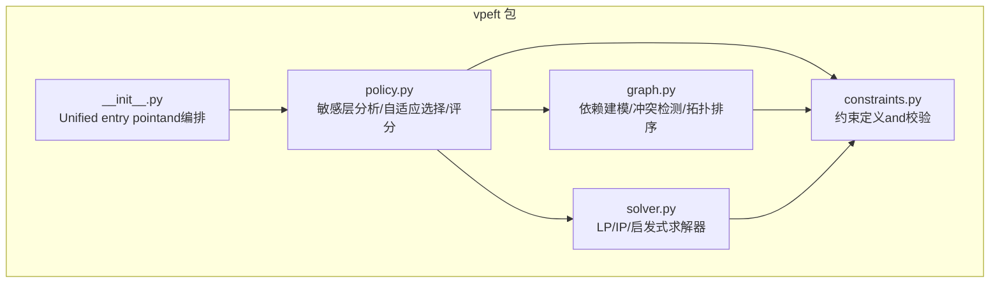
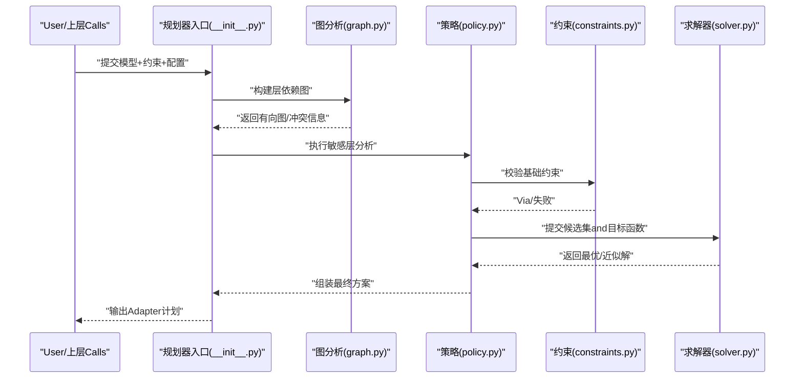
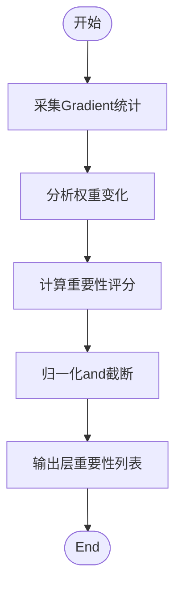
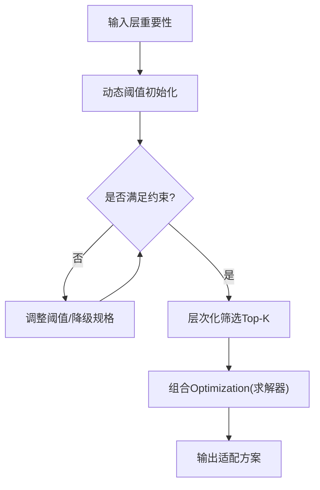
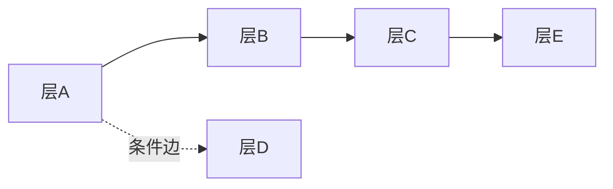
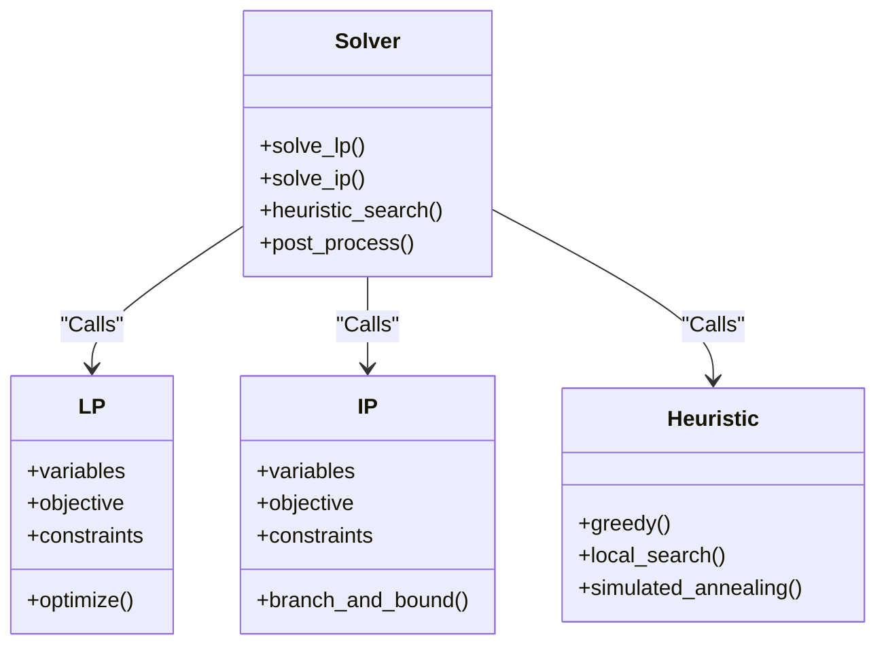
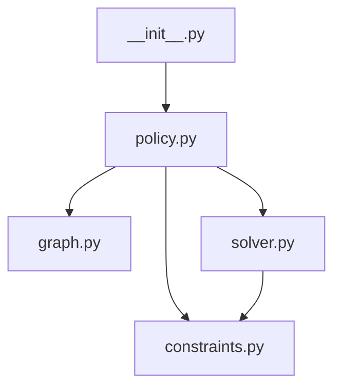

# Adapter规划器

<cite>
**Files Referenced in This Document**
- [vpeft/__init__.py](file://ultralytics/vpeft/__init__.py)
- [vpeft/constraints.py](file://ultralytics/vpeft/constraints.py)
- [vpeft/graph.py](file://ultralytics/vpeft/graph.py)
- [vpeft/policy.py](file://ultralytics/vpeft/policy.py)
- [vpeft/solver.py](file://ultralytics/vpeft/solver.py)
- [test_planner.py](file://tests/test_planner.py)
- [test_planner_enhancement.py](file://tests/test_planner_enhancement.py)
- [test_planner_integration.py](file://tests/test_planner_integration.py)
- [scripts/validate_planner.py](file://scripts/validate_planner.py)
- [scripts/run_planner_lovo_calibration.py](file://scripts/run_planner_lovo_calibration.py)
</cite>

## Table of Contents
1. [Introduction](#Introduction)
2. [Project Structure](#Project Structure)
3. [Core Components](#Core Components)
4. [Architecture Overview](#Architecture Overview)
5. [Detailed Component Analysis](#Detailed Component Analysis)
6. [Dependency Analysis](#Dependency Analysis)
7. [Performance Considerations](#Performance Considerations)
8. [Troubleshooting Guide](#Troubleshooting Guide)
9. [Conclusion](#Conclusion)
10. [Appendix](#Appendix)

## Introduction
本技术Documentation聚焦于YOLO-Master中的“Adapter规划器”，其The goal is to complete within给定Models and Tasks约束的前提下，自动for不同层或Modules选择最优的Adapter（such asLoRA、MoE专家etc.）配置方案。规划器围绕Centered on下关键capabilitiesunfold：
- 敏感层分析：ViaGradient敏感性Evaluation、权重变化分析and重要性评分机制，识别对Tasks最关键的层。
- 自适应选择策略：基于动态阈值调整、层次化选择and约束满足求解，while资源预算内最大化收益。
- 图分析Modules：建模层间依赖、检测冲突并执行拓扑排序，确保可执行的适配顺序。
- 约束求解器：Supporting线性规划、整数规划and启发式算法，兼顾最优性and可Extensibility。
- 配置and调优：provides丰富的参数选项and调优建议，便于while不同模型和数据集上快速落地。
- MoE集成andOptimization：targetingMixture专家架构的适配方案生成and部署Optimization策略。

## Project Structure
Adapter规划器位于 ultralytics/vpeft 子包中，采用分层Modules化设计：
- constraints.py：定义and校验各类约束（资源、精度、兼容性etc.）。
- graph.py：构建层依赖图、冲突检测and拓扑排序。
- policy.py：implementing敏感层分析、自适应选择策略and评分机制。
- solver.py：Encapsulates约束求解器（线性/整数规划and启发式）。
- __init__.py：对外暴露Unified entry pointand高层API。

Figure Source
- [vpeft/__init__.py](file://ultralytics/vpeft/__init__.py)
- [vpeft/constraints.py](file://ultralytics/vpeft/constraints.py)
- [vpeft/graph.py](file://ultralytics/vpeft/graph.py)
- [vpeft/policy.py](file://ultralytics/vpeft/policy.py)
- [vpeft/solver.py](file://ultralytics/vpeft/solver.py)

Section Source
- [vpeft/__init__.py](file://ultralytics/vpeft/__init__.py)
- [vpeft/constraints.py](file://ultralytics/vpeft/constraints.py)
- [vpeft/graph.py](file://ultralytics/vpeft/graph.py)
- [vpeft/policy.py](file://ultralytics/vpeft/policy.py)
- [vpeft/solver.py](file://ultralytics/vpeft/solver.py)

## Core Components
- 约束系统（constraints.py）
  - 资源类约束：显存、计算量、参数量上限。
  - 精度类约束：最小精度保持、最大退化容忍度。
  - 兼容类约束：设备类型、后端capabilities、Export格式限制。
  - 自定义扩展点：允许User注册新的约束类型and校验函数。
- 图分析（graph.py）
  - 依赖建模：将模型层抽象for节点，边表示数据流and控制流依赖。
  - 冲突检测：识别互斥的Adapter组合and不可共存配置。
  - 拓扑排序：输出无环的执行序列，保证前向传播时依赖已就绪。
- 策略and评分（policy.py）
  - 敏感层分析：Gradient范数/方差、权重更新幅度、重要性打分。
  - 自适应选择：动态阈值、层次化筛选（粗筛→精排）、约束满足求解。
  - 收益函数：综合精度提升、成本开销and稳定性Metrics。
- 求解器（solver.py）
  - 线性规划（LP）：连续松弛的快速近似解。
  - 整数规划（IP）：离散选择的精确或分支定界解。
  - 启发式：贪心、局部搜索、模拟退火etc.，用于大规模问题。
- Unified entry point（__init__.py）
  - 编排流程：Load model→构建图→分析敏感层→求解→输出方案。
  - 配置解析：合并默认andUser配置，进行合法性校验。

Section Source
- [vpeft/constraints.py](file://ultralytics/vpeft/constraints.py)
- [vpeft/graph.py](file://ultralytics/vpeft/graph.py)
- [vpeft/policy.py](file://ultralytics/vpeft/policy.py)
- [vpeft/solver.py](file://ultralytics/vpeft/solver.py)
- [vpeft/__init__.py](file://ultralytics/vpeft/__init__.py)

## Architecture Overview
规划器的端to端流程such as下：
- 输入：模型结构、数据集统计、资源and精度约束、目标Tasks。
- 处理：构建依赖图→敏感层分析→候选集生成→约束校验→求解器Optimization→输出方案。
- 输出：每层的Adapter类型、秩/通道数、激活开关、routing strategies（若forMoE）。

Figure Source
- [vpeft/__init__.py](file://ultralytics/vpeft/__init__.py)
- [vpeft/graph.py](file://ultralytics/vpeft/graph.py)
- [vpeft/policy.py](file://ultralytics/vpeft/policy.py)
- [vpeft/constraints.py](file://ultralytics/vpeft/constraints.py)
- [vpeft/solver.py](file://ultralytics/vpeft/solver.py)

## Detailed Component Analysis

### 敏感层分析算法（policy.py）
- Gradient敏感性Evaluation
  - 基于Backpropagation的Gradient统计（范数、方差、稀疏度），衡量层对损失变化的敏感度。
  - Optional采样策略：小批量随机样本、Tasks特定分布、历史Training快照。
- 权重变化分析
  - 监控预Trainingto微调阶段的权重更新幅度，识别易变层。
  - Combining权重范数and相对变化率，降低噪声影响。
- 重要性评分机制
  - 多Metrics融合：Gradient敏感性×权重变化×Tasks相关性先验。
  - 归一化and分位数截断，避免极端值主导。
- 输出
  - 每层的重要性分数and置信区间，供后续自适应选择Uses。

Figure Source
- [vpeft/policy.py](file://ultralytics/vpeft/policy.py)

Section Source
- [vpeft/policy.py](file://ultralytics/vpeft/policy.py)

### 自适应选择策略（policy.py）
- 动态阈值调整
  - 根据全局预算and当前选中比例，动态提高/降低入选门槛。
  - 引入回退机制：当约束不满足时，自动放宽非关键约束或降级Adapter规格。
- 层次化选择
  - 粗筛：按重要性分数and成本过滤，保留Top-K候选。
  - 精排：while候选集中进行组合Optimization，考虑交互效应and冲突。
- 约束满足求解
  - 将选择问题形式化for带约束的Optimization问题，交由求解器处理。
  - Supporting硬约束（必须满足）and软约束（惩罚项）。

Figure Source
- [vpeft/policy.py](file://ultralytics/vpeft/policy.py)

Section Source
- [vpeft/policy.py](file://ultralytics/vpeft/policy.py)

### 图分析Modules（graph.py）
- 依赖关系建模
  - 节点：模型层/Modules；边：张量依赖、控制依赖、共享权重。
  - Supporting条件依赖（仅while特定路由路径下生效）。
- 冲突检测
  - 互斥Adapter组合（such as同一层同时启用多种不相容Adapter）。
  - 资源冲突（并行度and内存峰值超限）。
- 拓扑排序
  - 基于Kahn算法或DFS的无环排序，输出可执行序列。
  - 若存while环，报告冲突边并provides消解建议（such as拆分层或重命名）。

Figure Source
- [vpeft/graph.py](file://ultralytics/vpeft/graph.py)

Section Source
- [vpeft/graph.py](file://ultralytics/vpeft/graph.py)

### 约束求解器（solver.py）
- 线性规划（LP）
  - 变量：连续的选择强度（0~1），适用于快速近似。
  - 目标：最大化加权收益，受限于资源and精度约束。
- 整数规划（IP）
  - 变量：离散选择（0/1），适用于严格组合Optimization。
  - 方法：分支定界、割平面，Supporting大规模实例的剪枝。
- 启发式算法
  - 贪心：按性价比排序逐步加入，适合实时场景。
  - 局部搜索/模拟退火：跳出局部最优，提高解质量。
- 结果Post-Processing
  - 可行性修复：对轻微越界进行微调Centered on满足硬约束。
  - 鲁棒性检查：对扰动下的稳定性进行Evaluation。

Figure Source
- [vpeft/solver.py](file://ultralytics/vpeft/solver.py)

Section Source
- [vpeft/solver.py](file://ultralytics/vpeft/solver.py)

### Unified entry pointand编排（__init__.py）
- 配置解析and合并
  - 默认配置、User覆盖、环境变量的优先级管理。
- 流程编排
  - 依次Calls图分析、敏感层分析、约束校验、求解器andPost-Processing。
- 结果序列化
  - 输出JSON/YAML格式的Adapter计划，包含每层配置and元数据。

Section Source
- [vpeft/__init__.py](file://ultralytics/vpeft/__init__.py)

## Dependency Analysis
- 内部依赖
  - __init__.py 编排 policy → graph → constraints → solver。
  - policy 依赖 graph 的依赖信息and constraints 的校验接口。
  - solver 依赖 constraints provides的约束表达式。
- External Dependencies
  - 数值Optimization库（such as线性/整数Planning and Solving器）。
  - Deep Learning Framework（PyTorch）Centered on获取Gradientand权重信息。
- Potential Cycles
  - Via单向编排避免循环导入；若新增回调需确保单向依赖。

Figure Source
- [vpeft/__init__.py](file://ultralytics/vpeft/__init__.py)
- [vpeft/policy.py](file://ultralytics/vpeft/policy.py)
- [vpeft/graph.py](file://ultralytics/vpeft/graph.py)
- [vpeft/constraints.py](file://ultralytics/vpeft/constraints.py)
- [vpeft/solver.py](file://ultralytics/vpeft/solver.py)

Section Source
- [vpeft/__init__.py](file://ultralytics/vpeft/__init__.py)
- [vpeft/policy.py](file://ultralytics/vpeft/policy.py)
- [vpeft/graph.py](file://ultralytics/vpeft/graph.py)
- [vpeft/constraints.py](file://ultralytics/vpeft/constraints.py)
- [vpeft/solver.py](file://ultralytics/vpeft/solver.py)

## Performance Considerations
- 敏感层分析的采样策略
  - Uses代表性子集and早停策略减少Backpropagation开销。
  - 缓存中间统计，避免重复计算。
- 图规模and复杂度
  - 大模型图构建采用惰性加载and增量更新。
  - 冲突检测Uses位图或哈希加速。
- 求解器选择
  - 小规模问题优先IPCentered on获得精确解；大规模问题UsesLP或启发式。
  - 并行化：对独立子图进行并发求解and合并。
- 内存and带宽
  - 权重andGradientUses半精度或量化存储Centered on降低内存占用。
  - 批处理候选集，减少I/Oand序列化开销。

## Troubleshooting Guide
- 常见问题
  - 约束不满足：检查资源上限and精度下限设置，必要时放宽软约束。
  - 图存while环：定位冲突边，考虑层拆分或移除条件依赖。
  - 求解超时：切换至LP或启发式，或缩小候选集规模。
- 诊断工具
  - Validation脚本：运行测试andValidation脚本，复现问题并收集Logging。
  - Visualization：输出依赖图and选择过程，辅助定位bottlenecks。
- Refer to用例
  - Unit tests and integration tests覆盖典型场景，可作for回归基线。

Section Source
- [test_planner.py](file://tests/test_planner.py)
- [test_planner_enhancement.py](file://tests/test_planner_enhancement.py)
- [test_planner_integration.py](file://tests/test_planner_integration.py)
- [scripts/validate_planner.py](file://scripts/validate_planner.py)

## Conclusion
Adapter规划器Via“敏感层分析—自适应选择—图分析—约束求解”的闭环流程，能够while复杂模型and多样化约束下自动生成高质量Adapter方案。其Modules化设计and可扩展接口，使得while不同Tasksand硬件平台上快速适配成for可能。未来可进一步探索while线学习drivers are installed的动态阈值and跨TasksMigration的重要性先验，Centered on提升泛化capabilitiesand鲁棒性。

## Appendix

### 配置选项and参数调优指南
- 通用配置
  - 资源预算：显存上限、计算量上限、参数量上限。
  - 精度要求：最小mAP/mIoU、最大退化容忍度。
  - 设备and后端：GPU/CPU、Inference后端（ONNX/TensorRT/OpenVINO）。
- 敏感层分析
  - 采样Batch Size、迭代次数、Gradient统计窗口。
  - 权重变化监控周期and平滑系数。
- 自适应选择
  - 初始阈值、阈值步长、回退策略。
  - Top-K候选数量、组合Optimization深度。
- 求解器
  - LP/IP求解器选择、时间预算、收敛阈值。
  - 启发式算法：迭代次数、温度曲线（模拟退火）。
- 调优建议
  - 从小规模数据集and轻量模型起步，逐步扩大规模。
  - 关注边界案例（极端类别不平衡、低分辨率图像）。
  - 定期校准重要性评分and收益函数权重。

### 实际UsesExamples
- forYOLO Series Models生成Adapter方案
  - 准备模型and数据集配置文件。
  - 设置资源and精度约束，运行规划器生成计划。
  - Export计划forJSON/YAML，用于后续Training或部署。
- forVisDrone数据集定制方案
  - 针对小目标and密集场景调整重要性先验。
  - 放宽部分软约束Centered on提升召回率。
- Refer to脚本
  - UsesValidationand校准脚本快速上手and复现实验。

Section Source
- [scripts/validate_planner.py](file://scripts/validate_planner.py)
- [scripts/run_planner_lovo_calibration.py](file://scripts/run_planner_lovo_calibration.py)

### andMoE架构的集成方式and性能Optimization策略
- 集成方式
  - whilepolicy中增加MoE专家选择维度，Combining路由概率andLoad Balancing。
  - whilegraph中建模专家间的共享and互斥关系。
  - whilesolver中引入专家容量andLoad Balancing约束。
- 性能Optimization
  - 专家裁剪：依据Uses频率and贡献度剔除低效专家。
  - 动态调度：根据Input Features动态激活子集专家，降低延迟。
  - 缓存and预热：对常用专家路径进行预热，减少冷启动开销。