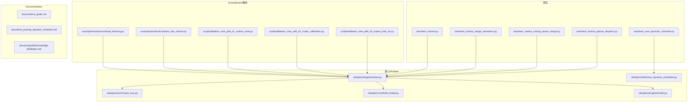
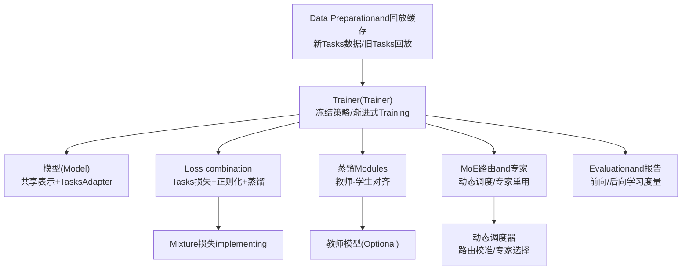
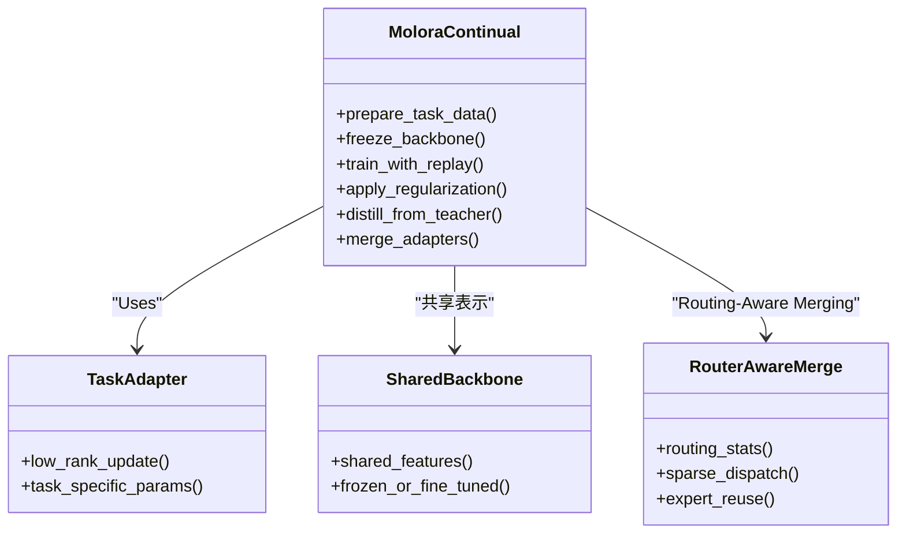
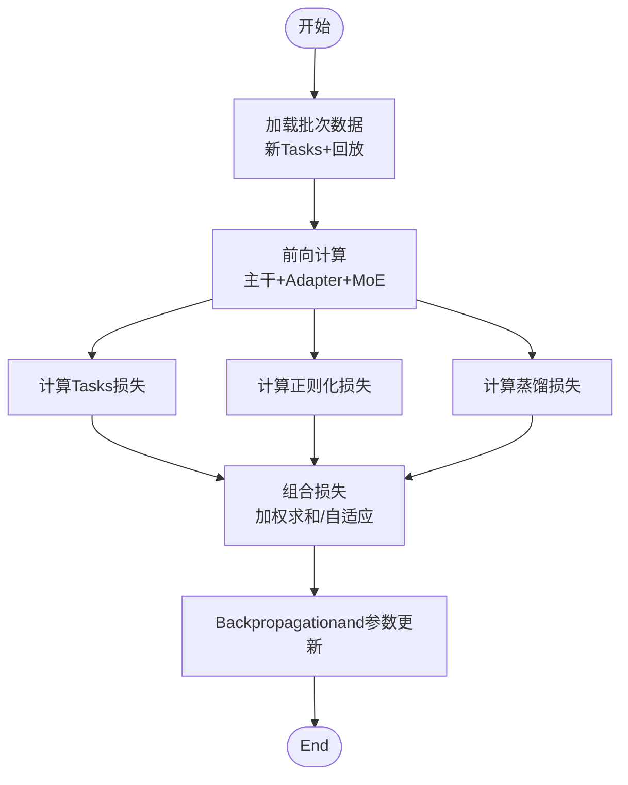
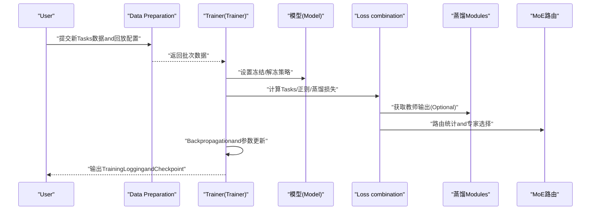
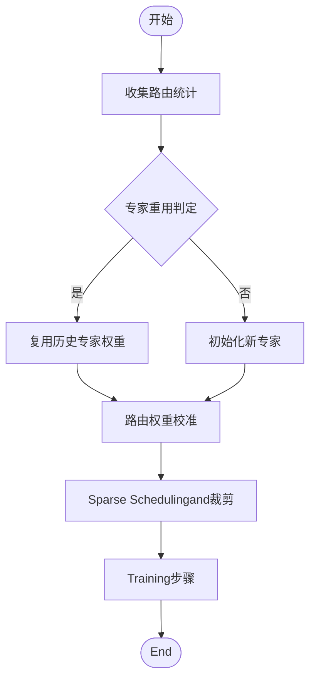
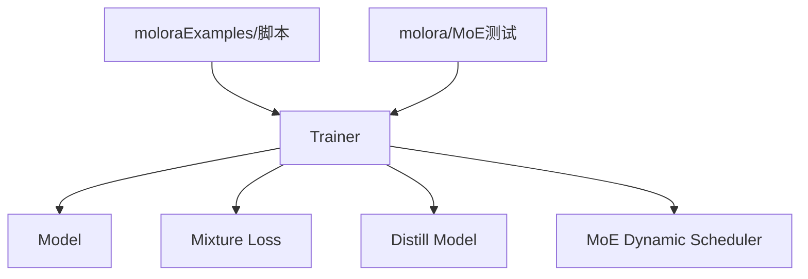

# 增量学习and灾难性遗忘

<cite>
**Files Referenced in This Document**
- [molora_guide.md](file://docs/molora_guide.md)
- [continual_learning.py](file://examples/molora/continual_learning.py)
- [compare_lora_molora.py](file://examples/molora/compare_lora_molora.py)
- [test_molora.py](file://tests/test_molora.py)
- [test_molora_merge_semantics.py](file://tests/test_molora_merge_semantics.py)
- [test_molora_routing_aware_merge.py](file://tests/test_molora_routing_aware_merge.py)
- [test_molora_sparse_dispatch.py](file://tests/test_molora_sparse_dispatch.py)
- [ablation_moe_peft_e1_molora_rank.py](file://scripts/ablation_moe_peft_e1_molora_rank.py)
- [ablation_moe_peft_e2_router_calibration.py](file://scripts/ablation_moe_peft_e2_router_calibration.py)
- [ablation_moe_peft_e3_expert_load_viz.py](file://scripts/ablation_moe_peft_e3_expert_load_viz.py)
- [mixture_loss.py](file://ultralytics/nn/mixture_loss.py)
- [distill_model.py](file://ultralytics/nn/distill_model.py)
- [trainer.py](file://ultralytics/engine/trainer.py)
- [model.py](file://ultralytics/engine/model.py)
- [peft_adapters.py](file://tests/test_peft_adapters.py)
- [moe_dynamic_schedule.py](file://tests/test_moe_dynamic_schedule.py)
- [moe_dynamic_scheduler.py](file://ultralytics/utils/moe_dynamic_scheduler.py)
- [moe_pruning_sweep.py](file://scripts/moe_pruning_sweep.py)
- [moe_pruning_dynamic_schedule.md](file://docs/moe_pruning_dynamic_schedule.md)
- [knowledge_distillation.md](file://docs/en/guides/knowledge-distillation.md)
</cite>

## Table of Contents
1. [引言](#引言)
2. [Project Structure](#Project Structure)
3. [Core Components](#Core Components)
4. [Architecture Overview](#Architecture Overview)
5. [Detailed Component Analysis](#Detailed Component Analysis)
6. [Dependency Analysis](#Dependency Analysis)
7. [性能考量](#性能考量)
8. [Troubleshooting Guide](#Troubleshooting Guide)
9. [Conclusion](#Conclusion)
10. [Appendix](#Appendix)

## 引言
本技术Documentation围绕YOLO-Master的增量学习系统，系统性阐述灾难性遗忘的理论基础and其whileObject Detection中的具体表现，并深入解析增量学习的核心算法（经验回放、正则化方法、Knowledge Distillation），Centered onandmolorawhile持续学习中的应用（动态网络扩展、Tasks特定Adapterand共享表示学习）。同时，Documentation给出Loss Function设计策略、端to端工作流程、EvaluationMetrics体系、调优指南and最佳实践，并解释andMoE架构Combining的增量学习方法（专家重用and路由调整）。

## Project Structure
仓库中and增量学习相关的代码andDocumentation主要分布whileCentered on下位置：
- Examplesand脚本：examples/molora、scripts/*molora*、scripts/*moe*
- 测试：tests/test_molora*.py、tests/test_moe*.py
- 核心Modules：ultralytics/nn/mixture_loss.py、ultralytics/nn/distill_model.py、ultralytics/engine/trainer.py、ultralytics/engine/model.py
- Documentation：docs/molora_guide.md、docs/moe_pruning_dynamic_schedule.md、docs/en/guides/knowledge-distillation.md

Figure Source
- [continual_learning.py:1-200](file://examples/molora/continual_learning.py#L1-L200)
- [compare_lora_molora.py:1-200](file://examples/molora/compare_lora_molora.py#L1-L200)
- [ablation_moe_peft_e1_molora_rank.py:1-200](file://scripts/ablation_moe_peft_e1_molora_rank.py#L1-L200)
- [ablation_moe_peft_e2_router_calibration.py:1-200](file://scripts/ablation_moe_peft_e2_router_calibration.py#L1-L200)
- [ablation_moe_peft_e3_expert_load_viz.py:1-200](file://scripts/ablation_moe_peft_e3_expert_load_viz.py#L1-L200)
- [test_molora.py:1-200](file://tests/test_molora.py#L1-L200)
- [test_molora_merge_semantics.py:1-200](file://tests/test_molora_merge_semantics.py#L1-L200)
- [test_molora_routing_aware_merge.py:1-200](file://tests/test_molora_routing_aware_merge.py#L1-L200)
- [test_molora_sparse_dispatch.py:1-200](file://tests/test_molora_sparse_dispatch.py#L1-L200)
- [test_moe_dynamic_schedule.py:1-200](file://tests/test_moe_dynamic_schedule.py#L1-L200)
- [mixture_loss.py:1-200](file://ultralytics/nn/mixture_loss.py#L1-L200)
- [distill_model.py:1-200](file://ultralytics/nn/distill_model.py#L1-L200)
- [trainer.py:1-200](file://ultralytics/engine/trainer.py#L1-L200)
- [model.py:1-200](file://ultralytics/engine/model.py#L1-L200)
- [moe_dynamic_scheduler.py:1-200](file://ultralytics/utils/moe_dynamic_scheduler.py#L1-L200)
- [molora_guide.md:1-200](file://docs/molora_guide.md#L1-L200)
- [moe_pruning_dynamic_schedule.md:1-200](file://docs/moe_pruning_dynamic_schedule.md#L1-L200)
- [knowledge_distillation.md:1-200](file://docs/en/guides/knowledge-distillation.md#L1-L200)

Section Source
- [molora_guide.md:1-200](file://docs/molora_guide.md#L1-L200)
- [continual_learning.py:1-200](file://examples/molora/continual_learning.py#L1-L200)
- [compare_lora_molora.py:1-200](file://examples/molora/compare_lora_molora.py#L1-L200)
- [test_molora.py:1-200](file://tests/test_molora.py#L1-L200)
- [test_molora_merge_semantics.py:1-200](file://tests/test_molora_merge_semantics.py#L1-L200)
- [test_molora_routing_aware_merge.py:1-200](file://tests/test_molora_routing_aware_merge.py#L1-L200)
- [test_molora_sparse_dispatch.py:1-200](file://tests/test_molora_sparse_dispatch.py#L1-L200)
- [ablation_moe_peft_e1_molora_rank.py:1-200](file://scripts/ablation_moe_peft_e1_molora_rank.py#L1-L200)
- [ablation_moe_peft_e2_router_calibration.py:1-200](file://scripts/ablation_moe_peft_e2_router_calibration.py#L1-L200)
- [ablation_moe_peft_e3_expert_load_viz.py:1-200](file://scripts/ablation_moe_peft_e3_expert_load_viz.py#L1-L200)
- [mixture_loss.py:1-200](file://ultralytics/nn/mixture_loss.py#L1-L200)
- [distill_model.py:1-200](file://ultralytics/nn/distill_model.py#L1-L200)
- [trainer.py:1-200](file://ultralytics/engine/trainer.py#L1-L200)
- [model.py:1-200](file://ultralytics/engine/model.py#L1-L200)
- [moe_dynamic_scheduler.py:1-200](file://ultralytics/utils/moe_dynamic_scheduler.py#L1-L200)
- [moe_pruning_dynamic_schedule.md:1-200](file://docs/moe_pruning_dynamic_schedule.md#L1-L200)
- [knowledge_distillation.md:1-200](file://docs/en/guides/knowledge-distillation.md#L1-L200)

## Core Components
- molora持续学习框架
  - provides增量Training流程、LoRAandmolora对比、Routing-Aware MergingandSparse Schedulingetc.capabilities。
  - 关键入口and用例参见Examplesand测试文件。
- MoE相关工具and调度
  - 动态调度器用于专家选择and路由校准，Supporting专家重用and路由调整。
- 损失and蒸馏
  - MixtureLoss combination（Tasks损失、正则化损失、蒸馏损失）and教师-学生蒸馏管线。
- Training引擎
  - TrainerandModel负责Data Loading、冻结策略、渐进式TrainingandEvaluation集成。

Section Source
- [molora_guide.md:1-200](file://docs/molora_guide.md#L1-L200)
- [continual_learning.py:1-200](file://examples/molora/continual_learning.py#L1-L200)
- [compare_lora_molora.py:1-200](file://examples/molora/compare_lora_molora.py#L1-L200)
- [moe_dynamic_scheduler.py:1-200](file://ultralytics/utils/moe_dynamic_scheduler.py#L1-L200)
- [mixture_loss.py:1-200](file://ultralytics/nn/mixture_loss.py#L1-L200)
- [distill_model.py:1-200](file://ultralytics/nn/distill_model.py#L1-L200)
- [trainer.py:1-200](file://ultralytics/engine/trainer.py#L1-L200)
- [model.py:1-200](file://ultralytics/engine/model.py#L1-L200)

## Architecture Overview
下图展示增量学习系统whileYOLO-Master中的整体架构：Data Preparationand回放缓存、模型冻结and渐进式Training、Loss combinationand蒸馏、MoE路由and专家管理、Evaluationand报告生成。

Figure Source
- [trainer.py:1-200](file://ultralytics/engine/trainer.py#L1-L200)
- [model.py:1-200](file://ultralytics/engine/model.py#L1-L200)
- [mixture_loss.py:1-200](file://ultralytics/nn/mixture_loss.py#L1-L200)
- [distill_model.py:1-200](file://ultralytics/nn/distill_model.py#L1-L200)
- [moe_dynamic_scheduler.py:1-200](file://ultralytics/utils/moe_dynamic_scheduler.py#L1-L200)

## Detailed Component Analysis

### 灾难性遗忘问题andObject Detection中的表现
- 理论基础
  - 增量学习中，模型while新Tasks上Optimization时，参数更新会破坏对旧Tasks的表征，导致性能显著下降。
- whileObject Detection中的具体表现
  - 类别分布变化引发边界框回归and分类头偏移；小样本类别易被覆盖；多尺度特征退化；IoU阈值敏感导致mAP快速下滑。
- 缓解思路
  - 经验回放保持旧Tasks分布；正则化约束重要参数；蒸馏维持旧Tasks输出一致性；MoEVia专家隔离and路由控制减少干扰。

[本节for概念性说明，不直接分析具体文件]

### 增量学习核心算法
- 经验回放
  - 维护旧Tasks样本子集，and新Tasks数据MixtureTraining，稳定分布and表征。
- 正则化方法
  - 对关键参数施加权重衰减或弹性巩固，限制对旧Tasks重要的参数大幅更新。
- Knowledge Distillation
  - Uses教师模型（旧Tasks模型）输出作for软标签，约束学生模型while新TasksTraining时的行for，保持输出一致性。

Section Source
- [molora_guide.md:1-200](file://docs/molora_guide.md#L1-L200)
- [knowledge_distillation.md:1-200](file://docs/en/guides/knowledge-distillation.md#L1-L200)
- [distill_model.py:1-200](file://ultralytics/nn/distill_model.py#L1-L200)

### molorawhile持续学习中的应用
- 动态网络扩展
  - for新Tasks引入轻量Adapter或新增专家，避免全量重训，降低参数量增长。
- Tasks特定Adapter
  - LoRA风格的Low-Rank AdaptationModules，针对Tasks微调，保留共享主干表征。
- 共享表示学习
  - 主干网络共享，Tasks分支andAdapter差异化，平衡Migrationand稳定性。
- Routing-Aware MergingandSparse Scheduling
  - 根据路由统计进行Weight Mergingand专家裁剪，提升效率and泛化。

Figure Source
- [continual_learning.py:1-200](file://examples/molora/continual_learning.py#L1-L200)
- [compare_lora_molora.py:1-200](file://examples/molora/compare_lora_molora.py#L1-L200)
- [test_molora_merge_semantics.py:1-200](file://tests/test_molora_merge_semantics.py#L1-L200)
- [test_molora_routing_aware_merge.py:1-200](file://tests/test_molora_routing_aware_merge.py#L1-L200)
- [test_molora_sparse_dispatch.py:1-200](file://tests/test_molora_sparse_dispatch.py#L1-L200)

Section Source
- [molora_guide.md:1-200](file://docs/molora_guide.md#L1-L200)
- [continual_learning.py:1-200](file://examples/molora/continual_learning.py#L1-L200)
- [compare_lora_molora.py:1-200](file://examples/molora/compare_lora_molora.py#L1-L200)
- [test_molora.py:1-200](file://tests/test_molora.py#L1-L200)
- [test_molora_merge_semantics.py:1-200](file://tests/test_molora_merge_semantics.py#L1-L200)
- [test_molora_routing_aware_merge.py:1-200](file://tests/test_molora_routing_aware_merge.py#L1-L200)
- [test_molora_sparse_dispatch.py:1-200](file://tests/test_molora_sparse_dispatch.py#L1-L200)

### Loss Function设计and组合策略
- Tasks损失
  - 检测Tasks的标准损失（分类、回归、分割etc.），drivers are installed新Tasks拟合。
- 正则化损失
  - 对关键参数施加惩罚，抑制对旧Tasks重要的参数漂移。
- 蒸馏损失
  - 基于教师输出的KL散度或MSE，约束学生输出and教师一致。
- 组合策略
  - 加权求和或自适应权重，随Training阶段动态调整，平衡稳定性and可塑性。

Figure Source
- [mixture_loss.py:1-200](file://ultralytics/nn/mixture_loss.py#L1-L200)
- [distill_model.py:1-200](file://ultralytics/nn/distill_model.py#L1-L200)
- [trainer.py:1-200](file://ultralytics/engine/trainer.py#L1-L200)

Section Source
- [mixture_loss.py:1-200](file://ultralytics/nn/mixture_loss.py#L1-L200)
- [distill_model.py:1-200](file://ultralytics/nn/distill_model.py#L1-L200)
- [trainer.py:1-200](file://ultralytics/engine/trainer.py#L1-L200)

### 增量学习工作流程
- 新TasksData Preparation
  - 构建新Tasks数据集，采样旧Tasks回放样本，统一预处理and标注格式。
- 模型冻结策略
  - 主干网络部分冻结，仅TrainingAdapterandTasks特定Modules；逐步解冻Centered on渐进式Training。
- 渐进式Training
  - 分阶段Training：先Adapter后主干微调；Combining蒸馏and正则化，稳定学习过程。

Figure Source
- [continual_learning.py:1-200](file://examples/molora/continual_learning.py#L1-L200)
- [trainer.py:1-200](file://ultralytics/engine/trainer.py#L1-L200)
- [model.py:1-200](file://ultralytics/engine/model.py#L1-L200)
- [mixture_loss.py:1-200](file://ultralytics/nn/mixture_loss.py#L1-L200)
- [distill_model.py:1-200](file://ultralytics/nn/distill_model.py#L1-L200)
- [moe_dynamic_scheduler.py:1-200](file://ultralytics/utils/moe_dynamic_scheduler.py#L1-L200)

Section Source
- [continual_learning.py:1-200](file://examples/molora/continual_learning.py#L1-L200)
- [trainer.py:1-200](file://ultralytics/engine/trainer.py#L1-L200)
- [model.py:1-200](file://ultralytics/engine/model.py#L1-L200)

### EvaluationMetricsand平衡度量
- 前向学习
  - 新TasksmAP、召回率、精确率，衡量对新知识的吸收capabilities。
- 后向学习
  - 旧TasksmAP下降幅度、平均遗忘率，衡量稳定性。
- 平衡度量
  - 前向-后向权衡曲线、综合得分（such asF-Balance），指导超参搜索and早停策略。

[本节for概念性说明，不直接分析具体文件]

### 调优指南and最佳实践
- 回放比例and窗口大小
  - 根据旧Tasks规模and分布差异调整，避免过度记忆或分布偏移。
- 正则化强度
  - 依据参数重要性估计（such asFisher信息）设定权重，防止过约束。
- 蒸馏温度and权重
  - 温度平滑软标签，权重随Training阶段递减，侧重早期稳定性。
- Adapter秩andLearning Rate
  - Low-Rank AdaptationCombined with较小Learning Rate，逐步增大Centered on加速收敛。
- MoE路由and专家裁剪
  - 基于路由统计剪枝低利用率专家，保持容量and效率平衡。

Section Source
- [molora_guide.md:1-200](file://docs/molora_guide.md#L1-L200)
- [moe_pruning_dynamic_schedule.md:1-200](file://docs/moe_pruning_dynamic_schedule.md#L1-L200)
- [moe_dynamic_scheduler.py:1-200](file://ultralytics/utils/moe_dynamic_scheduler.py#L1-L200)

### andMoE架构Combining的增量学习
- 专家重用
  - 复用历史Tasks中高效专家，减少重复Training成本。
- 路由调整
  - 基于Tasks特征and路由统计动态调整门控，提升Tasks特异性and泛化。
- 动态调度and裁剪
  - 按阶段调整专家激活比例，CombiningSparse Scheduling降低显存and延迟。

Figure Source
- [moe_dynamic_scheduler.py:1-200](file://ultralytics/utils/moe_dynamic_scheduler.py#L1-L200)
- [test_moe_dynamic_schedule.py:1-200](file://tests/test_moe_dynamic_schedule.py#L1-L200)
- [moe_pruning_sweep.py:1-200](file://scripts/moe_pruning_sweep.py#L1-L200)
- [moe_pruning_dynamic_schedule.md:1-200](file://docs/moe_pruning_dynamic_schedule.md#L1-L200)

Section Source
- [moe_dynamic_scheduler.py:1-200](file://ultralytics/utils/moe_dynamic_scheduler.py#L1-L200)
- [test_moe_dynamic_schedule.py:1-200](file://tests/test_moe_dynamic_schedule.py#L1-L200)
- [moe_pruning_sweep.py:1-200](file://scripts/moe_pruning_sweep.py#L1-L200)
- [moe_pruning_dynamic_schedule.md:1-200](file://docs/moe_pruning_dynamic_schedule.md#L1-L200)

## Dependency Analysis
- 组件耦合
  - Trainer依赖Model、Loss combinationand蒸馏Modules；moloraExamplesand脚本ViaTrainer接口组织增量Training流程。
- External Dependencies
  - PyTorch生态、MoE调度器、PEFTAdapter（LoRA）and评测工具。
- Potential Cycles依赖
  - Via分层接口and回调机制解耦，避免循环导入。

Figure Source
- [trainer.py:1-200](file://ultralytics/engine/trainer.py#L1-L200)
- [model.py:1-200](file://ultralytics/engine/model.py#L1-L200)
- [mixture_loss.py:1-200](file://ultralytics/nn/mixture_loss.py#L1-L200)
- [distill_model.py:1-200](file://ultralytics/nn/distill_model.py#L1-L200)
- [moe_dynamic_scheduler.py:1-200](file://ultralytics/utils/moe_dynamic_scheduler.py#L1-L200)
- [continual_learning.py:1-200](file://examples/molora/continual_learning.py#L1-L200)
- [test_molora.py:1-200](file://tests/test_molora.py#L1-L200)

Section Source
- [trainer.py:1-200](file://ultralytics/engine/trainer.py#L1-L200)
- [model.py:1-200](file://ultralytics/engine/model.py#L1-L200)
- [mixture_loss.py:1-200](file://ultralytics/nn/mixture_loss.py#L1-L200)
- [distill_model.py:1-200](file://ultralytics/nn/distill_model.py#L1-L200)
- [moe_dynamic_scheduler.py:1-200](file://ultralytics/utils/moe_dynamic_scheduler.py#L1-L200)
- [continual_learning.py:1-200](file://examples/molora/continual_learning.py#L1-L200)
- [test_molora.py:1-200](file://tests/test_molora.py#L1-L200)

## 性能考量
- 回放缓存andI/O
  - 采用内存映射and预取，减少磁盘bottlenecks；合理批大小andData Augmentation开销。
- 稀疏MoEand路由
  - 控制激活专家数，利用Sparse Scheduling降低计算and通信开销。
- Gradient累积andMixture精度
  - while大模型场景下提升吞吐，注意数值稳定性andNaN防护。
- 早停and监控
  - 基于Validation集mAPand遗忘率双Metrics，避免过拟合and后向退化。

[本节for通用性能建议，不直接分析具体文件]

## Troubleshooting Guide
- Training不稳定或NaN
  - 检查蒸馏温度and权重、Learning RateandGradient裁剪；确认Mixture精度andAMP配置。
- 后向遗忘严重
  - 增加回放比例and正则化强度；提高蒸馏权重；缩短主干解冻步长。
- MoE路由异常
  - 观察路由统计and专家利用率；校准路由权重；必要时裁剪低效专家。
- Adapter合并失败
  - 核对合并语义andSparse Scheduling一致性；确保Routing-Aware Merging的参数维度匹配。

Section Source
- [test_molora_merge_semantics.py:1-200](file://tests/test_molora_merge_semantics.py#L1-L200)
- [test_molora_routing_aware_merge.py:1-200](file://tests/test_molora_routing_aware_merge.py#L1-L200)
- [test_molora_sparse_dispatch.py:1-200](file://tests/test_molora_sparse_dispatch.py#L1-L200)
- [test_moe_dynamic_schedule.py:1-200](file://tests/test_moe_dynamic_schedule.py#L1-L200)

## Conclusion
YOLO-Master的增量学习系统Viamolora框架、MoE路由and专家管理、Loss combinationand蒸馏，有效缓解灾难性遗忘，implementing前向学习and后向稳定的平衡。实践中需Combining回放策略、正则化and蒸馏权重调优，并借助Routing-Aware MergingandSparse Scheduling提升效率and泛化。

[This section is summary content and does not directly analyze specific files]

## Appendix
- Refer toDocumentationand计划
  - molora指南、MoE动态调度and裁剪Documentation、Knowledge Distillation指南。
- 实验and消融
  - 多组消融脚本覆盖rank、路由校准and专家Visualization，便于复现and对比。

Section Source
- [molora_guide.md:1-200](file://docs/molora_guide.md#L1-L200)
- [moe_pruning_dynamic_schedule.md:1-200](file://docs/moe_pruning_dynamic_schedule.md#L1-L200)
- [knowledge_distillation.md:1-200](file://docs/en/guides/knowledge-distillation.md#L1-L200)
- [ablation_moe_peft_e1_molora_rank.py:1-200](file://scripts/ablation_moe_peft_e1_molora_rank.py#L1-L200)
- [ablation_moe_peft_e2_router_calibration.py:1-200](file://scripts/ablation_moe_peft_e2_router_calibration.py#L1-L200)
- [ablation_moe_peft_e3_expert_load_viz.py:1-200](file://scripts/ablation_moe_peft_e3_expert_load_viz.py#L1-L200)