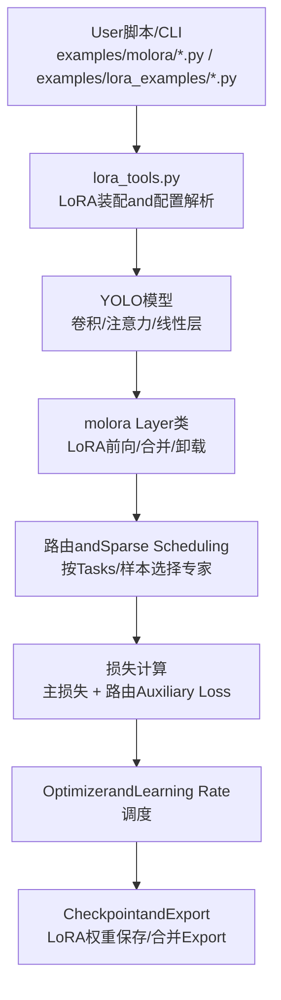
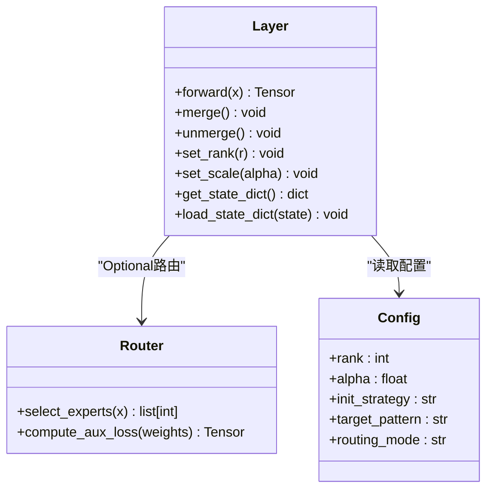
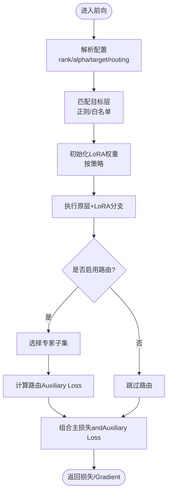
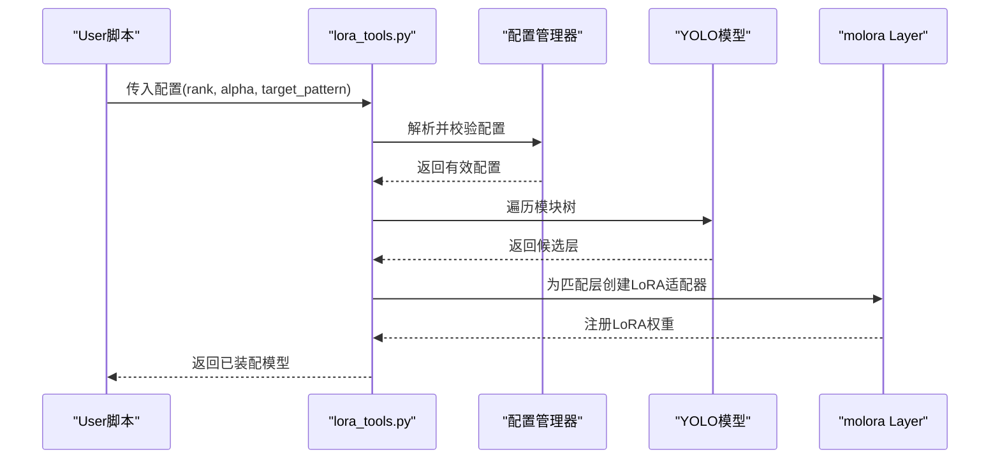
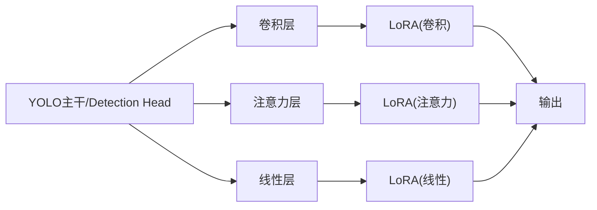
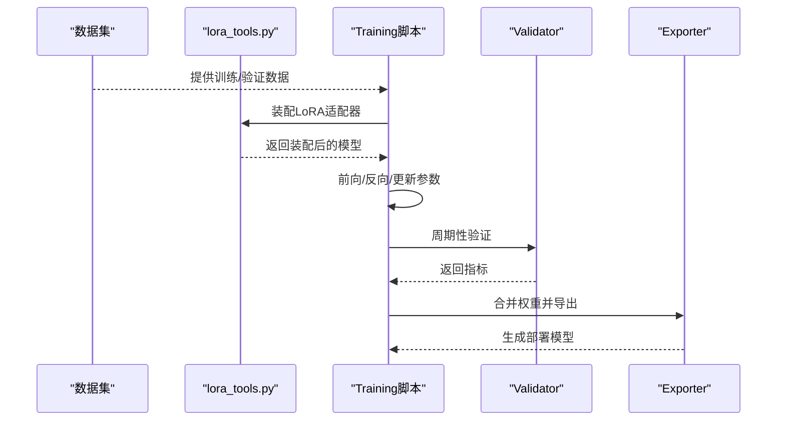

# LoRA核心implementing

<cite>
**Files Referenced in This Document**
- [molora_guide.md](file://docs/molora_guide.md)
- [LoRA_Quickstart.md](file://docs/LoRA_Quickstart.md)
- [yolo_master_lora_README.md](file://examples/lora_examples/yolo_master_lora_README.md)
- [lora_tools.py](file://agent/runtime/cli/lora_tools.py)
- [test_molora.py](file://tests/test_molora.py)
- [test_molora_dtype.py](file://tests/test_molora_dtype.py)
- [test_molora_merge_semantics.py](file://tests/test_molora_merge_semantics.py)
- [test_molora_routing_aware_merge.py](file://tests/test_molora_routing_aware_merge.py)
- [test_molora_sparse_dispatch.py](file://tests/test_molora_sparse_dispatch.py)
- [test_molora_supplementary.py](file://tests/test_molora_supplementary.py)
- [test_peft_adapters.py](file://tests/test_peft_adapters.py)
- [test_moe_aware_peft.py](file://tests/test_moe_aware_peft.py)
- [peft_compare.py](file://agent/runtime/cli/peft_compare.py)
- [benchmark_molora_dispatch.py](file://benchmarks/benchmark_molora_dispatch.py)
- [basic_finetune.py](file://examples/molora/basic_finetune.py)
- [compare_coco128.py](file://examples/molora/compare_coco128.py)
- [compare_coco128_fast.py](file://examples/molora/compare_coco128_fast.py)
- [compare_lora_molora.py](file://examples/molora/compare_lora_molora.py)
- [continual_learning.py](file://examples/molora/continual_learning.py)
- [run_yolo_master_lora_rank_sweep.py](file://examples/lora_examples/run_yolo_master_lora_rank_sweep.py)
- [ablation_molora_full.py](file://scripts/ablation_suite/ablation_molora_full.py)
- [fewshot_lora_quick.py](file://scripts/fewshot_lora_quick.py)
- [fewshot_lora_verify.py](file://scripts/fewshot_lora_verify.py)
- [verify_lora_package_split.py](file://scripts/verify_lora_package_split.py)
- [domain-specific-lora-tuning.md](file://.plan_archive/domain-specific-lora-tuning.md)
- [moe_aware_peft_plan.md](file://.plan_archive/moe_aware_peft_plan.md)
- [2026-07-17-molora-routing-aware-merge.md](file://docs/plans/2026-07-17-molora-routing-aware-merge.md)
</cite>

## Table of Contents
1. [Introduction](#Introduction)
2. [Project Structure](#Project Structure)
3. [Core Components](#Core Components)
4. [Architecture Overview](#Architecture Overview)
5. [Detailed Component Analysis](#Detailed Component Analysis)
6. [Dependency Analysis](#Dependency Analysis)
7. [Performance Considerations](#Performance Considerations)
8. [Troubleshooting Guide](#Troubleshooting Guide)
9. [Conclusion](#Conclusion)
10. [Appendix](#Appendix)

## Introduction
本技术Documentation聚焦于YOLO-Master中的LoRA（低秩适应）核心implementing，尤其是moloraModules。Documentation从数学原理出发，系统阐述低秩矩阵分解andParameter-Efficient Fine-Tuning机制，随后深入解析molora的Layer类设计、配置管理、Routing MechanismandLoss Function；并详细说明LoRAAdapter的创建流程（秩选择、初始化策略、位置选择）、andYOLO模型中卷积层/注意力层/线性层的集成方式；最后给出Training Configuration选项、端to端工作流程Examples、超参调优最佳实践and性能Optimization建议。

## Project Structure
围绕LoRAandmolora的相关代码主要分布whileCentered on下区域：
- Documentationand计划：docs下的molora指南、Quick Start、Centered onand多个计划Documentation
- 运行时工具：agent/runtime/cli下的lora_toolsandpeft_compareetc.CLI工具
- Test Suite：tests下覆盖molora多特性的单测and回归用例
- 基准andExamples：benchmarksandexamples/molora、examples/lora_examples下的脚本and案例
- 实验andValidation：scripts下的消融、Few-shot、包拆分Validationetc.脚本

```mermaid
graph TB
subgraph "Documentationand计划"
D1["docs/molora_guide.md"]
D2["docs/LoRA_Quickstart.md"]
P1[".plan_archive/domain-specific-lora-tuning.md"]
P2[".plan_archive/moe_aware_peft_plan.md"]
P3["docs/plans/2026-07-17-molora-routing-aware-merge.md"]
end
subgraph "运行时工具"
R1["agent/runtime/cli/lora_tools.py"]
R2["agent/runtime/cli/peft_compare.py"]
end
subgraph "Test Suite"
T1["tests/test_molora.py"]
T2["tests/test_molora_dtype.py"]
T3["tests/test_molora_merge_semantics.py"]
T4["tests/test_molora_routing_aware_merge.py"]
T5["tests/test_molora_sparse_dispatch.py"]
T6["tests/test_molora_supplementary.py"]
T7["tests/test_peft_adapters.py"]
T8["tests/test_moe_aware_peft.py"]
end
subgraph "基准andExamples"
B1["benchmarks/benchmark_molora_dispatch.py"]
E1["examples/molora/basic_finetune.py"]
E2["examples/molora/compare_coco128.py"]
E3["examples/molora/compare_coco128_fast.py"]
E4["examples/molora/compare_lora_molora.py"]
E5["examples/molora/continual_learning.py"]
L1["examples/lora_examples/yolo_master_lora_README.md"]
L2["examples/lora_examples/run_yolo_master_lora_rank_sweep.py"]
end
subgraph "实验andValidation"
S1["scripts/ablation_suite/ablation_molora_full.py"]
S2["scripts/fewshot_lora_quick.py"]
S3["scripts/fewshot_lora_verify.py"]
S4["scripts/verify_lora_package_split.py"]
end
D1 --> R1
D2 --> R1
L1 --> R1
P1 --> R1
P2 --> R1
P3 --> R1
R1 --> T1
R1 --> T2
R1 --> T3
R1 --> T4
R1 --> T5
R1 --> T6
R1 --> T7
R1 --> T8
R1 --> B1
R1 --> E1
R1 --> E2
R1 --> E3
R1 --> E4
R1 --> E5
R1 --> L2
R1 --> S1
R1 --> S2
R1 --> S3
R1 --> S4
```

Figure Source
- [molora_guide.md](file://docs/molora_guide.md)
- [LoRA_Quickstart.md](file://docs/LoRA_Quickstart.md)
- [yolo_master_lora_README.md](file://examples/lora_examples/yolo_master_lora_README.md)
- [lora_tools.py](file://agent/runtime/cli/lora_tools.py)
- [test_molora.py](file://tests/test_molora.py)
- [test_molora_dtype.py](file://tests/test_molora_dtype.py)
- [test_molora_merge_semantics.py](file://tests/test_molora_merge_semantics.py)
- [test_molora_routing_aware_merge.py](file://tests/test_molora_routing_aware_merge.py)
- [test_molora_sparse_dispatch.py](file://tests/test_molora_sparse_dispatch.py)
- [test_molora_supplementary.py](file://tests/test_molora_supplementary.py)
- [test_peft_adapters.py](file://tests/test_peft_adapters.py)
- [test_moe_aware_peft.py](file://tests/test_moe_aware_peft.py)
- [peft_compare.py](file://agent/runtime/cli/peft_compare.py)
- [benchmark_molora_dispatch.py](file://benchmarks/benchmark_molora_dispatch.py)
- [basic_finetune.py](file://examples/molora/basic_finetune.py)
- [compare_coco128.py](file://examples/molora/compare_coco128.py)
- [compare_coco128_fast.py](file://examples/molora/compare_coco128_fast.py)
- [compare_lora_molora.py](file://examples/molora/compare_lora_molora.py)
- [continual_learning.py](file://examples/molora/continual_learning.py)
- [run_yolo_master_lora_rank_sweep.py](file://examples/lora_examples/run_yolo_master_lora_rank_sweep.py)
- [ablation_molora_full.py](file://scripts/ablation_suite/ablation_molora_full.py)
- [fewshot_lora_quick.py](file://scripts/fewshot_lora_quick.py)
- [fewshot_lora_verify.py](file://scripts/fewshot_lora_verify.py)
- [verify_lora_package_split.py](file://scripts/verify_lora_package_split.py)

Section Source
- [molora_guide.md](file://docs/molora_guide.md)
- [LoRA_Quickstart.md](file://docs/LoRA_Quickstart.md)
- [yolo_master_lora_README.md](file://examples/lora_examples/yolo_master_lora_README.md)

## Core Components
本节概述molora的核心capabilitiesand关键构件：
- Layer类：EncapsulatesLoRAAdapter的挂载、前向计算、Weight Mergingand卸载逻辑，SupportingwhileInference时按需合并Centered on降低延迟
- 配置管理：集中管理LoRA秩、缩放系数、初始化策略、目标层匹配规则、routing strategiesandMixture专家相关参数
- Routing Mechanism：whileMoE/MoA场景下，按样本或Tasks动态选择专家路径，CombiningSparse Scheduling减少计算量
- Loss Function：除主Tasks损失外，引入路由Auxiliary LossCentered on平衡专家Uses率and稳定性
- Adapter创建：provides基于正则表达式或白名单的目标层选择、秩分配and初始化策略（such as高斯/零初始化）
- andYOLO集成：对卷积层、注意力层and线性层进行适配，保持原有前向语义不变

Section Source
- [molora_guide.md](file://docs/molora_guide.md)
- [test_molora.py](file://tests/test_molora.py)
- [test_molora_dtype.py](file://tests/test_molora_dtype.py)
- [test_molora_merge_semantics.py](file://tests/test_molora_merge_semantics.py)
- [test_molora_routing_aware_merge.py](file://tests/test_molora_routing_aware_merge.py)
- [test_molora_sparse_dispatch.py](file://tests/test_molora_sparse_dispatch.py)
- [test_molora_supplementary.py](file://tests/test_molora_supplementary.py)
- [test_peft_adapters.py](file://tests/test_peft_adapters.py)
- [test_moe_aware_peft.py](file://tests/test_moe_aware_peft.py)

## Architecture Overview
下图展示molorawhileYOLOTraining/Inference管线中的位置and交互关系：Training阶段Vialora_tools注入LoRAAdapter，执行前向andBackpropagation；Inference阶段Optional择合并LoRA权重Centered on提升吞吐。

Figure Source
- [lora_tools.py](file://agent/runtime/cli/lora_tools.py)
- [basic_finetune.py](file://examples/molora/basic_finetune.py)
- [compare_lora_molora.py](file://examples/molora/compare_lora_molora.py)
- [run_yolo_master_lora_rank_sweep.py](file://examples/lora_examples/run_yolo_master_lora_rank_sweep.py)

## Detailed Component Analysis

### molora Layer类设计and职责
- 职责边界
  - 负责将LoRA低秩矩阵插入to目标层的前向路径中
  - 维护LoRA权重状态，SupportingTraining态andInference态切换
  - providesWeight Merging接口，用于Export或部署
- 关键方法
  - 前向：while原层输出上叠加LoRA分支的输出
  - 合并：将LoRA权重融合进原层权重，关闭LoRA分支
  - 卸载：恢复原层权重，释放LoRA内存
- 数据类型and精度
  - Supporting不同精度（such asfloat32/bfloat16）andMixture精度Training
  - while合并前后保证数值一致性校验

Figure Source
- [test_molora.py](file://tests/test_molora.py)
- [test_molora_dtype.py](file://tests/test_molora_dtype.py)
- [test_molora_merge_semantics.py](file://tests/test_molora_merge_semantics.py)
- [test_molora_routing_aware_merge.py](file://tests/test_molora_routing_aware_merge.py)
- [test_molora_sparse_dispatch.py](file://tests/test_molora_sparse_dispatch.py)
- [test_molora_supplementary.py](file://tests/test_molora_supplementary.py)

Section Source
- [test_molora.py](file://tests/test_molora.py)
- [test_molora_dtype.py](file://tests/test_molora_dtype.py)
- [test_molora_merge_semantics.py](file://tests/test_molora_merge_semantics.py)
- [test_molora_routing_aware_merge.py](file://tests/test_molora_routing_aware_merge.py)
- [test_molora_sparse_dispatch.py](file://tests/test_molora_sparse_dispatch.py)
- [test_molora_supplementary.py](file://tests/test_molora_supplementary.py)

### 配置管理andRouting Mechanism
- 配置项
  - rank：LoRA秩，控制可Training参数量and表达capabilities
  - alpha：缩放系数，影响LoRA分支贡献度
  - init_strategy：初始化策略（such as高斯噪声、零初始化）
  - target_pattern：目标层匹配规则（正则或白名单）
  - routing_mode：路由模式（such astop-k、门控、场景感知）
- Routing Mechanism
  - 根据Input Features或Tasks上下文选择专家子集
  - Sparse Scheduling降低激活成本，提升吞吐
  - 路由Auxiliary Loss鼓励Load Balancingand稳定收敛

Figure Source
- [lora_tools.py](file://agent/runtime/cli/lora_tools.py)
- [test_molora_routing_aware_merge.py](file://tests/test_molora_routing_aware_merge.py)
- [test_molora_sparse_dispatch.py](file://tests/test_molora_sparse_dispatch.py)

Section Source
- [lora_tools.py](file://agent/runtime/cli/lora_tools.py)
- [test_molora_routing_aware_merge.py](file://tests/test_molora_routing_aware_merge.py)
- [test_molora_sparse_dispatch.py](file://tests/test_molora_sparse_dispatch.py)

### LoRAAdapter创建流程
- 秩选择
  - 依据Tasks复杂度and数据规模选择rank，常见范围从小秩起步再扩展
  - 可Via扫描脚本Evaluation不同rank的性能收益and开销
- 初始化策略
  - 高斯初始化：利于打破对称性
  - 零初始化：while某些Tasks中更稳定
- 位置选择
  - 基于正则表达式或白名单匹配目标层（卷积/注意力/线性）
  - 避免while不需要微调的层上引入额外参数

Figure Source
- [lora_tools.py](file://agent/runtime/cli/lora_tools.py)
- [test_peft_adapters.py](file://tests/test_peft_adapters.py)
- [run_yolo_master_lora_rank_sweep.py](file://examples/lora_examples/run_yolo_master_lora_rank_sweep.py)

Section Source
- [lora_tools.py](file://agent/runtime/cli/lora_tools.py)
- [test_peft_adapters.py](file://tests/test_peft_adapters.py)
- [run_yolo_master_lora_rank_sweep.py](file://examples/lora_examples/run_yolo_master_lora_rank_sweep.py)

### andYOLO模型的集成方式
- 卷积层适配
  - while卷积核维度上施加低秩分解，保持感受野and通道数不变
- 注意力层适配
  - 对Q/K/V或输出投影矩阵应用LoRA，增强跨模态或长程依赖建模
- 线性层适配
  - 对全连接层直接注入LoRA分支，便于快速实验andMigration

Figure Source
- [test_molora.py](file://tests/test_molora.py)
- [test_peft_adapters.py](file://tests/test_peft_adapters.py)

Section Source
- [test_molora.py](file://tests/test_molora.py)
- [test_peft_adapters.py](file://tests/test_peft_adapters.py)

### Training Configuration选项andOptimization设置
- Learning Rate调度
  - Supporting余弦退火、线性衰减etc.策略，Combined withLoRA小参数量通常can use较高初始Learning Rate
- 正则化技术
  - 权重衰减、Dropout、早停etc.，防止过拟合
- Optimizer设置
  - AdamW常用，注意LoRA分支and主干的Learning Rate分离策略
- Mixture精度and分布式
  - 利用AMP加速Training，DDP并行提升吞吐

Section Source
- [molora_guide.md](file://docs/molora_guide.md)
- [LoRA_Quickstart.md](file://docs/LoRA_Quickstart.md)
- [yolo_master_lora_README.md](file://examples/lora_examples/yolo_master_lora_README.md)

### 完整Training工作流Examples
- Data Preparation
  - 构建YOLO格式数据集，划分Training/Validation集
- 模型装配
  - Useslora_tools加载预TrainingYOLO模型并注入LoRAAdapter
- Training循环
  - 定义损失（主损失+路由Auxiliary Loss），配置Optimizerand调度器
- ValidationandEvaluation
  - 定期ValidationMetrics，记录最佳权重
- Exportand部署
  - 合并LoRA权重后ExportONNX/TensorRTetc.格式

Figure Source
- [basic_finetune.py](file://examples/molora/basic_finetune.py)
- [compare_coco128.py](file://examples/molora/compare_coco128.py)
- [compare_coco128_fast.py](file://examples/molora/compare_coco128_fast.py)
- [compare_lora_molora.py](file://examples/molora/compare_lora_molora.py)

Section Source
- [basic_finetune.py](file://examples/molora/basic_finetune.py)
- [compare_coco128.py](file://examples/molora/compare_coco128.py)
- [compare_coco128_fast.py](file://examples/molora/compare_coco128_fast.py)
- [compare_lora_molora.py](file://examples/molora/compare_lora_molora.py)

### 超参数调优最佳实践and性能Optimization
- 秩and缩放系数
  - 从小rank起步，逐步增加直至收益饱和；alphaandlr联合调节
- 目标层选择
  - 优先while注意力and线性层注入LoRA，卷积层视Tasks需求添加
- 路由andSparse Scheduling
  - top-k值and路由温度需协同调优，避免专家坍塌
- Mixture精度and算子Optimization
  - 开启AMP，Uses高效后端（such asCUDA/cuDNN/TensorRT）
- 批量大小andGradient累积
  - while显存受限情况下采用Gradient累积维持etc.效批大小

Section Source
- [benchmark_molora_dispatch.py](file://benchmarks/benchmark_molora_dispatch.py)
- [run_yolo_master_lora_rank_sweep.py](file://examples/lora_examples/run_yolo_master_lora_rank_sweep.py)
- [ablation_molora_full.py](file://scripts/ablation_suite/ablation_molora_full.py)

## Dependency Analysis
LoRAandmolora的依赖关系主要体现while工具链、测试andExamples之间：
- lora_tools作for装配入口，被各类Examplesand脚本Calls
- Test Suite覆盖数据类型、合并语义、Routing-Aware Merging、Sparse Schedulingetc.特性
- 基准脚本Evaluation路由分发性能
- Examples脚本provides端to端Finetune、对比实验and持续学习场景

Figure Source
- [lora_tools.py](file://agent/runtime/cli/lora_tools.py)
- [basic_finetune.py](file://examples/molora/basic_finetune.py)
- [compare_coco128.py](file://examples/molora/compare_coco128.py)
- [compare_coco128_fast.py](file://examples/molora/compare_coco128_fast.py)
- [compare_lora_molora.py](file://examples/molora/compare_lora_molora.py)
- [continual_learning.py](file://examples/molora/continual_learning.py)
- [run_yolo_master_lora_rank_sweep.py](file://examples/lora_examples/run_yolo_master_lora_rank_sweep.py)
- [ablation_molora_full.py](file://scripts/ablation_suite/ablation_molora_full.py)
- [fewshot_lora_quick.py](file://scripts/fewshot_lora_quick.py)
- [fewshot_lora_verify.py](file://scripts/fewshot_lora_verify.py)
- [verify_lora_package_split.py](file://scripts/verify_lora_package_split.py)
- [benchmark_molora_dispatch.py](file://benchmarks/benchmark_molora_dispatch.py)
- [test_molora.py](file://tests/test_molora.py)
- [test_molora_dtype.py](file://tests/test_molora_dtype.py)
- [test_molora_merge_semantics.py](file://tests/test_molora_merge_semantics.py)
- [test_molora_routing_aware_merge.py](file://tests/test_molora_routing_aware_merge.py)
- [test_molora_sparse_dispatch.py](file://tests/test_molora_sparse_dispatch.py)
- [test_molora_supplementary.py](file://tests/test_molora_supplementary.py)
- [test_peft_adapters.py](file://tests/test_peft_adapters.py)
- [test_moe_aware_peft.py](file://tests/test_moe_aware_peft.py)

Section Source
- [lora_tools.py](file://agent/runtime/cli/lora_tools.py)
- [test_molora.py](file://tests/test_molora.py)
- [test_molora_dtype.py](file://tests/test_molora_dtype.py)
- [test_molora_merge_semantics.py](file://tests/test_molora_merge_semantics.py)
- [test_molora_routing_aware_merge.py](file://tests/test_molora_routing_aware_merge.py)
- [test_molora_sparse_dispatch.py](file://tests/test_molora_sparse_dispatch.py)
- [test_molora_supplementary.py](file://tests/test_molora_supplementary.py)
- [test_peft_adapters.py](file://tests/test_peft_adapters.py)
- [test_moe_aware_peft.py](file://tests/test_moe_aware_peft.py)
- [benchmark_molora_dispatch.py](file://benchmarks/benchmark_molora_dispatch.py)

## Performance Considerations
- 路由稀疏度and吞吐
  - Set appropriatelytop-kand路由温度，避免过多专家激活导致延迟上升
- Weight Merging时机
  - Inference前合并LoRA可减少分支叠加开销，但会失去LoRA灵活性
- 数据类型and内存占用
  - Usesbfloat16/float16可降低显存占用，注意数值稳定性
- 分布式and批大小
  - whileDDP环境下调整Gradient同步频率and批大小，平衡速度and质量

[This section provides general guidance and does not directly analyze specific files]

## Troubleshooting Guide
- 数值不稳定
  - 检查LoRA初始化策略andLearning Rate，必要时降低初始lr或增大warmup步数
- 路由崩溃或专家坍塌
  - 调整路由Auxiliary Loss权重andtop-k，观察专家Uses分布
- 合并后精度下降
  - 确认合并顺序and精度一致，进行前后向数值一致性校验
- 包拆分andExport问题
  - UsesValidation脚本检查LoRA权重包完整性and兼容性

Section Source
- [test_molora_merge_semantics.py](file://tests/test_molora_merge_semantics.py)
- [test_molora_routing_aware_merge.py](file://tests/test_molora_routing_aware_merge.py)
- [verify_lora_package_split.py](file://scripts/verify_lora_package_split.py)

## Conclusion
moloraforYOLO-Masterprovides了高效的LoRA适配capabilities，Combining路由andSparse Scheduling可while复杂Tasks中取得良好效果。Via合理的秩选择、初始化策略and目标层匹配，能够while较小参数增量下显著提升模型表现。建议while真实场景中Combining基准and消融实验，系统化地调优超参androuting strategies，Centered on获得最优性价比。

[This section is summary content and does not directly analyze specific files]

## Appendix
- 数学原理and理论基础
  - 低秩矩阵分解：将大矩阵近似for两个低秩矩阵乘积，显著降低可Training参数量
  - Parameter-Efficient Fine-Tuning：仅TrainingLoRA分支，冻结主干，兼顾性能and效率
- Refer toDocumentationand计划
  - 领域特定LoRA调优指南
  - MoE感知的PEFT计划
  - Routing-Aware Merging方案

Section Source
- [domain-specific-lora-tuning.md](file://.plan_archive/domain-specific-lora-tuning.md)
- [moe_aware_peft_plan.md](file://.plan_archive/moe_aware_peft_plan.md)
- [2026-07-17-molora-routing-aware-merge.md](file://docs/plans/2026-07-17-molora-routing-aware-merge.md)