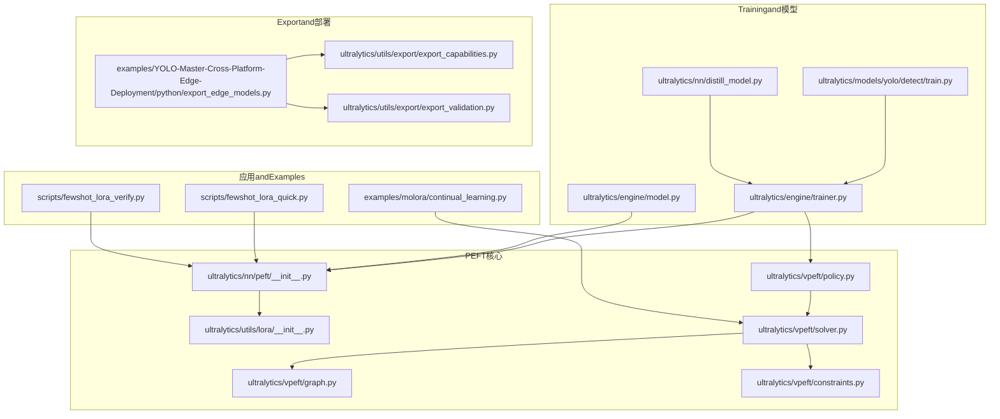
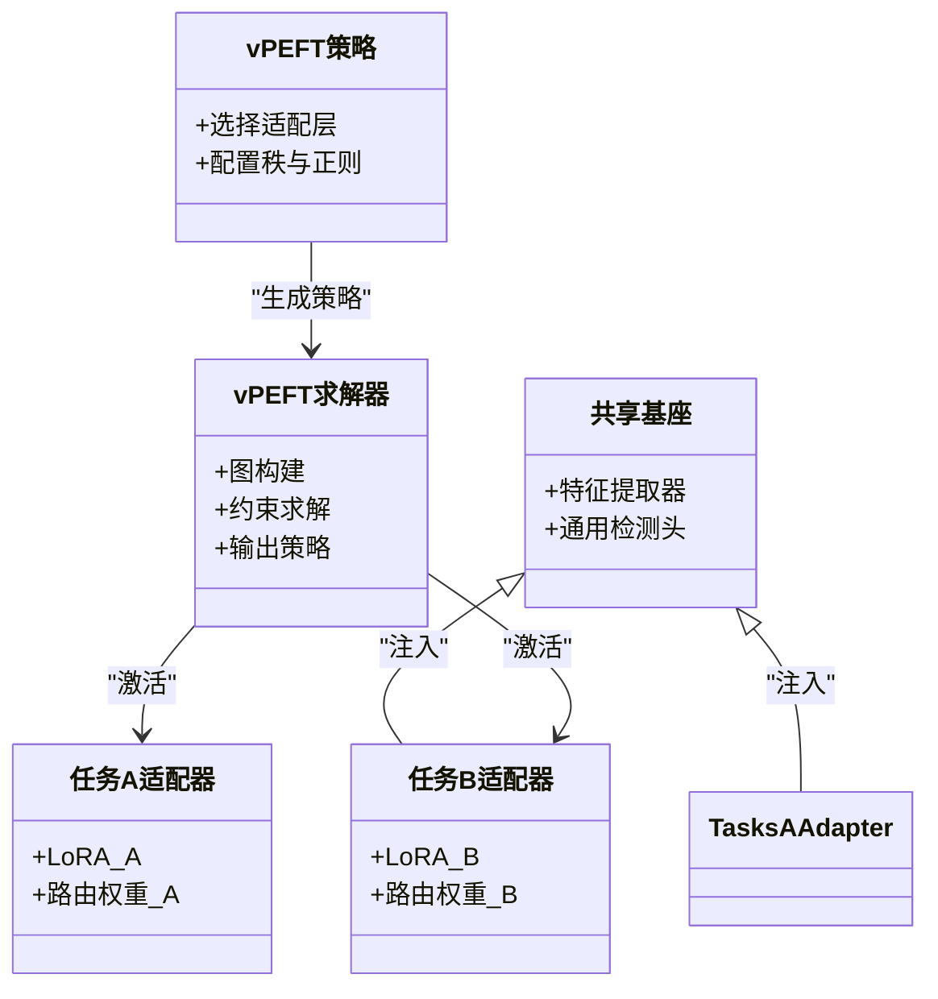
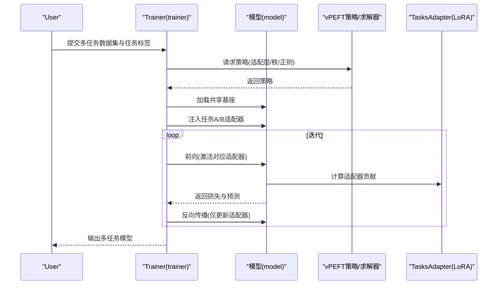
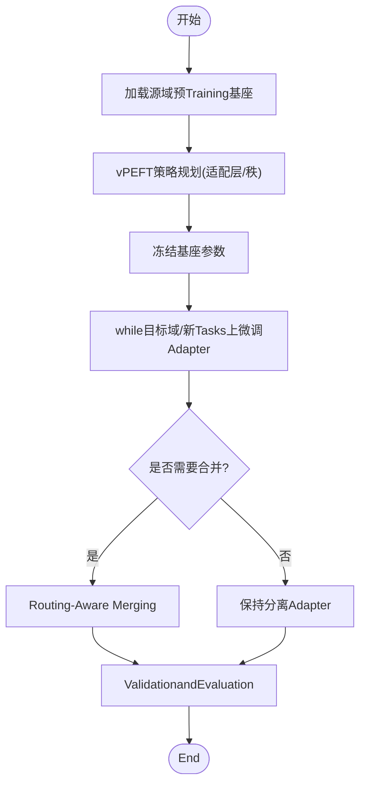
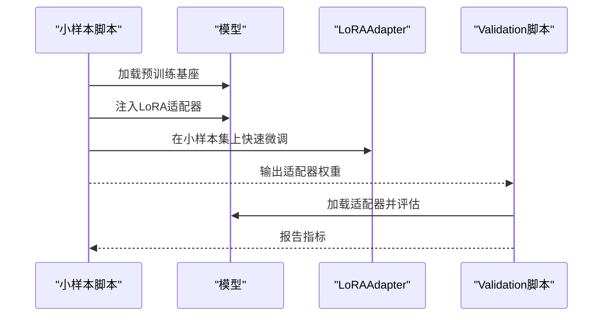
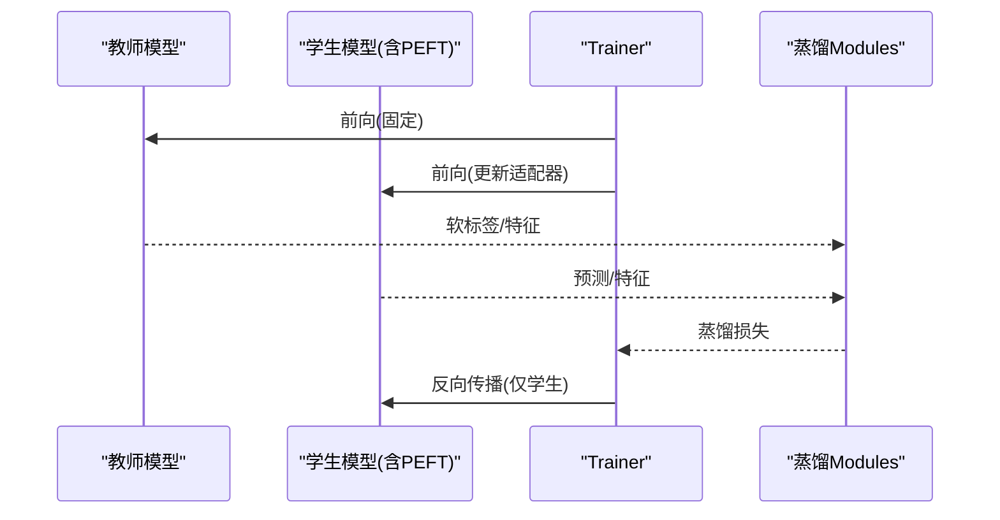
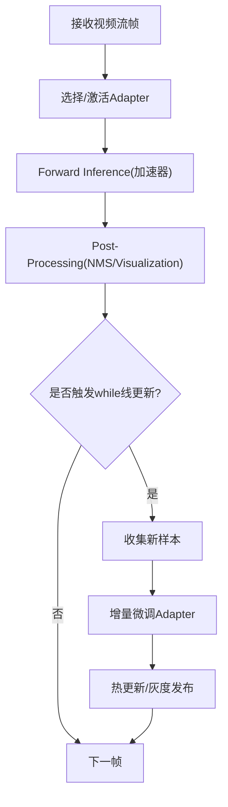
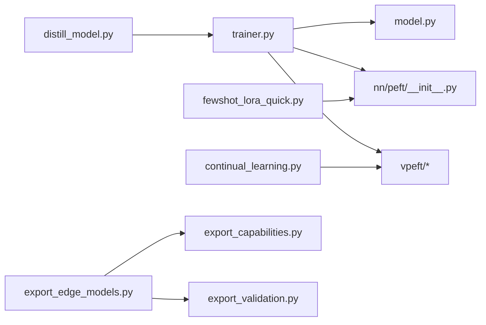

# Advanced Application Scenarios

<cite>
**Files Referenced in This Document**
- [ultralytics/nn/peft/__init__.py](file://ultralytics/nn/peft/__init__.py)
- [ultralytics/utils/lora/__init__.py](file://ultralytics/utils/lora/__init__.py)
- [ultralytics/vpeft/__init__.py](file://ultralytics/vpeft/__init__.py)
- [ultralytics/vpeft/policy.py](file://ultralytics/vpeft/policy.py)
- [ultralytics/vpeft/solver.py](file://ultralytics/vpeft/solver.py)
- [ultralytics/vpeft/graph.py](file://ultralytics/vpeft/graph.py)
- [ultralytics/vpeft/constraints.py](file://ultralytics/vpeft/constraints.py)
- [examples/molora/continual_learning.py](file://examples/molora/continual_learning.py)
- [scripts/fewshot_lora_quick.py](file://scripts/fewshot_lora_quick.py)
- [scripts/fewshot_lora_verify.py](file://scripts/fewshot_lora_verify.py)
- [ultralytics/engine/trainer.py](file://ultralytics/engine/trainer.py)
- [ultralytics/engine/model.py](file://ultralytics/engine/model.py)
- [ultralytics/models/yolo/detect/train.py](file://ultralytics/models/yolo/detect/train.py)
- [ultralytics/nn/distill_model.py](file://ultralytics/nn/distill_model.py)
- [examples/YOLO-Master-Cross-Platform-Edge-Deployment/python/export_edge_models.py](file://examples/YOLO-Master-Cross-Platform-Edge-Deployment/python/export_edge_models.py)
- [ultralytics/utils/export/export_capabilities.py](file://ultralytics/utils/export/export_capabilities.py)
- [ultralytics/utils/export/export_validation.py](file://ultralytics/utils/export/export_validation.py)
- [tests/test_molora.py](file://tests/test_molora.py)
- [tests/test_peft_adapters.py](file://tests/test_peft_adapters.py)
- [tests/test_vpeft.py](file://tests/test_vpeft.py)
- [tests/test_molora_merge_semantics.py](file://tests/test_molora_merge_semantics.py)
- [tests/test_molora_routing_aware_merge.py](file://tests/test_molora_routing_aware_merge.py)
- [tests/test_molora_sparse_dispatch.py](file://tests/test_molora_sparse_dispatch.py)
- [tests/test_molora_dtype.py](file://tests/test_molora_dtype.py)
- [tests/test_molora_supplementary.py](file://tests/test_molora_supplementary.py)
</cite>

## Table of Contents
1. [Introduction](#Introduction)
2. [Project Structure](#Project Structure)
3. [Core Components](#Core Components)
4. [Architecture Overview](#Architecture Overview)
5. [Detailed Component Analysis](#Detailed Component Analysis)
6. [Dependency Analysis](#Dependency Analysis)
7. [性能考量](#性能考量)
8. [Troubleshooting Guide](#Troubleshooting Guide)
9. [Conclusion](#Conclusion)
10. [Appendix](#Appendix)

## Introduction
本文件targetingYOLO-Master的PEFT（Parameter-Efficient Fine-Tuning）技术，聚焦Advanced Application Scenariosand工程化落地。内容覆盖：
- 多Tasks学习：共享基座+Tasks特定Adapter的设计模式andTraining策略
- 领域适应andMigration学习：跨域数据适配、增量学习and灾难性遗忘预防
- Few-shotand零样本检测：小样本快速适配and开放词汇capabilitiesCombining
- Knowledge Distillation：教师-学生架构下的轻量级适配
- 集成学习：多Adapter/路由的融合and部署
- 实时and流式处理：低延迟Inferenceandwhile线更新
- 隐私保护and联邦学习：安全协作and模型聚合

## Project Structure
围绕PEFT的核心代码分布whileCentered on下Modules：
- PEFT基础andLoRA工具：ultralytics/nn/peft、ultralytics/utils/lora
- 视觉PEFT规划and求解：ultralytics/vpeft（策略、求解器、图and约束）
- 持续学习andMolaraExamples：examples/molora/continual_learning.py
- 小样本脚本：scripts/fewshot_lora_quick.py、scripts/fewshot_lora_verify.py
- Trainingand模型入口：ultralytics/engine/trainer.py、ultralytics/engine/model.py、ultralytics/models/yolo/detect/train.py
- Knowledge Distillation：ultralytics/nn/distill_model.py
- ExportandEdge Deployment：export_edge_models.py、export_capabilities.py、export_validation.py
- Test Suite：tests下andmolora、vpeft、peftAdapter相关的用例

Figure Source
- [ultralytics/nn/peft/__init__.py](file://ultralytics/nn/peft/__init__.py)
- [ultralytics/utils/lora/__init__.py](file://ultralytics/utils/lora/__init__.py)
- [ultralytics/vpeft/policy.py](file://ultralytics/vpeft/policy.py)
- [ultralytics/vpeft/solver.py](file://ultralytics/vpeft/solver.py)
- [ultralytics/vpeft/graph.py](file://ultralytics/vpeft/graph.py)
- [ultralytics/vpeft/constraints.py](file://ultralytics/vpeft/constraints.py)
- [examples/molora/continual_learning.py](file://examples/molora/continual_learning.py)
- [scripts/fewshot_lora_quick.py](file://scripts/fewshot_lora_quick.py)
- [scripts/fewshot_lora_verify.py](file://scripts/fewshot_lora_verify.py)
- [ultralytics/engine/trainer.py](file://ultralytics/engine/trainer.py)
- [ultralytics/engine/model.py](file://ultralytics/engine/model.py)
- [ultralytics/models/yolo/detect/train.py](file://ultralytics/models/yolo/detect/train.py)
- [ultralytics/nn/distill_model.py](file://ultralytics/nn/distill_model.py)
- [examples/YOLO-Master-Cross-Platform-Edge-Deployment/python/export_edge_models.py](file://examples/YOLO-Master-Cross-Platform-Edge-Deployment/python/export_edge_models.py)
- [ultralytics/utils/export/export_capabilities.py](file://ultralytics/utils/export/export_capabilities.py)
- [ultralytics/utils/export/export_validation.py](file://ultralytics/utils/export/export_validation.py)

Section Source
- [ultralytics/nn/peft/__init__.py](file://ultralytics/nn/peft/__init__.py)
- [ultralytics/utils/lora/__init__.py](file://ultralytics/utils/lora/__init__.py)
- [ultralytics/vpeft/policy.py](file://ultralytics/vpeft/policy.py)
- [ultralytics/vpeft/solver.py](file://ultralytics/vpeft/solver.py)
- [ultralytics/vpeft/graph.py](file://ultralytics/vpeft/graph.py)
- [ultralytics/vpeft/constraints.py](file://ultralytics/vpeft/constraints.py)
- [examples/molora/continual_learning.py](file://examples/molora/continual_learning.py)
- [scripts/fewshot_lora_quick.py](file://scripts/fewshot_lora_quick.py)
- [scripts/fewshot_lora_verify.py](file://scripts/fewshot_lora_verify.py)
- [ultralytics/engine/trainer.py](file://ultralytics/engine/trainer.py)
- [ultralytics/engine/model.py](file://ultralytics/engine/model.py)
- [ultralytics/models/yolo/detect/train.py](file://ultralytics/models/yolo/detect/train.py)
- [ultralytics/nn/distill_model.py](file://ultralytics/nn/distill_model.py)
- [examples/YOLO-Master-Cross-Platform-Edge-Deployment/python/export_edge_models.py](file://examples/YOLO-Master-Cross-Platform-Edge-Deployment/python/export_edge_models.py)
- [ultralytics/utils/export/export_capabilities.py](file://ultralytics/utils/export/export_capabilities.py)
- [ultralytics/utils/export/export_validation.py](file://ultralytics/utils/export/export_validation.py)

## Core Components
- PEFTandLoRAEncapsulates：provides可插拔的Adapter注册、权重注入and合并接口，便于while多Tasks场景下on-demand activation不同TasksAdapter。
- vPEFT规划and求解：基于图and约束的策略生成and求解，自动选择适配层、秩and正则项，兼顾精度and参数量。
- 持续学习（Molara）：Supporting增量Tasks序列、Routing-Aware MergingandSparse Scheduling，缓解灾难性遗忘。
- 小样本适配：快速LoRA微调andValidation流程，适合few-shotandopen-vocabulary扩展。
- 蒸馏andExport：While maintaining轻量化提升泛化；Export时保留Adapter或进行Routing-Aware Merging。

Section Source
- [ultralytics/nn/peft/__init__.py](file://ultralytics/nn/peft/__init__.py)
- [ultralytics/utils/lora/__init__.py](file://ultralytics/utils/lora/__init__.py)
- [ultralytics/vpeft/policy.py](file://ultralytics/vpeft/policy.py)
- [ultralytics/vpeft/solver.py](file://ultralytics/vpeft/solver.py)
- [ultralytics/vpeft/graph.py](file://ultralytics/vpeft/graph.py)
- [ultralytics/vpeft/constraints.py](file://ultralytics/vpeft/constraints.py)
- [examples/molora/continual_learning.py](file://examples/molora/continual_learning.py)
- [scripts/fewshot_lora_quick.py](file://scripts/fewshot_lora_quick.py)
- [scripts/fewshot_lora_verify.py](file://scripts/fewshot_lora_verify.py)

## Architecture Overview
下图展示“共享基座 + Tasks特定Adapter”的多Tasks架构，Centered onandvPEFTsuch as何for每个Tasks生成并求解适配策略。

Figure Source
- [ultralytics/vpeft/policy.py](file://ultralytics/vpeft/policy.py)
- [ultralytics/vpeft/solver.py](file://ultralytics/vpeft/solver.py)
- [ultralytics/vpeft/graph.py](file://ultralytics/vpeft/graph.py)
- [ultralytics/vpeft/constraints.py](file://ultralytics/vpeft/constraints.py)
- [ultralytics/nn/peft/__init__.py](file://ultralytics/nn/peft/__init__.py)

## Detailed Component Analysis

### 多Tasks学习：共享基座andTasks特定Adapter
- 设计要点
  - 共享基座负责通用特征表示and主干Inference，降低重复计算。
  - 每个Tasks拥有独立Adapter（such asLoRA），Via路由或门控机制动态激活，避免全量微调带来的冲突。
  - vPEFT根据Tasks需求选择适配位置and秩，控制参数量and性能权衡。
- Training流程
  - 冻结基座，仅Optimization各TasksAdapter权重。
  - UsesTasks特定的Loss FunctionandData Loading器，Supporting交替或多Tasks联合Training。
- Inference路径
  - 按输入Tasks标签或上下文选择对应Adapter，或将多个AdapterCentered on路由方式组合。

Figure Source
- [ultralytics/engine/trainer.py](file://ultralytics/engine/trainer.py)
- [ultralytics/engine/model.py](file://ultralytics/engine/model.py)
- [ultralytics/vpeft/policy.py](file://ultralytics/vpeft/policy.py)
- [ultralytics/vpeft/solver.py](file://ultralytics/vpeft/solver.py)
- [ultralytics/nn/peft/__init__.py](file://ultralytics/nn/peft/__init__.py)

Section Source
- [ultralytics/engine/trainer.py](file://ultralytics/engine/trainer.py)
- [ultralytics/engine/model.py](file://ultralytics/engine/model.py)
- [ultralytics/vpeft/policy.py](file://ultralytics/vpeft/policy.py)
- [ultralytics/vpeft/solver.py](file://ultralytics/vpeft/solver.py)
- [ultralytics/nn/peft/__init__.py](file://ultralytics/nn/peft/__init__.py)

### 领域适应andMigration学习：跨域适配and增量学习
- 跨域适配
  - while源域预Training基础上，冻结基座，仅while目标域上微调少量Adapter，implementing低成本Migration。
  - 利用vPEFTwhile不同域间选择差异化的适配层，提高域内表现同时减少域间干扰。
- 增量学习（Molara）
  - 按Tasks序列逐步引入新Adapter，采用Routing-Aware MergingandSparse Scheduling，抑制旧Tasks退化。
  - Via约束and正则防止参数漂移过大，维持稳定性。

Figure Source
- [examples/molora/continual_learning.py](file://examples/molora/continual_learning.py)
- [ultralytics/vpeft/solver.py](file://ultralytics/vpeft/solver.py)
- [ultralytics/vpeft/constraints.py](file://ultralytics/vpeft/constraints.py)

Section Source
- [examples/molora/continual_learning.py](file://examples/molora/continual_learning.py)
- [ultralytics/vpeft/solver.py](file://ultralytics/vpeft/solver.py)
- [ultralytics/vpeft/constraints.py](file://ultralytics/vpeft/constraints.py)

### 灾难性遗忘预防策略
- 正则and约束
  - 对关键参数施加L2或弹性权重巩固(EWC)类正则，限制重要参数变化幅度。
  - UsesvPEFT约束Modules控制新增参数的规模and分布。
- 回放and缓冲
  - 维护少量历史样本缓冲区，while新TasksTraining中Mixture回放，稳定旧Tasks性能。
- 路由and稀疏
  - Via路由将不同Tasks的Gradient分散to不同专家/Adapter，降低耦合and干扰。
- 合并策略
  - 采用路由感知的合并方法，while保留关键信息减少冗余。

Section Source
- [ultralytics/vpeft/constraints.py](file://ultralytics/vpeft/constraints.py)
- [tests/test_molora_merge_semantics.py](file://tests/test_molora_merge_semantics.py)
- [tests/test_molora_routing_aware_merge.py](file://tests/test_molora_routing_aware_merge.py)

### Few-shotand零样本检测
- 小样本学习
  - Usesfew-shot脚本快速初始化LoRA，并while极少量标注数据上进行微调。
  - Combining开放词汇分类器（such as文本编码器）进行类别对齐，提升零样本capabilities。
- Validation流程
  - providesValidation脚本用于快速检查小样本适配效果and收敛情况。

Figure Source
- [scripts/fewshot_lora_quick.py](file://scripts/fewshot_lora_quick.py)
- [scripts/fewshot_lora_verify.py](file://scripts/fewshot_lora_verify.py)
- [ultralytics/nn/peft/__init__.py](file://ultralytics/nn/peft/__init__.py)

Section Source
- [scripts/fewshot_lora_quick.py](file://scripts/fewshot_lora_quick.py)
- [scripts/fewshot_lora_verify.py](file://scripts/fewshot_lora_verify.py)
- [ultralytics/nn/peft/__init__.py](file://ultralytics/nn/peft/__init__.py)

### Knowledge Distillation：教师-学生架构
- 架构
  - 教师模型：较大或更通用的检测模型，provides软标签and中间特征。
  - 学生模型：轻量化基座+PEFTAdapter，学习教师的知识and行for。
- Training
  - while蒸馏损失andTasks损失之间加权，确保学生既拟合真实标签又模仿教师。
  - 冻结教师，仅更新学生and其Adapter，降低Training成本。
- Export
  - Export时可移除教师，仅保留学生andAdapter，便于部署。

Figure Source
- [ultralytics/nn/distill_model.py](file://ultralytics/nn/distill_model.py)
- [ultralytics/engine/trainer.py](file://ultralytics/engine/trainer.py)
- [ultralytics/models/yolo/detect/train.py](file://ultralytics/models/yolo/detect/train.py)

Section Source
- [ultralytics/nn/distill_model.py](file://ultralytics/nn/distill_model.py)
- [ultralytics/engine/trainer.py](file://ultralytics/engine/trainer.py)
- [ultralytics/models/yolo/detect/train.py](file://ultralytics/models/yolo/detect/train.py)

### 集成学习andEnsemble方法
- 多Adapter融合
  - 针对多个Tasks或域分别TrainingAdapter，whileInference时按场景或置信度加权融合。
- 路由and门控
  - Uses轻量路由网络决定激活哪些Adapter，或while边界区域平滑切换。
- 合并and稀疏
  - 采用Routing-Aware MergingandSparse Scheduling，减少冗余并保持性能。

Section Source
- [examples/molora/continual_learning.py](file://examples/molora/continual_learning.py)
- [tests/test_molora_sparse_dispatch.py](file://tests/test_molora_sparse_dispatch.py)
- [tests/test_molora_routing_aware_merge.py](file://tests/test_molora_routing_aware_merge.py)

### 实时系统and流式Data processing
- 低延迟Inference
  - 冻结基座，仅加载必要Adapter，减少内存占用and计算开销。
  - UsesONNX/TensorRTetc.后端加速，Combined with批量and缓存策略。
- while线更新
  - while流式场景中，周期性收集新数据，增量微调Adapter，保持模型时效性。
- Exportand部署
  - UsesExport脚本andcapabilities矩阵校验，确保Adapterwhile目标平台正确运行。

Section Source
- [examples/YOLO-Master-Cross-Platform-Edge-Deployment/python/export_edge_models.py](file://examples/YOLO-Master-Cross-Platform-Edge-Deployment/python/export_edge_models.py)
- [ultralytics/utils/export/export_capabilities.py](file://ultralytics/utils/export/export_capabilities.py)
- [ultralytics/utils/export/export_validation.py](file://ultralytics/utils/export/export_validation.py)

### 隐私保护and联邦学习集成
- 本地微调
  - while各客户端仅更新Adapter权重，不上传原始数据，保护隐私。
- 安全聚合
  - 对Adapter权重进行差分隐私噪声注入或加密传输，再进行中心聚合。
- 版本and回滚
  - for每个客户端维护Adapter版本，Supporting回滚and一致性校验。

Section Source
- [ultralytics/nn/peft/__init__.py](file://ultralytics/nn/peft/__init__.py)
- [ultralytics/vpeft/solver.py](file://ultralytics/vpeft/solver.py)

## Dependency Analysis
- Modules耦合
  - trainerandmodel作forTrainingand模型入口，依赖PEFTandvPEFT进行策略生成and权重注入。
  - continual_learningandfewshot脚本CallsPEFTandvPEFT完成具体场景TrainingandValidation。
  - distill_modelandtrainer协同implementing蒸馏Training。
  - export相关Modules确保AdapterwhileExportand部署阶段的一致性。
- External Dependencies
  - Exportand部署依赖目标平台后端（such asONNX/TensorRT），需Viacapabilities矩阵andValidation脚本确认兼容性。

Figure Source
- [ultralytics/engine/trainer.py](file://ultralytics/engine/trainer.py)
- [ultralytics/engine/model.py](file://ultralytics/engine/model.py)
- [ultralytics/nn/peft/__init__.py](file://ultralytics/nn/peft/__init__.py)
- [ultralytics/vpeft/policy.py](file://ultralytics/vpeft/policy.py)
- [ultralytics/vpeft/solver.py](file://ultralytics/vpeft/solver.py)
- [ultralytics/nn/distill_model.py](file://ultralytics/nn/distill_model.py)
- [examples/molora/continual_learning.py](file://examples/molora/continual_learning.py)
- [scripts/fewshot_lora_quick.py](file://scripts/fewshot_lora_quick.py)
- [examples/YOLO-Master-Cross-Platform-Edge-Deployment/python/export_edge_models.py](file://examples/YOLO-Master-Cross-Platform-Edge-Deployment/python/export_edge_models.py)
- [ultralytics/utils/export/export_capabilities.py](file://ultralytics/utils/export/export_capabilities.py)
- [ultralytics/utils/export/export_validation.py](file://ultralytics/utils/export/export_validation.py)

Section Source
- [ultralytics/engine/trainer.py](file://ultralytics/engine/trainer.py)
- [ultralytics/engine/model.py](file://ultralytics/engine/model.py)
- [ultralytics/nn/peft/__init__.py](file://ultralytics/nn/peft/__init__.py)
- [ultralytics/vpeft/policy.py](file://ultralytics/vpeft/policy.py)
- [ultralytics/vpeft/solver.py](file://ultralytics/vpeft/solver.py)
- [ultralytics/nn/distill_model.py](file://ultralytics/nn/distill_model.py)
- [examples/molora/continual_learning.py](file://examples/molora/continual_learning.py)
- [scripts/fewshot_lora_quick.py](file://scripts/fewshot_lora_quick.py)
- [examples/YOLO-Master-Cross-Platform-Edge-Deployment/python/export_edge_models.py](file://examples/YOLO-Master-Cross-Platform-Edge-Deployment/python/export_edge_models.py)
- [ultralytics/utils/export/export_capabilities.py](file://ultralytics/utils/export/export_capabilities.py)
- [ultralytics/utils/export/export_validation.py](file://ultralytics/utils/export/export_validation.py)

## 性能考量
- 参数量and显存
  - 冻结基座、仅微调Adapter显著降低显存and存储开销。
  - Set appropriatelyLoRA秩and正则强度，平衡精度and效率。
- 计算and吞吐
  - Uses路由andSparse Scheduling减少不必要的计算路径。
  - Export至目标后端并进行预热and批处理Optimization，提升吞吐。
- 稳定性
  - while增量学习中采用回放and约束，避免数值不稳定and发散。

[本节for通用指导，无需列出具体文件来源]

## Troubleshooting Guide
- Adapter未生效
  - 检查策略生成and注入流程是否正确，确认目标层匹配and权重形状一致。
- 灾难性遗忘严重
  - 调整正则强度、增加回放比例、启用Routing-Aware Merging。
- Export Failure或不兼容
  - UsesExportcapabilities矩阵andValidation脚本定位问题，必要时降级或替换后端。
- 小样本过拟合
  - 降低Learning Rate、增强Data Augmentation、增大正则或减少秩。

Section Source
- [tests/test_peft_adapters.py](file://tests/test_peft_adapters.py)
- [tests/test_vpeft.py](file://tests/test_vpeft.py)
- [tests/test_molora.py](file://tests/test_molora.py)
- [tests/test_molora_dtype.py](file://tests/test_molora_dtype.py)
- [tests/test_molora_supplementary.py](file://tests/test_molora_supplementary.py)

## Conclusion
YOLO-Master的PEFT体系Via“共享基座+Tasks特定Adapter”的设计，CombiningvPEFT的策略and求解、Molara的持续学习、蒸馏andExport工具链，覆盖了从多Tasks、领域适应、few-shotto实时and联邦学习的广泛场景。while实际工程中，建议优先冻结基座、精细化选择适配层and秩，辅Centered on蒸馏andExportOptimization，Centered on获得高可用、低成本的解决方案。

[本节for总结性内容，无需列出具体文件来源]

## Appendix
- Refer to用例and脚本
  - 持续学习：examples/molora/continual_learning.py
  - 小样本快速微调andValidation：scripts/fewshot_lora_quick.py、scripts/fewshot_lora_verify.py
  - ExportandEdge Deployment：examples/YOLO-Master-Cross-Platform-Edge-Deployment/python/export_edge_models.py
- 测试and回归
  - AdapterandvPEFT：tests/test_peft_adapters.py、tests/test_vpeft.py
  - Molara系列：tests/test_molora*.py

[本节for索引性内容，无需列出具体文件来源]