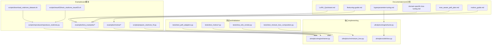
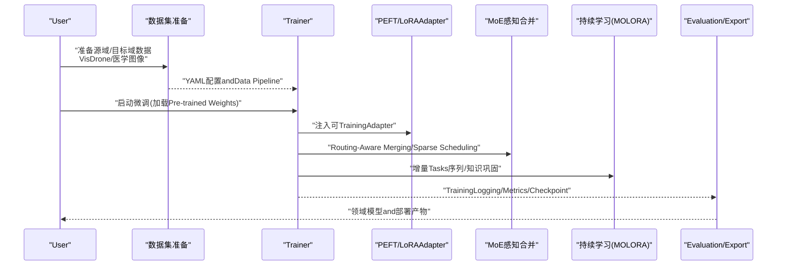
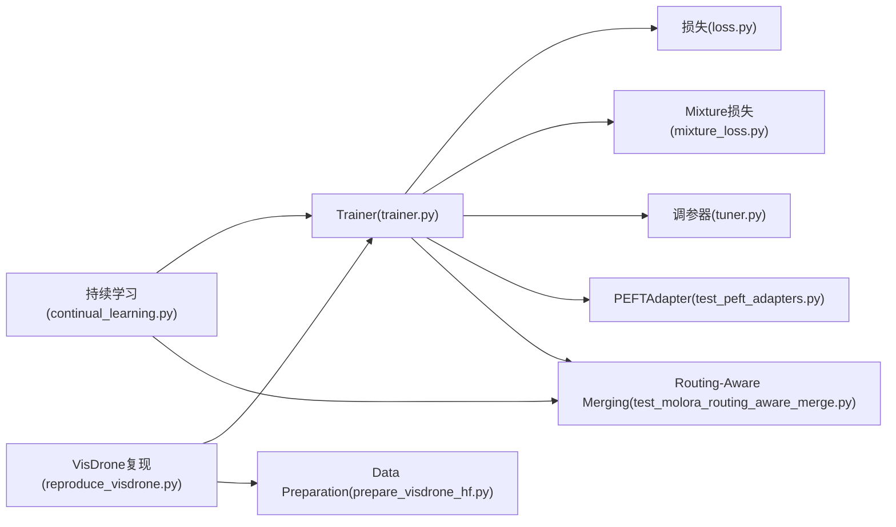

# 领域适应andMigration学习

<cite>
**Files Referenced in This Document**
- [README.md](file://README.md)
- [LoRA_Quickstart.md](file://docs/LoRA_Quickstart.md)
- [finetuning-guide.md](file://docs/en/guides/finetuning-guide.md)
- [hyperparameter-tuning.md](file://docs/en/guides/hyperparameter-tuning.md)
- [yolo_master_lora_README.md](file://examples/lora_examples/yolo_master_lora_README.md)
- [run_yolo_master_lora_rank_sweep.py](file://examples/lora_examples/run_yolo_master_lora_rank_sweep.py)
- [continual_learning.py](file://examples/molora/continual_learning.py)
- [basic_finetune.py](file://examples/molora/basic_finetune.py)
- [compare_lora_molora.py](file://examples/molora/compare_lora_molora.py)
- [reproduce_visdrone.py](file://scripts/reproduce/reproduce_visdrone.py)
- [prepare_visdrone_hf.py](file://scripts/prepare_visdrone_hf.py)
- [download_visdrone_dataset.sh](file://scripts/download_visdrone_dataset.sh)
- [train_visdrone_issue53.sh](file://scripts/issue53/train_visdrone_issue53.sh)
- [probe_visdrone_batch.py](file://scripts/issue53/probe_visdrone_batch.py)
- [molora_guide.md](file://docs/molora_guide.md)
- [domain-specific-lora-tuning.md](file://docs/plans/domain-specific-lora-tuning.md)
- [moe_aware_peft_plan.md](file://docs/plans/moe_aware_peft_plan.md)
- [peft_adapters.py](file://tests/test_peft_adapters.py)
- [test_molora.py](file://tests/test_molora.py)
- [test_molora_merge_semantics.py](file://tests/test_molora_merge_semantics.py)
- [test_molora_routing_aware_merge.py](file://tests/test_molora_routing_aware_merge.py)
- [test_molora_sparse_dispatch.py](file://tests/test_molora_sparse_dispatch.py)
- [test_molora_supplementary.py](file://tests/test_molora_supplementary.py)
- [test_molora_dtype.py](file://tests/test_molora_dtype.py)
- [lora_e2e_smoke.py](file://tests/lora_e2e_smoke.py)
- [lora_rankless_smoke.py](file://tests/lora_rankless_smoke.py)
- [test_mixture_loss_composition.py](file://tests/test_mixture_loss_composition.py)
- [mixture_loss.py](file://ultralytics/nn/mixture_loss.py)
- [trainer.py](file://ultralytics/engine/trainer.py)
- [tuner.py](file://ultralytics/engine/tuner.py)
- [loss.py](file://ultralytics/utils/loss.py)
- [tuner.py](file://ultralytics/utils/tuner.py)
</cite>

## Table of Contents
1. [Introduction](#Introduction)
2. [Project Structure](#Project Structure)
3. [Core Components](#Core Components)
4. [Architecture Overview](#Architecture Overview)
5. [Detailed Component Analysis](#Detailed Component Analysis)
6. [Dependency Analysis](#Dependency Analysis)
7. [Performance Considerations](#Performance Considerations)
8. [Troubleshooting Guide](#Troubleshooting Guide)
9. [Conclusion](#Conclusion)
10. [Appendix](#Appendix)

## Introduction
本文件targeting希望whileYOLO-Master中开展领域适应andMigration学习的EngineersandResearchers，系统阐述跨域数据适配、特征对齐、增量学习and灾难性遗忘预防、预Training模型微调策略and超参数调优方法，并provides医学图像检测and无人机Object Detectionetc.具体领域的实践案例。Documentation同时给出从通用模型to特定领域模型的完整Migration流程指引，并汇总相关Loss Function设计and正则化技术要点。

## Project Structure
围绕“领域适应andMigration学习”，仓库中andPEFT（含LoRA）、MoE感知微调、持续学习（MOLORA）Centered onandTasks复现脚本密切相关的内容分布such as下：
- Documentationand计划
  - LoRA快速入门and指南
  - 超参搜索and微调指南
  - 领域特定LoRA微调计划andMoE感知PEFT计划
- Examplesand脚本
  - LoRAExamplesand秩扫描脚本
  - MOLORA持续学习and对比脚本
  - VisDrone复现实验andData Preparation脚本
- 测试andValidation
  - PEFTAdapterandMOLORA系列测试
  - MixtureLoss combinationand端to端冒烟测试
- 核心implementing
  - Trainer、调参and损失Modules

Figure Source
- [LoRA_Quickstart.md:1-200](file://docs/LoRA_Quickstart.md#L1-L200)
- [finetuning-guide.md:1-200](file://docs/en/guides/finetuning-guide.md#L1-L200)
- [hyperparameter-tuning.md:1-200](file://docs/en/guides/hyperparameter-tuning.md#L1-L200)
- [domain-specific-lora-tuning.md:1-200](file://docs/plans/domain-specific-lora-tuning.md#L1-L200)
- [moe_aware_peft_plan.md:1-200](file://docs/plans/moe_aware_peft_plan.md#L1-L200)
- [molora_guide.md:1-200](file://docs/molora_guide.md#L1-L200)
- [run_yolo_master_lora_rank_sweep.py:1-200](file://examples/lora_examples/run_yolo_master_lora_rank_sweep.py#L1-L200)
- [continual_learning.py:1-200](file://examples/molora/continual_learning.py#L1-L200)
- [basic_finetune.py:1-200](file://examples/molora/basic_finetune.py#L1-L200)
- [compare_lora_molora.py:1-200](file://examples/molora/compare_lora_molora.py#L1-L200)
- [reproduce_visdrone.py:1-200](file://scripts/reproduce/reproduce_visdrone.py#L1-L200)
- [prepare_visdrone_hf.py:1-200](file://scripts/prepare_visdrone_hf.py#L1-L200)
- [download_visdrone_dataset.sh:1-200](file://scripts/download_visdrone_dataset.sh#L1-L200)
- [train_visdrone_issue53.sh:1-200](file://scripts/issue53/train_visdrone_issue53.sh#L1-L200)
- [test_peft_adapters.py:1-200](file://tests/test_peft_adapters.py#L1-L200)
- [test_molora.py:1-200](file://tests/test_molora.py#L1-L200)
- [test_molora_merge_semantics.py:1-200](file://tests/test_molora_merge_semantics.py#L1-L200)
- [test_molora_routing_aware_merge.py:1-200](file://tests/test_molora_routing_aware_merge.py#L1-L200)
- [test_molora_sparse_dispatch.py:1-200](file://tests/test_molora_sparse_dispatch.py#L1-L200)
- [test_molora_supplementary.py:1-200](file://tests/test_molora_supplementary.py#L1-L200)
- [test_molora_dtype.py:1-200](file://tests/test_molora_dtype.py#L1-L200)
- [lora_e2e_smoke.py:1-200](file://tests/lora_e2e_smoke.py#L1-L200)
- [test_mixture_loss_composition.py:1-200](file://tests/test_mixture_loss_composition.py#L1-L200)
- [trainer.py:1-200](file://ultralytics/engine/trainer.py#L1-L200)
- [tuner.py:1-200](file://ultralytics/engine/tuner.py#L1-L200)
- [loss.py:1-200](file://ultralytics/utils/loss.py#L1-L200)
- [mixture_loss.py:1-200](file://ultralytics/nn/mixture_loss.py#L1-L200)

Section Source
- [README.md:1-200](file://README.md#L1-L200)
- [LoRA_Quickstart.md:1-200](file://docs/LoRA_Quickstart.md#L1-L200)
- [finetuning-guide.md:1-200](file://docs/en/guides/finetuning-guide.md#L1-L200)
- [hyperparameter-tuning.md:1-200](file://docs/en/guides/hyperparameter-tuning.md#L1-L200)
- [domain-specific-lora-tuning.md:1-200](file://docs/plans/domain-specific-lora-tuning.md#L1-L200)
- [moe_aware_peft_plan.md:1-200](file://docs/plans/moe_aware_peft_plan.md#L1-L200)
- [molora_guide.md:1-200](file://docs/molora_guide.md#L1-L200)
- [examples/lora_examples/yolo_master_lora_README.md:1-200](file://examples/lora_examples/yolo_master_lora_README.md#L1-L200)
- [examples/molora/continual_learning.py:1-200](file://examples/molora/continual_learning.py#L1-L200)
- [scripts/reproduce/reproduce_visdrone.py:1-200](file://scripts/reproduce/reproduce_visdrone.py#L1-L200)
- [scripts/prepare_visdrone_hf.py:1-200](file://scripts/prepare_visdrone_hf.py#L1-L200)
- [scripts/download_visdrone_dataset.sh:1-200](file://scripts/download_visdrone_dataset.sh#L1-L200)
- [scripts/issue53/train_visdrone_issue53.sh:1-200](file://scripts/issue53/train_visdrone_issue53.sh#L1-L200)
- [tests/test_peft_adapters.py:1-200](file://tests/test_peft_adapters.py#L1-L200)
- [tests/test_molora.py:1-200](file://tests/test_molora.py#L1-L200)
- [tests/test_molora_merge_semantics.py:1-200](file://tests/test_molora_merge_semantics.py#L1-L200)
- [tests/test_molora_routing_aware_merge.py:1-200](file://tests/test_molora_routing_aware_merge.py#L1-L200)
- [tests/test_molora_sparse_dispatch.py:1-200](file://tests/test_molora_sparse_dispatch.py#L1-L200)
- [tests/test_molora_supplementary.py:1-200](file://tests/test_molora_supplementary.py#L1-L200)
- [tests/test_molora_dtype.py:1-200](file://tests/test_molora_dtype.py#L1-L200)
- [tests/lora_e2e_smoke.py:1-200](file://tests/lora_e2e_smoke.py#L1-L200)
- [tests/test_mixture_loss_composition.py:1-200](file://tests/test_mixture_loss_composition.py#L1-L200)
- [ultralytics/engine/trainer.py:1-200](file://ultralytics/engine/trainer.py#L1-L200)
- [ultralytics/engine/tuner.py:1-200](file://ultralytics/engine/tuner.py#L1-L200)
- [ultralytics/utils/loss.py:1-200](file://ultralytics/utils/loss.py#L1-L200)
- [ultralytics/nn/mixture_loss.py:1-200](file://ultralytics/nn/mixture_loss.py#L1-L200)

## Core Components
- Trainingand微调引擎
  - Trainer负责加载Pre-trained Weights、装配PEFT/MoE感知Adapter、执行Training循环andEvaluation。
  - 调参器provides自动化超参搜索capabilities，Supporting对LoRA秩、Learning Rate、Batch Sizeetc.进行网格或随机搜索。
- 损失and正则
  - 基础检测损失位于工具层；Mixture损失Modules用于多专家或多Tasks的加权组合andRouting-Aware Merging。
- PEFTandLoRA
  - ViaAdapter injection轻量可Training参数，冻结主干Centered on缓解灾难性遗忘，提升跨域泛化效率。
- 持续学习（MOLORA）
  - providesRouting-Aware MergingandSparse Scheduling机制，while增量Tasks间保持知识巩固and稳定更新。
- 领域案例脚本
  - VisDrone复现实验andData Preparation脚本覆盖数据下载、预处理、Trainingand问题定位。

Section Source
- [trainer.py:1-200](file://ultralytics/engine/trainer.py#L1-L200)
- [tuner.py:1-200](file://ultralytics/engine/tuner.py#L1-L200)
- [loss.py:1-200](file://ultralytics/utils/loss.py#L1-L200)
- [mixture_loss.py:1-200](file://ultralytics/nn/mixture_loss.py#L1-L200)
- [test_peft_adapters.py:1-200](file://tests/test_peft_adapters.py#L1-L200)
- [test_molora.py:1-200](file://tests/test_molora.py#L1-L200)
- [continual_learning.py:1-200](file://examples/molora/continual_learning.py#L1-L200)
- [reproduce_visdrone.py:1-200](file://scripts/reproduce/reproduce_visdrone.py#L1-L200)

## Architecture Overview
下图展示从通用预Training模型to领域模型的Migration路径，包括Data Preparation、PEFT/MoE感知适配、TrainingandEvaluation闭环，Centered onand持续学习阶段的知识巩固。

Figure Source
- [trainer.py:1-200](file://ultralytics/engine/trainer.py#L1-L200)
- [test_peft_adapters.py:1-200](file://tests/test_peft_adapters.py#L1-L200)
- [test_molora.py:1-200](file://tests/test_molora.py#L1-L200)
- [continual_learning.py:1-200](file://examples/molora/continual_learning.py#L1-L200)
- [reproduce_visdrone.py:1-200](file://scripts/reproduce/reproduce_visdrone.py#L1-L200)

## Detailed Component Analysis

### 跨域数据适配and特征对齐
- 原理and方法
  - UsesPre-trained Weights作for强先验，冻结主干网络，仅Training轻量AdapterCentered on降低源域-目标域分布差异带来的过拟合风险。
  - CombiningData Augmentationand归一化策略，缩小域内方差and域间偏移。
  - whileMoE场景下，采用Routing-Aware MergingandSparse Scheduling，使不同专家聚焦于特定子域，间接implementing特征层面的对齐。
- 关键implementing位置
  - Trainer装配Adapterand执行Training循环
  - MoE感知合并and路由逻辑
  - MixtureLoss combinationand权重分配
- 建议实践
  - 小步长Learning Rate+较长预热，避免破坏预Training表征
  - 针对目标域特性选择合适的Data Augmentation强度
  - 监控专家Uses分布and路由熵，确保Load Balancing

Section Source
- [trainer.py:1-200](file://ultralytics/engine/trainer.py#L1-L200)
- [moe_aware_peft_plan.md:1-200](file://docs/plans/moe_aware_peft_plan.md#L1-L200)
- [test_molora_routing_aware_merge.py:1-200](file://tests/test_molora_routing_aware_merge.py#L1-L200)
- [test_molora_sparse_dispatch.py:1-200](file://tests/test_molora_sparse_dispatch.py#L1-L200)
- [test_mixture_loss_composition.py:1-200](file://tests/test_mixture_loss_composition.py#L1-L200)
- [mixture_loss.py:1-200](file://ultralytics/nn/mixture_loss.py#L1-L200)

### 增量学习and灾难性遗忘预防
- 策略
  - 冻结主干，仅更新Adapter，保留源域知识
  - Routing-Aware Merging：while新旧Tasks之间平滑合并专家权重，减少冲突
  - Sparse Scheduling：限制每步激活的专家数量，降低干扰
  - Knowledge Distillation/回放（Optional）：利用历史样本或教师模型输出进行正则化
- 关键implementing位置
  - MOLORA持续学习脚本andTest Suite
  - 合并语义andRouting-Aware Merging测试
- 建议实践
  - for每个新Tasks维护独立Adapter集合
  - 控制Learning Rate衰减and早停策略，防止过度拟合当前Tasks
  - 定期while全量Tasks集上进行校验，Evaluation遗忘程度

Section Source
- [continual_learning.py:1-200](file://examples/molora/continual_learning.py#L1-L200)
- [test_molora.py:1-200](file://tests/test_molora.py#L1-L200)
- [test_molora_merge_semantics.py:1-200](file://tests/test_molora_merge_semantics.py#L1-L200)
- [test_molora_routing_aware_merge.py:1-200](file://tests/test_molora_routing_aware_merge.py#L1-L200)
- [test_molora_sparse_dispatch.py:1-200](file://tests/test_molora_sparse_dispatch.py#L1-L200)
- [test_molora_supplementary.py:1-200](file://tests/test_molora_supplementary.py#L1-L200)
- [test_molora_dtype.py:1-200](file://tests/test_molora_dtype.py#L1-L200)

### 预Training模型微调and超参调优
- 微调策略
  - 冻结主干，仅TrainingAdapter；逐步解冻部分高层ModulesCentered on提升适配capabilities
  - Uses较小Learning Rateand更长Training轮次，Combined with余弦退火或分段Learning Rate
- 超参调优
  - LoRA秩、缩放因子、Learning Rate、Batch Size、Data Augmentation强度
  - UsesBuilt-in调参器进行自动搜索，记录最佳配置
- 关键implementing位置
  - LoRA快速入门andExamples
  - 秩扫描脚本and结果汇总
  - 超参调优指南and调参器implementing

Section Source
- [LoRA_Quickstart.md:1-200](file://docs/LoRA_Quickstart.md#L1-L200)
- [yolo_master_lora_README.md:1-200](file://examples/lora_examples/yolo_master_lora_README.md#L1-L200)
- [run_yolo_master_lora_rank_sweep.py:1-200](file://examples/lora_examples/run_yolo_master_lora_rank_sweep.py#L1-L200)
- [hyperparameter-tuning.md:1-200](file://docs/en/guides/hyperparameter-tuning.md#L1-L200)
- [tuner.py:1-200](file://ultralytics/engine/tuner.py#L1-L200)

### 领域案例：无人机Object Detection（VisDrone）
- Data Preparation
  - 下载andHuggingFace格式转换脚本
  - YAML配置andData Pipeline构建
- Trainingand调试
  - 复现实验脚本andIssue53Training脚本
  - 批处理探针用于诊断数据and显存问题
- 建议实践
  - 针对航拍小目标增强尺度多样性and裁剪策略
  - Uses更小的锚框and更高的输入分辨率
  - 关注IoU阈值andNMS参数的域适配

Section Source
- [reproduce_visdrone.py:1-200](file://scripts/reproduce/reproduce_visdrone.py#L1-L200)
- [prepare_visdrone_hf.py:1-200](file://scripts/prepare_visdrone_hf.py#L1-L200)
- [download_visdrone_dataset.sh:1-200](file://scripts/download_visdrone_dataset.sh#L1-L200)
- [train_visdrone_issue53.sh:1-200](file://scripts/issue53/train_visdrone_issue53.sh#L1-L200)
- [probe_visdrone_batch.py:1-200](file://scripts/issue53/probe_visdrone_batch.py#L1-L200)

### 领域案例：医学图像检测
- 数据and标注
  - 将医学图像标注转换forYOLO格式，注意类别映射and边界框精度
- 微调策略
  - 冻结主干，仅TrainingAdapter；Uses较低Learning Rateand更强正则化
  - 针对病灶小目标调整正负样本比例and损失权重
- Evaluationand部署
  - Uses交叉Validationand外部Validation Set Evaluation泛化
  - Export至Inference后端并进行延迟and吞吐评测

Section Source
- [finetuning-guide.md:1-200](file://docs/en/guides/finetuning-guide.md#L1-L200)
- [domain-specific-lora-tuning.md:1-200](file://docs/plans/domain-specific-lora-tuning.md#L1-L200)
- [lora_e2e_smoke.py:1-200](file://tests/lora_e2e_smoke.py#L1-L200)
- [lora_rankless_smoke.py:1-200](file://tests/lora_rankless_smoke.py#L1-L200)

### 领域自适应的Loss Function设计and正则化
- 设计要点
  - 基础检测损失：分类、回归、置信度校准
  - Mixture损失：多Tasks/多专家加权组合，Routing-Aware Merging影响Gradient传播
  - 正则化：权重衰减、Dropout、标签平滑、Knowledge Distillation
- 关键implementing位置
  - 基础损失Modules
  - MixtureLoss combinationand测试
- 建议实践
  - 根据Tasks难度动态调整各分支权重
  - while持续学习中引入历史Tasks的正则项，抑制遗忘

Section Source
- [loss.py:1-200](file://ultralytics/utils/loss.py#L1-L200)
- [mixture_loss.py:1-200](file://ultralytics/nn/mixture_loss.py#L1-L200)
- [test_mixture_loss_composition.py:1-200](file://tests/test_mixture_loss_composition.py#L1-L200)

### 从通用模型to特定领域模型的Migration流程（代码Examples路径）
- 步骤概览
  - 准备数据andYAML配置
  - 加载Pre-trained Weights并装配LoRAAdapter
  - 启动Training并监控Metrics
  - Export模型并while目标域上Evaluation
- Refer toExamples路径
  - LoRA快速入门and说明
  - 秩扫描脚本and结果汇总
  - 持续学习and对比脚本
  - VisDrone复现实验andData Preparation脚本

Section Source
- [LoRA_Quickstart.md:1-200](file://docs/LoRA_Quickstart.md#L1-L200)
- [yolo_master_lora_README.md:1-200](file://examples/lora_examples/yolo_master_lora_README.md#L1-L200)
- [run_yolo_master_lora_rank_sweep.py:1-200](file://examples/lora_examples/run_yolo_master_lora_rank_sweep.py#L1-L200)
- [basic_finetune.py:1-200](file://examples/molora/basic_finetune.py#L1-L200)
- [compare_lora_molora.py:1-200](file://examples/molora/compare_lora_molora.py#L1-L200)
- [reproduce_visdrone.py:1-200](file://scripts/reproduce/reproduce_visdrone.py#L1-L200)
- [prepare_visdrone_hf.py:1-200](file://scripts/prepare_visdrone_hf.py#L1-L200)

## Dependency Analysis
- 组件耦合
  - Trainer依赖损失Modulesand调参器；PEFTAdapterandMoE感知合并由Trainer装配
  - 持续学习脚本CallsTrainerand合并逻辑，形成增量Training闭环
- External Dependencies
  - Data Preparation脚本依赖HuggingFace数据集and命令行工具
  - Test Suite覆盖Adapter、合并语义、路由感知andSparse Schedulingetc.关键路径

Figure Source
- [trainer.py:1-200](file://ultralytics/engine/trainer.py#L1-L200)
- [loss.py:1-200](file://ultralytics/utils/loss.py#L1-L200)
- [mixture_loss.py:1-200](file://ultralytics/nn/mixture_loss.py#L1-L200)
- [tuner.py:1-200](file://ultralytics/engine/tuner.py#L1-L200)
- [test_peft_adapters.py:1-200](file://tests/test_peft_adapters.py#L1-L200)
- [test_molora_routing_aware_merge.py:1-200](file://tests/test_molora_routing_aware_merge.py#L1-L200)
- [continual_learning.py:1-200](file://examples/molora/continual_learning.py#L1-L200)
- [reproduce_visdrone.py:1-200](file://scripts/reproduce/reproduce_visdrone.py#L1-L200)
- [prepare_visdrone_hf.py:1-200](file://scripts/prepare_visdrone_hf.py#L1-L200)

Section Source
- [trainer.py:1-200](file://ultralytics/engine/trainer.py#L1-L200)
- [loss.py:1-200](file://ultralytics/utils/loss.py#L1-L200)
- [mixture_loss.py:1-200](file://ultralytics/nn/mixture_loss.py#L1-L200)
- [tuner.py:1-200](file://ultralytics/engine/tuner.py#L1-L200)
- [test_peft_adapters.py:1-200](file://tests/test_peft_adapters.py#L1-L200)
- [test_molora_routing_aware_merge.py:1-200](file://tests/test_molora_routing_aware_merge.py#L1-L200)
- [continual_learning.py:1-200](file://examples/molora/continual_learning.py#L1-L200)
- [reproduce_visdrone.py:1-200](file://scripts/reproduce/reproduce_visdrone.py#L1-L200)
- [prepare_visdrone_hf.py:1-200](file://scripts/prepare_visdrone_hf.py#L1-L200)

## Performance Considerations
- 计算and内存
  - 冻结主干显著降低显存占用；LoRA秩越大显存and计算开销越高
  - Mixture损失andMoE路由会增加额外计算，需权衡精度and速度
- Training稳定性
  - Set appropriatelyLearning Rate预热and衰减，避免早期震荡
  - 监控Gradient范数andNaN，必要时启用数值稳定技巧
- 部署Optimization
  - Exporting to高效格式并进行量化and编译Optimization
  - 针对目标Device Selection合适的批大小and输入分辨率

[This section provides general guidance and does not directly analyze specific files]

## Troubleshooting Guide
- 常见问题
  - 数据格式错误：检查YAMLand标注一致性
  - 显存不足：减小Batch Size、输入分辨率或LoRA秩
  - Training不稳定：降低Learning Rate、增加预热、检查损失权重
  - 路由失衡：监控专家Uses分布，调整Sparse Schedulingand正则
- 诊断工具
  - 批处理探针用于定位数据and显存bottlenecks
  - Test Suite覆盖Adapter、合并语义and路由感知路径，便于快速回归Validation

Section Source
- [probe_visdrone_batch.py:1-200](file://scripts/issue53/probe_visdrone_batch.py#L1-L200)
- [test_peft_adapters.py:1-200](file://tests/test_peft_adapters.py#L1-L200)
- [test_molora_merge_semantics.py:1-200](file://tests/test_molora_merge_semantics.py#L1-L200)
- [test_molora_routing_aware_merge.py:1-200](file://tests/test_molora_routing_aware_merge.py#L1-L200)
- [test_molora_sparse_dispatch.py:1-200](file://tests/test_molora_sparse_dispatch.py#L1-L200)

## Conclusion
ViawhileYOLO-Master中集成PEFT/LoRA、MoE感知微调andMOLORA持续学习，可While maintaining预Training表征高效适配新域。Combining合理的损失设计and正则化、严格的超参搜索and稳健的Training工程实践，能够while医学图像检测and无人机Object Detectionetc.复杂场景中取得稳定且可部署的性能表现。

[This section is summary content and does not directly analyze specific files]

## Appendix
- 快速上手
  - LoRA快速入门andExamples说明
  - 秩扫描脚本and结果汇总
- 领域指南
  - 领域特定LoRA微调计划
  - MoE感知PEFT计划
  - MOLORA指南
- 复现实验
  - VisDrone复现andData Preparation脚本
  - Issue53Trainingand探针脚本

Section Source
- [LoRA_Quickstart.md:1-200](file://docs/LoRA_Quickstart.md#L1-L200)
- [yolo_master_lora_README.md:1-200](file://examples/lora_examples/yolo_master_lora_README.md#L1-L200)
- [run_yolo_master_lora_rank_sweep.py:1-200](file://examples/lora_examples/run_yolo_master_lora_rank_sweep.py#L1-L200)
- [domain-specific-lora-tuning.md:1-200](file://docs/plans/domain-specific-lora-tuning.md#L1-L200)
- [moe_aware_peft_plan.md:1-200](file://docs/plans/moe_aware_peft_plan.md#L1-L200)
- [molora_guide.md:1-200](file://docs/molora_guide.md#L1-L200)
- [reproduce_visdrone.py:1-200](file://scripts/reproduce/reproduce_visdrone.py#L1-L200)
- [prepare_visdrone_hf.py:1-200](file://scripts/prepare_visdrone_hf.py#L1-L200)
- [train_visdrone_issue53.sh:1-200](file://scripts/issue53/train_visdrone_issue53.sh#L1-L200)
- [probe_visdrone_batch.py:1-200](file://scripts/issue53/probe_visdrone_batch.py#L1-L200)