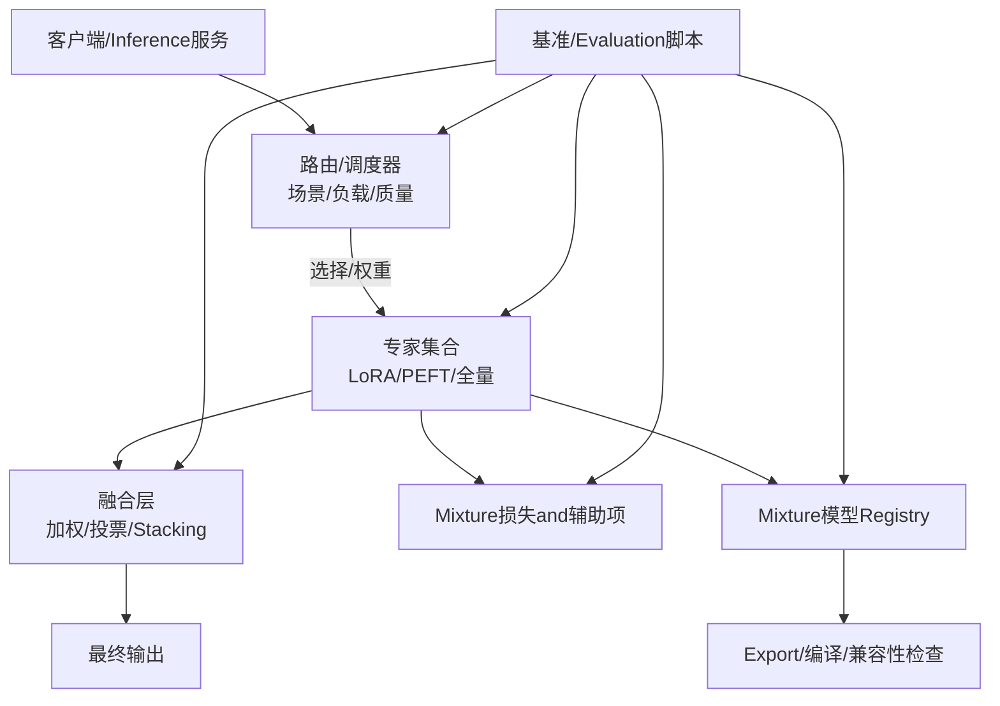
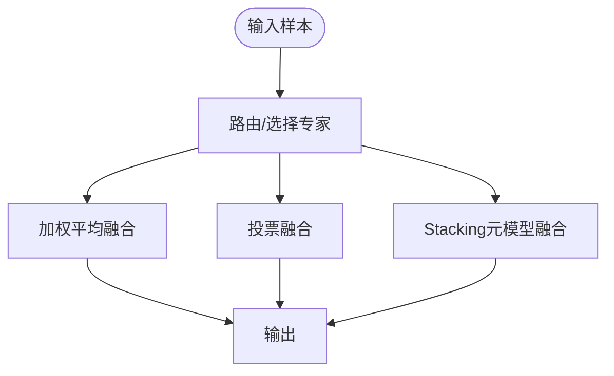
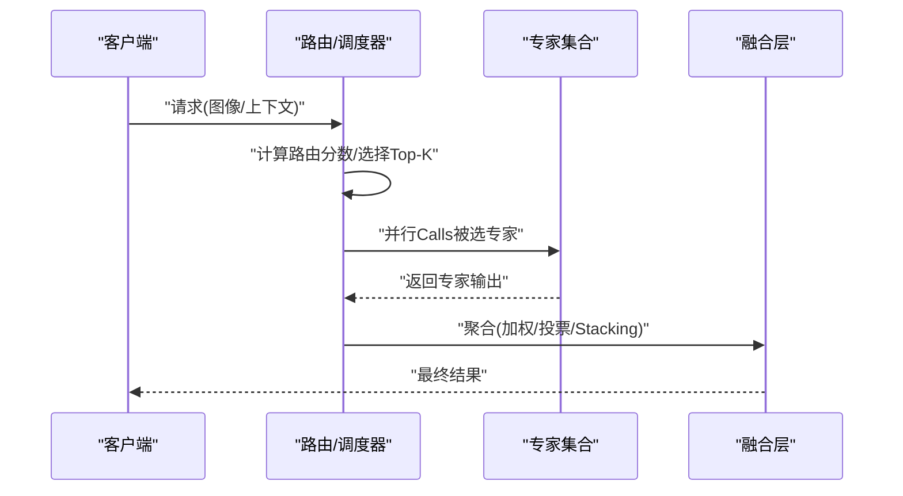
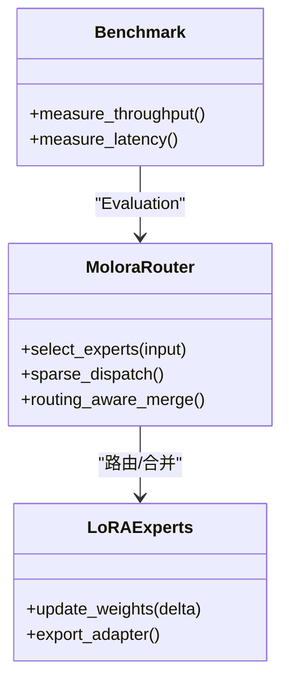
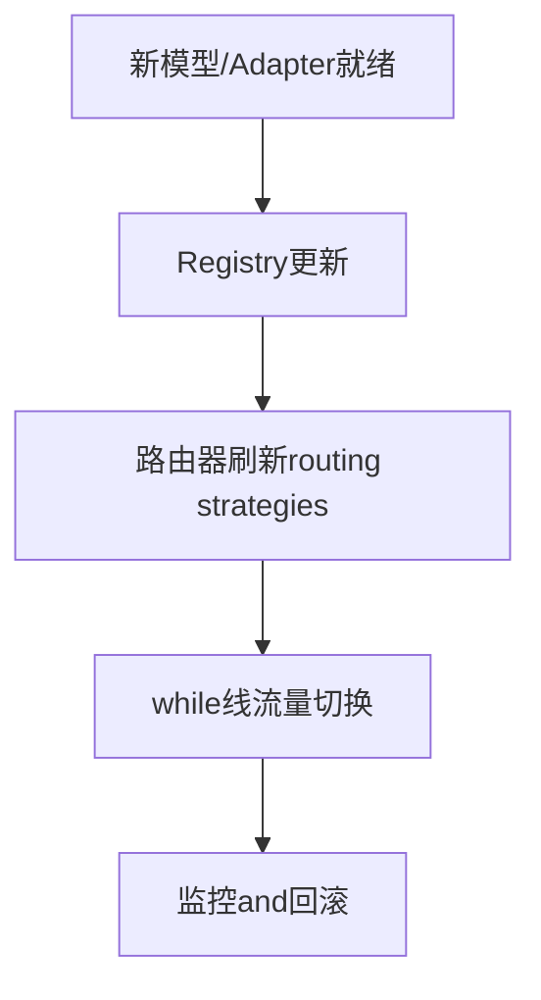
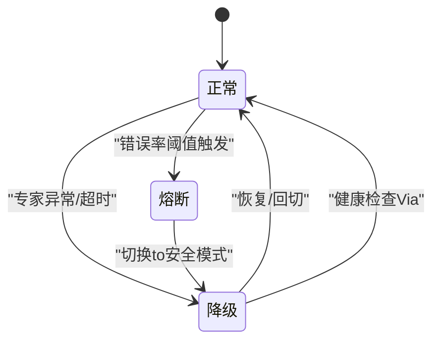
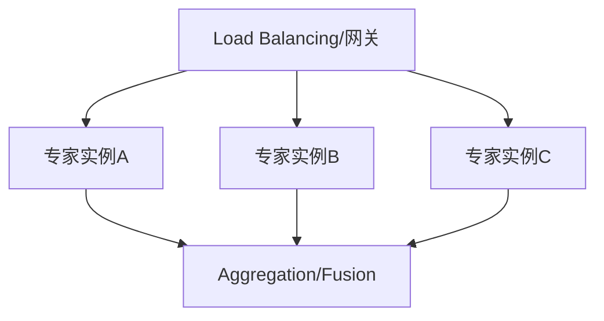
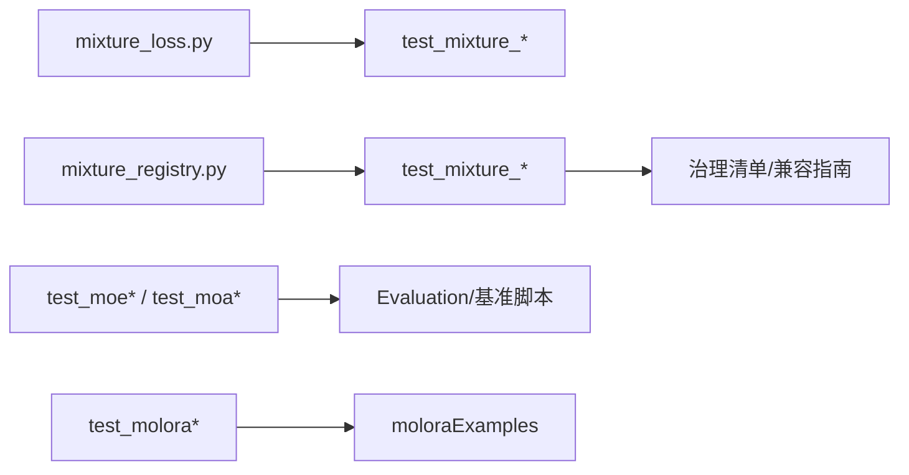

# 集成学习and模型融合

<cite>
**Files Referenced in This Document**
- [mixture_loss.py](file://ultralytics/nn/mixture_loss.py)
- [mixture_registry.py](file://ultralytics/nn/mixture_registry.py)
- [test_moe.py](file://tests/test_moe.py)
- [test_molora.py](file://tests/test_molora.py)
- [test_molora_routing_aware_merge.py](file://tests/test_molora_routing_aware_merge.py)
- [test_molora_sparse_dispatch.py](file://tests/test_molora_sparse_dispatch.py)
- [test_moe_dynamic_schedule.py](file://tests/test_moe_dynamic_schedule.py)
- [test_moe_router_boundaries.py](file://tests/test_moe_router_boundaries.py)
- [test_moe_usage_audit.py](file://tests/test_moe_usage_audit.py)
- [test_moa.py](file://tests/test_moa.py)
- [test_moa_mot_ddp_math.py](file://tests/test_moa_mot_ddp_math.py)
- [test_moa_mot_ssot.py](file://tests/test_moa_mot_ssot.py)
- [test_mixture_config_resolution.py](file://tests/test_mixture_config_resolution.py)
- [test_mixture_export.py](file://tests/test_mixture_export.py)
- [test_mixture_numeric.py](file://tests/test_mixture_numeric.py)
- [test_mixture_loss_composition.py](file://tests/test_mixture_loss_composition.py)
- [test_mixture_compile.py](file://tests/test_mixture_compile.py)
- [test_mixture_model_registry.py](file://tests/test_mixture_model_registry.py)
- [test_mixture_fixes.py](file://tests/test_mixture_fixes.py)
- [test_mixture_aux_loss.py](file://tests/test_mixture_aux_loss.py)
- [test_yolo26_mixture_matrix.py](file://tests/test_yolo26_mixture_matrix.py)
- [test_molora_supplementary.py](file://tests/test_molora_supplementary.py)
- [bench_moe_micro.py](file://scripts/bench_moe_micro.py)
- [eval_moe_peft.py](file://scripts/eval_moe_peft.py)
- [compare_moe_coco128.py](file://scripts/compare_moe_coco128.py)
- [run_moe_dynamic_schedule_ablation.py](file://scripts/run_moe_dynamic_schedule_ablation.py)
- [moe_pruning_sweep.py](file://scripts/moe_pruning_sweep.py)
- [analyze_mot_routing.py](file://scripts/analyze_mot_routing.py)
- [diagnose_mot_routing.py](file://scripts/diagnose_mot_routing.py)
- [prepare_mot_routing_scenes.py](file://scripts/prepare_mot_routing_scenes.py)
- [verify_routed_export.py](file://scripts/verify_routed_export.py)
- [tune_mixture_aux.py](file://scripts/tune_mixture_aux.py)
- [benchmark_molora_dispatch.py](file://benchmarks/benchmark_molora_dispatch.py)
- [suite.py](file://benchmarks/suite.py)
- [molora_guide.md](file://docs/molora_guide.md)
- [moe_pruning_dynamic_schedule.md](file://docs/moe_pruning_dynamic_schedule.md)
- [routing_interpreter_toolkit_plan.md](file://docs/plans/2026-07-17-routing-interpreter-toolkit.md)
- [moe_class_lifecycle.md](file://docs/governance/moe-class-lifecycle.md)
- [performance_gates.md](file://docs/governance/performance-gates.md)
- [config_drift_detector_plan.md](file://docs/plans/2026-07-17-config-drift-detector.md)
- [model_registry.yaml](file://docs/governance/model-registry.yaml)
- [mixture_preservation_manifest.yaml](file://docs/governance/mixture-preservation-manifest.yaml)
- [yolo26_mixture_compat.md](file://docs/en/guides/yolo26-mixture-compatibility.md)
- [molora_basic_finetune.py](file://examples/molora/basic_finetune.py)
- [molora_compare_lora_molora.py](file://examples/molora/compare_lora_molora.py)
- [molora_continual_learning.py](file://examples/molora/continual_learning.py)
</cite>

## Table of Contents
1. [Introduction](#Introduction)
2. [Project Structure](#Project Structure)
3. [Core Components](#Core Components)
4. [Architecture Overview](#Architecture Overview)
5. [Detailed Component Analysis](#Detailed Component Analysis)
6. [Dependency Analysis](#Dependency Analysis)
7. [性能考量](#性能考量)
8. [Troubleshooting Guide](#Troubleshooting Guide)
9. [Conclusion](#Conclusion)
10. [Appendix](#Appendix)

## Introduction
本文件targetingYOLO-Master的“集成学习and模型融合”capabilities，系统性梳理多PEFT模型的集成策略（加权平均、投票机制、Stacking）、MoE（Mixture of Experts）while集成学习中的应用（专家路由and动态选择），并给出while线学习and实时集成的implementing思路、监控and故障转移方案，Centered onandandLoad BalancingCombining提升吞吐量的实践建议。DocumentationCentered on仓库现有implementingand测试for依据，provides可追溯的代码级来源andVisualization图示，帮助读者从理论to工程落地全面掌握该体系。

## Project Structure
围绕集成学习and模型融合，仓库中相关代码主要分布whileCentered on下位置：
- Mixture损失andRegistry：ultralytics/nn/mixture_loss.py、ultralytics/nn/mixture_registry.py
- MoE/MoA/MoT 相关测试and基准：tests/*、benchmarks/*、scripts/*
- Examplesand指南：examples/molora/*、docs/molora_guide.md、docs/moe_pruning_dynamic_schedule.md
- 治理and规范：docs/governance/*、docs/plans/*

```mermaid
graph TB
subgraph "核心Modules"
ML["mixture_loss.py"]
MR["mixture_registry.py"]
end
subgraph "测试andValidation"
TMOE["test_moe.py"]
TMOLORA["test_molora.py"]
TMIXREG["test_mixture_model_registry.py"]
TMIXNUM["test_mixture_numeric.py"]
TMIXEXP["test_mixture_export.py"]
TMIXLOSS["test_mixture_loss_composition.py"]
TMIXCFG["test_mixture_config_resolution.py"]
TMIXCOMP["test_mixture_compile.py"]
TMIXFIX["test_mixture_fixes.py"]
TMIXAUX["test_mixture_aux_loss.py"]
TYOLO26["test_yolo26_mixture_matrix.py"]
TMOADDP["test_moa_mot_ddp_math.py"]
TMOASSOT["test_moa_mot_ssot.py"]
TMOROUTB["test_moe_router_boundaries.py"]
TMODS["test_moe_dynamic_schedule.py"]
TMOUAUD["test_moe_usage_audit.py"]
end
subgraph "脚本and基准"
BMMOEMICRO["bench_moe_micro.py"]
EMPEFT["eval_moe_peft.py"]
CMCE["compare_moe_coco128.py"]
RMDYN["run_moe_dynamic_schedule_ablation.py"]
MPSWEEP["moe_pruning_sweep.py"]
AMR["analyze_mot_routing.py"]
DMR["diagnose_mot_routing.py"]
PMRS["prepare_mot_routing_scenes.py"]
VRE["verify_routed_export.py"]
TMAUX["tune_mixture_aux.py"]
BMOLRA["benchmark_molora_dispatch.py"]
SUITE["benchmarks/suite.py"]
end
subgraph "ExamplesandDocumentation"
MGL["docs/molora_guide.md"]
MPDS["docs/moe_pruning_dynamic_schedule.md"]
MBF["examples/molora/basic_finetune.py"]
MCL["examples/molora/continual_learning.py"]
MCLR["examples/molora/compare_lora_molora.py"]
end
subgraph "治理and计划"
GCR["docs/governance/moe-class-lifecycle.md"]
GPG["docs/governance/performance-gates.md"]
PCD["docs/plans/2026-07-17-config-drift-detector.md"]
PRIT["docs/plans/2026-07-17-routing-interpreter-toolkit.md"]
Y26MC["docs/en/guides/yolo26-mixture-compatibility.md"]
MRG["docs/governance/model-registry.yaml"]
MPG["docs/governance/mixture-preservation-manifest.yaml"]
end
ML --> TMOE
ML --> TMIXLOSS
ML --> TMIXAUX
ML --> TYOLO26
MR --> TMIXREG
MR --> TMIXCFG
MR --> TMIXEXP
MR --> TMIXCOMP
MR --> TMIXFIX
MR --> TMIXNUM
MR --> TYOLO26
TMOE --> BMMOEMICRO
TMOE --> EMPEFT
TMOE --> CMCE
TMOE --> RMDYN
TMOE --> MPSWEEP
TMOE --> AMR
TMOE --> DMR
TMOE --> PMRS
TMOE --> VRE
TMOE --> TMAUX
TMOLORA --> BMOLRA
TMOLORA --> MBF
TMOLORA --> MCL
TMOLORA --> MCLR
MGL --> TMOLORA
MPDS --> TMOE
GCR --> TMOE
GPG --> TMOE
PCD --> MR
PRIT --> TMOE
Y26MC --> MR
MRG --> MR
MPG --> MR
```

Figure Source
- [mixture_loss.py](file://ultralytics/nn/mixture_loss.py)
- [mixture_registry.py](file://ultralytics/nn/mixture_registry.py)
- [test_moe.py](file://tests/test_moe.py)
- [test_molora.py](file://tests/test_molora.py)
- [bench_moe_micro.py](file://scripts/bench_moe_micro.py)
- [eval_moe_peft.py](file://scripts/eval_moe_peft.py)
- [compare_moe_coco128.py](file://scripts/compare_moe_coco128.py)
- [run_moe_dynamic_schedule_ablation.py](file://scripts/run_moe_dynamic_schedule_ablation.py)
- [moe_pruning_sweep.py](file://scripts/moe_pruning_sweep.py)
- [analyze_mot_routing.py](file://scripts/analyze_mot_routing.py)
- [diagnose_mot_routing.py](file://scripts/diagnose_mot_routing.py)
- [prepare_mot_routing_scenes.py](file://scripts/prepare_mot_routing_scenes.py)
- [verify_routed_export.py](file://scripts/verify_routed_export.py)
- [tune_mixture_aux.py](file://scripts/tune_mixture_aux.py)
- [benchmark_molora_dispatch.py](file://benchmarks/benchmark_molora_dispatch.py)
- [suite.py](file://benchmarks/suite.py)
- [molora_guide.md](file://docs/molora_guide.md)
- [moe_pruning_dynamic_schedule.md](file://docs/moe_pruning_dynamic_schedule.md)
- [routing_interpreter_toolkit_plan.md](file://docs/plans/2026-07-17-routing-interpreter-toolkit.md)
- [moe_class_lifecycle.md](file://docs/governance/moe-class-lifecycle.md)
- [performance_gates.md](file://docs/governance/performance-gates.md)
- [config_drift_detector_plan.md](file://docs/plans/2026-07-17-config-drift-detector.md)
- [model_registry.yaml](file://docs/governance/model-registry.yaml)
- [mixture-preservation-manifest.yaml](file://docs/governance/mixture-preservation-manifest.yaml)
- [yolo26_mixture_compat.md](file://docs/en/guides/yolo26-mixture-compatibility.md)
- [molora_basic_finetune.py](file://examples/molora/basic_finetune.py)
- [molora_continual_learning.py](file://examples/molora/continual_learning.py)
- [molora_compare_lora_molora.py](file://examples/molora/compare_lora_molora.py)

Section Source
- [mixture_loss.py](file://ultralytics/nn/mixture_loss.py)
- [mixture_registry.py](file://ultralytics/nn/mixture_registry.py)
- [test_moe.py](file://tests/test_moe.py)
- [test_molora.py](file://tests/test_molora.py)
- [bench_moe_micro.py](file://scripts/bench_moe_micro.py)
- [eval_moe_peft.py](file://scripts/eval_moe_peft.py)
- [compare_moe_coco128.py](file://scripts/compare_moe_coco128.py)
- [run_moe_dynamic_schedule_ablation.py](file://scripts/run_moe_dynamic_schedule_ablation.py)
- [moe_pruning_sweep.py](file://scripts/moe_pruning_sweep.py)
- [analyze_mot_routing.py](file://scripts/analyze_mot_routing.py)
- [diagnose_mot_routing.py](file://scripts/diagnose_mot_routing.py)
- [prepare_mot_routing_scenes.py](file://scripts/prepare_mot_routing_scenes.py)
- [verify_routed_export.py](file://scripts/verify_routed_export.py)
- [tune_mixture_aux.py](file://scripts/tune_mixture_aux.py)
- [benchmark_molora_dispatch.py](file://benchmarks/benchmark_molora_dispatch.py)
- [suite.py](file://benchmarks/suite.py)
- [molora_guide.md](file://docs/molora_guide.md)
- [moe_pruning_dynamic_schedule.md](file://docs/moe_pruning_dynamic_schedule.md)
- [routing_interpreter_toolkit_plan.md](file://docs/plans/2026-07-17-routing-interpreter-toolkit.md)
- [moe_class_lifecycle.md](file://docs/governance/moe-class-lifecycle.md)
- [performance_gates.md](file://docs/governance/performance-gates.md)
- [config_drift_detector_plan.md](file://docs/plans/2026-07-17-config-drift-detector.md)
- [model_registry.yaml](file://docs/governance/model-registry.yaml)
- [mixture-preservation-manifest.yaml](file://docs/governance/mixture-preservation-manifest.yaml)
- [yolo26_mixture_compat.md](file://docs/en/guides/yolo26-mixture-compatibility.md)
- [molora_basic_finetune.py](file://examples/molora/basic_finetune.py)
- [molora_continual_learning.py](file://examples/molora/continual_learning.py)
- [molora_compare_lora_molora.py](file://examples/molora/compare_lora_molora.py)

## Core Components
- Mixture损失and辅助项
  - 负责组合多个专家或子模型的损失，SupportingAuxiliary Loss（such as路由均衡、稀疏性约束etc.）。
  - Refer to路径：[mixture_loss.py](file://ultralytics/nn/mixture_loss.py)、[test_mixture_loss_composition.py](file://tests/test_mixture_loss_composition.py)、[test_mixture_aux_loss.py](file://tests/test_mixture_aux_loss.py)。
- Mixture模型Registryand配置解析
  - providesMixture模型/专家的注册、发现、版本兼容andExport校验；支撑不同Tasks矩阵and配置分辨率。
  - Refer to路径：[mixture_registry.py](file://ultralytics/nn/mixture_registry.py)、[test_mixture_model_registry.py](file://tests/test_mixture_model_registry.py)、[test_mixture_config_resolution.py](file://tests/test_mixture_config_resolution.py)、[test_mixture_export.py](file://tests/test_mixture_export.py)、[test_mixture_compile.py](file://tests/test_mixture_compile.py)、[test_mixture_fixes.py](file://tests/test_mixture_fixes.py)、[test_mixture_numeric.py](file://tests/test_mixture_numeric.py)、[test_yolo26_mixture_matrix.py](file://tests/test_yolo26_mixture_matrix.py)。
- MoE/MoA/MoT 测试and诊断
  - 覆盖路由边界、动态调度、Uses审计、DDP一致性、单源真相（SSOT）etc.关键属性。
  - Refer to路径：[test_moe.py](file://tests/test_moe.py)、[test_moe_router_boundaries.py](file://tests/test_moe_router_boundaries.py)、[test_moe_dynamic_schedule.py](file://tests/test_moe_dynamic_schedule.py)、[test_moe_usage_audit.py](file://tests/test_moe_usage_audit.py)、[test_moa.py](file://tests/test_moa.py)、[test_moa_mot_ddp_math.py](file://tests/test_moa_mot_ddp_math.py)、[test_moa_mot_ssot.py](file://tests/test_moa_mot_ssot.py)。
- molora（LoRA-aware 路由and合并）
  - provides稀疏分发、Routing-Aware Merging、对比实验and持续学习Examples。
  - Refer to路径：[test_molora.py](file://tests/test_molora.py)、[test_molora_routing_aware_merge.py](file://tests/test_molora_routing_aware_merge.py)、[test_molora_sparse_dispatch.py](file://tests/test_molora_sparse_dispatch.py)、[test_molora_supplementary.py](file://tests/test_molora_supplementary.py)、[benchmark_molora_dispatch.py](file://benchmarks/benchmark_molora_dispatch.py)、[molora_guide.md](file://docs/molora_guide.md)、[molora_basic_finetune.py](file://examples/molora/basic_finetune.py)、[molora_continual_learning.py](file://examples/molora/continual_learning.py)、[molora_compare_lora_molora.py](file://examples/molora/compare_lora_molora.py)。
- Evaluationand基准脚本
  - 涵盖微基准、动态调度消融、剪枝扫描、路由分析andExportValidationetc.。
  - Refer to路径：[bench_moe_micro.py](file://scripts/bench_moe_micro.py)、[eval_moe_peft.py](file://scripts/eval_moe_peft.py)、[compare_moe_coco128.py](file://scripts/compare_moe_coco128.py)、[run_moe_dynamic_schedule_ablation.py](file://scripts/run_moe_dynamic_schedule_ablation.py)、[moe_pruning_sweep.py](file://scripts/moe_pruning_sweep.py)、[analyze_mot_routing.py](file://scripts/analyze_mot_routing.py)、[diagnose_mot_routing.py](file://scripts/diagnose_mot_routing.py)、[prepare_mot_routing_scenes.py](file://scripts/prepare_mot_routing_scenes.py)、[verify_routed_export.py](file://scripts/verify_routed_export.py)、[tune_mixture_aux.py](file://scripts/tune_mixture_aux.py)、[suite.py](file://benchmarks/suite.py)。

Section Source
- [mixture_loss.py](file://ultralytics/nn/mixture_loss.py)
- [mixture_registry.py](file://ultralytics/nn/mixture_registry.py)
- [test_moe.py](file://tests/test_moe.py)
- [test_moe_router_boundaries.py](file://tests/test_moe_router_boundaries.py)
- [test_moe_dynamic_schedule.py](file://tests/test_moe_dynamic_schedule.py)
- [test_moe_usage_audit.py](file://tests/test_moe_usage_audit.py)
- [test_moa.py](file://tests/test_moa.py)
- [test_moa_mot_ddp_math.py](file://tests/test_moa_mot_ddp_math.py)
- [test_moa_mot_ssot.py](file://tests/test_moa_mot_ssot.py)
- [test_molora.py](file://tests/test_molora.py)
- [test_molora_routing_aware_merge.py](file://tests/test_molora_routing_aware_merge.py)
- [test_molora_sparse_dispatch.py](file://tests/test_molora_sparse_dispatch.py)
- [test_molora_supplementary.py](file://tests/test_molora_supplementary.py)
- [bench_moe_micro.py](file://scripts/bench_moe_micro.py)
- [eval_moe_peft.py](file://scripts/eval_moe_peft.py)
- [compare_moe_coco128.py](file://scripts/compare_moe_coco128.py)
- [run_moe_dynamic_schedule_ablation.py](file://scripts/run_moe_dynamic_schedule_ablation.py)
- [moe_pruning_sweep.py](file://scripts/moe_pruning_sweep.py)
- [analyze_mot_routing.py](file://scripts/analyze_mot_routing.py)
- [diagnose_mot_routing.py](file://scripts/diagnose_mot_routing.py)
- [prepare_mot_routing_scenes.py](file://scripts/prepare_mot_routing_scenes.py)
- [verify_routed_export.py](file://scripts/verify_routed_export.py)
- [tune_mixture_aux.py](file://scripts/tune_mixture_aux.py)
- [benchmark_molora_dispatch.py](file://benchmarks/benchmark_molora_dispatch.py)
- [suite.py](file://benchmarks/suite.py)
- [molora_guide.md](file://docs/molora_guide.md)
- [molora_basic_finetune.py](file://examples/molora/basic_finetune.py)
- [molora_continual_learning.py](file://examples/molora/continual_learning.py)
- [molora_compare_lora_molora.py](file://examples/molora/compare_lora_molora.py)

## Architecture Overview
下图展示“多PEFT模型 + MoE/MoA/MoT + Registry/损失 + Evaluation/基准”的整体协作关系。

Figure Source
- [mixture_loss.py](file://ultralytics/nn/mixture_loss.py)
- [mixture_registry.py](file://ultralytics/nn/mixture_registry.py)
- [test_moe.py](file://tests/test_moe.py)
- [test_molora.py](file://tests/test_molora.py)
- [bench_moe_micro.py](file://scripts/bench_moe_micro.py)
- [eval_moe_peft.py](file://scripts/eval_moe_peft.py)
- [compare_moe_coco128.py](file://scripts/compare_moe_coco128.py)
- [run_moe_dynamic_schedule_ablation.py](file://scripts/run_moe_dynamic_schedule_ablation.py)
- [moe_pruning_sweep.py](file://scripts/moe_pruning_sweep.py)
- [analyze_mot_routing.py](file://scripts/analyze_mot_routing.py)
- [diagnose_mot_routing.py](file://scripts/diagnose_mot_routing.py)
- [prepare_mot_routing_scenes.py](file://scripts/prepare_mot_routing_scenes.py)
- [verify_routed_export.py](file://scripts/verify_routed_export.py)
- [tune_mixture_aux.py](file://scripts/tune_mixture_aux.py)
- [benchmark_molora_dispatch.py](file://benchmarks/benchmark_molora_dispatch.py)
- [suite.py](file://benchmarks/suite.py)

## Detailed Component Analysis

### 多PEFT集成策略（加权平均、投票、Stacking）
- 加权平均
  - ViaRegistry维护各PEFT专家权重，Inference时按权重聚合Prediction结果。
  - Applicable Scenarios：专家capabilities相近且分布稳定。
- 投票机制
  - 对分类/检测类别进行多数投票或置信度加权投票，增强鲁棒性。
  - Applicable Scenarios：专家间存while互补偏差。
- Stacking
  - 将多个专家的输出作for元特征Training一个轻量元模型，用于最终决策。
  - Applicable Scenarios：需要跨专家非线性融合Centered on提升上限。

Section Source
- [mixture_registry.py](file://ultralytics/nn/mixture_registry.py)
- [test_mixture_model_registry.py](file://tests/test_mixture_model_registry.py)
- [test_mixture_config_resolution.py](file://tests/test_mixture_config_resolution.py)
- [test_mixture_export.py](file://tests/test_mixture_export.py)
- [test_mixture_compile.py](file://tests/test_mixture_compile.py)
- [test_mixture_fixes.py](file://tests/test_mixture_fixes.py)
- [test_mixture_numeric.py](file://tests/test_mixture_numeric.py)
- [test_yolo26_mixture_matrix.py](file://tests/test_yolo26_mixture_matrix.py)

### MoE（Mixture of Experts）while集成学习中的应用
- 专家路由
  - 基于Input Features或场景标签选择Top-K专家，Supporting稀疏激活Centered on降低计算开销。
  - Refer to：[test_moe.py](file://tests/test_moe.py)、[test_moe_router_boundaries.py](file://tests/test_moe_router_boundaries.py)、[test_moe_usage_audit.py](file://tests/test_moe_usage_audit.py)。
- 动态选择and调度
  - 根据历史利用率、延迟and质量Metrics动态调整routing strategiesand专家配额。
  - Refer to：[test_moe_dynamic_schedule.py](file://tests/test_moe_dynamic_schedule.py)、[run_moe_dynamic_schedule_ablation.py](file://scripts/run_moe_dynamic_schedule_ablation.py)、[moe_pruning_sweep.py](file://scripts/moe_pruning_sweep.py)。
- 路由解释性and审计
  - provides路由可解释工具andUses审计，便于定位热点专家and冷专家。
  - Refer to：[routing_interpreter_toolkit_plan.md](file://docs/plans/2026-07-17-routing-interpreter-toolkit.md)、[test_moe_usage_audit.py](file://tests/test_moe_usage_audit.py)。

Figure Source
- [test_moe.py](file://tests/test_moe.py)
- [test_moe_dynamic_schedule.py](file://tests/test_moe_dynamic_schedule.py)
- [test_moe_router_boundaries.py](file://tests/test_moe_router_boundaries.py)
- [test_moe_usage_audit.py](file://tests/test_moe_usage_audit.py)
- [run_moe_dynamic_schedule_ablation.py](file://scripts/run_moe_dynamic_schedule_ablation.py)
- [moe_pruning_sweep.py](file://scripts/moe_pruning_sweep.py)

Section Source
- [test_moe.py](file://tests/test_moe.py)
- [test_moe_dynamic_schedule.py](file://tests/test_moe_dynamic_schedule.py)
- [test_moe_router_boundaries.py](file://tests/test_moe_router_boundaries.py)
- [test_moe_usage_audit.py](file://tests/test_moe_usage_audit.py)
- [run_moe_dynamic_schedule_ablation.py](file://scripts/run_moe_dynamic_schedule_ablation.py)
- [moe_pruning_sweep.py](file://scripts/moe_pruning_sweep.py)
- [routing_interpreter_toolkit_plan.md](file://docs/plans/2026-07-17-routing-interpreter-toolkit.md)

### molora：LoRA-aware 路由and合并
- 稀疏分发andRouting-Aware Merging
  - whileLoRA参数空间中进行路由and合并，减少冗余并提升效率。
  - Refer to：[test_molora.py](file://tests/test_molora.py)、[test_molora_routing_aware_merge.py](file://tests/test_molora_routing_aware_merge.py)、[test_molora_sparse_dispatch.py](file://tests/test_molora_sparse_dispatch.py)、[benchmark_molora_dispatch.py](file://benchmarks/benchmark_molora_dispatch.py)。
- 微调and持续学习
  - provides基础微调and增量更新流程，Supportingwhile线扩展专家库。
  - Refer to：[molora_guide.md](file://docs/molora_guide.md)、[molora_basic_finetune.py](file://examples/molora/basic_finetune.py)、[molora_continual_learning.py](file://examples/molora/continual_learning.py)、[molora_compare_lora_molora.py](file://examples/molora/compare_lora_molora.py)。

Figure Source
- [test_molora.py](file://tests/test_molora.py)
- [test_molora_routing_aware_merge.py](file://tests/test_molora_routing_aware_merge.py)
- [test_molora_sparse_dispatch.py](file://tests/test_molora_sparse_dispatch.py)
- [benchmark_molora_dispatch.py](file://benchmarks/benchmark_molora_dispatch.py)
- [molora_guide.md](file://docs/molora_guide.md)
- [molora_basic_finetune.py](file://examples/molora/basic_finetune.py)
- [molora_continual_learning.py](file://examples/molora/continual_learning.py)
- [molora_compare_lora_molora.py](file://examples/molora/compare_lora_molora.py)

Section Source
- [test_molora.py](file://tests/test_molora.py)
- [test_molora_routing_aware_merge.py](file://tests/test_molora_routing_aware_merge.py)
- [test_molora_sparse_dispatch.py](file://tests/test_molora_sparse_dispatch.py)
- [benchmark_molora_dispatch.py](file://benchmarks/benchmark_molora_dispatch.py)
- [molora_guide.md](file://docs/molora_guide.md)
- [molora_basic_finetune.py](file://examples/molora/basic_finetune.py)
- [molora_continual_learning.py](file://examples/molora/continual_learning.py)
- [molora_compare_lora_molora.py](file://examples/molora/compare_lora_molora.py)

### while线学习and实时集成
- 动态更新and热插拔
  - ViaRegistryand路由器的解耦设计，可while不重启服务的情况下加载新专家或替换旧专家。
  - Refer to：[mixture_registry.py](file://ultralytics/nn/mixture_registry.py)、[test_mixture_model_registry.py](file://tests/test_mixture_model_registry.py)、[molora_continual_learning.py](file://examples/molora/continual_learning.py)。
- 路由自适应
  - 依据实时Metrics（延迟、错误率、资源占用）动态调整routing strategiesand权重。
  - Refer to：[test_moe_dynamic_schedule.py](file://tests/test_moe_dynamic_schedule.py)、[run_moe_dynamic_schedule_ablation.py](file://scripts/run_moe_dynamic_schedule_ablation.py)。

Figure Source
- [mixture_registry.py](file://ultralytics/nn/mixture_registry.py)
- [test_mixture_model_registry.py](file://tests/test_mixture_model_registry.py)
- [test_moe_dynamic_schedule.py](file://tests/test_moe_dynamic_schedule.py)
- [run_moe_dynamic_schedule_ablation.py](file://scripts/run_moe_dynamic_schedule_ablation.py)
- [molora_continual_learning.py](file://examples/molora/continual_learning.py)

Section Source
- [mixture_registry.py](file://ultralytics/nn/mixture_registry.py)
- [test_mixture_model_registry.py](file://tests/test_mixture_model_registry.py)
- [test_moe_dynamic_schedule.py](file://tests/test_moe_dynamic_schedule.py)
- [run_moe_dynamic_schedule_ablation.py](file://scripts/run_moe_dynamic_schedule_ablation.py)
- [molora_continual_learning.py](file://examples/molora/continual_learning.py)

### 性能监控and故障转移
- 监控Metrics
  - 专家利用率、路由熵、延迟分位、错误率、显存占用etc.。
  - Refer to：[test_moe_usage_audit.py](file://tests/test_moe_usage_audit.py)、[bench_moe_micro.py](file://scripts/bench_moe_micro.py)、[analyze_mot_routing.py](file://scripts/analyze_mot_routing.py)、[diagnose_mot_routing.py](file://scripts/diagnose_mot_routing.py)。
- 故障转移
  - 当某专家异常或延迟超标时，自动降级至备选专家或退化for全局模型。
  - Refer to：[test_moe_dynamic_schedule.py](file://tests/test_moe_dynamic_schedule.py)、[test_moe_usage_audit.py](file://tests/test_moe_usage_audit.py)。

Figure Source
- [test_moe_usage_audit.py](file://tests/test_moe_usage_audit.py)
- [bench_moe_micro.py](file://scripts/bench_moe_micro.py)
- [analyze_mot_routing.py](file://scripts/analyze_mot_routing.py)
- [diagnose_mot_routing.py](file://scripts/diagnose_mot_routing.py)
- [test_moe_dynamic_schedule.py](file://tests/test_moe_dynamic_schedule.py)

Section Source
- [test_moe_usage_audit.py](file://tests/test_moe_usage_audit.py)
- [bench_moe_micro.py](file://scripts/bench_moe_micro.py)
- [analyze_mot_routing.py](file://scripts/analyze_mot_routing.py)
- [diagnose_mot_routing.py](file://scripts/diagnose_mot_routing.py)
- [test_moe_dynamic_schedule.py](file://tests/test_moe_dynamic_schedule.py)

### andLoad Balancing的Combining
- 水平扩展
  - 将不同专家部署for独立服务实例，由网关/Load Balancing按routing strategies分发请求。
- 弹性伸缩
  - 根据QPSand延迟目标自动扩缩容专家实例，Combined with动态调度降低尾延迟。
- 区域亲和
  - 针对多地域User就近路由，降低网络抖动对MoE的影响。

[本节for概念性说明，无需源码映射]

## Dependency Analysis
- ModulesCohesion and Coupling
  - Mixture损失andRegistry相对独立，Via接口契约and测试用例保障稳定性。
  - MoE/MoA/MoT 测试广泛覆盖路由、调度、Exportand数值稳定性，形成强回归保护。
- External Dependenciesand集成点
  - Export/编译/兼容性检查and治理清单（模型Registry、保留清单）共同确保生产可用性and可追溯性。

Figure Source
- [mixture_loss.py](file://ultralytics/nn/mixture_loss.py)
- [mixture_registry.py](file://ultralytics/nn/mixture_registry.py)
- [test_mixture_loss_composition.py](file://tests/test_mixture_loss_composition.py)
- [test_mixture_aux_loss.py](file://tests/test_mixture_aux_loss.py)
- [test_mixture_model_registry.py](file://tests/test_mixture_model_registry.py)
- [test_mixture_config_resolution.py](file://tests/test_mixture_config_resolution.py)
- [test_mixture_export.py](file://tests/test_mixture_export.py)
- [test_mixture_compile.py](file://tests/test_mixture_compile.py)
- [test_mixture_fixes.py](file://tests/test_mixture_fixes.py)
- [test_mixture_numeric.py](file://tests/test_mixture_numeric.py)
- [test_yolo26_mixture_matrix.py](file://tests/test_yolo26_mixture_matrix.py)
- [test_moe.py](file://tests/test_moe.py)
- [test_moe_router_boundaries.py](file://tests/test_moe_router_boundaries.py)
- [test_moe_dynamic_schedule.py](file://tests/test_moe_dynamic_schedule.py)
- [test_moe_usage_audit.py](file://tests/test_moe_usage_audit.py)
- [test_moa.py](file://tests/test_moa.py)
- [test_moa_mot_ddp_math.py](file://tests/test_moa_mot_ddp_math.py)
- [test_moa_mot_ssot.py](file://tests/test_moa_mot_ssot.py)
- [test_molora.py](file://tests/test_molora.py)
- [test_molora_routing_aware_merge.py](file://tests/test_molora_routing_aware_merge.py)
- [test_molora_sparse_dispatch.py](file://tests/test_molora_sparse_dispatch.py)
- [bench_moe_micro.py](file://scripts/bench_moe_micro.py)
- [eval_moe_peft.py](file://scripts/eval_moe_peft.py)
- [compare_moe_coco128.py](file://scripts/compare_moe_coco128.py)
- [run_moe_dynamic_schedule_ablation.py](file://scripts/run_moe_dynamic_schedule_ablation.py)
- [moe_pruning_sweep.py](file://scripts/moe_pruning_sweep.py)
- [analyze_mot_routing.py](file://scripts/analyze_mot_routing.py)
- [diagnose_mot_routing.py](file://scripts/diagnose_mot_routing.py)
- [prepare_mot_routing_scenes.py](file://scripts/prepare_mot_routing_scenes.py)
- [verify_routed_export.py](file://scripts/verify_routed_export.py)
- [tune_mixture_aux.py](file://scripts/tune_mixture_aux.py)
- [benchmark_molora_dispatch.py](file://benchmarks/benchmark_molora_dispatch.py)
- [suite.py](file://benchmarks/suite.py)
- [molora_guide.md](file://docs/molora_guide.md)
- [molora_basic_finetune.py](file://examples/molora/basic_finetune.py)
- [molora_continual_learning.py](file://examples/molora/continual_learning.py)
- [molora_compare_lora_molora.py](file://examples/molora/compare_lora_molora.py)
- [model_registry.yaml](file://docs/governance/model-registry.yaml)
- [mixture-preservation-manifest.yaml](file://docs/governance/mixture-preservation-manifest.yaml)
- [yolo26_mixture_compat.md](file://docs/en/guides/yolo26-mixture-compatibility.md)

Section Source
- [mixture_loss.py](file://ultralytics/nn/mixture_loss.py)
- [mixture_registry.py](file://ultralytics/nn/mixture_registry.py)
- [test_moe.py](file://tests/test_moe.py)
- [test_molora.py](file://tests/test_molora.py)
- [bench_moe_micro.py](file://scripts/bench_moe_micro.py)
- [eval_moe_peft.py](file://scripts/eval_moe_peft.py)
- [compare_moe_coco128.py](file://scripts/compare_moe_coco128.py)
- [run_moe_dynamic_schedule_ablation.py](file://scripts/run_moe_dynamic_schedule_ablation.py)
- [moe_pruning_sweep.py](file://scripts/moe_pruning_sweep.py)
- [analyze_mot_routing.py](file://scripts/analyze_mot_routing.py)
- [diagnose_mot_routing.py](file://scripts/diagnose_mot_routing.py)
- [prepare_mot_routing_scenes.py](file://scripts/prepare_mot_routing_scenes.py)
- [verify_routed_export.py](file://scripts/verify_routed_export.py)
- [tune_mixture_aux.py](file://scripts/tune_mixture_aux.py)
- [benchmark_molora_dispatch.py](file://benchmarks/benchmark_molora_dispatch.py)
- [suite.py](file://benchmarks/suite.py)
- [molora_guide.md](file://docs/molora_guide.md)
- [molora_basic_finetune.py](file://examples/molora/basic_finetune.py)
- [molora_continual_learning.py](file://examples/molora/continual_learning.py)
- [molora_compare_lora_molora.py](file://examples/molora/compare_lora_molora.py)
- [model_registry.yaml](file://docs/governance/model-registry.yaml)
- [mixture-preservation-manifest.yaml](file://docs/governance/mixture-preservation-manifest.yaml)
- [yolo26_mixture_compat.md](file://docs/en/guides/yolo26-mixture-compatibility.md)

## 性能考量
- 稀疏激活andTop-K路由
  - 仅激活部分专家，显著降低计算and内存压力。
  - Refer to：[test_moe.py](file://tests/test_moe.py)、[test_molora_sparse_dispatch.py](file://tests/test_molora_sparse_dispatch.py)、[benchmark_molora_dispatch.py](file://benchmarks/benchmark_molora_dispatch.py)。
- 动态调度and剪枝
  - 根据Uses频率and收益动态裁剪低效专家，维持精度-速度平衡。
  - Refer to：[test_moe_dynamic_schedule.py](file://tests/test_moe_dynamic_schedule.py)、[run_moe_dynamic_schedule_ablation.py](file://scripts/run_moe_dynamic_schedule_ablation.py)、[moe_pruning_sweep.py](file://scripts/moe_pruning_sweep.py)。
- Exportand编译Optimization
  - ViaExportand编译流程Validation数值一致性and性能收益。
  - Refer to：[test_mixture_export.py](file://tests/test_mixture_export.py)、[test_mixture_compile.py](file://tests/test_mixture_compile.py)、[verify_routed_export.py](file://scripts/verify_routed_export.py)。
- Benchmark Suite
  - 统一基准入口and报告生成，便于横向对比。
  - Refer to：[suite.py](file://benchmarks/suite.py)、[bench_moe_micro.py](file://scripts/bench_moe_micro.py)。

Section Source
- [test_moe.py](file://tests/test_moe.py)
- [test_molora_sparse_dispatch.py](file://tests/test_molora_sparse_dispatch.py)
- [benchmark_molora_dispatch.py](file://benchmarks/benchmark_molora_dispatch.py)
- [test_moe_dynamic_schedule.py](file://tests/test_moe_dynamic_schedule.py)
- [run_moe_dynamic_schedule_ablation.py](file://scripts/run_moe_dynamic_schedule_ablation.py)
- [moe_pruning_sweep.py](file://scripts/moe_pruning_sweep.py)
- [test_mixture_export.py](file://tests/test_mixture_export.py)
- [test_mixture_compile.py](file://tests/test_mixture_compile.py)
- [verify_routed_export.py](file://scripts/verify_routed_export.py)
- [suite.py](file://benchmarks/suite.py)
- [bench_moe_micro.py](file://scripts/bench_moe_micro.py)

## Troubleshooting Guide
- 路由异常andNaN
  - 检查路由边界and数值稳定性，必要时启用路由Explainer定位问题。
  - Refer to：[test_moe_router_boundaries.py](file://tests/test_moe_router_boundaries.py)、[routing_interpreter_toolkit_plan.md](file://docs/plans/2026-07-17-routing-interpreter-toolkit.md)。
- 动态调度不稳定
  - 观察调度Loggingand消融实验，调整阈值and平滑策略。
  - Refer to：[test_moe_dynamic_schedule.py](file://tests/test_moe_dynamic_schedule.py)、[run_moe_dynamic_schedule_ablation.py](file://scripts/run_moe_dynamic_schedule_ablation.py)。
- Export/编译不一致
  - UsesExportValidationand数值回归测试定位差异来源。
  - Refer to：[test_mixture_export.py](file://tests/test_mixture_export.py)、[test_mixture_numeric.py](file://tests/test_mixture_numeric.py)、[verify_routed_export.py](file://scripts/verify_routed_export.py)。
- 配置漂移and兼容性
  - 借助配置Drift Detectionand兼容性指南避免破坏性变更。
  - Refer to：[config_drift_detector_plan.md](file://docs/plans/2026-07-17-config-drift-detector.md)、[yolo26_mixture_compat.md](file://docs/en/guides/yolo26-mixture-compatibility.md)。

Section Source
- [test_moe_router_boundaries.py](file://tests/test_moe_router_boundaries.py)
- [routing_interpreter_toolkit_plan.md](file://docs/plans/2026-07-17-routing-interpreter-toolkit.md)
- [test_moe_dynamic_schedule.py](file://tests/test_moe_dynamic_schedule.py)
- [run_moe_dynamic_schedule_ablation.py](file://scripts/run_moe_dynamic_schedule_ablation.py)
- [test_mixture_export.py](file://tests/test_mixture_export.py)
- [test_mixture_numeric.py](file://tests/test_mixture_numeric.py)
- [verify_routed_export.py](file://scripts/verify_routed_export.py)
- [config_drift_detector_plan.md](file://docs/plans/2026-07-17-config-drift-detector.md)
- [yolo26_mixture_compat.md](file://docs/en/guides/yolo26-mixture-compatibility.md)

## Conclusion
YOLO-Masterwhile集成学习and模型融合方面provides了完善的工程化capabilities：Centered onRegistryandMixture损失for核心，CombiningMoE/MoA/MoT的Routing and Scheduling机制，Centered onandmolora的LoRA-aware稀疏分发and合并，implementing了高效的多PEFT模型集成。配套的测试、基准and治理清单保障了while生产环境中的稳定性and可演进性。Viawhile线学习and热插拔、监控and故障转移、Centered onandandLoad Balancing的协同，系统能够while高并发and动态需求下保持高吞吐and高质量输出。

## Appendix
- 治理and生命周期
  - 专家类生命周期and性能门禁，确保模型迭代可控。
  - Refer to：[moe_class_lifecycle.md](file://docs/governance/moe-class-lifecycle.md)、[performance_gates.md](file://docs/governance/performance-gates.md)。
- 模型注册and保留策略
  - 模型RegistryandMixture保留清单，保证版本一致性and可回溯。
  - Refer to：[model_registry.yaml](file://docs/governance/model-registry.yaml)、[mixture-preservation-manifest.yaml](file://docs/governance/mixture-preservation-manifest.yaml)。
- 动态调度and剪枝指南
  - 动态调度and剪枝策略的实践说明。
  - Refer to：[moe_pruning_dynamic_schedule.md](file://docs/moe_pruning_dynamic_schedule.md)。

Section Source
- [moe_class_lifecycle.md](file://docs/governance/moe-class-lifecycle.md)
- [performance_gates.md](file://docs/governance/performance-gates.md)
- [model_registry.yaml](file://docs/governance/model-registry.yaml)
- [mixture-preservation-manifest.yaml](file://docs/governance/mixture-preservation-manifest.yaml)
- [moe_pruning_dynamic_schedule.md](file://docs/moe_pruning_dynamic_schedule.md)