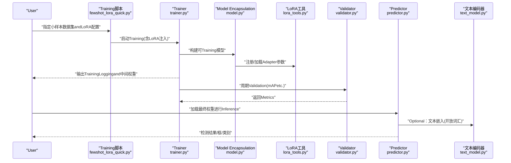
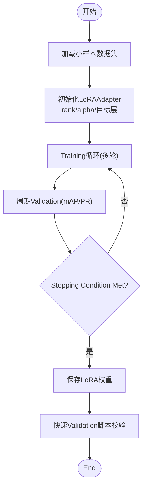
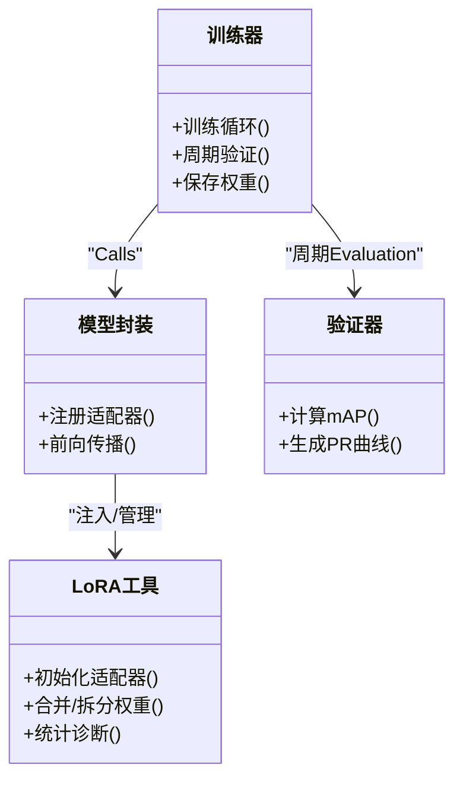
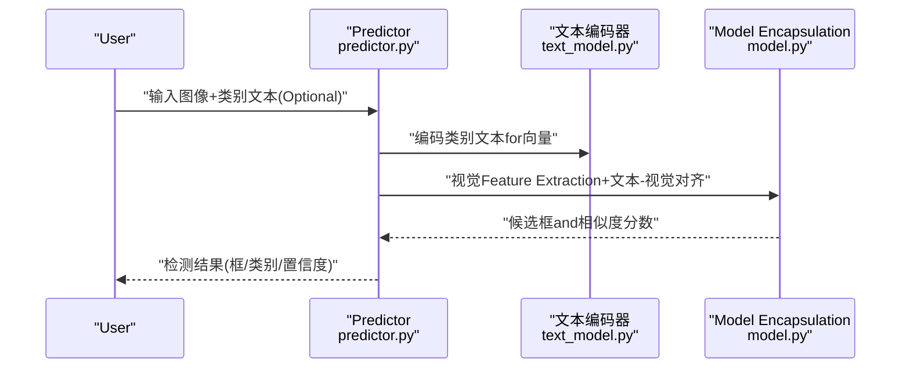
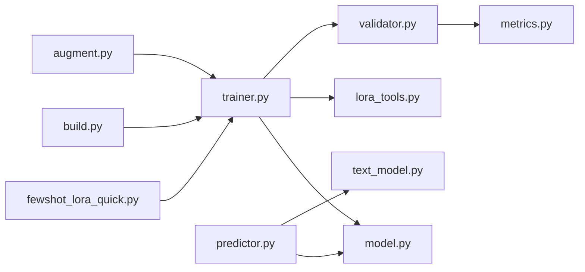

# 小样本学习应用

<cite>
**Files Referenced in This Document**
- [README.md](file://README.md)
- [LoRA_Quickstart.md](file://docs/LoRA_Quickstart.md)
- [molora_guide.md](file://docs/molora_guide.md)
- [domain-specific-lora-tuning.md](file://.plan_archive/domain-specific-lora-tuning.md)
- [fewshot_lora_quick.py](file://scripts/fewshot_lora_quick.py)
- [fewshot_lora_verify.py](file://scripts/fewshot_lora_verify.py)
- [run_fewshot_bg.sh](file://scripts/run_fewshot_bg.sh)
- [ablation_fewshot.py](file://scripts/ablation_suite/ablation_fewshot.py)
- [yolo_master_lora_README.md](file://examples/lora_examples/yolo_master_lora_README.md)
- [yolo11_lora.yaml](file://examples/lora_examples/yolo11_lora.yaml)
- [yolo12_lora.yaml](file://examples/lora_examples/yolo12_lora.yaml)
- [yoloworld_lora.yaml](file://examples/lora_examples/yoloworld_lora.yaml)
- [lora_e2e_smoke.py](file://tests/lora_e2e_smoke.py)
- [test_peft_adapters.py](file://tests/test_peft_adapters.py)
- [metrics.py](file://agent/runtime/evaluation/metrics.py)
- [augment.py](file://ultralytics/data/augment.py)
- [build.py](file://ultralytics/data/build.py)
- [trainer.py](file://ultralytics/engine/trainer.py)
- [predictor.py](file://ultralytics/engine/predictor.py)
- [validator.py](file://ultralytics/engine/validator.py)
- [model.py](file://ultralytics/engine/model.py)
- [text_model.py](file://ultralytics/nn/text_model.py)
- [peft_compare.py](file://agent/runtime/cli/peft_compare.py)
- [lora_tools.py](file://agent/runtime/cli/lora_tools.py)
</cite>

## Table of Contents
1. [Introduction](#Introduction)
2. [Project Structure](#Project Structure)
3. [Core Components](#Core Components)
4. [Architecture Overview](#Architecture Overview)
5. [Detailed Component Analysis](#Detailed Component Analysis)
6. [Dependency Analysis](#Dependency Analysis)
7. [性能考量](#性能考量)
8. [Troubleshooting Guide](#Troubleshooting Guide)
9. [Conclusion](#Conclusion)
10. [Appendix](#Appendix)

## Introduction
本文件targetingwhileYOLO-Master中落地“小样本学习（Few-Shot Learning, FSL）”的EngineersandResearchers，聚焦Centered on下目标：
- 解释小样本学习的基本原理and其whileObject Detection中的典型应用场景。
- 基于LoRA的Parameter-Efficient Fine-Tuning策略，说明Adapter参数初始化and更新规则。
- provides零样本检测的implementing思路，包括文本引导的检测器andOpen-Vocabulary Detection。
- 阐述元学习and度量学习while小样本场景中的应用方式。
- 给出可复现的Training流程andExamples路径，展示仅用少量标注样本Training高性能检测器的方法。
- 定义EvaluationMetricsand基准测试方法，并说明Data Augmentationand合成数据的作用。

## Project Structure
围绕小样本学习andLoRA微调，仓库中and本主题直接相关的代码andDocumentation主要分布whilesuch as下位置：
- 脚本andExamples
  - scripts: few-shot快速脚本、Validation脚本、后台运行脚本、消融实验脚本
  - examples/lora_examples: LoRATasks配置andUses说明
- 引擎and模型
  - ultralytics/engine: Training、Prediction、Validation、Model Encapsulationetc.核心运行时
  - ultralytics/nn/text_model.py: 文本编码器相关capabilities（用于开放词汇/零样本）
- 工具and评测
  - agent/runtime/cli: LoRA工具andPEFT对比工具
  - agent/runtime/evaluation/metrics.py: EvaluationMetricsimplementing
- 数据and增强
  - ultralytics/data: 数据集构建andData Augmentation管线
- Documentationand计划
  - docs: LoRA快速入门、MoLoRA指南、领域特定LoRA调优计划
  - .plan_archive: 领域特定LoRA调优方案

```mermaid
graph TB
subgraph "脚本andExamples"
A["scripts/fewshot_lora_quick.py"]
B["scripts/fewshot_lora_verify.py"]
C["scripts/run_fewshot_bg.sh"]
D["scripts/ablation_suite/ablation_fewshot.py"]
E["examples/lora_examples/*.yaml"]
end
subgraph "引擎and模型"
F["ultralytics/engine/trainer.py"]
G["ultralytics/engine/predictor.py"]
H["ultralytics/engine/validator.py"]
I["ultralytics/engine/model.py"]
J["ultralytics/nn/text_model.py"]
end
subgraph "工具and评测"
K["agent/runtime/cli/lora_tools.py"]
L["agent/runtime/cli/peft_compare.py"]
M["agent/runtime/evaluation/metrics.py"]
end
subgraph "数据and增强"
N["ultralytics/data/build.py"]
O["ultralytics/data/augment.py"]
end
subgraph "Documentationand计划"
P["docs/LoRA_Quickstart.md"]
Q["docs/molora_guide.md"]
R[".plan_archive/domain-specific-lora-tuning.md"]
end
A --> F
B --> H
C --> F
D --> F
E --> F
F --> I
G --> I
H --> I
J --> G
K --> F
L --> F
M --> H
N --> F
O --> F
P --> F
Q --> F
R --> F
```

Figure Source
- [fewshot_lora_quick.py](file://scripts/fewshot_lora_quick.py)
- [fewshot_lora_verify.py](file://scripts/fewshot_lora_verify.py)
- [run_fewshot_bg.sh](file://scripts/run_fewshot_bg.sh)
- [ablation_fewshot.py](file://scripts/ablation_suite/ablation_fewshot.py)
- [yolo11_lora.yaml](file://examples/lora_examples/yolo11_lora.yaml)
- [yolo12_lora.yaml](file://examples/lora_examples/yolo12_lora.yaml)
- [yoloworld_lora.yaml](file://examples/lora_examples/yoloworld_lora.yaml)
- [trainer.py](file://ultralytics/engine/trainer.py)
- [predictor.py](file://ultralytics/engine/predictor.py)
- [validator.py](file://ultralytics/engine/validator.py)
- [model.py](file://ultralytics/engine/model.py)
- [text_model.py](file://ultralytics/nn/text_model.py)
- [lora_tools.py](file://agent/runtime/cli/lora_tools.py)
- [peft_compare.py](file://agent/runtime/cli/peft_compare.py)
- [metrics.py](file://agent/runtime/evaluation/metrics.py)
- [build.py](file://ultralytics/data/build.py)
- [augment.py](file://ultralytics/data/augment.py)
- [LoRA_Quickstart.md](file://docs/LoRA_Quickstart.md)
- [molora_guide.md](file://docs/molora_guide.md)
- [domain-specific-lora-tuning.md](file://.plan_archive/domain-specific-lora-tuning.md)

Section Source
- [README.md](file://README.md)
- [LoRA_Quickstart.md](file://docs/LoRA_Quickstart.md)
- [molora_guide.md](file://docs/molora_guide.md)
- [domain-specific-lora-tuning.md](file://.plan_archive/domain-specific-lora-tuning.md)

## Core Components
- 小样本Training入口andValidation
  - 快速Training脚本：用于while极少标注样本上启动LoRA微调流程
  - Validation脚本：对微调后的LoRA权重进行快速Validationand回归检查
  - 后台运行脚本：便于批量或长时间运行的小样本TrainingTasks
  - 消融实验脚本：系统性地对比不同小样本策略and超参组合
- LoRAandPEFT工具链
  - LoRA工具：负责Adapter injection、权重拆分/合并、统计诊断etc.
  - PEFT对比工具：对比全量微调andLoRAwhile不同数据集上的表现
- Engine Layer
  - Trainer：统一Training循环、Optimizer调度、EMA、Logging
  - Predictor：Inference阶段加载LoRA权重并进行检测
  - Validator：计算mAP、精度、召回etc.Metrics
  - Model Encapsulation：将LoRA适配and主干网络整合for可Training/可Inference对象
- 开放词汇and文本引导
  - 文本编码器：将类别文本映射to语义空间，支撑零样本/Open-Vocabulary Detection
- 数据and增强
  - 数据集构建：Supporting小样本子集划分、标签格式转换
  - Data Augmentation：针对小样本场景的强增强策略，缓解过拟合

Section Source
- [fewshot_lora_quick.py](file://scripts/fewshot_lora_quick.py)
- [fewshot_lora_verify.py](file://scripts/fewshot_lora_verify.py)
- [run_fewshot_bg.sh](file://scripts/run_fewshot_bg.sh)
- [ablation_fewshot.py](file://scripts/ablation_suite/ablation_fewshot.py)
- [lora_tools.py](file://agent/runtime/cli/lora_tools.py)
- [peft_compare.py](file://agent/runtime/cli/peft_compare.py)
- [trainer.py](file://ultralytics/engine/trainer.py)
- [predictor.py](file://ultralytics/engine/predictor.py)
- [validator.py](file://ultralytics/engine/validator.py)
- [model.py](file://ultralytics/engine/model.py)
- [text_model.py](file://ultralytics/nn/text_model.py)
- [build.py](file://ultralytics/data/build.py)
- [augment.py](file://ultralytics/data/augment.py)

## Architecture Overview
下图展示了小样本学习whileYOLO-Master中的端to端流程：从Data Preparation、LoRAAdapter injection、Training、ValidationtoInferenceandOpen-Vocabulary Detection。

Figure Source
- [fewshot_lora_quick.py](file://scripts/fewshot_lora_quick.py)
- [trainer.py](file://ultralytics/engine/trainer.py)
- [model.py](file://ultralytics/engine/model.py)
- [lora_tools.py](file://agent/runtime/cli/lora_tools.py)
- [validator.py](file://ultralytics/engine/validator.py)
- [predictor.py](file://ultralytics/engine/predictor.py)
- [text_model.py](file://ultralytics/nn/text_model.py)

## Detailed Component Analysis

### 小样本TrainingandValidation流程
- 快速Training脚本
  - 作用：Centered on最少样板代码启动小样本LoRA微调，自动选择LoRA目标ModulesandLearning Rate策略
  - 关键输入：小样本数据集路径、类别列表、LoRA rank/alpha、Training轮数
  - 关键输出：LoRA权重文件、Training曲线、ValidationMetrics
- Validation脚本
  - 作用：对已Training的LoRA权重进行快速Validation，确保Metrics稳定且无退化
  - 关键输入：Validation集路径、LoRA权重路径
  - 关键输出：mAP@0.5、mAP@[0.5:0.95]、每类精度/召回
- 后台运行脚本
  - 作用：将TrainingTasks放入后台执行，Supporting断点续训and资源隔离
- 消融实验脚本
  - 作用：系统化对比不同小样本策略（such asrank、alpha、冻结层、增强强度）

Figure Source
- [fewshot_lora_quick.py](file://scripts/fewshot_lora_quick.py)
- [fewshot_lora_verify.py](file://scripts/fewshot_lora_verify.py)
- [run_fewshot_bg.sh](file://scripts/run_fewshot_bg.sh)
- [ablation_fewshot.py](file://scripts/ablation_suite/ablation_fewshot.py)
- [trainer.py](file://ultralytics/engine/trainer.py)
- [validator.py](file://ultralytics/engine/validator.py)

Section Source
- [fewshot_lora_quick.py](file://scripts/fewshot_lora_quick.py)
- [fewshot_lora_verify.py](file://scripts/fewshot_lora_verify.py)
- [run_fewshot_bg.sh](file://scripts/run_fewshot_bg.sh)
- [ablation_fewshot.py](file://scripts/ablation_suite/ablation_fewshot.py)

### LoRAAdapter初始化and更新规则
- Adapter初始化
  - 目标层选择：通常选择卷积/注意力层的线性投影部分，保持主干预Training知识不变
  - 秩(rank)and缩放(alpha)：控制Adapter容量and学习步长；小样本场景建议较小rankCombined with较大alpha
  - 权重初始化：低秩矩阵常采用高斯或小常数初始化，偏置项置零
- 更新规则
  - Gradient只回传toLoRA分支，主干参数冻结或极低Learning Rate
  - Optimizer：AdamW或SGD，Combining余弦退火或Warmup策略
  - EMA：对LoRA权重Uses指数移动平均提升稳定性
- 权重管理
  - Training时动态Injecting Adapter；Export时可合并或分离存储，便于部署

Figure Source
- [trainer.py](file://ultralytics/engine/trainer.py)
- [model.py](file://ultralytics/engine/model.py)
- [lora_tools.py](file://agent/runtime/cli/lora_tools.py)
- [validator.py](file://ultralytics/engine/validator.py)

Section Source
- [lora_tools.py](file://agent/runtime/cli/lora_tools.py)
- [model.py](file://ultralytics/engine/model.py)
- [trainer.py](file://ultralytics/engine/trainer.py)
- [validator.py](file://ultralytics/engine/validator.py)

### 零样本检测andOpen-Vocabulary Detection
- 文本引导检测器
  - Via文本编码器将类别名称映射for语义向量，and视觉特征对齐，implementing无需类别标注的Inference
  - 适用于新类别快速上线and跨域Migration
- Open-Vocabulary Detection
  - whileTraining阶段引入大量开放词汇语料，使模型具备泛化to未见类别的capabilities
  - and小样本微调Combining：先用开放词汇预Training，再用少量标注进行LoRA适配

Figure Source
- [predictor.py](file://ultralytics/engine/predictor.py)
- [text_model.py](file://ultralytics/nn/text_model.py)
- [model.py](file://ultralytics/engine/model.py)

Section Source
- [predictor.py](file://ultralytics/engine/predictor.py)
- [text_model.py](file://ultralytics/nn/text_model.py)
- [model.py](file://ultralytics/engine/model.py)

### 元学习and度量学习while小样本场景的应用
- 元学习
  - Via多Tasks/多域Training，让模型学会“such as何快速适应新Tasks”，while仅有少量标注的情况下快速收敛
  - whileYOLO-Master中可Via多源小样本数据集联合Training，Combined withLoRAimplementingTasks级适配
- 度量学习
  - 将检测问题转化for特征匹配问题，利用距离度量while新类别上进行最近邻或阈值判定
  - 可andOpen-Vocabulary DetectionCombining，减少对新类别的标注需求

[本节for概念性说明，不直接分析具体文件]

### Data Augmentationand合成数据
- Data Augmentation
  - 小样本下强烈依赖增强策略（随机裁剪、MixUp/CutMix、颜色抖动、几何变换etc.）Centered on提升泛化
  - 建议whileTrainer中启用强增强，并whileValidation阶段关闭或减弱
- 合成数据
  - Uses生成式模型或仿真环境合成目标实例，扩充稀有类别样本
  - 注意分布偏移and标注一致性，避免引入噪声

Section Source
- [augment.py](file://ultralytics/data/augment.py)
- [build.py](file://ultralytics/data/build.py)
- [trainer.py](file://ultralytics/engine/trainer.py)

## Dependency Analysis
- Training链路
  - Training脚本依赖TrainerandModel Encapsulation；Trainer依赖LoRA工具进行Adapter管理
  - Validator依赖Metricsimplementing，输出mAPandPR曲线
- Inference链路
  - Predictor依赖Model Encapsulationand文本编码器（开放词汇）
- 数据链路
  - 数据集构建and增强whileTraining前完成，直接影响小样本下的收敛速度and鲁棒性

Figure Source
- [fewshot_lora_quick.py](file://scripts/fewshot_lora_quick.py)
- [trainer.py](file://ultralytics/engine/trainer.py)
- [model.py](file://ultralytics/engine/model.py)
- [lora_tools.py](file://agent/runtime/cli/lora_tools.py)
- [validator.py](file://ultralytics/engine/validator.py)
- [metrics.py](file://agent/runtime/evaluation/metrics.py)
- [predictor.py](file://ultralytics/engine/predictor.py)
- [text_model.py](file://ultralytics/nn/text_model.py)
- [build.py](file://ultralytics/data/build.py)
- [augment.py](file://ultralytics/data/augment.py)

Section Source
- [trainer.py](file://ultralytics/engine/trainer.py)
- [validator.py](file://ultralytics/engine/validator.py)
- [predictor.py](file://ultralytics/engine/predictor.py)
- [model.py](file://ultralytics/engine/model.py)
- [lora_tools.py](file://agent/runtime/cli/lora_tools.py)
- [metrics.py](file://agent/runtime/evaluation/metrics.py)
- [build.py](file://ultralytics/data/build.py)
- [augment.py](file://ultralytics/data/augment.py)

## 性能考量
- 小样本下的过拟合风险
  - 降低模型复杂度（减小LoRA rank），提高正则化强度（Dropout、权重衰减）
  - Uses更强的Data Augmentationand早停策略
- Training稳定性
  - UsesEMA平滑LoRA权重，CombiningWarmupand余弦退火Learning Rate调度
  - 监控Gradient范数and损失震荡，必要时降低Learning Rate或增大batch size
- Inference效率
  - Export时Optional择合并LoRA权重Centered on减少运行时开销
  - 针对边缘设备，Combining量化and剪枝技术

[This section provides general guidance and does not directly analyze specific files]

## Troubleshooting Guide
- Training不收敛或Metrics下降
  - 检查LoRA目标层是否正确注入，确认主干参数是否被意外更新
  - 调整Learning Rateandwarmup步数，观察损失曲线是否平滑
- ValidationMetrics异常
  - 确认Validation集划分合理，类别分布andTraining一致
  - 检查mAP计算逻辑andNMS阈值设置
- Open-Vocabulary Detection效果不佳
  - 核对文本编码器的类别词表andTraining时的Tips模板一致性
  - 适当增加开放词汇预Training数据或调整对齐温度参数

Section Source
- [lora_tools.py](file://agent/runtime/cli/lora_tools.py)
- [peft_compare.py](file://agent/runtime/cli/peft_compare.py)
- [metrics.py](file://agent/runtime/evaluation/metrics.py)
- [validator.py](file://ultralytics/engine/validator.py)
- [predictor.py](file://ultralytics/engine/predictor.py)
- [text_model.py](file://ultralytics/nn/text_model.py)

## Conclusion
whileYOLO-Master中implementing小样本学习的关键while于：
- UsesLoRA进行Parameter-Efficient Fine-Tuning，冻结主干、仅更新轻量Adapter
- Combining开放词汇预Trainingand文本引导，提升对新类别的泛化capabilities
- 强化Data Augmentationand合成数据，缓解小样本带来的过拟合
- 建立完善的Evaluationand基准体系，持续迭代LoRA策略and超参

[This section is summary content and does not directly analyze specific files]

## Appendix

### 快速上手andRefer to
- LoRA快速入门
  - 路径：[docs/LoRA_Quickstart.md](file://docs/LoRA_Quickstart.md)
- MoLoRA指南
  - 路径：[docs/molora_guide.md](file://docs/molora_guide.md)
- 领域特定LoRA调优计划
  - 路径：[.plan_archive/domain-specific-lora-tuning.md](file://.plan_archive/domain-specific-lora-tuning.md)
- LoRAExamplesand配置
  - 路径：[examples/lora_examples/yolo_master_lora_README.md](file://examples/lora_examples/yolo_master_lora_README.md)
  - 配置文件Examples：
    - [examples/lora_examples/yolo11_lora.yaml](file://examples/lora_examples/yolo11_lora.yaml)
    - [examples/lora_examples/yolo12_lora.yaml](file://examples/lora_examples/yolo12_lora.yaml)
    - [examples/lora_examples/yoloworld_lora.yaml](file://examples/lora_examples/yoloworld_lora.yaml)

### 小样本TrainingExamples路径
- 快速Training脚本
  - [scripts/fewshot_lora_quick.py](file://scripts/fewshot_lora_quick.py)
- Validation脚本
  - [scripts/fewshot_lora_verify.py](file://scripts/fewshot_lora_verify.py)
- 后台运行脚本
  - [scripts/run_fewshot_bg.sh](file://scripts/run_fewshot_bg.sh)
- 消融实验脚本
  - [scripts/ablation_suite/ablation_fewshot.py](file://scripts/ablation_suite/ablation_fewshot.py)

### EvaluationMetricsand基准测试
- Metricsimplementing
  - [agent/runtime/evaluation/metrics.py](file://agent/runtime/evaluation/metrics.py)
- Benchmark Suiteand报告
  - [benchmarks/suite.py](file://benchmarks/suite.py)
  - [benchmarks/run.py](file://benchmarks/run.py)
  - [benchmarks/suites.yaml](file://benchmarks/suites.yaml)
- PEFT对比工具
  - [agent/runtime/cli/peft_compare.py](file://agent/runtime/cli/peft_compare.py)

### 单元测试and回归保障
- LoRA端to端冒烟测试
  - [tests/lora_e2e_smoke.py](file://tests/lora_e2e_smoke.py)
- PEFTAdapter测试
  - [tests/test_peft_adapters.py](file://tests/test_peft_adapters.py)