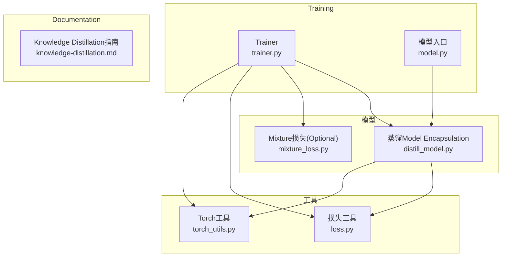
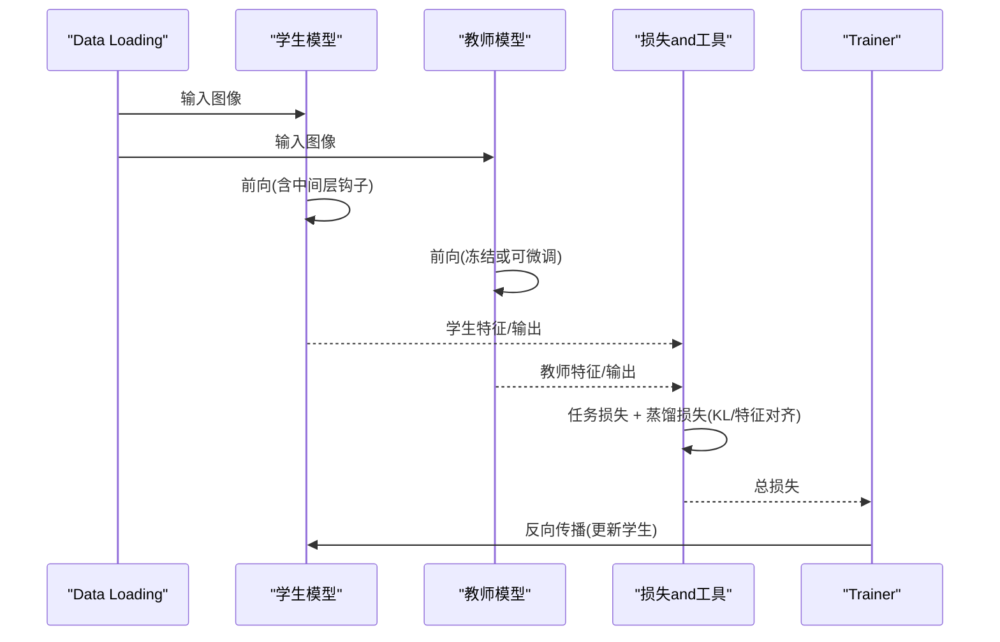
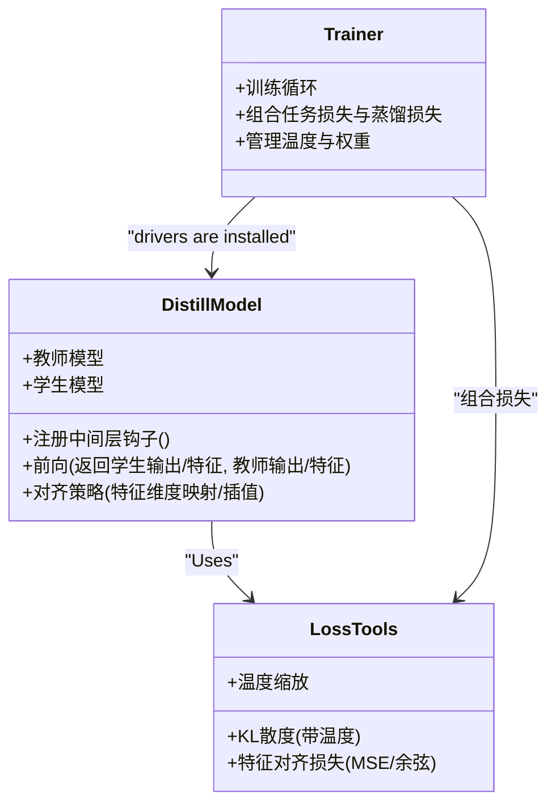
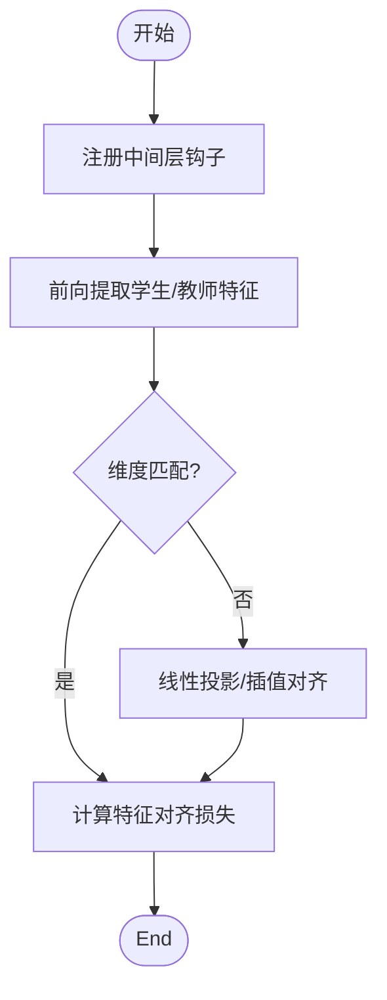
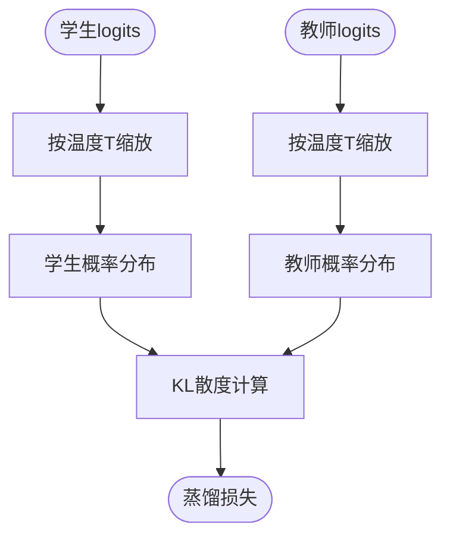
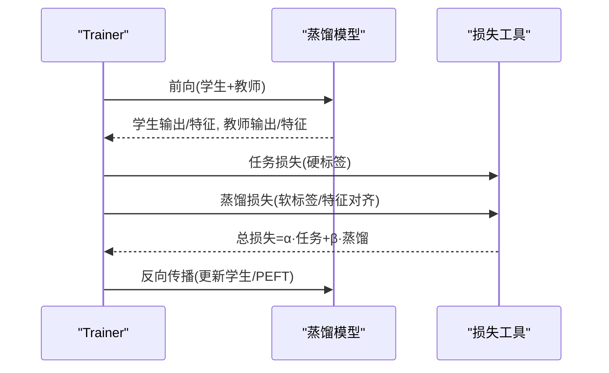
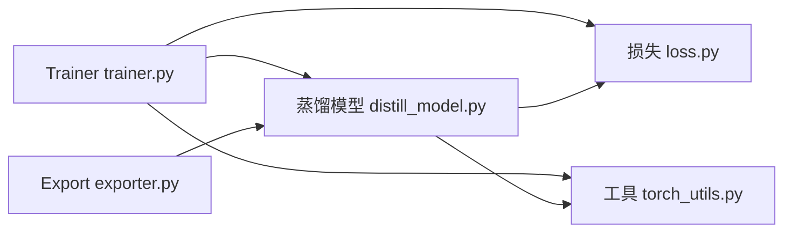

# Knowledge Distillation集成

<cite>
**Files Referenced in This Document**
- [distill_model.py](file://ultralytics/nn/distill_model.py)
- [mixture_loss.py](file://ultralytics/nn/mixture_loss.py)
- [trainer.py](file://ultralytics/engine/trainer.py)
- [model.py](file://ultralytics/engine/model.py)
- [exporter.py](file://ultralytics/engine/exporter.py)
- [loss.py](file://ultralytics/utils/loss.py)
- [torch_utils.py](file://ultralytics/utils/torch_utils.py)
- [knowledge-distillation.md](file://docs/en/guides/knowledge-distillation.md)
</cite>

## Table of Contents
1. [Introduction](#Introduction)
2. [Project Structure](#Project Structure)
3. [Core Components](#Core Components)
4. [Architecture Overview](#Architecture Overview)
5. [Detailed Component Analysis](#Detailed Component Analysis)
6. [Dependency Analysis](#Dependency Analysis)
7. [性能考量](#性能考量)
8. [Troubleshooting Guide](#Troubleshooting Guide)
9. [Conclusion](#Conclusion)
10. [Appendix](#Appendix)

## Introduction
本文件targetingYOLO-Master的Knowledge Distillation集成应用，系统性阐述教师-学生模型架构设计、PEFTwhile蒸馏中的作用、特征级and输出级蒸馏的implementing方法（含中间层Feature Extractionand对齐策略）、Training流程andLoss Function设计、温度参数调优andKL散度计算、Mobile DeploymentOptimization场景、效果Evaluation方法and量化Combining实践。DocumentationCentered on代码级分析andVisualizationfor主，帮助读者快速理解并落地蒸馏方案。

## Project Structure
本项目将Knowledge Distillationcapabilities集中while模型构建andTraining链路中：
- 模型侧：provides蒸馏Model Encapsulationand中间层钩子注册，Supporting多尺度特征对齐and输出级软标签蒸馏。
- Training侧：whileTrainer中组合Tasks损失and蒸馏损失，统一调度权重and温度。
- 工具侧：provides通用KL散度、温度缩放etc.算子andExport辅助。

Figure Source
- [distill_model.py](file://ultralytics/nn/distill_model.py)
- [mixture_loss.py](file://ultralytics/nn/mixture_loss.py)
- [trainer.py](file://ultralytics/engine/trainer.py)
- [model.py](file://ultralytics/engine/model.py)
- [loss.py](file://ultralytics/utils/loss.py)
- [torch_utils.py](file://ultralytics/utils/torch_utils.py)
- [knowledge-distillation.md](file://docs/en/guides/knowledge-distillation.md)

Section Source
- [distill_model.py](file://ultralytics/nn/distill_model.py)
- [trainer.py](file://ultralytics/engine/trainer.py)
- [model.py](file://ultralytics/engine/model.py)
- [loss.py](file://ultralytics/utils/loss.py)
- [torch_utils.py](file://ultralytics/utils/torch_utils.py)
- [knowledge-distillation.md](file://docs/en/guides/knowledge-distillation.md)

## Core Components
- 蒸馏Model Encapsulation：负责注入教师模型、注册中间层特征钩子、执行前向时同时收集学生and教师特征，并按配置进行特征对齐and输出蒸馏。
- Trainer集成：whileTraining循环中组合Tasks损失and蒸馏损失，管理温度、权重分配andGradient回传路径。
- 损失and工具：providesKL散度、温度缩放、特征对齐损失（such asMSE/余弦相似度）etc.基础算子；Optional的Mixture损失用于复杂Tasks场景。
- DocumentationandExamples：官方指南provides端to端Uses方式and最佳实践。

Section Source
- [distill_model.py](file://ultralytics/nn/distill_model.py)
- [trainer.py](file://ultralytics/engine/trainer.py)
- [loss.py](file://ultralytics/utils/loss.py)
- [torch_utils.py](file://ultralytics/utils/torch_utils.py)
- [knowledge-distillation.md](file://docs/en/guides/knowledge-distillation.md)

## Architecture Overview
下图展示教师-学生蒸馏的整体数据流and控制流：Training阶段并行或串行执行教师and学生前向，提取中间层特征and最终输出，计算Tasks损失and蒸馏损失后联合Optimization学生模型。

Figure Source
- [distill_model.py](file://ultralytics/nn/distill_model.py)
- [trainer.py](file://ultralytics/engine/trainer.py)
- [loss.py](file://ultralytics/utils/loss.py)
- [torch_utils.py](file://ultralytics/utils/torch_utils.py)

## Detailed Component Analysis

### 蒸馏Model Encapsulation（教师-学生架构and中间层对齐）
- 设计要点
  - 教师模型通常冻结Inference，仅用于provides软标签and中间层特征。
  - 学生模型Via钩子机制捕获指定层的特征图，并and教师对应层特征进行对齐。
  - 输出级蒸馏对分类头或Detection Head的logits进行温度缩放后计算KL散度。
- 关键implementing位置
  - 蒸馏Model Encapsulationand钩子注册：[distill_model.py](file://ultralytics/nn/distill_model.py)
  - TrainerCallsandLoss combination：[trainer.py](file://ultralytics/engine/trainer.py)
  - 损失and工具：KL散度、温度缩放etc.：[loss.py](file://ultralytics/utils/loss.py), [torch_utils.py](file://ultralytics/utils/torch_utils.py)

Figure Source
- [distill_model.py](file://ultralytics/nn/distill_model.py)
- [trainer.py](file://ultralytics/engine/trainer.py)
- [loss.py](file://ultralytics/utils/loss.py)
- [torch_utils.py](file://ultralytics/utils/torch_utils.py)

Section Source
- [distill_model.py](file://ultralytics/nn/distill_model.py)
- [trainer.py](file://ultralytics/engine/trainer.py)
- [loss.py](file://ultralytics/utils/loss.py)
- [torch_utils.py](file://ultralytics/utils/torch_utils.py)

### 特征级蒸馏：提取and对齐策略
- Feature Extraction
  - while学生模型的关键层注册钩子，获取中间特征张量。
  - 教师模型同样提取对应层级特征，确保语义一致性。
- 对齐策略
  - 维度不一致时采用线性投影或插值重采样至相同形状。
  - 常用损失包括MSE、余弦相似度或结构化正则项。
- implementingRefer to
  - 特征对齐and损失计算：[distill_model.py](file://ultralytics/nn/distill_model.py), [loss.py](file://ultralytics/utils/loss.py)

Figure Source
- [distill_model.py](file://ultralytics/nn/distill_model.py)
- [loss.py](file://ultralytics/utils/loss.py)

Section Source
- [distill_model.py](file://ultralytics/nn/distill_model.py)
- [loss.py](file://ultralytics/utils/loss.py)

### 输出级蒸馏：温度andKL散度
- 温度缩放
  - 对学生and教师的logits除Centered on温度T后再softmax，得to平滑的概率分布。
- KL散度
  - Centered on教师分布for“软目标”，最小化学生分布and教师分布之间的KL散度。
- implementingRefer to
  - KL散度and温度处理：[loss.py](file://ultralytics/utils/loss.py), [torch_utils.py](file://ultralytics/utils/torch_utils.py)

Figure Source
- [loss.py](file://ultralytics/utils/loss.py)
- [torch_utils.py](file://ultralytics/utils/torch_utils.py)

Section Source
- [loss.py](file://ultralytics/utils/loss.py)
- [torch_utils.py](file://ultralytics/utils/torch_utils.py)

### PEFTwhile蒸馏中的作用
- 角色定位
  - PEFT（such asLoRA）可while学生模型上仅微调Low-Rank Adaptation器，降低显存and算力需求，同时保持蒸馏收益。
  - while蒸馏过程中，PEFT参数参andGradient更新，而主干网络可冻结或半冻结，提升稳定性and效率。
- 集成点
  - Trainerwhile组合损失后，针对PEFT参数进行Optimization；蒸馏Modules仍可访问主干特征and输出。
- Refer to位置
  - Trainerand模型入口：[trainer.py](file://ultralytics/engine/trainer.py), [model.py](file://ultralytics/engine/model.py)

Section Source
- [trainer.py](file://ultralytics/engine/trainer.py)
- [model.py](file://ultralytics/engine/model.py)

### 蒸馏Training流程and损失权重分配
- Training流程
  - Data Loading → 学生/教师前向 → 提取特征and输出 → 计算Tasks损失and蒸馏损失 → 加权求和 → Backpropagation。
- 损失权重
  - Tasks损失权重and蒸馏损失权重可按阶段动态调整，例such as前期侧重Tasks学习，后期增强蒸馏引导。
- Refer to位置
  - Trainer组合逻辑：[trainer.py](file://ultralytics/engine/trainer.py)
  - 蒸馏Model Encapsulation：[distill_model.py](file://ultralytics/nn/distill_model.py)

Figure Source
- [trainer.py](file://ultralytics/engine/trainer.py)
- [distill_model.py](file://ultralytics/nn/distill_model.py)
- [loss.py](file://ultralytics/utils/loss.py)

Section Source
- [trainer.py](file://ultralytics/engine/trainer.py)
- [distill_model.py](file://ultralytics/nn/distill_model.py)
- [loss.py](file://ultralytics/utils/loss.py)

### 温度参数调优andKL散度计算
- 温度选择
  - 较低温度保留更多类别区分信息，较高温度使分布更平滑，利于小模型学习。
  - 建议网格搜索或基于Validation集Metrics进行调参。
- KL散度细节
  - 注意数值稳定（加极小常数），避免NaN；对多类别Tasks需逐类归一化或掩码处理。
- Refer to位置
  - KLand温度implementing：[loss.py](file://ultralytics/utils/loss.py), [torch_utils.py](file://ultralytics/utils/torch_utils.py)

Section Source
- [loss.py](file://ultralytics/utils/loss.py)
- [torch_utils.py](file://ultralytics/utils/torch_utils.py)

### Model Compressionand加速：Mobile DeploymentOptimization
- 蒸馏收益
  - 学生模型更小、更快，同时保持接近教师模型的精度。
- 部署路径
  - Exporting toONNX/TensorRT/TFLiteetc.格式，Combining量化（INT8/FP16）进一步压缩and加速。
- Refer to位置
  - Export工具链：[exporter.py](file://ultralytics/engine/exporter.py)
  - 官方部署指南and平台说明见Documentation站点（and本仓库配套）。

Section Source
- [exporter.py](file://ultralytics/engine/exporter.py)

### 蒸馏效果Evaluationand性能对比
- EvaluationMetrics
  - mAP、FPS、模型大小、内存占用、功耗etc.。
- 对比方法
  - 基线学生模型 vs 蒸馏学生模型；不同温度/权重配置下的消融实验。
- Refer to位置
  - TrainingandValidation流程：[trainer.py](file://ultralytics/engine/trainer.py)
  - 官方指南：[knowledge-distillation.md](file://docs/en/guides/knowledge-distillation.md)

Section Source
- [trainer.py](file://ultralytics/engine/trainer.py)
- [knowledge-distillation.md](file://docs/en/guides/knowledge-distillation.md)

### and量化技术的Combining
- Training后量化（PTQ）
  - 先完成蒸馏，再对Export模型进行校准and量化，获得更高吞吐and更低延迟。
- 量化感知Training（QAT）
  - while蒸馏Training中引入量化噪声模拟，进一步提升部署性能。
- Refer to位置
  - Exportand后端集成：[exporter.py](file://ultralytics/engine/exporter.py)

Section Source
- [exporter.py](file://ultralytics/engine/exporter.py)

## Dependency Analysis
- 耦合and内聚
  - 蒸馏Model Encapsulationand损失工具高内聚，Trainer作for编排者低耦合地组合各Modules。
- External Dependencies
  - 依赖PyTorch算子andExport Backends；可Viaexporter对接多种部署目标。
- Potential Cycles依赖
  - Trainer不直接依赖具体损失implementing，而是Via接口Calls，避免循环依赖。

Figure Source
- [trainer.py](file://ultralytics/engine/trainer.py)
- [distill_model.py](file://ultralytics/nn/distill_model.py)
- [loss.py](file://ultralytics/utils/loss.py)
- [torch_utils.py](file://ultralytics/utils/torch_utils.py)
- [exporter.py](file://ultralytics/engine/exporter.py)

Section Source
- [trainer.py](file://ultralytics/engine/trainer.py)
- [distill_model.py](file://ultralytics/nn/distill_model.py)
- [loss.py](file://ultralytics/utils/loss.py)
- [torch_utils.py](file://ultralytics/utils/torch_utils.py)
- [exporter.py](file://ultralytics/engine/exporter.py)

## 性能考量
- 批大小and温度
  - 较大批次有助于稳定KL散度估计；温度过高可能导致Gradient信号过弱。
- 特征对齐成本
  - 深层特征对齐可能带来额外计算开销，建议选择性对齐关键层。
- Exportand量化
  - CombiningTensorRT/ONNX RuntimeandINT8量化，显著提升移动端Inference速度。

## Troubleshooting Guide
- 常见错误
  - KL散度出现NaN：检查温度过小或概率分布未归一化。
  - 特征维度不匹配：确认对齐策略（投影/插值）是否正确。
  - Training不稳定：调整Tasks损失and蒸馏损失权重比例，或降低Learning Rate。
- 定位方法
  - 打印中间特征范数and分布统计；逐步关闭蒸馏损失ValidationTasks损失收敛性。
- Refer to位置
  - Trainerand损失implementing：[trainer.py](file://ultralytics/engine/trainer.py), [loss.py](file://ultralytics/utils/loss.py)

Section Source
- [trainer.py](file://ultralytics/engine/trainer.py)
- [loss.py](file://ultralytics/utils/loss.py)

## Conclusion
YOLO-Master的Knowledge Distillation集成Via蒸馏Model EncapsulationandTrainer编排，implementing了灵活的特征级and输出级蒸馏，并CombiningPEFTandExport工具链，形成从Trainingto部署的完整闭环。Set appropriately温度and损失权重、选择合适的对齐策略，并while部署阶段Combining量化技术，可while移动端etc.资源受限平台上获得显著的性能and效率提升。

## Appendix
- 官方指南and最佳实践
  - Knowledge Distillation指南：[knowledge-distillation.md](file://docs/en/guides/knowledge-distillation.md)
- 相关implementing文件
  - 蒸馏Model Encapsulation：[distill_model.py](file://ultralytics/nn/distill_model.py)
  - Trainer：[trainer.py](file://ultralytics/engine/trainer.py)
  - 损失and工具：[loss.py](file://ultralytics/utils/loss.py), [torch_utils.py](file://ultralytics/utils/torch_utils.py)
  - Export工具：[exporter.py](file://ultralytics/engine/exporter.py)