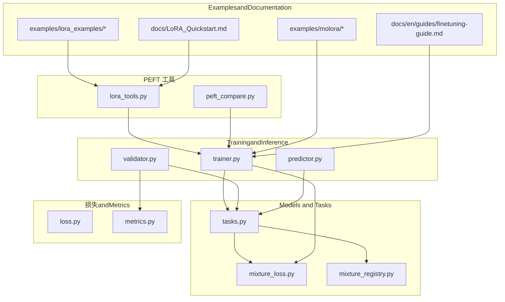
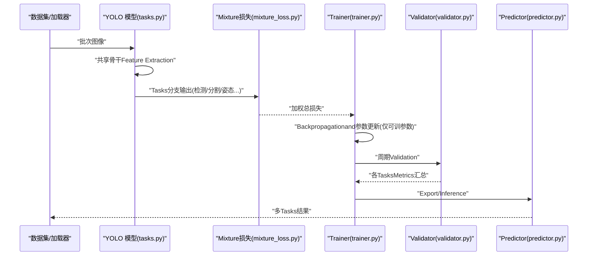
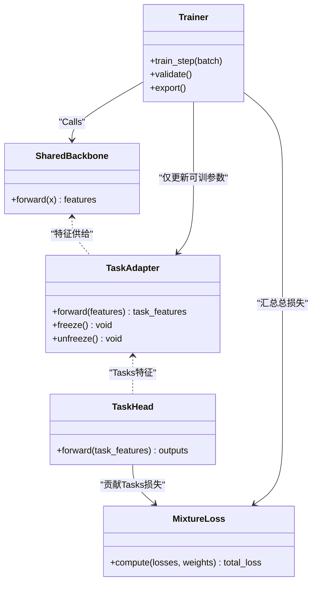
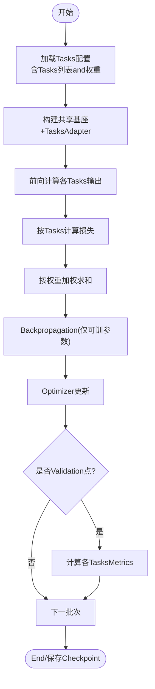
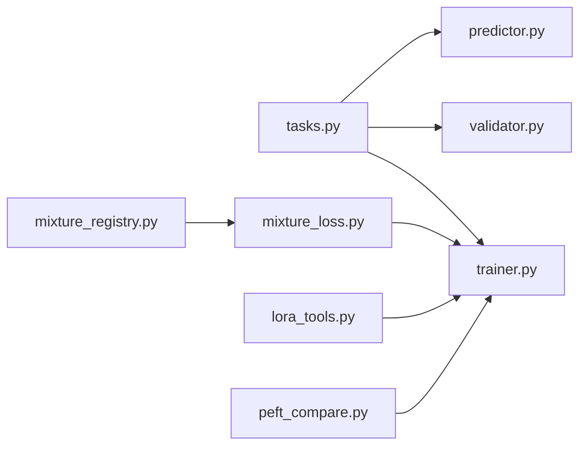

# 多Tasks学习应用

<cite>
**Files Referenced in This Document**
- [README.md](file://README.md)
- [yolo_master_advanced_modules_analysis.md](file://yolo_master_advanced_modules_analysis.md)
- [YOLO-Master-v260721-MoA-MoE-MoT-PEFT-Planner-深度分析-v4.md](file://YOLO-Master-v260721-MoA-MoE-MoT-PEFT-Planner-深度分析-v4.md)
- [molora_guide.md](file://molora_guide.md)
- [LoRA_Quickstart.md](file://docs/LoRA_Quickstart.md)
- [finetuning-guide.md](file://docs/en/guides/finetuning-guide.md)
- [yolo-architecture.md](file://docs/en/guides/yolo-architecture.md)
- [yolo-performance-metrics.md](file://docs/en/guides/yolo-performance-metrics.md)
- [train-args.md](file://docs/macros/train-args.md)
- [validation-args.md](file://docs/macros/validation-args.md)
- [predict-args.md](file://docs/macros/predict-args.md)
- [export-args.md](file://docs/macros/export-args.md)
- [augmentation-args.md](file://docs/macros/augmentation-args.md)
- [model-yaml-config.md](file://docs/en/guides/model-yaml-config.md)
- [mixture_loss.py](file://ultralytics/nn/mixture_loss.py)
- [mixture_registry.py](file://ultralytics/nn/mixture_registry.py)
- [tasks.py](file://ultralytics/nn/tasks.py)
- [trainer.py](file://ultralytics/engine/trainer.py)
- [validator.py](file://ultralytics/engine/validator.py)
- [predictor.py](file://ultralytics/engine/predictor.py)
- [loss.py](file://ultralytics/utils/loss.py)
- [metrics.py](file://ultralytics/utils/metrics.py)
- [lora_tools.py](file://agent/runtime/cli/lora_tools.py)
- [peft_compare.py](file://agent/runtime/cli/peft_compare.py)
- [test_mixture_loss_composition.py](file://tests/test_mixture_loss_composition.py)
- [test_moe_aware_peft.py](file://tests/test_moe_aware_peft.py)
- [test_peft_adapters.py](file://tests/test_peft_adapters.py)
- [run_lora_brain_tumor_sweep.sh](file://examples/lora_examples/run_lora_brain_tumor_sweep.sh)
- [run_yolo_master_lora_rank_sweep.py](file://examples/lora_examples/run_yolo_master_lora_rank_sweep.py)
- [compare_coco128_fast.py](file://examples/molora/compare_coco128_fast.py)
- [continual_learning.py](file://examples/molora/continual_learning.py)
</cite>

## Table of Contents
1. [Introduction](#Introduction)
2. [Project Structure](#Project Structure)
3. [Core Components](#Core Components)
4. [Architecture Overview](#Architecture Overview)
5. [Detailed Component Analysis](#Detailed Component Analysis)
6. [Dependency Analysis](#Dependency Analysis)
7. [性能考量](#性能考量)
8. [Troubleshooting Guide](#Troubleshooting Guide)
9. [Conclusion](#Conclusion)
10. [Appendix](#Appendix)

## Introduction
本文件targetingwhile YOLO-Master 上implementing“多Tasks学习 + Parameter-Efficient Fine-Tuning（PEFT）”的EngineersandResearchers，聚焦Centered on下目标：
- 解释共享基座andTasks特定Adapter的架构设计、参数共享策略andGradient隔离机制
- 说明多TasksTraining Configuration方法，包括Tasks权重平衡andLoss Function组合
- provides检测、分割、Pose Estimationetc.多Tasks联合Training的端to端Examples路径
- 阐述Tasks间知识Migration机制andOptimization策略
- 给出多Tasks学习的Evaluation方法andMetrics选择建议
- 展示工业检测系统同时处理多个视觉Tasks的实践方案

## Project Structure
围绕多Tasks学习and PEFT 的关键代码andDocumentation分布whilesuch as下位置：
- Models and Tasks定义：ultralytics/nn/tasks.py、ultralytics/nn/mixture_loss.py、ultralytics/nn/mixture_registry.py
- Training/Validation/Inference管线：ultralytics/engine/{trainer, validator, predictor}.py
- 损失andMetrics：ultralytics/utils/loss.py、ultralytics/utils/metrics.py
- PEFT/Lora 工具and对比脚本：agent/runtime/cli/{lora_tools, peft_compare}.py
- 测试用例：tests/test_mixture_loss_composition.py、tests/test_moe_aware_peft.py、tests/test_peft_adapters.py
- ExamplesandQuick Start：examples/lora_examples/*、examples/molora/*、docs/LoRA_Quickstart.md、docs/en/guides/finetuning-guide.md
- 宏参数Refer to：docs/macros/{train, validation, predict, export, augmentation}-args.md
- 架构and性能Documentation：docs/en/guides/{yolo-architecture, yolo-performance-metrics}.md

Figure Source
- [tasks.py](file://ultralytics/nn/tasks.py)
- [mixture_loss.py](file://ultralytics/nn/mixture_loss.py)
- [mixture_registry.py](file://ultralytics/nn/mixture_registry.py)
- [trainer.py](file://ultralytics/engine/trainer.py)
- [validator.py](file://ultralytics/engine/validator.py)
- [predictor.py](file://ultralytics/engine/predictor.py)
- [loss.py](file://ultralytics/utils/loss.py)
- [metrics.py](file://ultralytics/utils/metrics.py)
- [lora_tools.py](file://agent/runtime/cli/lora_tools.py)
- [peft_compare.py](file://agent/runtime/cli/peft_compare.py)
- [run_lora_brain_tumor_sweep.sh](file://examples/lora_examples/run_lora_brain_tumor_sweep.sh)
- [run_yolo_master_lora_rank_sweep.py](file://examples/lora_examples/run_yolo_master_lora_rank_sweep.py)
- [compare_coco128_fast.py](file://examples/molora/compare_coco128_fast.py)
- [continual_learning.py](file://examples/molora/continual_learning.py)
- [LoRA_Quickstart.md](file://docs/LoRA_Quickstart.md)
- [finetuning-guide.md](file://docs/en/guides/finetuning-guide.md)

Section Source
- [README.md](file://README.md)
- [yolo_master_advanced_modules_analysis.md](file://yolo_master_advanced_modules_analysis.md)
- [YOLO-Master-v260721-MoA-MoE-MoT-PEFT-Planner-深度分析-v4.md](file://YOLO-Master-v260721-MoA-MoE-MoT-PEFT-Planner-深度分析-v4.md)
- [molora_guide.md](file://molora_guide.md)

## Core Components
- 共享基座andTasks头
  - 共享Feature Extraction器（Backbone）while多Tasks中统一复用，降低参数量并促进跨Tasks表征Migration。
  - Tasks特定Adapter（such as LoRA、MoA/MoE 路由专家etc.）Centered on轻量Modules形式挂载于关键层或Tasks头前，implementing参数高效更新andGradient隔离。
- 多TasksLoss combination
  - ViaMixture损失Registryand组合器将不同Tasks的损失加权求和，Supporting动态权重andTasks感知调度。
- Training/Validation/Inference流水线
  - Trainer 负责多Tasks前向、损失计算、BackpropagationandOptimizer更新；Validator 聚合各TasksMetrics；Predictor Supporting多Tasks输出拼装。
- PEFT 工具链
  - LoRA 工具and对比脚本用于快速装配、冻结/解冻策略控制、Weight Mergingand评测对比。

Section Source
- [tasks.py](file://ultralytics/nn/tasks.py)
- [mixture_loss.py](file://ultralytics/nn/mixture_loss.py)
- [mixture_registry.py](file://ultralytics/nn/mixture_registry.py)
- [trainer.py](file://ultralytics/engine/trainer.py)
- [validator.py](file://ultralytics/engine/validator.py)
- [predictor.py](file://ultralytics/engine/predictor.py)
- [lora_tools.py](file://agent/runtime/cli/lora_tools.py)
- [peft_compare.py](file://agent/runtime/cli/peft_compare.py)

## Architecture Overview
下图展示了“共享基座 + 多TasksAdapter”的整体数据流and控制流：输入图像经共享Backbone Network得to通用特征，随后按Task Dispatchto各自AdapterandTasks头，分别计算Tasks损失并while Trainer 中汇总进行Backpropagation。

Figure Source
- [tasks.py](file://ultralytics/nn/tasks.py)
- [mixture_loss.py](file://ultralytics/nn/mixture_loss.py)
- [trainer.py](file://ultralytics/engine/trainer.py)
- [validator.py](file://ultralytics/engine/validator.py)
- [predictor.py](file://ultralytics/engine/predictor.py)

## Detailed Component Analysis

### 共享基座andTasks特定Adapter
- 参数共享策略
  - Backbone while所有Tasks中共享，最大化表征复用；Tasks头andAdapter独立，避免负Migration。
  - Via PEFT 规划器（见相关深度分析Documentation）自动识别可插入Adapter的位置，并Centered on最小改动注入。
- Gradient隔离机制
  - 仅对AdapterandTasks头参andBackpropagation；共享基座可Via冻结或低秩更新（such as LoRA）限制Gradient范围。
  - 多Tasks场景下，不同Tasks的Gradient仅while各自分支内累积，减少相互干扰。

Figure Source
- [tasks.py](file://ultralytics/nn/tasks.py)
- [mixture_loss.py](file://ultralytics/nn/mixture_loss.py)
- [trainer.py](file://ultralytics/engine/trainer.py)

Section Source
- [YOLO-Master-v260721-MoA-MoE-MoT-PEFT-Planner-深度分析-v4.md](file://YOLO-Master-v260721-MoA-MoE-MoT-PEFT-Planner-深度分析-v4.md)
- [molora_guide.md](file://molora_guide.md)
- [test_moe_aware_peft.py](file://tests/test_moe_aware_peft.py)
- [test_peft_adapters.py](file://tests/test_peft_adapters.py)

### 多TasksTraining ConfigurationandLoss combination
- Tasks权重平衡
  - UsesMixture损失Registryfor每个Tasks指定权重，Supporting静态权重and动态调度（such as基于Tasks难度或方差）。
  - 权重可while YAML 配置或命令行参数中设置，便于实验扫描and复现。
- Loss Function组合
  - 检测、分割、Pose Estimationand other tasks损失由Unified Interface组合，Trainer while每步计算加权总损失并进行Backpropagation。
  - 可Via测试用例Validation组合正确性and数值稳定性。

Figure Source
- [mixture_loss.py](file://ultralytics/nn/mixture_loss.py)
- [mixture_registry.py](file://ultralytics/nn/mixture_registry.py)
- [trainer.py](file://ultralytics/engine/trainer.py)
- [test_mixture_loss_composition.py](file://tests/test_mixture_loss_composition.py)

Section Source
- [mixture_loss.py](file://ultralytics/nn/mixture_loss.py)
- [mixture_registry.py](file://ultralytics/nn/mixture_registry.py)
- [test_mixture_loss_composition.py](file://tests/test_mixture_loss_composition.py)
- [train-args.md](file://docs/macros/train-args.md)

### 多Tasks联合TrainingExamples（检测 + 分割 + Pose Estimation）
- Examples入口
  - Uses LoRA Examples脚本and MOLORA Examples脚本作for起点，CombiningTasks YAML 配置完成多TasksTraining。
- 关键步骤
  - 准备多Tasks数据集（包含检测框、分割掩码、关键点标注），while数据配置中声明Tasks类型and类别数。
  - whileTraining Configuration中启用 PEFT（such as LoRA rank、target modules），并for各Tasks设置权重。
  - 启动Training后，Trainer 会执行多Tasks前向、Loss combinationandBackpropagation；Validator 周期性输出各TasksMetrics。
- Refer to路径
  - Examples脚本and配置文件路径见下方“Section Source”。

Section Source
- [run_lora_brain_tumor_sweep.sh](file://examples/lora_examples/run_lora_brain_tumor_sweep.sh)
- [run_yolo_master_lora_rank_sweep.py](file://examples/lora_examples/run_yolo_master_lora_rank_sweep.py)
- [compare_coco128_fast.py](file://examples/molora/compare_coco128_fast.py)
- [continual_learning.py](file://examples/molora/continual_learning.py)
- [LoRA_Quickstart.md](file://docs/LoRA_Quickstart.md)
- [finetuning-guide.md](file://docs/en/guides/finetuning-guide.md)
- [model-yaml-config.md](file://docs/en/guides/model-yaml-config.md)

### Tasks间知识Migration机制andOptimization策略
- 知识Migration
  - 共享Backbone Network承载通用视觉表征，有助于检测、分割、姿态and other tasks间的正Migration。
  - TasksAdapter保持相对独立，避免强耦合导致的负Migration。
- Optimization策略
  - 分阶段Training：先预Training共享基座，再解冻部分层或逐步引入更多Tasks。
  - 动态权重：根据Tasks损失变化或Validation集表现调整权重，缓解Tasks不平衡。
  - 正则化and早停：防止过拟合and灾难性遗忘。
  - Mixture精度andGradient裁剪：提升稳定性and吞吐。

Section Source
- [YOLO-Master-v260721-MoA-MoE-MoT-PEFT-Planner-深度分析-v4.md](file://YOLO-Master-v260721-MoA-MoE-MoT-PEFT-Planner-深度分析-v4.md)
- [molora_guide.md](file://molora_guide.md)
- [train-args.md](file://docs/macros/train-args.md)

### 多Tasks学习Evaluation方法andMetrics选择
- Metrics体系
  - 检测：mAP@0.5:0.95、Precision/Recall、F1 etc.
  - 分割：mIoU、Dice、边界 F1
  - Pose Estimation：AP、AP@50、OKS etc.
- Evaluation流程
  - Validator while每个Tasks上计算对应Metrics，并按Tasks维度汇总；可Export曲线and报告。
- Refer toDocumentation
  - 性能MetricsandVisualization指南见“性能Metrics”Documentation。

Section Source
- [validator.py](file://ultralytics/engine/validator.py)
- [metrics.py](file://ultralytics/utils/metrics.py)
- [yolo-performance-metrics.md](file://docs/en/guides/yolo-performance-metrics.md)

### 实际应用场景：工业检测系统（多Tasks并行）
- 场景描述
  - while同一产线上同时完成缺陷检测、部件分割and装配Pose Estimation，减少多次Inference开销，提高一致性。
- implementing要点
  - 数据侧：统一标注格式，确保三类Tasks样本对齐。
  - 模型侧：共享骨干 + TasksAdapter；Set appropriatelyTasks权重andLearning Rate。
  - 工程侧：Batch Inference时按Tasks拆分输出，统一Post-ProcessingandVisualization。
- Refer to路径
  - 参见“PredictionandExport”宏参数andInferenceExamples。

Section Source
- [predict-args.md](file://docs/macros/predict-args.md)
- [export-args.md](file://docs/macros/export-args.md)
- [predictor.py](file://ultralytics/engine/predictor.py)

## Dependency Analysis
- Modules耦合
  - tasks.py 作forModels and Tasks定义中心，被 trainer/validator/predictor 共同依赖。
  - mixture_loss.py and mixture_registry.py providesLoss combinationcapabilities，供 trainer Calls。
  - lora_tools.py and peft_compare.py provides PEFT 装配and对比评测capabilities。
- External Dependencies
  - PyTorch 生态（张量运算、自动微分）、Optional的加速后端（CUDA/TensorRT/ONNX etc.）。

Figure Source
- [tasks.py](file://ultralytics/nn/tasks.py)
- [mixture_loss.py](file://ultralytics/nn/mixture_loss.py)
- [mixture_registry.py](file://ultralytics/nn/mixture_registry.py)
- [trainer.py](file://ultralytics/engine/trainer.py)
- [validator.py](file://ultralytics/engine/validator.py)
- [predictor.py](file://ultralytics/engine/predictor.py)
- [lora_tools.py](file://agent/runtime/cli/lora_tools.py)
- [peft_compare.py](file://agent/runtime/cli/peft_compare.py)

Section Source
- [tasks.py](file://ultralytics/nn/tasks.py)
- [mixture_loss.py](file://ultralytics/nn/mixture_loss.py)
- [mixture_registry.py](file://ultralytics/nn/mixture_registry.py)
- [trainer.py](file://ultralytics/engine/trainer.py)
- [validator.py](file://ultralytics/engine/validator.py)
- [predictor.py](file://ultralytics/engine/predictor.py)
- [lora_tools.py](file://agent/runtime/cli/lora_tools.py)
- [peft_compare.py](file://agent/runtime/cli/peft_compare.py)

## 性能考量
- Training效率
  - UsesMixture精度、Gradient累积and数据并行（DDP）提升吞吐。
  - Set appropriately batch size and num_workers，避免 I/O bottlenecks。
- 显存占用
  - 冻结共享基座或UsesLow-Rank Adaptation器显著降低显存需求。
  - on-demand activationTasks分支，减少不必要的前向计算。
- 部署Optimization
  - Exporting to ONNX/TensorRT etc.格式，Combining量化and算子融合降低延迟。
  - 多Tasks输出缓存and批处理，提高while线服务吞吐。

[This section provides general guidance and does not directly analyze specific files]

## Troubleshooting Guide
- 常见问题
  - 多Tasks损失不收敛：检查Tasks权重是否失衡、Learning Rate是否过大、是否存while NaN。
  - Metrics异常：确认标签格式and类别映射是否正确，Validation集划分是否合理。
  - PEFT 未生效：确认目标Modules是否匹配、冻结/解冻策略是否正确。
- 定位手段
  - Uses对比脚本andLogging查看各Tasks损失andMetrics趋势。
  - Via单元测试ValidationLoss combinationand数值稳定性。

Section Source
- [peft_compare.py](file://agent/runtime/cli/peft_compare.py)
- [test_mixture_loss_composition.py](file://tests/test_mixture_loss_composition.py)
- [test_moe_aware_peft.py](file://tests/test_moe_aware_peft.py)
- [test_peft_adapters.py](file://tests/test_peft_adapters.py)

## Conclusion
YOLO-Master provides了完善的“共享基座 + TasksAdapter”的多Tasks学习框架，Combining PEFT 技术可implementing高效的参数共享andGradient隔离。ViaMixture损失Registryand灵活的Training/Validation/Inference管线，User可Centered onwhile检测、分割、Pose Estimationand other tasks上implementing稳定的联合TrainingandMigration学习。Combined with丰富的ExamplesandDocumentation，能够快速落地to工业级多Tasks视觉系统中。

[This section is summary content and does not directly analyze specific files]

## Appendix
- Quick Startand指南
  - LoRA 快速入门：docs/LoRA_Quickstart.md
  - 微调指南：docs/en/guides/finetuning-guide.md
  - 模型 YAML 配置：docs/en/guides/model-yaml-config.md
- 宏参数Refer to
  - Training/Validation/Prediction/Export/增强参数：docs/macros/*.md
- 架构and性能
  - YOLO 架构and性能Metrics：docs/en/guides/yolo-architecture.md、docs/en/guides/yolo-performance-metrics.md

[本节forRefer to资料索引，不直接分析具体文件]