# 隐私保护and联邦学习

<cite>
**Files Referenced in This Document**
- [README.md](file://README.md)
- [ultralytics/nn/peft/__init__.py](file://ultralytics/nn/peft/__init__.py)
- [ultralytics/utils/lora/__init__.py](file://ultralytics/utils/lora/__init__.py)
- [examples/lora_examples/yolo_master_lora_README.md](file://examples/lora_examples/yolo_master_lora_README.md)
- [scripts/ablation_suite/ablation_peft_coco128.py](file://scripts/ablation_suite/ablation_peft_coco128.py)
- [scripts/eval_moe_peft.py](file://scripts/eval_moe_peft.py)
- [tests/test_molora.py](file://tests/test_molora.py)
- [tests/test_molora_merge_semantics.py](file://tests/test_molora_merge_semantics.py)
- [tests/test_molora_routing_aware_merge.py](file://tests/test_molora_routing_aware_merge.py)
- [tests/test_vpeft.py](file://tests/test_vpeft.py)
- [ultralytics/vpeft/solver.py](file://ultralytics/vpeft/solver.py)
- [ultralytics/vpeft/policy.py](file://ultralytics/vpeft/policy.py)
- [ultralytics/vpeft/constraints.py](file://ultralytics/vpeft/constraints.py)
- [ultralytics/vpeft/graph.py](file://ultralytics/vpeft/graph.py)
- [ultralytics/engine/trainer.py](file://ultralytics/engine/trainer.py)
- [ultralytics/engine/model.py](file://ultralytics/engine/model.py)
- [ultralytics/utils/dist.py](file://ultralytics/utils/dist.py)
- [ultralytics/utils/export_capabilities.py](file://ultralytics/utils/export_capabilities.py)
- [docs/governance/model-registry.yaml](file://docs/governance/model-registry.yaml)
- [docs/governance/baseline-20260716.md](file://docs/governance/baseline-20260716.md)
</cite>

## Table of Contents
1. [Introduction](#Introduction)
2. [Project Structure](#Project Structure)
3. [Core Components](#Core Components)
4. [Architecture Overview](#Architecture Overview)
5. [Detailed Component Analysis](#Detailed Component Analysis)
6. [Dependency Analysis](#Dependency Analysis)
7. [Performance Considerations](#Performance Considerations)
8. [Troubleshooting Guide](#Troubleshooting Guide)
9. [Conclusion](#Conclusion)
10. [Appendix](#Appendix)

## Introduction
本文件targetingwhileYOLO-Master中落地“隐私保护+联邦学习”的EngineersandResearchers，聚焦Centered on下目标：
- 解释PEFT（Parameter-Efficient Fine-Tuning）while联邦学习中的优势and应用场景，包括本地微调and全局聚合策略。
- 说明差分隐私whilePEFTTraining中的应用要点（噪声添加、隐私预算控制）。
- 给出可落地的联邦学习implementing框架（客户端Training、服务器聚合、模型同步机制）。
- provides边缘设备上的隐私部署建议（模型加密and安全传输）。
- 介绍数据脱敏and匿名化方法，保护User隐私信息。
- 设计通信Optimization策略Centered on降低带宽消耗andTraining时间。
- Combining区块链思路implementing可追溯的模型版本管理。

## Project Structure
仓库围绕YOLO Series ModelsandPEFT生态组织，关键路径such as下：
- PEFTandLoRAcapabilities：位于nn/peftandutils/lora，providesAdapter注册、Weight Merging、Exportcapabilitiesetc.。
- VisualizationPEFT选择器vPEFT：位于vpeft，包含策略、约束、图搜索and求解器。
- TrainingandInference引擎：engine/trainerandengine/model负责Training循环、ValidationandExport。
- 分布式工具：utils/distprovides分布式相关辅助。
- 实验andEvaluation脚本：scripts下包含PEFT消融、EvaluationandMOLORA相关测试。
- 治理andDocumentation：docs/governance包含模型Registryand基线Documentation。

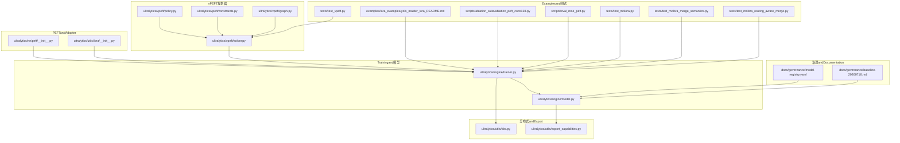

Figure Source
- [ultralytics/nn/peft/__init__.py](file://ultralytics/nn/peft/__init__.py)
- [ultralytics/utils/lora/__init__.py](file://ultralytics/utils/lora/__init__.py)
- [ultralytics/vpeft/solver.py](file://ultralytics/vpeft/solver.py)
- [ultralytics/vpeft/policy.py](file://ultralytics/vpeft/policy.py)
- [ultralytics/vpeft/constraints.py](file://ultralytics/vpeft/constraints.py)
- [ultralytics/vpeft/graph.py](file://ultralytics/vpeft/graph.py)
- [ultralytics/engine/trainer.py](file://ultralytics/engine/trainer.py)
- [ultralytics/engine/model.py](file://ultralytics/engine/model.py)
- [ultralytics/utils/dist.py](file://ultralytics/utils/dist.py)
- [ultralytics/utils/export_capabilities.py](file://ultralytics/utils/export_capabilities.py)
- [examples/lora_examples/yolo_master_lora_README.md](file://examples/lora_examples/yolo_master_lora_README.md)
- [scripts/ablation_suite/ablation_peft_coco128.py](file://scripts/ablation_suite/ablation_peft_coco128.py)
- [scripts/eval_moe_peft.py](file://scripts/eval_moe_peft.py)
- [tests/test_molora.py](file://tests/test_molora.py)
- [tests/test_molora_merge_semantics.py](file://tests/test_molora_merge_semantics.py)
- [tests/test_molora_routing_aware_merge.py](file://tests/test_molora_routing_aware_merge.py)
- [tests/test_vpeft.py](file://tests/test_vpeft.py)
- [docs/governance/model-registry.yaml](file://docs/governance/model-registry.yaml)
- [docs/governance/baseline-20260716.md](file://docs/governance/baseline-20260716.md)

Section Source
- [README.md](file://README.md)

## Core Components
- PEFTandLoRA适配层
  - providesAdapter注册、权重注入and合并capabilities，便于while大规模预Training模型上仅微调少量参数，降低通信and存储开销。
  - Refer to路径：[ultralytics/nn/peft/__init__.py](file://ultralytics/nn/peft/__init__.py)、[ultralytics/utils/lora/__init__.py](file://ultralytics/utils/lora/__init__.py)、[examples/lora_examples/yolo_master_lora_README.md](file://examples/lora_examples/yolo_master_lora_README.md)。
- vPEFT规划器
  - 基于策略、约束and图搜索，自动选择可微或离散化的PEFT方案，兼顾精度and效率。
  - Refer to路径：[ultralytics/vpeft/solver.py](file://ultralytics/vpeft/solver.py)、[ultralytics/vpeft/policy.py](file://ultralytics/vpeft/policy.py)、[ultralytics/vpeft/constraints.py](file://ultralytics/vpeft/constraints.py)、[ultralytics/vpeft/graph.py](file://ultralytics/vpeft/graph.py)、[tests/test_vpeft.py](file://tests/test_vpeft.py)。
- Trainingand模型引擎
  - trainer负责Training循环、ValidationandLogging；model负责加载、配置andExport；export_capabilities用于Exportcapabilities矩阵。
  - Refer to路径：[ultralytics/engine/trainer.py](file://ultralytics/engine/trainer.py)、[ultralytics/engine/model.py](file://ultralytics/engine/model.py)、[ultralytics/utils/export_capabilities.py](file://ultralytics/utils/export_capabilities.py)。
- 分布式and通信
  - utils/distprovides分布式辅助，便于后续扩展for联邦学习的客户端-服务器通信。
  - Refer to路径：[ultralytics/utils/dist.py](file://ultralytics/utils/dist.py)。
- 实验andEvaluation
  - ablation_peft_coco128.pyandeval_moe_peft.pyprovidesPEFT/MoE相关的TrainingandEvaluation流程入口。
  - Refer to路径：[scripts/ablation_suite/ablation_peft_coco128.py](file://scripts/ablation_suite/ablation_peft_coco128.py)、[scripts/eval_moe_peft.py](file://scripts/eval_moe_peft.py)。
- MOLORAandRouting-Aware Merging
  - tests覆盖MOLORA的语义、合并andRouting-Aware Merging，体现对MoE/路由结构的兼容。
  - Refer to路径：[tests/test_molora.py](file://tests/test_molora.py)、[tests/test_molora_merge_semantics.py](file://tests/test_molora_merge_semantics.py)、[tests/test_molora_routing_aware_merge.py](file://tests/test_molora_routing_aware_merge.py)。
- 治理and模型注册
  - model-registry.yamlandbaselineDocumentation定义模型版本and基线，可作for联邦学习中模型溯源的基础。
  - Refer to路径：[docs/governance/model-registry.yaml](file://docs/governance/model-registry.yaml)、[docs/governance/baseline-20260716.md](file://docs/governance/baseline-20260716.md)。

Section Source
- [ultralytics/nn/peft/__init__.py](file://ultralytics/nn/peft/__init__.py)
- [ultralytics/utils/lora/__init__.py](file://ultralytics/utils/lora/__init__.py)
- [examples/lora_examples/yolo_master_lora_README.md](file://examples/lora_examples/yolo_master_lora_README.md)
- [ultralytics/vpeft/solver.py](file://ultralytics/vpeft/solver.py)
- [ultralytics/vpeft/policy.py](file://ultralytics/vpeft/policy.py)
- [ultralytics/vpeft/constraints.py](file://ultralytics/vpeft/constraints.py)
- [ultralytics/vpeft/graph.py](file://ultralytics/vpeft/graph.py)
- [tests/test_vpeft.py](file://tests/test_vpeft.py)
- [ultralytics/engine/trainer.py](file://ultralytics/engine/trainer.py)
- [ultralytics/engine/model.py](file://ultralytics/engine/model.py)
- [ultralytics/utils/export_capabilities.py](file://ultralytics/utils/export_capabilities.py)
- [ultralytics/utils/dist.py](file://ultralytics/utils/dist.py)
- [scripts/ablation_suite/ablation_peft_coco128.py](file://scripts/ablation_suite/ablation_peft_coco128.py)
- [scripts/eval_moe_peft.py](file://scripts/eval_moe_peft.py)
- [tests/test_molora.py](file://tests/test_molora.py)
- [tests/test_molora_merge_semantics.py](file://tests/test_molora_merge_semantics.py)
- [tests/test_molora_routing_aware_merge.py](file://tests/test_molora_routing_aware_merge.py)
- [docs/governance/model-registry.yaml](file://docs/governance/model-registry.yaml)
- [docs/governance/baseline-20260716.md](file://docs/governance/baseline-20260716.md)

## Architecture Overview
下图展示whileYOLO-Master中构建“隐私保护+联邦学习”的整体架构：客户端侧UsesPEFT进行本地微调并Optional地加入差分隐私噪声；服务器端执行安全聚合and版本登记；边缘侧Via加密and压缩进行安全传输and部署。

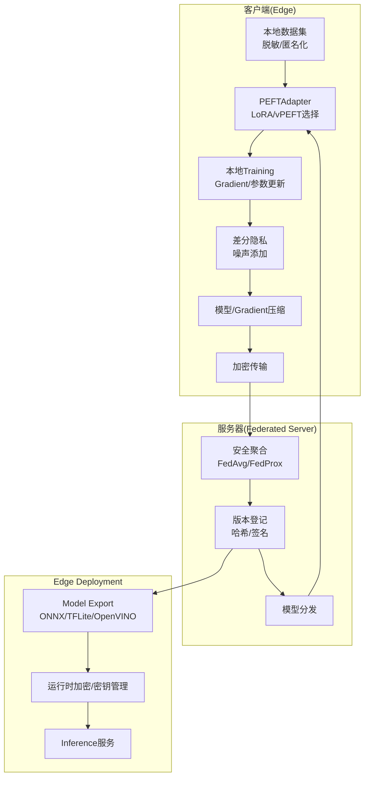

Figure Source
- [ultralytics/engine/trainer.py](file://ultralytics/engine/trainer.py)
- [ultralytics/engine/model.py](file://ultralytics/engine/model.py)
- [ultralytics/utils/export_capabilities.py](file://ultralytics/utils/export_capabilities.py)
- [ultralytics/utils/dist.py](file://ultralytics/utils/dist.py)
- [ultralytics/vpeft/solver.py](file://ultralytics/vpeft/solver.py)
- [ultralytics/nn/peft/__init__.py](file://ultralytics/nn/peft/__init__.py)
- [ultralytics/utils/lora/__init__.py](file://ultralytics/utils/lora/__init__.py)
- [docs/governance/model-registry.yaml](file://docs/governance/model-registry.yaml)

## Detailed Component Analysis

### 组件A：PEFTwhile联邦学习中的本地微调and全局聚合
- 本地微调
  - 利用PEFT仅更新少量参数（such asLoRA），显著降低通信量and内存占用，适合资源受限的边缘设备。
  - Training循环由trainerdrivers are installed，可while每个客户端独立运行。
- 全局聚合
  - 服务器端对来自多个客户端的PEFT增量进行加权平均（such asFedAvg），也可引入正则项（such asFedProx）提升稳定性。
  - 针对MoE/路由结构，可Refer toMOLORA的Routing-Aware Merging策略，确保专家权重and路由一致性。
- Applicable Scenarios
  - 多机构协作检测Tasks、跨域泛化、小样本快速适配。

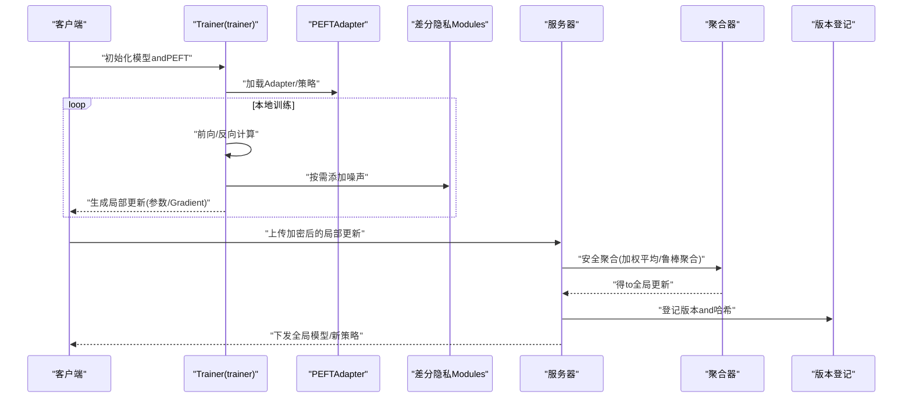

Figure Source
- [ultralytics/engine/trainer.py](file://ultralytics/engine/trainer.py)
- [ultralytics/nn/peft/__init__.py](file://ultralytics/nn/peft/__init__.py)
- [ultralytics/utils/lora/__init__.py](file://ultralytics/utils/lora/__init__.py)
- [tests/test_molora.py](file://tests/test_molora.py)
- [tests/test_molora_merge_semantics.py](file://tests/test_molora_merge_semantics.py)
- [tests/test_molora_routing_aware_merge.py](file://tests/test_molora_routing_aware_merge.py)
- [docs/governance/model-registry.yaml](file://docs/governance/model-registry.yaml)

Section Source
- [ultralytics/engine/trainer.py](file://ultralytics/engine/trainer.py)
- [ultralytics/nn/peft/__init__.py](file://ultralytics/nn/peft/__init__.py)
- [ultralytics/utils/lora/__init__.py](file://ultralytics/utils/lora/__init__.py)
- [tests/test_molora.py](file://tests/test_molora.py)
- [tests/test_molora_merge_semantics.py](file://tests/test_molora_merge_semantics.py)
- [tests/test_molora_routing_aware_merge.py](file://tests/test_molora_routing_aware_merge.py)
- [docs/governance/model-registry.yaml](file://docs/governance/model-registry.yaml)

### 组件B：差分隐私whilePEFTTraining中的应用
- 噪声添加
  - while客户端侧对局部更新（参数或Gradient）按批次或轮次添加噪声，Centered on限制单条样本对全局模型的贡献。
  - 可Combining裁剪策略控制更新范数，避免异常值放大隐私泄露风险。
- 隐私预算控制
  - 采用(ε, δ)-差分隐私框架，累计预算随Training轮次增长，需设置每轮预算上限and最大轮次。
  - 可Via自适应调度while早期阶段提高隐私强度，后期逐步放宽Centered on提升收敛性。
- andPEFT的Combining
  - 由于PEFT仅更新少量参数，噪声相对影响较小，更易while有限预算内获得可用精度。

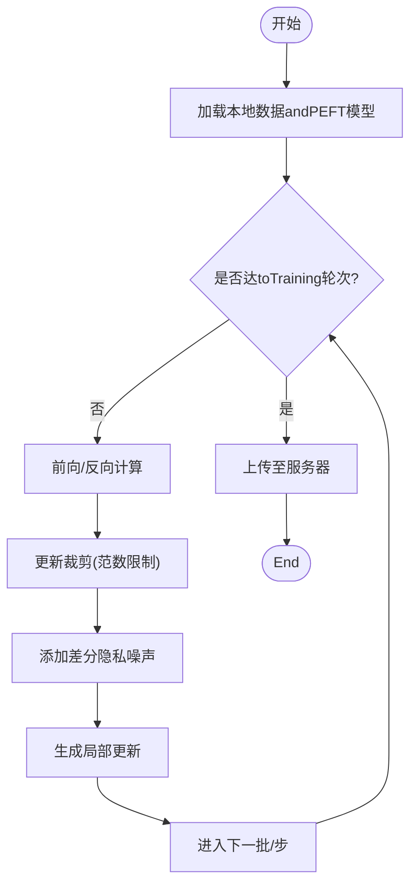

Figure Source
- [ultralytics/engine/trainer.py](file://ultralytics/engine/trainer.py)
- [ultralytics/nn/peft/__init__.py](file://ultralytics/nn/peft/__init__.py)
- [ultralytics/utils/lora/__init__.py](file://ultralytics/utils/lora/__init__.py)

Section Source
- [ultralytics/engine/trainer.py](file://ultralytics/engine/trainer.py)
- [ultralytics/nn/peft/__init__.py](file://ultralytics/nn/peft/__init__.py)
- [ultralytics/utils/lora/__init__.py](file://ultralytics/utils/lora/__init__.py)

### 组件C：vPEFT规划器and策略选择
- 策略and约束
  - policy定义Optional择的PEFT策略空间，constraints限定可行性条件（such as参数量、精度阈值、硬件预算）。
- 图搜索and求解
  - graph构建策略图，solver根据目标函数and约束进行搜索，输出最优或近似最优的PEFT配置。
- 联邦学习价值
  - while不同客户端异构数据分布and设备上，vPEFT可for各节点定制轻量且高效的微调方案，减少不必要的通信and计算。

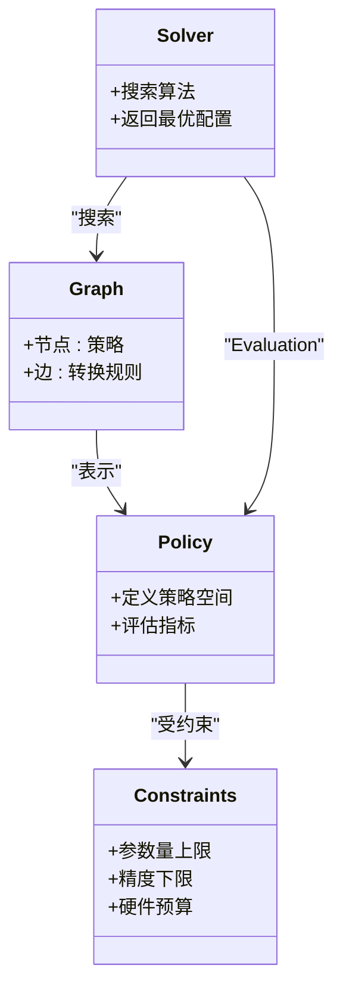

Figure Source
- [ultralytics/vpeft/policy.py](file://ultralytics/vpeft/policy.py)
- [ultralytics/vpeft/constraints.py](file://ultralytics/vpeft/constraints.py)
- [ultralytics/vpeft/graph.py](file://ultralytics/vpeft/graph.py)
- [ultralytics/vpeft/solver.py](file://ultralytics/vpeft/solver.py)
- [tests/test_vpeft.py](file://tests/test_vpeft.py)

Section Source
- [ultralytics/vpeft/policy.py](file://ultralytics/vpeft/policy.py)
- [ultralytics/vpeft/constraints.py](file://ultralytics/vpeft/constraints.py)
- [ultralytics/vpeft/graph.py](file://ultralytics/vpeft/graph.py)
- [ultralytics/vpeft/solver.py](file://ultralytics/vpeft/solver.py)
- [tests/test_vpeft.py](file://tests/test_vpeft.py)

### 组件D：MOLORAandRouting-Aware Merging（适用于MoE/Mixture专家）
- 语义and合并
  - 测试覆盖MOLORA的语义一致性and合并逻辑，确保whileMoE结构下的正确性。
- Routing-Aware Merging
  - while聚合时考虑路由分配，避免破坏专家and路由的一致性，提升整体性能and稳定性。
- 联邦学习意义
  - 当客户端参andMoE专家的选择andTraining时，Routing-Aware Merging能保持全局专家库的一致性and可用性。

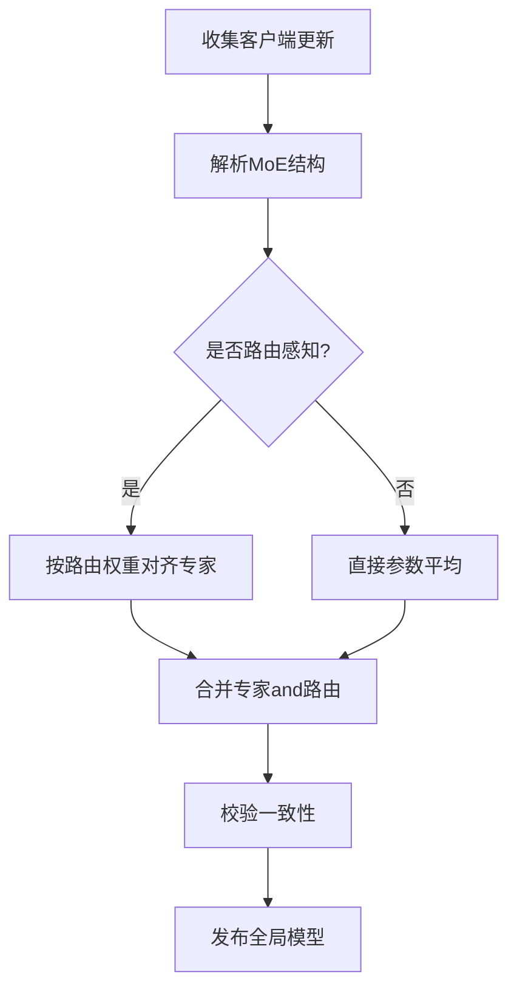

Figure Source
- [tests/test_molora.py](file://tests/test_molora.py)
- [tests/test_molora_merge_semantics.py](file://tests/test_molora_merge_semantics.py)
- [tests/test_molora_routing_aware_merge.py](file://tests/test_molora_routing_aware_merge.py)

Section Source
- [tests/test_molora.py](file://tests/test_molora.py)
- [tests/test_molora_merge_semantics.py](file://tests/test_molora_merge_semantics.py)
- [tests/test_molora_routing_aware_merge.py](file://tests/test_molora_routing_aware_merge.py)

### 组件E：边缘设备上的隐私保护部署
- Model Export
  - Usesexport_capabilitiesSupporting的格式（such asONNX、TFLite、OpenVINO）将PEFT合并后的Model Export，便于while边缘设备高效Inference。
- 安全传输and存储
  - while传输过程中UsesTLS/HTTPS，并while存储时对模型文件进行加密（such asAES），密钥由可信环境管理。
- 运行时防护
  - while边缘侧启用内存保护and反调试，限制模型权重明文暴露面。

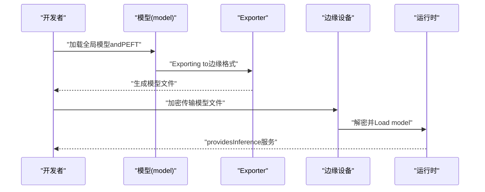

Figure Source
- [ultralytics/engine/model.py](file://ultralytics/engine/model.py)
- [ultralytics/utils/export_capabilities.py](file://ultralytics/utils/export_capabilities.py)

Section Source
- [ultralytics/engine/model.py](file://ultralytics/engine/model.py)
- [ultralytics/utils/export_capabilities.py](file://ultralytics/utils/export_capabilities.py)

### 组件F：数据脱敏and匿名化处理
- 脱敏策略
  - 对图像中的敏感区域进行模糊、裁剪或替换；对文本/元数据进行掩码或泛化。
- 匿名化
  - 去除可直接识别身份的字段，采用k-匿名或差分隐私采样etc.技术降低Re-Identification风险。
- 合规and审计
  - 记录Data processing流水线and版本，Combined with模型Registry进行端to端审计。

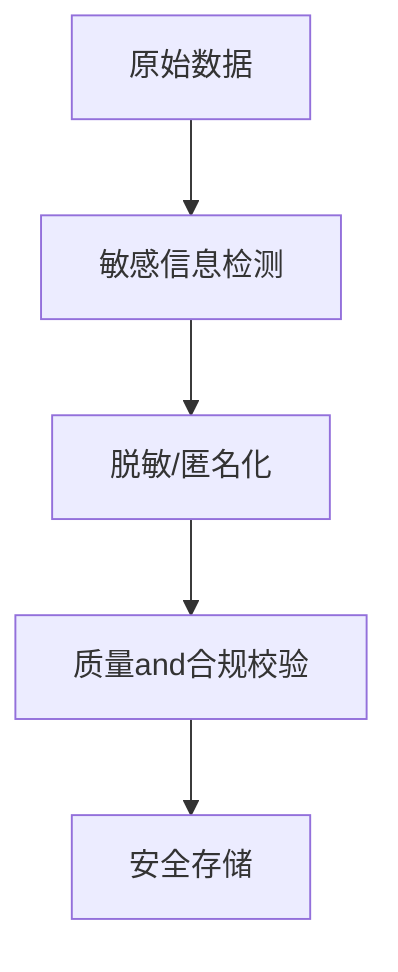

[本节for概念性内容，不直接分析具体源文件]

### 组件G：联邦学习通信Optimization策略
- 参数/Gradient压缩
  - 量化（低比特）、稀疏化（Top-k）、结构化剪枝，减少传输体积。
- 异步and分层聚合
  - 允许部分客户端延迟参and，采用分层聚合降低中心服务器压力。
- 早停and自适应轮次
  - 根据收敛情况动态调整轮次and批量大小，平衡隐私and效率。

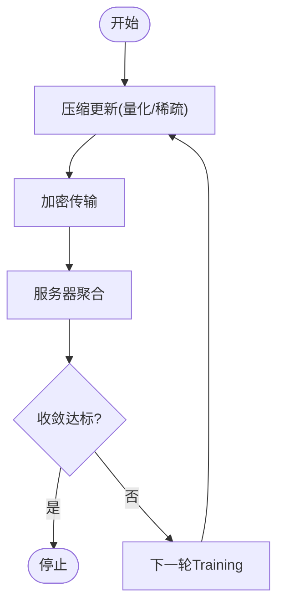

[本节for概念性内容，不直接分析具体源文件]

### 组件H：and区块链Combining的模型版本管理
- 链上存证
  - 将模型哈希、版本号、Training元数据写入不可篡改账本，implementing可追溯。
- 智能合约
  - 自动化审核and发布流程，确保只有经过Validation的模型被纳入全局版本库。
- and模型Registry集成
  - 将链上IDand本地model-registry.yaml关联，形成统一溯源体系。

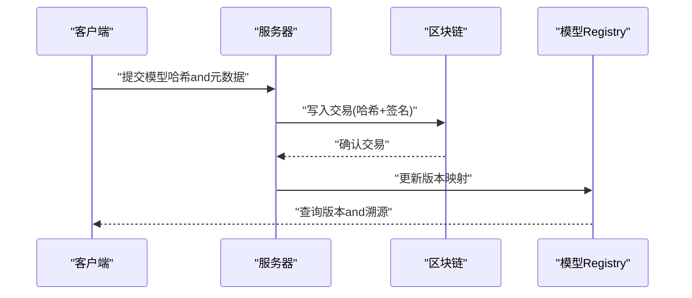

Figure Source
- [docs/governance/model-registry.yaml](file://docs/governance/model-registry.yaml)
- [docs/governance/baseline-20260716.md](file://docs/governance/baseline-20260716.md)

Section Source
- [docs/governance/model-registry.yaml](file://docs/governance/model-registry.yaml)
- [docs/governance/baseline-20260716.md](file://docs/governance/baseline-20260716.md)

## Dependency Analysis
- 组件耦合
  - trainer依赖PEFTandvPEFT进行本地Trainingand策略选择；model负责加载andExport；distprovides分布式基础。
- External Dependencies
  - Exportcapabilities矩阵andEdge Deployment格式由export_capabilities统一管理；治理Documentationfor版本溯源provides依据。
- 潜while环依赖
  - 当前结构清晰，未见明显环依赖；建议while新增联邦通信Modules时保持单向依赖（客户端→服务器）。

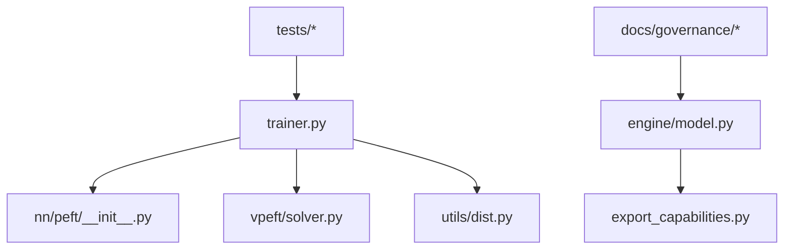

Figure Source
- [ultralytics/engine/trainer.py](file://ultralytics/engine/trainer.py)
- [ultralytics/nn/peft/__init__.py](file://ultralytics/nn/peft/__init__.py)
- [ultralytics/vpeft/solver.py](file://ultralytics/vpeft/solver.py)
- [ultralytics/engine/model.py](file://ultralytics/engine/model.py)
- [ultralytics/utils/export_capabilities.py](file://ultralytics/utils/export_capabilities.py)
- [ultralytics/utils/dist.py](file://ultralytics/utils/dist.py)
- [docs/governance/model-registry.yaml](file://docs/governance/model-registry.yaml)
- [docs/governance/baseline-20260716.md](file://docs/governance/baseline-20260716.md)

Section Source
- [ultralytics/engine/trainer.py](file://ultralytics/engine/trainer.py)
- [ultralytics/nn/peft/__init__.py](file://ultralytics/nn/peft/__init__.py)
- [ultralytics/vpeft/solver.py](file://ultralytics/vpeft/solver.py)
- [ultralytics/engine/model.py](file://ultralytics/engine/model.py)
- [ultralytics/utils/export_capabilities.py](file://ultralytics/utils/export_capabilities.py)
- [ultralytics/utils/dist.py](file://ultralytics/utils/dist.py)
- [docs/governance/model-registry.yaml](file://docs/governance/model-registry.yaml)
- [docs/governance/baseline-20260716.md](file://docs/governance/baseline-20260716.md)

## Performance Considerations
- 通信压缩
  - 量化and稀疏化可显著降低带宽；CombiningPEFT的小参数量，进一步减少传输成本。
- Training效率
  - UsesvPEFT自动选择轻量策略，避免全量微调带来的高开销。
- 边缘Inference
  - Exporting to合适格式（ONNX/TFLite/OpenVINO）并利用hardware acceleration，提升吞吐and降低延迟。
- 隐私-精度权衡
  - Set appropriately差分隐私预算and裁剪阈值，while隐私保护and模型性能间取得平衡。

[本节for通用指导，不直接分析具体源文件]

## Troubleshooting Guide
- Training不稳定
  - 检查差分隐私噪声强度and裁剪阈值；适当降低Learning Rate或增加正则项。
- 聚合失败
  - 核对客户端and服务器模型结构一致性；对于MoE/路由结构，确认Routing-Aware Merging已启用。
- Export异常
  - 查看export_capabilitiesSupporting矩阵；确保PEFT权重已正确合并to主干模型。
- 版本不一致
  - 对比model-registry.yaml中的版本信息and链上哈希；确保发布流程完整。

Section Source
- [ultralytics/engine/trainer.py](file://ultralytics/engine/trainer.py)
- [ultralytics/utils/export_capabilities.py](file://ultralytics/utils/export_capabilities.py)
- [docs/governance/model-registry.yaml](file://docs/governance/model-registry.yaml)

## Conclusion
ViawhileYOLO-Master中整合PEFT、vPEFTand治理Documentation，可Centered on构建一个可扩展、可追溯且隐私友好的联邦学习系统。Combining差分隐私、通信压缩andEdge DeploymentOptimization，能够while保障User隐私，显著提升协作Training的实用性and效率。未来可进一步探索更鲁棒的聚合算法and更强的隐私保证机制。

[本节for总结性内容，不直接分析具体源文件]

## Appendix
- 快速上手
  - Refer toLoRAExamplesandREADME，了解such as何whileYOLO-Master中UsesPEFT进行微调andExport。
  - Refer to路径：[examples/lora_examples/yolo_master_lora_README.md](file://examples/lora_examples/yolo_master_lora_README.md)、[README.md](file://README.md)。
- 实验andEvaluation
  - Usesablationandeval脚本复现实验结果，ValidationPEFTandMOLORA的效果。
  - Refer to路径：[scripts/ablation_suite/ablation_peft_coco128.py](file://scripts/ablation_suite/ablation_peft_coco128.py)、[scripts/eval_moe_peft.py](file://scripts/eval_moe_peft.py)。

Section Source
- [examples/lora_examples/yolo_master_lora_README.md](file://examples/lora_examples/yolo_master_lora_README.md)
- [README.md](file://README.md)
- [scripts/ablation_suite/ablation_peft_coco128.py](file://scripts/ablation_suite/ablation_peft_coco128.py)
- [scripts/eval_moe_peft.py](file://scripts/eval_moe_peft.py)