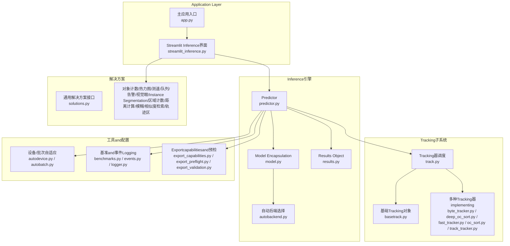
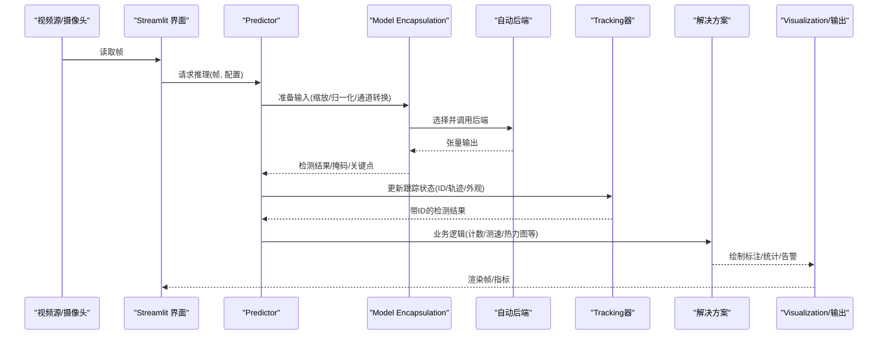
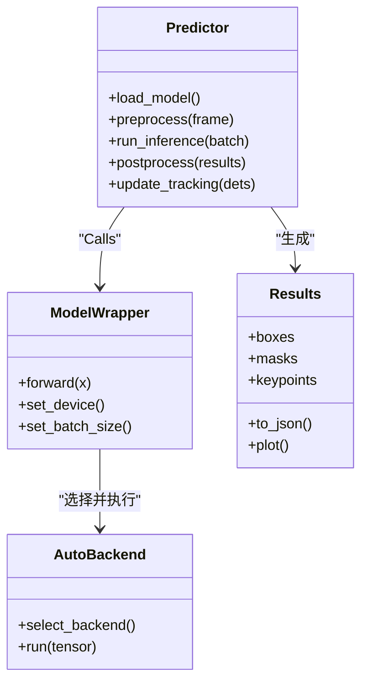
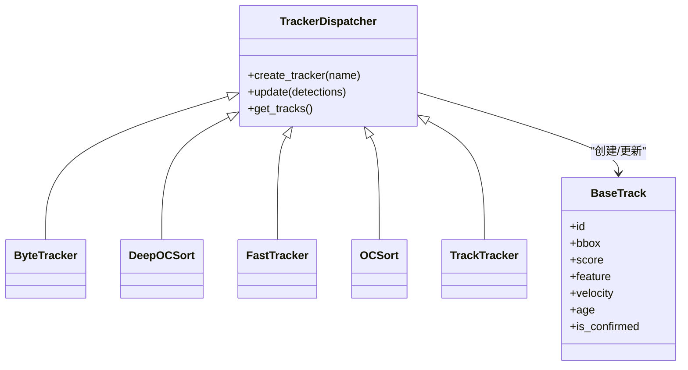
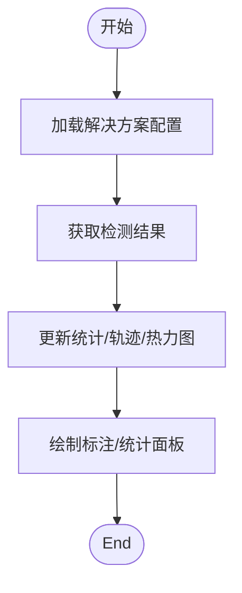
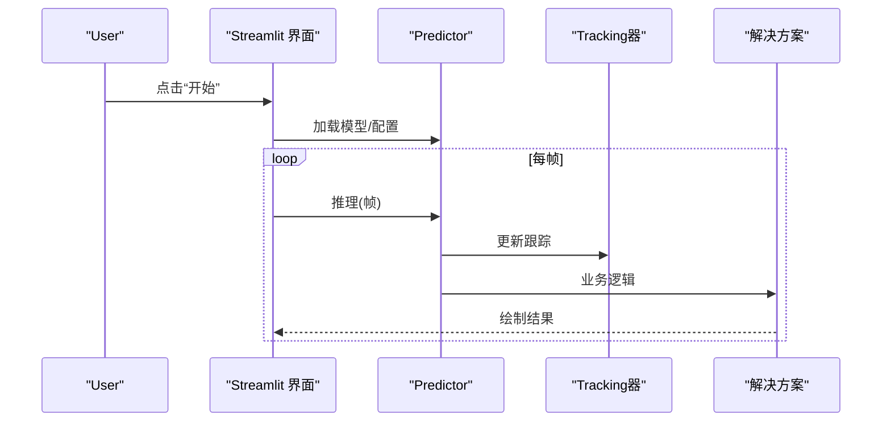
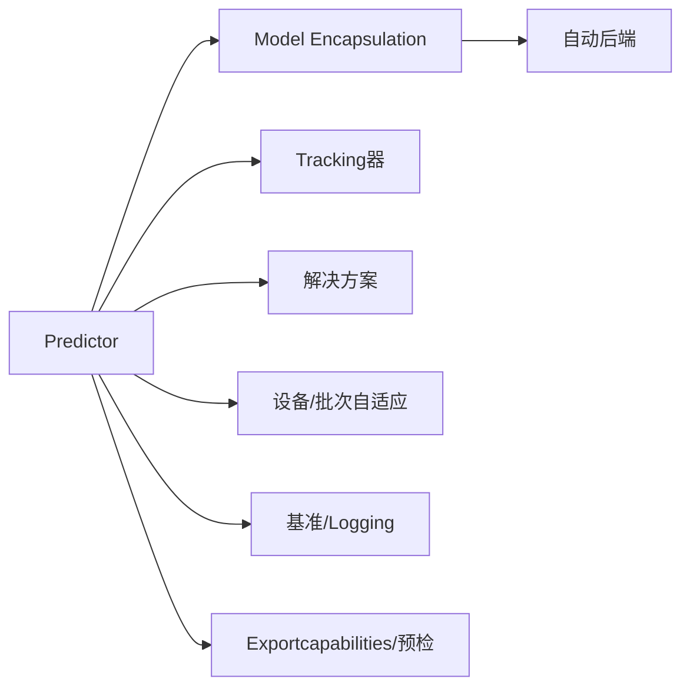

# 实时流式处理

<cite>
**Files Referenced in This Document**
- [app.py](file://app.py)
- [streamlit_inference.py](file://ultralytics/solutions/streamlit_inference.py)
- [predictor.py](file://ultralytics/engine/predictor.py)
- [model.py](file://ultralytics/engine/model.py)
- [autobackend.py](file://ultralytics/nn/autobackend.py)
- [results.py](file://ultralytics/engine/results.py)
- [track.py](file://ultralytics/trackers/track.py)
- [basetrack.py](file://ultralytics/trackers/basetrack.py)
- [byte_tracker.py](file://ultralytics/trackers/byte_tracker.py)
- [deep_oc_sort.py](file://ultralytics/trackers/deep_oc_sort.py)
- [fast_tracker.py](file://ultralytics/trackers/fast_tracker.py)
- [oc_sort.py](file://ultralytics/trackers/oc_sort.py)
- [track_tracker.py](file://ultralytics/trackers/track_tracker.py)
- [solutions.py](file://ultralytics/solutions/solutions.py)
- [object_counter.py](file://ultralytics/solutions/object_counter.py)
- [heatmap.py](file://ultralytics/solutions/heatmap.py)
- [speed_estimation.py](file://ultralytics/solutions/speed_estimation.py)
- [queue_management.py](file://ultralytics/solutions/queue_management.py)
- [security_alarm.py](file://ultralytics/solutions/security_alarm.py)
- [vision_eye.py](file://ultralytics/solutions/vision_eye.py)
- [ai_gym.py](file://ultralytics/solutions/ai_gym.py)
- [instance_segmentation.py](file://ultralytics/solutions/instance_segmentation.py)
- [region_counter.py](file://ultralytics/solutions/region_counter.py)
- [distance_calculation.py](file://ultralytics/solutions/distance_calculation.py)
- [object_blurrer.py](file://ultralytics/solutions/object_blurrer.py)
- [similarity_search.py](file://ultralytics/solutions/similarity_search.py)
- [trackzone.py](file://ultralytics/solutions/trackzone.py)
- [config.py](file://ultralytics/solutions/config.py)
- [torch_utils.py](file://ultralytics/utils/torch_utils.py)
- [autobatch.py](file://ultralytics/utils/autobatch.py)
- [autodevice.py](file://ultralytics/utils/autodevice.py)
- [benchmarks.py](file://ultralytics/utils/benchmarks.py)
- [events.py](file://ultralytics/utils/events.py)
- [logger.py](file://ultralytics/utils/logger.py)
- [errors.py](file://ultralytics/utils/errors.py)
- [export_capabilities.py](file://ultralytics/utils/export_capabilities.py)
- [export_preflight.py](file://ultralytics/utils/export_preflight.py)
- [export_validation.py](file://ultralytics/utils/export_validation.py)
- [peft_compare.py](file://agent/runtime/cli/peft_compare.py)
- [molora_guide.md](file://docs/molora_guide.md)
- [LoRA_Quickstart.md](file://docs/LoRA_Quickstart.md)
- [yolo-thread-safe-inference.md](file://docs/en/guides/yolo-thread-safe-inference.md)
- [streamlit-live-inference.md](file://docs/en/guides/streamlit-live-inference.md)
</cite>

## Table of Contents
1. [Introduction](#Introduction)
2. [Project Structure](#Project Structure)
3. [Core Components](#Core Components)
4. [Architecture Overview](#Architecture Overview)
5. [Detailed Component Analysis](#Detailed Component Analysis)
6. [Dependency Analysis](#Dependency Analysis)
7. [Performance Considerations](#Performance Considerations)
8. [Troubleshooting Guide](#Troubleshooting Guide)
9. [Conclusion](#Conclusion)
10. [Appendix](#Appendix)

## Introduction
本文件targetingwhile YOLO-Master 中构建“实时流式处理”应用的技术and工程实践，聚焦Centered on下目标：
- PEFT（such as LoRA）模型while实时系统中的部署策略、内存管理andInferenceOptimization
- 流式Data processing架构：数据缓冲、批处理and异步Inference机制
- 视频流处理的End-to-end pipeline：帧预处理、模型InferenceandPost-Processing
- 状态保持and上下文信息while连续帧处理中的应用
- 多线程and多进程并发设计，提升系统吞吐
- 性能监控and延迟Optimization方法，确保实时性
- 错误处理and异常恢复机制，保障稳定性

## Project Structure
本项目围绕 ultralytics 引擎and solutions 套件provides实时Inferencecapabilities。关键路径包括：
- 流式 UI andExamples入口：Streamlit 集成and演示脚本
- Inference引擎：Predictor、Model Encapsulation、自动后端选择
- Tracking子系统：多算法Tracking器and基础Tracking对象
- 解决方案Modules：计数、热力图、测速、区域统计etc.
- 工具and配置：设备/批次自适应、基准测试、事件Logging、Exportcapabilities检查

Figure Source
- [streamlit_inference.py](file://ultralytics/solutions/streamlit_inference.py)
- [app.py](file://app.py)
- [predictor.py](file://ultralytics/engine/predictor.py)
- [model.py](file://ultralytics/engine/model.py)
- [autobackend.py](file://ultralytics/nn/autobackend.py)
- [results.py](file://ultralytics/engine/results.py)
- [track.py](file://ultralytics/trackers/track.py)
- [basetrack.py](file://ultralytics/trackers/basetrack.py)
- [byte_tracker.py](file://ultralytics/trackers/byte_tracker.py)
- [deep_oc_sort.py](file://ultralytics/trackers/deep_oc_sort.py)
- [fast_tracker.py](file://ultralytics/trackers/fast_tracker.py)
- [oc_sort.py](file://ultralytics/trackers/oc_sort.py)
- [track_tracker.py](file://ultralytics/trackers/track_tracker.py)
- [solutions.py](file://ultralytics/solutions/solutions.py)
- [autodevice.py](file://ultralytics/utils/autodevice.py)
- [autobatch.py](file://ultralytics/utils/autobatch.py)
- [benchmarks.py](file://ultralytics/utils/benchmarks.py)
- [events.py](file://ultralytics/utils/events.py)
- [logger.py](file://ultralytics/utils/logger.py)
- [export_capabilities.py](file://ultralytics/utils/export_capabilities.py)
- [export_preflight.py](file://ultralytics/utils/export_preflight.py)
- [export_validation.py](file://ultralytics/utils/export_validation.py)

Section Source
- [streamlit_inference.py](file://ultralytics/solutions/streamlit_inference.py)
- [app.py](file://app.py)
- [predictor.py](file://ultralytics/engine/predictor.py)
- [model.py](file://ultralytics/engine/model.py)
- [autobackend.py](file://ultralytics/nn/autobackend.py)
- [results.py](file://ultralytics/engine/results.py)
- [track.py](file://ultralytics/trackers/track.py)
- [basetrack.py](file://ultralytics/trackers/basetrack.py)
- [byte_tracker.py](file://ultralytics/trackers/byte_tracker.py)
- [deep_oc_sort.py](file://ultralytics/trackers/deep_oc_sort.py)
- [fast_tracker.py](file://ultralytics/trackers/fast_tracker.py)
- [oc_sort.py](file://ultralytics/trackers/oc_sort.py)
- [track_tracker.py](file://ultralytics/trackers/track_tracker.py)
- [solutions.py](file://ultralytics/solutions/solutions.py)
- [autodevice.py](file://ultralytics/utils/autodevice.py)
- [autobatch.py](file://ultralytics/utils/autobatch.py)
- [benchmarks.py](file://ultralytics/utils/benchmarks.py)
- [events.py](file://ultralytics/utils/events.py)
- [logger.py](file://ultralytics/utils/logger.py)
- [export_capabilities.py](file://ultralytics/utils/export_capabilities.py)
- [export_preflight.py](file://ultralytics/utils/export_preflight.py)
- [export_validation.py](file://ultralytics/utils/export_validation.py)

## Core Components
- PredictorandModel Encapsulation
  - 负责Load model、选择后端、Executing Inference、返回结构化结果
  - and自动设备/批次自适应Modules协作，动态调整输入尺寸and批大小
- 自动后端选择
  - 根据可用硬件andExport格式选择最优运行时（such as ONNX/TensorRT/OpenVINO etc.）
- Tracking子系统
  - 统一Tracking接口，Supporting多种Tracking算法；维护目标 ID、轨迹、Appearance Featuresetc.上下文
- 解决方案Modules
  - provides开箱即用的业务逻辑：计数、热力图、测速、区域统计、告警、相似检索etc.
- 工具and配置
  - 设备探测、批次自适应、基准测试、事件Logging、Exportcapabilities校验and预检

Section Source
- [predictor.py](file://ultralytics/engine/predictor.py)
- [model.py](file://ultralytics/engine/model.py)
- [autobackend.py](file://ultralytics/nn/autobackend.py)
- [autodevice.py](file://ultralytics/utils/autodevice.py)
- [autobatch.py](file://ultralytics/utils/autobatch.py)
- [track.py](file://ultralytics/trackers/track.py)
- [basetrack.py](file://ultralytics/trackers/basetrack.py)
- [byte_tracker.py](file://ultralytics/trackers/byte_tracker.py)
- [deep_oc_sort.py](file://ultralytics/trackers/deep_oc_sort.py)
- [fast_tracker.py](file://ultralytics/trackers/fast_tracker.py)
- [oc_sort.py](file://ultralytics/trackers/oc_sort.py)
- [track_tracker.py](file://ultralytics/trackers/track_tracker.py)
- [solutions.py](file://ultralytics/solutions/solutions.py)
- [benchmarks.py](file://ultralytics/utils/benchmarks.py)
- [events.py](file://ultralytics/utils/events.py)
- [logger.py](file://ultralytics/utils/logger.py)
- [export_capabilities.py](file://ultralytics/utils/export_capabilities.py)
- [export_preflight.py](file://ultralytics/utils/export_preflight.py)
- [export_validation.py](file://ultralytics/utils/export_validation.py)

## Architecture Overview
下图展示从视频源toVisualization输出的完整实时流式处理链路，包含预处理、Inference、Tracking、Post-Processingand输出。

Figure Source
- [streamlit_inference.py](file://ultralytics/solutions/streamlit_inference.py)
- [predictor.py](file://ultralytics/engine/predictor.py)
- [model.py](file://ultralytics/engine/model.py)
- [autobackend.py](file://ultralytics/nn/autobackend.py)
- [track.py](file://ultralytics/trackers/track.py)
- [solutions.py](file://ultralytics/solutions/solutions.py)

## Detailed Component Analysis

### PredictorandResults Object
- 职责
  - 管理Inference生命周期：输入预处理、批量调度、结果解析、Visualization辅助
  - andTracking器交互，将检测转换for可追踪对象
- 关键流程
  - 输入预处理：尺寸适配、归一化、数据类型转换
  - Inference执行：ViaModel Encapsulationand自动后端进行加速Inference
  - 结果解析：置信度过滤、NMS、类别映射、坐标还原
  - Results Object：统一的检测结果容器，便于后续TrackingandVisualization

Figure Source
- [predictor.py](file://ultralytics/engine/predictor.py)
- [model.py](file://ultralytics/engine/model.py)
- [autobackend.py](file://ultralytics/nn/autobackend.py)
- [results.py](file://ultralytics/engine/results.py)

Section Source
- [predictor.py](file://ultralytics/engine/predictor.py)
- [model.py](file://ultralytics/engine/model.py)
- [autobackend.py](file://ultralytics/nn/autobackend.py)
- [results.py](file://ultralytics/engine/results.py)

### Tracking子系统
- 职责
  - for每帧检测结果分配稳定 ID，维护轨迹、Appearance Features、运动模型
  - provides多算法implementingCentered on适配不同场景（速度、遮挡、密集程度）
- 关键类
  - 基础Tracking对象：保存 ID、位置、速度、外观etc.上下文
  - Tracking器调度：Unified Interface，选择具体Tracking算法
  - 具体算法：ByteTrack、DeepOC-SORT、FastTracker、OC-SORT、Track-Tracker etc.

Figure Source
- [track.py](file://ultralytics/trackers/track.py)
- [basetrack.py](file://ultralytics/trackers/basetrack.py)
- [byte_tracker.py](file://ultralytics/trackers/byte_tracker.py)
- [deep_oc_sort.py](file://ultralytics/trackers/deep_oc_sort.py)
- [fast_tracker.py](file://ultralytics/trackers/fast_tracker.py)
- [oc_sort.py](file://ultralytics/trackers/oc_sort.py)
- [track_tracker.py](file://ultralytics/trackers/track_tracker.py)

Section Source
- [track.py](file://ultralytics/trackers/track.py)
- [basetrack.py](file://ultralytics/trackers/basetrack.py)
- [byte_tracker.py](file://ultralytics/trackers/byte_tracker.py)
- [deep_oc_sort.py](file://ultralytics/trackers/deep_oc_sort.py)
- [fast_tracker.py](file://ultralytics/trackers/fast_tracker.py)
- [oc_sort.py](file://ultralytics/trackers/oc_sort.py)
- [track_tracker.py](file://ultralytics/trackers/track_tracker.py)

### 解决方案Modules
- 职责
  - 基于检测结果implementing常见业务逻辑：计数、热力图、测速、区域统计、告警、相似检索、轨迹区etc.
- Typical Usage
  - while每帧Inference后Calls对应解决方案，对结果进行聚合andVisualization
  - andTracking器Combining，implementing跨帧稳定的统计and行for分析

Figure Source
- [solutions.py](file://ultralytics/solutions/solutions.py)
- [object_counter.py](file://ultralytics/solutions/object_counter.py)
- [heatmap.py](file://ultralytics/solutions/heatmap.py)
- [speed_estimation.py](file://ultralytics/solutions/speed_estimation.py)
- [queue_management.py](file://ultralytics/solutions/queue_management.py)
- [security_alarm.py](file://ultralytics/solutions/security_alarm.py)
- [vision_eye.py](file://ultralytics/solutions/vision_eye.py)
- [instance_segmentation.py](file://ultralytics/solutions/instance_segmentation.py)
- [region_counter.py](file://ultralytics/solutions/region_counter.py)
- [distance_calculation.py](file://ultralytics/solutions/distance_calculation.py)
- [object_blurrer.py](file://ultralytics/solutions/object_blurrer.py)
- [similarity_search.py](file://ultralytics/solutions/similarity_search.py)
- [trackzone.py](file://ultralytics/solutions/trackzone.py)

Section Source
- [solutions.py](file://ultralytics/solutions/solutions.py)
- [object_counter.py](file://ultralytics/solutions/object_counter.py)
- [heatmap.py](file://ultralytics/solutions/heatmap.py)
- [speed_estimation.py](file://ultralytics/solutions/speed_estimation.py)
- [queue_management.py](file://ultralytics/solutions/queue_management.py)
- [security_alarm.py](file://ultralytics/solutions/security_alarm.py)
- [vision_eye.py](file://ultralytics/solutions/vision_eye.py)
- [instance_segmentation.py](file://ultralytics/solutions/instance_segmentation.py)
- [region_counter.py](file://ultralytics/solutions/region_counter.py)
- [distance_calculation.py](file://ultralytics/solutions/distance_calculation.py)
- [object_blurrer.py](file://ultralytics/solutions/object_blurrer.py)
- [similarity_search.py](file://ultralytics/solutions/similarity_search.py)
- [trackzone.py](file://ultralytics/solutions/trackzone.py)

### Streamlit 实时Inference界面
- 职责
  - provides交互式 UI，连接视频源andInference引擎，展示实时结果
  - Supporting参数调节、结果Visualization、简单控制（开始/停止/重置）
- 关键流程
  - 初始化模型andTracking器
  - 循环读取帧，CallsPredictorand解决方案
  - 渲染结果to Streamlit 画布

Figure Source
- [streamlit_inference.py](file://ultralytics/solutions/streamlit_inference.py)
- [predictor.py](file://ultralytics/engine/predictor.py)
- [track.py](file://ultralytics/trackers/track.py)
- [solutions.py](file://ultralytics/solutions/solutions.py)

Section Source
- [streamlit_inference.py](file://ultralytics/solutions/streamlit_inference.py)

## Dependency Analysis
- 组件耦合
  - Predictor强依赖Model Encapsulationand自动后端；弱依赖Tracking器and解决方案
  - Tracking器依赖基础Tracking对象；各算法之间ViaUnified Interface解耦
  - 解决方案依赖检测结果andTracking结果，不直接依赖底层后端
- External Dependencies
  - 设备and批次自适应：autodevice、autobatch
  - 基准andLogging：benchmarks、events、logger
  - Exportcapabilitiesand预检：export_capabilities、export_preflight、export_validation

Figure Source
- [predictor.py](file://ultralytics/engine/predictor.py)
- [model.py](file://ultralytics/engine/model.py)
- [autobackend.py](file://ultralytics/nn/autobackend.py)
- [autodevice.py](file://ultralytics/utils/autodevice.py)
- [autobatch.py](file://ultralytics/utils/autobatch.py)
- [benchmarks.py](file://ultralytics/utils/benchmarks.py)
- [events.py](file://ultralytics/utils/events.py)
- [logger.py](file://ultralytics/utils/logger.py)
- [export_capabilities.py](file://ultralytics/utils/export_capabilities.py)
- [export_preflight.py](file://ultralytics/utils/export_preflight.py)
- [export_validation.py](file://ultralytics/utils/export_validation.py)

Section Source
- [predictor.py](file://ultralytics/engine/predictor.py)
- [model.py](file://ultralytics/engine/model.py)
- [autobackend.py](file://ultralytics/nn/autobackend.py)
- [autodevice.py](file://ultralytics/utils/autodevice.py)
- [autobatch.py](file://ultralytics/utils/autobatch.py)
- [benchmarks.py](file://ultralytics/utils/benchmarks.py)
- [events.py](file://ultralytics/utils/events.py)
- [logger.py](file://ultralytics/utils/logger.py)
- [export_capabilities.py](file://ultralytics/utils/export_capabilities.py)
- [export_preflight.py](file://ultralytics/utils/export_preflight.py)
- [export_validation.py](file://ultralytics/utils/export_validation.py)

## Performance Considerations
- 内存管理
  - 复用输入/输出缓冲区，避免频繁分配
  - Uses半精度或量化格式（若后端Supporting），降低显存占用
  - and时释放中间张量，减少峰值内存
- InferenceOptimization
  - 选择合适的后端（ONNX/TensorRT/OpenVINO），利用hardware acceleration
  - 动态调整输入尺寸and批大小，平衡延迟and吞吐
  - 启用内核融合and算子Optimization（由后端自动完成）
- 流式处理
  - 采用生产者-消费者模式：采集线程、Inference线程、Post-Processing线程分离
  - Uses有界队列缓冲帧，防止背压导致丢帧
  - 异步Inference：非阻塞提交Tasks，按序合并结果
- 监控and度量
  - 记录端to端延迟、每阶段耗时、GPU/CPU利用率
  - 设置阈值告警，当延迟超过 SLA 时自动降级（降低分辨率/关闭部分功能）

[本节for通用指导，无需特定文件引用]

## Troubleshooting Guide
- 常见问题定位
  - 设备不可用或显存不足：检查 autodevice 选择and后端兼容性
  - Export格式不Supporting：Uses export_capabilities and export_preflight 校验
  - Tracking丢失或 ID 抖动：调整Tracking器参数（匹配阈值、外观权重、丢失容忍度）
  - 结果不稳定：检查Confidence Threshold、NMS 参数、输入尺寸一致性
- Loggingand诊断
  - Uses logger and events 记录关键节点时间and异常
  - Uses benchmarks 收集延迟分布and吞吐Metrics
- 异常恢复
  - 捕获后端异常，回退to CPU 或较低精度模式
  - 对Tracking器进行状态复位，清理无效轨迹
  - 对视频源断连进行重连and缓冲补偿

Section Source
- [autodevice.py](file://ultralytics/utils/autodevice.py)
- [export_capabilities.py](file://ultralytics/utils/export_capabilities.py)
- [export_preflight.py](file://ultralytics/utils/export_preflight.py)
- [export_validation.py](file://ultralytics/utils/export_validation.py)
- [logger.py](file://ultralytics/utils/logger.py)
- [events.py](file://ultralytics/utils/events.py)
- [benchmarks.py](file://ultralytics/utils/benchmarks.py)
- [errors.py](file://ultralytics/utils/errors.py)

## Conclusion
YOLO-Master provides了完善的实时流式处理基础设施：从 Streamlit 界面toPredictor、自动后端、Tracking器and丰富的解决方案Modules。Via合理的内存管理、InferenceOptimization、异步流水线and并发设计，可while保证低延迟获得高吞吐。Combined withExportcapabilities校验、基准测试andLogging监控，可implementing稳定可靠的while线部署。

[本节for总结，无需特定文件引用]

## Appendix

### PEFT（LoRA/MoA）while实时系统的部署策略
- TrainingandValidation
  - Uses peft_compare 对比不同Adapterandrouting strategies的效果
  - Refer to molora_guide and LoRA_Quickstart 了解微调and打包流程
- Inference期策略
  - 按需加载Adapter权重，避免常驻大权重
  - 针对热点场景缓存常用Adapter，减少切换开销
  - Combining自动后端and动态批处理，最大化吞吐
- 内存and性能
  - Uses半精度/量化Centered on减少显存占用
  - Set appropriately rank and激活稀疏度，平衡精度and速度
  - 监控Adapter切换延迟，必要时预热and预取

Section Source
- [peft_compare.py](file://agent/runtime/cli/peft_compare.py)
- [molora_guide.md](file://docs/molora_guide.md)
- [LoRA_Quickstart.md](file://docs/LoRA_Quickstart.md)

### 线程安全and并发建议
- 单实例多线程
  - 遵循线程安全Inference指南，避免共享状态竞争
  - Uses锁保护全局配置and模型指针
- 多进程并行
  - 每个进程独立模型实例，避免 GPU 资源争用
  - Uses进程间队列传递帧and结果，注意序列化开销

Section Source
- [yolo-thread-safe-inference.md](file://docs/en/guides/yolo-thread-safe-inference.md)

### Streamlit 实时InferenceExamples要点
- 初始化阶段
  - Load modelandTracking器，预热一次InferenceCentered on降低首帧延迟
- 运行阶段
  - 循环读取帧，CallsPredictorand解决方案
  - 渲染结果to Streamlit 画布，provides交互控件
- 退出阶段
  - 释放资源，关闭视频源，清理临时文件

Section Source
- [streamlit_live-inference.md](file://docs/en/guides/streamlit-live-inference.md)
- [streamlit_inference.py](file://ultralytics/solutions/streamlit_inference.py)