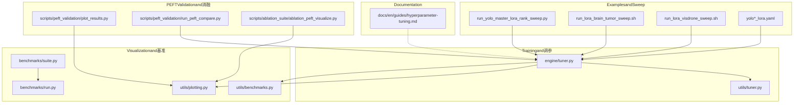
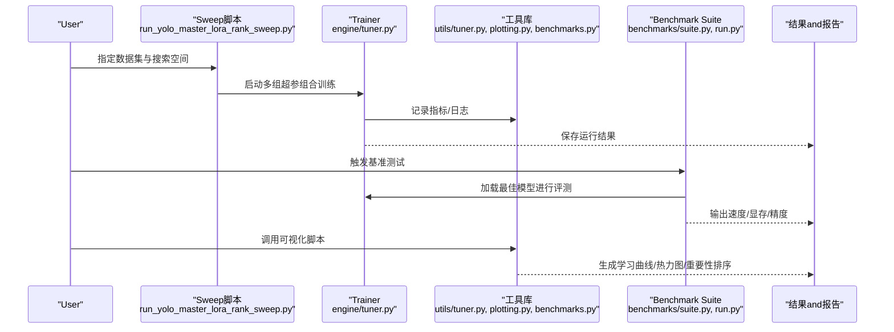
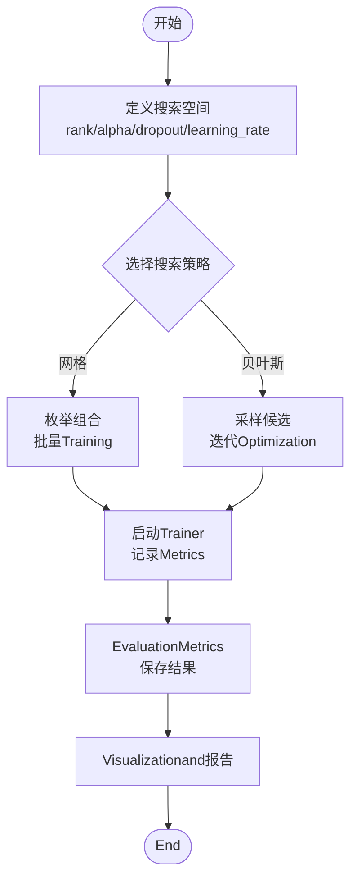
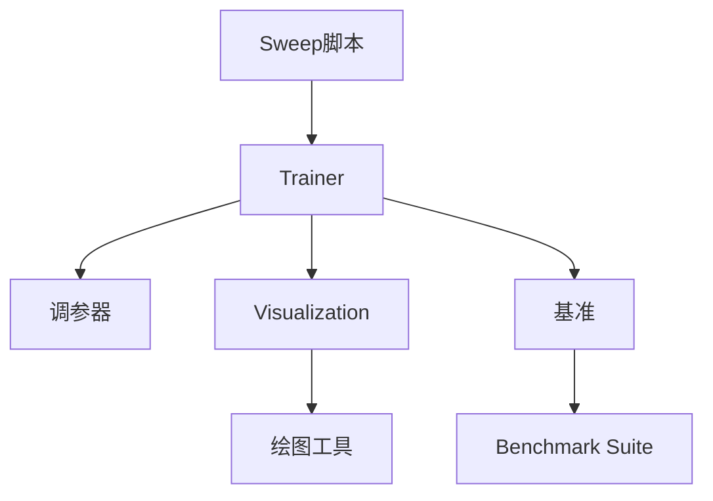

# 超参数调优指南

<cite>
**Files Referenced in This Document**
- [examples/lora_examples/run_yolo_master_lora_rank_sweep.py](file://examples/lora_examples/run_yolo_master_lora_rank_sweep.py)
- [examples/lora_examples/run_lora_brain_tumor_sweep.sh](file://examples/lora_examples/run_lora_brain_tumor_sweep.sh)
- [examples/lora_examples/run_lora_visdrone_sweep.sh](file://examples/lora_examples/run_lora_visdrone_sweep.sh)
- [examples/lora_examples/yolo11_lora.yaml](file://examples/lora_examples/yolo11_lora.yaml)
- [examples/lora_examples/yolo12_lora.yaml](file://examples/lora_examples/yolo12_lora.yaml)
- [examples/lora_examples/yolov8_lora.yaml](file://examples/lora_examples/yolov8_lora.yaml)
- [examples/lora_examples/yolo_master_lora_README.md](file://examples/lora_examples/yolo_master_lora_README.md)
- [ultralytics/utils/tuner.py](file://ultralytics/utils/tuner.py)
- [ultralytics/engine/tuner.py](file://ultralytics/engine/tuner.py)
- [ultralytics/utils/plotting.py](file://ultralytics/utils/plotting.py)
- [ultralytics/utils/benchmarks.py](file://ultralytics/utils/benchmarks.py)
- [scripts/ablation_suite/ablation_peft_visualize.py](file://scripts/ablation_suite/ablation_peft_visualize.py)
- [scripts/peft_validation/plot_results.py](file://scripts/peft_validation/plot_results.py)
- [scripts/peft_validation/run_peft_compare.py](file://scripts/peft_validation/run_peft_compare.py)
- [benchmarks/suite.py](file://benchmarks/suite.py)
- [benchmarks/run.py](file://benchmarks/run.py)
- [examples/molora/compare_coco128_fast.py](file://examples/molora/compare_coco128_fast.py)
- [examples/molora/compare_lora_molora.py](file://examples/molora/compare_lora_molora.py)
- [examples/molora/basic_finetune.py](file://examples/molora/basic_finetune.py)
- [docs/en/guides/hyperparameter-tuning.md](file://docs/en/guides/hyperparameter-tuning.md)
</cite>

## Table of Contents
1. [Introduction](#Introduction)
2. [Project Structure](#Project Structure)
3. [Core Components](#Core Components)
4. [Architecture Overview](#Architecture Overview)
5. [Detailed Component Analysis](#Detailed Component Analysis)
6. [Dependency Analysis](#Dependency Analysis)
7. [性能考量](#性能考量)
8. [Troubleshooting Guide](#Troubleshooting Guide)
9. [Conclusion](#Conclusion)
10. [Appendix](#Appendix)

## Introduction
本指南targetingwhileYOLO-Master上UsesPEFT（Centered onLoRAfor主）进行高效微调的EngineersandResearchers，聚焦Centered on下目标：
- 解释LoRA关键超参数的作用and调优策略（rank、alpha、dropout、learning_rateetc.）
- provides网格搜索and贝叶斯Optimization的自动化调参方法，包括sweep脚本的Usesand配置
- 总结不同数据集andTasks的最佳超参数范围and经验值
- Documentation化超参数敏感性分析and重要性排序方法
- 建立自动化的批量实验管理and结果Tracking系统
- 解释Learning Rate调度、权重衰减and正则化技术的调优方法
- 包含性能基准测试and收敛性分析
- provides调优结果的Visualizationand报告生成工具
- 给出过拟合检测and防止策略

## Project Structure
围绕PEFT/LoRA超参调优的相关代码and资源主要分布whilesuch as下位置：
- ExamplesandSweep脚本：examples/lora_examples
- Trainerand调参器：ultralytics/engine/tuner.py、ultralytics/utils/tuner.py
- Visualizationand基准：ultralytics/utils/plotting.py、ultralytics/utils/benchmarks.py、benchmarks/*
- PEFTValidationand对比：scripts/peft_validation/*
- 消融andVisualization：scripts/ablation_suite/*
- Documentation：docs/en/guides/hyperparameter-tuning.md

Figure Source
- [examples/lora_examples/run_yolo_master_lora_rank_sweep.py](file://examples/lora_examples/run_yolo_master_lora_rank_sweep.py)
- [examples/lora_examples/run_lora_brain_tumor_sweep.sh](file://examples/lora_examples/run_lora_brain_tumor_sweep.sh)
- [examples/lora_examples/run_lora_visdrone_sweep.sh](file://examples/lora_examples/run_lora_visdrone_sweep.sh)
- [examples/lora_examples/yolo11_lora.yaml](file://examples/lora_examples/yolo11_lora.yaml)
- [examples/lora_examples/yolo12_lora.yaml](file://examples/lora_examples/yolo12_lora.yaml)
- [examples/lora_examples/yolov8_lora.yaml](file://examples/lora_examples/yolov8_lora.yaml)
- [ultralytics/engine/tuner.py](file://ultralytics/engine/tuner.py)
- [ultralytics/utils/tuner.py](file://ultralytics/utils/tuner.py)
- [ultralytics/utils/plotting.py](file://ultralytics/utils/plotting.py)
- [ultralytics/utils/benchmarks.py](file://ultralytics/utils/benchmarks.py)
- [benchmarks/suite.py](file://benchmarks/suite.py)
- [benchmarks/run.py](file://benchmarks/run.py)
- [scripts/peft_validation/plot_results.py](file://scripts/peft_validation/plot_results.py)
- [scripts/peft_validation/run_peft_compare.py](file://scripts/peft_validation/run_peft_compare.py)
- [scripts/ablation_suite/ablation_peft_visualize.py](file://scripts/ablation_suite/ablation_peft_visualize.py)
- [docs/en/guides/hyperparameter-tuning.md](file://docs/en/guides/hyperparameter-tuning.md)

Section Source
- [examples/lora_examples/run_yolo_master_lora_rank_sweep.py](file://examples/lora_examples/run_yolo_master_lora_rank_sweep.py)
- [examples/lora_examples/run_lora_brain_tumor_sweep.sh](file://examples/lora_examples/run_lora_brain_tumor_sweep.sh)
- [examples/lora_examples/run_lora_visdrone_sweep.sh](file://examples/lora_examples/run_lora_visdrone_sweep.sh)
- [examples/lora_examples/yolo11_lora.yaml](file://examples/lora_examples/yolo11_lora.yaml)
- [examples/lora_examples/yolo12_lora.yaml](file://examples/lora_examples/yolo12_lora.yaml)
- [examples/lora_examples/yolov8_lora.yaml](file://examples/lora_examples/yolov8_lora.yaml)
- [ultralytics/engine/tuner.py](file://ultralytics/engine/tuner.py)
- [ultralytics/utils/tuner.py](file://ultralytics/utils/tuner.py)
- [ultralytics/utils/plotting.py](file://ultralytics/utils/plotting.py)
- [ultralytics/utils/benchmarks.py](file://ultralytics/utils/benchmarks.py)
- [benchmarks/suite.py](file://benchmarks/suite.py)
- [benchmarks/run.py](file://benchmarks/run.py)
- [scripts/peft_validation/plot_results.py](file://scripts/peft_validation/plot_results.py)
- [scripts/peft_validation/run_peft_compare.py](file://scripts/peft_validation/run_peft_compare.py)
- [scripts/ablation_suite/ablation_peft_visualize.py](file://scripts/ablation_suite/ablation_peft_visualize.py)
- [docs/en/guides/hyperparameter-tuning.md](file://docs/en/guides/hyperparameter-tuning.md)

## Core Components
- LoRA关键超参数
  - rank：低秩矩阵的秩，控制可Training参数规模and表达capabilities。通常从较小值开始，逐步增大观察收益递减点。
  - alpha：缩放系数，影响LoRA更新幅度。常andrankCombined withUses，保持alpha/rank比值稳定有助于稳定性。
  - dropout：LoRAModules内的随机失活，用于缓解过拟合，尤其while数据量有限时有效。
  - learning_rate：主Learning Rate，对收敛速度and稳定性至关重要；建议Combining调度器andwarmup。
- Trainingand调参引擎
  - Trainer负责Load model、数据、Optimizerand调度器，执行Training循环并记录Metrics。
  - 调参器Encapsulates了搜索策略（网格/贝叶斯）、并行执行、结果聚合andVisualization。
- Visualizationand基准
  - 绘图工具用于绘制学习曲线、超参热力图、重要性排序etc.。
  - Benchmark Suite用于统一评测Inference速度、显存占用and精度Metrics。
- PEFTValidationand消融
  - provides对比脚本andVisualization脚本，便于快速Evaluation不同LoRA配置的效果差异。

Section Source
- [ultralytics/engine/tuner.py](file://ultralytics/engine/tuner.py)
- [ultralytics/utils/tuner.py](file://ultralytics/utils/tuner.py)
- [ultralytics/utils/plotting.py](file://ultralytics/utils/plotting.py)
- [ultralytics/utils/benchmarks.py](file://ultralytics/utils/benchmarks.py)
- [scripts/peft_validation/plot_results.py](file://scripts/peft_validation/plot_results.py)
- [scripts/peft_validation/run_peft_compare.py](file://scripts/peft_validation/run_peft_compare.py)
- [scripts/ablation_suite/ablation_peft_visualize.py](file://scripts/ablation_suite/ablation_peft_visualize.py)

## Architecture Overview
下图展示了从Sweep脚本toTrainer、Visualizationand基准的整体流程。

Figure Source
- [examples/lora_examples/run_yolo_master_lora_rank_sweep.py](file://examples/lora_examples/run_yolo_master_lora_rank_sweep.py)
- [ultralytics/engine/tuner.py](file://ultralytics/engine/tuner.py)
- [ultralytics/utils/tuner.py](file://ultralytics/utils/tuner.py)
- [ultralytics/utils/plotting.py](file://ultralytics/utils/plotting.py)
- [ultralytics/utils/benchmarks.py](file://ultralytics/utils/benchmarks.py)
- [benchmarks/suite.py](file://benchmarks/suite.py)
- [benchmarks/run.py](file://benchmarks/run.py)

## Detailed Component Analysis

### LoRA关键超参数and作用机制
- rank
  - 作用：决定低秩分解的维度，直接影响可Training参数量and模型容量。
  - 调优建议：从小值起步（such as4/8），观察Validation集Metrics提升是否饱和；过大可能引入过拟合风险。
- alpha
  - 作用：缩放LoRA增量，影响更新步长and稳定性。
  - 调优建议：andrank保持合理比例（例such asalpha≈rank或略小），避免过大导致震荡。
- dropout
  - 作用：whileLoRA路径上引入随机失活，增强泛化capabilities。
  - 调优建议：while小样本场景下尝试中etc.值（such as0.05~0.2），随数据量增加可降低。
- learning_rate
  - 作用：控制参数更新步幅，对收敛速度and稳定性影响显著。
  - 调优建议：Combiningwarmupand余弦退火etc.调度器；优先while较小范围内精细搜索。

Section Source
- [examples/lora_examples/yolo11_lora.yaml](file://examples/lora_examples/yolo11_lora.yaml)
- [examples/lora_examples/yolo12_lora.yaml](file://examples/lora_examples/yolo12_lora.yaml)
- [examples/lora_examples/yolov8_lora.yaml](file://examples/lora_examples/yolov8_lora.yaml)
- [docs/en/guides/hyperparameter-tuning.md](file://docs/en/guides/hyperparameter-tuning.md)

### 网格搜索and贝叶斯Optimization自动化调参
- 网格搜索
  - ViaSweep脚本定义离散超参组合，批量启动TrainingTasks，适合小规模搜索空间。
  - Refer to脚本：
    - [examples/lora_examples/run_yolo_master_lora_rank_sweep.py](file://examples/lora_examples/run_yolo_master_lora_rank_sweep.py)
    - [examples/lora_examples/run_lora_brain_tumor_sweep.sh](file://examples/lora_examples/run_lora_brain_tumor_sweep.sh)
    - [examples/lora_examples/run_lora_visdrone_sweep.sh](file://examples/lora_examples/run_lora_visdrone_sweep.sh)
- 贝叶斯Optimization
  - 利用调参器Built-in的采样and选择策略，while连续或Mixture空间中更高效地探索最优解。
  - Refer toimplementing：
    - [ultralytics/utils/tuner.py](file://ultralytics/utils/tuner.py)
    - [ultralytics/engine/tuner.py](file://ultralytics/engine/tuner.py)

Figure Source
- [examples/lora_examples/run_yolo_master_lora_rank_sweep.py](file://examples/lora_examples/run_yolo_master_lora_rank_sweep.py)
- [examples/lora_examples/run_lora_brain_tumor_sweep.sh](file://examples/lora_examples/run_lora_brain_tumor_sweep.sh)
- [examples/lora_examples/run_lora_visdrone_sweep.sh](file://examples/lora_examples/run_lora_visdrone_sweep.sh)
- [ultralytics/utils/tuner.py](file://ultralytics/utils/tuner.py)
- [ultralytics/engine/tuner.py](file://ultralytics/engine/tuner.py)

Section Source
- [examples/lora_examples/run_yolo_master_lora_rank_sweep.py](file://examples/lora_examples/run_yolo_master_lora_rank_sweep.py)
- [examples/lora_examples/run_lora_brain_tumor_sweep.sh](file://examples/lora_examples/run_lora_brain_tumor_sweep.sh)
- [examples/lora_examples/run_lora_visdrone_sweep.sh](file://examples/lora_examples/run_lora_visdrone_sweep.sh)
- [ultralytics/utils/tuner.py](file://ultralytics/utils/tuner.py)
- [ultralytics/engine/tuner.py](file://ultralytics/engine/tuner.py)

### 不同数据集andTasks的经验范围
- 小样本/细粒度Tasks（such as脑肿瘤分割）
  - 倾向较小的rankandalpha，适度dropout，较低的Learning RateCombined withwarmup。
  - Refer toSweep脚本：[examples/lora_examples/run_lora_brain_tumor_sweep.sh](file://examples/lora_examples/run_lora_brain_tumor_sweep.sh)
- 大规模通用检测（such asVisDrone）
  - 可适当提高rankandalpha，降低dropout，Learning Rate可while较宽范围搜索并Combining调度器。
  - Refer toSweep脚本：[examples/lora_examples/run_lora_visdrone_sweep.sh](file://examples/lora_examples/run_lora_visdrone_sweep.sh)
- 模型系列差异（YOLO11/YOLO12/YOLOv8）
  - 不同模型结构的Feature ExtractionandDetection Head复杂度不同，需分别校准LoRA插入位置and超参范围。
  - Refer to配置文件：
    - [examples/lora_examples/yolo11_lora.yaml](file://examples/lora_examples/yolo11_lora.yaml)
    - [examples/lora_examples/yolo12_lora.yaml](file://examples/lora_examples/yolo12_lora.yaml)
    - [examples/lora_examples/yolov8_lora.yaml](file://examples/lora_examples/yolov8_lora.yaml)

Section Source
- [examples/lora_examples/run_lora_brain_tumor_sweep.sh](file://examples/lora_examples/run_lora_brain_tumor_sweep.sh)
- [examples/lora_examples/run_lora_visdrone_sweep.sh](file://examples/lora_examples/run_lora_visdrone_sweep.sh)
- [examples/lora_examples/yolo11_lora.yaml](file://examples/lora_examples/yolo11_lora.yaml)
- [examples/lora_examples/yolo12_lora.yaml](file://examples/lora_examples/yolo12_lora.yaml)
- [examples/lora_examples/yolov8_lora.yaml](file://examples/lora_examples/yolov8_lora.yaml)

### 超参数敏感性分析and重要性排序
- 敏感性分析
  - Via单变量扫描或多维热力图观察Metrics对超参变化的响应。
  - Refer toVisualization脚本：
    - [scripts/ablation_suite/ablation_peft_visualize.py](file://scripts/ablation_suite/ablation_peft_visualize.py)
    - [scripts/peft_validation/plot_results.py](file://scripts/peft_validation/plot_results.py)
- 重要性排序
  - 基于多组实验结果计算各超参对目标Metrics的贡献度（such as方差解释、相关性）。
  - Refer to绘图工具：
    - [ultralytics/utils/plotting.py](file://ultralytics/utils/plotting.py)

Section Source
- [scripts/ablation_suite/ablation_peft_visualize.py](file://scripts/ablation_suite/ablation_peft_visualize.py)
- [scripts/peft_validation/plot_results.py](file://scripts/peft_validation/plot_results.py)
- [ultralytics/utils/plotting.py](file://ultralytics/utils/plotting.py)

### 自动化批量实验管理and结果Tracking
- 批量管理
  - UsesSweep脚本andShell包装脚本组织多Tasks，Supporting并发and失败重试。
  - Refer to：
    - [examples/lora_examples/run_yolo_master_lora_rank_sweep.py](file://examples/lora_examples/run_yolo_master_lora_rank_sweep.py)
    - [examples/lora_examples/run_lora_brain_tumor_sweep.sh](file://examples/lora_examples/run_lora_brain_tumor_sweep.sh)
    - [examples/lora_examples/run_lora_visdrone_sweep.sh](file://examples/lora_examples/run_lora_visdrone_sweep.sh)
- 结果Tracking
  - Trainerand工具库负责记录Metrics、Saving Checkpoints and Logs，便于后续对比and复现。
  - Refer to：
    - [ultralytics/engine/tuner.py](file://ultralytics/engine/tuner.py)
    - [ultralytics/utils/tuner.py](file://ultralytics/utils/tuner.py)

Section Source
- [examples/lora_examples/run_yolo_master_lora_rank_sweep.py](file://examples/lora_examples/run_yolo_master_lora_rank_sweep.py)
- [examples/lora_examples/run_lora_brain_tumor_sweep.sh](file://examples/lora_examples/run_lora_brain_tumor_sweep.sh)
- [examples/lora_examples/run_lora_visdrone_sweep.sh](file://examples/lora_examples/run_lora_visdrone_sweep.sh)
- [ultralytics/engine/tuner.py](file://ultralytics/engine/tuner.py)
- [ultralytics/utils/tuner.py](file://ultralytics/utils/tuner.py)

### Learning Rate调度、权重衰减and正则化
- Learning Rate调度
  - 推荐Combiningwarmupand余弦退火，避免初期震荡and后期停滞。
  - Refer toTrainerand工具库：
    - [ultralytics/engine/tuner.py](file://ultralytics/engine/tuner.py)
    - [ultralytics/utils/tuner.py](file://ultralytics/utils/tuner.py)
- 权重衰减and正则化
  - 权重衰减作forL2正则项，抑制过拟合；Combined withdropoutandData Augmentation效果更佳。
  - Refer to配置文件andDocumentation：
    - [examples/lora_examples/yolo11_lora.yaml](file://examples/lora_examples/yolo11_lora.yaml)
    - [docs/en/guides/hyperparameter-tuning.md](file://docs/en/guides/hyperparameter-tuning.md)

Section Source
- [ultralytics/engine/tuner.py](file://ultralytics/engine/tuner.py)
- [ultralytics/utils/tuner.py](file://ultralytics/utils/tuner.py)
- [examples/lora_examples/yolo11_lora.yaml](file://examples/lora_examples/yolo11_lora.yaml)
- [docs/en/guides/hyperparameter-tuning.md](file://docs/en/guides/hyperparameter-tuning.md)

### 性能基准测试and收敛性分析
- 基准测试
  - UsesBenchmark Suite统一评测Inference速度、显存占用and精度，确保调优后仍满足部署需求。
  - Refer to：
    - [benchmarks/suite.py](file://benchmarks/suite.py)
    - [benchmarks/run.py](file://benchmarks/run.py)
    - [ultralytics/utils/benchmarks.py](file://ultralytics/utils/benchmarks.py)
- 收敛性分析
  - ViaTraining曲线andValidation曲线判断是否收敛、是否存while欠拟合或过拟合。
  - Refer toVisualization脚本：
    - [scripts/peft_validation/plot_results.py](file://scripts/peft_validation/plot_results.py)
    - [ultralytics/utils/plotting.py](file://ultralytics/utils/plotting.py)

Section Source
- [benchmarks/suite.py](file://benchmarks/suite.py)
- [benchmarks/run.py](file://benchmarks/run.py)
- [ultralytics/utils/benchmarks.py](file://ultralytics/utils/benchmarks.py)
- [scripts/peft_validation/plot_results.py](file://scripts/peft_validation/plot_results.py)
- [ultralytics/utils/plotting.py](file://ultralytics/utils/plotting.py)

### 调优结果Visualizationand报告生成
- Visualization
  - 绘制学习曲线、超参热力图、重要性排序etc.，辅助决策。
  - Refer to：
    - [ultralytics/utils/plotting.py](file://ultralytics/utils/plotting.py)
    - [scripts/ablation_suite/ablation_peft_visualize.py](file://scripts/ablation_suite/ablation_peft_visualize.py)
- 报告生成
  - 汇总多组实验结果，输出可读报告，便于团队共享and归档。
  - Refer to：
    - [examples/lora_examples/yolo_master_lora_README.md](file://examples/lora_examples/yolo_master_lora_README.md)

Section Source
- [ultralytics/utils/plotting.py](file://ultralytics/utils/plotting.py)
- [scripts/ablation_suite/ablation_peft_visualize.py](file://scripts/ablation_suite/ablation_peft_visualize.py)
- [examples/lora_examples/yolo_master_lora_README.md](file://examples/lora_examples/yolo_master_lora_README.md)

### 过拟合检测and防止策略
- 检测方法
  - 观察Training损失andValidation损失的差距；若Validation损失上升而Training损失下降，可能存while过拟合。
  - Refer toVisualization脚本：
    - [scripts/peft_validation/plot_results.py](file://scripts/peft_validation/plot_results.py)
- 防止策略
  - 调整dropout、降低rank/alpha、引入权重衰减andData Augmentation、缩短Training轮次或Uses早停。
  - Refer to：
    - [ultralytics/utils/plotting.py](file://ultralytics/utils/plotting.py)
    - [docs/en/guides/hyperparameter-tuning.md](file://docs/en/guides/hyperparameter-tuning.md)

Section Source
- [scripts/peft_validation/plot_results.py](file://scripts/peft_validation/plot_results.py)
- [ultralytics/utils/plotting.py](file://ultralytics/utils/plotting.py)
- [docs/en/guides/hyperparameter-tuning.md](file://docs/en/guides/hyperparameter-tuning.md)

## Dependency Analysis
- 组件耦合
  - Sweep脚本依赖Trainerand工具库；Trainer依赖调参器andVisualization/基准工具。
- 外部集成
  - Benchmark SuiteandVisualization脚本for独立Modules，便于扩展新的评测Metricsand图表类型。

Figure Source
- [examples/lora_examples/run_yolo_master_lora_rank_sweep.py](file://examples/lora_examples/run_yolo_master_lora_rank_sweep.py)
- [ultralytics/engine/tuner.py](file://ultralytics/engine/tuner.py)
- [ultralytics/utils/tuner.py](file://ultralytics/utils/tuner.py)
- [ultralytics/utils/plotting.py](file://ultralytics/utils/plotting.py)
- [ultralytics/utils/benchmarks.py](file://ultralytics/utils/benchmarks.py)
- [benchmarks/suite.py](file://benchmarks/suite.py)
- [benchmarks/run.py](file://benchmarks/run.py)

Section Source
- [examples/lora_examples/run_yolo_master_lora_rank_sweep.py](file://examples/lora_examples/run_yolo_master_lora_rank_sweep.py)
- [ultralytics/engine/tuner.py](file://ultralytics/engine/tuner.py)
- [ultralytics/utils/tuner.py](file://ultralytics/utils/tuner.py)
- [ultralytics/utils/plotting.py](file://ultralytics/utils/plotting.py)
- [ultralytics/utils/benchmarks.py](file://ultralytics/utils/benchmarks.py)
- [benchmarks/suite.py](file://benchmarks/suite.py)
- [benchmarks/run.py](file://benchmarks/run.py)

## 性能考量
- 显存and吞吐
  - rank越大，显存占用越高；可ViaGradient累积或减小batch size平衡。
- 收敛速度
  - Learning Rate调度andwarmup能显著提升收敛稳定性；过小或过大都会导致震荡或停滞。
- 泛化capabilities
  - 适当dropoutand权重衰减有助于提升泛化；但过度正则会欠拟合。

## Troubleshooting Guide
- 常见问题
  - Training不收敛：检查Learning Rateand调度器设置；确认数据预处理and标签格式正确。
  - 显存溢出：降低rank或batch size；启用Mixture精度或Gradient裁剪。
  - 结果不可复现：固定随机种子and版本依赖；记录完整超参and环境信息。
- 定位and诊断
  - UsesVisualization脚本绘制Training/Validation曲线，定位异常阶段。
  - UsesBenchmark SuiteValidationInference Performance，排除部署侧问题。

Section Source
- [scripts/peft_validation/plot_results.py](file://scripts/peft_validation/plot_results.py)
- [ultralytics/utils/benchmarks.py](file://ultralytics/utils/benchmarks.py)

## Conclusion
Via系统化的超参搜索、Visualization工具and基准评测，可Centered onwhileYOLO-Master上高效完成PEFT/LoRA的微调andOptimization。建议从小规模网格搜索起步，逐步过渡to贝叶斯Optimization，并Combining敏感性分析and重要性排序指导最终配置选择。同时，重视过拟合检测and防止策略，确保模型while真实场景中具备稳健的性能and泛化capabilities。

## Appendix
- 相关DocumentationandExamples
  - [examples/lora_examples/yolo_master_lora_README.md](file://examples/lora_examples/yolo_master_lora_README.md)
  - [docs/en/guides/hyperparameter-tuning.md](file://docs/en/guides/hyperparameter-tuning.md)
- 对比and消融
  - [examples/molora/compare_coco128_fast.py](file://examples/molora/compare_coco128_fast.py)
  - [examples/molora/compare_lora_molora.py](file://examples/molora/compare_lora_molora.py)
  - [examples/molora/basic_finetune.py](file://examples/molora/basic_finetune.py)
  - [scripts/peft_validation/run_peft_compare.py](file://scripts/peft_validation/run_peft_compare.py)