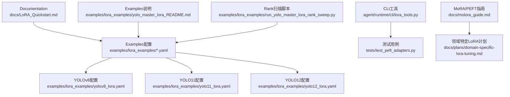
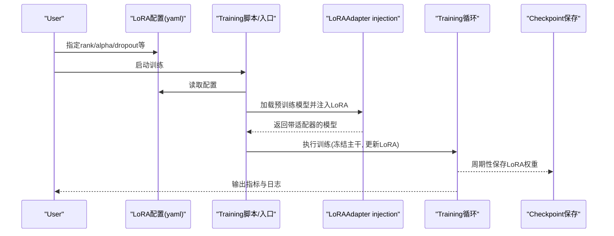
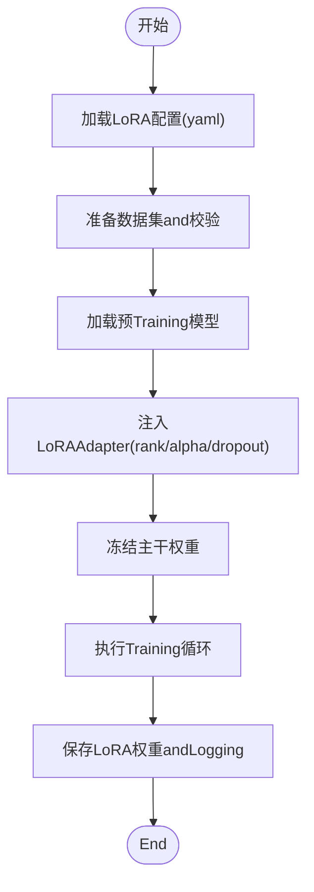
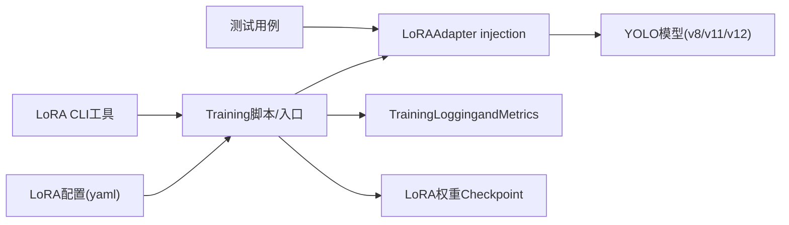

# LoRA基础入门

<cite>
**Files Referenced in This Document**
- [LoRA_Quickstart.md](file://docs/LoRA_Quickstart.md)
- [yolo_master_lora_README.md](file://examples/lora_examples/yolo_master_lora_README.md)
- [yolov8_lora.yaml](file://examples/lora_examples/yolov8_lora.yaml)
- [yolo11_lora.yaml](file://examples/lora_examples/yolo11_lora.yaml)
- [yolo12_lora.yaml](file://examples/lora_examples/yolo12_lora.yaml)
- [run_yolo_master_lora_rank_sweep.py](file://examples/lora_examples/run_yolo_master_lora_rank_sweep.py)
- [lora_tools.py](file://agent/runtime/cli/lora_tools.py)
- [test_peft_adapters.py](file://tests/test_peft_adapters.py)
- [molora_guide.md](file://docs/molora_guide.md)
- [domain-specific-lora-tuning.md](file://docs/plans/domain-specific-lora-tuning.md)
</cite>

## Table of Contents
1. [Introduction](#Introduction)
2. [Project Structure](#Project Structure)
3. [Core Components](#Core Components)
4. [Architecture Overview](#Architecture Overview)
5. [Detailed Component Analysis](#Detailed Component Analysis)
6. [Dependency Analysis](#Dependency Analysis)
7. [性能and内存Optimization](#性能and内存Optimization)
8. [常见问题排查](#常见问题排查)
9. [Conclusion](#Conclusion)
10. [Appendix：快速上手清单](#Appendix快速上手清单)

## Introduction
本教程targeting初次接触YOLO-Master中LoRA（Low-Rank Adaptation，Low-Rank Adaptation）的读者，目标是帮助你从零开始理解LoRA的基本原理、whileYOLO系列中的落地方式，并完成一次完整的微调实践。内容涵盖：
- LoRA的核心思想：低秩矩阵分解andParameter-Efficient Fine-Tuning
- Environment Preparation：依赖安装、GPU设置and内存Optimization建议
- Data Preparationand配置文件说明
- Training流程and关键参数调优（rank、alpha、dropoutetc.）
- YOLO v8/v11/v12的配置Examplesand最佳实践
- 常见问题定位and结果Evaluation方法

## Project Structure
围绕LoRAcapabilities，仓库provides了Documentation、Examples配置、脚本and测试用例，便于快速上手andValidation。下图展示了and本教程相关的核心位置and职责：

Figure Source
- [LoRA_Quickstart.md:1-200](file://docs/LoRA_Quickstart.md#L1-L200)
- [yolo_master_lora_README.md:1-200](file://examples/lora_examples/yolo_master_lora_README.md#L1-L200)
- [yolov8_lora.yaml:1-200](file://examples/lora_examples/yolov8_lora.yaml#L1-L200)
- [yolo11_lora.yaml:1-200](file://examples/lora_examples/yolo11_lora.yaml#L1-L200)
- [yolo12_lora.yaml:1-200](file://examples/lora_examples/yolo12_lora.yaml#L1-L200)
- [run_yolo_master_lora_rank_sweep.py:1-200](file://examples/lora_examples/run_yolo_master_lora_rank_sweep.py#L1-L200)
- [lora_tools.py:1-200](file://agent/runtime/cli/lora_tools.py#L1-L200)
- [test_peft_adapters.py:1-200](file://tests/test_peft_adapters.py#L1-L200)
- [molora_guide.md:1-200](file://docs/molora_guide.md#L1-L200)
- [domain-specific-lora-tuning.md:1-200](file://docs/plans/domain-specific-lora-tuning.md#L1-L200)

Section Source
- [LoRA_Quickstart.md:1-200](file://docs/LoRA_Quickstart.md#L1-L200)
- [yolo_master_lora_README.md:1-200](file://examples/lora_examples/yolo_master_lora_README.md#L1-L200)

## Core Components
- LoRA概念and要点
  - 低秩矩阵分解：将大权重增量近似for两个小矩阵的乘积，显著降低可Training参数量
  - Parameter-Efficient Fine-Tuning：冻结主干权重，仅Training少量LoRAAdapter，兼顾效果and效率
  - Inference融合：Training完成后可将LoRAWeight Merging回原模型，避免额外开销
- 工程化支撑
  - Examples配置：针对YOLO v8/v11/v12provides开箱即用的LoRA配置
  - Rank扫描脚本：自动化遍历不同rank值，辅助选择合适复杂度
  - CLI工具and测试：providesLoRA相关命令and回归测试，保障稳定性

Section Source
- [yolo_master_lora_README.md:1-200](file://examples/lora_examples/yolo_master_lora_README.md#L1-L200)
- [run_yolo_master_lora_rank_sweep.py:1-200](file://examples/lora_examples/run_yolo_master_lora_rank_sweep.py#L1-L200)
- [lora_tools.py:1-200](file://agent/runtime/cli/lora_tools.py#L1-L200)
- [test_peft_adapters.py:1-200](file://tests/test_peft_adapters.py#L1-L200)

## Architecture Overview
下图展示从“配置”to“Training”的关键路径，Centered onandLoRAwhile其中的作用点：

Figure Source
- [yolo_master_lora_README.md:1-200](file://examples/lora_examples/yolo_master_lora_README.md#L1-L200)
- [yolov8_lora.yaml:1-200](file://examples/lora_examples/yolov8_lora.yaml#L1-L200)
- [yolo11_lora.yaml:1-200](file://examples/lora_examples/yolo11_lora.yaml#L1-L200)
- [yolo12_lora.yaml:1-200](file://examples/lora_examples/yolo12_lora.yaml#L1-L200)

## Detailed Component Analysis

### LoRA基本原理and关键参数
- 低秩分解思想
  - 将权重增量ΔW近似forA×B，其中A和B维度远小于原始权重，从而减少可Training参数量
  - Inference时可Via融合将ΔW加回原权重，不引入额外延迟
- 关键参数
  - rank：低秩维数，控制可Training参数量and表达capabilities；越大越灵活但更耗资源
  - alpha：缩放系数，常andrankCombined with调节有效Learning Rate
  - dropout：对LoRA分支的随机失活，缓解过拟合
  - target_modules：需要注入LoRA的目标Modules集合，需Combining具体模型结构选择
- Applicable Scenarios
  - 数据量有限或算力受限时的TasksMigration
  - 多Tasks/多域快速适配，便于部署轻量级Adapter

Section Source
- [yolo_master_lora_README.md:1-200](file://examples/lora_examples/yolo_master_lora_README.md#L1-L200)
- [domain-specific-lora-tuning.md:1-200](file://docs/plans/domain-specific-lora-tuning.md#L1-L200)

### 环境配置andGPU/内存Optimization
- 依赖and环境
  - Uses项目provides的Examplesand脚本进行Training，确保PythonandPyTorch版本兼容
  - Refer toREADMEandQuick StartDocumentation完成基础环境搭建
- GPUand显存
  - Set appropriatelybatch sizeandGradient累积步数，to balance throughput and memory usage
  - 开启Mixture精度TrainingCentered on降低显存占用并提升速度
  - 若显存不足，优先降低rank、减小输入分辨率或启用GradientCheckpoint
- 内存Optimization建议
  - 关闭不必要的LoggingandVisualization回调
  - Uses数据缓存and预取，减少I/Obottlenecks
  - 定期清理中间产物and临时文件

Section Source
- [LoRA_Quickstart.md:1-200](file://docs/LoRA_Quickstart.md#L1-L200)
- [yolo_master_lora_README.md:1-200](file://examples/lora_examples/yolo_master_lora_README.md#L1-L200)

### Data Preparationand数据集格式
- 推荐的数据组织
  - 图像and标注分离存放，遵循YOLO标准Table of Contents结构
  - 划分train/val子集，保证分布一致性and代表性
- 标签格式
  - UsesYOLO格式的文本标注文件，类别索引and数据集中类别定义保持一致
- 校验andVisualization
  - Training前对数据进行完整性and一致性检查
  - 抽样Visualization标注框，确认坐标and类别正确

Section Source
- [yolo_master_lora_README.md:1-200](file://examples/lora_examples/yolo_master_lora_README.md#L1-L200)

### 配置文件andTraining流程
- 配置文件要点
  - 指定rank、alpha、dropoutetc.LoRA超参
  - 指定目标Modulestarget_modules（按模型类型调整）
  - 设置数据路径、Training轮次、Learning Rate、批量大小etc.常规Training项
- Training流程
  - 加载Pre-trained Weights
  - 注入LoRAAdapter
  - 冻结主干，仅TrainingLoRA分支
  - 周期性保存LoRA权重andTrainingLogging
- 多版本差异
  - v8/v11/v12while目标Modulesand默认策略上可能略有差异，应分别Refer to对应配置

Figure Source
- [yolov8_lora.yaml:1-200](file://examples/lora_examples/yolov8_lora.yaml#L1-L200)
- [yolo11_lora.yaml:1-200](file://examples/lora_examples/yolo11_lora.yaml#L1-L200)
- [yolo12_lora.yaml:1-200](file://examples/lora_examples/yolo12_lora.yaml#L1-L200)
- [yolo_master_lora_README.md:1-200](file://examples/lora_examples/yolo_master_lora_README.md#L1-L200)

Section Source
- [yolov8_lora.yaml:1-200](file://examples/lora_examples/yolov8_lora.yaml#L1-L200)
- [yolo11_lora.yaml:1-200](file://examples/lora_examples/yolo11_lora.yaml#L1-L200)
- [yolo12_lora.yaml:1-200](file://examples/lora_examples/yolo12_lora.yaml#L1-L200)
- [yolo_master_lora_README.md:1-200](file://examples/lora_examples/yolo_master_lora_README.md#L1-L200)

### 关键参数调优方法and最佳实践
- rank
  - 从小值起步（such as4/8），逐步增大观察Metrics变化
  - 数据量大且复杂时可适当提高rank
- alpha
  - 通常andrank同量级或略小，用于稳定Trainingand加速收敛
- dropout
  - 小数据集建议适度正则化（such as0.05~0.1），防止过拟合
- target_modules
  - 根据模型结构选择关键层（such as注意力、卷积投影etc.）
  - 不同YOLO版本默认策略不同，优先Refer to对应配置
- Learning Rateand批次
  - LoRA通常can use比全量微调更大的Learning Rate
  - CombiningGradient累积implementing更大etc.效批大小
- 早停andValidation
  - 基于Validation集Metrics监控，避免过拟合
  - 保存最佳权重and最终权重，便于对比

Section Source
- [run_yolo_master_lora_rank_sweep.py:1-200](file://examples/lora_examples/run_yolo_master_lora_rank_sweep.py#L1-L200)
- [yolo_master_lora_README.md:1-200](file://examples/lora_examples/yolo_master_lora_README.md#L1-L200)

### YOLO v8/v11/v12 配置Examplesand差异
- v8
  - Refer tov8专用LoRA配置，关注其默认target_modulesandLearning Rate策略
- v11
  - Refer tov11专用LoRA配置，注意新结构带来的适配差异
- v12
  - Refer tov12专用LoRA配置，Combining最新特性调整LoRA注入位置
- 通用建议
  - 先Centered on保守参数跑通流程，再逐步调优
  - UsesRank扫描脚本辅助确定合适的rank范围

Section Source
- [yolov8_lora.yaml:1-200](file://examples/lora_examples/yolov8_lora.yaml#L1-L200)
- [yolo11_lora.yaml:1-200](file://examples/lora_examples/yolo11_lora.yaml#L1-L200)
- [yolo12_lora.yaml:1-200](file://examples/lora_examples/yolo12_lora.yaml#L1-L200)
- [yolo_master_lora_README.md:1-200](file://examples/lora_examples/yolo_master_lora_README.md#L1-L200)

### Training脚本andRank扫描
- Training脚本
  - ViaExamples说明Documentation了解such as何启动Training、指定配置and输出Table of Contents
- Rank扫描
  - UsesRank扫描脚本自动遍历多个rank值，生成对比结果
  - 依据Metrics曲线and最终结果选择最优rank

Section Source
- [yolo_master_lora_README.md:1-200](file://examples/lora_examples/yolo_master_lora_README.md#L1-L200)
- [run_yolo_master_lora_rank_sweep.py:1-200](file://examples/lora_examples/run_yolo_master_lora_rank_sweep.py#L1-L200)

### CLI工具and测试Validation
- CLI工具
  - providesLoRA相关命令，便于快速注入、Exportand诊断
- 测试用例
  - 覆盖LoRAAdapter injectionand基本Training流程，保障功能稳定

Section Source
- [lora_tools.py:1-200](file://agent/runtime/cli/lora_tools.py#L1-L200)
- [test_peft_adapters.py:1-200](file://tests/test_peft_adapters.py#L1-L200)

## Dependency Analysis
LoRAwhile本项目中的依赖关系such as下：

Figure Source
- [yolov8_lora.yaml:1-200](file://examples/lora_examples/yolov8_lora.yaml#L1-L200)
- [yolo11_lora.yaml:1-200](file://examples/lora_examples/yolo11_lora.yaml#L1-L200)
- [yolo12_lora.yaml:1-200](file://examples/lora_examples/yolo12_lora.yaml#L1-L200)
- [lora_tools.py:1-200](file://agent/runtime/cli/lora_tools.py#L1-L200)
- [test_peft_adapters.py:1-200](file://tests/test_peft_adapters.py#L1-L200)

Section Source
- [lora_tools.py:1-200](file://agent/runtime/cli/lora_tools.py#L1-L200)
- [test_peft_adapters.py:1-200](file://tests/test_peft_adapters.py#L1-L200)

## 性能and内存Optimization
- 显存Optimization
  - 降低rankand输入分辨率
  - UsesMixture精度andGradient累积
  - 关闭非必要的VisualizationandLogging
- Training速度
  - 增加数据并行或Distributed Training规模
  - Uses更快的存储介质and数据预取
- 结果质量
  - Set appropriatelyLearning Rateand正则化强度
  - 采用早停andValidation集监控，避免过拟合

Section Source
- [molora_guide.md:1-200](file://docs/molora_guide.md#L1-L200)
- [domain-specific-lora-tuning.md:1-200](file://docs/plans/domain-specific-lora-tuning.md#L1-L200)

## 常见问题排查
- 显存溢出
  - 现象：Training中途崩溃或报错
  - 处理：降低rank、减小batch size、开启Mixture精度、启用GradientCheckpoint
- Training不收敛或震荡
  - 现象：损失波动大、Metrics无改善
  - 处理：降低Learning Rate、增大alpha或调整dropout、检查数据质量and标注一致性
- 目标Modules未生效
  - 现象：LoRA未注入或无效
  - 处理：核对target_modulesand模型结构匹配性，Refer to各版本配置Examples
- 结果不稳定
  - 现象：多次Training结果差异大
  - 处理：固定随机种子、统一数据顺序、延长预热步数

Section Source
- [lora_tools.py:1-200](file://agent/runtime/cli/lora_tools.py#L1-L200)
- [test_peft_adapters.py:1-200](file://tests/test_peft_adapters.py#L1-L200)

## Conclusion
ViaLoRA，你可Centered onWhile maintainingYOLO主干权重，Centered on极低的参数代价完成对新Tasks的适配。Combining本项目provides的Examples配置、Rank扫描脚本andCLI工具，你可Centered on快速完成从环境搭建toTrainingEvaluation的全流程。建议while真实场景中先Centered on保守参数跑通流程，再逐步调优rank、alphaanddropoutetc.关键超参，Centered on获得稳定且高效的微调效果。

## Appendix：快速上手清单
- 阅读Quick StartandExamples说明Documentation，了解整体流程
- 准备符合YOLO格式的数据集，并进行完整性校验
- 选择合适的LoRA配置（v8/v11/v12），设置rank、alpha、dropoutetc.
- 启动Training，监控LoggingandValidationMetrics
- UsesRank扫描脚本探索合适的rank范围
- 保存并Evaluation最佳LoRA权重，必要时进行融合Export

Section Source
- [LoRA_Quickstart.md:1-200](file://docs/LoRA_Quickstart.md#L1-L200)
- [yolo_master_lora_README.md:1-200](file://examples/lora_examples/yolo_master_lora_README.md#L1-L200)
- [yolov8_lora.yaml:1-200](file://examples/lora_examples/yolov8_lora.yaml#L1-L200)
- [yolo11_lora.yaml:1-200](file://examples/lora_examples/yolo11_lora.yaml#L1-L200)
- [yolo12_lora.yaml:1-200](file://examples/lora_examples/yolo12_lora.yaml#L1-L200)
- [run_yolo_master_lora_rank_sweep.py:1-200](file://examples/lora_examples/run_yolo_master_lora_rank_sweep.py#L1-L200)