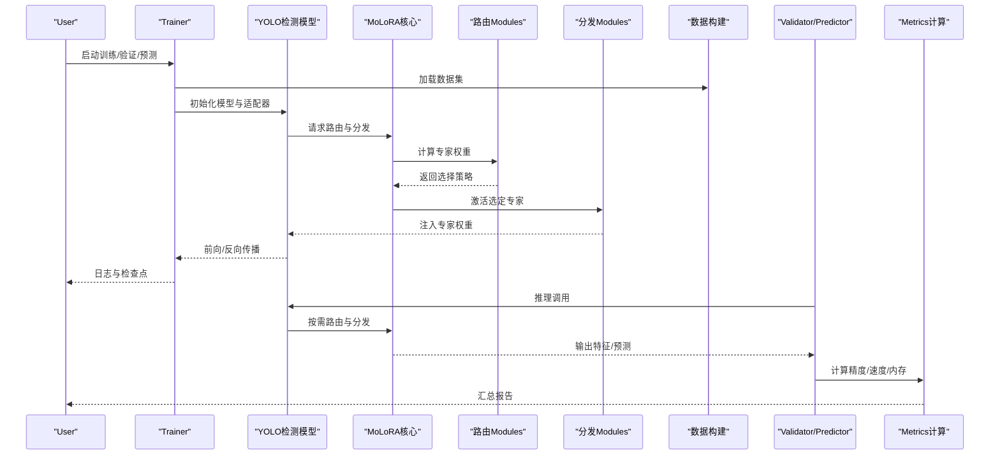
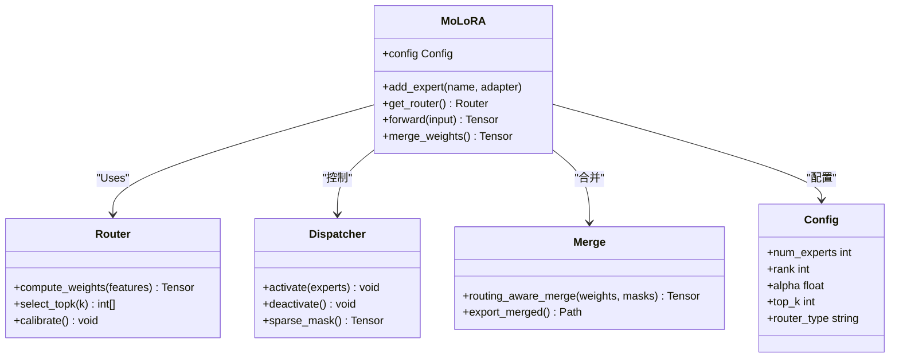
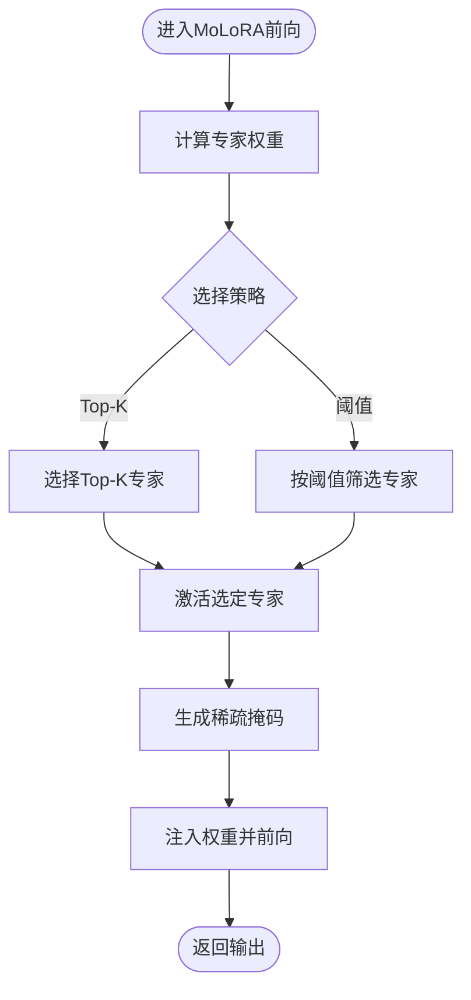
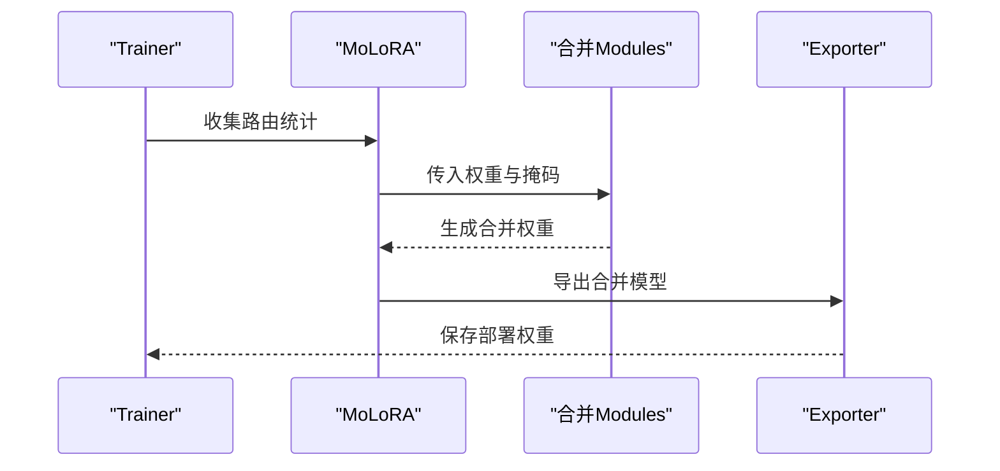
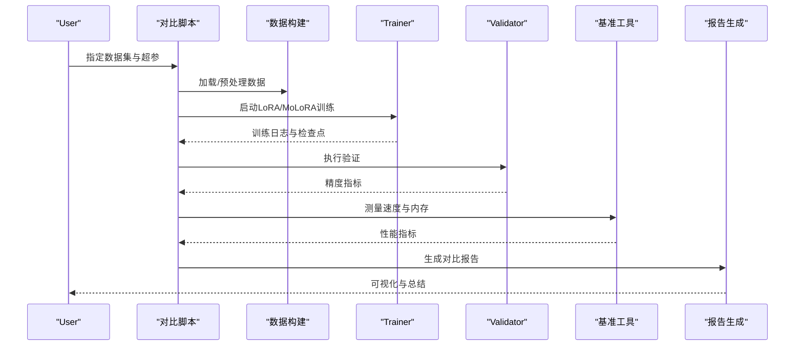
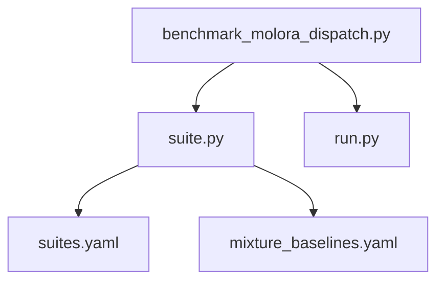
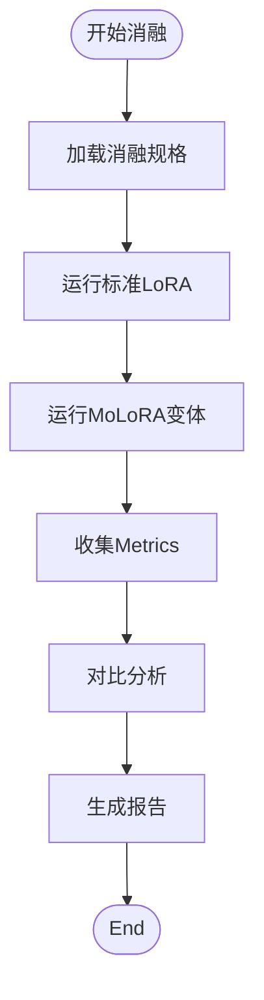
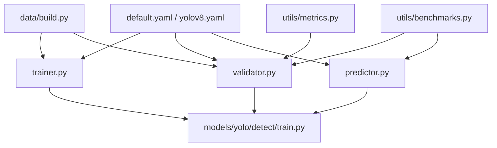

# MoLoRA对比实验

<cite>
**Files Referenced in This Document**
- [examples/molora/compare_lora_molora.py](file://examples/molora/compare_lora_molora.py)
- [examples/molora/compare_coco128.py](file://examples/molora/compare_coco128.py)
- [examples/molora/compare_coco128_fast.py](file://examples/molora/compare_coco128_fast.py)
- [examples/molora/basic_finetune.py](file://examples/molora/basic_finetune.py)
- [examples/molora/continual_learning.py](file://examples/molora/continual_learning.py)
- [benchmarks/benchmark_molora_dispatch.py](file://benchmarks/benchmark_molora_dispatch.py)
- [benchmarks/run.py](file://benchmarks/run.py)
- [benchmarks/suite.py](file://benchmarks/suite.py)
- [benchmarks/suites.yaml](file://benchmarks/suites.yaml)
- [benchmarks/mixture_baselines.yaml](file://benchmarks/mixture_baselines.yaml)
- [scripts/ablation_suite/ablation_molora_full.py](file://scripts/ablation_suite/ablation_molora_full.py)
- [scripts/ablation_suite/full_ablation.py](file://scripts/ablation_suite/full_ablation.py)
- [scripts/ablation_suite/full_ablation_spec.py](file://scripts/ablation_suite/full_ablation_spec.py)
- [tests/test_molora.py](file://tests/test_molora.py)
- [tests/test_molora_routing_aware_merge.py](file://tests/test_molora_routing_aware_merge.py)
- [tests/test_molora_sparse_dispatch.py](file://tests/test_molora_sparse_dispatch.py)
- [ultralytics/utils/lora/__init__.py](file://ultralytics/utils/lora/__init__.py)
- [ultralytics/utils/lora/molora.py](file://ultralytics/utils/lora/molora.py)
- [ultralytics/utils/lora/routing.py](file://ultralytics/utils/lora/routing.py)
- [ultralytics/utils/lora/dispatch.py](file://ultralytics/utils/lora/dispatch.py)
- [ultralytics/utils/lora/merge.py](file://ultralytics/utils/lora/merge.py)
- [ultralytics/utils/lora/config.py](file://ultralytics/utils/lora/config.py)
- [ultralytics/engine/trainer.py](file://ultralytics/engine/trainer.py)
- [ultralytics/engine/validator.py](file://ultralytics/engine/validator.py)
- [ultralytics/engine/predictor.py](file://ultralytics/engine/predictor.py)
- [ultralytics/models/yolo/detect/train.py](file://ultralytics/models/yolo/detect/train.py)
- [ultralytics/models/yolo/detect/val.py](file://ultralytics/models/yolo/detect/val.py)
- [ultralytics/models/yolo/detect/predict.py](file://ultralytics/models/yolo/detect/predict.py)
- [ultralytics/cfg/default.yaml](file://ultralytics/cfg/default.yaml)
- [ultralytics/cfg/models/yolo/yolov8.yaml](file://ultralytics/cfg/models/yolo/yolov8.yaml)
- [ultralytics/data/build.py](file://ultralytics/data/build.py)
- [ultralytics/utils/benchmarks.py](file://ultralytics/utils/benchmarks.py)
- [ultralytics/utils/metrics.py](file://ultralytics/utils/metrics.py)
- [docs/molora_guide.md](file://docs/molora_guide.md)
</cite>

## Table of Contents
1. [Introduction](#Introduction)
2. [Project Structure](#Project Structure)
3. [Core Components](#Core Components)
4. [Architecture Overview](#Architecture Overview)
5. [Detailed Component Analysis](#Detailed Component Analysis)
6. [Dependency Analysis](#Dependency Analysis)
7. [性能考量](#性能考量)
8. [Troubleshooting Guide](#Troubleshooting Guide)
9. [Conclusion](#Conclusion)
10. [Appendix](#Appendix)

## Introduction
本指南targeting希望whileYOLO-Master中开展MoLoRA（Mixture of LoRA Adapters）and标准LoRA对比实验的ResearchersandEngineers。Documentation从技术原理、实验设置、运行流程、Metrics体系、自动化报告生成to部署建议，provides端to端的可操作说明，帮助你while不同数据集上复现并扩展MoLoRA的对比结果。

## Project Structure
围绕MoLoRAandLoRA对比的关键代码分布whileCentered on下位置：
- Examples脚本：examples/molora 下provides多组对比and快速Validation脚本
- 基准测试：benchmarks 下provides调度and套件化基准入口
- 消融and全量脚本：scripts/ablation_suite 下provides完整消融and场景化脚本
- 单元测试：tests 下覆盖路由、合并、Sparse Schedulingetc.关键路径
- 核心implementing：ultralytics/utils/lora 下包含MoLoRA配置、路由、分发、合并etc.Modules
- Training/Inference管线：ultralytics/engine and ultralytics/models/yolo/detect 集成Adapter
- 数据andMetrics：ultralytics/data/build.py and ultralytics/utils/metrics.py
- Documentation：docs/molora_guide.md provides概念性说明andUses指引

```mermaid
graph TB
subgraph "Examplesand脚本"
A["examples/molora/compare_lora_molora.py"]
B["examples/molora/compare_coco128.py"]
C["examples/molora/compare_coco128_fast.py"]
D["examples/molora/basic_finetune.py"]
E["examples/molora/continual_learning.py"]
end
subgraph "Benchmark Suite"
F["benchmarks/benchmark_molora_dispatch.py"]
G["benchmarks/run.py"]
H["benchmarks/suite.py"]
I["benchmarks/suites.yaml"]
J["benchmarks/mixture_baselines.yaml"]
end
subgraph "消融and全量"
K["scripts/ablation_suite/ablation_molora_full.py"]
L["scripts/ablation_suite/full_ablation.py"]
M["scripts/ablation_suite/full_ablation_spec.py"]
end
subgraph "核心implementing"
N["ultralytics/utils/lora/molora.py"]
O["ultralytics/utils/lora/routing.py"]
P["ultralytics/utils/lora/dispatch.py"]
Q["ultralytics/utils/lora/merge.py"]
R["ultralytics/utils/lora/config.py"]
end
subgraph "Training/Inference"
S["ultralytics/engine/trainer.py"]
T["ultralytics/engine/validator.py"]
U["ultralytics/engine/predictor.py"]
V["ultralytics/models/yolo/detect/train.py"]
W["ultralytics/models/yolo/detect/val.py"]
X["ultralytics/models/yolo/detect/predict.py"]
end
subgraph "数据andMetrics"
Y["ultralytics/data/build.py"]
Z["ultralytics/utils/metrics.py"]
end
A --> N
B --> N
C --> N
D --> N
E --> N
F --> P
G --> H
H --> I
H --> J
K --> N
L --> N
M --> N
N --> O
N --> P
N --> Q
N --> R
S --> N
T --> N
U --> N
V --> S
W --> T
X --> U
Y --> S
Z --> T
```

Figure Source
- [examples/molora/compare_lora_molora.py:1-200](file://examples/molora/compare_lora_molora.py#L1-L200)
- [benchmarks/benchmark_molora_dispatch.py:1-200](file://benchmarks/benchmark_molora_dispatch.py#L1-L200)
- [benchmarks/run.py:1-200](file://benchmarks/run.py#L1-L200)
- [benchmarks/suite.py:1-200](file://benchmarks/suite.py#L1-L200)
- [benchmarks/suites.yaml:1-200](file://benchmarks/suites.yaml#L1-L200)
- [benchmarks/mixture_baselines.yaml:1-200](file://benchmarks/mixture_baselines.yaml#L1-L200)
- [scripts/ablation_suite/ablation_molora_full.py:1-200](file://scripts/ablation_suite/ablation_molora_full.py#L1-L200)
- [scripts/ablation_suite/full_ablation.py:1-200](file://scripts/ablation_suite/full_ablation.py#L1-L200)
- [scripts/ablation_suite/full_ablation_spec.py:1-200](file://scripts/ablation_suite/full_ablation_spec.py#L1-L200)
- [ultralytics/utils/lora/molora.py:1-200](file://ultralytics/utils/lora/molora.py#L1-L200)
- [ultralytics/utils/lora/routing.py:1-200](file://ultralytics/utils/lora/routing.py#L1-L200)
- [ultralytics/utils/lora/dispatch.py:1-200](file://ultralytics/utils/lora/dispatch.py#L1-L200)
- [ultralytics/utils/lora/merge.py:1-200](file://ultralytics/utils/lora/merge.py#L1-L200)
- [ultralytics/utils/lora/config.py:1-200](file://ultralytics/utils/lora/config.py#L1-L200)
- [ultralytics/engine/trainer.py:1-200](file://ultralytics/engine/trainer.py#L1-L200)
- [ultralytics/engine/validator.py:1-200](file://ultralytics/engine/validator.py#L1-L200)
- [ultralytics/engine/predictor.py:1-200](file://ultralytics/engine/predictor.py#L1-L200)
- [ultralytics/models/yolo/detect/train.py:1-200](file://ultralytics/models/yolo/detect/train.py#L1-L200)
- [ultralytics/models/yolo/detect/val.py:1-200](file://ultralytics/models/yolo/detect/val.py#L1-L200)
- [ultralytics/models/yolo/detect/predict.py:1-200](file://ultralytics/models/yolo/detect/predict.py#L1-L200)
- [ultralytics/data/build.py:1-200](file://ultralytics/data/build.py#L1-L200)
- [ultralytics/utils/metrics.py:1-200](file://ultralytics/utils/metrics.py#L1-L200)

Section Source
- [examples/molora/compare_lora_molora.py:1-200](file://examples/molora/compare_lora_molora.py#L1-L200)
- [benchmarks/benchmark_molora_dispatch.py:1-200](file://benchmarks/benchmark_molora_dispatch.py#L1-L200)
- [scripts/ablation_suite/ablation_molora_full.py:1-200](file://scripts/ablation_suite/ablation_molora_full.py#L1-L200)
- [ultralytics/utils/lora/molora.py:1-200](file://ultralytics/utils/lora/molora.py#L1-L200)
- [ultralytics/engine/trainer.py:1-200](file://ultralytics/engine/trainer.py#L1-L200)
- [ultralytics/utils/metrics.py:1-200](file://ultralytics/utils/metrics.py#L1-L200)

## Core Components
- MoLoRA核心Modules
  - molora.py：定义多Adapter结构and组合策略
  - routing.py：动态Routing Mechanismand专家选择策略
  - dispatch.py：稀疏分发and激活控制
  - merge.py：Routing-Aware Mergingand权重融合
  - config.py：MoLoRA超参数andRegistry
- Training/Inference集成
  - trainer.py/validator.py/predictor.py：whileTraining、ValidationandPrediction阶段接入MoLoRA
  - models/yolo/detect/*：Tasks级Encapsulates，统一CallsEngine Layer
- 基准and套件
  - benchmark_molora_dispatch.py：针对MoLoRA调度的基准
  - run.py/suite.py/suites.yaml/mixture_baselines.yaml：Benchmark Suiteand基线配置
- 消融and全量脚本
  - ablation_molora_full.py/full_ablation.py/full_ablation_spec.py：系统化对比and场景化Evaluation
- 数据andMetrics
  - data/build.py：数据集构建and加载
  - utils/metrics.py：精度、速度、内存etc.Metrics计算

Section Source
- [ultralytics/utils/lora/molora.py:1-200](file://ultralytics/utils/lora/molora.py#L1-L200)
- [ultralytics/utils/lora/routing.py:1-200](file://ultralytics/utils/lora/routing.py#L1-L200)
- [ultralytics/utils/lora/dispatch.py:1-200](file://ultralytics/utils/lora/dispatch.py#L1-L200)
- [ultralytics/utils/lora/merge.py:1-200](file://ultralytics/utils/lora/merge.py#L1-L200)
- [ultralytics/utils/lora/config.py:1-200](file://ultralytics/utils/lora/config.py#L1-L200)
- [ultralytics/engine/trainer.py:1-200](file://ultralytics/engine/trainer.py#L1-L200)
- [ultralytics/engine/validator.py:1-200](file://ultralytics/engine/validator.py#L1-L200)
- [ultralytics/engine/predictor.py:1-200](file://ultralytics/engine/predictor.py#L1-L200)
- [ultralytics/models/yolo/detect/train.py:1-200](file://ultralytics/models/yolo/detect/train.py#L1-L200)
- [ultralytics/models/yolo/detect/val.py:1-200](file://ultralytics/models/yolo/detect/val.py#L1-L200)
- [ultralytics/models/yolo/detect/predict.py:1-200](file://ultralytics/models/yolo/detect/predict.py#L1-L200)
- [ultralytics/data/build.py:1-200](file://ultralytics/data/build.py#L1-L200)
- [ultralytics/utils/metrics.py:1-200](file://ultralytics/utils/metrics.py#L1-L200)

## Architecture Overview
下图展示MoLoRAwhileTrainingandInference中的整体交互：Training时Viatrainer加载数据and模型，按路由选择专家进行前向and反向；ValidationandPrediction阶段由validator/predictor执行，Combiningdispatch进行稀疏激活，最终输出Metrics或检测结果。

Figure Source
- [ultralytics/engine/trainer.py:1-200](file://ultralytics/engine/trainer.py#L1-L200)
- [ultralytics/engine/validator.py:1-200](file://ultralytics/engine/validator.py#L1-L200)
- [ultralytics/engine/predictor.py:1-200](file://ultralytics/engine/predictor.py#L1-L200)
- [ultralytics/utils/lora/molora.py:1-200](file://ultralytics/utils/lora/molora.py#L1-L200)
- [ultralytics/utils/lora/routing.py:1-200](file://ultralytics/utils/lora/routing.py#L1-L200)
- [ultralytics/utils/lora/dispatch.py:1-200](file://ultralytics/utils/lora/dispatch.py#L1-L200)
- [ultralytics/data/build.py:1-200](file://ultralytics/data/build.py#L1-L200)
- [ultralytics/utils/metrics.py:1-200](file://ultralytics/utils/metrics.py#L1-L200)

## Detailed Component Analysis

### MoLoRA核心类and关系
MoLoRA将多个LoRAAdapter组织for“专家”，并Via路由and分发机制whileTrainingandInference中动态选择and激活。

Figure Source
- [ultralytics/utils/lora/molora.py:1-200](file://ultralytics/utils/lora/molora.py#L1-L200)
- [ultralytics/utils/lora/routing.py:1-200](file://ultralytics/utils/lora/routing.py#L1-L200)
- [ultralytics/utils/lora/dispatch.py:1-200](file://ultralytics/utils/lora/dispatch.py#L1-L200)
- [ultralytics/utils/lora/merge.py:1-200](file://ultralytics/utils/lora/merge.py#L1-L200)
- [ultralytics/utils/lora/config.py:1-200](file://ultralytics/utils/lora/config.py#L1-L200)

Section Source
- [ultralytics/utils/lora/molora.py:1-200](file://ultralytics/utils/lora/molora.py#L1-L200)
- [ultralytics/utils/lora/routing.py:1-200](file://ultralytics/utils/lora/routing.py#L1-L200)
- [ultralytics/utils/lora/dispatch.py:1-200](file://ultralytics/utils/lora/dispatch.py#L1-L200)
- [ultralytics/utils/lora/merge.py:1-200](file://ultralytics/utils/lora/merge.py#L1-L200)
- [ultralytics/utils/lora/config.py:1-200](file://ultralytics/utils/lora/config.py#L1-L200)

### Dynamic Routingand专家选择流程
MoLoRAwhile每次前向时根据Input Features计算专家权重，并按策略选择Top-K专家进行激活，从而降低计算开销并提升适配capabilities。

Figure Source
- [ultralytics/utils/lora/routing.py:1-200](file://ultralytics/utils/lora/routing.py#L1-L200)
- [ultralytics/utils/lora/dispatch.py:1-200](file://ultralytics/utils/lora/dispatch.py#L1-L200)
- [ultralytics/utils/lora/molora.py:1-200](file://ultralytics/utils/lora/molora.py#L1-L200)

Section Source
- [ultralytics/utils/lora/routing.py:1-200](file://ultralytics/utils/lora/routing.py#L1-L200)
- [ultralytics/utils/lora/dispatch.py:1-200](file://ultralytics/utils/lora/dispatch.py#L1-L200)
- [ultralytics/utils/lora/molora.py:1-200](file://ultralytics/utils/lora/molora.py#L1-L200)

### Routing-Aware MergingandExport
while需要固定权重的部署场景，MoLoRASupporting基于路由统计的路径感知合并，Centered on保留多专家贡献减少运行时开销。

Figure Source
- [ultralytics/utils/lora/merge.py:1-200](file://ultralytics/utils/lora/merge.py#L1-L200)
- [ultralytics/utils/lora/molora.py:1-200](file://ultralytics/utils/lora/molora.py#L1-L200)

Section Source
- [ultralytics/utils/lora/merge.py:1-200](file://ultralytics/utils/lora/merge.py#L1-L200)
- [ultralytics/utils/lora/molora.py:1-200](file://ultralytics/utils/lora/molora.py#L1-L200)

### 对比实验脚本and运行流程
- 对比主脚本：examples/molora/compare_lora_molora.py
  - 功能：while同一数据集and超参下运行标准LoRAandMoLoRA，收集精度、速度and内存Metrics
  - 关键步骤：Data Preparation、配置解析、Training/Validation循环、结果汇总
- 快速Validation脚本：examples/molora/compare_coco128.py and compare_coco128_fast.py
  - 功能：针对COCO128的快速对比，便于本地调试
- 基础微调and持续学习：basic_finetune.py and continual_learning.py
  - 功能：演示单Tasks微调and多Tasks持续学习下的MoLoRA用法

Figure Source
- [examples/molora/compare_lora_molora.py:1-200](file://examples/molora/compare_lora_molora.py#L1-L200)
- [examples/molora/compare_coco128.py:1-200](file://examples/molora/compare_coco128.py#L1-L200)
- [examples/molora/compare_coco128_fast.py:1-200](file://examples/molora/compare_coco128_fast.py#L1-L200)
- [examples/molora/basic_finetune.py:1-200](file://examples/molora/basic_finetune.py#L1-L200)
- [examples/molora/continual_learning.py:1-200](file://examples/molora/continual_learning.py#L1-L200)
- [ultralytics/data/build.py:1-200](file://ultralytics/data/build.py#L1-L200)
- [ultralytics/utils/benchmarks.py:1-200](file://ultralytics/utils/benchmarks.py#L1-L200)

Section Source
- [examples/molora/compare_lora_molora.py:1-200](file://examples/molora/compare_lora_molora.py#L1-L200)
- [examples/molora/compare_coco128.py:1-200](file://examples/molora/compare_coco128.py#L1-L200)
- [examples/molora/compare_coco128_fast.py:1-200](file://examples/molora/compare_coco128_fast.py#L1-L200)
- [examples/molora/basic_finetune.py:1-200](file://examples/molora/basic_finetune.py#L1-L200)
- [examples/molora/continual_learning.py:1-200](file://examples/molora/continual_learning.py#L1-L200)
- [ultralytics/data/build.py:1-200](file://ultralytics/data/build.py#L1-L200)
- [ultralytics/utils/benchmarks.py:1-200](file://ultralytics/utils/benchmarks.py#L1-L200)

### Benchmark Suiteand基线配置
- benchmark_molora_dispatch.py：聚焦MoLoRA调度路径的性能测量
- run.py/suite.py：Benchmark Suite编排andTasks调度
- suites.yaml/mixture_baselines.yaml：套件and基线配置，统一数据集、超参andEvaluation项

Figure Source
- [benchmarks/benchmark_molora_dispatch.py:1-200](file://benchmarks/benchmark_molora_dispatch.py#L1-L200)
- [benchmarks/suite.py:1-200](file://benchmarks/suite.py#L1-L200)
- [benchmarks/suites.yaml:1-200](file://benchmarks/suites.yaml#L1-L200)
- [benchmarks/mixture_baselines.yaml:1-200](file://benchmarks/mixture_baselines.yaml#L1-L200)
- [benchmarks/run.py:1-200](file://benchmarks/run.py#L1-L200)

Section Source
- [benchmarks/benchmark_molora_dispatch.py:1-200](file://benchmarks/benchmark_molora_dispatch.py#L1-L200)
- [benchmarks/suite.py:1-200](file://benchmarks/suite.py#L1-L200)
- [benchmarks/suites.yaml:1-200](file://benchmarks/suites.yaml#L1-L200)
- [benchmarks/mixture_baselines.yaml:1-200](file://benchmarks/mixture_baselines.yaml#L1-L200)
- [benchmarks/run.py:1-200](file://benchmarks/run.py#L1-L200)

### 消融and全量对比
- ablation_molora_full.py：MoLoRA全量消融，覆盖路由类型、专家数量、rankandalphaetc.
- full_ablation.py/full_ablation_spec.py：通用消融框架and规格化配置，便于跨Tasks对比

Figure Source
- [scripts/ablation_suite/ablation_molora_full.py:1-200](file://scripts/ablation_suite/ablation_molora_full.py#L1-L200)
- [scripts/ablation_suite/full_ablation.py:1-200](file://scripts/ablation_suite/full_ablation.py#L1-L200)
- [scripts/ablation_suite/full_ablation_spec.py:1-200](file://scripts/ablation_suite/full_ablation_spec.py#L1-L200)

Section Source
- [scripts/ablation_suite/ablation_molora_full.py:1-200](file://scripts/ablation_suite/ablation_molora_full.py#L1-L200)
- [scripts/ablation_suite/full_ablation.py:1-200](file://scripts/ablation_suite/full_ablation.py#L1-L200)
- [scripts/ablation_suite/full_ablation_spec.py:1-200](file://scripts/ablation_suite/full_ablation_spec.py#L1-L200)

### 单元测试and正确性保障
- test_molora.py：核心功能and接口契约测试
- test_molora_routing_aware_merge.py：Routing-Aware Merging的正确性and数值稳定性
- test_molora_sparse_dispatch.py：稀疏分发的行forand边界条件

Section Source
- [tests/test_molora.py:1-200](file://tests/test_molora.py#L1-L200)
- [tests/test_molora_routing_aware_merge.py:1-200](file://tests/test_molora_routing_aware_merge.py#L1-L200)
- [tests/test_molora_sparse_dispatch.py:1-200](file://tests/test_molora_sparse_dispatch.py#L1-L200)

## Dependency Analysis
MoLoRAandLoRA对比涉and多层依赖：
- 配置层：default.yamland模型配置文件provides默认超参andTasks设定
- 数据层：data/build.py负责数据集构建and加载
- Training/Inference层：engineandmodels/yolo/detectEncapsulatesTraining、ValidationandPrediction流程
- Metrics层：utils/metrics.pyandutils/benchmarks.pyprovides精度、速度and内存度量

Figure Source
- [ultralytics/cfg/default.yaml:1-200](file://ultralytics/cfg/default.yaml#L1-L200)
- [ultralytics/cfg/models/yolo/yolov8.yaml:1-200](file://ultralytics/cfg/models/yolo/yolov8.yaml#L1-L200)
- [ultralytics/data/build.py:1-200](file://ultralytics/data/build.py#L1-L200)
- [ultralytics/engine/trainer.py:1-200](file://ultralytics/engine/trainer.py#L1-L200)
- [ultralytics/engine/validator.py:1-200](file://ultralytics/engine/validator.py#L1-L200)
- [ultralytics/engine/predictor.py:1-200](file://ultralytics/engine/predictor.py#L1-L200)
- [ultralytics/models/yolo/detect/train.py:1-200](file://ultralytics/models/yolo/detect/train.py#L1-L200)
- [ultralytics/models/yolo/detect/val.py:1-200](file://ultralytics/models/yolo/detect/val.py#L1-L200)
- [ultralytics/models/yolo/detect/predict.py:1-200](file://ultralytics/models/yolo/detect/predict.py#L1-L200)
- [ultralytics/utils/metrics.py:1-200](file://ultralytics/utils/metrics.py#L1-L200)
- [ultralytics/utils/benchmarks.py:1-200](file://ultralytics/utils/benchmarks.py#L1-L200)

Section Source
- [ultralytics/cfg/default.yaml:1-200](file://ultralytics/cfg/default.yaml#L1-L200)
- [ultralytics/cfg/models/yolo/yolov8.yaml:1-200](file://ultralytics/cfg/models/yolo/yolov8.yaml#L1-L200)
- [ultralytics/data/build.py:1-200](file://ultralytics/data/build.py#L1-L200)
- [ultralytics/engine/trainer.py:1-200](file://ultralytics/engine/trainer.py#L1-L200)
- [ultralytics/engine/validator.py:1-200](file://ultralytics/engine/validator.py#L1-L200)
- [ultralytics/engine/predictor.py:1-200](file://ultralytics/engine/predictor.py#L1-L200)
- [ultralytics/models/yolo/detect/train.py:1-200](file://ultralytics/models/yolo/detect/train.py#L1-L200)
- [ultralytics/models/yolo/detect/val.py:1-200](file://ultralytics/models/yolo/detect/val.py#L1-L200)
- [ultralytics/models/yolo/detect/predict.py:1-200](file://ultralytics/models/yolo/detect/predict.py#L1-L200)
- [ultralytics/utils/metrics.py:1-200](file://ultralytics/utils/metrics.py#L1-L200)
- [ultralytics/utils/benchmarks.py:1-200](file://ultralytics/utils/benchmarks.py#L1-L200)

## 性能考量
- 精度提升：while多专家andDynamic Routing下，MoLoRA通常能更好地拟合复杂分布，尤其while长尾类别and小样本场景
- Inference速度：稀疏激活可降低计算量，但路由and分发存while额外开销；需权衡Top-Kand专家规模
- 内存占用：多Adapter增加显存峰值；合并后可显著降低部署内存
- Training效率：MoLoRA的Backpropagation路径更复杂，需关注Gradient稳定andLearning Rate调度

[This section provides general guidance and does not directly analyze specific files]

## Troubleshooting Guide
- 路由不稳定或NaN
  - 检查路由权重归一化and校准逻辑
  - Refer to路由相关测试用例定位问题
- 合并后精度下降
  - 确认路由统计是否充分采集
  - 调整合并策略and阈值
- 稀疏分发异常
  - Validation掩码生成and专家激活顺序
  - 检查边界条件and空激活处理

Section Source
- [tests/test_molora.py:1-200](file://tests/test_molora.py#L1-L200)
- [tests/test_molora_routing_aware_merge.py:1-200](file://tests/test_molora_routing_aware_merge.py#L1-L200)
- [tests/test_molora_sparse_dispatch.py:1-200](file://tests/test_molora_sparse_dispatch.py#L1-L200)

## Conclusion
MoLoRAVia多AdapterandDynamic RoutingWhile maintaining低参数量提升了模型适配capabilities。对比实验应统一数据and超参，系统性地Evaluation精度、速度、内存andTraining效率。CombiningRouting-Aware Merging可while部署阶段获得更好的性价比。建议while长尾and小样本场景中优先尝试MoLoRA，并while资源受限环境下谨慎选择Top-Kand专家规模。

[This section is summary content and does not directly analyze specific files]

## Appendix
- 快速上手
  - Usesexamples/molora/compare_coco128.py或compare_coco128_fast.py进行本地快速Validation
  - Usesexamples/molora/compare_lora_molora.py进行完整对比
- 数据集准备
  - 依据ultralytics/data/build.py的配置要求准备YAMLand标注格式
- 超参建议
  - 从ultralytics/cfg/default.yamlandyolov8.yaml获取默认值，再按Tasks调整
- MetricsandVisualization
  - Usesultralytics/utils/metrics.pyandutils/benchmarks.py收集Metrics
  - Refer todocs/molora_guide.md了解Visualizationand解读方法

Section Source
- [examples/molora/compare_coco128.py:1-200](file://examples/molora/compare_coco128.py#L1-L200)
- [examples/molora/compare_coco128_fast.py:1-200](file://examples/molora/compare_coco128_fast.py#L1-L200)
- [examples/molora/compare_lora_molora.py:1-200](file://examples/molora/compare_lora_molora.py#L1-L200)
- [ultralytics/data/build.py:1-200](file://ultralytics/data/build.py#L1-L200)
- [ultralytics/cfg/default.yaml:1-200](file://ultralytics/cfg/default.yaml#L1-L200)
- [ultralytics/cfg/models/yolo/yolov8.yaml:1-200](file://ultralytics/cfg/models/yolo/yolov8.yaml#L1-L200)
- [ultralytics/utils/metrics.py:1-200](file://ultralytics/utils/metrics.py#L1-L200)
- [ultralytics/utils/benchmarks.py:1-200](file://ultralytics/utils/benchmarks.py#L1-L200)
- [docs/molora_guide.md:1-200](file://docs/molora_guide.md#L1-L200)