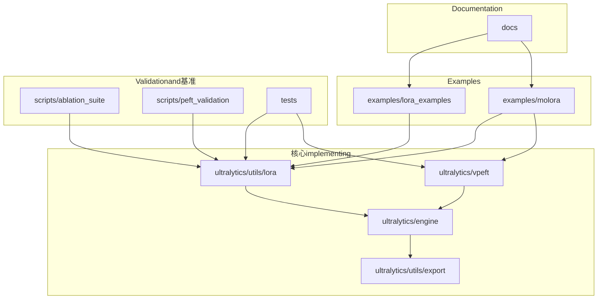
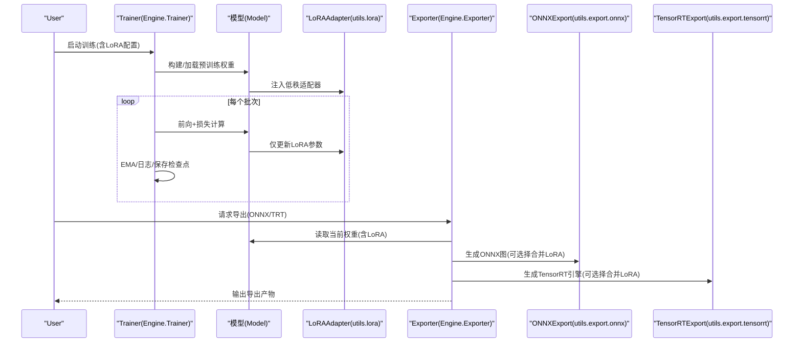
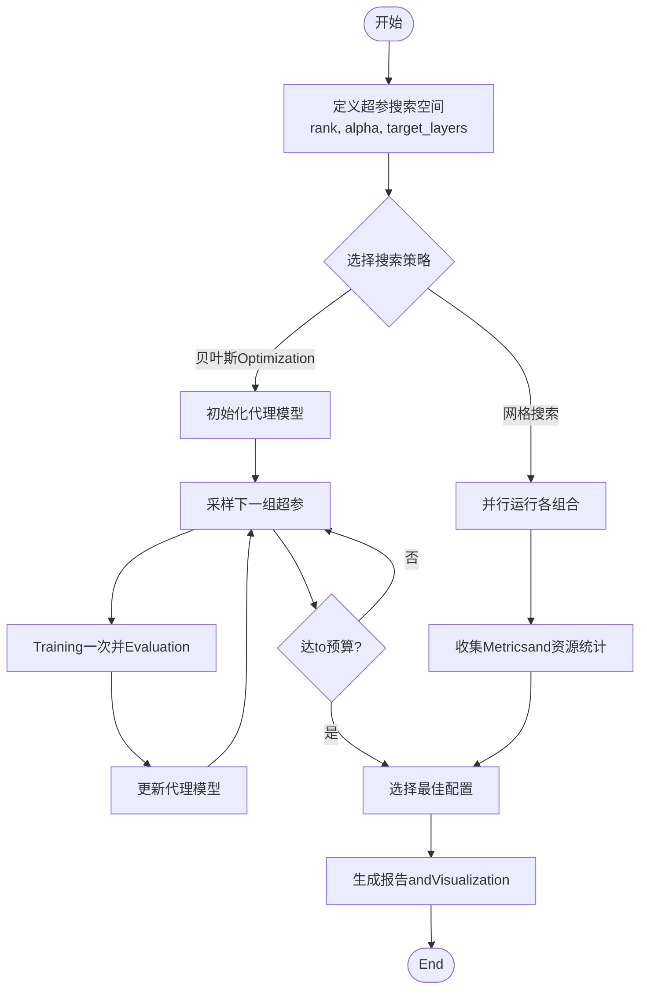
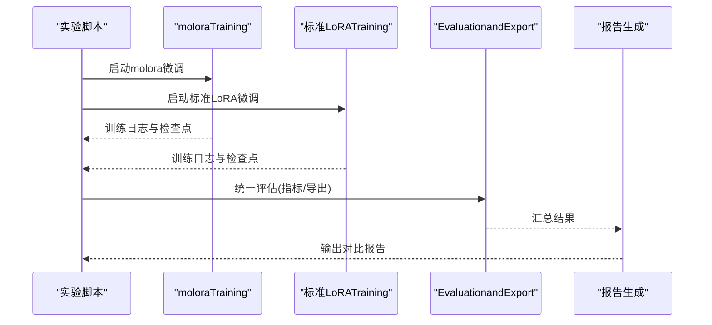
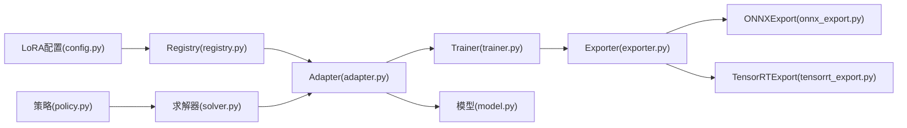

# PEFT Examples and Tutorials

<cite>
**Files Referenced in This Document**
- [examples/lora_examples/yolo_master_lora_README.md](file://examples/lora_examples/yolo_master_lora_README.md)
- [examples/lora_examples/yolo11_lora.yaml](file://examples/lora_examples/yolo11_lora.yaml)
- [examples/lora_examples/yolo12_lora.yaml](file://examples/lora_examples/yolo12_lora.yaml)
- [examples/lora_examples/yolov8_lora.yaml](file://examples/lora_examples/yolov8_lora.yaml)
- [examples/lora_examples/yolo_master_visdrone_lora.yaml](file://examples/lora_examples/yolo_master_visdrone_lora.yaml)
- [examples/lora_examples/run_yolo_master_lora_rank_sweep.py](file://examples/lora_examples/run_yolo_master_lora_rank_sweep.py)
- [examples/molora/compare_lora_molora.py](file://examples/molora/compare_lora_molora.py)
- [examples/molora/basic_finetune.py](file://examples/molora/basic_finetune.py)
- [examples/molora/compare_coco128.py](file://examples/molora/compare_coco128.py)
- [examples/molora/continual_learning.py](file://examples/molora/continual_learning.py)
- [ultralytics/utils/lora/__init__.py](file://ultralytics/utils/lora/__init__.py)
- [ultralytics/utils/lora/adapter.py](file://ultralytics/utils/lora/adapter.py)
- [ultralytics/utils/lora/config.py](file://ultralytics/utils/lora/config.py)
- [ultralytics/utils/lora/registry.py](file://ultralytics/utils/lora/registry.py)
- [ultralytics/utils/lora/export_utils.py](file://ultralytics/utils/lora/export_utils.py)
- [ultralytics/vpeft/__init__.py](file://ultralytics/vpeft/__init__.py)
- [ultralytics/vpeft/policy.py](file://ultralytics/vpeft/policy.py)
- [ultralytics/vpeft/solver.py](file://ultralytics/vpeft/solver.py)
- [ultralytics/engine/trainer.py](file://ultralytics/engine/trainer.py)
- [ultralytics/engine/model.py](file://ultralytics/engine/model.py)
- [ultralytics/engine/exporter.py](file://ultralytics/engine/exporter.py)
- [ultralytics/utils/export/onnx_export.py](file://ultralytics/utils/export/onnx_export.py)
- [ultralytics/utils/export/tensorrt_export.py](file://ultralytics/utils/export/tensorrt_export.py)
- [scripts/ablation_suite/ablation_peft_coco128.py](file://scripts/ablation_suite/ablation_peft_coco128.py)
- [scripts/peft_validation/plot_results.py](file://scripts/peft_validation/plot_results.py)
- [scripts/peft_validation/run_peft_compare.py](file://scripts/peft_validation/run_peft_compare.py)
- [tests/test_molora.py](file://tests/test_molora.py)
- [tests/test_vpeft.py](file://tests/test_vpeft.py)
- [tests/test_moe_aware_peft.py](file://tests/test_moe_aware_peft.py)
- [docs/LoRA_Quickstart.md](file://docs/LoRA_Quickstart.md)
- [docs/molora_guide.md](file://docs/molora_guide.md)
</cite>

## Table of Contents
1. [Introduction](#Introduction)
2. [Project Structure](#Project Structure)
3. [Core Components](#Core Components)
4. [Architecture Overview](#Architecture Overview)
5. [Detailed Component Analysis](#Detailed Component Analysis)
6. [Dependency Analysis](#Dependency Analysis)
7. [性能考量](#性能考量)
8. [Troubleshooting Guide](#Troubleshooting Guide)
9. [Conclusion](#Conclusion)
10. [Appendix](#Appendix)

## Introduction
本教程targeting希望whileYOLO-Master中UsesParameter-Efficient Fine-Tuning（PEFT，Centered onLoRAfor主）的EngineersandResearchers。内容覆盖：
- LoRA微调入门：环境配置、Data Preparation、模型选择、Training脚本
- 多TasksPEFT配置：Object Detection、Instance Segmentation、Pose Estimation、旋转边界框检测
- LoRA秩选择实验方法：网格搜索、贝叶斯Optimization、自动化调参
- moloraand标准LoRA对比：性能比较、资源消耗、部署效果Evaluation
- 多Tasks学习and领域适应案例
- Exportand部署：ONNX转换、TensorRTOptimization、Edge Device Deployment
- 诊断and调试工具Uses
- 基准测试andEvaluation方法

## Project Structure
仓库中andPEFT相关的代码andExamples主要分布whileCentered on下位置：
- Examples and Tutorials
  - examples/lora_examples：LoRA配置文件and秩扫描脚本
  - examples/molora：molora基础微调、对比实验、持续学习Examples
- 核心implementing
  - ultralytics/utils/lora：LoRAAdapter、配置、Registry、Export辅助
  - ultralytics/vpeft：策略and求解器（用于更广泛的PEFT规划and执行）
  - ultralytics/engine：Trainer、模型、Exporter集成点
  - ultralytics/utils/export：ONNX/TensorRTetc.Export Backends
- Validationand基准
  - scripts/ablation_suite：PEFT消融and对比脚本
  - scripts/peft_validation：结果Visualizationand对比运行
  - tests：单元测试覆盖molora、vpeft、MoE-aware PEFTetc.
- Documentation
  - docs/LoRA_Quickstart.md、docs/molora_guide.md：Quick Startandmolora指南

Figure Source
- [examples/lora_examples/yolo_master_lora_README.md:1-200](file://examples/lora_examples/yolo_master_lora_README.md#L1-L200)
- [examples/molora/compare_lora_molora.py:1-200](file://examples/molora/compare_lora_molora.py#L1-L200)
- [ultralytics/utils/lora/__init__.py:1-200](file://ultralytics/utils/lora/__init__.py#L1-L200)
- [ultralytics/vpeft/__init__.py:1-200](file://ultralytics/vpeft/__init__.py#L1-L200)
- [ultralytics/engine/trainer.py:1-200](file://ultralytics/engine/trainer.py#L1-L200)
- [ultralytics/utils/export/onnx_export.py:1-200](file://ultralytics/utils/export/onnx_export.py#L1-L200)

Section Source
- [examples/lora_examples/yolo_master_lora_README.md:1-200](file://examples/lora_examples/yolo_master_lora_README.md#L1-L200)
- [examples/molora/compare_lora_molora.py:1-200](file://examples/molora/compare_lora_molora.py#L1-L200)
- [ultralytics/utils/lora/__init__.py:1-200](file://ultralytics/utils/lora/__init__.py#L1-L200)
- [ultralytics/vpeft/__init__.py:1-200](file://ultralytics/vpeft/__init__.py#L1-L200)
- [ultralytics/engine/trainer.py:1-200](file://ultralytics/engine/trainer.py#L1-L200)
- [ultralytics/utils/export/onnx_export.py:1-200](file://ultralytics/utils/export/onnx_export.py#L1-L200)

## Core Components
- LoRAAdapterand配置
  - Adapter injectionand权重管理：负责将低秩矩阵插入to指定Modules中，并维护可Training参数集合
  - 配置解析and校验：从YAML或字典加载rank、alpha、target_modules、dropoutetc.关键超参
  - Registry机制：按Tasksand模型族自动匹配适配规则，避免手工拼装
  - Export辅助：whileExport时合并或分离LoRA权重，生成兼容格式
- vPEFT策略and求解器
  - 策略定义：描述哪些层应被冻结、哪些层应用何种PEFT方法（LoRA、DoRAetc.）
  - 求解器：根据约束and目标（显存、精度、吞吐）给出具体装配方案
- Trainer集成
  - Training流程中动态启用/禁用LoRA参数更新
  - andEMA、Gradient累积、Distributed Training协同
- Exporter集成
  - ONNX/TensorRTExport前对LoRA权重的处理（合并/保留for插件）
  - 运行时Inference路径的兼容性保证

Section Source
- [ultralytics/utils/lora/adapter.py:1-200](file://ultralytics/utils/lora/adapter.py#L1-L200)
- [ultralytics/utils/lora/config.py:1-200](file://ultralytics/utils/lora/config.py#L1-L200)
- [ultralytics/utils/lora/registry.py:1-200](file://ultralytics/utils/lora/registry.py#L1-L200)
- [ultralytics/utils/lora/export_utils.py:1-200](file://ultralytics/utils/lora/export_utils.py#L1-L200)
- [ultralytics/vpeft/policy.py:1-200](file://ultralytics/vpeft/policy.py#L1-L200)
- [ultralytics/vpeft/solver.py:1-200](file://ultralytics/vpeft/solver.py#L1-L200)
- [ultralytics/engine/trainer.py:1-200](file://ultralytics/engine/trainer.py#L1-L200)
- [ultralytics/engine/exporter.py:1-200](file://ultralytics/engine/exporter.py#L1-L200)

## Architecture Overview
下图展示了PEFTwhileTrainingandExport链路中的整体交互：

Figure Source
- [ultralytics/engine/trainer.py:1-200](file://ultralytics/engine/trainer.py#L1-L200)
- [ultralytics/engine/model.py:1-200](file://ultralytics/engine/model.py#L1-L200)
- [ultralytics/utils/lora/adapter.py:1-200](file://ultralytics/utils/lora/adapter.py#L1-L200)
- [ultralytics/engine/exporter.py:1-200](file://ultralytics/engine/exporter.py#L1-L200)
- [ultralytics/utils/export/onnx_export.py:1-200](file://ultralytics/utils/export/onnx_export.py#L1-L200)
- [ultralytics/utils/export/tensorrt_export.py:1-200](file://ultralytics/utils/export/tensorrt_export.py#L1-L200)

## Detailed Component Analysis

### LoRA微调入门教程
- 环境配置
  - 安装PyTorchandCUDAdrivers are installed；确保GPU可用
  - 克隆仓库并Installing Dependencies；建议创建独立虚拟环境
- Data Preparation
  - 采用YOLO格式数据集（images/labels），并whileYAML中声明train/val路径and类别数
  - Refer toExamples中的mini-detect或自定义数据集
- 模型选择
  - 选择YOLO11/YOLO12/YOLOv8etc.对应配置文件
  - whileLoRA YAML中指定base_modelandTasks类型
- Training脚本
  - Usesprovides的LoRA YAML进行Training；Supporting单卡/多卡
  - Viarank/alpha控制拟合capabilitiesand显存占用
- ValidationandExport
  - Training后whileValidation集上EvaluationMetrics
  - Exporting toONNX或TensorRT，便于部署

Section Source
- [examples/lora_examples/yolo_master_lora_README.md:1-200](file://examples/lora_examples/yolo_master_lora_README.md#L1-L200)
- [examples/lora_examples/yolo11_lora.yaml:1-200](file://examples/lora_examples/yolo11_lora.yaml#L1-L200)
- [examples/lora_examples/yolo12_lora.yaml:1-200](file://examples/lora_examples/yolo12_lora.yaml#L1-L200)
- [examples/lora_examples/yolov8_lora.yaml:1-200](file://examples/lora_examples/yolov8_lora.yaml#L1-L200)
- [examples/lora_examples/yolo_master_visdrone_lora.yaml:1-200](file://examples/lora_examples/yolo_master_visdrone_lora.yaml#L1-L200)
- [docs/LoRA_Quickstart.md:1-200](file://docs/LoRA_Quickstart.md#L1-L200)

### 多TasksPEFT配置（检测/分割/姿态/旋转框）
- Object Detection
  - whileLoRA YAML中设置task=detect，并指定类别数and输入尺寸
  - 推荐优先whileDetection Head附近注入LoRA，兼顾精度and效率
- Instance Segmentation
  - task=segment，注意掩码分支的LoRA注入位置and秩大小
- Pose Estimation
  - task=pose，关注关键点分支的适配策略
- 旋转边界框检测
  - task=obb，需确保旋转IoUandNMSwhileExport阶段兼容

Section Source
- [examples/lora_examples/yolo11_lora.yaml:1-200](file://examples/lora_examples/yolo11_lora.yaml#L1-L200)
- [examples/lora_examples/yolo12_lora.yaml:1-200](file://examples/lora_examples/yolo12_lora.yaml#L1-L200)
- [examples/lora_examples/yolov8_lora.yaml:1-200](file://examples/lora_examples/yolov8_lora.yaml#L1-L200)
- [examples/lora_examples/yolo_master_visdrone_lora.yaml:1-200](file://examples/lora_examples/yolo_master_visdrone_lora.yaml#L1-L200)

### LoRA秩选择的实验方法
- 网格搜索
  - 遍历rank∈{4,8,16,32}andalpha∈{2,4,8}的组合，记录mAPand显存占用
  - Uses秩扫描脚本批量运行并汇总结果
- 贝叶斯Optimization
  - 基于历史Training结果构建代理模型，自动探索最优超参空间
  - Combining早停and资源限制，减少无效Training
- 自动化调参
  - Unified entry point脚本聚合不同Tasks的LoRA配置，输出标准化报告

Figure Source
- [examples/lora_examples/run_yolo_master_lora_rank_sweep.py:1-200](file://examples/lora_examples/run_yolo_master_lora_rank_sweep.py#L1-L200)
- [scripts/ablation_suite/ablation_peft_coco128.py:1-200](file://scripts/ablation_suite/ablation_peft_coco128.py#L1-L200)
- [scripts/peft_validation/plot_results.py:1-200](file://scripts/peft_validation/plot_results.py#L1-L200)

Section Source
- [examples/lora_examples/run_yolo_master_lora_rank_sweep.py:1-200](file://examples/lora_examples/run_yolo_master_lora_rank_sweep.py#L1-L200)
- [scripts/ablation_suite/ablation_peft_coco128.py:1-200](file://scripts/ablation_suite/ablation_peft_coco128.py#L1-L200)
- [scripts/peft_validation/plot_results.py:1-200](file://scripts/peft_validation/plot_results.py#L1-L200)

### moloraand标准LoRA对比实验指南
- 实验设计
  - 相同数据集、相同基座模型、相同Training时长and批大小
  - 分别Usesmoloraand标准LoRA进行Training，记录mAP、F1、收敛曲线
- 资源消耗分析
  - 统计峰值显存、Training时间、Export模型体积
- 部署效果Evaluation
  - whileONNXandTensorRT下对比Inference延迟and吞吐
  - 边缘设备上Validation稳定性and功耗

Figure Source
- [examples/molora/compare_lora_molora.py:1-200](file://examples/molora/compare_lora_molora.py#L1-L200)
- [examples/molora/basic_finetune.py:1-200](file://examples/molora/basic_finetune.py#L1-L200)
- [examples/molora/compare_coco128.py:1-200](file://examples/molora/compare_coco128.py#L1-L200)
- [docs/molora_guide.md:1-200](file://docs/molora_guide.md#L1-L200)

Section Source
- [examples/molora/compare_lora_molora.py:1-200](file://examples/molora/compare_lora_molora.py#L1-L200)
- [examples/molora/basic_finetune.py:1-200](file://examples/molora/basic_finetune.py#L1-L200)
- [examples/molora/compare_coco128.py:1-200](file://examples/molora/compare_coco128.py#L1-L200)
- [docs/molora_guide.md:1-200](file://docs/molora_guide.md#L1-L200)

### 多Tasks学习and领域适应案例
- 多Tasks学习
  - while同一基座上同时适配检测、分割、姿态etc.多Tasks分支
  - UsesvPEFT策略while不同Tasks间共享and隔离LoRA参数
- 领域适应
  - 针对特定领域（such asVisDrone、医学影像）进行轻量微调
  - CombiningData Augmentationand正则化提升泛化capabilities

Section Source
- [ultralytics/vpeft/policy.py:1-200](file://ultralytics/vpeft/policy.py#L1-L200)
- [ultralytics/vpeft/solver.py:1-200](file://ultralytics/vpeft/solver.py#L1-L200)
- [examples/molora/continual_learning.py:1-200](file://examples/molora/continual_learning.py#L1-L200)

### Exportand部署Examples
- ONNX转换
  - Export前Optional择是否合并LoRA权重；保持Inference图简洁
  - ValidationExport模型的数值一致性
- TensorRTOptimization
  - 生成FP16/INT8引擎，权衡精度and速度
  - while目标硬件上进行端to端延迟测试
- Edge Device Deployment
  - 将ONNX/TensorRT模型部署至Jetson、RKNNetc.平台
  - 监控内存占用and温度，调整批大小and分辨率

Section Source
- [ultralytics/utils/lora/export_utils.py:1-200](file://ultralytics/utils/lora/export_utils.py#L1-L200)
- [ultralytics/utils/export/onnx_export.py:1-200](file://ultralytics/utils/export/onnx_export.py#L1-L200)
- [ultralytics/utils/export/tensorrt_export.py:1-200](file://ultralytics/utils/export/tensorrt_export.py#L1-L200)
- [ultralytics/engine/exporter.py:1-200](file://ultralytics/engine/exporter.py#L1-L200)

### 诊断and调试工具Uses方法
- Training诊断
  - 查看LoRA参数更新幅度and分布，识别不收敛或过拟合
  - UsesValidation脚本对比不同配置的Metrics趋势
- Export诊断
  - 检查Export前后数值差异，定位潜while算子兼容问题
- 单元测试
  - 运行molora、vPEFT、MoE-aware PEFT相关测试用例，确保功能稳定

Section Source
- [scripts/peft_validation/run_peft_compare.py:1-200](file://scripts/peft_validation/run_peft_compare.py#L1-L200)
- [scripts/peft_validation/plot_results.py:1-200](file://scripts/peft_validation/plot_results.py#L1-L200)
- [tests/test_molora.py:1-200](file://tests/test_molora.py#L1-L200)
- [tests/test_vpeft.py:1-200](file://tests/test_vpeft.py#L1-L200)
- [tests/test_moe_aware_peft.py:1-200](file://tests/test_moe_aware_peft.py#L1-L200)

### 性能基准测试andEvaluation方法
- Metrics体系
  - 检测：mAP@0.5:0.95、F1、召回率
  - 分割：mAP、Dice系数
  - 姿态：AP、PCK
- 资源Metrics
  - 峰值显存、Training时长、Export模型体积、Inference延迟、吞吐
- Evaluation流程
  - 固定随机种子and数据划分，重复多次取均值and方差
  - 跨平台对比（CPU/GPU/边缘设备）

Section Source
- [scripts/ablation_suite/ablation_peft_coco128.py:1-200](file://scripts/ablation_suite/ablation_peft_coco128.py#L1-L200)
- [scripts/peft_validation/plot_results.py:1-200](file://scripts/peft_validation/plot_results.py#L1-L200)

## Dependency Analysis
LoRAandvPEFTwhileTrainingandExport链路中的依赖关系such as下：

Figure Source
- [ultralytics/utils/lora/config.py:1-200](file://ultralytics/utils/lora/config.py#L1-L200)
- [ultralytics/utils/lora/registry.py:1-200](file://ultralytics/utils/lora/registry.py#L1-L200)
- [ultralytics/utils/lora/adapter.py:1-200](file://ultralytics/utils/lora/adapter.py#L1-L200)
- [ultralytics/engine/trainer.py:1-200](file://ultralytics/engine/trainer.py#L1-L200)
- [ultralytics/engine/model.py:1-200](file://ultralytics/engine/model.py#L1-L200)
- [ultralytics/engine/exporter.py:1-200](file://ultralytics/engine/exporter.py#L1-L200)
- [ultralytics/utils/export/onnx_export.py:1-200](file://ultralytics/utils/export/onnx_export.py#L1-L200)
- [ultralytics/utils/export/tensorrt_export.py:1-200](file://ultralytics/utils/export/tensorrt_export.py#L1-L200)
- [ultralytics/vpeft/policy.py:1-200](file://ultralytics/vpeft/policy.py#L1-L200)
- [ultralytics/vpeft/solver.py:1-200](file://ultralytics/vpeft/solver.py#L1-L200)

Section Source
- [ultralytics/utils/lora/config.py:1-200](file://ultralytics/utils/lora/config.py#L1-L200)
- [ultralytics/utils/lora/registry.py:1-200](file://ultralytics/utils/lora/registry.py#L1-L200)
- [ultralytics/utils/lora/adapter.py:1-200](file://ultralytics/utils/lora/adapter.py#L1-L200)
- [ultralytics/engine/trainer.py:1-200](file://ultralytics/engine/trainer.py#L1-L200)
- [ultralytics/engine/model.py:1-200](file://ultralytics/engine/model.py#L1-L200)
- [ultralytics/engine/exporter.py:1-200](file://ultralytics/engine/exporter.py#L1-L200)
- [ultralytics/utils/export/onnx_export.py:1-200](file://ultralytics/utils/export/onnx_export.py#L1-L200)
- [ultralytics/utils/export/tensorrt_export.py:1-200](file://ultralytics/utils/export/tensorrt_export.py#L1-L200)
- [ultralytics/vpeft/policy.py:1-200](file://ultralytics/vpeft/policy.py#L1-L200)
- [ultralytics/vpeft/solver.py:1-200](file://ultralytics/vpeft/solver.py#L1-L200)

## 性能考量
- 秩andAlpha的选择
  - rank越大拟合capabilities越强但显存and计算开销增加；alpha影响缩放比例，需andlrCombined with
- 目标层选择
  - 仅while关键分支注入LoRA可减少参数规模并保持精度
- Training技巧
  - UsesEMA平滑权重、Gradient裁剪andMixture精度加速Training
- ExportOptimization
  - 合并LoRA权重可降低Inference图复杂度；TensorRT量化需谨慎校准

[本节provides一般性指导，无需特定文件引用]

## Troubleshooting Guide
- Training不收敛
  - 检查LoRA lrand主模型lr的比例；确认目标层是否正确注入
  - 观察LoRA参数范数变化，避免爆炸或消失
- Export Failure或数值不一致
  - 核对Export选项（是否合并LoRA）；ValidationONNX/TensorRT算子Supporting
  - UsesExport前后对比脚本定位差异
- 资源不足
  - 降低rank或batch size；启用Gradient累积
  - Uses半精度TrainingandExport

Section Source
- [scripts/peft_validation/run_peft_compare.py:1-200](file://scripts/peft_validation/run_peft_compare.py#L1-L200)
- [ultralytics/utils/lora/export_utils.py:1-200](file://ultralytics/utils/lora/export_utils.py#L1-L200)
- [ultralytics/utils/export/onnx_export.py:1-200](file://ultralytics/utils/export/onnx_export.py#L1-L200)
- [ultralytics/utils/export/tensorrt_export.py:1-200](file://ultralytics/utils/export/tensorrt_export.py#L1-L200)

## Conclusion
本教程系统梳理了YOLO-Master中PEFT（Centered onLoRAfor主）的完整工作流，涵盖从入门to高级应用的关键环节。Via合理的秩选择andTasks适配策略，可while有限资源下获得良好性能；Combiningmoloraand标准LoRA的对比实验，可进一步挖掘不同场景下的最优实践。Exportand部署环节的规范操作有助于将研究成果稳定落地。

[本节for总结性内容，无需特定文件引用]

## Appendix
- Quick Start
  - Refer toLoRAQuick StartDocumentationandExamplesYAML，完成首次微调
- molora指南
  - 了解molora的Training流程and对比实验方法
- 更多Examples
  - 浏览examples/lora_examplesandexamples/molora中的脚本and配置

Section Source
- [docs/LoRA_Quickstart.md:1-200](file://docs/LoRA_Quickstart.md#L1-L200)
- [docs/molora_guide.md:1-200](file://docs/molora_guide.md#L1-L200)
- [examples/lora_examples/yolo_master_lora_README.md:1-200](file://examples/lora_examples/yolo_master_lora_README.md#L1-L200)