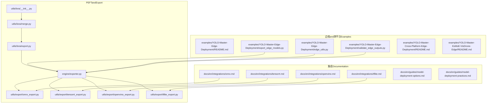
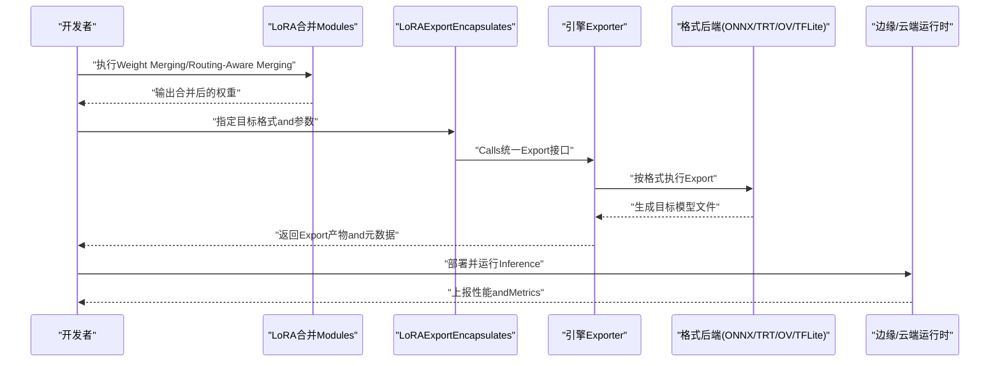
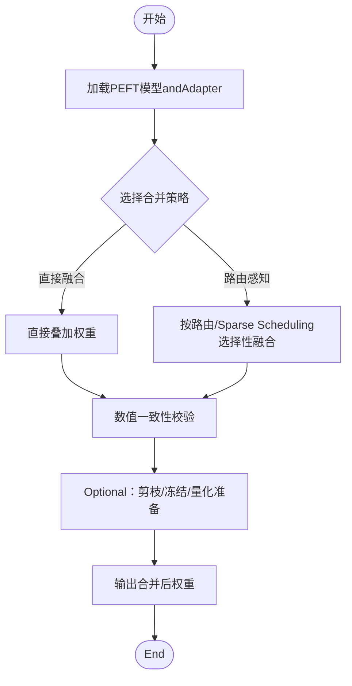
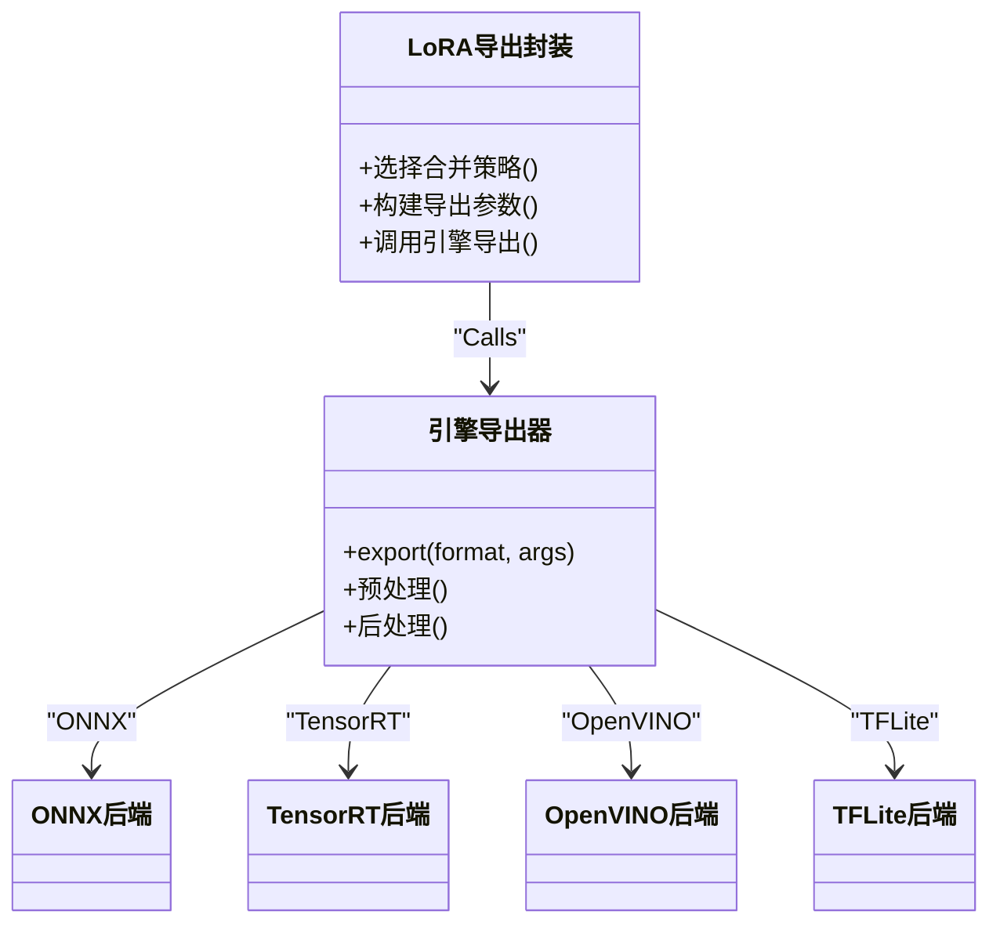
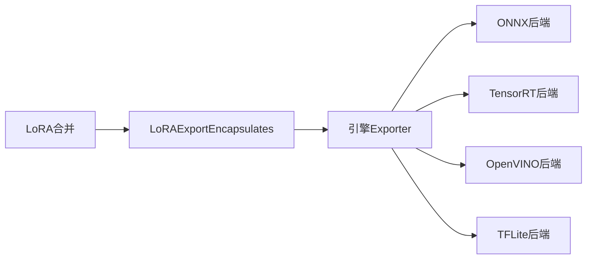

# PEFT模型部署

<cite>
**Files Referenced in This Document**
- [ultralytics/utils/lora/__init__.py](file://ultralytics/utils/lora/__init__.py)
- [ultralytics/utils/lora/merge.py](file://ultralytics/utils/lora/merge.py)
- [ultralytics/utils/lora/export.py](file://ultralytics/utils/lora/export.py)
- [ultralytics/engine/exporter.py](file://ultralytics/engine/exporter.py)
- [ultralytics/utils/export/onnx_export.py](file://ultralytics/utils/export/onnx_export.py)
- [ultralytics/utils/export/tensorrt_export.py](file://ultralytics/utils/export/tensorrt_export.py)
- [ultralytics/utils/export/openvino_export.py](file://ultralytics/utils/export/openvino_export.py)
- [ultralytics/utils/export/tflite_export.py](file://ultralytics/utils/export/tflite_export.py)
- [examples/YOLO-Master-Cross-Platform-Edge-Deployment/README.md](file://examples/YOLO-Master-Cross-Platform-Edge-Deployment/README.md)
- [examples/YOLO-Master-Edge-Deployment/README.md](file://examples/YOLO-Master-Edge-Deployment/README.md)
- [examples/YOLO-Master-Edge-Deployment/export_edge_models.py](file://examples/YOLO-Master-Edge-Deployment/export_edge_models.py)
- [examples/YOLO-Master-Edge-Deployment/edge_utils.py](file://examples/YOLO-Master-Edge-Deployment/edge_utils.py)
- [examples/YOLO-Master-Edge-Deployment/validate_edge_outputs.py](file://examples/YOLO-Master-Edge-Deployment/validate_edge_outputs.py)
- [examples/YOLO-Master-EsMoE-VisDrone-Edge/README.md](file://examples/YOLO-Master-EsMoE-VisDrone-Edge/README.md)
- [examples/YOLOv8-TFLite-Python/main.py](file://examples/YOLOv8-TFLite-Python/main.py)
- [examples/YOLOv8-OpenVINO-CPP-Inference/main.cc](file://examples/YOLOv8-OpenVINO-CPP-Inference/main.cc)
- [examples/YOLO11-Triton-CPP/main.cpp](file://examples/YOLO11-Triton-CPP/main.cpp)
- [docker/Dockerfile](file://docker/Dockerfile)
- [scripts/peft_validation/run_peft_compare.py](file://scripts/peft_validation/run_peft_compare.py)
- [tests/test_molora_merge_semantics.py](file://tests/test_molora_merge_semantics.py)
- [tests/test_molora_routing_aware_merge.py](file://tests/test_molora_routing_aware_merge.py)
- [tests/test_peft_adapters.py](file://tests/test_peft_adapters.py)
- [benchmarks/suite.py](file://benchmarks/suite.py)
- [benchmarks/benchmark_molora_dispatch.py](file://benchmarks/benchmark_molora_dispatch.py)
- [docs/en/guides/model-deployment-options.md](file://docs/en/guides/model-deployment-options.md)
- [docs/en/guides/model-deployment-practices.md](file://docs/en/guides/model-deployment-practices.md)
- [docs/en/integrations/onnx.md](file://docs/en/integrations/onnx.md)
- [docs/en/integrations/tensorrt.md](file://docs/en/integrations/tensorrt.md)
- [docs/en/integrations/openvino.md](file://docs/en/integrations/openvino.md)
- [docs/en/integrations/tflite.md](file://docs/en/integrations/tflite.md)
</cite>

## Table of Contents
1. [Introduction](#Introduction)
2. [Project Structure](#Project Structure)
3. [Core Components](#Core Components)
4. [Architecture Overview](#Architecture Overview)
5. [Detailed Component Analysis](#Detailed Component Analysis)
6. [Dependency Analysis](#Dependency Analysis)
7. [性能andOptimization](#性能andOptimization)
8. [故障诊断and监控](#故障诊断and监控)
9. [Conclusion](#Conclusion)
10. [Appendix](#Appendix)

## Introduction
本指南targetingYOLO-Master的PEFT（Centered onLoRAfor主）模型，provides从Weight Merging、Exportto多平台部署的一体化方案。内容覆盖：
- LoRAAdapter合并方法and权重Optimization技术
- ONNX、TensorRT、OpenVINO、TFLiteetc.Export流程
- Edge Device Deployment的内存Optimization、量化压缩andInference加速
- 移动端（iOS/Android）适配要点
- 云服务容器化、微服务andLoad Balancing最佳实践
- PEFT版本管理andA/B测试策略
- 部署后性能监控and故障诊断方法
- 不同场景硬件要求and成本Optimization建议

## Project Structure
围绕PEFT部署的关键代码andExamples分布such as下：
- LoRAandPEFT工具：utils/lora、engine/exporter、utils/export_*
- 边缘and跨平台Examples：examples/YOLO-Master-*
- 集成Documentation：docs/en/integrations/*
- 基准andValidation：benchmarks、tests、scripts/peft_validation

Figure Source
- [ultralytics/utils/lora/__init__.py](file://ultralytics/utils/lora/__init__.py)
- [ultralytics/utils/lora/merge.py](file://ultralytics/utils/lora/merge.py)
- [ultralytics/utils/lora/export.py](file://ultralytics/utils/lora/export.py)
- [ultralytics/engine/exporter.py](file://ultralytics/engine/exporter.py)
- [ultralytics/utils/export/onnx_export.py](file://ultralytics/utils/export/onnx_export.py)
- [ultralytics/utils/export/tensorrt_export.py](file://ultralytics/utils/export/tensorrt_export.py)
- [ultralytics/utils/export/openvino_export.py](file://ultralytics/utils/export/openvino_export.py)
- [ultralytics/utils/export/tflite_export.py](file://ultralytics/utils/export/tflite_export.py)
- [examples/YOLO-Master-Edge-Deployment/export_edge_models.py](file://examples/YOLO-Master-Edge-Deployment/export_edge_models.py)
- [examples/YOLO-Master-Edge-Deployment/edge_utils.py](file://examples/YOLO-Master-Edge-Deployment/edge_utils.py)
- [examples/YOLO-Master-Edge-Deployment/validate_edge_outputs.py](file://examples/YOLO-Master-Edge-Deployment/validate_edge_outputs.py)
- [docs/en/integrations/onnx.md](file://docs/en/integrations/onnx.md)
- [docs/en/integrations/tensorrt.md](file://docs/en/integrations/tensorrt.md)
- [docs/en/integrations/openvino.md](file://docs/en/integrations/openvino.md)
- [docs/en/integrations/tflite.md](file://docs/en/integrations/tflite.md)

Section Source
- [ultralytics/utils/lora/__init__.py](file://ultralytics/utils/lora/__init__.py)
- [ultralytics/utils/lora/merge.py](file://ultralytics/utils/lora/merge.py)
- [ultralytics/utils/lora/export.py](file://ultralytics/utils/lora/export.py)
- [ultralytics/engine/exporter.py](file://ultralytics/engine/exporter.py)
- [ultralytics/utils/export/onnx_export.py](file://ultralytics/utils/export/onnx_export.py)
- [ultralytics/utils/export/tensorrt_export.py](file://ultralytics/utils/export/tensorrt_export.py)
- [ultralytics/utils/export/openvino_export.py](file://ultralytics/utils/export/openvino_export.py)
- [ultralytics/utils/export/tflite_export.py](file://ultralytics/utils/export/tflite_export.py)
- [examples/YOLO-Master-Edge-Deployment/export_edge_models.py](file://examples/YOLO-Master-Edge-Deployment/export_edge_models.py)
- [examples/YOLO-Master-Edge-Deployment/edge_utils.py](file://examples/YOLO-Master-Edge-Deployment/edge_utils.py)
- [examples/YOLO-Master-Edge-Deployment/validate_edge_outputs.py](file://examples/YOLO-Master-Edge-Deployment/validate_edge_outputs.py)
- [docs/en/integrations/onnx.md](file://docs/en/integrations/onnx.md)
- [docs/en/integrations/tensorrt.md](file://docs/en/integrations/tensorrt.md)
- [docs/en/integrations/openvino.md](file://docs/en/integrations/openvino.md)
- [docs/en/integrations/tflite.md](file://docs/en/integrations/tflite.md)

## Core Components
- LoRA合并Modules：负责将LoRA权重安全地融合回主干网络，Supporting路由感知andSparse Scheduling场景下的合并语义校验。
- LoRAExportEncapsulates：whileExport前完成合并或动态加载策略选择，统一对接引擎Exporter。
- 引擎Exporter：对外暴露统一的export接口，内部根据目标格式Calls具体后端（ONNX/TensorRT/OpenVINO/TFLite）。
- 各格式后端：分别implementing图转换、算子兼容、精度/性能开关and量化选项。
- 边缘Examples脚本：provides端to端Export、Validationand部署Refer to，涵盖CPU/GPU/NPUetc.不同目标。

Section Source
- [ultralytics/utils/lora/merge.py](file://ultralytics/utils/lora/merge.py)
- [ultralytics/utils/lora/export.py](file://ultralytics/utils/lora/export.py)
- [ultralytics/engine/exporter.py](file://ultralytics/engine/exporter.py)
- [ultralytics/utils/export/onnx_export.py](file://ultralytics/utils/export/onnx_export.py)
- [ultralytics/utils/export/tensorrt_export.py](file://ultralytics/utils/export/tensorrt_export.py)
- [ultralytics/utils/export/openvino_export.py](file://ultralytics/utils/export/openvino_export.py)
- [ultralytics/utils/export/tflite_export.py](file://ultralytics/utils/export/tflite_export.py)

## Architecture Overview
下图展示从Training好的PEFT模型to多目标部署产物的整体流程，包括合并、Export、Validationand运行。

Figure Source
- [ultralytics/utils/lora/merge.py](file://ultralytics/utils/lora/merge.py)
- [ultralytics/utils/lora/export.py](file://ultralytics/utils/lora/export.py)
- [ultralytics/engine/exporter.py](file://ultralytics/engine/exporter.py)
- [ultralytics/utils/export/onnx_export.py](file://ultralytics/utils/export/onnx_export.py)
- [ultralytics/utils/export/tensorrt_export.py](file://ultralytics/utils/export/tensorrt_export.py)
- [ultralytics/utils/export/openvino_export.py](file://ultralytics/utils/export/openvino_export.py)
- [ultralytics/utils/export/tflite_export.py](file://ultralytics/utils/export/tflite_export.py)

## Detailed Component Analysis

### LoRAAdapter合并and权重Optimization
- 合并策略
  - 直接融合：将LoRA增量权重叠加回主干，减少Inference时分支开销。
  - Routing-Aware Merging：针对MoE/MoAetc.路由结构，按专家激活比例andSparse Scheduling进行选择性融合，避免无关专家参and计算。
- 权重Optimization
  - 精度保留：合并前后数值一致性校验，必要时启用高精度中间态。
  - 稀疏性保持：对未激活专家或低贡献路径进行剪枝或冻结，降低显存占用。
  - 量化友好：合并后便于后续INT8/FP16量化，减少精度损失。
- 关键implementing位置
  - 合并入口andAPI：[ultralytics/utils/lora/merge.py](file://ultralytics/utils/lora/merge.py)
  - 合并语义and路由感知逻辑：[tests/test_molora_merge_semantics.py](file://tests/test_molora_merge_semantics.py)、[tests/test_molora_routing_aware_merge.py](file://tests/test_molora_routing_aware_merge.py)

Figure Source
- [ultralytics/utils/lora/merge.py](file://ultralytics/utils/lora/merge.py)
- [tests/test_molora_merge_semantics.py](file://tests/test_molora_merge_semantics.py)
- [tests/test_molora_routing_aware_merge.py](file://tests/test_molora_routing_aware_merge.py)

Section Source
- [ultralytics/utils/lora/merge.py](file://ultralytics/utils/lora/merge.py)
- [tests/test_molora_merge_semantics.py](file://tests/test_molora_merge_semantics.py)
- [tests/test_molora_routing_aware_merge.py](file://tests/test_molora_routing_aware_merge.py)

### ExportEncapsulatesand引擎对接
- 职责划分
  - LoRAExportEncapsulates：决定“先合并再Export”或“动态加载Adapter”的策略，统一Parameter Passing。
  - 引擎Exporter：接收目标格式、输入形状、精度andOptimization开关，协调后端完成Export。
- 关键implementing位置
  - LoRAExportEncapsulates：[ultralytics/utils/lora/export.py](file://ultralytics/utils/lora/export.py)
  - 引擎Exporter：[ultralytics/engine/exporter.py](file://ultralytics/engine/exporter.py)

Figure Source
- [ultralytics/utils/lora/export.py](file://ultralytics/utils/lora/export.py)
- [ultralytics/engine/exporter.py](file://ultralytics/engine/exporter.py)
- [ultralytics/utils/export/onnx_export.py](file://ultralytics/utils/export/onnx_export.py)
- [ultralytics/utils/export/tensorrt_export.py](file://ultralytics/utils/export/tensorrt_export.py)
- [ultralytics/utils/export/openvino_export.py](file://ultralytics/utils/export/openvino_export.py)
- [ultralytics/utils/export/tflite_export.py](file://ultralytics/utils/export/tflite_export.py)

Section Source
- [ultralytics/utils/lora/export.py](file://ultralytics/utils/lora/export.py)
- [ultralytics/engine/exporter.py](file://ultralytics/engine/exporter.py)

### 多格式Export流程

#### ONNXExport
- Applicable Scenarios：通用Inference、跨框架Migration、服务端Batch Inference
- 关键步骤
  - 设置输入形状and动态轴
  - 选择算子集andOptimization级别
  - Export后Usesonnxruntime进行Validation
- Refer toimplementingandDocumentation
  - 后端implementing：[ultralytics/utils/export/onnx_export.py](file://ultralytics/utils/export/onnx_export.py)
  - 集成Documentation：[docs/en/integrations/onnx.md](file://docs/en/integrations/onnx.md)

Section Source
- [ultralytics/utils/export/onnx_export.py](file://ultralytics/utils/export/onnx_export.py)
- [docs/en/integrations/onnx.md](file://docs/en/integrations/onnx.md)

#### TensorRTExport
- Applicable Scenarios：NVIDIA GPU高吞吐低延迟Inference
- 关键步骤
  - 配置精度（FP16/INT8）、校准数据集andOptimization级别
  - 生成engine文件并进行warmup
- Refer toimplementingandDocumentation
  - 后端implementing：[ultralytics/utils/export/tensorrt_export.py](file://ultralytics/utils/export/tensorrt_export.py)
  - 集成Documentation：[docs/en/integrations/tensorrt.md](file://docs/en/integrations/tensorrt.md)

Section Source
- [ultralytics/utils/export/tensorrt_export.py](file://ultralytics/utils/export/tensorrt_export.py)
- [docs/en/integrations/tensorrt.md](file://docs/en/integrations/tensorrt.md)

#### OpenVINOExport
- Applicable Scenarios：Intel CPU/NPU、边缘设备
- 关键步骤
  - 选择IR或MO模型，配置IOMode（延迟/吞吐）
  - Combining量化and编译Optimization
- Refer toimplementingandDocumentation
  - 后端implementing：[ultralytics/utils/export/openvino_export.py](file://ultralytics/utils/export/openvino_export.py)
  - 集成Documentation：[docs/en/integrations/openvino.md](file://docs/en/integrations/openvino.md)

Section Source
- [ultralytics/utils/export/openvino_export.py](file://ultralytics/utils/export/openvino_export.py)
- [docs/en/integrations/openvino.md](file://docs/en/integrations/openvino.md)

#### TFLiteExport
- Applicable Scenarios：移动端and嵌入式设备
- 关键步骤
  - 配置输入形状and量化（FP16/INT8）
  - UsesLite RuntimeValidation
- Refer toimplementingandDocumentation
  - 后端implementing：[ultralytics/utils/export/tflite_export.py](file://ultralytics/utils/export/tflite_export.py)
  - 集成Documentation：[docs/en/integrations/tflite.md](file://docs/en/integrations/tflite.md)
  - PythonExamples：[examples/YOLOv8-TFLite-Python/main.py](file://examples/YOLOv8-TFLite-Python/main.py)

Section Source
- [ultralytics/utils/export/tflite_export.py](file://ultralytics/utils/export/tflite_export.py)
- [docs/en/integrations/tflite.md](file://docs/en/integrations/tflite.md)
- [examples/YOLOv8-TFLite-Python/main.py](file://examples/YOLOv8-TFLite-Python/main.py)

### Edge Device Deployment
- 推荐流程
  - Uses边缘Export脚本统一生成目标格式，并进行输出一致性校验
  - Combining设备特性选择最优后端（such asOpenVINO NPU、CoreML、RKNNetc.）
- Refer toimplementingandDocumentation
  - 边缘Export脚本：[examples/YOLO-Master-Edge-Deployment/export_edge_models.py](file://examples/YOLO-Master-Edge-Deployment/export_edge_models.py)
  - 边缘工具andValidation：[examples/YOLO-Master-Edge-Deployment/edge_utils.py](file://examples/YOLO-Master-Edge-Deployment/edge_utils.py)、[examples/YOLO-Master-Edge-Deployment/validate_edge_outputs.py](file://examples/YOLO-Master-Edge-Deployment/validate_edge_outputs.py)
  - Cross-Platform Deployment说明：[examples/YOLO-Master-Cross-Platform-Edge-Deployment/README.md](file://examples/YOLO-Master-Cross-Platform-Edge-Deployment/README.md)
  - 特定Tasks边缘案例（EsMoE+VisDrone）：[examples/YOLO-Master-EsMoE-VisDrone-Edge/README.md](file://examples/YOLO-Master-EsMoE-VisDrone-Edge/README.md)

Section Source
- [examples/YOLO-Master-Edge-Deployment/export_edge_models.py](file://examples/YOLO-Master-Edge-Deployment/export_edge_models.py)
- [examples/YOLO-Master-Edge-Deployment/edge_utils.py](file://examples/YOLO-Master-Edge-Deployment/edge_utils.py)
- [examples/YOLO-Master-Edge-Deployment/validate_edge_outputs.py](file://examples/YOLO-Master-Edge-Deployment/validate_edge_outputs.py)
- [examples/YOLO-Master-Cross-Platform-Edge-Deployment/README.md](file://examples/YOLO-Master-Cross-Platform-Edge-Deployment/README.md)
- [examples/YOLO-Master-EsMoE-VisDrone-Edge/README.md](file://examples/YOLO-Master-EsMoE-VisDrone-Edge/README.md)

### Mobile Deployment（iOS/Android）
- iOS
  - PreferCoreMLExport，CombiningXcode集成andMetal加速
  - 注意输入尺寸and动态轴限制，必要时固定shape
- Android
  - UsesTFLite或NCNN/MNNetc.轻量后端，Combined withGPU/NPU插件
  - 量化and算子兼容性需充分Validation
- Refer toDocumentationandExamples
  - TFLite集成DocumentationandExamples：[docs/en/integrations/tflite.md](file://docs/en/integrations/tflite.md)、[examples/YOLOv8-TFLite-Python/main.py](file://examples/YOLOv8-TFLite-Python/main.py)
  - Cross-Platform Deployment说明：[examples/YOLO-Master-Cross-Platform-Edge-Deployment/README.md](file://examples/YOLO-Master-Cross-Platform-Edge-Deployment/README.md)

Section Source
- [docs/en/integrations/tflite.md](file://docs/en/integrations/tflite.md)
- [examples/YOLOv8-TFLite-Python/main.py](file://examples/YOLOv8-TFLite-Python/main.py)
- [examples/YOLO-Master-Cross-Platform-Edge-Deployment/README.md](file://examples/YOLO-Master-Cross-Platform-Edge-Deployment/README.md)

### Cloud Service Deployment（容器化、微服务、Load Balancing）
- 容器化
  - 基于Docker镜像打包Inference环境，固化依赖anddrivers are installed版本
  - Refer to镜像：[docker/Dockerfile](file://docker/Dockerfile)
- 微服务
  - 将Export模型作for独立服务，ViagRPC/HTTP暴露Inference接口
  - Combining批处理and队列提升吞吐
- Load Balancing
  - UsesTriton Inference Server或Kubernetes HPA进行水平扩展
  - Refer toC++Examplesand服务编排思路：[examples/YOLO11-Triton-CPP/main.cpp](file://examples/YOLO11-Triton-CPP/main.cpp)
- Refer toDocumentation
  - 部署选项and实践：[docs/en/guides/model-deployment-options.md](file://docs/en/guides/model-deployment-options.md)、[docs/en/guides/model-deployment-practices.md](file://docs/en/guides/model-deployment-practices.md)

Section Source
- [docker/Dockerfile](file://docker/Dockerfile)
- [examples/YOLO11-Triton-CPP/main.cpp](file://examples/YOLO11-Triton-CPP/main.cpp)
- [docs/en/guides/model-deployment-options.md](file://docs/en/guides/model-deployment-options.md)
- [docs/en/guides/model-deployment-practices.md](file://docs/en/guides/model-deployment-practices.md)

### PEFT版本管理andA/B测试
- 版本管理
  - for每次合并andExport产物打上唯一版本号，记录超参、数据分布andEvaluationMetrics
  - Uses模型Registryand制品库管理不同格式的产出物
- A/B测试
  - 并行部署多个版本，按流量切分对比关键Metrics（mAP、延迟、吞吐、资源占用）
  - 自动化回归andDrift Detection，确保上线质量
- Refer to脚本and测试
  - PEFT对比Validation脚本：[scripts/peft_validation/run_peft_compare.py](file://scripts/peft_validation/run_peft_compare.py)
  - 合并语义and路由感知测试：[tests/test_molora_merge_semantics.py](file://tests/test_molora_merge_semantics.py)、[tests/test_molora_routing_aware_merge.py](file://tests/test_molora_routing_aware_merge.py)

Section Source
- [scripts/peft_validation/run_peft_compare.py](file://scripts/peft_validation/run_peft_compare.py)
- [tests/test_molora_merge_semantics.py](file://tests/test_molora_merge_semantics.py)
- [tests/test_molora_routing_aware_merge.py](file://tests/test_molora_routing_aware_merge.py)

## Dependency Analysis
- 耦合and内聚
  - LoRA合并andExportEncapsulates相对独立，ViaUnified Interfaceand引擎Exporter解耦
  - 各格式后端仅关注自身转换细节，利于替换and扩展
- External Dependencies
  - ONNXRuntime、TensorRT、OpenVINO、TFLite运行时
  - 边缘SDK（CoreML、RKNN、NCNNetc.）
- Potential Cycles依赖
  - 当前结构无循环导入风险；Exporterand后端单向依赖

Figure Source
- [ultralytics/utils/lora/merge.py](file://ultralytics/utils/lora/merge.py)
- [ultralytics/utils/lora/export.py](file://ultralytics/utils/lora/export.py)
- [ultralytics/engine/exporter.py](file://ultralytics/engine/exporter.py)
- [ultralytics/utils/export/onnx_export.py](file://ultralytics/utils/export/onnx_export.py)
- [ultralytics/utils/export/tensorrt_export.py](file://ultralytics/utils/export/tensorrt_export.py)
- [ultralytics/utils/export/openvino_export.py](file://ultralytics/utils/export/openvino_export.py)
- [ultralytics/utils/export/tflite_export.py](file://ultralytics/utils/export/tflite_export.py)

Section Source
- [ultralytics/utils/lora/merge.py](file://ultralytics/utils/lora/merge.py)
- [ultralytics/utils/lora/export.py](file://ultralytics/utils/lora/export.py)
- [ultralytics/engine/exporter.py](file://ultralytics/engine/exporter.py)
- [ultralytics/utils/export/onnx_export.py](file://ultralytics/utils/export/onnx_export.py)
- [ultralytics/utils/export/tensorrt_export.py](file://ultralytics/utils/export/tensorrt_export.py)
- [ultralytics/utils/export/openvino_export.py](file://ultralytics/utils/export/openvino_export.py)
- [ultralytics/utils/export/tflite_export.py](file://ultralytics/utils/export/tflite_export.py)

## 性能andOptimization
- 合并阶段
  - Routing-Aware Merging可减少无效专家计算，适合Sparse Scheduling场景
  - 合并后进行数值一致性校验，避免精度退化
- Export阶段
  - ONNX：Set appropriately动态轴andOptimization级别，Combiningonnxruntime会话池
  - TensorRT：开启FP16/INT8，Uses校准集and层融合
  - OpenVINO：选择IOMode=THROUGHPUT或LATENCY，启用量化andNPU加速
  - TFLite：优先INT8量化，关闭不必要算子
- 运行阶段
  - 批处理and流水线并行，预热会话，复用内存
  - 边缘设备：固定输入尺寸、裁剪冗余通道、利用专用加速器
- 基准and回归
  - UsesBenchmark Suite进行回归测试and性能门控
  - Refer to：[benchmarks/suite.py](file://benchmarks/suite.py)、[benchmarks/benchmark_molora_dispatch.py](file://benchmarks/benchmark_molora_dispatch.py)

Section Source
- [benchmarks/suite.py](file://benchmarks/suite.py)
- [benchmarks/benchmark_molora_dispatch.py](file://benchmarks/benchmark_molora_dispatch.py)

## 故障诊断and监控
- 常见问题定位
  - 合并失败：检查路由/Sparse Scheduling状态and权重对齐
  - Export报错：核对算子Supportingand后端版本
  - 精度下降：对比合并前后输出差异，逐步定位层
- 监控Metrics
  - 延迟、吞吐、P95/P99、错误率、资源占用（CPU/GPU/NPU/内存）
  - 业务Metrics：mAP、召回率、误报率
- 诊断工具
  - UsesExportValidation脚本and边缘输出校验工具
  - Refer to：[examples/YOLO-Master-Edge-Deployment/validate_edge_outputs.py](file://examples/YOLO-Master-Edge-Deployment/validate_edge_outputs.py)
- Refer toDocumentation
  - 部署实践and问题排查：[docs/en/guides/model-deployment-practices.md](file://docs/en/guides/model-deployment-practices.md)

Section Source
- [examples/YOLO-Master-Edge-Deployment/validate_edge_outputs.py](file://examples/YOLO-Master-Edge-Deployment/validate_edge_outputs.py)
- [docs/en/guides/model-deployment-practices.md](file://docs/en/guides/model-deployment-practices.md)

## Conclusion
ViaLoRA合并and统一ExportEncapsulates，YOLO-Master可将PEFT模型高效转换for多种部署格式，并while边缘、移动端and云侧获得稳定性能。CombiningRouting-Aware Merging、量化and后端Optimization，可while保证精度的前提下显著降低成本and延迟。完善的版本管理、A/B测试and监控体系是保障持续交付质量的关键。

## Appendix

### 部署清单and最佳实践
- 合并andExport
  - 明确合并策略（直接/路由感知）
  - 统一Export参数模板（输入形状、精度、Optimization开关）
  - Export后自动Validation（数值一致性and功能回归）
- 边缘and移动端
  - 优先Selecting Device原生后端（CoreML、NPU、RKNN）
  - 固定输入尺寸and量化策略，预热and批处理
- 云服务
  - 容器化打包，微服务拆分，HPA弹性伸缩
  - 灰度发布andA/B分流，Metrics看板and告警
- 版本and回归
  - 制品版本化，变更可追溯
  - Benchmark Suite门禁，防止性能回退

Section Source
- [docs/en/guides/model-deployment-options.md](file://docs/en/guides/model-deployment-options.md)
- [docs/en/guides/model-deployment-practices.md](file://docs/en/guides/model-deployment-practices.md)
- [examples/YOLO-Master-Edge-Deployment/README.md](file://examples/YOLO-Master-Edge-Deployment/README.md)
- [examples/YOLO-Master-Cross-Platform-Edge-Deployment/README.md](file://examples/YOLO-Master-Cross-Platform-Edge-Deployment/README.md)