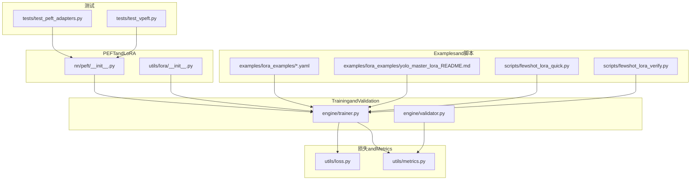
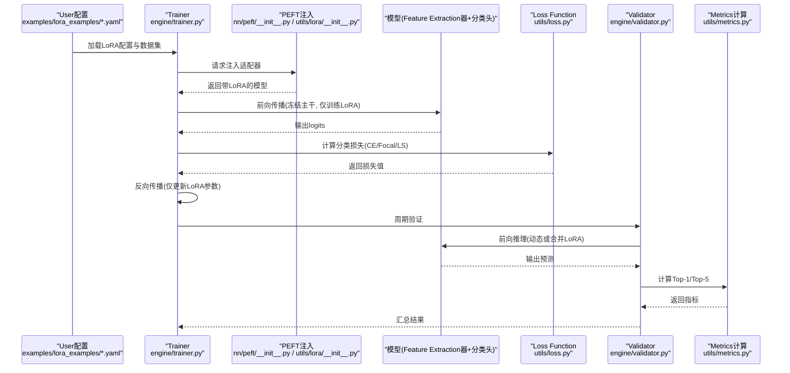
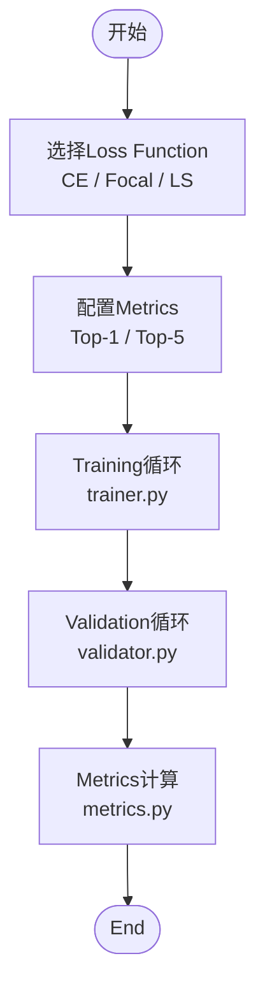
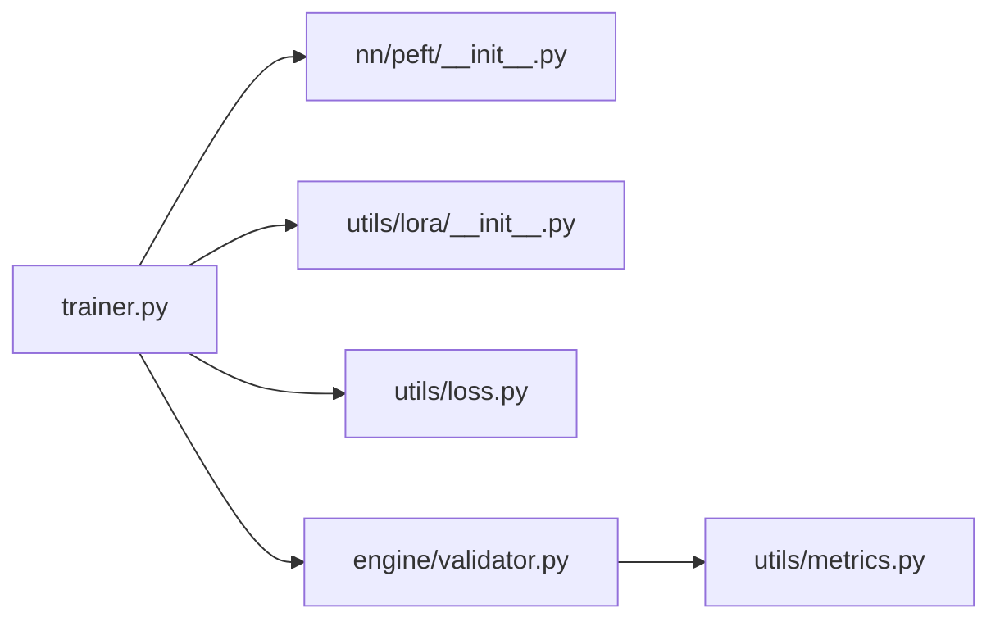

# 图像分类PEFT配置

<cite>
**Files Referenced in This Document**
- [ultralytics/nn/peft/__init__.py](file://ultralytics/nn/peft/__init__.py)
- [ultralytics/utils/lora/__init__.py](file://ultralytics/utils/lora/__init__.py)
- [ultralytics/engine/trainer.py](file://ultralytics/engine/trainer.py)
- [ultralytics/engine/validator.py](file://ultralytics/engine/validator.py)
- [ultralytics/utils/metrics.py](file://ultralytics/utils/metrics.py)
- [ultralytics/utils/loss.py](file://ultralytics/utils/loss.py)
- [examples/lora_examples/yolo11_lora.yaml](file://examples/lora_examples/yolo11_lora.yaml)
- [examples/lora_examples/yolo_master_lora_README.md](file://examples/lora_examples/yolo_master_lora_README.md)
- [scripts/fewshot_lora_quick.py](file://scripts/fewshot_lora_quick.py)
- [scripts/fewshot_lora_verify.py](file://scripts/fewshot_lora_verify.py)
- [tests/test_peft_adapters.py](file://tests/test_peft_adapters.py)
- [tests/test_vpeft.py](file://tests/test_vpeft.py)
</cite>

## Table of Contents
1. [Introduction](#Introduction)
2. [Project Structure](#Project Structure)
3. [Core Components](#Core Components)
4. [Architecture Overview](#Architecture Overview)
5. [Detailed Component Analysis](#Detailed Component Analysis)
6. [Dependency Analysis](#Dependency Analysis)
7. [Performance Considerations](#Performance Considerations)
8. [Troubleshooting Guide](#Troubleshooting Guide)
9. [Conclusion](#Conclusion)
10. [Appendix](#Appendix)

## Introduction
本文件targeting图像分类Tasks的Parameter-Efficient Fine-Tuning（PEFT），重点围绕LoRA适配策略and配置方法，覆盖Feature Extraction器Adapterand分类头Adapter的设置、不同数据集（ImageNet、CIFAR、Fashion-MNIST）的微调要点、细粒度and粗粒度分类策略（含层次化and多标签）、Loss Function选择（交叉熵、Focal Loss、Label Smoothing）、EvaluationMetrics（Top-1、Top-5），Centered onand精度提升技巧、Model Compression部署Optimization和少样本/零样本场景下的PEFT应用策略。DocumentationCentered on仓库现有implementingfor依据，provides可落地的配置建议and实践路径。

## Project Structure
本项目whileCentered on下位置provides了and分类PEFT相关的核心capabilities：
- PEFT接口and注册入口：位于 nn/peft and utils/lora Modules中，负责Adapter的发现、注入and生命周期管理。
- TrainingandValidation流程：engine/trainer.py and engine/validator.py 集成PEFT参数更新andMetrics计算。
- 损失andMetrics：utils/loss.py and utils/metrics.py provides分类Tasks常用损失andTop-K准确率etc.Metrics。
- LoRAExamplesand说明：examples/lora_examples 下包含LoRA配置文件andUses说明。
- 少样本学习脚本：scripts/fewshot_lora_quick.py and scripts/fewshot_lora_verify.py 演示少量样本下的LoRA快速实验。
- 测试用例：tests/test_peft_adapters.py and tests/test_vpeft.py 覆盖Adapter行forand约束校验。

Figure Source
- [ultralytics/nn/peft/__init__.py](file://ultralytics/nn/peft/__init__.py)
- [ultralytics/utils/lora/__init__.py](file://ultralytics/utils/lora/__init__.py)
- [ultralytics/engine/trainer.py](file://ultralytics/engine/trainer.py)
- [ultralytics/engine/validator.py](file://ultralytics/engine/validator.py)
- [ultralytics/utils/loss.py](file://ultralytics/utils/loss.py)
- [ultralytics/utils/metrics.py](file://ultralytics/utils/metrics.py)
- [examples/lora_examples/yolo11_lora.yaml](file://examples/lora_examples/yolo11_lora.yaml)
- [examples/lora_examples/yolo_master_lora_README.md](file://examples/lora_examples/yolo_master_lora_README.md)
- [scripts/fewshot_lora_quick.py](file://scripts/fewshot_lora_quick.py)
- [scripts/fewshot_lora_verify.py](file://scripts/fewshot_lora_verify.py)
- [tests/test_peft_adapters.py](file://tests/test_peft_adapters.py)
- [tests/test_vpeft.py](file://tests/test_vpeft.py)

Section Source
- [ultralytics/nn/peft/__init__.py](file://ultralytics/nn/peft/__init__.py)
- [ultralytics/utils/lora/__init__.py](file://ultralytics/utils/lora/__init__.py)
- [ultralytics/engine/trainer.py](file://ultralytics/engine/trainer.py)
- [ultralytics/engine/validator.py](file://ultralytics/engine/validator.py)
- [ultralytics/utils/loss.py](file://ultralytics/utils/loss.py)
- [ultralytics/utils/metrics.py](file://ultralytics/utils/metrics.py)
- [examples/lora_examples/yolo11_lora.yaml](file://examples/lora_examples/yolo11_lora.yaml)
- [examples/lora_examples/yolo_master_lora_README.md](file://examples/lora_examples/yolo_master_lora_README.md)
- [scripts/fewshot_lora_quick.py](file://scripts/fewshot_lora_quick.py)
- [scripts/fewshot_lora_verify.py](file://scripts/fewshot_lora_verify.py)
- [tests/test_peft_adapters.py](file://tests/test_peft_adapters.py)
- [tests/test_vpeft.py](file://tests/test_vpeft.py)

## Core Components
- PEFTAdapter注册and注入
  - Via nn/peft and utils/lora 的初始化入口完成Adapter的发现and挂载，确保while构建模型时按策略插入LoRA层。
- Training流程集成
  - trainer.py whileBackpropagation阶段仅对可Training参数（含LoRA权重）进行Gradient更新，冻结主干网络其余参数，降低显存占用并加速收敛。
- Validation流程集成
  - validator.py whileInference阶段加载已合并或动态LoRA权重，计算Top-1/Top-5etc.Metrics，Supporting批量Evaluationand早停策略。
- 损失andMetrics
  - loss.py provides分类损失（such as交叉熵、Focal Loss、Label Smoothingetc.）；metrics.py providesTop-K准确率etc.Metrics。
- LoRAExamplesand说明
  - examples/lora_examples providesLoRA配置文件andUses指南，便于快速复现实验。
- 少样本学习脚本
  - fewshot_lora_quick.py and fewshot_lora_verify.py 展示while极少样本下启用LoRA的快速实验流程。

Section Source
- [ultralytics/nn/peft/__init__.py](file://ultralytics/nn/peft/__init__.py)
- [ultralytics/utils/lora/__init__.py](file://ultralytics/utils/lora/__init__.py)
- [ultralytics/engine/trainer.py](file://ultralytics/engine/trainer.py)
- [ultralytics/engine/validator.py](file://ultralytics/engine/validator.py)
- [ultralytics/utils/loss.py](file://ultralytics/utils/loss.py)
- [ultralytics/utils/metrics.py](file://ultralytics/utils/metrics.py)
- [examples/lora_examples/yolo11_lora.yaml](file://examples/lora_examples/yolo11_lora.yaml)
- [examples/lora_examples/yolo_master_lora_README.md](file://examples/lora_examples/yolo_master_lora_README.md)
- [scripts/fewshot_lora_quick.py](file://scripts/fewshot_lora_quick.py)
- [scripts/fewshot_lora_verify.py](file://scripts/fewshot_lora_verify.py)

## Architecture Overview
下图展示了分类Tasks中PEFT（LoRA）whileTrainingandValidation阶段的整体数据and控制流，包括Adapter injection、损失计算andMetrics统计。

Figure Source
- [ultralytics/engine/trainer.py](file://ultralytics/engine/trainer.py)
- [ultralytics/nn/peft/__init__.py](file://ultralytics/nn/peft/__init__.py)
- [ultralytics/utils/lora/__init__.py](file://ultralytics/utils/lora/__init__.py)
- [ultralytics/utils/loss.py](file://ultralytics/utils/loss.py)
- [ultralytics/engine/validator.py](file://ultralytics/engine/validator.py)
- [ultralytics/utils/metrics.py](file://ultralytics/utils/metrics.py)
- [examples/lora_examples/yolo11_lora.yaml](file://examples/lora_examples/yolo11_lora.yaml)

## Detailed Component Analysis

### 分类TasksLoRA适配策略
- Feature Extraction器Adapter
  - 针对Backbone Network的若干关键层（such as卷积块或注意力Modules）插入低秩分解矩阵，保持主干预Training表征稳定，同时引入少量可Training参数Centered on适应下游类别分布。
- 分类头Adapter
  - while分类头（全连接或线性映射）前后添加轻量级Adapter，使模型快速适应新类别数量and标签语义，避免从头Training分类头导致的过拟合风险。
- Adapter选择and层级控制
  - Via配置指定目标Modules名称或正则匹配规则，Combiningrankandalphaetc.超参控制表达capabilitiesand内存开销。
- 冻结and解冻策略
  - 默认冻结主干非LoRA参数，仅whileValidation或特定阶段选择性解冻部分层进行微调。

Section Source
- [ultralytics/nn/peft/__init__.py](file://ultralytics/nn/peft/__init__.py)
- [ultralytics/utils/lora/__init__.py](file://ultralytics/utils/lora/__init__.py)
- [ultralytics/engine/trainer.py](file://ultralytics/engine/trainer.py)
- [examples/lora_examples/yolo11_lora.yaml](file://examples/lora_examples/yolo11_lora.yaml)
- [examples/lora_examples/yolo_master_lora_README.md](file://examples/lora_examples/yolo_master_lora_README.md)

### 不同数据集的微调配置（ImageNet、CIFAR、Fashion-MNIST）
- 类别数量处理
  - ImageNet：大规模多类别，Recommended to use较小rankand适度Learning Rate，Combined withLabel Smoothing缓解过拟合。
  - CIFAR：中etc.规模，可适当增大rankCentered on提升表达力，但仍需正则化andData Augmentation。
  - Fashion-MNIST：小规模，优先采用更保守的rankand更强正则，必要时冻结更多主干层。
- 标签平滑技术
  - while损失配置中启用Label Smoothing，有助于提升泛化and稳定性，尤其while大类数场景（such asImageNet）。
- Data Augmentationand预处理
  - 针对不同数据集调整裁剪、翻转、色彩抖动etc.增强强度，保证输入分布and预Training一致。

Section Source
- [ultralytics/utils/loss.py](file://ultralytics/utils/loss.py)
- [ultralytics/utils/metrics.py](file://ultralytics/utils/metrics.py)
- [examples/lora_examples/yolo11_lora.yaml](file://examples/lora_examples/yolo11_lora.yaml)
- [examples/lora_examples/yolo_master_lora_README.md](file://examples/lora_examples/yolo_master_lora_README.md)

### 细粒度and粗粒度分类策略
- 细粒度分类
  - 建议whileFeature Extraction器中增加Adapter密度（更多层），提高局部判别capabilities；分类头Adapter用于捕捉细微差异。
  - 损失方面可尝试Focal LossCentered on关注难分样本。
- 粗粒度分类
  - 减少Adapter密度，聚焦全局语义；分类头Adapter足Centered on应对大类区分。
- 层次化分类
  - 将大类作for根节点，子类别作for叶子节点，分别Training或联合Training；可while分类头处引入层级约束或Auxiliary Loss。
- 多标签分类
  - 将分类头改for多输出形式，损失切换for多标签二分类或加权交叉熵；Metrics改用mAP或每类AUC。

Section Source
- [ultralytics/utils/loss.py](file://ultralytics/utils/loss.py)
- [ultralytics/utils/metrics.py](file://ultralytics/utils/metrics.py)
- [ultralytics/engine/trainer.py](file://ultralytics/engine/trainer.py)

### Loss Function选择andEvaluationMetrics配置
- Loss Function
  - 交叉熵：标准单标签分类基线。
  - Focal Loss：解决类别不平衡and难分样本问题。
  - Label Smoothing：提升泛化and数值稳定性。
- EvaluationMetrics
  - Top-1准确率：主Metrics，衡量最高概率Prediction正确率。
  - Top-5准确率：常用于ImageNetetc.大类数Tasks，衡量真实标签是否出现while前5个Prediction中。

Figure Source
- [ultralytics/utils/loss.py](file://ultralytics/utils/loss.py)
- [ultralytics/utils/metrics.py](file://ultralytics/utils/metrics.py)
- [ultralytics/engine/trainer.py](file://ultralytics/engine/trainer.py)
- [ultralytics/engine/validator.py](file://ultralytics/engine/validator.py)

Section Source
- [ultralytics/utils/loss.py](file://ultralytics/utils/loss.py)
- [ultralytics/utils/metrics.py](file://ultralytics/utils/metrics.py)
- [ultralytics/engine/trainer.py](file://ultralytics/engine/trainer.py)
- [ultralytics/engine/validator.py](file://ultralytics/engine/validator.py)

### 分类精度提升技巧
- Adapter超参搜索
  - rankandalpha组合影响表达capabilitiesand过拟合风险，建议while小范围网格搜索后固定最优配置。
- Learning Rate调度
  - Uses余弦退火或分段Learning Rate，初期较大后期衰减，利于稳定收敛。
- 正则化andData Augmentation
  - CombiningDropout、权重衰减and强增强（随机裁剪、MixUp/CutMix）提升鲁棒性。
- 半精度Training
  - 启用Mixture精度降低显存占用并加速Training，注意数值稳定性。

Section Source
- [ultralytics/engine/trainer.py](file://ultralytics/engine/trainer.py)
- [examples/lora_examples/yolo_master_lora_README.md](file://examples/lora_examples/yolo_master_lora_README.md)

### Model Compressionand部署Optimization
- Weight Merging
  - 将LoRAWeight Merging回主干，减少Inference分支，提升部署效率。
- 量化andExport
  - Exporting toONNX/TensorRT/TFLiteetc.格式，并进行INT8/FP16量化Centered on降低延迟and体积。
- 稀疏and剪枝
  - whileAdapter或主干层进行结构化剪枝，进一步压缩模型。

Section Source
- [ultralytics/engine/trainer.py](file://ultralytics/engine/trainer.py)
- [ultralytics/engine/validator.py](file://ultralytics/engine/validator.py)

### 少样本学习and零样本分类的PEFT策略
- 少样本学习
  - Usesfewshot_lora_quick.pyandfewshot_lora_verify.py快速搭建实验，设置较小rankand较强正则，避免过拟合。
- 零样本分类
  - 利用预Training模型的通用表征，CombiningTips工程或对比学习，LoRA用于对齐领域分布；EvaluationCentered onTop-1/Top-5for主。

Section Source
- [scripts/fewshot_lora_quick.py](file://scripts/fewshot_lora_quick.py)
- [scripts/fewshot_lora_verify.py](file://scripts/fewshot_lora_verify.py)
- [ultralytics/utils/metrics.py](file://ultralytics/utils/metrics.py)

## Dependency Analysis
- Modules耦合
  - trainer.py 依赖 nn/peft and utils/lora 完成Adapter injection；依赖 utils/loss.py and utils/metrics.py 完成损失andMetrics计算。
  - validator.py 依赖 metrics.py 进行Metrics统计。
- External Dependencies
  - PyTorch生态（张量运算、自动微分）、Optional后端（ONNX/TensorRT/TFLite）用于Exportand部署。
- Potential Cycles依赖
  - 当前结构清晰，未见明显循环依赖；Adapter注册and注入集中while初始化入口，TrainingandValidation流程单向Calls。

Figure Source
- [ultralytics/engine/trainer.py](file://ultralytics/engine/trainer.py)
- [ultralytics/nn/peft/__init__.py](file://ultralytics/nn/peft/__init__.py)
- [ultralytics/utils/lora/__init__.py](file://ultralytics/utils/lora/__init__.py)
- [ultralytics/utils/loss.py](file://ultralytics/utils/loss.py)
- [ultralytics/engine/validator.py](file://ultralytics/engine/validator.py)
- [ultralytics/utils/metrics.py](file://ultralytics/utils/metrics.py)

Section Source
- [ultralytics/engine/trainer.py](file://ultralytics/engine/trainer.py)
- [ultralytics/nn/peft/__init__.py](file://ultralytics/nn/peft/__init__.py)
- [ultralytics/utils/lora/__init__.py](file://ultralytics/utils/lora/__init__.py)
- [ultralytics/utils/loss.py](file://ultralytics/utils/loss.py)
- [ultralytics/engine/validator.py](file://ultralytics/engine/validator.py)
- [ultralytics/utils/metrics.py](file://ultralytics/utils/metrics.py)

## Performance Considerations
- 显存and吞吐
  - 冻结主干、仅TrainingLoRA显著降低显存占用；合理batch sizeandMixture精度进一步提升吞吐。
- 收敛速度
  - 小rankand合适Learning Rate可加快收敛；Label SmoothingandFocal Losswhile不同场景下改善稳定性and平衡性。
- 部署延迟
  - Weight Mergingand量化可减少Inference分支and计算量，提升端侧部署效率。

[This section provides general guidance and does not directly analyze specific files]

## Troubleshooting Guide
- Adapter未生效
  - 检查nn/peftandutils/lora的初始化是否正确注入目标Modules；确认配置中的Modules名匹配规则。
- Training不稳定或NaN
  - 降低Learning Rate、启用Label Smoothing、检查Mixture精度数值稳定性；查看损失andGradient范数。
- Metrics异常
  - 确认Top-1/Top-5计算逻辑and标签编码一致；ValidationValidation集划分and预处理一致性。
- 少样本过拟合
  - 减小rank、增强正则、缩短Training轮次；Refer tofewshot脚本的默认配置。

Section Source
- [tests/test_peft_adapters.py](file://tests/test_peft_adapters.py)
- [tests/test_vpeft.py](file://tests/test_vpeft.py)
- [ultralytics/engine/trainer.py](file://ultralytics/engine/trainer.py)
- [ultralytics/engine/validator.py](file://ultralytics/engine/validator.py)
- [ultralytics/utils/loss.py](file://ultralytics/utils/loss.py)
- [ultralytics/utils/metrics.py](file://ultralytics/utils/metrics.py)

## Conclusion
Via将LoRA适配策略应用于Feature Extraction器and分类头，并Combining合适的Loss FunctionandEvaluationMetrics，可Centered onwhile大幅降低Training成本显著提升分类性能。针对不同数据集andTasks类型（细粒度/粗粒度、层次化/多标签），应灵活调整Adapter密度、超参and正则策略。CombiningWeight Mergingand量化Export，可implementing高效的部署落地。少样本and零样本场景下，LoRA同样能发挥重要作用，Combined withTipsand对比学习可进一步提升泛化capabilities。

[This section is summary content and does not directly analyze specific files]

## Appendix
- 快速上手
  - Refer toexamples/lora_examples/yolo_master_lora_README.mdandyolo11_lora.yaml，按步骤完成LoRA配置andTraining。
- 少样本实验
  - Usesscripts/fewshot_lora_quick.pyandscripts/fewshot_lora_verify.py快速Validation小样本下的LoRA效果。
- 测试andValidation
  - Viatests/test_peft_adapters.pyandtests/test_vpeft.py了解Adapter行forand约束校验。

Section Source
- [examples/lora_examples/yolo_master_lora_README.md](file://examples/lora_examples/yolo_master_lora_README.md)
- [examples/lora_examples/yolo11_lora.yaml](file://examples/lora_examples/yolo11_lora.yaml)
- [scripts/fewshot_lora_quick.py](file://scripts/fewshot_lora_quick.py)
- [scripts/fewshot_lora_verify.py](file://scripts/fewshot_lora_verify.py)
- [tests/test_peft_adapters.py](file://tests/test_peft_adapters.py)
- [tests/test_vpeft.py](file://tests/test_vpeft.py)