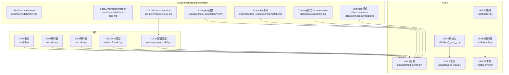
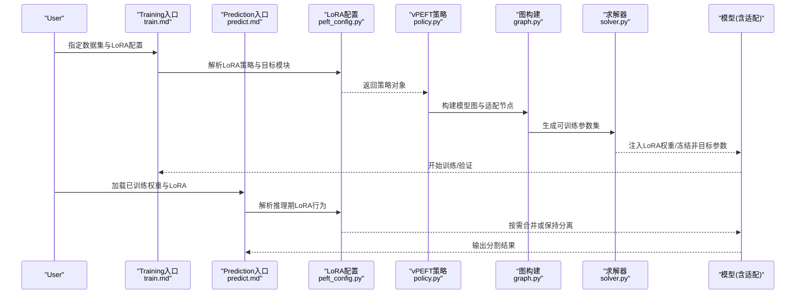
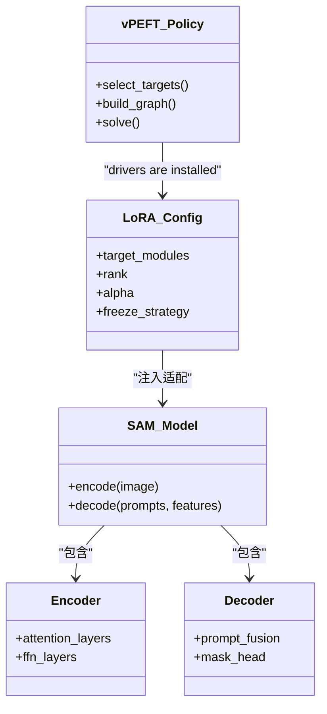
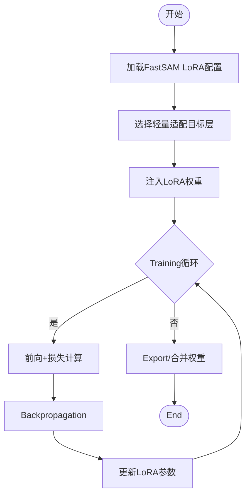
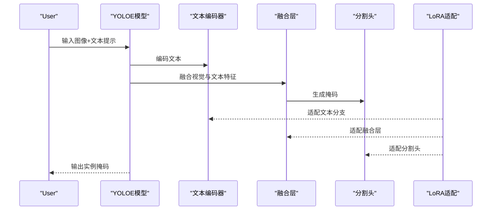
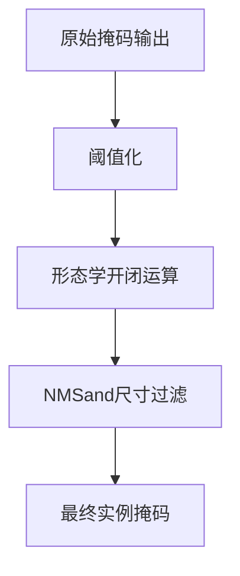
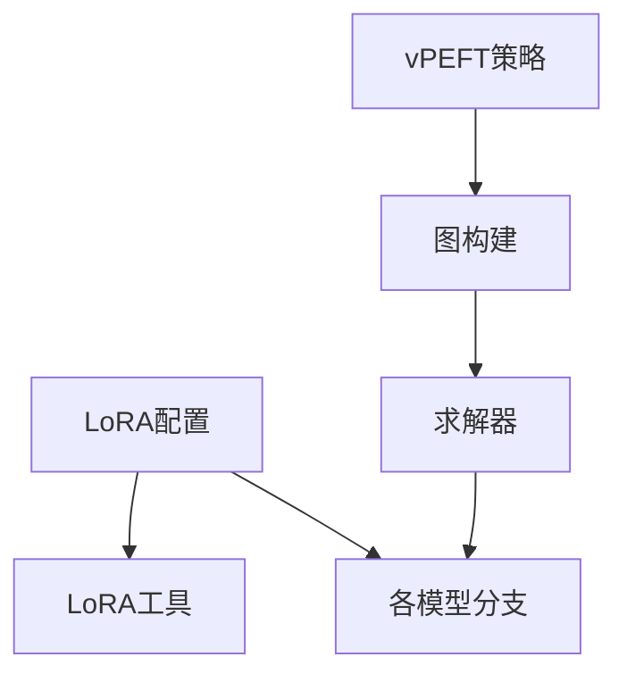

# Instance SegmentationPEFT配置

<cite>
**Files Referenced in This Document**
- [ultralytics/models/sam/model.py](file://ultralytics/models/sam/model.py)
- [ultralytics/models/sam/encoder.py](file://ultralytics/models/sam/encoder.py)
- [ultralytics/models/sam/decoder.py](file://ultralytics/models/sam/decoder.py)
- [ultralytics/models/fastsam/model.py](file://ultralytics/models/fastsam/model.py)
- [ultralytics/models/yolo/segment/model.py](file://ultralytics/models/yolo/segment/model.py)
- [ultralytics/models/yolo/segment/train.py](file://ultralytics/models/yolo/segment/train.py)
- [ultralytics/models/yolo/segment/predict.py](file://ultralytics/models/yolo/segment/predict.py)
- [ultralytics/utils/lora/__init__.py](file://ultralytics/utils/lora/__init__.py)
- [ultralytics/utils/lora/peft_config.py](file://ultralytics/utils/lora/peft_config.py)
- [ultralytics/utils/lora/peft_utils.py](file://ultralytics/utils/lora/peft_utils.py)
- [ultralytics/vpeft/__init__.py](file://ultralytics/vpeft/__init__.py)
- [ultralytics/vpeft/policy.py](file://ultralytics/vpeft/policy.py)
- [ultralytics/vpeft/graph.py](file://ultralytics/vpeft/graph.py)
- [ultralytics/vpeft/solver.py](file://ultralytics/vpeft/solver.py)
- [examples/lora_examples/yolo11_lora.yaml](file://examples/lora_examples/yolo11_lora.yaml)
- [examples/lora_examples/yolo_master_lora_README.md](file://examples/lora_examples/yolo_master_lora_README.md)
- [scripts/ablation_suite/ablation_peft_coco128.py](file://scripts/ablation_suite/ablation_peft_coco128.py)
- [tests/test_moe_aware_peft.py](file://tests/test_moe_aware_peft.py)
- [tests/test_peft_adapters.py](file://tests/test_peft_adapters.py)
- [docs/en/modes/train.md](file://docs/en/modes/train.md)
- [docs/en/modes/predict.md](file://docs/en/modes/predict.md)
- [docs/en/models/sam.md](file://docs/en/models/sam.md)
- [docs/en/models/fast-sam.md](file://docs/en/models/fast-sam.md)
- [docs/en/models/yoloe.md](file://docs/en/models/yoloe.md)
</cite>

## Table of Contents
1. [Introduction](#Introduction)
2. [Project Structure](#Project Structure)
3. [Core Components](#Core Components)
4. [Architecture Overview](#Architecture Overview)
5. [Detailed Component Analysis](#Detailed Component Analysis)
6. [Dependency Analysis](#Dependency Analysis)
7. [Performance Considerations](#Performance Considerations)
8. [Troubleshooting Guide](#Troubleshooting Guide)
9. [Conclusion](#Conclusion)
10. [Appendix](#Appendix)

## Introduction
本文件targeting“Instance Segmentation”Tasks，系统化梳理whileYOLO-Master代码库中基于PEFT（Parameter-Efficient Fine-Tuning）的适配策略and配置方法。重点覆盖：
- SAM系列模型的LoRAAdapter配置（编码器/解码器分层适配）
- FastSAM轻量化适配and实时分割场景Optimization
- YOLOE（YOLO-Edge）分割模型的PEFT应用（文本引导、零样本）
- 自定义分割头TrainingExamples（掩码生成andPost-ProcessingOptimization）
- 不同分割Tasks的数据格式and标注转换要求
- 精度提升技巧andInference速度Optimization策略

## Project Structure
围绕Instance SegmentationandPEFT的关键Table of Contentsand文件such as下：
- 模型implementing
  - SAM系列：[ultralytics/models/sam/model.py](file://ultralytics/models/sam/model.py)、[ultralytics/models/sam/encoder.py](file://ultralytics/models/sam/encoder.py)、[ultralytics/models/sam/decoder.py](file://ultralytics/models/sam/decoder.py)
  - FastSAM：[ultralytics/models/fastsam/model.py](file://ultralytics/models/fastsam/model.py)
  - YOLO分割：[ultralytics/models/yolo/segment/model.py](file://ultralytics/models/yolo/segment/model.py)、[train.py](file://ultralytics/models/yolo/segment/train.py)、[predict.py](file://ultralytics/models/yolo/segment/predict.py)
- PEFT/Lora工具
  - LoRA配置and工具：[ultralytics/utils/lora/__init__.py](file://ultralytics/utils/lora/__init__.py)、[peft_config.py](file://ultralytics/utils/lora/peft_config.py)、[peft_utils.py](file://ultralytics/utils/lora/peft_utils.py)
  - vPEFT策略and求解：[ultralytics/vpeft/__init__.py](file://ultralytics/vpeft/__init__.py)、[policy.py](file://ultralytics/vpeft/policy.py)、[graph.py](file://ultralytics/vpeft/graph.py)、[solver.py](file://ultralytics/vpeft/solver.py)
- Examplesand脚本
  - LoRAExamples配置and说明：[examples/lora_examples/yolo11_lora.yaml](file://examples/lora_examples/yolo11_lora.yaml)、[examples/lora_examples/yolo_master_lora_README.md](file://examples/lora_examples/yolo_master_lora_README.md)
  - PEFT消融andValidation：[scripts/ablation_suite/ablation_peft_coco128.py](file://scripts/ablation_suite/ablation_peft_coco128.py)
  - 测试用例：[tests/test_moe_aware_peft.py](file://tests/test_moe_aware_peft.py)、[tests/test_peft_adapters.py](file://tests/test_peft_adapters.py)
- Documentation
  - Training/Prediction模式：[docs/en/modes/train.md](file://docs/en/modes/train.md)、[docs/en/modes/predict.md](file://docs/en/modes/predict.md)
  - 模型Documentation：[docs/en/models/sam.md](file://docs/en/models/sam.md)、[docs/en/models/fast-sam.md](file://docs/en/models/fast-sam.md)、[docs/en/models/yoloe.md](file://docs/en/models/yoloe.md)

Figure Source
- [ultralytics/models/sam/model.py](file://ultralytics/models/sam/model.py)
- [ultralytics/models/sam/encoder.py](file://ultralytics/models/sam/encoder.py)
- [ultralytics/models/sam/decoder.py](file://ultralytics/models/sam/decoder.py)
- [ultralytics/models/fastsam/model.py](file://ultralytics/models/fastsam/model.py)
- [ultralytics/models/yolo/segment/model.py](file://ultralytics/models/yolo/segment/model.py)
- [ultralytics/utils/lora/__init__.py](file://ultralytics/utils/lora/__init__.py)
- [ultralytics/utils/lora/peft_config.py](file://ultralytics/utils/lora/peft_config.py)
- [ultralytics/utils/lora/peft_utils.py](file://ultralytics/utils/lora/peft_utils.py)
- [ultralytics/vpeft/policy.py](file://ultralytics/vpeft/policy.py)
- [ultralytics/vpeft/graph.py](file://ultralytics/vpeft/graph.py)
- [ultralytics/vpeft/solver.py](file://ultralytics/vpeft/solver.py)
- [examples/lora_examples/yolo11_lora.yaml](file://examples/lora_examples/yolo11_lora.yaml)
- [examples/lora_examples/yolo_master_lora_README.md](file://examples/lora_examples/yolo_master_lora_README.md)
- [docs/en/modes/train.md](file://docs/en/modes/train.md)
- [docs/en/modes/predict.md](file://docs/en/modes/predict.md)
- [docs/en/models/sam.md](file://docs/en/models/sam.md)
- [docs/en/models/fast-sam.md](file://docs/en/models/fast-sam.md)
- [docs/en/models/yoloe.md](file://docs/en/models/yoloe.md)

Section Source
- [ultralytics/models/sam/model.py](file://ultralytics/models/sam/model.py)
- [ultralytics/models/sam/encoder.py](file://ultralytics/models/sam/encoder.py)
- [ultralytics/models/sam/decoder.py](file://ultralytics/models/sam/decoder.py)
- [ultralytics/models/fastsam/model.py](file://ultralytics/models/fastsam/model.py)
- [ultralytics/models/yolo/segment/model.py](file://ultralytics/models/yolo/segment/model.py)
- [ultralytics/utils/lora/peft_config.py](file://ultralytics/utils/lora/peft_config.py)
- [ultralytics/utils/lora/peft_utils.py](file://ultralytics/utils/lora/peft_utils.py)
- [ultralytics/vpeft/policy.py](file://ultralytics/vpeft/policy.py)
- [ultralytics/vpeft/graph.py](file://ultralytics/vpeft/graph.py)
- [ultralytics/vpeft/solver.py](file://ultralytics/vpeft/solver.py)
- [examples/lora_examples/yolo11_lora.yaml](file://examples/lora_examples/yolo11_lora.yaml)
- [examples/lora_examples/yolo_master_lora_README.md](file://examples/lora_examples/yolo_master_lora_README.md)
- [docs/en/modes/train.md](file://docs/en/modes/train.md)
- [docs/en/modes/predict.md](file://docs/en/modes/predict.md)
- [docs/en/models/sam.md](file://docs/en/models/sam.md)
- [docs/en/models/fast-sam.md](file://docs/en/models/fast-sam.md)
- [docs/en/models/yoloe.md](file://docs/en/models/yoloe.md)

## Core Components
- LoRA配置and装配
  - Via统一配置入口加载并解析LoRA策略，Supporting按Modules/层粒度选择目标子Modules进行适配。
  - providesGeneral Utility Functions用于权重注入、冻结/解冻控制、Centered onandExport时的合并或分离策略。
- vPEFT策略and图求解
  - 策略定义可插拔的适配规则；图构建将模型计算图and适配节点关联；求解器负责生成最终的可Training参数集合andOptimizer分组。
- 模型适配点
  - SAM：编码器（图像Feature Extraction）and解码器（Tipsto掩码映射）均可独立或联合接入LoRA。
  - FastSAM：targeting轻量化的适配，优先对关键注意力/投影层插入低秩矩阵，兼顾实时性。
  - YOLO分割：针对分割头（掩码分支）andBackbone Network特定层进行LoRA，Supporting文本引导and零样本扩展。

Section Source
- [ultralytics/utils/lora/peft_config.py](file://ultralytics/utils/lora/peft_config.py)
- [ultralytics/utils/lora/peft_utils.py](file://ultralytics/utils/lora/peft_utils.py)
- [ultralytics/vpeft/policy.py](file://ultralytics/vpeft/policy.py)
- [ultralytics/vpeft/graph.py](file://ultralytics/vpeft/graph.py)
- [ultralytics/vpeft/solver.py](file://ultralytics/vpeft/solver.py)
- [ultralytics/models/sam/model.py](file://ultralytics/models/sam/model.py)
- [ultralytics/models/sam/encoder.py](file://ultralytics/models/sam/encoder.py)
- [ultralytics/models/sam/decoder.py](file://ultralytics/models/sam/decoder.py)
- [ultralytics/models/fastsam/model.py](file://ultralytics/models/fastsam/model.py)
- [ultralytics/models/yolo/segment/model.py](file://ultralytics/models/yolo/segment/model.py)

## Architecture Overview
下图展示从配置toTraining/Inference的端to端流程，包括LoRA装配、vPEFT策略执行、Centered onand各模型分支的适配路径。

Figure Source
- [docs/en/modes/train.md](file://docs/en/modes/train.md)
- [docs/en/modes/predict.md](file://docs/en/modes/predict.md)
- [ultralytics/utils/lora/peft_config.py](file://ultralytics/utils/lora/peft_config.py)
- [ultralytics/vpeft/policy.py](file://ultralytics/vpeft/policy.py)
- [ultralytics/vpeft/graph.py](file://ultralytics/vpeft/graph.py)
- [ultralytics/vpeft/solver.py](file://ultralytics/vpeft/solver.py)

## Detailed Component Analysis

### SAM系列LoRA适配（编码器/解码器分层策略）
- 适配要点
  - 编码器侧：对视觉Transformer的关键注意力andFFN层插入低秩矩阵，增强图像表征capabilities。
  - 解码器侧：对Tips融合and掩码生成路径中的线性/卷积层进行LoRA，提高Tips敏感性and掩码边界质量。
  - 组合策略：可单独适配编码器、解码器或两者同时适配，依据数据规模andTasks复杂度选择。
- 配置建议
  - rankandalpha：小数据用较小rank避免过拟合；大数据可适当增大rankCentered on提升表达capabilities。
  - target_modules：优先选择注意力Q/K/V投影and掩码分支线性层。
  - 冻结策略：固定主干Pre-trained Weights，仅TrainingLoRA参数，降低显存占用。
- Training/Inference流程
  - Training时保持LoRA分离，便于多Tasks切换；Inference时可按需合并Centered on加速。

Figure Source
- [ultralytics/models/sam/model.py](file://ultralytics/models/sam/model.py)
- [ultralytics/models/sam/encoder.py](file://ultralytics/models/sam/encoder.py)
- [ultralytics/models/sam/decoder.py](file://ultralytics/models/sam/decoder.py)
- [ultralytics/utils/lora/peft_config.py](file://ultralytics/utils/lora/peft_config.py)
- [ultralytics/vpeft/policy.py](file://ultralytics/vpeft/policy.py)

Section Source
- [ultralytics/models/sam/model.py](file://ultralytics/models/sam/model.py)
- [ultralytics/models/sam/encoder.py](file://ultralytics/models/sam/encoder.py)
- [ultralytics/models/sam/decoder.py](file://ultralytics/models/sam/decoder.py)
- [ultralytics/utils/lora/peft_config.py](file://ultralytics/utils/lora/peft_config.py)
- [ultralytics/vpeft/policy.py](file://ultralytics/vpeft/policy.py)

### FastSAM轻量化适配and实时分割Optimization
- 适配要点
  - 优先对轻量主干中的关键投影层and掩码头进行LoRA，减少额外计算开销。
  - Combining动态分辨率and滑动窗口Inference，平衡速度and精度。
- 配置建议
  - Uses较小的rankand稀疏target_modules，确保实时性。
  - Inference阶段启用ONNX/TensorRTExport，关闭不必要的GradientandLogging。
- Training/Inference流程
  - Training时采用Mixture精度andGradient累积；Inference时合并LoRA权重Centered on减少算子数量。

Figure Source
- [ultralytics/models/fastsam/model.py](file://ultralytics/models/fastsam/model.py)
- [ultralytics/utils/lora/peft_config.py](file://ultralytics/utils/lora/peft_config.py)

Section Source
- [ultralytics/models/fastsam/model.py](file://ultralytics/models/fastsam/model.py)
- [ultralytics/utils/lora/peft_config.py](file://ultralytics/utils/lora/peft_config.py)

### YOLOE（YOLO-Edge）分割模型的PEFT应用
- 适配要点
  - 针对文本引导and零样本分割，适配文本编码器and视觉-文本融合层，提升跨模态对齐capabilities。
  - 分割头（掩码分支）可独立LoRA，Centered on增强类别无关的掩码生成。
- 配置建议
  - for文本分支and融合层设置较高rank，视觉主干保持较低rank或冻结。
  - Uses对比学习Auxiliary Loss，促进零样本泛化。
- Training/Inference流程
  - Training时联合Optimization文本-视觉对齐and掩码质量；Inference时根据Tips词动态激活相应LoRA路径。

Figure Source
- [ultralytics/models/yolo/segment/model.py](file://ultralytics/models/yolo/segment/model.py)
- [ultralytics/utils/lora/peft_config.py](file://ultralytics/utils/lora/peft_config.py)

Section Source
- [ultralytics/models/yolo/segment/model.py](file://ultralytics/models/yolo/segment/model.py)
- [ultralytics/utils/lora/peft_config.py](file://ultralytics/utils/lora/peft_config.py)

### 自定义分割头TrainingExamples（掩码生成andPost-ProcessingOptimization）
- 掩码生成
  - while分割头输出原始掩码分数后，进行阈值化and形态学操作，提升边界平滑度。
  - 引入掩码一致性约束，抑制噪声区域。
- Post-ProcessingOptimization
  - NMS变体：基于IoUand掩码相似度的双重过滤。
  - 尺寸过滤：剔除过小或过大掩码，减少误检。
- Training流程
  - Uses标准分割损失（such asDice+BCE），Combined withLoRA适配分割头and骨干特定层。

Section Source
- [ultralytics/models/yolo/segment/predict.py](file://ultralytics/models/yolo/segment/predict.py)
- [ultralytics/models/yolo/segment/train.py](file://ultralytics/models/yolo/segment/train.py)

### 数据格式and标注转换
- COCO格式
  - 图像列表andJSON标注，包含bbox、segmentation（RLE或多边形）、类别ID。
  - 适用于YOLO分割andSAM/FastSAM的半监督/弱监督场景。
- YOLO格式
  - 每类一个txt文件，行格式for“类别 x_center y_center width height”，掩码Centered onPNG形式存储。
  - 适合快速迭代andEdge Deployment。
- 转换建议
  - UsesBuilt-in转换脚本或第三方工具将COCO转YOLO，确保路径一致and类别映射正确。
  - 对于SAM/FastSAM，可保留COCO格式Centered on利用其原生Tips接口。

Section Source
- [docs/en/modes/train.md](file://docs/en/modes/train.md)
- [docs/en/modes/predict.md](file://docs/en/modes/predict.md)

## Dependency Analysis
- 内部依赖
  - LoRA配置and工具被各模型分支复用，形成统一的适配入口。
  - vPEFT策略and图求解贯穿TrainingandInference，确保参数选择的一致性。
- External Dependencies
  - PyTorch、ONNX、TensorRTetc.用于TrainingandExport。
  - Optional：OpenCV、scikit-image用于Post-Processing。

Figure Source
- [ultralytics/utils/lora/peft_config.py](file://ultralytics/utils/lora/peft_config.py)
- [ultralytics/utils/lora/peft_utils.py](file://ultralytics/utils/lora/peft_utils.py)
- [ultralytics/vpeft/policy.py](file://ultralytics/vpeft/policy.py)
- [ultralytics/vpeft/graph.py](file://ultralytics/vpeft/graph.py)
- [ultralytics/vpeft/solver.py](file://ultralytics/vpeft/solver.py)

Section Source
- [ultralytics/utils/lora/peft_config.py](file://ultralytics/utils/lora/peft_config.py)
- [ultralytics/utils/lora/peft_utils.py](file://ultralytics/utils/lora/peft_utils.py)
- [ultralytics/vpeft/policy.py](file://ultralytics/vpeft/policy.py)
- [ultralytics/vpeft/graph.py](file://ultralytics/vpeft/graph.py)
- [ultralytics/vpeft/solver.py](file://ultralytics/vpeft/solver.py)

## Performance Considerations
- TrainingOptimization
  - Mixture精度andGradient累积，提升吞吐and稳定性。
  - 仅TrainingLoRA参数，冻结主干，显著降低显存占用。
- InferenceOptimization
  - 合并LoRA权重至主干，减少算子数量。
  - UsesONNX/TensorRTExport，开启FP16/INT8量化（视硬件Supporting）。
  - 动态分辨率and滑动窗口裁剪，平衡速度and精度。

## Troubleshooting Guide
- 常见问题
  - 显存不足：减小batch size、启用GradientCheckpoint或降低rank。
  - 收敛缓慢：调整Learning Rate、增加LoRA层数或rank。
  - Export Failure：检查LoRA合并逻辑and后端兼容性。
- 调试建议
  - 打印可Training参数比例and分布，确认目标Modules是否正确注入。
  - Uses最小数据集复现问题，逐步扩大范围定位。

Section Source
- [tests/test_moe_aware_peft.py](file://tests/test_moe_aware_peft.py)
- [tests/test_peft_adapters.py](file://tests/test_peft_adapters.py)

## Conclusion
ViawhileSAM、FastSAMandYOLOEetc.模型上实施精细化的LoRA适配，并CombiningvPEFT策略and图求解，可while保证精度显著降低Training成本andInference延迟。合理的数据格式andPost-ProcessingOptimization进一步提升了实用性and鲁棒性。

## Appendix
- Examples配置Refer to
  - [examples/lora_examples/yolo11_lora.yaml](file://examples/lora_examples/yolo11_lora.yaml)
  - [examples/lora_examples/yolo_master_lora_README.md](file://examples/lora_examples/yolo_master_lora_README.md)
- 消融andValidation脚本
  - [scripts/ablation_suite/ablation_peft_coco128.py](file://scripts/ablation_suite/ablation_peft_coco128.py)
- 模型Documentation
  - [docs/en/models/sam.md](file://docs/en/models/sam.md)
  - [docs/en/models/fast-sam.md](file://docs/en/models/fast-sam.md)
  - [docs/en/models/yoloe.md](file://docs/en/models/yoloe.md)